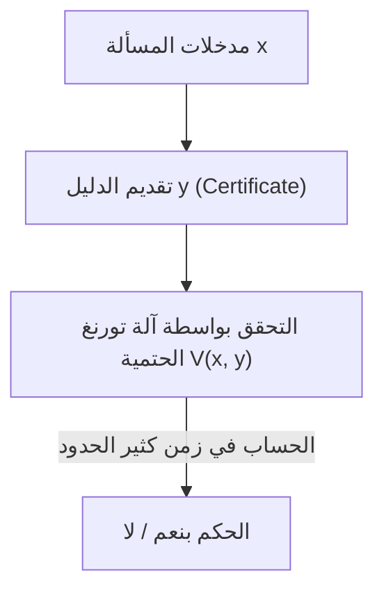
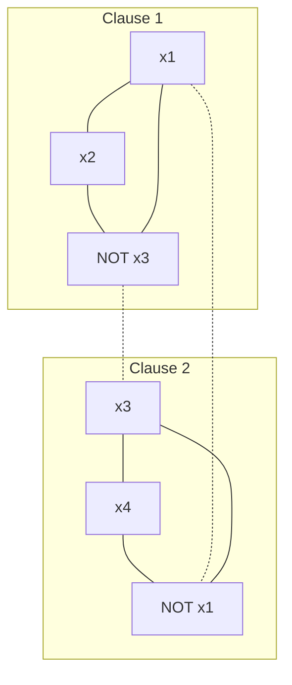

هناك مسألة غير محلولة تعتبر الأشهر والأكثر أهمية في الرياضيات الحديثة وعلوم الحاسوب. إنها "مسألة P مقابل NP" (P vs NP Problem). هذه المسألة، التي رُصدت لها جائزة قدرها مليون دولار كواحدة من مسائل جائزة الألفية التي حددها معهد كلاي للرياضيات، ليست مجرد لغز فكري أو تسلية لتمضية الوقت لعلماء الرياضيات.

إنها موضوع أساسي للغاية يرتبط ارتباطاً مباشراً بأمن الإنترنت الذي يدعم مجتمعنا، وتحسين اللوجستيات والشبكات، والتنبؤ ببنية البروتين في اكتشاف الأدوية، وتحسين نماذج التعلم في الذكاء الاصطناعي، وحتى الأسئلة الفلسفية مثل "ما هو الإبداع البشري؟" و "هل يمكن أتمتة إثبات النظريات الرياضية؟".

في هذا المقال، سنقوم بتشريح مسألة P مقابل NP بالكامل، بدءاً من أساسيات نظرية التعقيد الحسابي (Computational Complexity Theory)، واكتشاف اكتمال NP من خلال نظرية كوك-ليفين، والتصنيف الدقيق لفئات التعقيد، والعقبات الثلاث الضخمة التي تعيق الإثبات (النسبوية، والإثباتات الطبيعية، والجبرنة)، ونهج نظرية التعقيد الهندسي (GCT) الأحدث، والعلاقة مع فئة التعقيد الكمومي (BQP)، وصولاً إلى التنفيذ العملي لبرنامج حل SAT بلغة بايثون. من خلال هذا الشرح المفصل الذي يمتد لعشرات الآلاف من الحروف، دعونا نلامس أعماق نظرية التعقيد الحسابي.

## الفصل الأول: ولادة نظرية التعقيد الحسابي وأساسيات آلة تورنغ

لفهم مسألة P مقابل NP بدقة، من الضروري أولاً تعريف "الحساب" و"الحساب الفعال" بشكل رياضي صارم. في الثلاثينيات من القرن العشرين، وكرد فعل سلبي على "مسألة القرار" (Entscheidungsproblem) التي اقترحها ديفيد هيلبرت، ابتكر آلان تورنغ نموذجاً حسابياً مجرداً هو "آلة تورنغ" (Turing Machine) لصياغة "ما يمكن حسابه" رياضياً. جنباً إلى جنب مع حساب لامدا لألونزو تشيرش، يعتبر مفهوم آلة تورنغ هذا أساس علوم الحاسوب الحديثة تحت اسم "أطروحة تشيرش-تورنغ".

### آلة تورنغ الحتمية (DTM) والفئة P
تتكون آلة تورنغ الحتمية (Deterministic Turing Machine: DTM) من شريط أحادي البعد لا نهائي الطول، ورأس يقرأ ويكتب على هذا الشريط، ووحدة تحكم تحتوي على عدد محدود من الحالات. عندما تتم قراءة حالة معينة ورمز على الشريط، يتم دائماً تحديد الإجراء التالي الذي يجب أن تتخذه الآلة (الرمز الذي سيتم كتابته، اتجاه حركة الرأس، الحالة التالية) بشكل فريد.

بشكل أكثر دقة، يتم تعريف دالة الانتقال $\delta$ لـ DTM على النحو التالي:
$$ \delta: Q \times \Gamma \to Q \times \Gamma \times \{L, R\} $$
هنا، $Q$ هي مجموعة منتهية من الحالات، و $\Gamma$ هي مجموعة منتهية من رموز الشريط (بما في ذلك الرمز الفارغ)، و $L, R$ هما اتجاها حركة الرأس (يسار، يمين). تُسمى "حتمية" لأن انتقال الحالة بالنسبة للمدخلات يرسم مساراً واحداً (Deterministic Path).

**الفئة P (Polynomial-time)** هي مجموعة من مسائل القرار (المسائل التي يُجاب عليها بنعم/لا) التي يمكن حلها باستخدام هذه الآلة DTM في زمن كثير الحدود $\mathcal{O}(n^k)$ ($k$ هو ثابت) بالنسبة لحجم المدخلات $n$. من الناحية العملية، تُعتبر المسائل التي تنتمي إلى P "مسائل يمكن حلها بكفاءة" (أطروحة كوبهام). على سبيل المثال، فرز القوائم، والبحث عن أقصر مسار (خوارزمية ديكسترا)، وخوارزمية إيجاد القاسم المشترك الأكبر لعددين (خوارزمية إقليدس)، وحتى اختبار الأولية (اختبار AKS للأولية) تندرج تحت هذا التصنيف.

### آلة تورنغ غير الحتمية (NTM) والفئة NP
من ناحية أخرى، آلة تورنغ غير الحتمية (Nondeterministic Turing Machine: NTM) هي آلة افتراضية توجد فيها خيارات متعددة للإجراء التالي الذي يجب اتخاذه لحالة ومدخلات معينة، ويمكنها استكشاف جميع هذه الخيارات "في وقت واحد وبالتوازي (أو دائماً ما تختار بشكل إعجازي الفرع الذي يؤدي إلى الإجابة الصحيحة)".

الصياغة الصارمة لدالة الانتقال $\delta$ لـ NTM هي كما يلي:
$$ \delta: Q \times \Gamma \to \mathcal{P}(Q \times \Gamma \times \{L, R\}) $$
هنا $\mathcal{P}(X)$ تمثل مجموعة الأجزاء (power set، مجموعة كل المجموعات الجزئية) للمجموعة $X$. أي أنه بالنسبة لحالة $q \in Q$ ورمز شريط $a \in \Gamma$، يتم إعطاء مجموعة الإجراءات الممكنة التالية كـ $\delta(q, a)$، ويمكن للآلة اختيار أي منها من هذه الخيارات. لا ترسم عملية الحساب لـ NTM مساراً واحداً، بل تشكل بنية شجرية متفرعة (شجرة الحساب، Computation Tree). إذا وصل مسار واحد على الأقل من مسارات شجرة الحساب إلى حالة القبول (حالة نعم)، فسيُعتبر أن NTM قد "قبلت" تلك المدخلات.

#### الآلية الرياضية للانفجار الأسي في المحاكاة الحتمية
ماذا سيحدث لوقت الحساب إذا حاولنا محاكاة سلوك NTM بواسطة DTM؟ لنفترض أن أقصى عدد من التفرعات لدالة الانتقال لـ NTM هو $b$ (مثلاً $b=2$)، وأنها تتوقف في زمن كثير الحدود $p(n)$ بالنسبة لحجم المدخلات $n$. نظراً لأن عمق شجرة الحساب هو $p(n)$، فإن الحد الأقصى لعدد الأوراق (Leaf) في الطبقة السفلية من الشجرة سيكون $b^{p(n)}$.
إذا قامت DTM باستكشاف كل شجرة الحساب هذه (باستخدام بحث العرض أولاً أو بحث العمق أولاً مثلاً)، فإن عدد الخطوات المطلوبة سيكون $\mathcal{O}(b^{p(n)})$، مما ينفجر بشكل أسي (Exponentially) بالنسبة لحجم المدخلات $n$. هذا هو السبب الرياضي الأساسي الذي يجعلنا نعتقد حدسياً أن P $\neq$ NP. يُعتقد أنه في الحساب المتسلسل الحتمي، يجب دفع تكلفة زمنية ومكانية هائلة من أجل اللحاق بقوة "التفرع المتوازي" التي يمتلكها عدم الحتمية.

**الفئة NP (Nondeterministic Polynomial-time)** هي مجموعة من مسائل القرار التي يمكن حلها في زمن كثير الحدود باستخدام NTM. ومع ذلك، كتعريف أكثر حدسية وعملية، يمكن إعادة صياغتها على أنها "مجموعة المسائل التي، عندما يتم إعطاء إجابة (نعم)، يمكن التحقق من صحة الدليل (Certificate أو Witness) الخاص بها في زمن كثير الحدود باستخدام DTM".


(※ تم استخدام هذا الوصف لتجنب الأنابيب والرموز الخاصة هنا.)

على سبيل المثال، نسخة القرار من مسألة البائع المتجول ("هل يوجد مسار يمر بجميع المدن مرة واحدة بالضبط بمسافة لا تتجاوز $K$؟")، إذا تم توفير مثل هذا المسار (الدليل $y$) من قبل إله أو ساحر، فيمكن التحقق منه بسهولة في زمن كثير الحدود عن طريق جمع المسافة الإجمالية والتأكد من أنها لا تتجاوز $K$. لذلك، تنتمي هذه المسألة إلى NP.

## الفصل الثاني: نظرية كوك-ليفين وبزوغ فجر اكتمال NP

مسألة P مقابل NP (أي هل P = NP؟) هي سؤال طبيعي للغاية يقول: "هل المسائل التي يسهل التحقق من إجاباتها، يسهل أيضاً العثور على إجاباتها؟". حدسياً، يبدو العثور على الإجابة أصعب بكثير (P $\neq$ NP)، ولكن إثبات ذلك رياضياً أمر في غاية الصعوبة.

### مسألة القابلية للإرضاء (SAT)
ما أحدث ثورة في هذا النقاش هو الأبحاث المستقلة التي قام بها ستيفن كوك (Stephen Cook) في عام 1971 وليونيد ليفين (Leonid Levin) في عام 1973. لقد ركزوا على "مسألة قابلية الإرضاء المنطقية (SAT: Boolean Satisfiability Problem)"، والتي تسأل عما إذا كان هناك تخصيص متغير يجعل صيغة منطق القضايا صحيحة.

### نظرية كوك-ليفين (Cook-Levin Theorem)
"SAT هي واحدة من أصعب المسائل بين جميع المسائل التي تنتمي إلى NP" - هذا هو جوهر نظرية كوك-ليفين. لقد أثبتوا أنه يمكن تحويل (إرجاع) أي مسألة NP إلى SAT في زمن كثير الحدود.

**الإرجاع في زمن كثير الحدود (Polynomial-time Reduction, Karp Reduction)** يعني أنه يمكن تحويل المدخلات $x$ للمسألة $A$ إلى المدخلات $y = f(x)$ للمسألة $B$ باستخدام دالة $f$ قابلة للحساب في زمن كثير الحدود، بحيث يتحقق $x \in A \iff f(x) \in B$ (يُكتب كـ $A \le_p B$).

قام كوك وليفين بتمثيل انتقالات الحساب (الحالة، محتويات الشريط، موضع الرأس) لأي NTM في زمن كثير الحدود بدقة باستخدام صيغة منطقية عملاقة (صيغة بولينية). على وجه التحديد، قدموا متغيرات افتراضية (Boolean variables) مثل "يوجد الرمز $a$ في الخلية رقم $i$ من الشريط في الوقت $t$"، "الآلة في الحالة $q$ في الوقت $t$"، "الرأس في الموضع $i$ في الوقت $t$". يتم وصف كون هذه المتغيرات تتبع بشكل صحيح قواعد الانتقال المحلية $\delta$ لآلة تورنغ كشروط تقييد (بنود مكونة من AND/OR/NOT).
نظراً لأن وقت التشغيل هو $p(n)$، فإن عدد المتغيرات المطلوبة يظل في حدود $\mathcal{O}(p(n)^2)$، ويتم إنشاء صيغة منطقية ذات حجم كثير الحدود بشكل عام. إذا كانت هناك سلسلة انتقالات (دليل) تصل من خلالها NTM إلى حالة "القبول (نعم)" لمدخلات معينة، فإن الصيغة المنطقية المقابلة تصبح قابلة للإرضاء. من خلال هذا الإثبات، تبين أنه إذا كانت هناك خوارزمية ذات زمن كثير الحدود لحل SAT، فيمكن حل جميع مسائل NP في زمن كثير الحدود (P = NP).

مثل هذه المسألة "التي تنتمي إلى NP، ويمكن إرجاعها من جميع مسائل NP في زمن كثير الحدود" تسمى **مسألة كاملة الـ NP (NP-complete)**. كانت SAT هي أول مسألة NP كاملة يتم اكتشافها في التاريخ.

### الإرجاع من 3-SAT إلى أقصى مجموعة مستقلة (MIS) وغطاء الرأس (Vertex Cover): إثبات صارم

في عام 1972، أثبت ريتشارد كارب (Richard Karp)، انطلاقاً من اكتمال NP لمسألة SAT، أن 21 مسألة شهيرة في نظرية المخططات والتحسين التوافقي هي كلها مسائل NP كاملة. هنا، سنقوم بتطوير إثبات رياضي صارم خطوة بخطوة للإرجاع في زمن كثير الحدود من "3-SAT إلى مسألة أقصى مجموعة مستقلة (Maximum Independent Set: MIS)" و"مسألة غطاء الرأس (Vertex Cover)"، والتي يتم تناولها دائماً في محاضرات نظرية التعقيد الحسابي.

**تعريف المسائل:**
- **3-SAT**: بالنظر إلى صيغة منطقية $\phi$ في الصيغة العادية الملتصقة (CNF) حيث يتكون كل بند (Clause) من انفصال منطقي (OR) لثلاثة أحرف حرفية (المتغير أو نفيه) بالضبط، هل يوجد تخصيص متغير يجعل $\phi$ صحيحة؟
  $\phi = (l_{11} \lor l_{12} \lor l_{13}) \land (l_{21} \lor l_{22} \lor l_{23}) \land \dots \land (l_{m1} \lor l_{m2} \lor l_{m3})$
- **أقصى مجموعة مستقلة (MIS)**: بالنظر إلى مخطط غير موجه $G=(V, E)$ وعدد صحيح $k$، هل توجد مجموعة من الرؤوس $S \subseteq V$ غير المتجاورة (غير متصلة بحواف) مع بعضها البعض، بحجم $|S| \ge k$؟
- **غطاء الرأس (Vertex Cover)**: بالنظر إلى مخطط غير موجه $G=(V, E)$ وعدد صحيح $k'$، هل توجد مجموعة $C$ بحجم $|C| \le k'$ بحيث بالنسبة لجميع الحواف $e \in E$، يتم تضمين نقطة نهاية واحدة على الأقل منها في المجموعة $C \subseteq V$؟

**دالة الإرجاع $f$: بناء 3-SAT $\to$ MIS**
بالنظر إلى صيغة 3-SAT $\phi$ (عدد البنود $m$) كمدخل، نبني المخطط $G=(V, E)$ والحجم المستهدف $k$ على النحو التالي.

1. **بناء الرؤوس (V):**
   لكل حرف حرفي في كل بند $C_i = (l_{i1} \lor l_{i2} \lor l_{i3})$، نقوم بإنشاء ثلاثة رؤوس بشكل مستقل. وبالتالي، فإن إجمالي عدد الرؤوس هو بالضبط $|V| = 3m$.
   $V = \{ v_{ij} : 1 \le i \le m, 1 \le j \le 3 \}$

2. **بناء الحواف (E):**
   يتم رسم الحواف وفقاً للقاعدتين التاليتين.
   - **الحواف الداخلية (Triangle edges):** نربط الرؤوس الثلاثة التي تنتمي إلى نفس البند مع بعضها البعض. أي أننا نشكل مثلثاً (زمرة بحجم 3) لكل بند.
     $E_{\text{inner}} = \{ (v_{i1}, v_{i2}), (v_{i2}, v_{i3}), (v_{i3}, v_{i1}) : 1 \le i \le m \}$
   - **حواف التعارض (Conflict edges):** نرسم حوافاً بين الرؤوس المقابلة للأحرف الحرفية المتعارضة منطقياً مع بعضها البعض (مثال: $x$ و $\lnot x$).
     $E_{\text{conflict}} = \{ (v_{ij}, v_{pq}) : l_{ij} = \lnot l_{pq} \}$
   مجموعة الحواف الكلية هي $E = E_{\text{inner}} \cup E_{\text{conflict}}$.

3. **تعيين الحجم المستهدف $k$:**
   نجعل $k = m$ (عدد البنود). من الواضح أن بناء هذا المخطط يكتمل في زمن كثير الحدود $\mathcal{O}(m^2)$.

**إثبات الصحة ($x \in \text{3-SAT} \iff f(x) \in \text{MIS}$):**

**[ إثبات $\Rightarrow$ (إذا كانت قابلة للإرضاء، توجد مجموعة مستقلة بحجم $m$)]**
نفترض أن $\phi$ قابلة للإرضاء. أي أنه يوجد تخصيص متغير يجعل $\phi$ صحيحة. تحت هذا التخصيص، يحتوي كل بند $C_i$ على حرف حرفي واحد على الأقل يصبح صحيحاً (True).
من كل بند، نختار "واحداً بالضبط" من الرؤوس المقابلة للحرف الحرفي الذي يصبح صحيحاً، ونسمي هذه المجموعة $S$. من الواضح أن حجم $S$ هو $|S| = m = k$.
سنثبت بالخلف أن $S$ هي مجموعة مستقلة. لنفترض أن هناك حافة بين رأسين في $S$.
- في حالة الحافة الداخلية: هذا يعني أننا اخترنا رأسين من نفس البند، وهو ما يتناقض مع إجراء البناء المتمثل في اختيار رأس واحد فقط من كل بند.
- في حالة حافة التعارض: هذا يعني أنه بالنسبة لمتغير معين $x$، قمنا باختيار الرؤوس المقابلة لكل من $x$ و $\lnot x$. ومع ذلك، فهذا يعني أن كلا من $x$ و $\lnot x$ صحيحان، وهو ما يتناقض لأنه لا يمكن أن يكون تخصيصاً للمتغيرات.
لذلك، لا توجد حافة بين أي رأسين في $S$، وتكون $S$ مجموعة مستقلة بحجم $m$.

**[ إثبات $\Leftarrow$ (إذا كانت هناك مجموعة مستقلة بحجم $m$، فهي قابلة للإرضاء)]**
نفترض أنه توجد مجموعة مستقلة $S$ بحجم $m$ في المخطط $G$.
نظراً لبناء المخطط، تشكل الرؤوس الثلاثة التي تنتمي إلى نفس البند مثلثاً (زمرة)، لذلك لا يمكن تضمين أكثر من رأس واحد من نفس البند في المجموعة المستقلة $S$.
بما أن إجمالي عدد الرؤوس هو $3m$، وعدد البنود هو $m$، و $|S|=m$، فبموجب مبدأ برج الحمام (Pigeonhole principle)، يجب أن تحتوي $S$ على "رأس واحد بالضبط من كل بند".
نعتبر تخصيص المتغيرات الذي يجعل جميع الأحرف الحرفية المقابلة للرؤوس المضمنة في $S$ صحيحة (True). نظراً لعدم وجود حواف تعارض (لأن $S$ هي مجموعة مستقلة)، فلن يتم تخصيص كل من المتغير $x$ و $\lnot x$ ليكون صحيحاً في نفس الوقت. نقوم بتعيين قيم عشوائية للمتغيرات غير المضمنة في $S$.
بفضل هذا التخصيص، يصبح الحرف الحرفي المختار في جميع البنود صحيحاً، وبالتالي تصبح الصيغة المنطقية الكلية $\phi$ قابلة للإرضاء.

**صورة توضيحية للمخطط**
في حالة $\phi = (x_1 \lor x_2 \lor \lnot x_3) \land (\lnot x_1 \lor x_3 \lor x_4)$

(تمثل الخطوط المتصلة الحواف الداخلية، والخطوط المنقطة حواف التعارض. إذا تمكنا من اختيار رأس واحد من كل رسم بياني فرعي بحيث لا ترتبط بحواف مع بعضها البعض، فسيتم تحقيق MIS.)

**الإرجاع من MIS إلى غطاء الرأس (Vertex Cover)**
علاوة على ذلك، بفضل الازدواجية الجميلة في نظرية المخططات، فإن الإرجاع من MIS إلى غطاء الرأس بسيط بشكل مدهش.
النظرية: "في المخطط $G=(V, E)$، إن كون المجموعة الجزئية $S \subseteq V$ مجموعة مستقلة يكافئ كون متممتها $V \setminus S$ غطاء رأس."
الإثبات: لنفترض أن $S$ هي مجموعة مستقلة. بالنسبة لأي حافة $e = (u, v) \in E$، لا يمكن أن يكون كل من $u$ و $v$ مضمنين في $S$ (تعريف المجموعة المستقلة). لذلك، يتم تضمين أحدهما على الأقل، $u$ أو $v$، في $V \setminus S$. هذا يعني أن $V \setminus S$ تغطي جميع الحواف، مما يفي بتعريف غطاء الرأس. يمكن إثبات العكس تماماً بنفس الطريقة.
وبالتالي، فإن مسألة ما إذا كان هناك MIS بالحجم المستهدف $k$ يتم إرجاعها في زمن كثير الحدود إلى مسألة ما إذا كان هناك غطاء رأس بالحجم المستهدف $k' = |V| - k$.

من خلال هذه الإرجاعات، أصبح البناء الرياضي الذي تنتشر من خلاله اكتمال NP من 3-SAT إلى MIS، ثم إلى Vertex Cover واضحاً.

## الفصل الثالث: مسائل NP الوسيطة وصدمة فئة التعقيد الكمومي (BQP)

إذا كان P $\neq$ NP، فهل توجد مسائل ذات صعوبة "وسيطة" تنتمي إلى NP ولكنها لا تنتمي إلى P ولا إلى NP-كاملة؟

### نظرية لادنر (Ladner's Theorem)
أثبت ريتشارد لادنر في عام 1975 **نظرية لادنر** التي تنص على أنه "إذا كان P $\neq$ NP، فإنه يجب أن توجد مسائل تنتمي إلى NP ولكنها لا تنتمي إلى P ولا إلى مسائل NP كاملة (مسائل NP الوسيطة، NP-intermediate problems)".
على الرغم من أن إثبات لادنر كان يعتمد على بناء لغة اصطناعية مبنية على حجة قطرية، إلا أن هناك بعض المسائل التي نواجهها في الواقع ويُشتبه بشدة في أنها مسائل NP وسيطة. على سبيل المثال، مسألة تماثل المخططات (Graph Isomorphism).

### تحليل العوامل الأولية وخوارزمية شور
جبهة ضخمة أخرى هي "تحليل الأعداد الصحيحة إلى عوامل أولية"، والتي تشكل أساس نظرية التشفير. نسخة مسألة القرار من تحليل العوامل الأولية ("هل العدد الصحيح $N$ له عامل أولي غير تافه أقل من أو يساوي $k$؟") تنتمي إلى NP، ولكن يُعتقد أنها ليست كاملة الـ NP (لأنه إذا كانت كاملة الـ NP، فهناك دليل نظري قوي على أن تسلسل فئات التعقيد المعروف باسم التسلسل الهرمي كثير الحدود سينهار).

هنا أحدثت أجهزة الكمبيوتر الكمومية ثورة في نظرية التعقيد الحسابي.
في عام 1994، أوضح بيتر شور (Peter Shor) أنه باستخدام كمبيوتر كمومي، يمكن حل تحليل العوامل الأولية في زمن كثير الحدود (**خوارزمية شور**). المسائل التي تستغرق وقتاً شبه أسي على الأقل باستخدام الخوارزميات الكلاسيكية (مثال: منخل حقل الأعداد العام) يمكن حلها في وقت يبلغ حوالي $\mathcal{O}((\log N)^3)$ في الحساب الكمومي.

### فئة التعقيد الكمومي BQP وعلاقتها بـ P و NP
لصياغة هذا، تم تقديم فئة التعقيد **BQP (Bounded-error Quantum Polynomial-time)**. BQP هي فئة من مسائل القرار التي يمكن حلها في زمن كثير الحدود باستخدام آلة تورنغ الكمومية (أو نموذج الدائرة الكمومية) مع احتمال خطأ أقل من أو يساوي 1/3.

يُتوقع أن تكون العلاقة مع فئات الحساب الكلاسيكية على النحو التالي:
1. $P \subseteq BQP$ (ما يمكن حله بكفاءة على الحواسيب الكلاسيكية يمكن حله على الكمومية)
2. $BQP \not\subseteq NP$ (قد تحتوي BQP على مسائل لا تنتمي إلى NP)
3. $NP \not\subseteq BQP$ (حتى مع استخدام أجهزة الكمبيوتر الكمومية، لا يمكن حل مسائل NP كاملة بكفاءة)

**لماذا لا تحل خوارزمية شور مسألة P مقابل NP نفسها؟**
غالباً ما يُساء الفهم في الأخبار العامة وغيرها بأن "بمجرد اكتمال الكمبيوتر الكمومي، سيتم حل جميع مسائل الحساب (مسائل NP) في لحظة"، ولكن من وجهة نظر نظرية التعقيد الحسابي، هذا ليس صحيحاً.
صنفت خوارزمية شور تحليل الأعداد الصحيحة إلى عوامل أولية (ومسألة اللوغاريتم المنفصل) ضمن BQP. ومع ذلك، كما ذكرنا سابقاً، فإن تحليل العوامل الأولية ليس مسألة NP كاملة.
إذا كانت خوارزمية شور تحل "SAT (مسألة NP كاملة)" في زمن كثير الحدود، لكان ذلك يعني أن "أجهزة الكمبيوتر الكمومية يمكنها حل جميع مسائل NP بكفاءة ($NP \subseteq BQP$)"، وكان سيصبح حدثاً ضخماً يزعزع إطار P مقابل NP.
ومع ذلك، حتى باستخدام قوة أجهزة الكمبيوتر الكمومية (التراكب والتداخل الكمومي)، لا يمكن ضغط مساحة البحث الأسية لحل مسائل NP الكاملة إلى زمن كثير الحدود، وحتى باستخدام خوارزمية غروفر (Grover's Algorithm)، فقد تم إثبات أن التحسن في السرعة يقتصر على الأكثر على دالة تربيعية (بالنسبة لمساحة البحث $N$، من $\mathcal{O}(N) \to \mathcal{O}(\sqrt{N})$، وفي التعقيد الزمني $\mathcal{O}(2^n) \to \mathcal{O}(2^{n/2})$) (بينيت، بيرنشتاين، براسارد، فازيراني، 1997).
لذلك، فإن الإجماع القوي في علوم الحاسوب النظرية الحالية هو أنه حتى لو تم وضع أجهزة الكمبيوتر الكمومية موضع التنفيذ، فلن يتم حل الصعوبة الأساسية لمسألة P مقابل NP (وخاصة الحل الفعال لمسائل NP كاملة).

## الفصل الرابع: لماذا لا يمكن حل مسألة P مقابل NP؟ 3 عقبات رئيسية

لأكثر من نصف قرن، تحدى علماء الرياضيات العباقرة في جميع أنحاء العالم مسألة P مقابل NP، وهُزموا. لا يقتصر الأمر على نقص العقول البشرية. لقد تم "إثبات ميتا (meta-proved)" أن الإطار الرياضي الحالي نفسه (طرق الإثبات) يفتقر إلى القدرة على حل هذه المسألة. هذه هي العقبات الثلاث الضخمة في نظرية التعقيد الحسابي.

### 1. عقبة النسبوية (Relativization Barrier) ونظرية بيكر-جيل-سولوفاي
في عام 1975، استخدم ثيودور بيكر وجون جيل وروبرت سولوفاي مفهوماً يسمى "الأوراكل (الوحي)". الأوراكل $A$ هو صندوق أسود افتراضي يعطينا الإجابة لمسألة معينة $A$ في لحظة واحدة (في خطوة واحدة). تسمى آلة تورنغ التي تم تزويدها بوظيفة الاستعلام من هذا الأوراكل باسم آلة تورنغ ذات الأوراكل.

لقد صدموا نظرية التعقيد الحسابي بإثباتهم أنه مع أوراكل معين يكون P=NP، ومع أوراكل آخر يكون P≠NP.

**مخطط الإثبات الكامل لنظرية بيكر-جيل-سولوفاي**

**النظرية: يوجد أوراكل $A$ و $B$ يحققان الخصائص التالية.**
1. $P^A = NP^A$
2. $P^B \neq NP^B$

**[ بناء الأوراكل $A$ بحيث يكون $P^A = NP^A$ ]**
كأوراكل $A$، نختار مسألة "TQBF (True Quantified Boolean Formula)"، وهي مسألة كاملة الـ PSPACE.
يمكن للآلة ذات الزمن كثير الحدود الحتمي المزودة بالأوراكل $A$ ($P^A$) حل أي مسألة ضمن PSPACE في زمن كثير الحدود. وذلك لأن أي مسألة ضمن PSPACE يمكن إرجاعها إلى TQBF في زمن كثير الحدود، ويمكن الحصول على الإجابة من خلال استعلام واحد للأوراكل. أي أن $P^A = \text{PSPACE}$.
من ناحية أخرى، فإن الآلة ذات الزمن كثير الحدود غير الحتمي المزودة بالأوراكل $A$ ($NP^A$)، حتى لو استفادت من قوة الأوراكل، يمكنها استكشاف مساحة بحجم كثير الحدود فقط خلال زمن كثير الحدود، وبالتالي تكون $NP^A \subseteq \text{NPSPACE}$. وفقاً لنظرية سافيتش (Savitch's Theorem)، وهي نظرية أساسية في نظرية التعقيد الحسابي، فإن $\text{NPSPACE} = \text{PSPACE}$، لذلك فإن $NP^A \subseteq \text{PSPACE}$.
بالطبع $P^A \subseteq NP^A$، لذا بجمعها معاً نجد أن $P^A = NP^A = \text{PSPACE}$ صحيحة.

**[ بناء الأوراكل $B$ بحيث يكون $P^B \neq NP^B$ ]**
لنفترض أن $B$ هي لغة (مجموعة من السلاسل النصية)، ونعرّف اللغة $L_B$ بالنسبة للأوراكل $B$ على النحو التالي.
$L_B = \{ 1^n : \text{ توجد سلسلة نصية ما } x \text{ بطول } n \text{ في } B \}$
من الواضح أن $L_B \in NP^B$. وذلك لأن NTM بالنسبة للمدخل $1^n$ يمكنها أن تخمن (تولد) بشكل غير حتمي سلسلة نصية $x$ بطول $n$، وتتحقق منها باستعلام الأوراكل $B$ عما إذا كانت $x \in B$ في خطوة واحدة.
بعد ذلك، نبني محتويات الأوراكل $B$ بشكل استقرائي باستخدام الحجة القطرية (Diagonalization) بحيث يكون $L_B \notin P^B$.
نعدد جميع آلات الأوراكل ذات الزمن كثير الحدود الحتمي كـ $M_1, M_2, \dots, M_i, \dots$. نفترض أن وقت التشغيل لكل $M_i$ مقيد بكثير الحدود $p_i(n)$.
في المرحلة $i$، نختار طول سلسلة نصية $n$ كبيراً بما يكفي (نجعله ينمو بسرعة بحيث $2^n > p_i(n)$).
نقوم بمحاكاة $M_i$ بإعطائها المدخل $1^n$. أثناء التشغيل، تستعلم $M_i$ الأوراكل عن عدد لا يتجاوز $p_i(n)$ من السلاسل النصية.
نظراً لأن إجمالي عدد السلاسل النصية بطول $n$ هو $2^n$ و $2^n > p_i(n)$، يجب أن توجد سلسلة نصية $y$ بطول $n$ "لم تستعلم" $M_i$ الأوراكل عنها أبداً.
- إذا أخرجت $M_i(1^n)$ في النهاية "قبول (1)"، فإننا نقرر عدم تضمين أي سلسلة نصية بطول $n$ في $B$ (جعلها مجموعة فارغة). سيؤدي هذا إلى $1^n \notin L_B$، وبالتالي كان ناتج $M_i$ خاطئاً.
- إذا أخرجت $M_i(1^n)$ في النهاية "رفض (0)"، فإننا نضيف السلسلة النصية غير المستعلم عنها $y$ إلى $B$. سيؤدي هذا إلى $1^n \in L_B$، ومرة أخرى يكون ناتج $M_i$ خاطئاً.
بتكرار هذا لجميع الآلات إلى ما لا نهاية لتكوين الأوراكل $B$، لن تتمكن أي DTM من الحكم بشكل صحيح على اللغة $L_B$، وستكون $L_B \notin P^B$. وبالتالي $P^B \neq NP^B$.

**معنى عقبة النسبوية**
النتيجة المرعبة لهذه النظرية هي أن "طرق الإثبات التي لا تتأثر بوجود أوراكل (أي النسبية، Relativizing)، مثل الحجة القطرية أو محاكاة الحالات، لن تتمكن أبداً من حل مسألة P مقابل NP". لأنه إذا أمكن إثبات P=NP باستخدام هذه الطريقة، فسيكون من الممكن أيضاً إثبات P=NP في عالم الأوراكل $B$، مما يؤدي إلى تناقض.

### 2. عقبة الإثباتات الطبيعية (Natural Proofs Barrier)
للتغلب على عقبة النسبوية، تحول النظريون من دراسة سلوك آلات تورنغ إلى نهج إثبات الحدود الدنيا لأحجام "الدوائر المنطقية (Boolean Circuits)" المكونة من البوابات المنطقية (AND, OR, NOT) (إثبات الحدود الدنيا للفئة P/poly).
ولكن في عام 1994، اقترح ألكسندر رازبوروف وستيفن روديتش مفهوم "الإثباتات الطبيعية (Natural Proofs)".
لقد أشاروا إلى أن معظم طرق إثبات الحدود الدنيا للدوائر في ذلك الوقت كانت تعتمد على استخراج "خصائص طبيعية" تلبي خصائص "البنائية (Constructivity)" و"الضخامة (Largeness)". ثم أثبتوا رياضياً أنه إذا كانت هناك دوال أحادية الاتجاه (أي إذا كان التشفير ممكناً)، فمن المستحيل إثبات حدود دنيا لفئات تعقيد قوية باستخدام مثل هذه "الإثباتات الطبيعية".
وبعبارة أخرى، فإن الأساليب التوافقية الحالية التي تحاول إثبات P $\neq$ NP سقطت للمفارقة في مفارقة حيث تتوقف عن العمل إذا افترضنا أن P $\neq$ NP (الافتراض الأقوى بوجود التشفير).

### 3. عقبة الجبرنة (Algebrization Barrier)
لتجنب عقبة النسبوية والإثباتات الطبيعية، تم تطوير "أنظمة الإثبات التفاعلية (Interactive Proofs)" و"الحوسبة الحسابية (Arithmetization)" في التسعينيات. وقد أدى هذا إلى إثبات نظريات رائدة مثل IP = PSPACE.
ولكن في عام 2008، أوضح سكوت آرونسون وآفي ويغدرسون أن هذه الأساليب تعتمد في النهاية أيضاً على عملية تسمى "الجبرنة (Algebrization)"، وهي توسيع كثيرات الحدود على حقول منتهية. وأثبتوا أن الأساليب التي تستخدم الجبرنة لا يمكنها حل مسألة P مقابل NP (أو الفصل بين العديد من فئات التعقيد الأخرى).

بسبب هذه العقبات الثلاث، أصبح الإدراك بأن "حلاً لمسألة P مقابل NP يتطلب نموذجاً جديداً تماماً للرياضيات" هو الفطرة السليمة في علوم الحاسوب النظرية.

## الفصل الخامس: الممارسة - رياضيات وتنفيذ برنامج حل SAT بلغة بايثون

بينما تظل مسألة P=NP غير محلولة، يتم حل مسائل SAT عملاقة (مسائل NP كاملة) بملايين المتغيرات بسرعة كل يوم في الصناعة في العالم الحقيقي. ويرجع ذلك إلى أنه حتى لو كان وقت الحساب في أسوأ الحالات أسيًا، فإن العديد من المسائل العملية (مثل التحقق من الأجهزة وحل التبعيات) لها "بنية" قوية. دعونا نلقي نظرة على الخوارزمية المحددة لبرنامج حل SAT وتطبيقه بلغة بايثون، والذي يعد جوهر نظرية مسألة P مقابل NP.

### رياضيات خوارزمية DPLL والتراجع
خوارزمية DPLL (Davis-Putnam-Logemann-Loveland) هي طريقة تعتمد على بحث العمق أولاً (التراجع، Backtrack)، وتستخدم خصائص الصيغ المنطقية لتقليل مساحة البحث بشكل كبير.

النقاط الرياضية الرئيسية هي الاثنتان التاليتان:
1. **انتشار الوحدة (Unit Propagation / Boolean Constraint Propagation):** عندما يتبقى حرف حرفي واحد فقط غير مخصص في البند (Unit Clause)، من أجل جعل هذا البند صحيحاً، فإن الخيار الوحيد هو جعل ذلك الحرف الحرفي صحيحاً. يؤدي هذا التخصيص الإجباري إلى سلسلة من انتشار الوحدة للبنود الأخرى، مما يؤدي إلى تقليم شجرة البحث بشكل كبير.
2. **إزالة الحرف الحرفي النقي (Pure Literal Elimination):** إذا ظهر متغير دائماً في شكل مثبت (أو دائماً منفي) في الصيغة المنطقية بأكملها، فإن تخصيص ذلك الحرف الحرفي ليكون صحيحاً لن يؤثر سلباً على قابلية الإرضاء للبنود الأخرى.

فيما يلي مثال بسيط وتعليمي لرمز بايثون لخوارزمية DPLL.

```python
def dpll(clauses, assignment):
    # الحالة الأساسية 1: تم تلبية جميع البنود وأصبحت القائمة فارغة -> قابل للإرضاء (SAT)
    if len(clauses) == 0:
        return True, assignment
    
    # الحالة الأساسية 2: وجود تعارض (بند فارغ) -> غير قابل للإرضاء (UNSAT)
    if any(len(c) == 0 for c in clauses):
        return False, {}
    
    # تطبيق انتشار الوحدة (Unit Propagation)
    unit_clauses = [c for c in clauses if len(c) == 1]
    if unit_clauses:
        unit = unit_clauses[0][0]
        new_clauses = []
        for c in clauses:
            if unit in c:
                continue # أصبح هذا البند صحيحاً لذلك نقوم بحذفه
            if -unit in c:
                # إزالة الحرف الحرفي المتعارض
                new_clause = [l for l in c if l != -unit]
                new_clauses.append(new_clause)
            else:
                new_clauses.append(c)
        assignment[abs(unit)] = (unit > 0)
        return dpll(new_clauses, assignment)
    
    # التفرع (Branching): اختيار المتغير بشكل إرشادي
    # هنا نختار ببساطة الحرف الحرفي الأول من البند الأول
    literal = clauses[0][0]
    
    # البحث بافتراض أن المتغير True
    res, final_assign = dpll(clauses + [[literal]], assignment.copy())
    if res:
        return True, final_assign
        
    # إذا فشل التفرع أعلاه، نبحث بافتراض أن المتغير False (التراجع)
    return dpll(clauses + [[-literal]], assignment.copy())

# مثال التشغيل: (x1 OR NOT x2) AND (NOT x1 OR x2 OR x3) AND (NOT x3)
# 1: x1, 2: x2, 3: x3 (الأرقام السالبة تمثل NOT)
cnf_formula = [[1, -2], [-1, 2, 3], [-3]]
is_sat, solution = dpll(cnf_formula, {})

print(f"Satisfiable: {is_sat}")
print(f"Assignment: {solution}")
# المخرجات المتوقعة:
# Satisfiable: True
# Assignment: {3: False, 1: False, 2: False} (أو أي حل إرضاء آخر)
```

### التطور إلى خوارزمية CDCL (Conflict-Driven Clause Learning)
تتبنى برامج حل SAT الحديثة والمتطورة (MiniSat و Glucose وما إلى ذلك) خوارزمية **CDCL (Conflict-Driven Clause Learning)**، والتي تعد امتداداً هائلاً لـ DPLL.

يكمن ابتكار CDCL في "التعلم من الفشل". عندما يحدث تعارض (Conflict) أثناء البحث، فبدلاً من مجرد العودة خطوة واحدة إلى الوراء (Chronological backtracking)، تقوم ببناء رسم بياني للتضمين (Implication Graph) لتحليل مجموعة المتغيرات التي كانت السبب الجذري للتعارض. من خلال حساب القطع الذي يسمى UIP (Unique Implication Point) على الرسم البياني، فإنه يحول سبب التعارض إلى صيغة منطقية ويضيفه إلى الصيغة الأصلية كـ "بند مُتعلَّم (Learned Clause)" جديد.
وهذا يتيح تراجعاً غير زمني (Non-chronological backtracking / Backjumping) "لا يكرر أخطاء الماضي أبداً في فرع آخر من شجرة البحث"، ويقلص بشكل كبير من شجرة البحث الأسية. بالإضافة إلى ذلك، من خلال دمج الاستدلالات لاختيار المتغيرات الديناميكية مثل VSIDS (Variable State Independent Decaying Sum) وإعادة التشغيل المنتظمة (Restarts)، تتربع CDCL على قمة الاستدلالات البشرية لحل مسائل NP الكاملة.

## الفصل السادس: النهج الحديث ونظرية التعقيد الهندسي (GCT)

مع وقوف العقبات في الطريق، ما هو النهج الذي يتخذه المنظرون الحاليون لتحدي مسألة P مقابل NP؟

### نظرية التعقيد الهندسي (Geometric Complexity Theory: GCT)
في عام 2001، اقترح كيتان مولمولي وميليند سوهوني برنامجاً طموحاً يسمى "نظرية التعقيد الهندسي (GCT)" باستخدام الهندسة الجبرية ونظرية التمثيل.
الفكرة الأساسية لـ GCT هي إرجاع فصل فئات التعقيد إلى مسألة العلاقات الهندسية للتضمين في فضاء كثيرات حدود معين (إغلاق المدار).

على وجه التحديد، يركز على الفرق في التماثل بين الثابت (Permanent، ينتمي إلى #P الكامل ومن الصعب حسابه) والمحدد (Determinant، يمكن حسابه في زمن كثير الحدود). من خلال التقاط كثيرات الحدود هذه كمدارات هندسية تحت عمل المجموعة الخطية العامة، واستخدام نظرية التمثيل (كثيرات حدود شور وتعددية التمثيلات غير القابلة للاختزال)، فإنه يحاول إظهار أنه "لا يمكن تضمين الإغلاق المداري للثابت في الإغلاق المداري للمحدد".
يُعتقد أن GCT لديها القدرة على تجاوز عقبات الإثباتات الطبيعية والجبرنة، وتجذب الآمال لأنها يمكن أن تحشد نظريات عميقة من مجالات أخرى من الرياضيات (الهندسة الجبرية، نظرية التمثيل، النظرية الثابتة)، ولكن لأنها متقدمة وصعبة الفهم للغاية، إلا أنها لا تزال في منتصف الطريق.

### الحدود الدنيا للدوائر ومخططات التوسيع
في اتجاه آخر، تتقدم الأبحاث في "إزالة العشوائية (Derandomization)"، والتي تحاكي عشوائية الحساب (BPP) بخوارزميات حتمية (P). ترتبط نظرية مولدات الأرقام شبه العشوائية، مثل مخططات التوسيع (Expander graphs) والمستخرجات (Extractors)، ارتباطاً وثيقاً بإثباتات الحدود الدنيا للدوائر (نموذج الصعوبة مقابل العشوائية)، وقد أسفرت عن نتائج غنية مثل "إذا أمكن إثبات حدود دنيا قوية للدوائر، يمكن إثبات P = BPP". ومن المتوقع أيضاً أن تصبح هذه التطورات نقطة انطلاق لإثبات P $\neq$ NP على المدى الطويل.

## الفصل السابع: التأثير الفلسفي والتقني لـ P=NP (أو P≠NP) على العالم

إذا تم حل مسألة P مقابل NP، فماذا سيحدث لمجتمعنا؟ يعتقد العديد من الخبراء أن P $\neq$ NP، ولكن إذا ثبت أن P = NP، واكتُشفت خوارزمية عملية ذات زمن كثير الحدود (على سبيل المثال $\mathcal{O}(n^2)$ أو $\mathcal{O}(n^3)$)، فإن العالم سيتغير بشكل جذري ومرعب.

### انهيار تشفير المفتاح العام
يعتمد أساس أمن الإنترنت الحديث، مثل تشفير RSA وتشفير المنحنى الإهليلجي، على فرضية أن "تحليل العوامل الأولية ومسألة اللوغاريتم المنفصل لا يمكن حلها في زمن كثير الحدود" (وبصورة أدق، وجود دوال أحادية الاتجاه). إذا كان P = NP، فسيصبح من الممكن العثور على "الدليل" لاستعادة النص الأصلي من النص المشفر في زمن كثير الحدود، مما يجعل التشفير بلا قيمة، وسيؤدي إلى انهيار خصوصية الاتصالات الرقمية والمعاملات المالية الآمنة في لحظة.

### التحسين ونهاية العلم (والأتمتة المطلقة)
ومع ذلك، هناك جانب إيجابي. ستتمكن أي مسألة تحسين تمت صياغتها كمسألة NP كاملة، مثل اللوجستيات (مسألة البائع المتجول)، والتنبؤ بهيكل طي البروتين، وتصميم دوائر أشباه الموصلات، واكتشاف الأوزان المثلى للذكاء الاصطناعي، من إيجاد الحل الأمثل على الفور. سيكون لهذا تأثير قفزة بضع مئات من السنين في التطور التكنولوجي البشري، من حل تغير المناخ إلى التصميم الآلي الكامل للأدوية الجديدة.

### رسالة غودل والإبداع البشري
في عام 1956، كتب كورت غودل رسالة إلى جون فون نيومان تنبأ فيها بشكل أساسي بمسألة P مقابل NP. كتب غودل أنه إذا كان إثبات النظرية (إيجاد إثبات بطول $n$) ممكناً في زمن كثير الحدود، "فإن عمل عالم الرياضيات سيتم استبداله بالكامل بالآلات".
إذا كان "التحقق من الإثبات (P)" و "الوصول إلى الإثبات (NP)" متكافئين، فهذا يعني أن "الإبداع البشري" مثل الإلهام الفني والحدس الرياضي ولمحات العبقرية ما هي إلا مجرد خوارزميات تعمل في زمن كثير الحدود.

## الخاتمة: التحديق في الهاوية

لا تتعلق مسألة P مقابل NP بمجرد وقت تشغيل الخوارزميات. إنها سؤال أساسي حول الذكاء: "هل يختلف العثور على الإجابة اختلافاً جوهرياً عن فهم الإجابة؟".

حتى الآن، يواصل علماء الرياضيات وعلماء الحاسوب في جميع أنحاء العالم تحدي هذه المسألة. سيتطلب إكمال الإثبات مفاهيم رياضية جديدة تماماً تفوق خيالنا، لكسر العقبات القوية المتمثلة في الأوراكل والإثباتات الطبيعية والجبرنة.

هل سيأتي اليوم الذي يتم فيه كشف هذا اللغز الذي يقف على قمة مسائل جائزة الألفية، أم أنه سيتم إثبات كونه "غير قابل للإثبات" بشكل مستقل مثل نظرية عدم الاكتمال لغودل. رحلة تحدي حدود المعرفة البشرية ستستمر من الآن فصاعداً.
