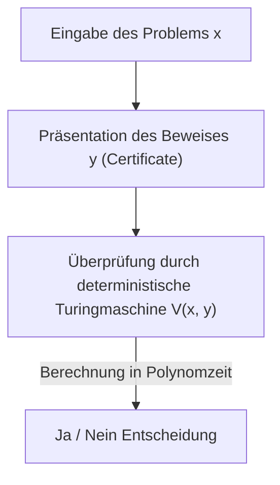
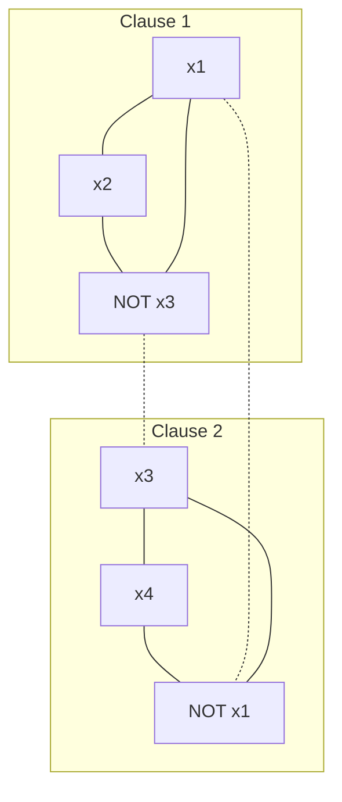

In der modernen Mathematik und Informatik gibt es ein ungelöstes Problem, das als das berühmteste und wichtigste gilt: das „P-vs-NP-Problem“. Es ist eines der von der Clay Mathematics Institute festgelegten Millennium-Probleme und mit einem Preisgeld von 1 Million Dollar dotiert. Dieses Problem ist kein bloßes intellektuelles Puzzle oder Zeitvertreib für Mathematiker.

Es ist ein extrem grundlegendes Thema, das direkt mit der Sicherheit des Internets, das unsere Gesellschaft stützt, der Optimierung von Logistik und Netzwerken, der Vorhersage von Proteinstrukturen in der Medikamentenentwicklung, der Optimierung von KI-Lernmodellen und sogar mit der philosophischen Frage "Was ist menschliche Kreativität?" und "Kann der Beweis mathematischer Theoreme automatisiert werden?" zusammenhängt.

In diesem Artikel werden wir das P-vs-NP-Problem vollständig analysieren, angefangen bei den Grundlagen der Komplexitätstheorie (Computational Complexity Theory) über die Entdeckung der NP-Vollständigkeit durch den Satz von Cook-Levin, die präzise Klassifizierung von Komplexitätsklassen, die drei gewaltigen Barrieren (Relativierung, natürliche Beweise, Algebraisierung), die den Beweis behindern, bis hin zu den neuesten Ansätzen der geometrischen Komplexitätstheorie (GCT), der Beziehung zur Quantenkomplexitätsklasse (BQP) und sogar der praktischen Python-Implementierung von SAT-Solvern. Lassen Sie uns durch diese ausführliche, zehntausende Zeichen umfassende Erklärung die Abgründe der Komplexitätstheorie berühren.

## Kapitel 1: Die Geburt der Komplexitätstheorie und die Grundlagen der Turingmaschine

Um das P-vs-NP-Problem genau zu verstehen, muss man zunächst streng mathematisch definieren, was „Berechnung“ und was „effiziente Berechnung“ ist. Als negative Antwort auf das in den 1930er Jahren von David Hilbert aufgestellte „Entscheidungsproblem“ entwarf Alan Turing ein abstraktes Berechnungsmodell, die „Turingmaschine“ (Turing Machine), um das, was „berechenbar“ ist, mathematisch zu formulieren. Zusammen mit dem Lambda-Kalkül von Alonzo Church bildet das Konzept der Turingmaschine als „Church-Turing-These“ den Grundstein der modernen Informatik.

### Deterministische Turingmaschine (DTM) und die Klasse P
Eine deterministische Turingmaschine (Deterministic Turing Machine: DTM) besteht aus einem eindimensionalen Band von unendlicher Länge, einem Kopf, der dieses Band liest und beschreibt, und einer Kontrolleinheit mit einer endlichen Anzahl von Zuständen. Wenn sie in einem bestimmten Zustand ein Symbol auf dem Band liest, ist die nächste Aktion, die die Maschine ausführen muss (das zu schreibende Symbol, die Bewegungsrichtung des Kopfes, der nächste Zustand), immer eindeutig bestimmt.

Strenger formuliert ist die Übergangsfunktion $\delta$ der DTM wie folgt definiert:
$$ \delta: Q \times \Gamma \to Q \times \Gamma \times \{L, R\} $$
Hierbei ist $Q$ eine endliche Menge von Zuständen, $\Gamma$ eine endliche Menge von Bandsymbolen (einschließlich des Leerzeichens) und $L, R$ die Bewegungsrichtung des Kopfes (links, rechts). Da der Zustandsübergang für eine Eingabe einen einzigen Pfad (Deterministic Path) zeichnet, nennt man sie „deterministisch“.

Die **Klasse P (Polynomial-time)** ist die Menge der Entscheidungsprobleme (Probleme, die mit Ja/Nein beantwortet werden), die mit dieser DTM in einer Polynomzeit $\mathcal{O}(n^k)$ (wobei $k$ eine Konstante ist) in Bezug auf die Eingabegröße $n$ gelöst werden können. In der Praxis werden Probleme, die zu P gehören, als „effizient lösbare Probleme“ betrachtet (Cobham's These). Beispiele hierfür sind das Sortieren von Listen, die Suche nach dem kürzesten Weg (Dijkstra-Algorithmus), der Algorithmus zur Bestimmung des größten gemeinsamen Teilers zweier Zahlen (Euklidischer Algorithmus) und sogar der Primzahltest (AKS-Primzahltest).

### Nichtdeterministische Turingmaschine (NTM) und die Klasse NP
Andererseits ist die nichtdeterministische Turingmaschine (Nondeterministic Turing Machine: NTM) eine hypothetische Maschine, bei der es für einen bestimmten Zustand und eine Eingabe mehrere Kandidaten für die nächste auszuführende Aktion gibt, die alle „gleichzeitig parallel (oder durch immer göttliche Auswahl der Verzweigung, die zur richtigen Antwort führt)“ durchsucht werden können.

Die strenge Formulierung der Übergangsfunktion $\delta$ der NTM lautet wie folgt:
$$ \delta: Q \times \Gamma \to \mathcal{P}(Q \times \Gamma \times \{L, R\}) $$
Hier bezeichnet $\mathcal{P}(X)$ die Potenzmenge der Menge $X$ (die Menge aller Teilmengen). Das heißt, für einen bestimmten Zustand $q \in Q$ und ein Bandsymbol $a \in \Gamma$ wird die Menge der als nächstes möglichen Aktionen als $\delta(q, a)$ angegeben, und die Maschine kann beliebig aus diesen Optionen wählen. Der Berechnungsprozess der NTM bildet keinen einzelnen Pfad, sondern eine verzweigte Baumstruktur (Berechnungsbaum, Computation Tree). Wenn mindestens einer der Pfade des Berechnungsbaums einen Akzeptanzzustand (Ja-Zustand) erreicht, wird davon ausgegangen, dass die NTM diese Eingabe „akzeptiert“ hat.

#### Der mathematische Mechanismus der exponentiellen Explosion in der deterministischen Simulation
Was geschieht mit der Berechnungszeit, wenn man versucht, das Verhalten einer NTM mit einer DTM zu simulieren? Angenommen, die maximale Verzweigungsanzahl der Übergangsfunktion der NTM ist $b$ (z. B. $b=2$) und sie stoppt für eine Eingabegröße $n$ in der Polynomzeit $p(n)$. Da die Tiefe des Berechnungsbaums $p(n)$ ist, beträgt die Anzahl der Blätter (Leaf) auf der untersten Ebene des Baums maximal $b^{p(n)}$.
Wenn die DTM diesen gesamten Berechnungsbaum durchsucht (z. B. mit Breitensuche oder Tiefensuche), beträgt die erforderliche Anzahl von Schritten $\mathcal{O}(b^{p(n)})$, was im Verhältnis zur Eingabegröße $n$ exponentiell (Exponentially) explodiert. Dies ist der grundlegende mathematische Grund, warum intuitiv geglaubt wird, dass P $\neq$ NP ist. Es wird angenommen, dass bei deterministischen sequentiellen Berechnungen enorme zeitliche und räumliche Kosten anfallen müssen, um mit der „parallelen Verzweigungskraft“ des Nichtdeterminismus mithalten zu können.

Die **Klasse NP (Nondeterministic Polynomial-time)** ist die Menge der Entscheidungsprobleme, die mit einer NTM in Polynomzeit gelöst werden können. Eine intuitivere und praktischere Definition lautet jedoch: „Die Menge von Problemen, bei denen, wenn die Antwort 'Ja' gegeben wird, die Korrektheit des Beweises (Certificate oder Witness) mit einer DTM in Polynomzeit überprüft werden kann.“


(※ Die Darstellung hier vermeidet Pipes oder Sonderzeichen.)

Beispielsweise kann die Entscheidungsvariante des Problems des Handlungsreisenden ("Gibt es eine Route, die alle Städte genau einmal mit einer Entfernung von höchstens $K$ besucht?") leicht in Polynomzeit überprüft werden, wenn ein solcher Weg (Beweis $y$) theoretisch von Gott oder einem Magier gegeben wird, indem man einfach die Gesamtdistanz addiert und prüft, ob sie unter $K$ liegt. Daher gehört dieses Problem zu NP.

## Kapitel 2: Der Satz von Cook-Levin und der Anbruch der NP-Vollständigkeit

Das P-vs-NP-Problem (d. h. ist P = NP?) ist eine sehr natürliche Frage: „Wenn die Überprüfung der Antwort einfach ist, ist es dann auch einfach, die Antwort zu finden?“ Intuitiv scheint es viel schwieriger zu sein, die Antwort zu finden (P $\neq$ NP), aber es ist extrem schwierig, dies mathematisch zu beweisen.

### Das Erfüllbarkeitsproblem (SAT)
Was diese Diskussion revolutionierte, waren die unabhängigen Forschungen von Stephen Cook im Jahr 1971 und Leonid Levin im Jahr 1973. Sie konzentrierten sich auf das "Erfüllbarkeitsproblem (SAT: Boolean Satisfiability Problem)", das fragt, ob es eine Variablenbelegung gibt, die eine aussagenlogische Formel wahr macht.

### Der Satz von Cook-Levin (Cook-Levin Theorem)
"SAT ist eines der schwierigsten Probleme unter allen Problemen, die zu NP gehören" - das ist der Kern des Satzes von Cook-Levin. Sie bewiesen, dass jedes NP-Problem innerhalb polynomieller Zeit in SAT transformiert (reduziert) werden kann.

Eine **Polynomzeit-Reduktion (Polynomial-time Reduction, Karp Reduction)** bedeutet, dass eine Eingabe $x$ eines Problems $A$ mithilfe einer in Polynomzeit berechenbaren Funktion $f$ in eine Eingabe $y = f(x)$ eines Problems $B$ umgewandelt werden kann und dabei $x \in A \iff f(x) \in B$ gilt (geschrieben als $A \le_p B$).

Cook und Levin drückten den Berechnungsübergang (Zustand, Bandinhalt, Kopfposition) einer beliebigen NTM in Polynomzeit präzise durch eine riesige logische Formel (Boolescher Ausdruck) aus. Konkret führten sie Aussagenvariablen (Boolean variables) ein wie "Zum Zeitpunkt $t$ befindet sich das Symbol $a$ in der $i$-ten Zelle des Bandes", "Zum Zeitpunkt $t$ befindet sich die Maschine im Zustand $q$" oder "Zum Zeitpunkt $t$ befindet sich der Kopf an Position $i$". Sie formulierten diese Variablen als Bedingungen (Klauseln aus AND/OR/NOT), um sicherzustellen, dass sie den lokalen Übergangsregeln $\delta$ der Turingmaschine korrekt folgen.
Da die Ausführungszeit $p(n)$ beträgt, liegt die erforderliche Anzahl von Variablen im Bereich von $\mathcal{O}(p(n)^2)$, was insgesamt eine logische Formel von polynomieller Größe erzeugt. Wenn es eine Übergangssequenz (Beweis) gibt, durch die die NTM bei einer bestimmten Eingabe einen „Akzeptanz (Ja)“-Zustand erreicht, wird die entsprechende logische Formel erfüllbar. Dieser Beweis zeigte, dass, wenn ein Polynomzeit-Algorithmus zur Lösung von SAT existiert, alle NP-Probleme in Polynomzeit gelöst werden können (P = NP).

Ein solches Problem, das „zu NP gehört und auf das sich alle NP-Probleme in Polynomzeit reduzieren lassen“, wird **NP-vollständig (NP-complete)** genannt. SAT war das erste NP-vollständige Problem, das in der Geschichte entdeckt wurde.

### Reduktion von 3-SAT auf das Problem der größten unabhängigen Menge (MIS) und das Vertex Cover-Problem: Ein strenger Beweis

Ausgehend von der NP-Vollständigkeit von SAT bewies Richard Karp 1972, dass 21 bekannte Probleme aus der Graphentheorie und der kombinatorischen Optimierung alle NP-vollständig sind. Hier entwickeln wir Schritt für Schritt einen strengen mathematischen Beweis für die Polynomzeitreduktion von „3-SAT auf das Problem der größten unabhängigen Menge (Maximum Independent Set: MIS)“ und das „Knotenüberdeckungsproblem (Vertex Cover)“, die in Vorlesungen zur Komplexitätstheorie immer behandelt werden.

**Definition der Probleme:**
- **3-SAT**: Gegeben sei eine aussagenlogische Formel $\phi$ in konjunktiver Normalform (CNF), bei der jede Klausel (Clause) aus genau der Disjunktion (OR) von drei Literalen (Variable oder deren Negation) besteht. Gibt es eine Variablenbelegung, die $\phi$ wahr macht?
  $\phi = (l_{11} \lor l_{12} \lor l_{13}) \land (l_{21} \lor l_{22} \lor l_{23}) \land \dots \land (l_{m1} \lor l_{m2} \lor l_{m3})$
- **Größte unabhängige Menge (MIS)**: Gegeben sei ein ungerichteter Graph $G=(V, E)$ und eine Ganzzahl $k$. Gibt es eine Menge $S \subseteq V$ von paarweise nicht benachbarten (nicht durch eine Kante verbundenen) Knoten, deren Größe $|S| \ge k$ ist?
- **Knotenüberdeckung (Vertex Cover)**: Gegeben sei ein ungerichteter Graph $G=(V, E)$ und eine Ganzzahl $k'$. Gibt es eine Menge $C \subseteq V$ mit der Größe $|C| \le k'$, sodass für jede Kante $e \in E$ mindestens einer ihrer Endpunkte in der Menge $C$ enthalten ist?

**Konstruktion der Reduktionsfunktion $f$: 3-SAT $\to$ MIS**
Wenn als Eingabe eine 3-SAT-Formel $\phi$ (Anzahl der Klauseln $m$) gegeben wird, konstruieren wir einen Graphen $G=(V, E)$ und eine Zielgröße $k$ wie folgt.

1. **Konstruktion der Knoten (V):**
   Für jedes Literal in jeder Klausel $C_i = (l_{i1} \lor l_{i2} \lor l_{i3})$ erstellen wir unabhängig voneinander 3 Knoten. Daher beträgt die Gesamtzahl der Knoten exakt $|V| = 3m$.
   $V = \{ v_{ij} : 1 \le i \le m, 1 \le j \le 3 \}$

2. **Konstruktion der Kanten (E):**
   Kanten werden nach folgenden zwei Regeln gezogen:
   - **Innere Kanten (Triangle edges):** Wir verbinden die drei Knoten, die zur gleichen Klausel gehören, miteinander. Das heißt, wir bilden für jede Klausel ein Dreieck (eine Clique der Größe 3).
     $E_{\text{inner}} = \{ (v_{i1}, v_{i2}), (v_{i2}, v_{i3}), (v_{i3}, v_{i1}) : 1 \le i \le m \}$
   - **Konfliktkanten (Conflict edges):** Wir ziehen Kanten zwischen Knoten, die zueinander logisch widersprüchlichen Literalen entsprechen (z. B. $x$ und $\lnot x$).
     $E_{\text{conflict}} = \{ (v_{ij}, v_{pq}) : l_{ij} = \lnot l_{pq} \}$
   Die gesamte Kantenmenge ist $E = E_{\text{inner}} \cup E_{\text{conflict}}$.

3. **Festlegung der Zielgröße $k$:**
   Wir setzen $k = m$ (Anzahl der Klauseln). Diese Graphenkonstruktion wird offensichtlich in der Polynomzeit $\mathcal{O}(m^2)$ abgeschlossen.

**Beweis der Korrektheit ($x \in \text{3-SAT} \iff f(x) \in \text{MIS}$):**

**[ Beweis von $\Rightarrow$ (Wenn erfüllbar, existiert eine unabhängige Menge der Größe $m$) ]**
Wir nehmen an, dass $\phi$ erfüllbar ist. Das bedeutet, es gibt eine Variablenbelegung, die $\phi$ wahr macht. Unter dieser Belegung besitzt jede Klausel $C_i$ mindestens ein Literal, das wahr (True) wird.
Aus jeder Klausel wählen wir "genau einen" Knoten aus, der einem wahren Literal entspricht, und nennen diese Menge $S$. Die Größe von $S$ ist offensichtlich $|S| = m = k$.
Wir beweisen durch Widerspruch, dass $S$ eine unabhängige Menge ist. Angenommen, es gibt eine Kante zwischen zwei Knoten in $S$.
- Im Falle einer inneren Kante: Das würde bedeuten, dass wir zwei Knoten aus derselben Klausel ausgewählt haben, was im Widerspruch zu der Konstruktionsregel steht, dass wir aus jeder Klausel nur einen auswählen.
- Im Falle einer Konfliktkante: Das würde bedeuten, dass wir für eine bestimmte Variable $x$ Knoten ausgewählt haben, die sowohl $x$ als auch $\lnot x$ entsprechen. Dies bedeutet jedoch, dass sowohl $x$ als auch $\lnot x$ wahr sind, was als Variablenbelegung unmöglich ist und somit zu einem Widerspruch führt.
Daher existiert zwischen keinen zwei Knoten in $S$ eine Kante, und $S$ ist eine unabhängige Menge der Größe $m$.

**[ Beweis von $\Leftarrow$ (Wenn eine unabhängige Menge der Größe $m$ existiert, ist die Formel erfüllbar) ]**
Wir nehmen an, dass im Graphen $G$ eine unabhängige Menge $S$ der Größe $m$ existiert.
Aufgrund der Konstruktion des Graphen bilden drei Knoten, die zur gleichen Klausel gehören, ein Dreieck (Clique), sodass in die unabhängige Menge $S$ höchstens ein Knoten aus der gleichen Klausel aufgenommen werden kann.
Da die Gesamtzahl der Knoten $3m$, die Anzahl der Klauseln $m$ und $|S|=m$ ist, muss $S$ nach dem Schubfachprinzip (Pigeonhole principle) "genau einen Knoten aus jeder Klausel" enthalten.
Betrachten wir eine Variablenbelegung, die alle Literale wahr (True) macht, die den in $S$ enthaltenen Knoten entsprechen. Da es keine Konfliktkanten gibt ($S$ ist eine unabhängige Menge), kann es nicht vorkommen, dass sowohl $x$ als auch $\lnot x$ wahr zugewiesen werden. Den in $S$ nicht enthaltenen Variablen weisen wir beliebige Werte zu.
Da durch diese Belegung das in jeder Klausel ausgewählte Literal wahr wird, ist die gesamte logische Formel $\phi$ erfüllbar.

**Visuelle Vorstellung des Graphen**
Im Fall von $\phi = (x_1 \lor x_2 \lor \lnot x_3) \land (\lnot x_1 \lor x_3 \lor x_4)$

(Durchgezogene Linien stellen innere Kanten dar, gestrichelte Linien Konfliktkanten. Wenn Sie aus jedem Teilgraphen genau einen Knoten auswählen können, die nicht durch eine Kante miteinander verbunden sind, wird MIS erreicht.)

**Reduktion von MIS auf Knotenüberdeckung (Vertex Cover)**
Darüber hinaus ist die Reduktion von MIS auf Vertex Cover aufgrund einer schönen Dualität in der Graphentheorie erstaunlich einfach.
Theorem: „In einem Graphen $G=(V, E)$ ist die Eigenschaft, dass eine Teilmenge $S \subseteq V$ eine unabhängige Menge ist, äquivalent dazu, dass ihr Komplement $V \setminus S$ eine Knotenüberdeckung ist.“
Beweis: Sei $S$ eine unabhängige Menge. Für eine beliebige Kante $e = (u, v) \in E$ können $u$ und $v$ niemals beide in $S$ enthalten sein (Definition der unabhängigen Menge). Folglich ist mindestens eines von $u, v$ in $V \setminus S$ enthalten. Dies bedeutet, dass $V \setminus S$ alle Kanten überdeckt, was die Definition der Knotenüberdeckung erfüllt. Die Umkehrung lässt sich völlig identisch beweisen.
Somit reduziert sich die Frage, ob ein MIS der Zielgröße $k$ existiert, in Polynomzeit auf die Frage, ob ein Vertex Cover der Zielgröße $k' = |V| - k$ existiert.

Durch diese Reduktionen wurde die mathematische Struktur deutlich, in der sich die NP-Vollständigkeit von 3-SAT auf MIS und dann auf Vertex Cover ausbreitet.

## Kapitel 3: NP-mittelschwere Probleme und der Schock der Quantenkomplexitätsklasse (BQP)

Wenn P $\neq$ NP ist, gibt es dann Probleme mit einer „mittleren“ Schwierigkeit, die weder zu P noch zu den NP-vollständigen Problemen gehören?

### Der Satz von Ladner (Ladner's Theorem)
Richard Ladner bewies 1975 den **Satz von Ladner**, der besagt: „Wenn P $\neq$ NP, dann existieren zwingend Probleme in NP, die weder in P noch NP-vollständig sind (NP-mittelschwere Probleme, NP-intermediate problems).“
Ladners Beweis bestand in der Konstruktion einer künstlichen Sprache basierend auf dem Diagonalargument, aber es gibt einige Probleme in der Realität, mit denen wir konfrontiert sind, bei denen stark vermutet wird, dass sie NP-mittelschwer sind. Ein Beispiel hierfür ist das Graphen-Isomorphie-Problem (Graph Isomorphism).

### Primfaktorzerlegung und der Shor-Algorithmus
Eine weitere gigantische Grenze ist die „Primfaktorzerlegung von ganzen Zahlen“, die das Fundament der Kryptographietheorie bildet. Die Entscheidungsvariante der Primfaktorzerlegung („Besitzt die ganze Zahl $N$ einen nicht-trivialen Primfaktor, der kleiner oder gleich $k$ ist?“) gehört zu NP, aber es wird angenommen, dass sie nicht NP-vollständig ist (da es starke theoretische Hinweise darauf gibt, dass eine NP-Vollständigkeit zu einem Kollaps der Hierarchie der Komplexitätsklassen, der Polynomzeithierarchie, führen würde).

Hier kam der Quantencomputer ins Spiel und revolutionierte die Komplexitätstheorie.
1994 zeigte Peter Shor, dass die Primfaktorzerlegung mithilfe eines Quantencomputers in Polynomzeit gelöst werden kann (**Shor-Algorithmus**). Ein Problem, das bei klassischen Algorithmen bestenfalls subexponentielle Zeit benötigt (z. B. das allgemeine Zahlkörpersieb), lässt sich durch Quantenberechnung in einer Zeit von etwa $\mathcal{O}((\log N)^3)$ lösen.

### Beziehung zwischen der Quantenkomplexitätsklasse BQP und P, NP
Um dies zu formalisieren, wurde die Komplexitätsklasse **BQP (Bounded-error Quantum Polynomial-time)** eingeführt. BQP ist die Klasse von Entscheidungsproblemen, die mithilfe einer Quantenturingmaschine (oder eines Quantenschaltkreismodells) in Polynomzeit mit einer Fehlerwahrscheinlichkeit von höchstens 1/3 gelöst werden können.

Es wird angenommen, dass die Beziehung zu klassischen Berechnungsklassen wie folgt aussieht:
1. $P \subseteq BQP$ (Was klassische Computer effizient lösen können, können auch Quantencomputer lösen)
2. $BQP \not\subseteq NP$ (BQP könnte auch Probleme enthalten, die nicht zu NP gehören)
3. $NP \not\subseteq BQP$ (Auch mit Quantencomputern lassen sich NP-vollständige Probleme nicht effizient lösen)

**Warum der Shor-Algorithmus das P-vs-NP-Problem selbst nicht löst**
In allgemeinen Nachrichten wird oft missverstanden, dass "wenn ein Quantencomputer fertiggestellt ist, alle Berechnungsprobleme (NP-Probleme) im Handumdrehen gelöst werden können", was aus Sicht der Komplexitätstheorie jedoch falsch ist.
Der Shor-Algorithmus hat die Primfaktorzerlegung von ganzen Zahlen (und das Diskreter-Logarithmus-Problem) in BQP klassifiziert. Wie zuvor erwähnt, ist die Primfaktorzerlegung jedoch kein NP-vollständiges Problem.
Wenn der Shor-Algorithmus eines wäre, der „SAT (ein NP-vollständiges Problem)“ in Polynomzeit lösen würde, hieße das, „Quantencomputer können alle NP-Probleme effizient lösen ($NP \subseteq BQP$)“, was ein gewaltiges Ereignis wäre, das das Konzept von P-vs-NP erschüttern würde.
Jedoch ist mathematisch bewiesen (Bennett, Bernstein, Brassard, Vazirani, 1997), dass selbst unter Ausnutzung der Kraft von Quantencomputern (Superposition und Quanteninterferenz) der exponentielle Suchraum zur Lösung NP-vollständiger Probleme nicht in polynomielle Zeit komprimiert werden kann und selbst bei Verwendung des Grover-Algorithmus (Grover's Algorithm) höchstens eine quadratische Geschwindigkeitssteigerung (für einen Suchraum $N$ von $\mathcal{O}(N) \to \mathcal{O}(\sqrt{N})$, Zeitkomplexität von $\mathcal{O}(2^n) \to \mathcal{O}(2^{n/2})$) erreicht wird.
Daher besteht in der heutigen theoretischen Informatik ein starker Konsens darüber, dass selbst wenn Quantencomputer praktikabel werden, die grundlegende Schwierigkeit des P-vs-NP-Problems (insbesondere die effiziente Lösung NP-vollständiger Probleme) nicht gelöst wird.

## Kapitel 4: Warum kann das P-vs-NP-Problem nicht gelöst werden? Die drei Hauptbarrieren

Über ein halbes Jahrhundert lang haben geniale Mathematiker auf der ganzen Welt versucht, das P-vs-NP-Problem zu lösen, und sind gescheitert. Es liegt nicht einfach an mangelnder menschlicher Intelligenz. Es ist durch „Metabeweise“ nachgewiesen, dass dem derzeitigen mathematischen Rahmen (den Beweismethoden) selbst die Fähigkeit fehlt, dieses Problem zu lösen. Dies sind die drei gewaltigen Barrieren in der Komplexitätstheorie.

### 1. Die Barriere der Relativierung (Relativization Barrier) und der Satz von Baker-Gill-Solovay
1975 verwendeten Theodore Baker, John Gill und Robert Solovay ein Konzept namens „Orakel (Oracle)“. Ein Orakel $A$ ist eine virtuelle Blackbox, die die Antwort auf ein Problem $A$ sofort (in 1 Schritt) liefern kann. Eine Turingmaschine, die um die Funktion erweitert ist, bei diesem Orakel anzufragen, wird Orakel-Turingmaschine genannt.

Sie bewiesen, dass unter einem bestimmten Orakel P=NP gilt und unter einem anderen Orakel P≠NP gilt, was einen Schock in der Komplexitätstheorie auslöste.

**Vollständige Beweisskizze für den Satz von Baker-Gill-Solovay**

**Satz: Es existieren Orakel $A$ und $B$, die folgende Eigenschaften erfüllen.**
1. $P^A = NP^A$
2. $P^B \neq NP^B$

**[ Konstruktion eines Orakels $A$, bei dem $P^A = NP^A$ gilt ]**
Als Orakel $A$ wählen wir das PSPACE-vollständige Problem „TQBF (True Quantified Boolean Formula)“.
Eine deterministische polynomielle Zeitmaschine mit Orakel $A$ ($P^A$) kann jedes Problem in PSPACE in Polynomzeit lösen. Dies liegt daran, dass jedes beliebige Problem in PSPACE in Polynomzeit auf TQBF reduziert werden kann und die Antwort durch eine einzige Abfrage an das Orakel erhalten wird. Das heißt, $P^A = \text{PSPACE}$.
Andererseits kann eine nichtdeterministische polynomielle Zeitmaschine mit Orakel $A$ ($NP^A$), selbst wenn sie die Kraft des Orakels voll ausnutzt, innerhalb der Polynomzeit nur einen Raum von polynomieller Größe durchsuchen, sodass $NP^A \subseteq \text{NPSPACE}$ gilt. Nach dem Satz von Savitch (Savitch's Theorem), einem grundlegenden Theorem der Komplexitätstheorie, gilt $\text{NPSPACE} = \text{PSPACE}$, also ist $NP^A \subseteq \text{PSPACE}$.
Natürlich gilt $P^A \subseteq NP^A$, also ergibt die Kombination dieser Fakten $P^A = NP^A = \text{PSPACE}$.

**[ Konstruktion eines Orakels $B$, bei dem $P^B \neq NP^B$ gilt ]**
Sei $B$ eine Sprache (Menge von Zeichenfolgen) und wir definieren für das Orakel $B$ eine Sprache $L_B$ wie folgt:
$L_B = \{ 1^n : \text{Es existiert irgendeine Zeichenfolge } x \text{ der Länge } n \text{, die in } B \text{ enthalten ist} \}$
Offensichtlich gilt $L_B \in NP^B$. Der Grund dafür ist, dass eine NTM für die Eingabe $1^n$ eine Zeichenfolge $x$ der Länge $n$ nichtdeterministisch raten (generieren) und das Orakel $B$ in 1 Schritt abfragen kann, ob $x \in B$ ist, um dies zu verifizieren.
Als Nächstes konstruieren wir den Inhalt des Orakels $B$ rekursiv unter Verwendung des Diagonalarguments (Diagonalization), so dass $L_B \notin P^B$ gilt.
Wir listen alle deterministischen Polynomzeit-Orakelmaschinen als $M_1, M_2, \dots, M_i, \dots$ auf. Die Ausführungszeit jedes $M_i$ sei durch das Polynom $p_i(n)$ begrenzt.
In Schritt $i$ wählen wir eine ausreichend lange Zeichenfolgenlänge $n$ (wir vergrößern sie drastisch, sodass $2^n > p_i(n)$).
Wir simulieren $M_i$, indem wir die Eingabe $1^n$ geben. Während der Ausführung wird $M_i$ höchstens $p_i(n)$ Zeichenfolgen beim Orakel abfragen.
Da die Gesamtzahl der Zeichenfolgen der Länge $n$ gleich $2^n$ ist und $2^n > p_i(n)$ gilt, gibt es zwangsläufig eine Zeichenfolge $y$ der Länge $n$, die $M_i$ „nie beim Orakel abgefragt“ hat.
- Wenn $M_i(1^n)$ schließlich „Akzeptieren (1)“ ausgibt, entscheiden wir, dass $B$ überhaupt keine Zeichenfolgen der Länge $n$ enthalten soll (es wird eine leere Menge). Dadurch ist $1^n \notin L_B$ und die Ausgabe von $M_i$ war folglich falsch.
- Wenn $M_i(1^n)$ schließlich „Ablehnen (0)“ ausgibt, fügen wir die zuvor nicht abgefragte Zeichenfolge $y$ zu $B$ hinzu. Dadurch ist $1^n \in L_B$, und wieder war die Ausgabe von $M_i$ falsch.
In dem Orakel $B$, das konstruiert wird, indem dies für alle Maschinen unendlich oft wiederholt wird, kann keine DTM die Sprache $L_B$ korrekt entscheiden, und somit gilt $L_B \notin P^B$. Daher ist $P^B \neq NP^B$.

**Die Bedeutung der Barriere der Relativierung**
Die erschreckende Konsequenz dieses Theorems ist, „dass Beweismethoden, die von der Existenz von Orakeln nicht beeinflusst werden (relativierende, Relativizing Beweismethoden), wie Diagonalargumente oder Zustandssimulationen, das P-vs-NP-Problem niemals lösen können.“ Denn wenn mit einer solchen Methode P=NP bewiesen werden könnte, könnte auch in der Welt von Orakel $B$ P=NP bewiesen werden, was zu einem Widerspruch führt.

### 2. Die Barriere der natürlichen Beweise (Natural Proofs Barrier)
Um die Barriere der Relativierung zu überwinden, verlagerten die Theoretiker ihren Ansatz darauf, keine Operationen von Turingmaschinen zu betrachten, sondern untere Schranken für die Größe von „Booleschen Schaltkreisen“ (Boolean Circuits), die Logikgatter (AND, OR, NOT) kombinieren, zu beweisen (Ansatz zum Beweis von unteren Schranken für die Klasse P/poly).
1994 jedoch stellten Alexander Razborov und Steven Rudich das Konzept der „natürlichen Beweise (Natural Proofs)“ vor.
Sie wiesen darauf hin, dass die meisten der damaligen Methoden für Schaltkreis-Untergrenzenbeweise darauf beruhten, eine „natürliche Eigenschaft“ zu extrahieren, die die Eigenschaften der „Nützlichkeit (Constructivity)“ und „Großartigkeit (Largeness)“ erfüllt. Sie bewiesen mathematisch, dass es unmöglich ist, untere Schranken für starke Komplexitätsklassen durch solche „natürlichen Beweise“ zu beweisen, falls Einwegfunktionen existieren (also Kryptographie möglich ist).
Das heißt, die bestehenden kombinatorischen Ansätze, um P $\neq$ NP zu beweisen, gerieten ironischerweise in das Paradoxon, dass sie nicht mehr funktionieren, wenn man P $\neq$ NP (in seiner starken Form als Existenz von Kryptographie) annimmt.

### 3. Die Barriere der Algebraisierung (Algebrization Barrier)
Um den Barrieren der Relativierung und der natürlichen Beweise auszuweichen, entwickelten sich in den 1990er Jahren „Interaktive Beweissysteme (Interactive Proofs)“ und „Arithmetisierung (Arithmetization)“. Dadurch wurden bahnbrechende Theoreme wie IP = PSPACE bewiesen.
Im Jahr 2008 jedoch zeigten Scott Aaronson und Avi Wigderson, dass auch diese Ansätze letztlich von einer Operation abhängen, die Polynome über endlichen Körpern erweitert, der sogenannten „Algebraisierung (Algebrization)“. Und sie bewiesen, dass Methoden, die Algebraisierung verwenden, das P-vs-NP-Problem (oder die Trennung vieler anderer Komplexitätsklassen) nicht lösen können.

Durch diese drei Barrieren wurde die Erkenntnis, dass „es eine völlig neue Paradigmen-Mathematik erfordert, um das P-vs-NP-Problem zu lösen“, zum gesunden Menschenverstand in der theoretischen Informatik.

## Kapitel 5: Praxis und die Mathematik und Implementierung von SAT-Solvern in Python

Während P=NP ungelöst bleibt, werden in der realen Industrie riesige SAT-Probleme (NP-vollständige Probleme) mit Millionen von Variablen täglich in hoher Geschwindigkeit gelöst. Der Grund dafür ist, dass viele praktische Probleme (wie Hardware-Verifikation und Abhängigkeitsauflösung) eine starke „Struktur“ aufweisen, selbst wenn die Berechnung im schlimmsten Fall exponentielle Zeit beansprucht. Lassen Sie uns hier den spezifischen Algorithmus und die Python-Implementierung eines SAT-Solvers, der das Herzstück der Theorie des P-vs-NP-Problems bildet, betrachten.

### Der DPLL-Algorithmus und die Mathematik des Backtrackings
Der DPLL (Davis-Putnam-Logemann-Loveland)-Algorithmus ist eine Methode, die auf Tiefensuche (Backtracking) basiert und die Eigenschaften von logischen Formeln nutzt, um den Suchraum drastisch zu reduzieren.

Die wichtigsten mathematischen Punkte sind die folgenden zwei:
1. **Unit Propagation (Boolean Constraint Propagation):** Wenn in einer Klausel nur noch ein nicht zugewiesenes Literal übrig ist (Unit Clause), besteht die einzige Möglichkeit, diese Klausel wahr zu machen, darin, dieses Literal wahr zu machen. Diese erzwungene Zuweisung löst eine Kettenreaktion von Unit Propagation in anderen Klauseln aus und beschneidet den Suchbaum stark.
2. **Pure Literal Elimination:** Wenn eine Variable in der gesamten logischen Formel nur in positiver (oder nur in negativer) Form auftritt, hat die Zuweisung des Werts "Wahr" an dieses Literal keinen negativen Einfluss auf die Erfüllbarkeit der anderen Klauseln.

Im Folgenden finden Sie ein einfaches und lehrreiches Code-Beispiel für den DPLL-Algorithmus in Python.

```python
def dpll(clauses, assignment):
    # Basisfall 1: Alle Klauseln sind erfüllt und die Liste wird leer -> Erfüllbar (SAT)
    if len(clauses) == 0:
        return True, assignment
    
    # Basisfall 2: Ein Widerspruch (eine leere Klausel) liegt vor -> Unerfüllbar (UNSAT)
    if any(len(c) == 0 for c in clauses):
        return False, {}
    
    # Anwendung der Unit Propagation
    unit_clauses = [c for c in clauses if len(c) == 1]
    if unit_clauses:
        unit = unit_clauses[0][0]
        new_clauses = []
        for c in clauses:
            if unit in c:
                continue # Diese Klausel wurde wahr und wird daher entfernt
            if -unit in c:
                # Widersprüchliche Literale entfernen
                new_clause = [l for l in c if l != -unit]
                new_clauses.append(new_clause)
            else:
                new_clauses.append(c)
        assignment[abs(unit)] = (unit > 0)
        return dpll(new_clauses, assignment)
    
    # Verzweigung (Branching): Heuristische Variablenauswahl
    # Hier wählen wir einfach das erste Literal der ersten Klausel
    literal = clauses[0][0]
    
    # Suche unter der Annahme, dass die Variable True ist
    res, final_assign = dpll(clauses + [[literal]], assignment.copy())
    if res:
        return True, final_assign
        
    # Wenn die obige Verzweigung fehlschlägt, suche unter der Annahme, dass die Variable False ist (Backtrack)
    return dpll(clauses + [[-literal]], assignment.copy())

# Ausführungsbeispiel: (x1 OR NOT x2) AND (NOT x1 OR x2 OR x3) AND (NOT x3)
# 1: x1, 2: x2, 3: x3 (negative Zahlen repräsentieren NOT)
cnf_formula = [[1, -2], [-1, 2, 3], [-3]]
is_sat, solution = dpll(cnf_formula, {})

print(f"Satisfiable: {is_sat}")
print(f"Assignment: {solution}")
# Erwartete Ausgabe:
# Satisfiable: True
# Assignment: {3: False, 1: False, 2: False} (oder eine andere erfüllende Lösung)
```

### Die Evolution zum CDCL (Conflict-Driven Clause Learning)-Algorithmus
Moderne, hochmoderne SAT-Solver (MiniSat, Glucose usw.) verwenden den **CDCL (Conflict-Driven Clause Learning)**-Algorithmus, der eine dramatische Erweiterung von DPLL darstellt.

Die Innovation von CDCL liegt im „Lernen aus Fehlern“. Wenn während der Suche ein Widerspruch (Conflict) auftritt, kehrt es nicht einfach zum vorherigen Schritt zurück (Chronological backtracking), sondern baut einen Implikationsgraphen (Implication Graph) auf, um die Variablenkombination zu analysieren, die die Grundursache des Konflikts war. Indem ein Schnitt berechnet wird, der UIP (Unique Implication Point) im Graphen genannt wird, wird die Ursache des Konflikts in die Form eines logischen Ausdrucks umgewandelt und als neue „gelernte Klausel (Learned Clause)“ zur ursprünglichen Formel hinzugefügt.
Dadurch wird ein nicht-chronologisches Backtracking (Non-chronological backtracking / Backjumping) realisiert, das besagt: „Wiederhole denselben Fehler aus der Vergangenheit niemals in einem anderen Zweig des Suchbaums“, wodurch der exponentielle Suchbaum dramatisch beschnitten wird. Durch die weitere Kombination von dynamischen Heuristiken zur Variablenauswahl wie VSIDS (Variable State Independent Decaying Sum) und regelmäßigen Neustarts (Restarts) herrscht CDCL als höchster Gipfel menschlicher Heuristiken für NP-vollständige Probleme.

## Kapitel 6: Moderne Ansätze und die Geometrische Komplexitätstheorie (GCT)

Angesichts dieser Barrieren: Mit welchen Ansätzen versuchen Theoretiker heute, das P-vs-NP-Problem anzugehen?

### Geometrische Komplexitätstheorie (Geometric Complexity Theory: GCT)
Im Jahr 2001 schlugen Ketan Mulmuley und Milind Sohoni ein grandioses Programm namens „Geometrische Komplexitätstheorie (GCT)“ vor, das algebraische Geometrie und Darstellungstheorie verwendet.
Die Grundidee von GCT besteht darin, die Trennung von Komplexitätsklassen auf ein geometrisches Inklusionsproblem in einem Raum von bestimmten Polynomen (dem Orbitabschluss) zu reduzieren.

Konkret wird der Unterschied in der Symmetrie zwischen der Permanente (Permanent, gehört zu #P-vollständig und ist schwer zu berechnen) und der Determinante (Determinant, in Polynomzeit berechenbar) betrachtet. Diese Polynome werden als geometrische Bahnen (Orbits) unter der Wirkung der allgemeinen linearen Gruppe betrachtet, und mittels Darstellungstheorie (Schur-Polynome und Multiplizitäten irreduzibler Darstellungen) soll gezeigt werden, dass „der Orbitabschluss der Permanente nicht in den Orbitabschluss der Determinante eingebettet werden kann“.
Es wird angenommen, dass die GCT die Eigenschaft hat, die Barrieren natürlicher Beweise und der Algebraisierung umgehen zu können, und sie weckt Erwartungen in der Hinsicht, dass tiefgreifende Theoreme aus anderen Bereichen der Mathematik (algebraische Geometrie, Darstellungstheorie, Invariantentheorie) mobilisiert werden können, aber da sie sehr fortgeschritten und schwer verständlich ist, sie noch weit von der Vollendung entfernt ist.

### Schaltkreisuntergrenzen und Expander-Graphen
In eine andere Richtung schreitet die Forschung der „Derandomisierung (Derandomization)“ voran, die den Zufall der Berechnung (BPP) mit deterministischen Algorithmen (P) nachahmt. Die Theorie von Pseudozufallszahlengeneratoren wie Expander-Graphen und Extraktoren (Extractors) ist eng mit Schaltkreis-Untergrenzenbeweisen verbunden (Hardness vs. Randomness-Paradigma) und hat zu reichhaltigen Ergebnissen geführt wie „Wenn starke Schaltkreisuntergrenzen bewiesen werden können, lässt sich P = BPP zeigen“. Man geht davon aus, dass diese Fortschritte langfristig auch ein Sprungbrett für den P $\neq$ NP-Beweis sein werden.

## Kapitel 7: Die philosophischen und technologischen Auswirkungen auf die Welt, falls P=NP (oder P≠NP) ist

Wie würde unsere Gesellschaft aussehen, wenn das P-vs-NP-Problem gelöst würde? Viele Experten glauben, dass P $\neq$ NP ist, aber wenn bewiesen würde, dass P = NP ist, und darüber hinaus ein praktischer Polynomzeitalgorithmus (z. B. $\mathcal{O}(n^2)$ oder $\mathcal{O}(n^3)$) entdeckt würde, würde sich die Welt dramatisch und fast erschreckend verändern.

### Der Zusammenbruch der Public-Key-Kryptographie
RSA-Verschlüsselung und Elliptische-Kurven-Kryptographie, die die Grundlage der Sicherheit des modernen Internets bilden, beruhen auf der Prämisse, dass „Primfaktorzerlegung und das Problem des diskreten Logarithmus nicht in Polynomzeit gelöst werden können“ (strenger ausgedrückt, dass Einwegfunktionen existieren). Wenn P = NP wäre, könnte der „Beweis“ zur Wiederherstellung des Klartexts aus dem Geheimtext in Polynomzeit gefunden werden, wodurch die Kryptographie wirkungslos gemacht würde, und die Privatsphäre der digitalen Kommunikation sowie sichere Finanztransaktionen würden in einem Augenblick zusammenbrechen.

### Optimierung und das Ende der Wissenschaft (und die ultimative Automatisierung)
Es gibt jedoch auch positive Aspekte. Logistik (Problem des Handlungsreisenden), die Vorhersage der Proteinfaltung, das Design von Halbleiterschaltkreisen, die Entdeckung optimaler Gewichte in der KI – jedes Optimierungsproblem, das als NP-vollständiges Problem formuliert werden kann, könnte sofort optimal gelöst werden. Dies hätte die Auswirkung, dass der technologische Fortschritt der Menschheit um Hunderte von Jahren übersprungen würde, von der Lösung des Klimawandels bis hin zum vollständig automatisierten Design neuer Medikamente.

### Gödels Brief und die menschliche Kreativität
1956 schrieb Kurt Gödel in einem Brief an John von Neumann, der im Wesentlichen das P-vs-NP-Problem vorwegnahm. Wenn das Beweisen von Sätzen (das Finden eines Beweises der Länge $n$) in Polynomzeit möglich wäre, schrieb Gödel, „würde die Arbeit des Mathematikers vollständig durch eine Maschine ersetzt werden“.
Wenn „das Verifizieren eines Beweises (P)“ und „das intuitive Finden eines Beweises (NP)“ äquivalent sind, dann sind auch „menschliche Kreativität“ wie künstlerische Inspiration, mathematische Intuition und das Aufblitzen von Genies nichts weiter als ein Algorithmus in polynomieller Zeit.

## Fazit: Ein Blick in den Abgrund

Das P-vs-NP-Problem fragt nicht einfach nur nach der Ausführungszeit von Algorithmen. Es ist eine fundamentale Frage an den Intellekt: „Ist das Finden einer Antwort im Wesentlichen etwas anderes als das Verstehen der Antwort?“

Noch immer fordern Mathematiker und Informatiker auf der ganzen Welt dieses Problem heraus. Um den Beweis zu erbringen, werden völlig neue mathematische Konzepte benötigt, die unsere Vorstellungskraft übersteigen und die starken Barrieren der Orakel, der natürlichen Beweise und der Algebraisierung durchbrechen.

Wird der Tag kommen, an dem dieses Geheimnis, das an der Spitze der Millennium-Probleme steht, gelöst wird, oder wird wie bei Gödels Unvollständigkeitssatz die „Unbeweisbarkeit“ als Unabhängigkeit bewiesen? Die Reise, die die Grenzen des menschlichen Wissens herausfordert, wird weitergehen.
