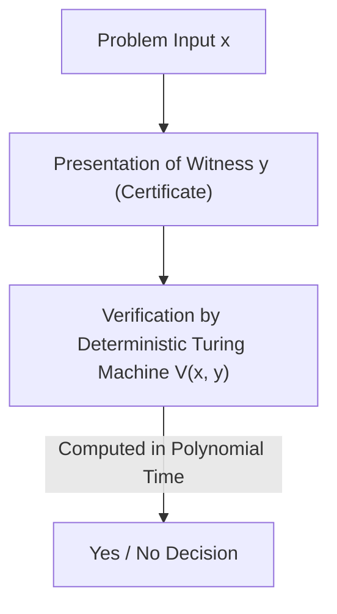
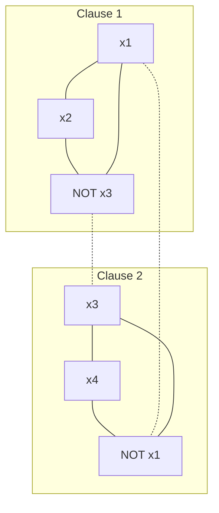

There exists an unsolved problem that is considered the most famous and most important in modern mathematics and computer science. That is the "P vs NP Problem." It is one of the Millennium Prize Problems established by the Clay Mathematics Institute with a million-dollar prize, and it is not a mere intellectual puzzle or a pastime for mathematicians.

It is an extremely fundamental theme that directly connects to internet security supporting our society, logistics and network optimization, protein structure prediction in drug discovery, optimization of AI learning models, and even philosophical questions such as "What is human creativity?" and "Can the proof of mathematical theorems be automated?"

In this article, we will completely dissect the P vs NP problem, starting from the basics of Computational Complexity Theory, the discovery of NP-completeness by the Cook-Levin theorem, the precise classification of complexity classes, the three massive barriers preventing a proof (relativization, natural proofs, and algebrization), the latest Geometric Complexity Theory (GCT) approach, its relationship with the quantum complexity class (BQP), and even the practical mathematics and Python implementation of SAT solvers. Through this detailed explanation spanning tens of thousands of characters, let's touch the abyss of computational complexity theory.

## Chapter 1: The Birth of Complexity Theory and the Basics of the Turing Machine

To accurately understand the P vs NP problem, we first need to strictly mathematically define what "computation" is and what "efficient computation" means. In the 1930s, as a negative answer to the "Entscheidungsproblem" (Decision Problem) proposed by David Hilbert, Alan Turing devised an abstract computational model called the "Turing Machine" to mathematically formulate "what is computable." Along with Alonzo Church's lambda calculus, the concept of this Turing machine is the foundation of modern computer science as the "Church-Turing thesis."

### Deterministic Turing Machine (DTM) and Class P
A Deterministic Turing Machine (DTM) consists of a one-dimensional tape with infinite length, a head that reads and writes on that tape, and a control unit with a finite number of states. When reading a certain state and a symbol on the tape, the next action the machine should take (the symbol to write, the moving direction of the head, and the next state) is always uniquely determined.

Strictly speaking, the transition function $\delta$ of a DTM is defined as follows:
$$ \delta: Q \times \Gamma \to Q \times \Gamma \times \{L, R\} $$
Here, $Q$ is a finite set of states, $\Gamma$ is a finite set of tape symbols (including the blank symbol), and $L, R$ are the moving directions of the head (left, right). Because the state transition traces a single Deterministic Path for an input, it is called "deterministic."

**Class P (Polynomial-time)** is the set of decision problems (problems answered with Yes/No) that can be solved in polynomial time $\mathcal{O}(n^k)$ (where $k$ is a constant) with respect to the input size $n$ using this DTM. In practice, problems belonging to P are considered "problems that can be solved efficiently" (Cobham's thesis). Examples include list sorting, shortest path search (Dijkstra's algorithm), the algorithm for finding the greatest common divisor of two numbers (Euclidean algorithm), and even primality testing (AKS primality test).

### Nondeterministic Turing Machine (NTM) and Class NP
On the other hand, a Nondeterministic Turing Machine (NTM) is a virtual machine where, for a certain state and input, there are multiple candidates for the next action to take, and it can explore all of them "simultaneously in parallel (or always miraculously choosing the branch that leads to the correct answer)."

The strict formulation of the transition function $\delta$ of an NTM is as follows:
$$ \delta: Q \times \Gamma \to \mathcal{P}(Q \times \Gamma \times \{L, R\}) $$
Here, $\mathcal{P}(X)$ represents the power set of a set $X$ (the set of all subsets). That is, for a certain state $q \in Q$ and tape symbol $a \in \Gamma$, the set of possible next actions is given as $\delta(q, a)$, and the machine can choose any of these options. The computational process of an NTM is not a single path but forms a branching tree structure (Computation Tree). If at least one of the paths in the computation tree reaches an accepting state (Yes state), the NTM is considered to have "accepted" that input.

#### The Mathematical Mechanism of Exponential Explosion in Deterministic Simulation
What happens to the computation time if we try to simulate the operation of an NTM with a DTM? Let the maximum number of branches of the NTM's transition function be $b$ (e.g., $b=2$), and assume it halts in polynomial time $p(n)$ for input size $n$. Since the depth of the computation tree is $p(n)$, the number of leaves at the bottom layer of the tree is at most $b^{p(n)}$.
If a DTM searches this entire computation tree (e.g., using breadth-first search or depth-first search), the required number of steps is $\mathcal{O}(b^{p(n)})$, exploding exponentially with respect to the input size $n$. This is the fundamental mathematical reason why it is intuitively believed that P $\neq$ NP. It is thought that deterministic sequential computation has no choice but to pay enormous time and spatial costs to catch up with the power of "parallel branching" possessed by nondeterminism.

**Class NP (Nondeterministic Polynomial-time)** is the set of decision problems that can be solved in polynomial time using an NTM. However, as a more intuitive and practical definition, it can be rephrased as the set of "problems for which, when a Yes answer is given, its proof (Certificate or Witness) can be verified to be correct in polynomial time using a DTM."


（※ ここでのパイプや特殊記号を避けた記述としています。）

For example, the decision version of the Traveling Salesperson Problem ("Does there exist a route that visits all cities exactly once with a distance of $K$ or less?") is such that, if such a route (witness $y$) were given by a god or a wizard, it could be easily verified in polynomial time simply by adding up the total distance and checking if it is $K$ or less. Therefore, this problem belongs to NP.

## Chapter 2: The Cook-Levin Theorem and the Dawn of NP-Completeness

The P vs NP problem (i.e., is P = NP?) is an extremely natural question: "If verifying the answer to a problem is easy, is finding the answer also easy?" Intuitively, finding the answer seems much harder (P $\neq$ NP), but proving that mathematically is extremely difficult.

### Boolean Satisfiability Problem (SAT)
What revolutionized this discussion was the independent research by Stephen Cook in 1971 and Leonid Levin in 1973. They focused on the "Boolean Satisfiability Problem (SAT)," which asks whether there exists a variable assignment that makes a propositional logic formula true.

### The Cook-Levin Theorem
"SAT is one of the hardest problems among all problems belonging to NP"—this is the core of the Cook-Levin theorem. They proved that any NP problem can be converted (reduced) to SAT within polynomial time.

**Polynomial-time Reduction (Karp Reduction)** means that an input $x$ of problem $A$ can be transformed into an input $y = f(x)$ of problem $B$ using a function $f$ computable in polynomial time, such that $x \in A \iff f(x) \in B$ holds (written as $A \le_p B$).

Cook and Levin precisely represented the computational transitions (state, tape contents, head position) of any NTM in polynomial time as a massive logical formula (Boolean expression). Specifically, they introduced proposition variables (Boolean variables) such as "at time $t$, symbol $a$ exists in the $i$-th cell of the tape," "at time $t$, the machine is in state $q$," and "at time $t$, the head is at position $i$." They described as constraints (clauses composed of AND/OR/NOT) that these variables correctly follow the Turing machine's local transition rules $\delta$.
Since the execution time is $p(n)$, the number of required variables fits within roughly $\mathcal{O}(p(n)^2)$, and an overall polynomial-size logical formula is generated. If there exists a sequence of transitions (a witness) where the NTM reaches an "accept (Yes)" state for a certain input, the corresponding logical formula becomes satisfiable. Through this proof, it was shown that if a polynomial-time algorithm to solve SAT exists, all NP problems can be solved in polynomial time (P = NP).

Such problems that "belong to NP and can be reduced from all NP problems in polynomial time" are called **NP-complete**. SAT was the first NP-complete problem discovered in history.

### Reduction from 3-SAT to Maximum Independent Set (MIS) and Vertex Cover: A Strict Proof

In 1972, starting from the NP-completeness of SAT, Richard Karp proved that 21 famous problems in graph theory and combinatorial optimization were all NP-complete. Here, we will develop a step-by-step rigorous mathematical proof of the polynomial-time reduction from "3-SAT" to the "Maximum Independent Set (MIS) problem" and the "Vertex Cover problem," which are always covered in computational complexity theory lectures.

**Definition of Problems:**
- **3-SAT**: Given a boolean formula $\phi$ in Conjunctive Normal Form (CNF) where each clause consists of the logical OR of exactly 3 literals (variables or their negations), does there exist a variable assignment that makes $\phi$ true?
  $\phi = (l_{11} \lor l_{12} \lor l_{13}) \land (l_{21} \lor l_{22} \lor l_{23}) \land \dots \land (l_{m1} \lor l_{m2} \lor l_{m3})$
- **Maximum Independent Set (MIS)**: Given an undirected graph $G=(V, E)$ and an integer $k$, does there exist a set of mutually non-adjacent vertices (not connected by edges) $S \subseteq V$ such that its size is $|S| \ge k$?
- **Vertex Cover**: Given an undirected graph $G=(V, E)$ and an integer $k'$, does there exist a set $C \subseteq V$ of size $|C| \le k'$ such that for every edge $e \in E$, at least one of its endpoints is contained in $C$?

**Construction of Reduction Function $f$: 3-SAT $\to$ MIS**
Given a 3-SAT formula $\phi$ (with $m$ clauses) as input, we construct a graph $G=(V, E)$ and a target size $k$ as follows.

1. **Construction of Vertices (V):**
   We independently create three vertices corresponding to each literal in each clause $C_i = (l_{i1} \lor l_{i2} \lor l_{i3})$. Therefore, the total number of vertices is exactly $|V| = 3m$.
   $V = \{ v_{ij} : 1 \le i \le m, 1 \le j \le 3 \}$

2. **Construction of Edges (E):**
   Edges are drawn according to the following two rules.
   - **Internal edges (Triangle edges):** We connect the three vertices belonging to the same clause to each other. That is, we form a triangle (clique of size 3) for each clause.
     $E_{\text{inner}} = \{ (v_{i1}, v_{i2}), (v_{i2}, v_{i3}), (v_{i3}, v_{i1}) : 1 \le i \le m \}$
   - **Conflict edges:** We draw an edge between vertices corresponding to logically conflicting literals (e.g., $x$ and $\lnot x$).
     $E_{\text{conflict}} = \{ (v_{ij}, v_{pq}) : l_{ij} = \lnot l_{pq} \}$
   The total edge set is $E = E_{\text{inner}} \cup E_{\text{conflict}}$.

3. **Setting the Target Size $k$:**
   Let $k = m$ (the number of clauses). This graph construction obviously completes in polynomial time $\mathcal{O}(m^2)$.

**Proof of Correctness ($x \in \text{3-SAT} \iff f(x) \in \text{MIS}$):**

**[ Proof of $\Rightarrow$ (If satisfiable, an independent set of size $m$ exists)]**
Assume $\phi$ is satisfiable. That is, there exists a variable assignment that makes $\phi$ true. Under this assignment, each clause $C_i$ has at least one literal that evaluates to true.
From each clause, we select "exactly one" vertex corresponding to a true literal, and let this set be $S$. The size of $S$ is clearly $|S| = m = k$.
We show by contradiction that $S$ is an independent set. Assume there is an edge between two vertices in $S$.
- For an internal edge: This means we selected two vertices from the same clause, which contradicts the construction procedure that we selected only one from each clause.
- For a conflict edge: This means we selected vertices corresponding to both $x$ and $\lnot x$ for some variable $x$. However, this implies both $x$ and $\lnot x$ are true, which is impossible for a variable assignment, causing a contradiction.
Therefore, no edge exists between any two vertices in $S$, making $S$ an independent set of size $m$.

**[ Proof of $\Leftarrow$ (If an independent set of size $m$ exists, it is satisfiable)]**
Assume there exists an independent set $S$ of size $m$ in graph $G$.
By the graph's construction, the three vertices belonging to the same clause form a triangle (clique), so the independent set $S$ can contain at most one vertex from the same clause.
Since the total number of vertices is $3m$, the number of clauses is $m$, and $|S|=m$, by the Pigeonhole principle, $S$ must contain "exactly one vertex from each clause."
Consider a variable assignment that sets all literals corresponding to the vertices in $S$ to true. Because no conflict edges exist (since $S$ is an independent set), it is never the case that both $x$ and $\lnot x$ are assigned true for any variable $x$. Any variables not included in $S$ are assigned arbitrary values.
With this assignment, the selected literal in every clause is true, so the overall formula $\phi$ is satisfiable.

**Image of Graph Illustration**
For $\phi = (x_1 \lor x_2 \lor \lnot x_3) \land (\lnot x_1 \lor x_3 \lor x_4)$:

(Solid lines represent internal edges, and dotted lines represent conflict edges. Achieving MIS requires selecting one vertex from each subgraph such that they are not connected by edges.)

**Reduction from MIS to Vertex Cover**
Furthermore, due to a beautiful duality in graph theory, the reduction from MIS to Vertex Cover is surprisingly simple.
Theorem: "In a graph $G=(V, E)$, a subset $S \subseteq V$ is an independent set if and only if its complement $V \setminus S$ is a vertex cover."
Proof: Assume $S$ is an independent set. For any edge $e = (u, v) \in E$, it is never the case that both $u$ and $v$ are included in $S$ (by the definition of an independent set). Therefore, at least one of $u$ or $v$ is included in $V \setminus S$. This means $V \setminus S$ covers all edges, satisfying the definition of a vertex cover. The reverse can be proven in exactly the same way.
Thus, the problem of whether there exists an MIS of target size $k$ reduces in polynomial time to the problem of whether there exists a vertex cover of target size $k' = |V| - k$.

Through these reductions, the mathematical structure by which NP-completeness propagates from 3-SAT to MIS and then to Vertex Cover became clear.

## Chapter 3: NP-Intermediate Problems and the Shock of the Quantum Complexity Class (BQP)

If P $\neq$ NP, do problems exist that have an "intermediate" difficulty, being neither in P nor NP-complete?

### Ladner's Theorem
Richard Ladner proved in 1975 that "If P $\neq$ NP, then there must exist problems in NP that are neither in P nor NP-complete (NP-intermediate problems)"—this is **Ladner's Theorem**.
Although Ladner's proof constructed an artificial language based on diagonalization, there are some real-world problems we face that are strongly suspected to be NP-intermediate. For example, the Graph Isomorphism problem is one such problem.

### Integer Factorization and Shor's Algorithm
Another massive frontier is the "integer factorization" that forms the backbone of cryptography. The decision version of integer factorization ("Does the integer $N$ have a non-trivial prime factor less than or equal to $k$?") belongs to NP, but it is believed not to be NP-complete (because if it were NP-complete, there is strong theoretical evidence that the hierarchy of complexity classes called the polynomial hierarchy would collapse).

Here, quantum computers brought a revolution to complexity theory.
In 1994, Peter Shor showed that integer factorization can be solved in polynomial time using a quantum computer (**Shor's Algorithm**). A problem that takes sub-exponential time at best with classical algorithms (e.g., General Number Field Sieve) can be solved in about $\mathcal{O}((\log N)^3)$ time by quantum computation.

### Quantum Complexity Class BQP and Its Relationship with P and NP
To formalize this, the complexity class **BQP (Bounded-error Quantum Polynomial-time)** was introduced. BQP is the class of decision problems that can be solved in polynomial time with a quantum Turing machine (or quantum circuit model) with an error probability of 1/3 or less.

Its relationship with classical complexity classes is expected to be as follows:
1. $P \subseteq BQP$ (What can be solved efficiently on a classical computer can be solved on a quantum one)
2. $BQP \not\subseteq NP$ (BQP might include problems not belonging to NP)
3. $NP \not\subseteq BQP$ (NP-complete problems cannot be solved efficiently even with a quantum computer)

**Why Shor's Algorithm Does Not Solve the P vs NP Problem Itself**
It is often misunderstood in general news that "once a quantum computer is completed, it can solve any computational problem (NP problem) instantly," but from the perspective of computational complexity theory, this is incorrect.
Shor's algorithm classified integer factorization (and the discrete logarithm problem) into BQP. However, as mentioned above, integer factorization is not an NP-complete problem.
If Shor's algorithm were one that solved "SAT (an NP-complete problem)" in polynomial time, it would mean "quantum computers can efficiently solve all NP problems ($NP \subseteq BQP$)," which would have been a massive event shaking the framework of P vs NP.
However, it has been proven that even using the power of quantum computers (superposition and quantum interference), the exponential search space required to solve NP-complete problems cannot be compressed into polynomial time. Even with Grover's Algorithm, it results at most in a quadratic speedup (from $\mathcal{O}(N) \to \mathcal{O}(\sqrt{N})$ for search space $N$, and $\mathcal{O}(2^n) \to \mathcal{O}(2^{n/2})$ in time complexity) (Bennett, Bernstein, Brassard, Vazirani, 1997).
Therefore, there is a strong consensus in current theoretical computer science that even if quantum computers become practical, the essential difficulty of the P vs NP problem (especially the efficient solving of NP-complete problems) will not be resolved.

## Chapter 4: Why Can't the P vs NP Problem Be Solved? The Three Major Barriers

For over half a century, genius mathematicians around the world have challenged the P vs NP problem, and failed. It is not simply that human intellect is lacking. It is "meta-proven" that the current mathematical frameworks (proof techniques) themselves lack the capability to solve this problem. These are the three massive barriers in computational complexity theory.

### 1. The Relativization Barrier and the Baker-Gill-Solovay Theorem
In 1975, Theodore Baker, John Gill, and Robert Solovay used a concept called an "Oracle." An oracle $A$ is a hypothetical black box that instantly (in 1 step) tells the answer to a certain problem $A$. A Turing machine with added querying capabilities to this oracle is called an Oracle Turing Machine.

They proved that for one oracle, P=NP holds, and for another oracle, P$\neq$NP holds, sending shockwaves through complexity theory.

**Complete Proof Sketch of the Baker-Gill-Solovay Theorem**

**Theorem: There exist oracles $A$ and $B$ satisfying the following properties:**
1. $P^A = NP^A$
2. $P^B \neq NP^B$

**[ Construction of Oracle $A$ where $P^A = NP^A$ ]**
We choose the PSPACE-complete problem "TQBF (True Quantified Boolean Formula)" as oracle $A$.
A deterministic polynomial-time machine with oracle $A$ ($P^A$) can solve any problem in PSPACE in polynomial time. This is because any problem in PSPACE can be reduced to TQBF in polynomial time, and the answer can be obtained by querying the oracle just once. In other words, $P^A = \text{PSPACE}$.
On the other hand, even if a nondeterministic polynomial-time machine with oracle $A$ ($NP^A$) fully utilizes the power of the oracle, it can only explore a polynomial-size space within polynomial time, so $NP^A \subseteq \text{NPSPACE}$. By Savitch's Theorem, a fundamental theorem in complexity theory, $\text{NPSPACE} = \text{PSPACE}$, so $NP^A \subseteq \text{PSPACE}$.
Naturally, $P^A \subseteq NP^A$, so combining these gives $P^A = NP^A = \text{PSPACE}$.

**[ Construction of Oracle $B$ where $P^B \neq NP^B$ ]**
Let $B$ be a certain language (a set of strings), and relative to oracle $B$, define a language $L_B$ as follows:
$L_B = \{ 1^n : \text{there exists some string } x \text{ of length } n \text{ in } B \}$
Clearly $L_B \in NP^B$. This is because an NTM can nondeterministically guess (generate) a string $x$ of length $n$ for input $1^n$, and verify it by querying the oracle $B$ whether $x \in B$ in 1 step.
Next, we construct the contents of oracle $B$ recursively using diagonalization so that $L_B \notin P^B$.
Enumerate all deterministic polynomial-time oracle machines as $M_1, M_2, \dots, M_i, \dots$. Assume the execution time of each $M_i$ is bounded by a polynomial $p_i(n)$.
At stage $i$, choose a sufficiently long string length $n$ (make it grow sharply such that $2^n > p_i(n)$).
Simulate $M_i$ given input $1^n$. During execution, $M_i$ makes queries to the oracle about at most $p_i(n)$ strings.
Since the total number of strings of length $n$ is $2^n$, and $2^n > p_i(n)$, there must exist a string $y$ of length $n$ that $M_i$ "never queried the oracle about."
- If $M_i(1^n)$ finally outputs "accept (1)", we decide not to include any string of length $n$ in $B$ (making it an empty set). This results in $1^n \notin L_B$, meaning $M_i$'s output was wrong.
- If $M_i(1^n)$ finally outputs "reject (0)", we add the unqueried string $y$ to $B$. This results in $1^n \in L_B$, again meaning $M_i$'s output was wrong.
In oracle $B$ constructed by infinitely repeating this for all machines, no DTM can correctly decide the language $L_B$, making $L_B \notin P^B$. Therefore, $P^B \neq NP^B$.

**Meaning of the Relativization Barrier**
The terrifying consequence of this theorem is that "proof techniques unaffected by the existence of oracles (relativizing techniques), such as diagonalization and state simulation, can never solve the P vs NP problem." Because if P=NP could be proven with such a technique, it would also prove P=NP in the world of oracle $B$, leading to a contradiction.

### 2. The Natural Proofs Barrier
To overcome the relativization barrier, theorists shifted to approaches showing lower bounds on the size of "Boolean Circuits" combining logic gates (AND, OR, NOT), rather than the operation of Turing machines (lower bound proofs for the class P/poly).
However, in 1994, Alexander Razborov and Steven Rudich proposed the concept of "Natural Proofs."
They pointed out that most circuit lower bound proof techniques at the time relied on extracting "natural properties" satisfying "constructivity" and "largeness." And they mathematically proved that if one-way functions exist (i.e., if cryptography holds), it is impossible to prove lower bounds for strong complexity classes using such "natural proofs."
In other words, the paradox is that existing combinatorial techniques trying to prove P $\neq$ NP stop functioning if we assume P $\neq$ NP (in its stronger form, the existence of cryptography).

### 3. The Algebrization Barrier
To avoid the walls of relativization and natural proofs, "Interactive Proofs" and "Arithmetization" developed in the 1990s. This proved groundbreaking theorems such as IP = PSPACE.
However, in 2008, Scott Aaronson and Avi Wigderson showed that these techniques also ultimately depend on an operation called "Algebrization," which extends polynomials over finite fields. They proved that techniques using algebrization cannot solve the P vs NP problem (or separate many other complexity classes).

Due to these three barriers, the realization that "solving the P vs NP problem requires completely new paradigms of mathematics" has become common knowledge in theoretical computer science.

## Chapter 5: Practice - Mathematics and Implementation of a SAT Solver in Python

While P=NP remains unsolved, massive SAT problems (NP-complete problems) with millions of variables are solved at high speeds every day in real-world industries. This is because, even if the worst-case computation time is exponential, many practical problems (like hardware verification and dependency resolution) have strong "structure." Here, let's look at the concrete algorithm and Python implementation of a SAT solver, which is the core of P vs NP theory.

### DPLL Algorithm and the Mathematics of Backtracking
The DPLL (Davis-Putnam-Logemann-Loveland) algorithm is a method based on depth-first search (backtracking) that dramatically reduces the search space using the properties of logical formulas.

The mathematical points are the following two:
1. **Unit Propagation (Boolean Constraint Propagation):** When only one unassigned literal remains in a clause (Unit Clause), the only choice to make that clause true is to assign true to that literal. This forced assignment triggers a chain of unit propagations in other clauses, drastically pruning the search tree.
2. **Pure Literal Elimination:** If a variable appears only in an affirmative (or only in a negative) form throughout the logical formula, assigning true to that literal does not negatively affect the satisfiability of other clauses.

Below is an educational and simple Python code example of the DPLL algorithm.

```python
def dpll(clauses, assignment):
    # Base case 1: All clauses are satisfied and the list is empty -> Satisfiable (SAT)
    if len(clauses) == 0:
        return True, assignment
    
    # Base case 2: A contradiction (empty clause) exists -> Unsatisfiable (UNSAT)
    if any(len(c) == 0 for c in clauses):
        return False, {}
    
    # Application of Unit Propagation
    unit_clauses = [c for c in clauses if len(c) == 1]
    if unit_clauses:
        unit = unit_clauses[0][0]
        new_clauses = []
        for c in clauses:
            if unit in c:
                continue # This clause became true, so remove it
            if -unit in c:
                # Remove conflicting literal
                new_clause = [l for l in c if l != -unit]
                new_clauses.append(new_clause)
            else:
                new_clauses.append(c)
        assignment[abs(unit)] = (unit > 0)
        return dpll(new_clauses, assignment)
    
    # Branching: Heuristically select a variable
    # Here, we simply select the first literal of the first clause
    literal = clauses[0][0]
    
    # Explore assuming the variable is True
    res, final_assign = dpll(clauses + [[literal]], assignment.copy())
    if res:
        return True, final_assign
        
    # If the branch above fails, explore assuming the variable is False (Backtrack)
    return dpll(clauses + [[-literal]], assignment.copy())

# Execution example: (x1 OR NOT x2) AND (NOT x1 OR x2 OR x3) AND (NOT x3)
# 1: x1, 2: x2, 3: x3 (negative numbers represent NOT)
cnf_formula = [[1, -2], [-1, 2, 3], [-3]]
is_sat, solution = dpll(cnf_formula, {})

print(f"Satisfiable: {is_sat}")
print(f"Assignment: {solution}")
# Expected output:
# Satisfiable: True
# Assignment: {3: False, 1: False, 2: False} (or another satisfying assignment)
```

### Evolution to CDCL (Conflict-Driven Clause Learning) Algorithms
Modern state-of-the-art SAT solvers (MiniSat, Glucose, etc.) adopt the **CDCL (Conflict-Driven Clause Learning)** algorithm, which is a massive extension of DPLL.

The innovation of CDCL lies in "learning from failure." When a conflict occurs during the search, instead of simply returning to the previous step (chronological backtracking), it constructs an Implication Graph to analyze the combination of variables that caused the contradiction. By computing a cut called a UIP (Unique Implication Point) on the graph, the cause of the conflict is converted into a logical formula and added to the original formula as a new "Learned Clause."
This enables non-chronological backtracking (backjumping), where it "never repeats the same past mistake in another branch of the search tree," dramatically pruning the exponential search tree. Furthermore, combined with dynamic variable selection heuristics like VSIDS (Variable State Independent Decaying Sum) and periodic restarts, CDCL reigns as the pinnacle of human heuristics for NP-complete problems.

## Chapter 6: Modern Approaches and Geometric Complexity Theory (GCT)

With barriers in their way, what approaches are current theorists taking to challenge the P vs NP problem?

### Geometric Complexity Theory (GCT)
In 2001, Ketan Mulmuley and Milind Sohoni proposed a grand program using algebraic geometry and representation theory called "Geometric Complexity Theory (GCT)."
The basic idea of GCT is to reduce the problem of separating complexity classes to the problem of geometric containment relations in a space of polynomials (orbit closures).

Specifically, it focuses on the difference in symmetry between the Permanent (which belongs to #P-complete and is hard to compute) and the Determinant (computable in polynomial time). Treating these polynomials as geometric orbits under the action of the general linear group, it attempts to show using representation theory (Schur polynomials and multiplicities of irreducible representations) that "the orbit closure of the Permanent cannot be embedded into the orbit closure of the Determinant."
GCT is said to have properties that can avoid the natural proofs and algebrization barriers and has garnered expectations for its ability to mobilize deep theorems from other fields of mathematics (algebraic geometry, representation theory, invariant theory). However, it is extremely advanced and difficult, and thus remains only halfway completed.

### Circuit Lower Bounds and Expander Graphs
In another direction, research on "Derandomization," which mimics computational randomness (BPP) with deterministic algorithms (P), is progressing. The theory of pseudorandom generators like expander graphs and extractors is deeply connected to circuit lower bound proofs (the Hardness vs. Randomness paradigm) and produces rich results such as "if strong circuit lower bounds can be proven, P = BPP can be shown." These advancements are also thought to serve as stepping stones toward a P $\neq$ NP proof in the long term.

## Chapter 7: The Philosophical and Technical Impact of P=NP (or P$\neq$NP) on the World

What will happen to our society if the P vs NP problem is solved? Many experts believe P $\neq$ NP, but if it is proven that P = NP, and moreover a practical polynomial-time algorithm (e.g., $\mathcal{O}(n^2)$ or $\mathcal{O}(n^3)$) is discovered, the world will change dramatically and terrifyingly.

### The Collapse of Public-Key Cryptography
Modern internet security infrastructures like RSA encryption and elliptic curve cryptography rely on the premise that "integer factorization and the discrete logarithm problem cannot be solved in polynomial time" (more strictly, that one-way functions exist). If P = NP, a "witness" to recover plaintext from ciphertext could be found in polynomial time, rendering encryption powerless, and the privacy of digital communications and secure financial transactions would collapse instantly.

### The End of Optimization and Science (and Ultimate Automation)
However, there is also a good side. Any optimization problem formulated as an NP-complete problem, such as logistics (Traveling Salesperson Problem), protein folding structure prediction, semiconductor circuit design, and finding optimal weights for AI, would be able to instantly yield optimal solutions. This would have an impact that skips humanity's technical evolution by hundreds of years, from solving climate change to the complete automated design of new drugs.

### Gödel's Letter and Human Creativity
In 1956, Kurt Gödel wrote a letter to John von Neumann that essentially foresaw the P vs NP problem. Gödel wrote that if the discovery of theorem proofs (finding a proof of length $n$) were possible in polynomial time, "the mental work of a mathematician concerning Yes-or-No questions could be completely replaced by a machine."
If "verifying a proof (P)" and "flashing a proof (NP)" are equivalent, it means that "human creativity," such as artistic inspiration, mathematical intuition, and flashes of genius, are merely polynomial-time algorithms.

## Conclusion: Staring into the Abyss

The P vs NP problem does not merely question the execution time of algorithms. It is a fundamental inquiry into intelligence: "Is finding an answer essentially different from understanding an answer?"

Even now, mathematicians and computer scientists worldwide continue to challenge this problem. Completing the proof will likely require entirely new mathematical concepts beyond our imagination to break through the solid barriers of oracles, natural proofs, and algebrization.

Will the day come when this mystery, reigning at the peak of the Millennium Prize Problems, is unraveled, or will it be proven to be "unprovable" as an independence result like Gödel's incompleteness theorems? Humanity's journey challenging the limits of intellect will continue.
