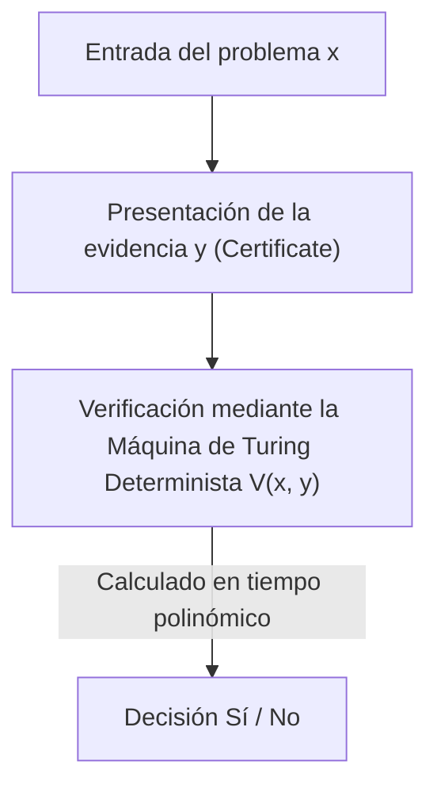
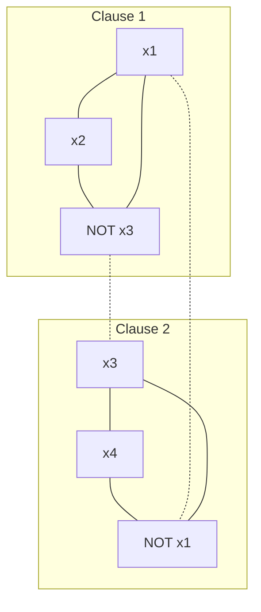

En las matemáticas modernas y en la informática, existe un problema sin resolver que es el más famoso y considerado el más importante. Es el "Problema P vs NP (P vs NP Problem)". Como uno de los Problemas del Milenio establecidos por el Instituto de Matemáticas Clay, con un premio de 1 millón de dólares, este problema no es simplemente un rompecabezas intelectual o un pasatiempo para los matemáticos.

Se trata de un tema extremadamente fundamental que se conecta directamente con la seguridad de internet que sostiene nuestra sociedad, la optimización de la logística y las redes, la predicción de estructuras proteicas en el desarrollo de fármacos, la optimización de modelos de aprendizaje de IA, e incluso con preguntas filosóficas como "¿qué es la creatividad humana?" y "¿puede automatizarse la demostración de teoremas matemáticos?".

En este artículo, comenzando desde los fundamentos de la Teoría de la Complejidad Computacional (Computational Complexity Theory), desentrañaremos completamente el problema P vs NP, abarcando el descubrimiento de la NP-completitud mediante el teorema de Cook-Levin, la clasificación precisa de las clases de complejidad, las tres gigantescas barreras que impiden su demostración (relativización, pruebas naturales, algebrización), el enfoque más reciente de la Teoría Geométrica de la Complejidad (GCT), la relación con las clases de complejidad cuántica (BQP), e incluso hasta la implementación práctica en Python de un solucionador SAT. A través de esta explicación detallada que abarca decenas de miles de caracteres, toquemos el abismo de la teoría de la complejidad.

## Capítulo 1: El nacimiento de la teoría de la complejidad computacional y los fundamentos de la máquina de Turing

Para comprender con precisión el problema P vs NP, primero debemos definir matemáticamente de forma estricta qué es "computación" y qué es "computación eficiente". En la década de 1930, como respuesta negativa al "problema de decisión (Entscheidungsproblem)" propuesto por David Hilbert, Alan Turing ideó la "Máquina de Turing (Turing Machine)", un modelo computacional abstracto, para formular matemáticamente "lo que es computable". Junto con el cálculo lambda de Alonzo Church, este concepto de la máquina de Turing constituye la base de la informática moderna conocida como la "Tesis de Church-Turing".

### Máquina de Turing Determinista (DTM) y la Clase P
Una Máquina de Turing Determinista (DTM) consiste en una cinta unidimensional de longitud infinita, un cabezal que lee y escribe en dicha cinta, y una unidad de control con un número finito de estados. Al leer un símbolo en la cinta en un estado particular, la siguiente acción que la máquina debe tomar (símbolo a escribir, dirección de movimiento del cabezal, siguiente estado) está siempre determinada de forma única.

Hablando más estrictamente, la función de transición $\delta$ de una DTM se define de la siguiente manera:
$$ \delta: Q \times \Gamma \to Q \times \Gamma \times \{L, R\} $$
Aquí, $Q$ es el conjunto finito de estados, $\Gamma$ es el conjunto finito de símbolos de la cinta (incluyendo el símbolo en blanco), y $L, R$ son las direcciones de movimiento del cabezal (Izquierda, Derecha). Para una entrada dada, la transición de estados traza un único camino (Deterministic Path), por lo que se denomina "determinista".

La **Clase P (Tiempo Polinómico)** es el conjunto de problemas de decisión (problemas que se responden con Sí/No) que pueden ser resueltos por esta DTM en un tiempo polinómico $\mathcal{O}(n^k)$ (donde $k$ es una constante) con respecto al tamaño de la entrada $n$. En la práctica, los problemas que pertenecen a P se consideran "problemas que pueden resolverse de manera eficiente" (Tesis de Cobham). Por ejemplo, la ordenación de una lista, la búsqueda del camino más corto (Algoritmo de Dijkstra), el algoritmo para encontrar el máximo común divisor de dos números (Algoritmo de Euclides) e incluso las pruebas de primalidad (Prueba de primalidad de AKS) entran en esta categoría.

### Máquina de Turing No Determinista (NTM) y la Clase NP
Por otro lado, una Máquina de Turing No Determinista (Nondeterministic Turing Machine: NTM) es una máquina virtual que, para un estado y entrada determinados, tiene múltiples candidatos de acciones a tomar, y puede explorar todos ellos "simultáneamente en paralelo (o eligiendo siempre milagrosamente la rama que lleva a la respuesta correcta)".

La formulación estricta de la función de transición $\delta$ de una NTM es la siguiente:
$$ \delta: Q \times \Gamma \to \mathcal{P}(Q \times \Gamma \times \{L, R\}) $$
Aquí, $\mathcal{P}(X)$ representa el conjunto potencia de $X$ (el conjunto de todos los subconjuntos). Es decir, para un estado $q \in Q$ y un símbolo de cinta $a \in \Gamma$, el conjunto de las posibles acciones siguientes se da como $\delta(q, a)$, y la máquina puede elegir cualquiera de estas opciones. El proceso de cálculo de una NTM no forma un único camino, sino una estructura de árbol ramificado (Árbol de computación, Computation Tree). Si al menos uno de los caminos en el árbol de computación alcanza el estado de aceptación (Estado Sí), se considera que la NTM "ha aceptado" la entrada.

#### El mecanismo matemático de la explosión exponencial en la simulación determinista
¿Qué sucede con el tiempo de cálculo al intentar simular el comportamiento de una NTM con una DTM? Si el número máximo de ramificaciones de la función de transición de la NTM es $b$ (por ejemplo $b=2$) y se detiene en un tiempo polinómico $p(n)$ para el tamaño de entrada $n$. La profundidad del árbol de computación es $p(n)$, por lo que el número de hojas (Leaves) en la capa inferior del árbol será como máximo $b^{p(n)}$.
Si la DTM explora todo este árbol de computación (utilizando, por ejemplo, búsqueda en anchura o en profundidad), el número de pasos requeridos será $\mathcal{O}(b^{p(n)})$, lo cual explota exponencialmente (Exponentially) con respecto al tamaño de entrada $n$. Esta es la razón matemática fundamental por la que intuitivamente se cree que P $\neq$ NP. En los cálculos secuenciales deterministas, se considera inevitable pagar un costo masivo de tiempo y espacio para igualar el poder de las "ramificaciones paralelas" que posee el no determinismo.

La **Clase NP (Tiempo Polinómico No Determinista)** es el conjunto de problemas de decisión que pueden ser resueltos en tiempo polinómico utilizando una NTM. Sin embargo, como una definición más intuitiva y práctica, se puede reformular como "el conjunto de problemas en los que, cuando se proporciona una respuesta afirmativa (Sí), se puede verificar la validez de su prueba (Certificate o Witness) en tiempo polinómico utilizando una DTM".


(※ Se utiliza aquí una descripción evitando barras verticales o símbolos especiales.)

Por ejemplo, en la versión de decisión del problema del viajante de comercio ("¿Existe una ruta que visite todas las ciudades exactamente una vez con una distancia total de $K$ o menos?"), si tal ruta (la prueba $y$) nos fuera dada por un dios o un mago, bastaría con sumar la distancia total para verificar si es menor o igual a $K$, lo cual se puede comprobar fácilmente en tiempo polinómico. Por lo tanto, este problema pertenece a NP.

## Capítulo 2: El teorema de Cook-Levin y el amanecer de la NP-completitud

El problema P vs NP (es decir, ¿P = NP?) es una pregunta sumamente natural que plantea: "¿Es igual de fácil encontrar una respuesta que verificarla?". Intuitivamente, parece mucho más difícil encontrar la respuesta (P $\neq$ NP), pero probar esto matemáticamente resulta extremadamente difícil.

### El Problema de Satisfacibilidad (SAT)
Lo que revolucionó este debate fue la investigación independiente de Stephen Cook en 1971 y Leonid Levin en 1973. Se centraron en el "Problema de Satisfacibilidad Booleana (SAT: Boolean Satisfiability Problem)", que pregunta si existe una asignación de variables que haga verdadera una fórmula lógica proposicional.

### El Teorema de Cook-Levin (Cook-Levin Theorem)
"SAT es uno de los problemas más difíciles entre todos los problemas que pertenecen a NP" ——Esta es la esencia del teorema de Cook-Levin. Demostraron que cualquier problema NP puede ser convertido (reducido) a SAT en tiempo polinómico.

La **Reducción en Tiempo Polinómico (Polynomial-time Reduction, Karp Reduction)** significa que la entrada $x$ del problema $A$ puede ser transformada en la entrada $y = f(x)$ del problema $B$ utilizando una función $f$ computable en tiempo polinómico, y se cumple que $x \in A \iff f(x) \in B$ (se escribe como $A \le_p B$).

Cook y Levin representaron las transiciones de cálculo (estado, contenido de la cinta, posición del cabezal) en tiempo polinómico de cualquier NTM utilizando fórmulas lógicas (booleanas) gigantes de manera precisa. Específicamente, introdujeron variables proposicionales (Boolean variables) como "en el tiempo $t$, el símbolo $a$ existe en la celda $i$ de la cinta", "en el tiempo $t$, la máquina está en el estado $q$", "en el tiempo $t$, el cabezal está en la posición $i$". Escribieron como condiciones de restricción (cláusulas compuestas por AND/OR/NOT) que estas variables siguieran correctamente las reglas de transición locales $\delta$ de la máquina de Turing.
Dado que el tiempo de ejecución es $p(n)$, el número de variables necesarias se mantiene en alrededor de $\mathcal{O}(p(n)^2)$, generando en su conjunto una fórmula lógica de tamaño polinómico. Si existe una secuencia de transiciones (prueba) en la que la NTM alcanza el estado de "aceptación (Sí)" para cierta entrada, la fórmula lógica correspondiente se vuelve satisfacible. Con esta demostración, se mostró que si existe un algoritmo de tiempo polinómico para resolver SAT, todos los problemas NP pueden ser resueltos en tiempo polinómico (P = NP).

Un problema como este, "que pertenece a NP y que puede ser reducido desde cualquier problema NP en tiempo polinómico", se denomina **NP-completo (NP-complete)**. SAT fue el primer problema NP-completo descubierto en la historia.

### Reducción de 3-SAT a Conjunto Independiente Máximo (MIS) y Cobertura de Vértices (Vertex Cover): Una demostración rigurosa

En 1972, Richard Karp partió de la NP-completitud de SAT para demostrar que 21 problemas famosos de teoría de grafos y optimización combinatoria eran todos NP-completos. Aquí, desarrollaremos la demostración matemática estricta paso a paso de la reducción en tiempo polinómico de 3-SAT al "Problema del Conjunto Independiente Máximo (Maximum Independent Set: MIS)" y al "Problema de la Cobertura de Vértices (Vertex Cover)", los cuales se enseñan invariablemente en clases de teoría de la complejidad.

**Definición de los problemas:**
- **3-SAT**: Dada una fórmula lógica $\phi$ en forma normal conjuntiva (CNF) en la que cada cláusula (Clause) está compuesta exactamente por la disyunción (OR) de 3 literales (variables o sus negaciones), ¿existe una asignación de variables que haga verdadera a $\phi$?
  $\phi = (l_{11} \lor l_{12} \lor l_{13}) \land (l_{21} \lor l_{22} \lor l_{23}) \land \dots \land (l_{m1} \lor l_{m2} \lor l_{m3})$
- **Conjunto Independiente Máximo (MIS)**: Dado un grafo no dirigido $G=(V, E)$ y un número entero $k$, ¿existe un conjunto de vértices $S \subseteq V$ que no son adyacentes entre sí (no conectados por aristas), cuyo tamaño es $|S| \ge k$?
- **Cobertura de Vértices (Vertex Cover)**: Dado un grafo no dirigido $G=(V, E)$ y un número entero $k'$, ¿existe un conjunto $C \subseteq V$ de tamaño $|C| \le k'$, tal que para cada arista $e \in E$, al menos uno de sus extremos esté contenido en el conjunto $C$?

**Construcción de la función de reducción $f$: 3-SAT $\to$ MIS**
Dada como entrada una fórmula 3-SAT $\phi$ (número de cláusulas $m$), construimos el grafo $G=(V, E)$ y el tamaño objetivo $k$ de la siguiente manera.

1. **Construcción de los vértices (V):**
   Creamos de forma independiente 3 vértices correspondientes a cada literal de cada cláusula $C_i = (l_{i1} \lor l_{i2} \lor l_{i3})$. Por lo tanto, el número total de vértices es estrictamente $|V| = 3m$.
   $V = \{ v_{ij} : 1 \le i \le m, 1 \le j \le 3 \}$

2. **Construcción de las aristas (E):**
   Las aristas se trazan siguiendo las dos reglas siguientes:
   - **Aristas internas (Triangle edges):** Conectamos entre sí los 3 vértices que pertenecen a la misma cláusula. Es decir, formamos un triángulo (un clique de tamaño 3) para cada cláusula.
     $E_{\text{inner}} = \{ (v_{i1}, v_{i2}), (v_{i2}, v_{i3}), (v_{i3}, v_{i1}) : 1 \le i \le m \}$
   - **Aristas de conflicto (Conflict edges):** Trazamos aristas entre vértices correspondientes a literales que son lógicamente contradictorios entre sí (ej. $x$ y $\lnot x$).
     $E_{\text{conflict}} = \{ (v_{ij}, v_{pq}) : l_{ij} = \lnot l_{pq} \}$
   El conjunto total de aristas es $E = E_{\text{inner}} \cup E_{\text{conflict}}$.

3. **Establecimiento del tamaño objetivo $k$:**
   Sea $k = m$ (el número de cláusulas). Esta construcción del grafo se completa claramente en tiempo polinómico $\mathcal{O}(m^2)$.

**Demostración de corrección ($x \in \text{3-SAT} \iff f(x) \in \text{MIS}$):**

**[ Demostración de $\Rightarrow$ (Si es satisfacible, existe un conjunto independiente de tamaño $m$) ]**
Supongamos que $\phi$ es satisfacible. Es decir, existe una asignación de variables que hace verdadera a $\phi$. Bajo esta asignación, cada cláusula $C_i$ tiene al menos un literal que es verdadero (True).
De cada cláusula, elegimos "exactamente uno" de los vértices correspondientes a un literal verdadero, y llamamos a este conjunto $S$. El tamaño de $S$ es claramente $|S| = m = k$.
Demostramos por contradicción que $S$ es un conjunto independiente. Supongamos que hay una arista entre 2 vértices dentro de $S$.
- En el caso de una arista interna: Esto significaría que elegimos 2 vértices de la misma cláusula, lo que contradice nuestro procedimiento de construcción de elegir solo uno de cada cláusula.
- En el caso de una arista de conflicto: Esto significaría que para alguna variable $x$, elegimos tanto el vértice correspondiente a $x$ como el de $\lnot x$. Sin embargo, esto implica que tanto $x$ como $\lnot x$ son verdaderos, lo cual es imposible para una asignación de variables y resulta en una contradicción.
Por lo tanto, no existe ninguna arista entre cualesquiera 2 vértices en $S$, por lo que $S$ es un conjunto independiente de tamaño $m$.

**[ Demostración de $\Leftarrow$ (Si existe un conjunto independiente de tamaño $m$, es satisfacible) ]**
Supongamos que existe un conjunto independiente $S$ de tamaño $m$ en el grafo $G$.
Por la construcción del grafo, dado que 3 vértices que pertenecen a la misma cláusula forman un triángulo (clique), el conjunto independiente $S$ puede incluir como máximo 1 vértice de cada cláusula.
Dado que el número total de vértices es $3m$, el número de cláusulas es $m$, y $|S|=m$, por el principio del palomar (Pigeonhole principle), $S$ debe contener "exactamente un vértice de cada cláusula".
Consideremos la asignación de variables que hace que todos los literales correspondientes a los vértices incluidos en $S$ sean verdaderos (True). Dado que no existen aristas de conflicto (ya que $S$ es un conjunto independiente), nunca ocurrirá que a una variable $x$ y $\lnot x$ se les asigne verdadero simultáneamente. A las variables no incluidas en $S$ les asignamos cualquier valor.
Con esta asignación, el literal seleccionado en cada cláusula es verdadero, lo que hace que toda la fórmula lógica $\phi$ sea satisfacible.

**Imagen ilustrativa del grafo**
En el caso de $\phi = (x_1 \lor x_2 \lor \lnot x_3) \land (\lnot x_1 \lor x_3 \lor x_4)$

(Las líneas continuas representan las aristas internas, las líneas punteadas representan las aristas de conflicto. Elegir un vértice de cada subgrafo que no estén conectados por aristas entre sí logrará MIS.)

**Reducción de MIS a Cobertura de Vértices (Vertex Cover)**
Aún más, debido a la hermosa dualidad en la teoría de grafos, la reducción de MIS a la Cobertura de Vértices es sorprendentemente sencilla.
Teorema: "En un grafo $G=(V, E)$, es equivalente que un subconjunto $S \subseteq V$ sea un conjunto independiente a que su complemento $V \setminus S$ sea una cobertura de vértices."
Demostración: Supongamos que $S$ es un conjunto independiente. Para cualquier arista $e = (u, v) \in E$, es imposible que $u$ y $v$ estén ambos en $S$ (por definición de conjunto independiente). Por lo tanto, al menos uno de $u, v$ está incluido en $V \setminus S$. Esto significa que $V \setminus S$ cubre todas las aristas y satisface la definición de cobertura de vértices. Lo inverso también se puede demostrar exactamente de la misma manera.
Por lo tanto, el problema de si existe un MIS con tamaño objetivo $k$ se reduce en tiempo polinómico al problema de si existe una cobertura de vértices con tamaño objetivo $k' = |V| - k$.

A través de estas reducciones, se reveló la estructura matemática mediante la cual la NP-completitud se propaga desde 3-SAT a MIS, y luego a Vertex Cover.

## Capítulo 3: Problemas NP-intermedios y el impacto de la Clase de Complejidad Cuántica (BQP)

Si P $\neq$ NP, ¿existen problemas con una dificultad "intermedia" que pertenezcan a NP pero no sean ni P ni NP-completos?

### El Teorema de Ladner (Ladner's Theorem)
Richard Ladner demostró en 1975 el **teorema de Ladner**, que establece que "si P $\neq$ NP, entonces deben existir problemas que pertenecen a NP pero que no pertenecen a P ni son NP-completos (problemas NP-intermedios, NP-intermediate problems)".
La prueba de Ladner consistió en construir un lenguaje artificial basado en el método de diagonalización, pero entre los problemas de la vida real que enfrentamos, también hay algunos que se sospecha fuertemente que son NP-intermedios. Por ejemplo, el Problema del Isomorfismo de Grafos (Graph Isomorphism).

### Factorización de enteros y el algoritmo de Shor
Otra frontera gigantesca es la "factorización de enteros", que forma la base de la teoría de la criptografía. Se sabe que la versión de decisión de la factorización ("¿el número entero $N$ tiene un factor primo no trivial menor o igual a $k$?") pertenece a NP, pero se cree que no es NP-completa (debido a la fuerte evidencia teórica de que si fuera NP-completa, la jerarquía polinómica, una jerarquía de clases de complejidad, colapsaría).

Aquí, lo que trajo una revolución a la teoría de la complejidad fue la computadora cuántica.
En 1994, Peter Shor demostró que, al utilizar una computadora cuántica, la factorización de enteros se puede resolver en tiempo polinómico (**Algoritmo de Shor**). Un problema que con algoritmos clásicos toma en el mejor de los casos tiempo subexponencial (ej. la Criba del Cuerpo de Números General), puede ser resuelto con computación cuántica en aproximadamente $\mathcal{O}((\log N)^3)$ tiempo.

### La relación de inclusión entre la clase cuántica BQP y P, NP
Para formalizar esto, se introdujo la clase de complejidad **BQP (Bounded-error Quantum Polynomial-time)**. BQP es la clase de problemas de decisión que pueden resolverse mediante una máquina de Turing cuántica (o el modelo de circuitos cuánticos) en tiempo polinómico, con una probabilidad de error de a lo sumo 1/3.

Se espera que su relación con las clases computacionales clásicas sea de la siguiente manera:
1. $P \subseteq BQP$ (Lo que se puede resolver eficientemente en computadoras clásicas, también se puede resolver en las cuánticas)
2. $BQP \not\subseteq NP$ (BQP podría contener problemas que no pertenecen a NP)
3. $NP \not\subseteq BQP$ (Incluso utilizando una computadora cuántica, los problemas NP-completos no pueden ser resueltos eficientemente)

**Por qué el algoritmo de Shor no resuelve el propio problema P vs NP**
A menudo se malinterpreta en las noticias generales que "si se completa una computadora cuántica, todos los problemas de cálculo (problemas NP) se resolverán en un instante", pero desde el punto de vista de la teoría de la complejidad, esto no es correcto.
El algoritmo de Shor clasificó la factorización de enteros (y el problema del logaritmo discreto) en BQP. Sin embargo, como se mencionó anteriormente, la factorización no es un problema NP-completo.
Si el algoritmo de Shor resolviera "SAT (un problema NP-completo)" en tiempo polinómico, significaría que "las computadoras cuánticas pueden resolver eficientemente todos los problemas NP ($NP \subseteq BQP$)", lo que hubiera sido un gran evento que habría sacudido los cimientos de P vs NP.
Sin embargo, se ha demostrado que, incluso utilizando el poder de las computadoras cuánticas (superposición e interferencia cuántica), el espacio de búsqueda exponencial para resolver los problemas NP-completos no puede comprimirse a un tiempo polinómico. Y usando el Algoritmo de Grover (Grover's Algorithm), la mejora en la velocidad se limita a lo sumo a ser cuadrática (para un espacio de búsqueda $N$, $\mathcal{O}(N) \to \mathcal{O}(\sqrt{N})$; en términos de complejidad temporal, $\mathcal{O}(2^n) \to \mathcal{O}(2^{n/2})$) (Bennett, Bernstein, Brassard, Vazirani, 1997).
Por lo tanto, es un fuerte consenso actual en la informática teórica que, incluso si las computadoras cuánticas se vuelven prácticas, la dificultad esencial del problema P vs NP (especialmente la resolución eficiente de problemas NP-completos) no se resolverá.

## Capítulo 4: ¿Por qué no se puede resolver el problema P vs NP? Las 3 barreras principales

Durante más de medio siglo, genios matemáticos de todo el mundo han intentado resolver el problema P vs NP, y han fracasado. No es simplemente porque le falte intelecto a la humanidad. Existe una "metademostración" de que el marco matemático actual (métodos de demostración) en sí mismo carece de la capacidad para resolver este problema. Estas son las tres barreras gigantes en la teoría de la complejidad.

### 1. La Barrera de la Relativización (Relativization Barrier) y el Teorema de Baker-Gill-Solovay
En 1975, Theodore Baker, John Gill y Robert Solovay utilizaron el concepto llamado "Oráculo (Oracle)". Un oráculo $A$ es una caja negra virtual que te da la respuesta a cierto problema $A$ en un instante (en 1 paso). Añadir la función de consultar a este oráculo en una máquina de Turing se conoce como Máquina de Turing con Oráculo.

Demostraron que con un oráculo, resultaría P=NP, y con otro oráculo diferente, resultaría P$\neq$NP, dando un impacto enorme a la teoría de la complejidad.

**Esbozo completo de la demostración del teorema de Baker-Gill-Solovay**

**Teorema: Existen oráculos $A$ y $B$ que satisfacen las siguientes propiedades:**
1. $P^A = NP^A$
2. $P^B \neq NP^B$

**[ Construcción del oráculo $A$ donde $P^A = NP^A$ ]**
Como el oráculo $A$, elegimos el problema "TQBF (Fórmula Booleana Cuantificada Verdadera)", que es un problema PSPACE-completo.
Una máquina determinista de tiempo polinómico que tiene al oráculo $A$ ($P^A$) puede resolver cualquier problema en PSPACE en tiempo polinómico. Esto se debe a que cualquier problema en PSPACE puede ser reducido en tiempo polinómico a TQBF, y la respuesta se puede obtener haciendo solo una consulta al oráculo. Es decir, $P^A = \text{PSPACE}$.
Por otro lado, una máquina no determinista de tiempo polinómico que tiene al oráculo $A$ ($NP^A$), incluso explotando todo el poder del oráculo, solo puede explorar un espacio de tamaño polinómico dentro de un tiempo polinómico, de modo que $NP^A \subseteq \text{NPSPACE}$. Debido al teorema fundamental de la theory de la complejidad, el teorema de Savitch (Savitch's Theorem), que establece $\text{NPSPACE} = \text{PSPACE}$, se tiene que $NP^A \subseteq \text{PSPACE}$.
Naturalmente, $P^A \subseteq NP^A$, por lo que combinando esto se sostiene que $P^A = NP^A = \text{PSPACE}$.

**[ Construcción del oráculo $B$ donde $P^B \neq NP^B$ ]**
Sea $B$ un lenguaje (conjunto de cadenas), y definamos el siguiente lenguaje $L_B$ relativo al oráculo $B$:
$L_B = \{ 1^n : \text{Existe alguna cadena } x \text{ de longitud } n \text{ en } B \}$
Es evidente que $L_B \in NP^B$. Esto se debe a que una NTM, dado el input $1^n$, puede adivinar (generar) no determinísticamente una cadena $x$ de longitud $n$ y consultar al oráculo $B$ en 1 paso para verificar si $x \in B$.
A continuación, construiremos recursivamente el contenido del oráculo $B$ mediante diagonalización (Diagonalization), de manera que $L_B \notin P^B$.
Enumeramos todas las máquinas de Turing deterministas polinómicas con oráculo como $M_1, M_2, \dots, M_i, \dots$. Suponemos que el tiempo de ejecución de cada $M_i$ está acotado por un polinomio $p_i(n)$.
En la etapa $i$, elegimos una longitud de cadena $n$ suficientemente larga (la hacemos crecer tan rápido de forma que $2^n > p_i(n)$).
Se simula $M_i$ dándole la entrada $1^n$. Durante su ejecución, $M_i$ realizará como máximo $p_i(n)$ consultas al oráculo sobre cadenas.
El número total de cadenas de longitud $n$ es $2^n$. Debido a que $2^n > p_i(n)$, siempre existirá una cadena $y$ de longitud $n$ que $M_i$ "no consultó ni una sola vez al oráculo".
- Si $M_i(1^n)$ finalmente genera "aceptar (1)", decidimos que $B$ no contendrá ninguna cadena de longitud $n$ (lo dejamos como un conjunto vacío en esa longitud). Así, $1^n \notin L_B$, lo que significa que la salida de $M_i$ era incorrecta.
- Si $M_i(1^n)$ finalmente genera "rechazar (0)", añadimos a $B$ la cadena no consultada $y$ mencionada anteriormente. Así, $1^n \in L_B$, y de nuevo, la salida de $M_i$ fue incorrecta.
En el oráculo $B$ construido repitiendo esto infinitamente para todas las máquinas, ninguna DTM puede decidir correctamente el lenguaje $L_B$, por lo tanto $L_B \notin P^B$. Y por ende, $P^B \neq NP^B$.

**El significado de la Barrera de Relativización**
La terrible consecuencia de este teorema es que "los métodos de demostración que no se ven afectados por la existencia de un oráculo (técnicas que relativizan, Relativizing), como la diagonalización o la simulación de estados, jamás podrán resolver el problema P vs NP". Esto es porque, si con esos métodos se pudiera demostrar que P=NP, también se podría demostrar P=NP en el mundo del oráculo $B$, resultando en una contradicción.

### 2. La Barrera de las Pruebas Naturales (Natural Proofs Barrier)
Para superar la barrera de la relativización, los teóricos cambiaron a un enfoque (para demostrar cotas inferiores para la clase P/poly) no mediante el comportamiento de máquinas de Turing, sino demostrando límites inferiores en el tamaño de "Circuitos Booleanos (Boolean Circuits)" combinando puertas lógicas (AND, OR, NOT).
Sin embargo, en 1994, Alexander Razborov y Steven Rudich propusieron el concepto de "Pruebas Naturales (Natural Proofs)".
Señalaron que la mayoría de los métodos para demostrar cotas inferiores de circuitos en ese momento se basaban en extraer "propiedades naturales" que satisfacían la "utilidad (Constructivity)" y "enormidad (Largeness)". Luego, demostraron matemáticamente que si existen funciones unidireccionales (lo que hace que exista la criptografía), es imposible demostrar cotas inferiores para clases de complejidad fuertes mediante dichas "pruebas naturales".
En otras palabras, irónicamente cayeron en una paradoja donde los métodos combinatorios existentes que intentan demostrar P $\neq$ NP dejarán de funcionar al asumir P $\neq$ NP (una forma fuerte de que exista la criptografía).

### 3. La Barrera de la Algebrización (Algebrization Barrier)
Para evitar los obstáculos de la relativización y de las pruebas naturales, lo que se desarrolló en la década de 1990 fueron los "Sistemas de Pruebas Interactivas (Interactive Proofs)" y la "Aritmetización (Arithmetization)". Esto demostró teoremas revolucionarios como IP = PSPACE.
Sin embargo, en 2008, Scott Aaronson y Avi Wigderson demostraron que estos métodos al final dependen de una operación llamada "Algebrización (Algebrization)", que es la extensión de polinomios sobre un cuerpo finito. Y demostraron que cualquier método que utilice la algebrización tampoco podrá resolver el problema P vs NP (ni las separaciones de muchas otras clases de complejidad).

Con estas 3 barreras, es un conocimiento general en la teoría de la computación teórica que "para resolver el problema P vs NP, se requieren matemáticas con un paradigma completamente nuevo".

## Capítulo 5: Práctica - Matemática e Implementación de un solucionador SAT en Python

Mientras que P=NP sigue sin resolverse, en el mundo real de la industria se resuelven a alta velocidad problemas SAT enormes (problemas NP-completos) de millones de variables todos los días. Esto es porque, aunque el peor caso tenga un tiempo exponencial, muchos problemas prácticos (como la verificación de hardware o la resolución de dependencias) poseen una fuerte "estructura". Veamos el algoritmo concreto y su implementación en Python de un solucionador SAT, que es el pilar de la teoría del problema P vs NP.

### El algoritmo DPLL y la matemática del Backtrack
El algoritmo DPLL (Davis-Putnam-Logemann-Loveland) es un método que reduce drásticamente el espacio de búsqueda utilizando características de la fórmula lógica basándose en la búsqueda en profundidad (backtrack).

Los puntos matemáticos principales son dos:
1. **Propagación unitaria (Unit Propagation / Boolean Constraint Propagation):** Cuando solo queda un literal no asignado en una cláusula (Unit Clause), la única manera de hacer la cláusula verdadera es asignando a ese literal el valor verdadero. Esta asignación forzada desencadena en cadena otras propagaciones unitarias, podando el árbol de búsqueda a gran escala.
2. **Eliminación de literales puros (Pure Literal Elimination):** En la fórmula lógica entera, si una variable siempre aparece afirmada (o siempre negada), asignarle a dicho literal un valor verdadero no afecta negativamente la satisfacibilidad de otras cláusulas.

A continuación, se presenta un código de ejemplo en Python, sencillo y didáctico, del algoritmo DPLL.

```python
def dpll(clauses, assignment):
    # Caso base 1: Si todas las cláusulas están satisfechas y la lista está vacía -> Satisfacible (SAT)
    if len(clauses) == 0:
        return True, assignment
    
    # Caso base 2: Si existe una contradicción (una cláusula vacía) -> Insatisfacible (UNSAT)
    if any(len(c) == 0 for c in clauses):
        return False, {}
    
    # Aplicación de la propagación unitaria (Unit Propagation)
    unit_clauses = [c for c in clauses if len(c) == 1]
    if unit_clauses:
        unit = unit_clauses[0][0]
        new_clauses = []
        for c in clauses:
            if unit in c:
                continue # Esta cláusula se hizo verdadera, así que se elimina
            if -unit in c:
                # Se elimina el literal que entra en contradicción
                new_clause = [l for l in c if l != -unit]
                new_clauses.append(new_clause)
            else:
                new_clauses.append(c)
        assignment[abs(unit)] = (unit > 0)
        return dpll(new_clauses, assignment)
    
    # Ramificación (Branching): Seleccionar variables heurísticamente
    # Aquí elegimos simplemente el primer literal de la primera cláusula
    literal = clauses[0][0]
    
    # Explorar asumiendo que la variable es True
    res, final_assign = dpll(clauses + [[literal]], assignment.copy())
    if res:
        return True, final_assign
        
    # Si falla la ramificación anterior, explorar asumiendo la variable como False (backtrack)
    return dpll(clauses + [[-literal]], assignment.copy())

# Ejemplo de ejecución: (x1 OR NOT x2) AND (NOT x1 OR x2 OR x3) AND (NOT x3)
# 1: x1, 2: x2, 3: x3 (los números negativos representan NOT)
cnf_formula = [[1, -2], [-1, 2, 3], [-3]]
is_sat, solution = dpll(cnf_formula, {})

print(f"Satisfiable: {is_sat}")
print(f"Assignment: {solution}")
# Salida esperada:
# Satisfiable: True
# Assignment: {3: False, 1: False, 2: False} (o cualquier otra solución satisfacible)
```

### Evolución hacia el algoritmo CDCL (Conflict-Driven Clause Learning)
Los solucionadores SAT de vanguardia (como MiniSat, Glucose, etc.) adoptan el algoritmo **CDCL (Conflict-Driven Clause Learning)** que expande drásticamente DPLL.

La innovación de CDCL reside en "aprender del fracaso". Cuando se produce una contradicción (Conflict) durante la búsqueda, en lugar de retroceder un paso (Chronological backtracking), construye un Gráfico de Implicación (Implication Graph) para analizar la combinación de variables que es la raíz de la contradicción. Calculando el corte denominado UIP (Unique Implication Point) en el gráfico, convierte la causa de la contradicción en una fórmula lógica y la agrega como una nueva "cláusula aprendida (Learned Clause)" a la expresión original.
Con esto, se consigue un retroceso no cronológico (Non-chronological backtracking / Backjumping) de "no repetir los mismos errores del pasado en otra rama del árbol de búsqueda", logrando podar el árbol de búsqueda exponencial enormemente. Además, al combinar con heurísticas de selección dinámica de variables como VSIDS (Variable State Independent Decaying Sum) o reinicios periódicos (Restarts), el CDCL domina como el pináculo supremo de las heurísticas de la humanidad para los problemas NP-completos.

## Capítulo 6: Enfoques modernos y la Teoría Geométrica de la Complejidad (GCT)

Mientras se interponen estas barreras, ¿con qué enfoques abordan los teóricos actuales el problema P vs NP?

### Teoría Geométrica de la Complejidad (Geometric Complexity Theory: GCT)
En 2001, Ketan Mulmuley y Milind Sohoni propusieron un grandioso programa llamado "Teoría Geométrica de la Complejidad (GCT)", utilizando geometría algebraica y teoría de representación.
La idea fundamental de la GCT es reducir las separaciones de las clases de complejidad a problemas de relación de inclusión geométrica en el espacio de algún polinomio (el cierre de las órbitas).

Específicamente, se centran en las diferencias de simetría entre el Permanente (Permanent, pertenece a #P-completo y es difícil de calcular) y el Determinante (Determinant, calculable en tiempo polinómico). Contemplan estos polinomios como órbitas geométricas (orbits) bajo la acción del grupo lineal general, y mediante la teoría de la representación (polinomios de Schur, o las multiplicidades de representaciones irreducibles), pretenden demostrar que "el cierre de la órbita del Permanente no puede incrustarse dentro del cierre de la órbita del Determinante".
Se espera mucho de la GCT ya que tiene características que pueden eludir las barreras de las pruebas naturales y de la algebrización, y permite movilizar teoremas profundos de otras áreas de las matemáticas (geometría algebraica, teoría de representación, teoría de invariantes). Sin embargo, al ser extremadamente avanzada y difícil, todavía se halla a mitad de camino.

### Cotas inferiores de circuitos y grafos expansores
Por otra parte, como otra dirección, está avanzando la investigación sobre la "Desaleatorización (Derandomization)" que emula la aleatoriedad de los cálculos (BPP) utilizando algoritmos deterministas (P). La teoría de generadores de números pseudoaleatorios, como grafos expansores y extractores (Extractor), está profundamente ligada a la prueba de la cota inferior de circuitos (Paradigma de Hardness vs. Randomness), y han arrojado resultados valiosos tales como "si se puede demostrar una cota inferior de circuitos fuerte, entonces se podrá mostrar que P = BPP". Se cree que estos progresos, a largo plazo, pueden servir como trampolín para demostrar P $\neq$ NP.

## Capítulo 7: Impacto filosófico y tecnológico que P=NP (o P$\neq$NP) tendría sobre el mundo

¿Qué pasaría con nuestra sociedad si se resolviera el problema P vs NP? La mayoría de los expertos cree que P $\neq$ NP, pero si se llegara a demostrar que P = NP, y además se descubre un algoritmo práctico de tiempo polinómico (por ejemplo, $\mathcal{O}(n^2)$ o $\mathcal{O}(n^3)$), el mundo cambiaría de manera dramática y aterradora.

### El colapso de la criptografía de clave pública
Los cifrados RSA y la criptografía de curvas elípticas, que son la infraestructura de seguridad del internet moderno, se basan en el supuesto de que "la factorización de enteros y el problema del logaritmo discreto no se pueden resolver en tiempo polinómico" (más estrictamente, que existen funciones unidireccionales). Si P = NP, entonces se podría encontrar una "prueba" en tiempo polinómico para recuperar el texto plano a partir del texto cifrado, lo cual inutilizaría los cifrados, haciendo colapsar instantáneamente la privacidad en las comunicaciones digitales y el comercio seguro.

### El fin de la ciencia y de la optimización (y la automatización definitiva)
Sin embargo, también tiene un lado positivo. Cualquier problema de optimización formulado como un problema NP-completo —tales como logística (problema del viajante de comercio), la predicción de estructuras de plegamiento de proteínas, diseño de circuitos semiconductores o encontrar los pesos óptimos de la IA— se podrían resolver encontrando sus respuestas óptimas de forma instantánea. Desde solucionar el cambio climático hasta el diseño totalmente automático de nuevos fármacos, esto tendría el impacto de saltarse cientos de años de evolución tecnológica humana.

### La carta de Gödel y la creatividad humana
En 1956, en una carta dirigida a John von Neumann, Kurt Gödel escribió un contenido que, en esencia, preveía el problema P vs NP. Escribió que si fuera posible demostrar un teorema (encontrar una demostración de longitud $n$) en tiempo polinómico, "el trabajo del matemático podría ser reemplazado completamente por una máquina".
Si "verificar una demostración (P)" es equivalente a "idear una demostración (NP)", entonces significaría que "la creatividad humana", como la inspiración artística, la intuición matemática o los destellos de un genio, no son más que un mero algoritmo en tiempo polinómico.

## Conclusión: Mirando al abismo

El problema P vs NP no es simplemente una pregunta sobre el tiempo de ejecución de los algoritmos. Es una cuestión fundamental sobre la inteligencia: "¿Es intrínsecamente distinto el acto de encontrar una respuesta y el acto de comprenderla?".

Incluso hoy en día, matemáticos e informáticos de todo el mundo continúan desafiando este problema. Completar la demostración requerirá conceptos matemáticos completamente nuevos, más allá de nuestra imaginación, capaces de romper las sólidas barreras tales como oráculos, pruebas naturales y algebrización.

¿Llegará el día en que el pináculo de los Problemas del Milenio se resuelva, o se demostrará su independencia como "indemostrable", de la misma forma que el teorema de la incompletitud de Gödel? El viaje de la humanidad que desafía los límites del conocimiento seguirá su curso.
