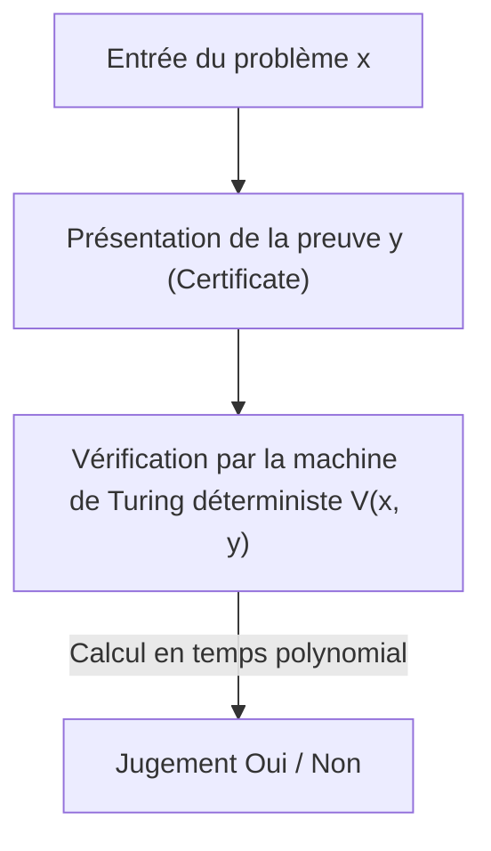
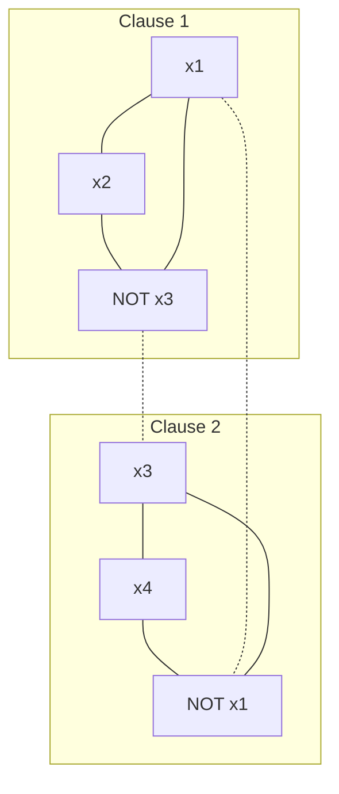

Il existe un problème non résolu considéré comme le plus célèbre et le plus important des mathématiques et de l'informatique modernes. Il s'agit du « problème P contre NP (P vs NP Problem) ». Faisant partie des Problèmes du prix du millénaire définis par l'Institut de mathématiques Clay et assorti d'une récompense d'un million de dollars, ce problème n'est pas un simple casse-tête intellectuel ni un passe-temps pour mathématiciens.

C'est un thème extrêmement fondamental qui est directement lié à la sécurité d'Internet qui soutient notre société, à l'optimisation de la logistique et des réseaux, à la prédiction de la structure des protéines dans le développement de médicaments, à l'optimisation des modèles d'apprentissage de l'IA, et même à des questions philosophiques telles que « qu'est-ce que la créativité humaine ? » ou « la preuve des théorèmes mathématiques peut-elle être automatisée ? ».

Dans cet article, nous décortiquerons entièrement le problème P vs NP, en commençant par les bases de la théorie de la complexité (Computational Complexity Theory), la découverte de la NP-complétude grâce au théorème de Cook-Levin, la classification précise des classes de complexité, les 3 énormes obstacles qui entravent la preuve (relativisation, preuves naturelles, algébrisation), les approches récentes de la théorie de la complexité géométrique (GCT), la relation avec la classe de complexité quantique (BQP), et même l'implémentation pratique d'un solveur SAT en Python. À travers cette explication détaillée de plusieurs dizaines de milliers de caractères, touchons à l'abîme de la théorie de la complexité.

## Chapitre 1 : La naissance de la théorie de la complexité et les bases de la machine de Turing

Pour comprendre précisément le problème P vs NP, il faut d'abord définir mathématiquement et rigoureusement ce qu'est le « calcul » et ce qu'est un « calcul efficace ». Dans les années 1930, en réponse négative au « problème de la décision (Entscheidungsproblem) » proposé par David Hilbert, Alan Turing a inventé un modèle de calcul abstrait, la « machine de Turing (Turing Machine) », afin de formaliser mathématiquement « ce qui est calculable ». Avec le lambda-calcul d'Alonzo Church, ce concept de machine de Turing constitue la pierre angulaire de l'informatique moderne sous le nom de « Thèse de Church-Turing ».

### Machine de Turing déterministe (DTM) et la classe P
Une machine de Turing déterministe (Deterministic Turing Machine : DTM) est constituée d'un ruban unidimensionnel de longueur infinie, d'une tête de lecture/écriture pour ce ruban, et d'une unité de contrôle ayant un nombre fini d'états. Lorsqu'elle lit un certain état et un symbole sur le ruban, la prochaine action que la machine doit entreprendre (le symbole à écrire, la direction de déplacement de la tête, le prochain état) est toujours déterminée de manière unique.

Plus rigoureusement, la fonction de transition $\delta$ de la DTM est définie comme suit :
$$ \delta: Q \times \Gamma \to Q \times \Gamma \times \{L, R\} $$
Ici, $Q$ est un ensemble fini d'états, $\Gamma$ est un ensemble fini de symboles de ruban (incluant le symbole vide), et $L, R$ sont les directions de déplacement de la tête (gauche, droite). Puisque la transition d'état trace une trajectoire unique (Deterministic Path) pour une entrée donnée, elle est qualifiée de « déterministe ».

La **classe P (Polynomial-time)** est l'ensemble des problèmes de décision (des problèmes dont la réponse est Oui/Non) qui peuvent être résolus avec cette DTM en un temps polynomial $\mathcal{O}(n^k)$ (où $k$ est une constante) par rapport à la taille de l'entrée $n$. En pratique, les problèmes appartenant à P sont considérés comme des « problèmes résolubles efficacement » (Thèse de Cobham). Par exemple, le tri d'une liste, la recherche du plus court chemin (algorithme de Dijkstra), l'algorithme pour trouver le plus grand commun diviseur de deux nombres (algorithme d'Euclide), ou encore le test de primalité (test de primalité AKS) en font partie.

### Machine de Turing non déterministe (NTM) et la classe NP
D'un autre côté, une machine de Turing non déterministe (Nondeterministic Turing Machine : NTM) est une machine virtuelle où, pour un état et une entrée donnés, il existe plusieurs actions candidates à entreprendre ensuite, et elle peut les explorer toutes « simultanément en parallèle (ou toujours en choisissant divinement la branche menant à la bonne réponse) ».

La formulation stricte de la fonction de transition $\delta$ d'une NTM est la suivante :
$$ \delta: Q \times \Gamma \to \mathcal{P}(Q \times \Gamma \times \{L, R\}) $$
Ici, $\mathcal{P}(X)$ représente l'ensemble des parties de $X$ (l'ensemble de tous les sous-ensembles). C'est-à-dire que pour un état $q \in Q$ et un symbole de ruban $a \in \Gamma$, l'ensemble des actions possibles suivantes est donné comme $\delta(q, a)$, et la machine peut choisir n'importe laquelle parmi ces options. Le processus de calcul d'une NTM ne forme pas un chemin unique, mais une structure d'arbre ramifié (arbre de calcul, Computation Tree). Si au moins un des chemins de l'arbre de calcul atteint un état d'acceptation (état Oui), la NTM est considérée comme ayant « accepté » cette entrée.

#### Le mécanisme mathématique de l'explosion exponentielle dans la simulation déterministe
Que se passe-t-il avec le temps de calcul si l'on essaie de simuler le fonctionnement d'une NTM avec une DTM ? Supposons que le nombre maximum de branchements de la fonction de transition de la NTM soit $b$ (par exemple $b=2$) et qu'elle s'arrête en un temps polynomial $p(n)$ pour une taille d'entrée $n$. La profondeur de l'arbre de calcul étant $p(n)$, le nombre de feuilles (Leaf) au niveau le plus bas de l'arbre est au maximum $b^{p(n)}$.
Si une DTM explore tout cet arbre de calcul (par exemple en utilisant la recherche en largeur ou la recherche en profondeur), le nombre d'étapes nécessaires devient $\mathcal{O}(b^{p(n)})$, explosant de manière exponentielle (Exponentially) par rapport à la taille de l'entrée $n$. C'est la raison mathématique fondamentale pour laquelle on croit intuitivement que P $\neq$ NP. Dans le calcul séquentiel déterministe, on pense qu'il faut inévitablement payer un coût temporel et spatial énorme pour rattraper la puissance du « branchement parallèle » du non-déterminisme.

La **classe NP (Nondeterministic Polynomial-time)** est l'ensemble des problèmes de décision qui peuvent être résolus en temps polynomial à l'aide d'une NTM. Cependant, comme définition plus intuitive et pratique, on peut la reformuler comme « l'ensemble des problèmes pour lesquels, lorsqu'une réponse Oui est donnée, sa preuve (Certificate ou Witness) peut être vérifiée en temps polynomial à l'aide d'une DTM ».


(* Nous utilisons ici une description évitant les pipes et symboles spéciaux.)

Par exemple, pour la version de décision du problème du voyageur de commerce (« Existe-t-il un itinéraire visitant toutes les villes exactement une fois avec une distance totale inférieure ou égale à $K$ ? »), si un tel itinéraire (la preuve $y$) nous est donné par un dieu ou un magicien, il suffit d'additionner les distances totales pour vérifier si elle est inférieure ou égale à $K$, ce qui est facilement vérifiable en temps polynomial. Par conséquent, ce problème appartient à NP.

## Chapitre 2 : Le théorème de Cook-Levin et l'aube de la NP-complétude

Le problème P vs NP (c'est-à-dire P = NP ?) est une question extrêmement naturelle : « Un problème dont la réponse est facile à vérifier est-il également facile à résoudre ? ». Intuitivement, il semble beaucoup plus difficile de trouver la réponse (P $\neq$ NP), mais le prouver mathématiquement est extrêmement difficile.

### Le problème de satisfaisabilité (SAT)
Ce qui a révolutionné ce débat, ce sont les recherches indépendantes de Stephen Cook en 1971 et de Leonid Levin en 1973. Ils se sont concentrés sur le « problème de satisfaisabilité booléenne (SAT: Boolean Satisfiability Problem) », qui demande s'il existe une affectation de variables rendant vraie une formule logique propositionnelle.

### Le théorème de Cook-Levin (Cook-Levin Theorem)
« SAT est l'un des problèmes les plus difficiles parmi tous les problèmes appartenant à NP » —— voici l'essence du théorème de Cook-Levin. Ils ont prouvé que n'importe quel problème NP peut être transformé (réduit) en SAT en temps polynomial.

La **réduction en temps polynomial (Polynomial-time Reduction, Karp Reduction)** signifie que l'entrée $x$ d'un problème $A$ peut être transformée en une entrée $y = f(x)$ d'un problème $B$ en utilisant une fonction $f$ calculable en temps polynomial, telle que $x \in A \iff f(x) \in B$ soit vraie (on écrit $A \le_p B$).

Cook et Levin ont exprimé précisément la transition du calcul (état, contenu du ruban, position de la tête) d'une NTM arbitraire en temps polynomial sous la forme d'une immense formule logique (expression booléenne). Concrètement, ils introduisent des variables propositionnelles (Boolean variables) telles que « au temps $t$, le symbole $a$ se trouve dans la $i$-ème cellule du ruban », « au temps $t$, la machine est dans l'état $q$ », « au temps $t$, la tête est à la position $i$ ». Ils décrivent comme contraintes (des clauses composées de AND/OR/NOT) le fait que ces variables suivent correctement les règles de transition locales $\delta$ de la machine de Turing.
Puisque le temps d'exécution est $p(n)$, le nombre de variables nécessaires est d'environ $\mathcal{O}(p(n)^2)$, générant au final une formule logique de taille polynomiale. Si, pour une certaine entrée, il existe une séquence de transitions (une preuve) où la NTM atteint l'état « accepté (Oui) », la formule logique correspondante devient satisfaisable. Avec cette preuve, il a été démontré que s'il existe un algorithme en temps polynomial pour résoudre SAT, alors tous les problèmes NP peuvent être résolus en temps polynomial (P = NP).

De tels problèmes, qui « appartiennent à NP et auxquels tous les problèmes NP peuvent être réduits en temps polynomial », sont appelés **NP-complets (NP-complete)**. SAT a été le premier problème NP-complet découvert dans l'histoire.

### Réduction de 3-SAT à l'ensemble indépendant maximum (MIS) et à la couverture de sommets (Vertex Cover) : Preuve stricte

En 1972, Richard Karp, en partant de la NP-complétude de SAT, a prouvé que 21 problèmes célèbres de la théorie des graphes et de l'optimisation combinatoire étaient tous NP-complets. Nous allons développer ici la preuve mathématique stricte étape par étape de la réduction en temps polynomial de « 3-SAT au problème de l'ensemble indépendant maximum (Maximum Independent Set: MIS) » et au « problème de la couverture de sommets (Vertex Cover) », qui sont invariablement abordés dans les cours de théorie de la complexité.

**Définition des problèmes :**
- **3-SAT** : Étant donné une formule logique $\phi$ sous forme normale conjonctive (CNF) où chaque clause (Clause) est constituée de la disjonction (OU) d'exactement 3 littéraux (une variable ou sa négation), existe-t-il une affectation de variables qui rend $\phi$ vraie ?
  $\phi = (l_{11} \lor l_{12} \lor l_{13}) \land (l_{21} \lor l_{22} \lor l_{23}) \land \dots \land (l_{m1} \lor l_{m2} \lor l_{m3})$
- **Ensemble indépendant maximum (MIS)** : Étant donné un graphe non orienté $G=(V, E)$ et un entier $k$, existe-t-il un ensemble de sommets $S \subseteq V$ mutuellement non adjacents (non reliés par une arête) tel que sa taille soit $|S| \ge k$ ?
- **Couverture de sommets (Vertex Cover)** : Étant donné un graphe non orienté $G=(V, E)$ et un entier $k'$, existe-t-il un ensemble $C \subseteq V$ de taille $|C| \le k'$ tel que pour toute arête $e \in E$, au moins l'une de ses extrémités est incluse dans $C$ ?

**Construction de la fonction de réduction $f$ : 3-SAT $\to$ MIS**
Étant donné une formule 3-SAT $\phi$ (avec $m$ clauses) en entrée, nous construisons un graphe $G=(V, E)$ et une taille cible $k$ de la manière suivante.

1. **Construction des sommets (V) :**
   Pour chaque clause $C_i = (l_{i1} \lor l_{i2} \lor l_{i3})$, on crée 3 sommets indépendants correspondant à chaque littéral. Par conséquent, le nombre total de sommets est strictement $|V| = 3m$.
   $V = \{ v_{ij} : 1 \le i \le m, 1 \le j \le 3 \}$

2. **Construction des arêtes (E) :**
   Les arêtes sont tracées selon les 2 règles suivantes.
   - **Arêtes internes (Triangle edges) :** On relie entre eux les 3 sommets appartenant à la même clause. C'est-à-dire qu'on forme un triangle (une clique de taille 3) pour chaque clause.
     $E_{\text{inner}} = \{ (v_{i1}, v_{i2}), (v_{i2}, v_{i3}), (v_{i3}, v_{i1}) : 1 \le i \le m \}$
   - **Arêtes de conflit (Conflict edges) :** On trace une arête entre les sommets correspondant à des littéraux logiquement contradictoires (ex: $x$ et $\lnot x$).
     $E_{\text{conflict}} = \{ (v_{ij}, v_{pq}) : l_{ij} = \lnot l_{pq} \}$
   L'ensemble total des arêtes devient $E = E_{\text{inner}} \cup E_{\text{conflict}}$.

3. **Définition de la taille cible $k$ :**
   On fixe $k = m$ (le nombre de clauses). Cette construction de graphe est manifestement achevée en temps polynomial $\mathcal{O}(m^2)$.

**Preuve de correction ($x \in \text{3-SAT} \iff f(x) \in \text{MIS}$) :**

**[ Preuve de $\Rightarrow$ (Si satisfaisable, il existe un ensemble indépendant de taille $m$) ]**
Supposons que $\phi$ soit satisfaisable. C'est-à-dire qu'il existe une affectation de variables rendant $\phi$ vraie. Sous cette affectation, chaque clause $C_i$ possède au moins un littéral qui devient vrai (True).
Pour chaque clause, on choisit « exactement un » sommet correspondant à un littéral vrai, et on nomme cet ensemble $S$. La taille de $S$ est manifestement $|S| = m = k$.
Montrons par l'absurde que $S$ est un ensemble indépendant. Supposons qu'il y ait une arête entre deux sommets de $S$.
- Dans le cas d'une arête interne : Cela signifierait qu'on a choisi deux sommets de la même clause, ce qui contredit la procédure de construction où l'on n'a choisi qu'un sommet par clause.
- Dans le cas d'une arête de conflit : Cela signifierait qu'on a choisi les sommets correspondant à la fois à $x$ et $\lnot x$ pour une certaine variable $x$. Cependant, cela signifierait que $x$ et $\lnot x$ sont tous deux vrais, ce qui est impossible pour une affectation de variables et constitue une contradiction.
Par conséquent, il n'y a aucune arête entre deux sommets quelconques de $S$, et $S$ est un ensemble indépendant de taille $m$.

**[ Preuve de $\Leftarrow$ (S'il existe un ensemble indépendant de taille $m$, c'est satisfaisable) ]**
Supposons qu'il existe un ensemble indépendant $S$ de taille $m$ dans le graphe $G$.
Par la construction du graphe, les 3 sommets appartenant à la même clause forment un triangle (clique), donc l'ensemble indépendant $S$ peut contenir au maximum un sommet d'une même clause.
Comme le nombre total de sommets est $3m$, le nombre de clauses est $m$, et $|S|=m$, par le principe des tiroirs (Pigeonhole principle), $S$ doit inclure « exactement un sommet de chaque clause ».
Considérons l'affectation de variables où tous les littéraux correspondant aux sommets inclus dans $S$ sont vrais (True). Puisqu'il n'y a pas d'arêtes de conflit ($S$ est un ensemble indépendant), il n'arrivera jamais qu'une variable $x$ et $\lnot x$ soient toutes deux assignées comme vraies. On attribue des valeurs arbitraires aux variables non incluses dans $S$.
Grâce à cette affectation, puisque le littéral choisi dans chaque clause devient vrai, la formule logique globale $\phi$ devient satisfaisable.

**Illustration du graphe**
Dans le cas de $\phi = (x_1 \lor x_2 \lor \lnot x_3) \land (\lnot x_1 \lor x_3 \lor x_4)$

(Les lignes continues représentent les arêtes internes, les lignes pointillées représentent les arêtes de conflit. On atteint MIS si on peut choisir un sommet de chaque sous-graphe, sans qu'ils soient reliés par une arête.)

**Réduction de MIS à la couverture de sommets (Vertex Cover)**
De plus, grâce à la belle dualité de la théorie des graphes, la réduction de MIS à la couverture de sommets est étonnamment simple.
Théorème : « Dans un graphe $G=(V, E)$, le fait qu'un sous-ensemble $S \subseteq V$ soit un ensemble indépendant est équivalent au fait que son complémentaire $V \setminus S$ soit une couverture de sommets. »
Preuve : Supposons que $S$ soit un ensemble indépendant. Pour toute arête $e = (u, v) \in E$, $u$ et $v$ ne peuvent pas être tous les deux inclus dans $S$ (définition de l'ensemble indépendant). Par conséquent, au moins l'un de $u$ ou $v$ est inclus dans $V \setminus S$. Cela signifie que $V \setminus S$ couvre toutes les arêtes, remplissant la définition d'une couverture de sommets. L'inverse se prouve de la même manière.
Ainsi, le problème de savoir s'il existe un MIS de taille cible $k$ se réduit en temps polynomial au problème de savoir s'il existe une couverture de sommets de taille cible $k' = |V| - k$.

À travers ces réductions, la structure mathématique de la propagation de la NP-complétude de 3-SAT à MIS, puis à Vertex Cover, est devenue évidente.

## Chapitre 3 : Les problèmes NP-intermédiaires et le choc de la classe de complexité quantique (BQP)

Si P $\neq$ NP, existe-t-il des problèmes de difficulté « intermédiaire » qui n'appartiennent ni à P ni ne sont NP-complets ?

### Le théorème de Ladner (Ladner's Theorem)
Richard Ladner a prouvé en 1975 le **théorème de Ladner**, selon lequel « si P $\neq$ NP, alors il existe nécessairement des problèmes qui appartiennent à NP mais ni à P ni aux problèmes NP-complets (problèmes NP-intermédiaires, NP-intermediate problems) ».
Bien que la preuve de Ladner construise un langage artificiel basé sur un argument diagonal, il existe certains problèmes auxquels nous sommes confrontés dans la réalité qui sont fortement soupçonnés d'être NP-intermédiaires. Par exemple, le problème de l'isomorphisme de graphes (Graph Isomorphism).

### Factorisation en nombres premiers et l'algorithme de Shor
Une autre frontière immense est la « factorisation d'entiers en nombres premiers », qui forme la base de la théorie de la cryptographie. La version de décision de la factorisation (« L'entier $N$ possède-t-il un facteur premier non trivial inférieur ou égal à $k$ ? ») appartient à NP, mais on pense qu'elle n'est pas NP-complète (car s'il était NP-complet, il y aurait de fortes preuves théoriques que la hiérarchie des classes de complexité, appelée hiérarchie polynomiale, s'effondrerait).

Ici, ce sont les ordinateurs quantiques qui ont apporté une révolution à la théorie de la complexité.
En 1994, Peter Shor a montré que si l'on utilise un ordinateur quantique, la factorisation en nombres premiers peut être résolue en temps polynomial (**algorithme de Shor**). Un problème qui prendrait au mieux un temps sous-exponentiel avec des algorithmes classiques (ex : crible du corps de nombres général) peut être résolu en un temps d'environ $\mathcal{O}((\log N)^3)$ en calcul quantique.

### Relations d'inclusion entre la classe de complexité quantique BQP et P, NP
Pour formaliser cela, la classe de complexité **BQP (Bounded-error Quantum Polynomial-time)** a été introduite. BQP est la classe des problèmes de décision qui peuvent être résolus en temps polynomial à l'aide d'une machine de Turing quantique (ou d'un modèle de circuit quantique) avec une probabilité d'erreur inférieure ou égale à 1/3.

On suppose que la relation avec les classes de calcul classiques est la suivante :
1. $P \subseteq BQP$ (Ce qui peut être résolu efficacement par un ordinateur classique peut l'être par le quantique)
2. $BQP \not\subseteq NP$ (BQP pourrait inclure des problèmes n'appartenant pas à NP)
3. $NP \not\subseteq BQP$ (Même en utilisant un ordinateur quantique, les problèmes NP-complets ne peuvent pas être résolus efficacement)

**Pourquoi l'algorithme de Shor ne résout pas le problème P vs NP lui-même**
Dans les actualités grand public, on se méprend souvent en pensant que « si l'ordinateur quantique est achevé, tous les problèmes de calcul (problèmes NP) seront résolus instantanément », mais du point de vue de la théorie de la complexité, c'est faux.
L'algorithme de Shor a classé la factorisation des entiers (et le problème du logarithme discret) dans BQP. Cependant, comme mentionné précédemment, la factorisation en nombres premiers n'est pas un problème NP-complet.
Si l'algorithme de Shor permettait de résoudre « SAT (problème NP-complet) » en temps polynomial, cela signifierait que « l'ordinateur quantique peut résoudre efficacement tous les problèmes NP ($NP \subseteq BQP$) », ce qui aurait été un événement bouleversant pour le cadre de P vs NP.
Cependant, il a été prouvé que même en utilisant la puissance des ordinateurs quantiques (superposition et interférence quantique), il n'est pas possible de compresser en temps polynomial l'espace de recherche exponentiel nécessaire pour résoudre les problèmes NP-complets. Même en utilisant l'algorithme de Grover (Grover's Algorithm), l'amélioration de la vitesse est au mieux quadratique (pour un espace de recherche $N$, on passe de $\mathcal{O}(N)$ à $\mathcal{O}(\sqrt{N})$, et en complexité temporelle de $\mathcal{O}(2^n)$ à $\mathcal{O}(2^{n/2})$) (Bennett, Bernstein, Brassard, Vazirani, 1997).
Par conséquent, il y a un solide consensus en informatique théorique moderne selon lequel, même si les ordinateurs quantiques deviennent pratiques, la difficulté intrinsèque du problème P vs NP (en particulier la résolution efficace des problèmes NP-complets) ne sera pas résolue.

## Chapitre 4 : Pourquoi le problème P vs NP ne peut-il pas être résolu ? Les 3 principaux obstacles

Pendant plus d'un demi-siècle, des mathématiciens de génie du monde entier se sont attaqués au problème P vs NP, et ont échoué. Ce n'est pas simplement que l'humanité manque d'intelligence. Il y a une « méta-preuve » indiquant que le cadre mathématique actuel (les méthodes de preuve) manque de la capacité à résoudre ce problème. Ce sont les 3 énormes obstacles dans la théorie de la complexité.

### 1. L'obstacle de la relativisation (Relativization Barrier) et le théorème de Baker-Gill-Solovay
En 1975, Theodore Baker, John Gill et Robert Solovay ont utilisé un concept appelé « oracle (oracle) ». Un oracle $A$ est une boîte noire virtuelle qui donne la réponse à un certain problème $A$ instantanément (en 1 étape). Une machine de Turing ajoutant cette fonction d'interrogation à cet oracle est appelée machine de Turing avec oracle.

Ils ont prouvé que sous un certain oracle on obtient P=NP, et sous un autre oracle on obtient P≠NP, causant un choc dans la théorie de la complexité.

**Esquisse de preuve complète du théorème de Baker-Gill-Solovay**

**Théorème : Il existe des oracles $A$ et $B$ satisfaisant les propriétés suivantes.**
1. $P^A = NP^A$
2. $P^B \neq NP^B$

**[ Construction de l'oracle $A$ tel que $P^A = NP^A$ ]**
Comme oracle $A$, on choisit le problème PSPACE-complet « TQBF (True Quantified Boolean Formula) ».
Une machine à temps polynomial déterministe ayant l'oracle $A$ ($P^A$) peut résoudre n'importe quel problème dans PSPACE en temps polynomial. En effet, tout problème dans PSPACE peut être réduit à TQBF en temps polynomial, et on peut obtenir la réponse en interrogeant l'oracle une seule fois. C'est-à-dire que $P^A = \text{PSPACE}$.
D'un autre côté, une machine à temps polynomial non déterministe avec l'oracle $A$ ($NP^A$), même en utilisant pleinement la puissance de l'oracle, ne peut explorer qu'un espace de taille polynomiale en temps polynomial, donc $NP^A \subseteq \text{NPSPACE}$. D'après le théorème de Savitch (Savitch's Theorem), un théorème fondamental de la théorie de la complexité, $\text{NPSPACE} = \text{PSPACE}$, donc $NP^A \subseteq \text{PSPACE}$.
Naturellement, $P^A \subseteq NP^A$, donc en combinant tout cela, il est établi que $P^A = NP^A = \text{PSPACE}$.

**[ Construction de l'oracle $B$ tel que $P^B \neq NP^B$ ]**
Soit $B$ un certain langage (ensemble de chaînes de caractères). Pour l'oracle $B$, on définit le langage suivant $L_B$ :
$L_B = \{ 1^n : \text{une chaîne de caractères } x \text{ de longueur } n \text{ existe dans } B \}$
Il est évident que $L_B \in NP^B$. En effet, pour l'entrée $1^n$, la NTM devine (génère) de manière non déterministe une chaîne $x$ de longueur $n$, et peut vérifier en 1 étape auprès de l'oracle $B$ si $x \in B$.
Ensuite, pour que $L_B \notin P^B$, on construit le contenu de l'oracle $B$ de manière récursive en utilisant l'argument diagonal (Diagonalization).
On énumère toutes les machines à oracle à temps polynomial déterministes $M_1, M_2, \dots, M_i, \dots$. Supposons que le temps d'exécution de chaque $M_i$ soit limité par un polynôme $p_i(n)$.
À l'étape $i$, on choisit une longueur de chaîne $n$ suffisamment grande (augmentée rapidement pour que $2^n > p_i(n)$).
On simule $M_i$ en lui donnant l'entrée $1^n$. Pendant l'exécution, $M_i$ interroge l'oracle sur au plus $p_i(n)$ chaînes de caractères.
Puisque le nombre total de chaînes de longueur $n$ est $2^n$, et que $2^n > p_i(n)$, il existe nécessairement une chaîne $y$ de longueur $n$ pour laquelle $M_i$ « n'a jamais interrogé l'oracle ».
- Si $M_i(1^n)$ affiche finalement « accepté (1) », on décide de ne pas inclure de chaîne de longueur $n$ dans $B$ (on en fait un ensemble vide). De cette manière, $1^n \notin L_B$, et le résultat de $M_i$ s'avère faux.
- Si $M_i(1^n)$ affiche finalement « rejeté (0) », on ajoute la chaîne non interrogée $y$ à $B$. De cette manière, $1^n \in L_B$, et là encore le résultat de $M_i$ s'avère faux.
Dans l'oracle $B$ construit en répétant cela indéfiniment pour toutes les machines, aucune DTM ne peut juger correctement le langage $L_B$, ce qui donne $L_B \notin P^B$. Par conséquent, $P^B \neq NP^B$.

**Signification de l'obstacle de la relativisation**
La terrible conclusion de ce théorème est que « les méthodes de preuve qui ne sont pas affectées par l'existence d'un oracle (qui se relativisent, Relativizing), comme l'argument diagonal ou la simulation d'états, ne pourront jamais résoudre le problème P vs NP ». Car si cette méthode permettait de prouver P=NP, elle permettrait également de prouver P=NP dans le monde de l'oracle $B$, conduisant à une contradiction.

### 2. L'obstacle des preuves naturelles (Natural Proofs Barrier)
Afin de surmonter l'obstacle de la relativisation, les théoriciens se sont tournés non pas vers le fonctionnement des machines de Turing, mais vers l'approche consistant à montrer une borne inférieure de la taille des « circuits booléens (Boolean Circuits) » combinant des portes logiques (AND, OR, NOT) (preuve de borne inférieure pour la classe P/poly).
Cependant, en 1994, Alexander Razborov et Steven Rudich ont proposé le concept de « preuves naturelles (Natural Proofs) ».
Ils ont souligné que la plupart des méthodes de preuve de borne inférieure des circuits de l'époque reposaient sur l'extraction de « propriétés naturelles » satisfaisant à la fois « la constructivité (Constructivity) » et « la grandeur (Largeness) ». Ils ont alors prouvé mathématiquement que s'il existe des fonctions à sens unique (si la cryptographie est possible), il est impossible de prouver une borne inférieure pour des classes de complexité fortes par de telles « preuves naturelles ».
En d'autres termes, les méthodes combinatoires existantes pour prouver P $\neq$ NP sont paradoxalement tombées dans le piège où elles cessent de fonctionner si l'on suppose P $\neq$ NP (sous la forme forte de l'existence de la cryptographie).

### 3. L'obstacle de l'algébrisation (Algebrization Barrier)
Pour éviter les murs de la relativisation et des preuves naturelles, les années 1990 ont vu le développement des « systèmes de preuves interactives (Interactive Proofs) » et de « l'arithmétisation (Arithmetization) ». Cela a permis de prouver des théorèmes révolutionnaires tels que IP = PSPACE.
Cependant, en 2008, Scott Aaronson et Avi Wigderson ont montré que ces méthodes dépendaient finalement d'une opération appelée « algébrisation (Algebrization) », consistant à étendre des polynômes sur des corps finis. Ils ont ensuite prouvé que les méthodes utilisant l'algébrisation ne pouvaient pas résoudre le problème P vs NP (ni séparer beaucoup d'autres classes de complexité).

En raison de ces 3 obstacles, le constat « il faut des mathématiques basées sur un paradigme entièrement nouveau pour résoudre le problème P vs NP » est devenu une évidence en informatique théorique.

## Chapitre 5 : Pratique - Mathématiques et implémentation Python d'un solveur SAT

Alors que P=NP reste non résolu, dans le monde industriel réel, d'énormes problèmes SAT (problèmes NP-complets) avec des millions de variables sont résolus rapidement chaque jour. Cela s'explique par le fait que, même si le temps de calcul dans le pire des cas est exponentiel, de nombreux problèmes pratiques (comme la vérification matérielle ou la résolution de dépendances) possèdent une « structure » forte. Examinons l'algorithme concret et l'implémentation Python d'un solveur SAT, qui est au cœur de la théorie du problème P vs NP.

### L'algorithme DPLL et les mathématiques du retour sur trace (backtrack)
L'algorithme DPLL (Davis-Putnam-Logemann-Loveland) est une méthode basée sur la recherche en profondeur (backtrack), qui utilise les caractéristiques des formules logiques pour réduire drastiquement l'espace de recherche.

Les points mathématiques clés sont les 2 suivants :
1. **Propagation unitaire (Unit Propagation / Boolean Constraint Propagation) :** Lorsqu'il ne reste qu'un seul littéral non assigné dans une clause (Unit Clause), pour rendre cette clause vraie, la seule option est de rendre ce littéral vrai. Cette assignation forcée provoque une propagation unitaire en chaîne vers d'autres clauses, élaguant considérablement l'arbre de recherche.
2. **Élimination des littéraux purs (Pure Literal Elimination) :** Dans l'ensemble de la formule logique, si une variable apparaît toujours sous forme affirmative (ou toujours négative), assigner vrai à ce littéral n'aura pas d'impact négatif sur la satisfaisabilité des autres clauses.

Voici un exemple de code Python simple et éducatif de l'algorithme DPLL.

```python
def dpll(clauses, assignment):
    # Cas de base 1 : Si toutes les clauses sont satisfaites et que la liste est vide -> Satisfaisable (SAT)
    if len(clauses) == 0:
        return True, assignment
    
    # Cas de base 2 : S'il y a une contradiction (clause vide) -> Insatisfaisable (UNSAT)
    if any(len(c) == 0 for c in clauses):
        return False, {}
    
    # Application de la propagation unitaire (Unit Propagation)
    unit_clauses = [c for c in clauses if len(c) == 1]
    if unit_clauses:
        unit = unit_clauses[0][0]
        new_clauses = []
        for c in clauses:
            if unit in c:
                continue # Cette clause est devenue vraie, on la supprime
            if -unit in c:
                # On retire le littéral contradictoire
                new_clause = [l for l in c if l != -unit]
                new_clauses.append(new_clause)
            else:
                new_clauses.append(c)
        assignment[abs(unit)] = (unit > 0)
        return dpll(new_clauses, assignment)
    
    # Branchement (Branching) : Sélection heuristique d'une variable
    # Ici on choisit simplement le premier littéral de la première clause
    literal = clauses[0][0]
    
    # Recherche en supposant la variable True
    res, final_assign = dpll(clauses + [[literal]], assignment.copy())
    if res:
        return True, final_assign
        
    # Si la branche ci-dessus échoue, recherche en supposant la variable False (Backtrack)
    return dpll(clauses + [[-literal]], assignment.copy())

# Exemple d'exécution : (x1 OR NOT x2) AND (NOT x1 OR x2 OR x3) AND (NOT x3)
# 1: x1, 2: x2, 3: x3 (Les nombres négatifs représentent NOT)
cnf_formula = [[1, -2], [-1, 2, 3], [-3]]
is_sat, solution = dpll(cnf_formula, {})

print(f"Satisfiable: {is_sat}")
print(f"Assignment: {solution}")
# Sortie attendue :
# Satisfiable: True
# Assignment: {3: False, 1: False, 2: False} (ou une autre solution satisfaisante)
```

### Évolution vers l'algorithme CDCL (Conflict-Driven Clause Learning)
Les solveurs SAT modernes de pointe (MiniSat, Glucose, etc.) adoptent l'algorithme **CDCL (Conflict-Driven Clause Learning)**, qui est une extension majeure de DPLL.

L'innovation de CDCL réside dans le fait d'« apprendre de ses échecs ». Lorsqu'une contradiction (Conflict) se produit pendant la recherche, au lieu de simplement revenir à l'étape précédente (Chronological backtracking), l'algorithme construit un graphe d'implication (Implication Graph) pour analyser la combinaison de variables à l'origine de la contradiction. En calculant une coupe appelée UIP (Unique Implication Point) sur le graphe, la cause de la contradiction est transformée sous forme de formule logique, et ajoutée à la formule originale en tant que nouvelle « clause apprise (Learned Clause) ».
Cela permet un retour sur trace non chronologique (Non-chronological backtracking / Backjumping) consistant à « ne pas répéter la même erreur passée dans une autre branche de l'arbre de recherche », élaguant drastiquement l'arbre de recherche exponentiel. De plus, en combinant des heuristiques de sélection de variables dynamiques comme VSIDS (Variable State Independent Decaying Sum) et des redémarrages (Restarts) réguliers, CDCL règne comme le sommet de l'heuristique humaine pour les problèmes NP-complets.

## Chapitre 6 : Approches modernes et théorie de la complexité géométrique (GCT)

Face à ces obstacles, avec quelles approches les théoriciens actuels tentent-ils de résoudre le problème P vs NP ?

### Théorie de la complexité géométrique (Geometric Complexity Theory : GCT)
En 2001, Ketan Mulmuley et Milind Sohoni ont proposé un programme grandiose utilisant la géométrie algébrique et la théorie des représentations : la « Théorie de la complexité géométrique (GCT) ».
L'idée fondamentale de la GCT est de réduire la séparation des classes de complexité à un problème d'inclusion géométrique dans l'espace de certains polynômes (fermetures d'orbites).

Plus précisément, elle se concentre sur la différence de symétrie entre le permanent (Permanent, appartenant à #P-complet et difficile à calculer) et le déterminant (Determinant, calculable en temps polynomial). Ces polynômes sont considérés comme des orbites géométriques sous l'action du groupe linéaire général, et en utilisant la théorie des représentations (les polynômes de Schur et les multiplicités de représentations irréductibles), on cherche à montrer que « la fermeture de l'orbite du Permanent ne peut pas être plongée dans la fermeture de l'orbite du Determinant ».
La GCT est censée posséder les caractéristiques permettant de contourner les obstacles des preuves naturelles et de l'algébrisation, et suscite beaucoup d'espoirs en mobilisant des théorèmes profonds d'autres domaines des mathématiques (géométrie algébrique, théorie des représentations, théorie des invariants), mais étant extrêmement avancée et difficile, elle est toujours à mi-chemin.

### Bornes inférieures de circuits et graphes expanseurs
D'autre part, une autre direction est l'étude de la « dérandomisation (Derandomization) », qui consiste à imiter le caractère aléatoire du calcul (BPP) par des algorithmes déterministes (P). La théorie des générateurs de nombres pseudo-aléatoires, comme les graphes expanseurs et les extracteurs (Extractor), est profondément liée à la preuve de bornes inférieures pour les circuits (paradigme Hardness vs. Randomness), et a produit de riches résultats tels que « si l'on peut prouver une forte borne inférieure pour les circuits, alors on peut montrer P = BPP ». Ces avancées sont également considérées comme un tremplin à long terme vers la preuve de P $\neq$ NP.

## Chapitre 7 : L'impact philosophique et technologique de P=NP (ou P≠NP) sur le monde

Si le problème P vs NP était résolu, que deviendrait notre société ? Beaucoup d'experts croient en P $\neq$ NP, mais s'il était prouvé que P = NP, et que par ailleurs un algorithme en temps polynomial pratique (par exemple $\mathcal{O}(n^2)$ ou $\mathcal{O}(n^3)$) était découvert, le monde changerait de façon spectaculaire, et de façon assez effrayante.

### L'effondrement de la cryptographie à clé publique
La cryptographie RSA et la cryptographie sur les courbes elliptiques, qui constituent la base de la sécurité d'Internet moderne, reposent sur la prémisse selon laquelle « la factorisation en nombres premiers et le problème du logarithme discret ne peuvent pas être résolus en temps polynomial » (plus rigoureusement, sur le fait qu'il existe des fonctions à sens unique). Si P = NP, la « preuve » permettant de restaurer le texte clair à partir du texte chiffré pourrait être trouvée en temps polynomial, ce qui rendrait la cryptographie inefficace et provoquerait l'effondrement instantané de la vie privée dans les communications numériques et des transactions financières sécurisées.

### Optimisation et fin de la science (et automatisation ultime)
Cependant, il y a aussi un bon côté. Tous les problèmes d'optimisation formulés comme des problèmes NP-complets, tels que la logistique (problème du voyageur de commerce), la prédiction du repliement des protéines, la conception de circuits semi-conducteurs et la découverte des poids optimaux pour l'IA, pourraient obtenir instantanément des solutions optimales. Cela aurait un impact capable de faire faire un bond de plusieurs siècles à l'évolution technologique de l'humanité, allant de la résolution du changement climatique à la conception automatisée complète de nouveaux médicaments.

### La lettre de Gödel et la créativité humaine
En 1956, Kurt Gödel a écrit une lettre à John von Neumann dans laquelle il prévoyait de façon inhérente le problème P vs NP. Gödel y écrivait que si la preuve d'un théorème (la découverte d'une preuve de longueur $n$) était possible en temps polynomial, « le travail des mathématiciens serait complètement remplacé par des machines ».
Si « vérifier une preuve (P) » est équivalent à « avoir l'intuition d'une preuve (NP) », alors la « créativité humaine », comme l'inspiration artistique, l'intuition mathématique, et le génie, ne serait rien d'autre qu'un simple algorithme en temps polynomial.

## Conclusion : Regarder l'abîme

Le problème P vs NP n'est pas seulement une question de temps d'exécution d'algorithmes. C'est une interrogation fondamentale sur l'intelligence : « Y a-t-il une différence intrinsèque entre trouver une réponse et la comprendre ? ».

Aujourd'hui encore, les mathématiciens et les informaticiens du monde entier continuent de s'attaquer à ce problème. L'achèvement d'une preuve nécessitera de nouveaux concepts mathématiques qui dépassent notre imagination, brisant les solides obstacles que sont les oracles, les preuves naturelles et l'algébrisation.

Viendra-t-il un jour où ce mystère, trônant au sommet des problèmes du prix du millénaire, sera résolu, ou sera-t-il prouvé comme étant « indémontrable » (indépendant), comme le théorème d'incomplétude de Gödel ? Le voyage de l'humanité repoussant les limites de la connaissance continuera.
