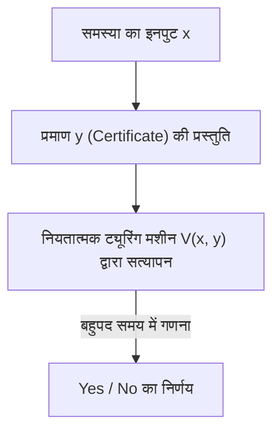
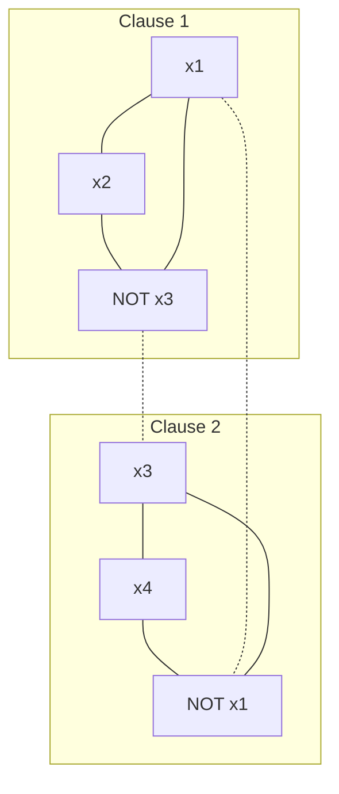

आधुनिक गणित और कंप्यूटर विज्ञान में सबसे प्रसिद्ध और सबसे महत्वपूर्ण अनसुलझी समस्याओं में से एक है। वह है "P बनाम NP समस्या (P vs NP Problem)"। क्ले गणित संस्थान द्वारा निर्धारित मिलेनियम पुरस्कार समस्याओं में से एक के रूप में 1 मिलियन डॉलर के इनाम वाली यह समस्या केवल एक बौद्धिक पहेली या गणितज्ञों के समय बिताने का साधन नहीं है।

यह एक अत्यंत मौलिक विषय है जो हमारे समाज का समर्थन करने वाली इंटरनेट सुरक्षा, रसद और नेटवर्क अनुकूलन, दवा खोज में प्रोटीन संरचना की भविष्यवाणी, AI लर्निंग मॉडल के अनुकूलन, और यहां तक ​​कि "मानवीय रचनात्मकता क्या है" और "क्या गणितीय प्रमेयों के प्रमाण को स्वचालित किया जा सकता है" जैसे दार्शनिक प्रश्नों से सीधे जुड़ा हुआ है।

इस लेख में, हम कम्प्यूटेशनल जटिलता सिद्धांत (Computational Complexity Theory) के मूल सिद्धांतों से शुरू करते हुए, कुक-लेविन प्रमेय द्वारा NP-पूर्णता की खोज, जटिलता वर्गों के सूक्ष्म वर्गीकरण, प्रमाण को बाधित करने वाली 3 विशाल बाधाओं (सापेक्षता, प्राकृतिक प्रमाण, बीजगणितीयकरण), नवीनतम ज्यामितीय जटिलता सिद्धांत (GCT) के दृष्टिकोण, क्वांटम जटिलता वर्ग (BQP) के साथ संबंध, और व्यावहारिक SAT सॉल्वर के पायथन कार्यान्वयन तक, P बनाम NP समस्या का पूरी तरह से विश्लेषण करेंगे। दसियों हज़ार शब्दों के इस विस्तृत स्पष्टीकरण के माध्यम से, आइए कम्प्यूटेशनल जटिलता सिद्धांत की गहराई का स्पर्श करें।

## अध्याय 1: कम्प्यूटेशनल जटिलता सिद्धांत का जन्म और ट्यूरिंग मशीन के मूल सिद्धांत

P बनाम NP समस्या को सटीक रूप से समझने के लिए, सबसे पहले "गणना" क्या है और "कुशल गणना" क्या है, इसे गणितीय रूप से सख्ती से परिभाषित करना आवश्यक है। 1930 के दशक में, डेविड हिल्बर्ट द्वारा प्रस्तावित "निर्णय समस्या (Entscheidungsproblem)" के नकारात्मक उत्तर के रूप में, एलन ट्यूरिंग ने "गणना योग्य चीज़ों" को गणितीय रूप से तैयार करने के लिए एक अमूर्त कम्प्यूटेशनल मॉडल "ट्यूरिंग मशीन (Turing Machine)" का आविष्कार किया। अलोंजो चर्च के लैम्ब्डा कैलकुलस के साथ, यह ट्यूरिंग मशीन अवधारणा "चर्च-ट्यूरिंग थीसिस" के रूप में आधुनिक कंप्यूटर विज्ञान की आधारशिला बन गई है।

### नियतात्मक ट्यूरिंग मशीन (DTM) और वर्ग P
एक नियतात्मक ट्यूरिंग मशीन (Deterministic Turing Machine: DTM) में एक अनंत लंबाई वाला एक-आयामी टेप, उस टेप को पढ़ने और लिखने के लिए एक हेड, और सीमित संख्या में अवस्थाओं वाला एक नियंत्रण भाग होता है। जब किसी विशेष अवस्था और टेप पर एक प्रतीक को पढ़ा जाता है, तो मशीन द्वारा की जाने वाली अगली कार्रवाई (लिखा जाने वाला प्रतीक, हेड के जाने की दिशा, अगली अवस्था) हमेशा विशिष्ट रूप से निर्धारित होती है।

अधिक सख्ती से कहें तो, DTM का संक्रमण फ़ंक्शन $\delta$ इस प्रकार परिभाषित किया गया है:
$$ \delta: Q \times \Gamma \to Q \times \Gamma \times \{L, R\} $$
यहाँ, $Q$ अवस्थाओं का एक परिमित समुच्चय है, $\Gamma$ टेप प्रतीकों का एक परिमित समुच्चय है (जिसमें रिक्त प्रतीक शामिल है), और $L, R$ हेड की गति की दिशाएं (बाएं, दाएं) हैं। इनपुट के लिए, अवस्था संक्रमण एक एकल प्रक्षेपवक्र (Deterministic Path) खींचता है, इसलिए इसे "नियतात्मक" कहा जाता है।

**वर्ग P (Polynomial-time)** उन निर्णय समस्याओं (हाँ/ना में उत्तर देने वाली समस्याएँ) का समुच्चय है जिन्हें इस DTM का उपयोग करके इनपुट आकार $n$ के संबंध में बहुपद समय $\mathcal{O}(n^k)$ ($k$ एक स्थिरांक है) में हल किया जा सकता है। व्यावहारिक रूप से, P में आने वाली समस्याओं को "कुशलतापूर्वक हल करने योग्य समस्याएँ" माना जाता है (कोभम की थीसिस)। उदाहरण के लिए, सूचियों को छाँटना, सबसे छोटे पथ की खोज (डिजक्स्ट्रा का एल्गोरिदम), दो संख्याओं का सबसे बड़ा सामान्य भाजक खोजने का एल्गोरिदम (यूक्लिडियन एल्गोरिदम), और यहां तक कि अभाज्य संख्या परीक्षण (AKS अभाज्य परीक्षण) भी इसी श्रेणी में आते हैं।

### अनिर्धारणात्मक ट्यूरिंग मशीन (NTM) और वर्ग NP
दूसरी ओर, एक अनिर्धारणात्मक ट्यूरिंग मशीन (Nondeterministic Turing Machine: NTM) एक आभासी मशीन है जहाँ किसी अवस्था और इनपुट के लिए, अगली कार्रवाई के कई उम्मीदवार मौजूद होते हैं, और वह उन सभी को "एक साथ समानांतर में (या हमेशा उस शाखा को जादुई रूप से चुनकर जो सही उत्तर की ओर ले जाती है)" खोज सकती है।

NTM के संक्रमण फ़ंक्शन $\delta$ का कठोर सूत्रीकरण इस प्रकार है:
$$ \delta: Q \times \Gamma \to \mathcal{P}(Q \times \Gamma \times \{L, R\}) $$
यहाँ $\mathcal{P}(X)$ समुच्चय $X$ के घात समुच्चय (सभी उपसमुच्चयों का समुच्चय) को दर्शाता है। अर्थात, एक अवस्था $q \in Q$ और टेप प्रतीक $a \in \Gamma$ के लिए, अगली संभावित क्रियाओं का समुच्चय $\delta(q, a)$ के रूप में दिया जाता है, और मशीन इन विकल्पों में से किसी को भी चुन सकती है। NTM की गणना प्रक्रिया एक एकल पथ नहीं बल्कि एक शाखायुक्त वृक्ष संरचना (गणना वृक्ष, Computation Tree) बनाती है। यदि गणना वृक्ष के पथों में से कम से कम एक स्वीकृति अवस्था (Yes अवस्था) तक पहुँचता है, तो NTM को उस इनपुट को "स्वीकार" करने वाला माना जाता है।

#### नियतात्मक सिमुलेशन में घातीय विस्फोट का गणितीय तंत्र
यदि हम NTM के संचालन को DTM के साथ अनुकरण करने का प्रयास करते हैं, तो गणना समय का क्या होगा? मान लीजिए NTM के संक्रमण फ़ंक्शन की अधिकतम शाखाओं की संख्या $b$ है (उदाहरण के लिए $b=2$), और यह इनपुट आकार $n$ के लिए बहुपद समय $p(n)$ में रुक जाता है। चूँकि गणना वृक्ष की गहराई $p(n)$ है, वृक्ष के सबसे निचले स्तर पर पत्तियों (Leaf) की अधिकतम संख्या $b^{p(n)}$ होगी।
जब DTM इस पूरे गणना वृक्ष को खोजता है (उदाहरण के लिए चौड़ाई-प्रथम खोज या गहराई-प्रथम खोज का उपयोग करके), तो आवश्यक चरणों की संख्या $\mathcal{O}(b^{p(n)})$ हो जाती है, जो इनपुट आकार $n$ के संबंध में घातीय रूप से (Exponentially) विस्फोट करती है। यही गणितीय मूल कारण है जिसके लिए सहज रूप से माना जाता है कि P $\neq$ NP है। नियतात्मक अनुक्रमिक गणना में, ऐसा माना जाता है कि अनिर्धारणात्मकता की "समानांतर शाखा" शक्ति को पकड़ने के लिए भारी समय और स्थानिक लागत का भुगतान करना होगा।

**वर्ग NP (Nondeterministic Polynomial-time)** उन निर्णय समस्याओं का समुच्चय है जिन्हें NTM का उपयोग करके बहुपद समय में हल किया जा सकता है। हालांकि, अधिक सहज और व्यावहारिक परिभाषा के रूप में, इसे "उन समस्याओं का समुच्चय" कहा जा सकता है "जहां, जब हाँ (Yes) उत्तर दिया जाता है, तो इसके प्रमाण (Certificate या Witness) की सत्यता को DTM का उपयोग करके बहुपद समय में सत्यापित किया जा सकता है।"


(※ यहाँ पाइप और विशेष प्रतीकों से बचने के लिए विवरण दिया गया है।)

उदाहरण के लिए, ट्रैवलिंग सेल्समैन समस्या का निर्णय संस्करण ("क्या दूरी $K$ या उससे कम के भीतर सभी शहरों का ठीक एक बार दौरा करने वाला कोई मार्ग मौजूद है?"), यदि ऐसा कोई मार्ग (प्रमाण $y$) भगवान या जादूगर द्वारा दिया जाता है, तो केवल कुल दूरी जोड़कर यह जांचना आवश्यक है कि यह $K$ या उससे कम है, इसलिए इसे बहुपद समय में आसानी से सत्यापित किया जा सकता है। अतः, यह समस्या NP से संबंधित है।

## अध्याय 2: कुक-लेविन प्रमेय और NP-पूर्णता का सवेरा

P बनाम NP समस्या (अर्थात क्या P = NP है?) यह एक बहुत ही स्वाभाविक प्रश्न है: "क्या जिन समस्याओं के उत्तर को सत्यापित करना आसान है, उनके उत्तर खोजना भी आसान है?" सहज रूप से, उत्तर खोजना बहुत कठिन लगता है (P $\neq$ NP), लेकिन इसे गणितीय रूप से सिद्ध करना बेहद मुश्किल है।

### संतुष्टि समस्या (SAT)
1971 में स्टीफन कुक (Stephen Cook) और 1973 में लियोनिद लेविन (Leonid Levin) के स्वतंत्र शोध ने इस चर्चा में क्रांति ला दी। उन्होंने "बूलियन संतुष्टि समस्या (SAT: Boolean Satisfiability Problem)" पर ध्यान केंद्रित किया, जो यह पूछती है कि क्या कोई ऐसा चर असाइनमेंट मौजूद है जो प्रस्तावात्मक तर्क (Propositional logic) के सूत्र को सत्य बनाता है।

### कुक-लेविन प्रमेय (Cook-Levin Theorem)
"SAT, NP से संबंधित सभी समस्याओं में से सबसे कठिन समस्याओं में से एक है" —— यह कुक-लेविन प्रमेय का सार है। उन्होंने सिद्ध किया कि किसी भी NP समस्या को बहुपद समय में SAT में परिवर्तित (कम) किया जा सकता है।

**बहुपद-समय कमी (Polynomial-time Reduction, Karp Reduction)** का अर्थ है कि समस्या $A$ के इनपुट $x$ को समस्या $B$ के इनपुट $y = f(x)$ में एक फ़ंक्शन $f$ का उपयोग करके परिवर्तित किया जा सकता है जिसकी गणना बहुपद समय में की जा सकती है, और $x \in A \iff f(x) \in B$ सत्य है (इसे $A \le_p B$ लिखा जाता है)।

कुक और लेविन ने किसी भी NTM के बहुपद समय में गणना संक्रमणों (अवस्था, टेप सामग्री, हेड स्थिति) को एक विशाल तार्किक सूत्र (बूलियन अभिव्यक्ति) के रूप में सटीक रूप से दर्शाया। विशेष रूप से, प्रस्तावात्मक चर (Boolean variables) जैसे "समय $t$ पर टेप के $i$-वें सेल में प्रतीक $a$ मौजूद है", "समय $t$ पर मशीन अवस्था $q$ में है", और "समय $t$ पर हेड स्थिति $i$ पर है" पेश किए जाते हैं। इन चरों को बाधाओं (AND/OR/NOT से बने क्लॉज़) के रूप में वर्णित किया जाता है ताकि वे ट्यूरिंग मशीन के स्थानीय संक्रमण नियमों $\delta$ का सही ढंग से पालन करें।
चूँकि निष्पादन समय $p(n)$ है, आवश्यक चरों की संख्या $\mathcal{O}(p(n)^2)$ के आसपास रहती है, और कुल मिलाकर बहुपद आकार का एक तार्किक सूत्र उत्पन्न होता है। यदि, किसी इनपुट के लिए, संक्रमणों का एक क्रम (प्रमाण) मौजूद है जहां NTM "स्वीकार (Yes)" अवस्था तक पहुंचता है, तो संबंधित तार्किक सूत्र संतुष्ट करने योग्य हो जाता है। इस प्रमाण से पता चला कि यदि SAT को हल करने के लिए कोई बहुपद समय एल्गोरिदम मौजूद है, तो सभी NP समस्याओं को बहुपद समय में हल किया जा सकता है (P = NP)।

ऐसी समस्या जो "NP से संबंधित हो और सभी NP समस्याओं से बहुपद समय में कम की जा सके" को **NP-पूर्ण (NP-complete)** कहा जाता है। SAT इतिहास में खोजी गई पहली NP-पूर्ण समस्या थी।

### 3-SAT से अधिकतम स्वतंत्र समुच्चय (MIS) और शीर्ष आवरण (Vertex Cover) में कमी: कठोर प्रमाण

1972 में, रिचर्ड कार्प (Richard Karp) ने SAT की NP-पूर्णता को प्रारंभिक बिंदु के रूप में उपयोग करते हुए सिद्ध किया कि ग्राफ सिद्धांत और संयोजन अनुकूलन की 21 प्रसिद्ध समस्याएं सभी NP-पूर्ण हैं। यहां, हम "3-SAT से अधिकतम स्वतंत्र समुच्चय (Maximum Independent Set: MIS) समस्या" और "शीर्ष आवरण (Vertex Cover) समस्या" में बहुपद-समय कमी के चरण-दर-चरण कठोर गणितीय प्रमाण का विस्तार करेंगे, जो अक्सर कम्प्यूटेशनल जटिलता सिद्धांत के व्याख्यानों में शामिल होते हैं।

**समस्या की परिभाषा:**
- **3-SAT**: जब कंजंक्टिव नॉर्मल फॉर्म (CNF) का एक तार्किक सूत्र $\phi$ दिया जाता है, जहां प्रत्येक क्लॉज़ (Clause) ठीक 3 लिटरल्स (चर या उनके निषेध) के तार्किक OR से बना होता है, तो क्या ऐसा कोई चर असाइनमेंट मौजूद है जो $\phi$ को सत्य बनाता हो?
  $\phi = (l_{11} \lor l_{12} \lor l_{13}) \land (l_{21} \lor l_{22} \lor l_{23}) \land \dots \land (l_{m1} \lor l_{m2} \lor l_{m3})$
- **अधिकतम स्वतंत्र समुच्चय (MIS)**: जब एक अनिर्दिष्ट ग्राफ $G=(V, E)$ और एक पूर्णांक $k$ दिया जाता है, तो क्या शीर्षों का कोई समुच्चय $S \subseteq V$ मौजूद है जो एक दूसरे से सटे नहीं हैं (किनारों से जुड़े नहीं हैं) और जिसका आकार $|S| \ge k$ है?
- **शीर्ष आवरण (Vertex Cover)**: जब एक अनिर्दिष्ट ग्राफ $G=(V, E)$ और एक पूर्णांक $k'$ दिया जाता है, तो क्या आकार $|C| \le k'$ का कोई समुच्चय $C$ मौजूद है, ताकि सभी किनारों $e \in E$ के लिए, उनका कम से कम एक अंत बिंदु समुच्चय $C \subseteq V$ में शामिल हो?

**कमी फ़ंक्शन $f$: 3-SAT $\to$ MIS का निर्माण**
इनपुट के रूप में 3-SAT का तार्किक सूत्र $\phi$ (क्लॉज़ की संख्या $m$) दिए जाने पर, हम ग्राफ $G=(V, E)$ और लक्ष्य आकार $k$ का निर्माण इस प्रकार करते हैं।

1. **शीर्षों का निर्माण (V):**
   प्रत्येक क्लॉज़ $C_i = (l_{i1} \lor l_{i2} \lor l_{i3})$ के प्रत्येक लिटरल के अनुरूप 3 स्वतंत्र शीर्ष बनाएं। इसलिए, शीर्षों की कुल संख्या कड़ाई से $|V| = 3m$ है।
   $V = \{ v_{ij} : 1 \le i \le m, 1 \le j \le 3 \}$

2. **किनारों का निर्माण (E):**
   किनारे निम्नलिखित दो नियमों के अनुसार खींचे जाते हैं।
   - **आंतरिक किनारे (Triangle edges):** एक ही क्लॉज़ से संबंधित 3 शीर्षों को एक दूसरे से जोड़ें। अर्थात्, प्रत्येक क्लॉज़ के लिए एक त्रिभुज (आकार 3 का क्लीक) बनाएं।
     $E_{\text{inner}} = \{ (v_{i1}, v_{i2}), (v_{i2}, v_{i3}), (v_{i3}, v_{i1}) : 1 \le i \le m \}$
   - **संघर्ष के किनारे (Conflict edges):** ऐसे लिटरल्स के अनुरूप शीर्षों के बीच किनारे खींचें जो तार्किक रूप से एक दूसरे के विपरीत हैं (उदाहरण: $x$ और $\lnot x$)।
     $E_{\text{conflict}} = \{ (v_{ij}, v_{pq}) : l_{ij} = \lnot l_{pq} \}$
   कुल किनारों का समुच्चय $E = E_{\text{inner}} \cup E_{\text{conflict}}$ होगा।

3. **लक्ष्य आकार $k$ की सेटिंग:**
   मान लें $k = m$ (क्लॉज़ की संख्या)। यह ग्राफ निर्माण स्पष्ट रूप से बहुपद समय $\mathcal{O}(m^2)$ में पूरा हो जाता है।

**सत्यता का प्रमाण ($x \in \text{3-SAT} \iff f(x) \in \text{MIS}$):**

**[ $\Rightarrow$ का प्रमाण (यदि संतुष्टि योग्य है तो आकार $m$ का एक स्वतंत्र समुच्चय मौजूद है)]**
मान लें कि $\phi$ संतुष्टि योग्य है। अर्थात्, एक चर असाइनमेंट मौजूद है जो $\phi$ को सत्य बनाता है। इस असाइनमेंट के तहत, प्रत्येक क्लॉज़ $C_i$ में कम से कम एक लिटरल है जो सत्य (True) है।
प्रत्येक क्लॉज़ से, सत्य लिटरल के अनुरूप "ठीक एक" शीर्ष चुनें और उस समुच्चय को $S$ कहें। स्पष्ट रूप से $S$ का आकार $|S| = m = k$ है।
विरोधाभास द्वारा दिखाएं कि $S$ एक स्वतंत्र समुच्चय है। मान लें कि $S$ में 2 शीर्षों के बीच एक किनारा है।
- आंतरिक किनारे के मामले में: इसका अर्थ होगा कि एक ही क्लॉज़ से 2 शीर्ष चुने गए हैं, जो इस निर्माण प्रक्रिया के विपरीत है कि प्रत्येक क्लॉज़ से केवल 1 को चुना गया है।
- संघर्ष किनारे के मामले में: इसका अर्थ है कि किसी चर $x$ के लिए $x$ और $\lnot x$ दोनों के अनुरूप शीर्षों को चुना गया है। हालाँकि, इसका अर्थ यह होगा कि $x$ और $\lnot x$ दोनों सत्य हैं, जो एक चर असाइनमेंट के रूप में असंभव है, जिससे विरोधाभास पैदा होता है।
इसलिए, $S$ में किन्हीं 2 शीर्षों के बीच कोई किनारा मौजूद नहीं है, और $S$ आकार $m$ का एक स्वतंत्र समुच्चय है।

**[ $\Leftarrow$ का प्रमाण (यदि आकार $m$ का कोई स्वतंत्र समुच्चय मौजूद है, तो यह संतुष्टि योग्य है)]**
मान लें कि ग्राफ $G$ में आकार $m$ का एक स्वतंत्र समुच्चय $S$ मौजूद है।
ग्राफ की संरचना के कारण, एक ही क्लॉज़ से संबंधित 3 शीर्ष एक त्रिभुज (क्लीक) बनाते हैं, इसलिए स्वतंत्र समुच्चय $S$ में एक ही क्लॉज़ से अधिकतम 1 शीर्ष शामिल हो सकता है।
चूंकि शीर्षों की कुल संख्या $3m$ है, क्लॉज़ की संख्या $m$ है, और $|S|=m$ है, इसलिए कबूतर-छेद सिद्धांत (Pigeonhole principle) के अनुसार, $S$ में "प्रत्येक क्लॉज़ से ठीक एक शीर्ष" होना चाहिए।
एक चर असाइनमेंट पर विचार करें जहां $S$ में शामिल शीर्षों के अनुरूप सभी लिटरल्स को सत्य (True) माना जाता है। चूंकि कोई संघर्ष किनारे मौजूद नहीं हैं ($S$ एक स्वतंत्र समुच्चय है), कोई भी चर $x$ और $\lnot x$ दोनों को सत्य के रूप में असाइन नहीं किया जा सकता है। उन चरों को मनमाने मान असाइन करें जो $S$ में शामिल नहीं हैं।
इस असाइनमेंट के साथ, सभी क्लॉज़ में चुने गए लिटरल्स सत्य हो जाते हैं, जिससे संपूर्ण तार्किक सूत्र $\phi$ संतुष्ट करने योग्य हो जाता है।

**ग्राफ चित्रण की छवि**
यदि $\phi = (x_1 \lor x_2 \lor \lnot x_3) \land (\lnot x_1 \lor x_3 \lor x_4)$ है

(ठोस रेखाएं आंतरिक किनारों को दर्शाती हैं, और बिंदीदार रेखाएं संघर्ष किनारों को दर्शाती हैं। यदि आप प्रत्येक उपसमूह से एक-एक शीर्ष चुन सकते हैं जो एक दूसरे से किनारों से जुड़े नहीं हैं, तो MIS प्राप्त होता है।)

**MIS से शीर्ष आवरण (Vertex Cover) में कमी**
इसके अलावा, ग्राफ सिद्धांत में सुंदर द्वैत के कारण, MIS से शीर्ष आवरण में कमी आश्चर्यजनक रूप से सरल है।
प्रमेय: "एक ग्राफ $G=(V, E)$ में, उपसमुच्चय $S \subseteq V$ एक स्वतंत्र समुच्चय होना और उसका पूरक समुच्चय $V \setminus S$ एक शीर्ष आवरण होना समतुल्य है।"
प्रमाण: मान लें कि $S$ एक स्वतंत्र समुच्चय है। किसी भी किनारे $e = (u, v) \in E$ के लिए, $u$ और $v$ दोनों $S$ में शामिल नहीं हो सकते (स्वतंत्र समुच्चय की परिभाषा)। इसलिए, $u$ या $v$ में से कम से कम एक $V \setminus S$ में शामिल होना चाहिए। इसका अर्थ यह है कि $V \setminus S$ सभी किनारों को कवर करता है, जो शीर्ष आवरण की परिभाषा को पूरा करता है। विपरीत भी ठीक उसी तरह सिद्ध किया जा सकता है।
इसलिए, क्या लक्ष्य आकार $k$ का MIS मौजूद है, यह समस्या इस समस्या में बहुपद समय में कम हो जाती है कि क्या लक्ष्य आकार $k' = |V| - k$ का शीर्ष आवरण मौजूद है।

इन कमियों के कारण, गणितीय संरचना स्पष्ट हो गई जहां NP-पूर्णता 3-SAT से MIS और फिर Vertex Cover तक फैलती है।

## अध्याय 3: NP-मध्यवर्ती समस्या और क्वांटम जटिलता वर्ग (BQP) का प्रभाव

यदि P $\neq$ NP है, तो क्या "मध्यवर्ती" कठिनाई वाली समस्याएं हैं जो P या NP-पूर्ण दोनों में से किसी से संबंधित नहीं हैं?

### लाडनर का प्रमेय (Ladner's Theorem)
1975 में रिचर्ड लाडनर ने **लाडनर के प्रमेय** को सिद्ध किया, जिसमें कहा गया है: "यदि P $\neq$ NP, तो ऐसी समस्याएं (NP-मध्यवर्ती समस्याएं, NP-intermediate problems) होनी चाहिए जो NP से संबंधित हैं लेकिन न तो P और न ही NP-पूर्ण से संबंधित हैं।"
हालांकि लाडनर का प्रमाण विकर्ण तर्क (Diagonalization) पर आधारित एक कृत्रिम भाषा का निर्माण था, वास्तविक दुनिया की कुछ समस्याएं जिनका हम सामना करते हैं, उन पर NP-मध्यवर्ती होने का गहरा संदेह है। उदाहरण के लिए, ग्राफ़ आइसोमोर्फिज्म समस्या (Graph Isomorphism) आदि का उल्लेख किया जा सकता है।

### प्राइम फैक्टराइजेशन और शोर का एल्गोरिदम
एक और विशाल सीमा "पूर्णांकों का अभाज्य गुणनखंडन (Prime Factorization)" है, जो क्रिप्टोग्राफी सिद्धांत का आधार है। माना जाता है कि अभाज्य गुणनखंडन का निर्णय समस्या संस्करण ("क्या पूर्णांक $N$ में $k$ या उससे कम का एक गैर-तुच्छ अभाज्य कारक है?") NP से संबंधित है, लेकिन NP-पूर्ण नहीं है (क्योंकि यदि यह NP-पूर्ण है, तो एक मजबूत सैद्धांतिक प्रमाण है कि बहुपद पदानुक्रम (Polynomial Hierarchy) नामक जटिलता वर्ग का पदानुक्रम ढह जाएगा)।

यहीं पर क्वांटम कंप्यूटर ने जटिलता सिद्धांत में क्रांति ला दी।
1994 में, पीटर शोर (Peter Shor) ने दिखाया कि यदि क्वांटम कंप्यूटर का उपयोग किया जाता है, तो अभाज्य गुणनखंडन को बहुपद समय में हल किया जा सकता है (**शोर का एल्गोरिदम**)। जिन समस्याओं को सर्वोत्तम शास्त्रीय एल्गोरिदम में भी उप-घातीय समय (उदाहरण: सामान्य संख्या क्षेत्र चलनी) लगता है, उन्हें क्वांटम कंप्यूटिंग का उपयोग करके $\mathcal{O}((\log N)^3)$ के समय में हल किया जा सकता है।

### क्वांटम जटिलता वर्ग BQP और P, NP के साथ इसका समावेश संबंध
इसे तैयार करने के लिए, **BQP (Bounded-error Quantum Polynomial-time)** नामक एक जटिलता वर्ग पेश किया गया था। BQP निर्णय समस्याओं का वह वर्ग है जिसे क्वांटम ट्यूरिंग मशीन (या क्वांटम सर्किट मॉडल) का उपयोग करके बहुपद समय में, 1/3 या उससे कम की त्रुटि संभावना के साथ हल किया जा सकता है।

शास्त्रीय कम्प्यूटेशनल वर्गों के साथ इसका संबंध इस प्रकार माना जाता है:
1. $P \subseteq BQP$ (जिसे क्लासिकल कंप्यूटर से कुशलतापूर्वक हल किया जा सकता है, उसे क्वांटम से भी हल किया जा सकता है)
2. $BQP \not\subseteq NP$ (BQP में ऐसी समस्याएं भी शामिल हो सकती हैं जो NP से संबंधित नहीं हैं)
3. $NP \not\subseteq BQP$ (यहां तक कि क्वांटम कंप्यूटर का उपयोग करके भी NP-पूर्ण समस्याओं को कुशलतापूर्वक हल नहीं किया जा सकता है)

**कारण कि शोर का एल्गोरिदम P बनाम NP समस्या को ही हल क्यों नहीं करता है**
सामान्य समाचारों में, यह अक्सर गलत समझा जाता है कि "जब क्वांटम कंप्यूटर पूरा हो जाएगा, तो कोई भी कम्प्यूटेशनल समस्या (NP समस्या) पल भर में हल हो जाएगी", लेकिन कम्प्यूटेशनल जटिलता सिद्धांत के दृष्टिकोण से, यह सच नहीं है।
शोर के एल्गोरिदम ने पूर्णांकों के अभाज्य गुणनखंडन (और असतत लघुगणक समस्या) को BQP में वर्गीकृत किया। हालाँकि, जैसा कि ऊपर उल्लेख किया गया है, अभाज्य गुणनखंडन एक NP-पूर्ण समस्या नहीं है।
यदि शोर का एल्गोरिदम ऐसा होता जो बहुपद समय में "SAT (NP-पूर्ण समस्या)" को हल करता, तो इसका मतलब होता "क्वांटम कंप्यूटर सभी NP समस्याओं ($NP \subseteq BQP$) को कुशलतापूर्वक हल कर सकते हैं", जो P बनाम NP ढांचे को हिला देने वाली एक बड़ी घटना होती।
हालाँकि, यह साबित हो चुका है कि क्वांटम कंप्यूटर की शक्ति (सुपरपोजिशन और क्वांटम हस्तक्षेप) का उपयोग करने से भी, NP-पूर्ण समस्याओं को हल करने के लिए घातीय खोज स्थान को बहुपद समय में संकुचित नहीं किया जा सकता है, और ग्रोवर के एल्गोरिदम (Grover's Algorithm) का उपयोग करने के बावजूद, गति में सुधार अधिक से अधिक द्विघातीय होता है (खोज स्थान $N$ के लिए $\mathcal{O}(N) \to \mathcal{O}(\sqrt{N})$, समय जटिलता में $\mathcal{O}(2^n) \to \mathcal{O}(2^{n/2})$) (Bennett, Bernstein, Brassard, Vazirani, 1997)।
इसलिए, वर्तमान सैद्धांतिक कंप्यूटर विज्ञान की दृढ़ आम सहमति यह है कि भले ही क्वांटम कंप्यूटर व्यावहारिक हो जाएं, P बनाम NP समस्या की अंतर्निहित कठिनाई (विशेष रूप से NP-पूर्ण समस्याओं के लिए कुशल समाधान) का समाधान नहीं होगा।

## अध्याय 4: P बनाम NP समस्या हल क्यों नहीं हो रही है? 3 प्रमुख बाधाएँ

आधी सदी से भी अधिक समय से, दुनिया भर के प्रतिभाशाली गणितज्ञों ने P बनाम NP समस्या को चुनौती दी है और हार गए हैं। यह केवल इसलिए नहीं है कि मानव मस्तिष्क में क्षमता की कमी है। बल्कि "मेटा-प्रमाणित" किया गया है कि वर्तमान गणितीय ढांचे (प्रमाण विधियों) में ही इस समस्या को हल करने की क्षमता का अभाव है। ये कम्प्यूटेशनल जटिलता सिद्धांत में 3 विशाल बाधाएँ हैं।

### 1. सापेक्षता की बाधा (Relativization Barrier) और बेकर-गिल-सोलोवे का प्रमेय
1975 में, थियोडोर बेकर, जॉन गिल और रॉबर्ट सोलोवे ने "ओरेकल (Oracle)" नामक अवधारणा का उपयोग किया। ओरेकल $A$ एक आभासी ब्लैक बॉक्स है जो एक पल में (1 कदम में) किसी समस्या $A$ का उत्तर दे सकता है। एक ट्यूरिंग मशीन जिसमें इस ओरेकल से पूछने की क्षमता जोड़ी जाती है, उसे ओरेकल ट्यूरिंग मशीन कहा जाता है।

उन्होंने यह साबित करके कम्प्यूटेशनल जटिलता सिद्धांत को चौंका दिया कि एक ओरेकल के तहत P=NP होता है, जबकि दूसरे ओरेकल के तहत P≠NP होता है।

**बेकर-गिल-सोलोवे के प्रमेय का पूर्ण प्रमाण स्केच**

**प्रमेय: निम्नलिखित गुणों को संतुष्ट करने वाले ओरेकल $A$ और $B$ मौजूद हैं।**
1. $P^A = NP^A$
2. $P^B \neq NP^B$

**[ ओरेकल $A$ का निर्माण जहाँ $P^A = NP^A$ ]**
ओरेकल $A$ के रूप में, हम "TQBF (True Quantified Boolean Formula)" समस्या चुनते हैं, जो एक PSPACE-पूर्ण समस्या है।
ओरेकल $A$ वाली एक नियतात्मक बहुपद समय मशीन ($P^A$) बहुपद समय में PSPACE के भीतर की किसी भी समस्या को हल कर सकती है। क्योंकि PSPACE के भीतर की किसी भी समस्या को बहुपद समय में TQBF में कम किया जा सकता है, और ओरेकल से एक बार पूछकर उत्तर प्राप्त किया जा सकता है। इसलिए $P^A = \text{PSPACE}$ है।
दूसरी ओर, भले ही ओरेकल $A$ वाली एक अनिर्धारणात्मक बहुपद समय मशीन ($NP^A$) ओरेकल की शक्ति का पूरी तरह से उपयोग करती है, वह बहुपद समय के भीतर केवल बहुपद आकार के स्थान की खोज कर सकती है, इसलिए $NP^A \subseteq \text{NPSPACE}$ होता है। सविच की प्रमेय (Savitch's Theorem), जो कम्प्यूटेशनल जटिलता सिद्धांत का एक मौलिक प्रमेय है, के अनुसार $\text{NPSPACE} = \text{PSPACE}$ है, इसलिए $NP^A \subseteq \text{PSPACE}$।
स्वाभाविक रूप से $P^A \subseteq NP^A$ है, इसलिए इन्हें एक साथ रखने पर $P^A = NP^A = \text{PSPACE}$ सिद्ध होता है।

**[ ओरेकल $B$ का निर्माण जहाँ $P^B \neq NP^B$ ]**
मान लें $B$ एक भाषा (स्ट्रिंग्स का समुच्चय) है, और हम ओरेकल $B$ के संबंध में एक भाषा $L_B$ को इस प्रकार परिभाषित करते हैं:
$L_B = \{ 1^n : \text{लंबाई } n \text{ का कोई स्ट्रिंग } x \text{ जो } B \text{ में मौजूद है} \}$
स्पष्ट रूप से $L_B \in NP^B$ है। क्योंकि NTM इनपुट $1^n$ के लिए गैर-नियतात्मक रूप से लंबाई $n$ की स्ट्रिंग $x$ का अनुमान (उत्पन्न) कर सकता है, और यह सत्यापित करने के लिए ओरेकल $B$ से 1 चरण में पूछ सकता है कि $x \in B$ है या नहीं।
इसके बाद, हम ओरेकल $B$ की सामग्री का निर्माण विकर्ण तर्क (Diagonalization) का उपयोग करके पुनरावर्ती रूप से करते हैं ताकि $L_B \notin P^B$ हो।
सभी नियतात्मक बहुपद समय ओरेकल मशीनों को $M_1, M_2, \dots, M_i, \dots$ के रूप में सूचीबद्ध करें। मान लें कि प्रत्येक $M_i$ का निष्पादन समय बहुपद $p_i(n)$ से बंधा है।
चरण $i$ में, पर्याप्त रूप से लंबी स्ट्रिंग लंबाई $n$ चुनें (इसे तेजी से बढ़ाएं ताकि $2^n > p_i(n)$ हो)।
$M_i$ को इनपुट $1^n$ देकर अनुकरण करें। निष्पादन के दौरान, $M_i$ ओरेकल से अधिकतम $p_i(n)$ स्ट्रिंग्स के बारे में पूछताछ करेगा।
चूंकि लंबाई $n$ के कुल स्ट्रिंग्स की संख्या $2^n$ है, और $2^n > p_i(n)$ है, इसलिए लंबाई $n$ का एक स्ट्रिंग $y$ हमेशा मौजूद होता है जिसके बारे में $M_i$ ने "कभी ओरेकल से पूछताछ नहीं की"।
- यदि $M_i(1^n)$ अंततः "स्वीकार (1)" आउटपुट करता है, तो हम तय करते हैं कि $B$ में लंबाई $n$ का कोई स्ट्रिंग शामिल नहीं होगा (इसे खाली समुच्चय बनाएं)। परिणामस्वरूप $1^n \notin L_B$ हो जाता है, और $M_i$ का आउटपुट गलत हो जाता है।
- यदि $M_i(1^n)$ अंततः "अस्वीकार (0)" आउटपुट करता है, तो हम उस अनपूछी स्ट्रिंग $y$ को $B$ में जोड़ देते हैं। परिणामस्वरूप $1^n \in L_B$ हो जाता है, और फिर से $M_i$ का आउटपुट गलत हो जाता है।
सभी मशीनों के लिए इसे असीम रूप से दोहराकर बनाए गए ओरेकल $B$ में, कोई भी DTM भाषा $L_B$ को सही ढंग से नहीं आंक सकता है, और $L_B \notin P^B$ हो जाता है। इसलिए $P^B \neq NP^B$ है।

**सापेक्षता की बाधा का अर्थ**
इस प्रमेय का भयानक परिणाम यह है कि "ऐसे प्रमाण विधियां जो ओरेकल की उपस्थिति से अप्रभावित (सापेक्ष, Relativizing) हैं, जैसे कि विकर्ण तर्क और अवस्थाओं का अनुकरण, कभी भी P बनाम NP समस्या को हल नहीं कर सकते हैं।" क्योंकि, यदि वे विधियाँ P=NP को सिद्ध कर सकतीं, तो वे ओरेकल $B$ की दुनिया में भी P=NP को सिद्ध कर देंगी, जो एक विरोधाभास पैदा करेगा।

### 2. प्राकृतिक प्रमाण की बाधा (Natural Proofs Barrier)
सापेक्षता की बाधा को दूर करने के लिए, सिद्धांतकारों ने ट्यूरिंग मशीन के संचालन के बजाय लॉजिक गेट्स (AND, OR, NOT) को मिलाने वाले "बूलियन सर्किट (Boolean Circuits)" के आकार की निचली सीमा दिखाने वाले दृष्टिकोण (कक्षा P/poly के लिए निचली सीमा प्रमाण) की ओर रुख किया।
हालाँकि, 1994 में, अलेक्जेंडर रज़बोरोव (Alexander Razborov) और स्टीवन रुडिच (Steven Rudich) ने "प्राकृतिक प्रमाण (Natural Proofs)" की अवधारणा का प्रस्ताव रखा।
उन्होंने बताया कि उस समय के अधिकांश सर्किट निचली सीमा के प्रमाण "प्राकृतिक गुणों" को निकालकर काम करते थे जो "उपयोगिता (Constructivity)" और "विशालता (Largeness)" के गुणों को संतुष्ट करते हैं। और उन्होंने गणितीय रूप से सिद्ध किया कि यदि एकतरफा कार्य मौजूद हैं (यदि क्रिप्टोग्राफी मान्य है), तो ऐसे "प्राकृतिक प्रमाणों" द्वारा मजबूत जटिलता वर्गों के लिए निचली सीमा को साबित करना असंभव है।
दूसरे शब्दों में, मौजूदा संयोजनात्मक विधियां जो P $\neq$ NP को सिद्ध करने का प्रयास करती हैं, विडंबना यह है कि यदि हम P $\neq$ NP (जिसका मजबूत रूप क्रिप्टोग्राफी का अस्तित्व है) को मान लेते हैं तो वे काम करना बंद कर देती हैं, और एक विरोधाभास में पड़ जाती हैं।

### 3. बीजगणितीयकरण की बाधा (Algebrization Barrier)
सापेक्षता और प्राकृतिक प्रमाण की दीवारों से बचने के लिए, 1990 के दशक में "इंटरएक्टिव प्रूफ सिस्टम (Interactive Proofs)" और "अंकगणितीयकरण (Arithmetization)" विकसित किए गए। इससे IP = PSPACE जैसे युगांतरकारी प्रमेयों को सिद्ध किया गया।
हालाँकि, 2008 में, स्कॉट आरोनसन (Scott Aaronson) और एवी विगडरसन (Avi Wigderson) ने दिखाया कि ये विधियाँ भी अंततः "बीजगणितीयकरण (Algebrization)" नामक ऑपरेशन पर निर्भर करती हैं, जो सीमित क्षेत्रों पर बहुपदों का विस्तार करता है। और उन्होंने सिद्ध किया कि बीजगणितीयकरण का उपयोग करने वाले तरीके P बनाम NP समस्या (या कई अन्य जटिलता वर्गों के अलगाव) को हल नहीं कर सकते हैं।

इन 3 बाधाओं के कारण, यह सैद्धांतिक कंप्यूटर विज्ञान में सामान्य ज्ञान बन गया है कि "P बनाम NP समस्या को हल करने के लिए, गणित के एक बिल्कुल नए प्रतिमान की आवश्यकता है।"

## अध्याय 5: अभ्यास - पायथन के साथ SAT सॉल्वर का गणित और कार्यान्वयन

जबकि P=NP अनसुलझा है, वास्तविक दुनिया के उद्योगों में, लाखों चरों वाले विशाल SAT (NP-पूर्ण समस्याएं) हर दिन उच्च गति से हल किए जाते हैं। ऐसा इसलिए है क्योंकि, भले ही सबसे खराब स्थिति में गणना का समय घातीय हो, कई व्यावहारिक समस्याओं (जैसे हार्डवेयर सत्यापन और निर्भरता संकल्प) की एक मजबूत "संरचना" होती है। यहां, आइए P बनाम NP समस्या के सिद्धांत के मूल में SAT सॉल्वर के विशिष्ट एल्गोरिदम और पायथन कार्यान्वयन को देखें।

### DPLL एल्गोरिदम और बैकट्रैकिंग का गणित
DPLL (Davis-Putnam-Logemann-Loveland) एल्गोरिदम एक ऐसी विधि है जो गहराई-प्रथम खोज (बैकट्रैक) पर आधारित है और तार्किक सूत्रों की विशेषताओं का उपयोग करके खोज स्थान को नाटकीय रूप से कम करती है।

गणितीय बिंदु इस प्रकार हैं:
1. **इकाई प्रसार (Unit Propagation / Boolean Constraint Propagation):** यदि किसी क्लॉज़ में केवल एक अप्रयुक्त लिटरल बचा है (Unit Clause), तो उस क्लॉज़ को सत्य बनाने के लिए, उस लिटरल को सत्य बनाने के अलावा कोई विकल्प नहीं है। यह मजबूर असाइनमेंट अन्य क्लॉज़ के इकाई प्रसार को श्रृंखला प्रतिक्रिया में ट्रिगर करता है, जिससे खोज वृक्ष काफी हद तक कट जाता है।
2. **शुद्ध लिटरल उन्मूलन (Pure Literal Elimination):** संपूर्ण तार्किक सूत्र में, यदि कोई चर हमेशा केवल सकारात्मक (या हमेशा नकारात्मक) रूप में दिखाई देता है, तो उस लिटरल को सत्य निर्दिष्ट करने से अन्य क्लॉज़ की संतुष्टि क्षमता पर प्रतिकूल प्रभाव नहीं पड़ेगा।

नीचे DPLL एल्गोरिदम का एक सरल और शैक्षिक पायथन कोड उदाहरण दिया गया है।

```python
def dpll(clauses, assignment):
    # बेस केस 1: जब सभी क्लॉज़ संतुष्ट हों और सूची खाली हो जाए -> संतुष्टि योग्य (SAT)
    if len(clauses) == 0:
        return True, assignment
    
    # बेस केस 2: जब कोई विरोधाभास (खाली क्लॉज़) मौजूद हो -> असंतुष्टि योग्य (UNSAT)
    if any(len(c) == 0 for c in clauses):
        return False, {}
    
    # इकाई प्रसार (Unit Propagation) लागू करना
    unit_clauses = [c for c in clauses if len(c) == 1]
    if unit_clauses:
        unit = unit_clauses[0][0]
        new_clauses = []
        for c in clauses:
            if unit in c:
                continue # यह क्लॉज़ सत्य हो गया इसलिए इसे हटा दें
            if -unit in c:
                # विरोधाभासी लिटरल्स को हटा दें
                new_clause = [l for l in c if l != -unit]
                new_clauses.append(new_clause)
            else:
                new_clauses.append(c)
        assignment[abs(unit)] = (unit > 0)
        return dpll(new_clauses, assignment)
    
    # शाखा (Branching): अनुमानी (heuristically) रूप से एक चर का चयन करें
    # यहाँ हम केवल पहले क्लॉज़ का पहला लिटरल चुन रहे हैं
    literal = clauses[0][0]
    
    # चर को True मानकर खोजें
    res, final_assign = dpll(clauses + [[literal]], assignment.copy())
    if res:
        return True, final_assign
        
    # यदि उपरोक्त शाखा विफल हो जाती है, तो चर को False मानकर खोजें (बैकट्रैक)
    return dpll(clauses + [[-literal]], assignment.copy())

# निष्पादन उदाहरण: (x1 OR NOT x2) AND (NOT x1 OR x2 OR x3) AND (NOT x3)
# 1: x1, 2: x2, 3: x3 (नकारात्मक संख्याएँ NOT को दर्शाती हैं)
cnf_formula = [[1, -2], [-1, 2, 3], [-3]]
is_sat, solution = dpll(cnf_formula, {})

print(f"Satisfiable: {is_sat}")
print(f"Assignment: {solution}")
# अपेक्षित आउटपुट:
# Satisfiable: True
# Assignment: {3: False, 1: False, 2: False} (या अन्य संतोषजनक समाधान)
```

### CDCL (Conflict-Driven Clause Learning) एल्गोरिदम में विकास
आधुनिक अत्याधुनिक SAT सॉल्वर (MiniSat, Glucose आदि) **CDCL (Conflict-Driven Clause Learning)** एल्गोरिदम को अपनाते हैं, जो DPLL का एक नाटकीय विस्तार है।

CDCL का नवाचार "विफलताओं से सीखने" में निहित है। जब अन्वेषण के दौरान कोई विरोधाभास (Conflict) उत्पन्न होता है, तो केवल एक कदम पीछे जाने (Chronological backtracking) के बजाय, यह चरों के उस संयोजन का विश्लेषण करने के लिए एक निहितार्थ ग्राफ (Implication Graph) बनाता है जो विरोधाभास का मूल कारण था। ग्राफ पर UIP (Unique Implication Point) नामक कट की गणना करके, यह विरोधाभास के कारण को एक तार्किक सूत्र के रूप में परिवर्तित करता है और इसे मूल सूत्र में एक नए "सीखे गए क्लॉज़ (Learned Clause)" के रूप में जोड़ता है।
इसके परिणामस्वरूप, यह नॉन-क्रोनोलॉजिकल बैकट्रैकिंग (Non-chronological backtracking / Backjumping) प्राप्त करता है जो "खोज ट्री की दूसरी शाखा में कभी भी वही गलती नहीं दोहराता है जो उसने अतीत में की थी," और घातीय खोज वृक्ष को नाटकीय रूप से काटता है। VSIDS (Variable State Independent Decaying Sum) और आवधिक पुनरारंभ (Restarts) जैसे गतिशील चर चयन अनुमानी के साथ संयुक्त होकर, CDCL NP-पूर्ण समस्याओं के लिए मानव अनुमानी के शिखर के रूप में सर्वोच्च स्थान पर है।

## अध्याय 6: आधुनिक दृष्टिकोण और ज्यामितीय जटिलता सिद्धांत (GCT)

बाधाओं के खड़े होने के बावजूद, वर्तमान सिद्धांतकार P बनाम NP समस्या को किन दृष्टिकोणों से चुनौती दे रहे हैं?

### ज्यामितीय जटिलता सिद्धांत (Geometric Complexity Theory: GCT)
2001 में, केतन मुल्मुले (Ketan Mulmuley) और मिलिंद सोहनी (Milind Sohoni) ने बीजीय ज्यामिति और प्रतिनिधित्व सिद्धांत (Representation Theory) का उपयोग करके एक भव्य कार्यक्रम "ज्यामितीय जटिलता सिद्धांत (GCT)" का प्रस्ताव रखा।
GCT का मूल विचार जटिलता वर्गों के पृथक्करण को बहुपदों के एक निश्चित स्थान (कक्षाओं के बंद होने, orbit closures) में ज्यामितीय समावेश संबंधों की समस्या तक कम करना है।

विशेष रूप से, यह परमानेंट (Permanent, #P-पूर्ण से संबंधित और गणना करने में कठिन) और डिटरमिनेंट (Determinant, बहुपद समय में गणना योग्य) के बीच समरूपता (Symmetry) में अंतर पर ध्यान केंद्रित करता है। यह इन बहुपदों को सामान्य रैखिक समूह की कार्रवाई के तहत ज्यामितीय कक्षाओं (Orbits) के रूप में मानता है, और प्रतिनिधित्व सिद्धांत (शूर बहुपद और इरेड्यूसिबल प्रतिनिधित्व की बहुलता) का उपयोग करके यह दिखाने का प्रयास करता है कि "Permanent का कक्षीय बंद होना Determinant के कक्षीय बंद होने में अंतर्निहित नहीं हो सकता है।"
कहा जाता है कि GCT में प्राकृतिक प्रमाण और बीजगणितीयकरण की बाधाओं से बचने की विशेषताएं हैं, और यह उम्मीद की जाती है कि यह गणित के अन्य क्षेत्रों (बीजगणितीय ज्यामिति, प्रतिनिधित्व सिद्धांत, अपरिवर्तनीय सिद्धांत) से गहरे प्रमेयों को जुटा सकता है, लेकिन क्योंकि यह बहुत उन्नत और गूढ़ है, यह अभी भी आधे रास्ते में है।

### सर्किट निचली सीमा और एक्सपैंडर ग्राफ
इसके अलावा, एक अन्य दिशा के रूप में, नियतात्मक एल्गोरिदम (P) के साथ गणना की यादृच्छिकता (BPP) की नकल करने वाले "डीरैंडमाइजेशन (Derandomization)" पर शोध प्रगति पर है। स्यूडो-रैंडम संख्या जनरेटर जैसे एक्सपैंडर ग्राफ़ और एक्सट्रैक्टर्स (Extractor) का सिद्धांत सर्किट के निचले बाउंड्री प्रूफ (Hardness vs. Randomness प्रतिमान) से गहराई से जुड़ा हुआ है, और इसने "यदि मजबूत सर्किट निचली सीमा को सिद्ध किया जा सकता है, तो P = BPP दिखाया जा सकता है" जैसे समृद्ध परिणाम उत्पन्न किए हैं। माना जाता है कि ये प्रगतियां लंबी अवधि में P $\neq$ NP प्रमाण के लिए एक पैर जमाने का काम करेंगी।

## अध्याय 7: P=NP (या P≠NP) का दुनिया पर दार्शनिक और तकनीकी प्रभाव

यदि P बनाम NP समस्या हल हो जाती है, तो हमारे समाज का क्या होगा? कई विशेषज्ञ मानते हैं कि P $\neq$ NP है, लेकिन अगर यह सिद्ध हो जाता है कि P = NP है, और इसके अलावा एक व्यावहारिक बहुपद समय एल्गोरिदम (उदाहरण के लिए $\mathcal{O}(n^2)$ या $\mathcal{O}(n^3)$) खोजा जाता है, तो दुनिया नाटकीय रूप से और भयानक रूप से बदल जाएगी।

### सार्वजनिक कुंजी क्रिप्टोग्राफी का पतन
आधुनिक इंटरनेट सुरक्षा का आधार, RSA क्रिप्टोग्राफी और अण्डाकार वक्र क्रिप्टोग्राफी (Elliptic Curve Cryptography), इस आधार पर बनी है कि "अभाज्य गुणनखंडन और असतत लघुगणक समस्याओं को बहुपद समय में हल नहीं किया जा सकता है" (अधिक सख्ती से, कि एकतरफा कार्य मौजूद हैं)। यदि P = NP है, तो कोई व्यक्ति बहुपद समय में सिफरटेक्स्ट से प्लेनटेक्स्ट को पुनर्प्राप्त करने के लिए "प्रमाण" ढूंढ सकता है, इसलिए क्रिप्टोग्राफी शक्तिहीन हो जाएगी, और डिजिटल संचार गोपनीयता और सुरक्षित वित्तीय लेनदेन तुरंत ढह जाएंगे।

### अनुकूलन और विज्ञान का अंत (और अंतिम स्वचालन)
हालांकि, इसके अच्छे पक्ष भी हैं। रसद (ट्रैवलिंग सेल्समैन समस्या), प्रोटीन फोल्डिंग संरचनाओं की भविष्यवाणी, सेमीकंडक्टर सर्किट डिजाइन, AI के इष्टतम वजन की खोज, और NP-पूर्ण समस्याओं के रूप में तैयार की गई कोई भी अन्य अनुकूलन समस्या तुरंत इष्टतम समाधान प्राप्त करने में सक्षम होगी। यह जलवायु परिवर्तन को हल करने से लेकर नई दवाओं के पूरी तरह से स्वचालित डिजाइन तक, मानवता के तकनीकी विकास को सैकड़ों वर्षों तक आगे ले जाने का प्रभाव रखता है।

### गोडेल का पत्र और मानवीय रचनात्मकता
1956 में, कर्ट गोडेल (Kurt Gödel) ने जॉन वॉन न्यूमैन (John von Neumann) को एक पत्र लिखा, जिसमें अनिवार्य रूप से P बनाम NP समस्या की भविष्यवाणी की गई थी। गोडेल ने लिखा, यदि प्रमेयों का प्रमाण (लंबाई $n$ के प्रमाण की खोज) बहुपद समय में संभव है, तो "गणितज्ञों का काम पूरी तरह से मशीनों द्वारा प्रतिस्थापित किया जा सकता है।"
यदि "प्रमाण का सत्यापन (P)" और "प्रमाण की प्रेरणा (NP)" समतुल्य हैं, तो इसका मतलब होगा कि "मानवीय रचनात्मकता" जैसे कलात्मक प्रेरणा, गणितीय अंतर्ज्ञान और प्रतिभा की चमक भी केवल बहुपद-समय के एल्गोरिदम से ज्यादा कुछ नहीं है।

## निष्कर्ष: गहराई को देखते हुए

P बनाम NP समस्या केवल एक एल्गोरिदम के निष्पादन समय के बारे में नहीं है। यह बुद्धि के बारे में एक मौलिक प्रश्न है: "क्या उत्तर खोजना और उत्तर को समझना मूल रूप से अलग है?"

आज भी दुनिया भर के गणितज्ञ और कंप्यूटर वैज्ञानिक इस समस्या को चुनौती दे रहे हैं। प्रमाण पूरा करने के लिए ओरेकल, प्राकृतिक प्रमाण और बीजगणितीयकरण जैसी मजबूत बाधाओं को तोड़ने के लिए हमारी कल्पना से परे पूरी तरह से नई गणितीय अवधारणाओं की आवश्यकता होगी।

क्या वह दिन आएगा जब मिलेनियम पुरस्कार समस्याओं के शिखर पर बैठा यह रहस्य सुलझ जाएगा, या इसे गोडेल के अपूर्णता प्रमेय की तरह एक स्वतंत्रता के रूप में सिद्ध किया जाएगा कि यह "साबित करना असंभव" है? मानवीय ज्ञान की सीमाओं को चुनौती देने वाली यात्रा जारी रहेगी।
