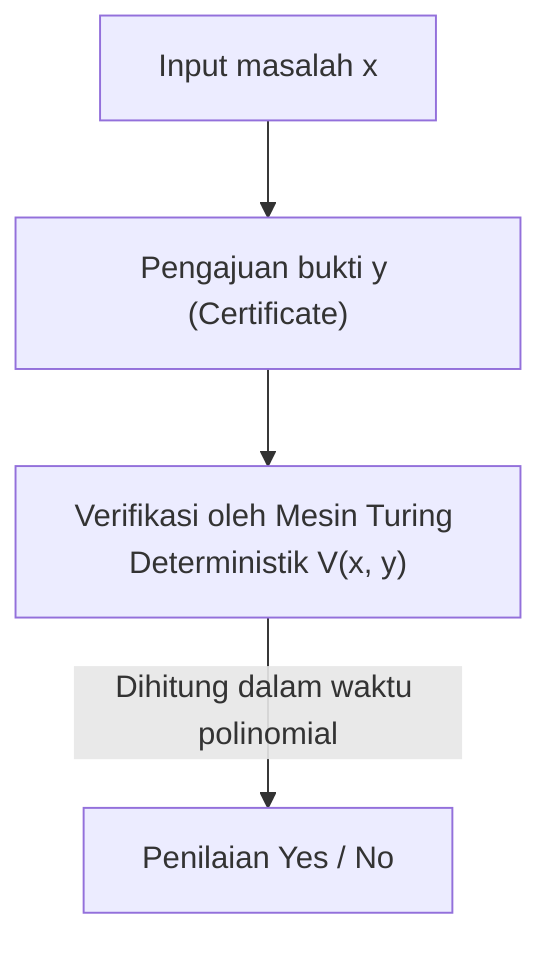
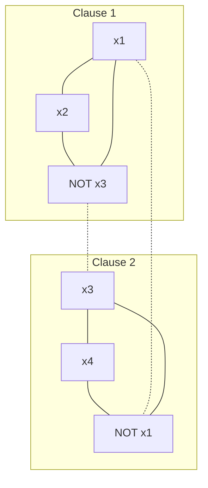

Terdapat sebuah masalah yang belum terpecahkan yang paling terkenal dan paling penting dalam matematika dan ilmu komputer modern. Itu adalah "Masalah P vs NP" (P vs NP Problem). Ditetapkan sebagai salah satu Masalah Hadiah Milenium oleh Clay Mathematics Institute dengan hadiah sebesar 1 juta dolar, masalah ini bukan sekadar teka-teki intelektual atau untuk membuang-buang waktu bagi para matematikawan.

Ini adalah tema yang sangat mendasar yang berhubungan langsung dengan keamanan internet yang menopang masyarakat kita, optimisasi logistik dan jaringan, prediksi struktur protein dalam penemuan obat, optimisasi model pembelajaran AI, dan bahkan pertanyaan filosofis seperti "Apa itu kreativitas manusia?" dan "Apakah pembuktian teorema matematika dapat diotomatisasi?".

Dalam artikel ini, kita akan membedah Masalah P vs NP secara lengkap, mulai dari dasar-dasar Teori Kompleksitas Komputasi (Computational Complexity Theory), penemuan kelengkapan-NP (NP-completeness) melalui Teorema Cook-Levin, klasifikasi mendetail dari kelas kompleksitas, 3 hambatan besar yang menghalangi pembuktian (relativisasi, bukti alami, dan algebrisasi), pendekatan terbaru dari Teori Kompleksitas Geometris (GCT), hubungannya dengan kelas kompleksitas kuantum (BQP), hingga implementasi solver SAT praktis menggunakan Python. Melalui penjelasan mendetail yang mencapai puluhan ribu karakter ini, mari kita sentuh kedalaman teori kompleksitas komputasi.

## Bab 1: Kelahiran Teori Kompleksitas Komputasi dan Dasar-dasar Mesin Turing

Untuk memahami Masalah P vs NP secara akurat, pertama-tama kita perlu mendefinisikan secara matematis dan ketat apa itu "komputasi" dan apa itu "komputasi yang efisien". Pada tahun 1930-an, sebagai jawaban negatif terhadap "Masalah Keputusan" (Entscheidungsproblem) yang diajukan oleh David Hilbert, Alan Turing merancang sebuah model komputasi abstrak yaitu "Mesin Turing" (Turing Machine) untuk merumuskan secara matematis hal-hal yang "dapat dihitung". Bersama dengan Kalkulus Lambda dari Alonzo Church, konsep Mesin Turing ini menjadi fondasi ilmu komputer modern sebagai "Tesis Church-Turing".

### Mesin Turing Deterministik (DTM) dan Kelas P
Mesin Turing Deterministik (Deterministic Turing Machine: DTM) terdiri dari pita satu dimensi dengan panjang tak terhingga, sebuah *head* yang membaca dan menulis pada pita tersebut, serta sebuah unit kontrol yang memiliki jumlah *state* (keadaan) yang terbatas. Ketika mesin membaca suatu simbol pada pita dan berada pada keadaan tertentu, tindakan selanjutnya yang harus diambil oleh mesin (simbol yang akan ditulis, arah pergerakan *head*, dan keadaan selanjutnya) selalu ditentukan secara unik (tunggal).

Lebih tepatnya, fungsi transisi $\delta$ dari DTM didefinisikan sebagai berikut:
$$ \delta: Q \times \Gamma \to Q \times \Gamma \times \{L, R\} $$
Di sini, $Q$ adalah himpunan berhingga dari keadaan, $\Gamma$ adalah himpunan berhingga dari simbol pita (termasuk simbol kosong), $L, R$ adalah arah pergerakan *head* (kiri, kanan). Karena transisi keadaan menggambarkan satu lintasan tunggal (Deterministic Path) untuk sebuah *input*, maka ia disebut "deterministik".

**Kelas P (Polynomial-time)** adalah himpunan masalah keputusan (masalah dengan jawaban Yes/No) yang dapat dipecahkan menggunakan DTM ini dalam waktu polinomial $\mathcal{O}(n^k)$ (di mana $k$ adalah konstanta) terhadap ukuran *input* $n$. Dalam praktiknya, masalah yang termasuk dalam kelas P dianggap sebagai "masalah yang dapat dipecahkan secara efisien" (Tesis Cobham). Contohnya termasuk pengurutan (*sorting*) daftar, pencarian rute terpendek (Algoritma Dijkstra), algoritma pencarian faktor persekutuan terbesar dari dua bilangan (Algoritma Euclidean), dan bahkan pengujian bilangan prima (Uji Primordialitas AKS).

### Mesin Turing Nondeterministik (NTM) dan Kelas NP
Di sisi lain, Mesin Turing Nondeterministik (Nondeterministic Turing Machine: NTM) adalah mesin virtual yang, untuk suatu keadaan dan *input* tertentu, memiliki beberapa kandidat tindakan selanjutnya, dan dapat mengeksplorasi semuanya "secara paralel secara bersamaan (atau selalu memilih percabangan yang secara ajaib mengarah ke jawaban yang benar)".

Rumusan ketat dari fungsi transisi $\delta$ pada NTM adalah sebagai berikut:
$$ \delta: Q \times \Gamma \to \mathcal{P}(Q \times \Gamma \times \{L, R\}) $$
Di mana $\mathcal{P}(X)$ menyatakan himpunan kuasa (Power set, himpunan dari semua himpunan bagian) dari himpunan $X$. Artinya, untuk suatu keadaan $q \in Q$ dan simbol pita $a \in \Gamma$, himpunan aksi yang mungkin diambil selanjutnya diberikan sebagai $\delta(q, a)$, dan mesin dapat memilih salah satu secara sewenang-wenang dari pilihan-pilihan ini. Proses komputasi NTM tidak membentuk satu lintasan, melainkan membentuk struktur pohon yang bercabang (Pohon Komputasi, Computation Tree). Jika setidaknya salah satu dari jalur dalam pohon komputasi mencapai keadaan diterima (Yes state), NTM dianggap telah "menerima" *input* tersebut.

#### Mekanisme Matematis Ledakan Eksponensial dalam Simulasi Deterministik
Apa yang terjadi dengan waktu komputasi jika kita mencoba mensimulasikan operasi NTM dengan DTM? Misalkan jumlah cabang maksimum dari fungsi transisi NTM adalah $b$ (misalnya $b=2$), dan ia berhenti dalam waktu polinomial $p(n)$ untuk ukuran input $n$. Karena kedalaman pohon komputasi adalah $p(n)$, jumlah daun (Leaf) di lapisan terbawah pohon paling banyak adalah $b^{p(n)}$.
Jika DTM mengeksplorasi seluruh pohon komputasi ini (misalnya menggunakan *Breadth-First Search* atau *Depth-First Search*), jumlah langkah yang diperlukan menjadi $\mathcal{O}(b^{p(n)})$, meledak secara eksponensial terhadap ukuran input $n$. Inilah alasan matematis mendasar mengapa secara intuitif diyakini bahwa P $\neq$ NP. Dalam komputasi deterministik sekuensial, diyakini bahwa biaya waktu dan ruang yang sangat besar harus dibayar untuk mengejar kekuatan "percabangan paralel" yang dimiliki oleh komputasi nondeterministik.

**Kelas NP (Nondeterministic Polynomial-time)** adalah himpunan masalah keputusan yang dapat dipecahkan dalam waktu polinomial menggunakan NTM. Namun, sebagai definisi yang lebih intuitif dan praktis, kelas ini dapat dinyatakan ulang sebagai himpunan "masalah di mana ketika jawaban Yes diberikan, kebenaran bukti tersebut (Certificate atau Witness) dapat diverifikasi dalam waktu polinomial menggunakan DTM".


（※ Di sini ditulis agar tidak menggunakan pipa atau karakter khusus.）

Sebagai contoh, versi keputusan dari masalah *Travelling Salesperson* ("Apakah terdapat rute yang mengunjungi semua kota tepat satu kali dengan jarak total kurang dari atau sama dengan $K$?"), jika rute semacam itu (bukti $y$) diberikan oleh dewa atau penyihir, kita hanya perlu menjumlahkan total jarak dan memeriksa apakah jaraknya lebih kecil atau sama dengan $K$, sehingga verifikasi dapat dilakukan dengan mudah dalam waktu polinomial. Oleh karena itu, masalah ini termasuk dalam NP.

## Bab 2: Teorema Cook-Levin dan Fajar Kelengkapan-NP

Masalah P vs NP (yakni, Apakah P = NP?) merupakan pertanyaan yang sangat natural: "Apakah masalah yang buktinya mudah diverifikasi juga mudah untuk dicari solusinya?". Secara intuitif, mencari jawaban sepertinya jauh lebih sulit (P $\neq$ NP), tetapi membuktikannya secara matematis teramat sangat sulit.

### Masalah Kepuasan Boolean (SAT)
Revolusi dalam perdebatan ini dibawa oleh penelitian independen dari Stephen Cook pada tahun 1971 dan Leonid Levin pada tahun 1973. Mereka berfokus pada "Masalah Kepuasan Boolean" (SAT: Boolean Satisfiability Problem), yang menanyakan apakah ada penugasan variabel yang membuat sebuah ekspresi logika proposisional bernilai benar (True).

### Teorema Cook-Levin (Cook-Levin Theorem)
"SAT adalah salah satu masalah tersulit di antara semua masalah yang ada di kelas NP"——inilah inti dari Teorema Cook-Levin. Mereka membuktikan bahwa setiap masalah NP dapat diubah (direduksi) menjadi masalah SAT dalam waktu polinomial.

**Reduksi Waktu Polinomial (Polynomial-time Reduction, Karp Reduction)** berarti bahwa *input* $x$ dari masalah $A$ dapat diubah menjadi *input* $y = f(x)$ untuk masalah $B$ menggunakan fungsi $f$ yang dapat dihitung dalam waktu polinomial, sedemikian rupa sehingga berlaku $x \in A \iff f(x) \in B$ (ditulis sebagai $A \le_p B$).

Cook dan Levin memodelkan transisi komputasi dari setiap NTM dalam waktu polinomial (keadaan, isi pita, posisi *head*) menjadi ekspresi logika (ekspresi Boolean) raksasa dengan sangat presisi. Secara spesifik, mereka memperkenalkan variabel proposisional (Boolean variables) seperti "ada simbol $a$ di sel pita ke-$i$ pada waktu $t$", "mesin berada di keadaan $q$ pada waktu $t$", dan "*head* berada di posisi $i$ pada waktu $t$". Fakta bahwa variabel-variabel ini mematuhi aturan transisi lokal $\delta$ dari Mesin Turing direpresentasikan sebagai kondisi kendala (klausul yang terdiri dari AND/OR/NOT).
Karena waktu eksekusinya adalah $p(n)$, jumlah variabel yang diperlukan dibatasi sekitar $\mathcal{O}(p(n)^2)$, menghasilkan ekspresi logika berukuran polinomial secara keseluruhan. Jika terdapat urutan transisi (bukti) di mana NTM mencapai keadaan "Diterima (Yes)" untuk sebuah *input*, maka ekspresi logika yang terkait dengannya akan dapat dipenuhi (satisfiable). Pembuktian ini menunjukkan bahwa jika terdapat algoritma waktu polinomial untuk memecahkan SAT, maka semua masalah NP dapat dipecahkan dalam waktu polinomial (P = NP).

Masalah seperti itu, yang "berada di dalam NP, dan semua masalah NP dapat direduksi kepadanya dalam waktu polinomial," disebut sebagai **NP-lengkap (NP-complete)**. SAT adalah masalah NP-lengkap pertama yang ditemukan dalam sejarah.

### Reduksi dari 3-SAT ke Maksimum Himpunan Bebas (MIS) dan Penutup Simpul (Vertex Cover): Pembuktian Ketat

Pada tahun 1972, Richard Karp, dengan menjadikan kelengkapan-NP dari SAT sebagai titik tolak, membuktikan bahwa 21 masalah terkenal dalam teori graf dan optimisasi kombinatorial semuanya bersifat NP-lengkap. Di sini, kita akan memaparkan bukti matematis langkah demi langkah yang ketat tentang reduksi waktu polinomial dari masalah 3-SAT ke masalah Maksimum Himpunan Bebas (Maximum Independent Set: MIS) dan masalah Penutup Simpul (Vertex Cover), yang selalu dibahas dalam kuliah teori kompleksitas komputasi.

**Definisi Masalah:**
- **3-SAT**: Diberikan sebuah ekspresi logika $\phi$ dalam Bentuk Normal Konjungtif (CNF) di mana setiap klausul (Clause) secara tepat terdiri dari disjungsi (OR) dari 3 literal (variabel atau negasinya), apakah ada penugasan variabel yang membuat $\phi$ bernilai benar?
  $\phi = (l_{11} \lor l_{12} \lor l_{13}) \land (l_{21} \lor l_{22} \lor l_{23}) \land \dots \land (l_{m1} \lor l_{m2} \lor l_{m3})$
- **Maksimum Himpunan Bebas (MIS)**: Diberikan graf tak berarah $G=(V, E)$ dan bilangan bulat $k$, apakah ada himpunan simpul $S \subseteq V$ yang mana tidak ada dua simpul di dalamnya yang saling bertetangga (dihubungkan oleh sisi), dengan ukuran $|S| \ge k$?
- **Penutup Simpul (Vertex Cover)**: Diberikan graf tak berarah $G=(V, E)$ dan bilangan bulat $k'$, apakah ada himpunan $C \subseteq V$ dengan ukuran $|C| \le k'$ sedemikian rupa sehingga untuk setiap sisi $e \in E$, setidaknya satu dari titik ujungnya terdapat di dalam himpunan $C$?

**Fungsi Reduksi $f$: Konstruksi 3-SAT $\to$ MIS**
Sebagai *input*, ketika diberikan ekspresi logika 3-SAT $\phi$ (dengan jumlah klausul $m$), kita membangun graf $G=(V, E)$ dan ukuran target $k$ sebagai berikut.

1. **Konstruksi Simpul (V):**
   Untuk setiap literal dalam setiap klausul $C_i = (l_{i1} \lor l_{i2} \lor l_{i3})$, kita buat tepat tiga simpul secara independen. Dengan demikian, jumlah total simpul adalah tepat $|V| = 3m$.
   $V = \{ v_{ij} : 1 \le i \le m, 1 \le j \le 3 \}$

2. **Konstruksi Sisi (E):**
   Sisi-sisi ditarik berdasarkan 2 aturan berikut.
   - **Sisi Internal (Triangle edges):** Tiga simpul yang berada di dalam klausul yang sama saling dihubungkan. Dengan kata lain, kita membentuk sebuah segitiga (clique ukuran 3) untuk setiap klausul.
     $E_{\text{inner}} = \{ (v_{i1}, v_{i2}), (v_{i2}, v_{i3}), (v_{i3}, v_{i1}) : 1 \le i \le m \}$
   - **Sisi Konflik (Conflict edges):** Sisi ditarik antara simpul-simpul yang secara logis saling bertentangan (misalnya: $x$ dan $\lnot x$).
     $E_{\text{conflict}} = \{ (v_{ij}, v_{pq}) : l_{ij} = \lnot l_{pq} \}$
   Total himpunan sisi adalah $E = E_{\text{inner}} \cup E_{\text{conflict}}$.

3. **Penetapan Ukuran Target $k$:**
   Kita tetapkan $k = m$ (jumlah klausul). Pembangunan graf ini secara jelas dapat diselesaikan dalam waktu polinomial $\mathcal{O}(m^2)$.

**Bukti Kebenaran ($x \in \text{3-SAT} \iff f(x) \in \text{MIS}$):**

**[ Bukti $\Rightarrow$ (Jika *satisfiable*, maka terdapat himpunan bebas ukuran $m$) ]**
Asumsikan $\phi$ *satisfiable*. Dengan kata lain, ada penugasan variabel yang membuat $\phi$ bernilai benar. Di bawah penugasan ini, setiap klausul $C_i$ memiliki setidaknya satu literal yang bernilai benar (True).
Dari setiap klausul, kita pilih "tepat satu" simpul yang bersesuaian dengan literal yang bernilai benar tersebut, dan jadikan himpunan tersebut $S$. Ukuran $S$ jelas adalah $|S| = m = k$.
Kita buktikan melalui kontradiksi bahwa $S$ adalah himpunan bebas. Misalkan terdapat sisi di antara dua simpul di dalam $S$.
- Kasus sisi internal: Ini berarti kita telah memilih 2 simpul dari klausul yang sama, yang bertentangan dengan langkah konstruksi kita bahwa kita hanya memilih 1 simpul dari setiap klausul.
- Kasus sisi konflik: Ini berarti untuk suatu variabel $x$, kita telah memilih simpul yang sesuai dengan $x$ dan $\lnot x$. Namun, hal ini menyiratkan bahwa baik $x$ maupun $\lnot x$ bernilai benar, yang mana hal itu tidak mungkin sebagai suatu penugasan variabel, sehingga ini sebuah kontradiksi.
Oleh karena itu, tidak ada sisi di antara dua simpul mana pun di dalam $S$, sehingga $S$ adalah himpunan bebas berukuran $m$.

**[ Bukti $\Leftarrow$ (Jika ada himpunan bebas ukuran $m$, maka *satisfiable*) ]**
Asumsikan terdapat himpunan bebas $S$ berukuran $m$ dalam graf $G$.
Berdasarkan konstruksi graf, karena 3 simpul yang berada di dalam klausul yang sama membentuk segitiga (clique), maka himpunan bebas $S$ paling banyak hanya dapat memuat 1 simpul dari setiap klausul.
Karena jumlah total simpul adalah $3m$, jumlah klausul adalah $m$, dan $|S|=m$, maka menurut prinsip sarang burung merpati (Pigeonhole principle), $S$ harus memuat "tepat 1 simpul dari setiap klausul".
Pertimbangkan penugasan variabel di mana semua literal yang bersesuaian dengan simpul-simpul di $S$ diatur menjadi benar (True). Karena tidak terdapat sisi konflik (karena $S$ adalah himpunan bebas), maka tidak mungkin suatu variabel $x$ dan $\lnot x$ keduanya ditugaskan nilai benar. Variabel yang tidak ada di dalam $S$ diberi nilai sewenang-wenang.
Dengan penugasan ini, literal yang dipilih di setiap klausul menjadi bernilai benar, sehingga seluruh ekspresi logika $\phi$ menjadi *satisfiable*.

**Ilustrasi Diagram Graf**
Dalam kasus $\phi = (x_1 \lor x_2 \lor \lnot x_3) \land (\lnot x_1 \lor x_3 \lor x_4)$:

(Garis utuh mewakili sisi internal, garis putus-putus mewakili sisi konflik. Jika kita bisa memilih satu simpul dari setiap subgraf sehingga tidak saling terhubung oleh sisi, maka MIS tercapai.)

**Reduksi dari MIS ke Penutup Simpul (Vertex Cover)**
Lebih lanjut, berkat dualitas yang indah dalam teori graf, reduksi dari MIS ke Penutup Simpul sangatlah sederhana.
Teorema: "Dalam graf $G=(V, E)$, suatu himpunan bagian $S \subseteq V$ merupakan himpunan bebas jika dan hanya jika komplemennya $V \setminus S$ merupakan Penutup Simpul."
Bukti: Misalkan $S$ adalah himpunan bebas. Untuk sebarang sisi $e = (u, v) \in E$, $u$ dan $v$ tidak mungkin keduanya berada di $S$ (definisi himpunan bebas). Oleh karena itu, setidaknya salah satu dari $u, v$ harus berada di $V \setminus S$. Ini berarti $V \setminus S$ menutupi seluruh sisi, yang memenuhi definisi dari Penutup Simpul. Hal sebaliknya dapat dibuktikan dengan cara yang persis sama.
Dengan demikian, masalah apakah terdapat MIS berukuran target $k$ dapat direduksi dalam waktu polinomial ke masalah apakah terdapat Penutup Simpul dengan ukuran target $k' = |V| - k$.

Melalui reduksi ini, terungkaplah struktur matematis bagaimana kelengkapan-NP menjalar dari 3-SAT ke MIS, dan selanjutnya ke Vertex Cover.

## Bab 3: Masalah Perantara NP dan Dampak dari Kelas Kompleksitas Kuantum (BQP)

Jika P $\neq$ NP, apakah ada masalah yang memiliki tingkat kesulitan "di tengah-tengah" sehingga ia berada di NP, tetapi bukan di P maupun NP-lengkap?

### Teorema Ladner (Ladner's Theorem)
Pada tahun 1975, Richard Ladner membuktikan **Teorema Ladner** yang berbunyi: "Jika P $\neq$ NP, maka pasti ada masalah di NP yang tidak termasuk dalam P dan tidak juga merupakan masalah NP-lengkap (masalah perantara NP, NP-intermediate problems)".
Bukti dari Ladner membangun bahasa buatan berdasarkan argumen diagonalisasi, tetapi ada beberapa masalah realistis yang sangat dicurigai sebagai masalah perantara NP yang kita temui. Contohnya adalah Masalah Isomorfisme Graf (Graph Isomorphism).

### Faktorisasi Prima dan Algoritma Shor
Frontier besar lainnya adalah "faktorisasi bilangan bulat", yang menjadi tulang punggung teori kriptografi. Versi keputusan dari faktorisasi prima ("Apakah bilangan bulat $N$ memiliki faktor prima non-trivial yang lebih kecil atau sama dengan $k$?") termasuk ke dalam kelas NP, tetapi diyakini bukan masalah NP-lengkap (karena jika iya, ada bukti teoritis yang kuat bahwa hierarki kelas kompleksitas yang disebut Hierarki Polinomial akan runtuh).

Di sinilah komputer kuantum membawa revolusi pada teori kompleksitas komputasi.
Pada tahun 1994, Peter Shor menunjukkan bahwa dengan menggunakan komputer kuantum, masalah faktorisasi dapat diselesaikan dalam waktu polinomial (**Algoritma Shor**). Masalah yang algoritma klasik terbaiknya pun membutuhkan waktu subeksponensial (contoh: General Number Field Sieve), dapat diselesaikan dalam waktu sekitar $\mathcal{O}((\log N)^3)$ menggunakan komputasi kuantum.

### Hubungan Kelas Kompleksitas Kuantum BQP dengan P dan NP
Untuk merumuskan ini, kelas kompleksitas yang disebut **BQP (Bounded-error Quantum Polynomial-time)** diperkenalkan. BQP adalah kelas dari masalah keputusan yang dapat diselesaikan oleh Mesin Turing Kuantum (atau model sirkuit kuantum) dalam waktu polinomial dengan kemungkinan kesalahan sepertiga atau kurang.

Hubungan dengan kelas komputasi klasik diperkirakan sebagai berikut:
1. $P \subseteq BQP$ (Apa yang bisa diselesaikan secara efisien dengan komputer klasik juga dapat diselesaikan dengan kuantum)
2. $BQP \not\subseteq NP$ (Mungkin ada masalah dalam BQP yang tidak termasuk dalam NP)
3. $NP \not\subseteq BQP$ (Bahkan dengan komputer kuantum, masalah NP-lengkap tidak dapat diselesaikan secara efisien)

**Mengapa Algoritma Shor Tidak Menyelesaikan Masalah P vs NP Itu Sendiri?**
Dalam berita umum, sering kali ada kesalahpahaman bahwa "jika komputer kuantum berhasil dibuat, maka semua masalah komputasi (masalah NP) dapat diselesaikan dalam sekejap", tetapi dari sudut pandang teori kompleksitas, hal ini tidak benar.
Algoritma Shor mengklasifikasikan masalah faktorisasi bilangan bulat (dan masalah logaritma diskrit) ke dalam BQP. Namun, seperti yang disebutkan sebelumnya, faktorisasi bukan masalah NP-lengkap.
Jika seandainya Algoritma Shor dapat memecahkan "SAT (masalah NP-lengkap)" dalam waktu polinomial, itu berarti "komputer kuantum dapat menyelesaikan semua masalah NP secara efisien ($NP \subseteq BQP$)", dan ini akan menjadi peristiwa besar yang mengguncang kerangka masalah P vs NP.
Akan tetapi, meskipun menggunakan kekuatan komputer kuantum (superposisi dan interferensi kuantum), tidaklah mungkin untuk mengompresi ruang pencarian eksponensial dalam memecahkan masalah NP-lengkap ke dalam waktu polinomial. Dan telah dibuktikan bahwa bahkan menggunakan algoritma Grover (Grover's Algorithm) pun, kecepatannya maksimal hanya akan meningkat secara kuadratik (terhadap ruang pencarian $N$ kecepatannya menjadi $\mathcal{O}(N) \to \mathcal{O}(\sqrt{N})$, untuk kompleksitas waktu menjadi $\mathcal{O}(2^n) \to \mathcal{O}(2^{n/2})$) (Bennett, Bernstein, Brassard, Vazirani, 1997).
Oleh karena itu, konsensus yang kuat dalam ilmu komputer teoretis saat ini adalah bahwa implementasi praktis dari komputer kuantum tidak akan menyelesaikan kesulitan mendasar dari masalah P vs NP (khususnya pencarian solusi yang efisien untuk masalah NP-lengkap).

## Bab 4: Mengapa Masalah P vs NP Sulit Dipecahkan? 3 Hambatan Utama

Selama lebih dari setengah abad, matematikawan jenius di seluruh dunia telah mencoba untuk menaklukkan masalah P vs NP dan semuanya gagal. Bukan hanya sekadar bahwa umat manusia kurang pintar. Terdapat sebuah "bukti meta" yang menyatakan bahwa kerangka matematis saat ini (teknik pembuktian) itu sendiri pada dasarnya kekurangan kemampuan untuk memecahkan masalah ini. Inilah 3 hambatan besar dalam teori kompleksitas komputasi.

### 1. Hambatan Relativisasi (Relativization Barrier) dan Teorema Baker-Gill-Solovay
Pada tahun 1975, Theodore Baker, John Gill, dan Robert Solovay menggunakan konsep yang disebut "Oracle (Orakel)". Orakel $A$ adalah *black box* virtual yang secara instan (dalam 1 langkah) memberitahukan jawaban dari suatu masalah $A$. Mesin Turing yang ditambahkan fungsi untuk bertanya kepada Orakel ini disebut Mesin Turing Orakel.

Mereka mengguncang teori kompleksitas dengan membuktikan bahwa ada orakel tertentu di mana P=NP, dan di orakel lainnya P≠NP.

**Sketsa Pembuktian Lengkap Teorema Baker-Gill-Solovay**

**Teorema: Terdapat orakel $A$ dan $B$ yang memenuhi sifat berikut:**
1. $P^A = NP^A$
2. $P^B \neq NP^B$

**[ Konstruksi Orakel $A$ yang Membuat $P^A = NP^A$ ]**
Sebagai Orakel $A$, kita pilih masalah PSPACE-lengkap yaitu masalah "TQBF (True Quantified Boolean Formula)".
Mesin waktu polinomial deterministik yang memiliki Orakel $A$ ($P^A$) dapat menyelesaikan masalah apa pun di PSPACE dalam waktu polinomial. Mengapa? Karena setiap masalah di PSPACE dapat direduksi menjadi TQBF dalam waktu polinomial, dan jawabannya dapat diperoleh hanya dengan satu pertanyaan ke Orakel. Artinya $P^A = \text{PSPACE}$.
Di sisi lain, bahkan jika Mesin waktu polinomial nondeterministik yang memiliki Orakel $A$ ($NP^A$) memanfaatkan kekuatan orakel tersebut, ia hanya dapat menjelajahi ruang berukuran polinomial dalam waktu polinomial, sehingga $NP^A \subseteq \text{NPSPACE}$. Berdasarkan teorema dasar dalam teori kompleksitas, yaitu Teorema Savitch (Savitch's Theorem), karena $\text{NPSPACE} = \text{PSPACE}$, maka $NP^A \subseteq \text{PSPACE}$.
Tentu saja, karena $P^A \subseteq NP^A$, menggabungkan fakta-fakta ini menghasilkan $P^A = NP^A = \text{PSPACE}$.

**[ Konstruksi Orakel $B$ yang Membuat $P^B \neq NP^B$ ]**
Misalkan $B$ adalah suatu bahasa (himpunan *string*), dan terhadap orakel $B$, kita mendefinisikan sebuah bahasa $L_B$ sebagai berikut:
$L_B = \{ 1^n : \text{terdapat suatu string } x \text{ dengan panjang } n \text{ yang ada di dalam } B \}$
Sudah jelas bahwa $L_B \in NP^B$. Alasannya, ketika diberikan *input* $1^n$, NTM secara nondeterministik menebak (menghasilkan) *string* $x$ dengan panjang $n$, lalu dapat memverifikasinya dalam 1 langkah dengan bertanya ke orakel $B$ apakah $x \in B$.
Selanjutnya, untuk memastikan bahwa $L_B \notin P^B$, isi dari orakel $B$ dibangun secara induktif dengan menggunakan argumen diagonalisasi (Diagonalization).
Kita mendaftar semua Mesin Orakel waktu polinomial deterministik sebagai $M_1, M_2, \dots, M_i, \dots$. Asumsikan waktu eksekusi setiap $M_i$ dibatasi oleh suatu polinomial $p_i(n)$.
Pada tahap $i$, pilih sebuah panjang *string* $n$ yang cukup besar (kita buat $n$ bertumbuh secara ekstrem sehingga $2^n > p_i(n)$).
Simulasikan $M_i$ dengan memberikan input $1^n$. Selama eksekusinya, $M_i$ akan melakukan permintaan maksimal terhadap $p_i(n)$ buah *string* kepada orakel.
Karena jumlah total *string* berpanjang $n$ adalah $2^n$ buah, dan $2^n > p_i(n)$, maka pasti ada *string* $y$ berpanjang $n$ yang "tidak pernah ditanyakan ke orakel sama sekali" oleh $M_i$.
- Jika pada akhirnya $M_i(1^n)$ memberikan *output* "Diterima (1)", kita memutuskan untuk tidak memasukkan satupun *string* panjang $n$ ke dalam $B$ (menjadikannya himpunan kosong). Ini mengakibatkan $1^n \notin L_B$, sehingga *output* $M_i$ terbukti salah.
- Jika pada akhirnya $M_i(1^n)$ memberikan *output* "Ditolak (0)", kita menambahkan *string* $y$ yang belum pernah ditanyakan tadi ke dalam $B$. Ini mengakibatkan $1^n \in L_B$, dan sekali lagi, *output* $M_i$ terbukti salah.
Dengan mengulang prosedur ini hingga tak berhingga untuk seluruh mesin, kita membangun sebuah orakel $B$ yang mana tidak ada satu pun DTM yang bisa memutuskan bahasa $L_B$ dengan benar. Akibatnya $L_B \notin P^B$. Maka, $P^B \neq NP^B$.

**Makna dari Hambatan Relativisasi**
Konsekuensi mengerikan dari teorema ini adalah: "Metode pembuktian yang tidak terpengaruh oleh keberadaan orakel (berelativisasi, Relativizing) seperti teknik diagonalisasi atau simulasi *state*, tidak akan pernah bisa digunakan untuk memecahkan Masalah P vs NP selamanya." Hal ini karena, apabila dengan menggunakan metode tersebut terbukti bahwa P=NP, maka di dunia dengan orakel $B$ pun akan terbukti bahwa P=NP, yang mana akan menjadi suatu kontradiksi.

### 2. Hambatan Bukti Alami (Natural Proofs Barrier)
Untuk melampaui hambatan relativisasi, para pakar teori beralih dari operasi Mesin Turing ke pendekatan pembuktian batas bawah (*lower bound*) terhadap ukuran "Sirkuit Boolean" (Boolean Circuits) yang tersusun dari gerbang logika (AND, OR, NOT) (yaitu bukti batas bawah untuk kelas P/poly).
Namun, pada tahun 1994, Alexander Razborov dan Steven Rudich mengajukan konsep "Bukti Alami" (Natural Proofs).
Mereka menunjukkan bahwa hampir semua teknik pembuktian batas bawah sirkuit pada masa itu bergantung pada mengekstraksi "sifat alami" yang memenuhi karakteristik "Kegunaan (Constructivity)" dan "Ukuran Besar (Largeness)". Kemudian, mereka membuktikan secara matematis bahwa jika fungsi satu arah (one-way functions) itu ada (yang berarti kriptografi dimungkinkan), maka tidak mungkin membuktikan batas bawah untuk kelas kompleksitas yang kuat menggunakan teknik "Bukti Alami" tersebut.
Dengan kata lain, teknik kombinatorial yang ada untuk mencoba membuktikan bahwa P $\neq$ NP secara ironis jatuh ke dalam paradoks di mana teknik tersebut akan berhenti berfungsi jika kita mengasumsikan P $\neq$ NP itu sendiri (dalam bentuk yang kuat, yaitu asumsi keberadaan fungsi kriptografi).

### 3. Hambatan Algebrisasi (Algebrization Barrier)
Untuk menghindari hambatan relativisasi dan bukti alami, berkembanglah metode pada tahun 1990-an yaitu "Sistem Pembuktian Interaktif" (Interactive Proofs) dan "Aritmetisasi" (Arithmetization). Hal ini menghasilkan teorema perintis seperti pembuktian IP = PSPACE.
Namun, pada tahun 2008, Scott Aaronson dan Avi Wigderson memperlihatkan bahwa teknik-teknik ini pun pada akhirnya bergantung pada operasi yang disebut "Algebrisasi" (Algebrization), di mana polinomial diperluas di atas lapangan berhingga (*finite field*). Dan mereka membuktikan bahwa metode yang memanfaatkan algebrisasi juga tidak dapat menyelesaikan masalah P vs NP (serta tak mampu memisahkan banyak kelas kompleksitas lainnya).

Karena 3 hambatan ini, muncullah pemahaman umum dalam teori ilmu komputer bahwa "untuk memecahkan masalah P vs NP, dibutuhkan matematika dari sebuah paradigma yang benar-benar baru."

## Bab 5: Praktek - Matematika dan Implementasi Python dari Solver SAT

Sementara P=NP tetap menjadi masalah yang belum terpecahkan, di dunia nyata dalam sektor industri, SAT raksasa (masalah NP-lengkap) dengan jutaan variabel diselesaikan dengan kecepatan tinggi setiap harinya. Ini dimungkinkan karena, meskipun waktu eksekusi terburuknya adalah eksponensial, sebagian besar masalah praktis (seperti verifikasi *hardware* atau penyelesaian *dependency*) memiliki "struktur" yang kuat. Di sini, mari kita lihat algoritma spesifik dan implementasi Python dari *solver* SAT, yang merupakan fondasi teoritis dari masalah P vs NP.

### Algoritma DPLL dan Matematika dari Backtrack
Algoritma DPLL (Davis-Putnam-Logemann-Loveland) adalah sebuah metode yang secara drastis mengurangi ruang pencarian dengan memanfaatkan karakteristik dari ekspresi logika, berdasarkan *Depth-First Search* (Backtrack).

Dua poin matematis utama adalah:
1. **Perambatan Unit (Unit Propagation / Boolean Constraint Propagation):** Jika di dalam sebuah klausul hanya tertinggal satu literal yang belum ditugaskan (Unit Clause), maka satu-satunya cara untuk membuat klausul tersebut bernilai benar adalah dengan mengatur literal tersebut menjadi benar. Penugasan paksa ini kemudian dapat memicu perambatan unit berantai ke klausul lain, memangkas pohon pencarian secara besar-besaran.
2. **Penghapusan Literal Murni (Pure Literal Elimination):** Dalam keseluruhan ekspresi logika, jika suatu variabel selalu muncul dalam bentuk afirmatif (atau selalu negatif), maka menugaskan literal tersebut dengan nilai benar tidak akan membawa pengaruh buruk pada pemenuhan klausul lainnya.

Berikut adalah contoh kode Python yang sederhana dan edukatif dari algoritma DPLL.

```python
def dpll(clauses, assignment):
    # Base case 1: Semua klausul terpenuhi dan daftar menjadi kosong -> Satisfiable (SAT)
    if len(clauses) == 0:
        return True, assignment
    
    # Base case 2: Ada kontradiksi (klausul kosong) -> Unsatisfiable (UNSAT)
    if any(len(c) == 0 for c in clauses):
        return False, {}
    
    # Penerapan Perambatan Unit (Unit Propagation)
    unit_clauses = [c for c in clauses if len(c) == 1]
    if unit_clauses:
        unit = unit_clauses[0][0]
        new_clauses = []
        for c in clauses:
            if unit in c:
                continue # Klausul ini menjadi benar, jadi bisa dihapus
            if -unit in c:
                # Singkirkan literal yang kontradiktif
                new_clause = [l for l in c if l != -unit]
                new_clauses.append(new_clause)
            else:
                new_clauses.append(c)
        assignment[abs(unit)] = (unit > 0)
        return dpll(new_clauses, assignment)
    
    # Percabangan (Branching): Pemilihan variabel secara heuristik
    # Di sini kita sekadar memilih literal pertama dari klausul pertama
    literal = clauses[0][0]
    
    # Eksplorasi dengan asumsi variabel bernilai True
    res, final_assign = dpll(clauses + [[literal]], assignment.copy())
    if res:
        return True, final_assign
        
    # Jika cabang di atas gagal, eksplorasi dengan asumsi variabel bernilai False (Backtrack)
    return dpll(clauses + [[-literal]], assignment.copy())

# Contoh Eksekusi: (x1 OR NOT x2) AND (NOT x1 OR x2 OR x3) AND (NOT x3)
# 1: x1, 2: x2, 3: x3 (angka negatif merepresentasikan NOT)
cnf_formula = [[1, -2], [-1, 2, 3], [-3]]
is_sat, solution = dpll(cnf_formula, {})

print(f"Satisfiable: {is_sat}")
print(f"Assignment: {solution}")
# Output yang Diharapkan:
# Satisfiable: True
# Assignment: {3: False, 1: False, 2: False} (atau solusi satisfiability lainnya)
```

### Evolusi ke Algoritma CDCL (Conflict-Driven Clause Learning)
Saat ini, *solver* SAT modern yang canggih (seperti MiniSat, Glucose, dll.) menggunakan algoritma **CDCL (Conflict-Driven Clause Learning)** yang mengembangkan DPLL secara drastis.

Inovasi CDCL terletak pada kemampuan untuk "belajar dari kesalahan". Saat terjadi konflik (Conflict) dalam proses pencarian, alih-alih sekadar kembali mundur satu langkah ke belakang (Chronological backtracking), CDCL akan membangun sebuah Graf Implikasi (Implication Graph) guna menganalisis kombinasi variabel yang menjadi akar penyebab dari konflik tersebut. Dengan menghitung "Cut" pada graf yang dikenal sebagai UIP (Unique Implication Point), ia akan mengubah penyebab dari konflik tersebut menjadi sebuah ekspresi logika dan menambahkannya sebagai "Klausul Pembelajaran (Learned Clause)" baru ke ekspresi asli.
Berkat ini, *solver* mewujudkan *backtracking* yang non-kronologis (Non-chronological backtracking / Backjumping) yang memastikan bahwa ia "tidak akan pernah mengulangi kesalahan yang sama dua kali pada cabang yang berbeda dari pohon pencarian", memangkas tajam pohon pencarian yang semula bersifat eksponensial. Selain itu, dengan digabungkan bersama heuristik pemilihan variabel yang dinamis seperti VSIDS (Variable State Independent Decaying Sum) serta proses *restart* secara berkala, CDCL berkuasa sebagai puncak kehebatan heuristik dari umat manusia untuk melawan masalah NP-lengkap.

## Bab 6: Pendekatan Modern dan Teori Kompleksitas Geometris (GCT)

Mengingat segala hambatan ini, dengan pendekatan apa para ilmuwan teoretis saat ini menantang Masalah P vs NP?

### Teori Kompleksitas Geometris (Geometric Complexity Theory: GCT)
Pada tahun 2001, Ketan Mulmuley dan Milind Sohoni mengajukan suatu program masif yang disebut "Teori Kompleksitas Geometris (GCT)", yang mengombinasikan geometri aljabar dengan teori representasi.
Ide dasar GCT adalah untuk mereduksi persoalan pemisahan antar kelas kompleksitas menjadi permasalahan tentang hubungan inklusi geometris dari suatu ruang polinomial (penutupan orbit / orbit closures).

Secara spesifik, GCT berfokus pada perbedaan simetri antara Permanen (Permanent, yang merupakan anggota #P-lengkap dan sangat sulit dihitung) dengan Determinan (Determinant, yang bisa dihitung dalam waktu polinomial). Pendekatan ini melihat dua buah polinomial tersebut sebagai orbit geometris akibat aksi dari grup linear umum, kemudian memanfaatkan teori representasi (seperti Polinomial Schur atau multplisitas dari representasi yang tak tereduksi) untuk mencoba membuktikan bahwa "penutupan orbit dari Permanen tidak dapat disisipkan ke dalam penutupan orbit dari Determinan".
GCT telah menarik perhatian yang luas karena dianggap memiliki sifat-sifat yang dapat membantunya menghindari hambatan pembuktian alami dan algebrisasi, serta memungkinkannya untuk memobilisasi banyak teorema mendalam dari ranah matematika lain (geometri aljabar, teori representasi, teori invarian). Walau begitu, dikarenakan materinya yang sedemikian rumit dan sangat abstrak, upaya ini masih dalam tahap perkembangan.

### Batas Bawah Sirkuit dan Graf Ekspander
Dalam arah yang lain, penelitian mengenai "Derandomisasi (Derandomization)" —yakni meniru kelas pengacakan komputasi (BPP) ke dalam algoritma deterministik (P)— semakin berkembang maju. Teori yang melingkupi Generator Angka Semu Acak (Pseudorandom Generators) misalnya mengenai Graf Ekspander dan Extractor, sangat berhubungan erat dengan persoalan pembuktian batas bawah sirkuit (Paradigma Hardness vs. Randomness), dan hal ini telah melahirkan berbagai kesimpulan gemilang seperti "Apabila batas bawah sirkuit yang tangguh dapat dibuktikan, maka P = BPP dapat dibuktikan pula." Di dalam jangka panjang, serangkaian kemajuan ini dipercaya mampu memberikan pijakan bagi pembuktian P $\neq$ NP.

## Bab 7: Dampak Filosofis dan Teknologis yang Diberikan Oleh P=NP (atau P≠NP) kepada Dunia

Apa yang akan terjadi pada masyarakat kita apabila persoalan P vs NP berhasil dipecahkan? Banyak ahli yang percaya bahwa P $\neq$ NP. Akan tetapi, bilamana terbukti secara matematis bahwa P = NP dan bahwa algoritma waktu polinomial yang praktis (misalnya, $\mathcal{O}(n^2)$ atau $\mathcal{O}(n^3)$) dapat ditemukan, maka dunia ini akan berubah secara dahsyat, bahkan amat menakutkan.

### Runtuhnya Kriptografi Kunci Publik
Fondasi sistem keamanan pada internet modern semacam Kriptografi RSA atau Kriptografi Kurva Eliptik berdiri tegak di atas suatu asumsi "Pemfaktoran bilangan prima serta masalah logaritma diskrit mustahil dipecahkan dalam cakupan waktu polinomial" (secara lebih tepatnya, atas asumsi bahwa fungsi satu arah memang ada). Jika P = NP, berarti kita bisa membongkar "bukti" untuk mengubah tulisan acak *ciphertext* balik ke *plaintext* asli dalam waktu polinomial. Saat hal itu terjadi, kriptografi akan kehilangan daya magisnya, serta seluruh privasi transaksi finansial dan komunikasi digital bakal hancur lebur dalam sekejap mata.

### Akhir dari Optimisasi dan Sains (Serta Otomatisasi Hakiki)
Namun, kabar baiknya pun menanti. Permasalahan mengenai logistik pengiriman rute terpendek (travelling salesperson problem), simulasi pelipatan bentuk struktur protein, mendesain sirkuit semikonduktor terbaik, penemuan *weight* (bobot) optimum untuk permodelan Kecerdasan Buatan (AI), dan setiap permasalahan optimisasi lain yang didefinisikan sebagai bagian dari kelas NP-lengkap akan seketika itu juga bisa diselesaikan guna mendapat hasil yang seoptimal mungkin. Ini bakal menggenjot laju evolusi teknologi umat manusia melompat beratus-ratus tahun ke depan dari menyelesaikan isu perubahan iklim bumi sampai ke penemuan wujud obat-obatan inovatif secara sepenuhnya otomatis.

### Surat Gödel dan Kreativitas Umat Manusia
Pada tahun 1956, Kurt Gödel menulis sepucuk surat kepada John von Neumann. Surat tersebut pada hakikatnya memprediksi masalah P vs NP. Apabila pembuktian terhadap sebuah teorema (yakni proses pencarian dan pengerjaan langkah pembuktian sepanjang $n$) bisa dicapai dalam tempo polinomial, maka menurut catatan sang Gödel: "Seluruh profesi fisik seorang matematikawan bakal 100% tuntas tergantikan dan bisa diambil alih sepenuhnya oleh kehadiran sebuah mesin algoritma."
Manakala keabsahan suatu bukti "Mengevaluasi Bukti (P)" dianggap serupa dan ekuivalen bersama kemampuan dalam "Memunculkan Bukti (NP)" tersebut secara cemerlang, maka itu pula menandakan bahwa kreativitas seniman, intuisi dari akal budi sang matematikawan jenius, dan inspirasi murni manusia hanyalah semacam turunan dari algoritma kalkulasi kecepatan waktu polinomial semata.

## Penutup: Menatap ke Dalam Jurang yang Dalam

Masalah P vs NP, sekali lagi, tidak dapat sekadar dianggap sebagai sekumpulan tebakan perhitungan durasi kecepatan jalannya suatu barisan kode algoritma saja. Persoalan ini merupakan sebuah pertanyaan abadi tentang hakikat kecerdasan, "Apakah langkah untuk mencari sebuah jawaban itu adalah hal yang secara esensi amat berbeda dari sebuah langkah untuk memahami kebenaran sebuah jawaban?".

Sampai dengan hari ini pun, ilmuwan komputer serta matematikawan dari seantero dunia ini terus saja dan tak henti-hentinya bergumul dan mencoba menaklukkan puncak masalah tersebut. Guna melengkapi kepingan terakhir untuk pembuktian ini, kelak di masa yang akan datang, niscaya dan pastinya akan dibutuhkan konsep metodologi matematika yang seluruhnya dan sepenuhnya berparadigma sangat baru, dan belum sempat pernah tertembus melampaui batasan imajinasi pikir manusia sekarang demi mampu menerobos berbagai rintangan tebal layaknya Orakel, Bukti Alami, hingga Algebrisasi.

Mungkinkah nanti akan segera tiba hari di mana takhta tertinggi dari kepingan puncak teka-teki hadiah Millenium itu pada akhirnya bakal terungkap dengan sangat jelas, atau barangkali kelak sebetulnya teka-teki itu hanyalah dapat dibuktikan sebagai suatu kondisi yang "Tak Dapat Dibuktikan" lewat konsep "Kemerdekaan-independensi matematis" selayaknya kemunculan bayang Teorema Ketidaklengkapan milik Gödel? Segala perjalanan pertaruhan menantang batasan dinding kognisi dari para umat manusia akan senantiasa dan terus membentang jauh tanpa pernah ada batas hentinya.
