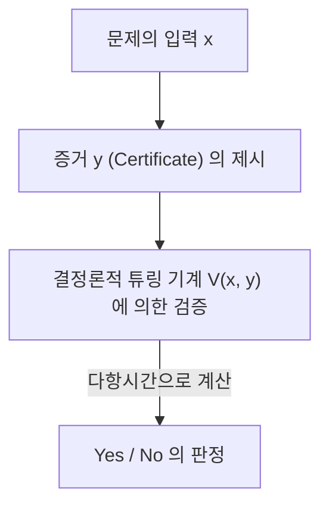
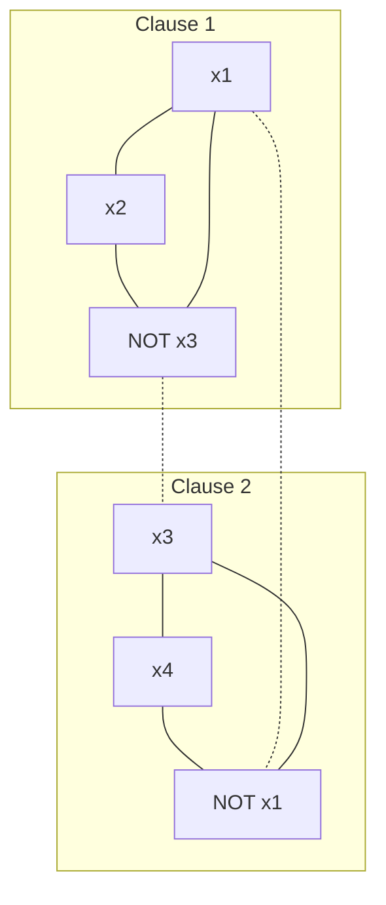

현대 수학, 컴퓨터 과학에 있어서 가장 유명하며, 가장 중요하다고 여겨지는 미해결 문제가 존재합니다. 그것이 바로 'P대 NP 문제(P vs NP Problem)'입니다. 클레이 수학연구소가 정한 밀레니엄 현상 문제 중 하나로 100만 달러의 상금이 걸려 있는 이 문제는 단순한 지적 퍼즐이나 수학자들의 시간 때우기가 아닙니다.

우리 사회를 지탱하는 인터넷 보안, 물류 및 네트워크 최적화, 신약 개발에서의 단백질 구조 예측, AI 학습 모델의 최적화, 나아가 "인간의 창조성이란 무엇인가", "수학 정리의 증명은 자동화될 수 있는가"라는 철학적인 질문에까지 직결되는 극히 근원적인 주제입니다.

이 글에서는 계산 복잡도 이론(Computational Complexity Theory)의 기초부터 시작하여 쿡-레빈 정리에 의한 NP-완전성의 발견, 계산 복잡도 클래스의 정밀한 분류, 증명을 가로막는 3개의 거대한 장벽(상대화, 자연 증명, 대수화), 최신 기하학적 복잡도 이론(GCT)의 접근, 양자 계산 복잡도 클래스(BQP)와의 관계, 그리고 실전적인 SAT 솔버의 Python 구현에 이르기까지 P대 NP 문제를 완전히 해부합니다. 수만 자에 달하는 이 상세한 해설을 통해 계산 복잡도 이론의 심연을 접해 봅시다.

## 제1장: 계산 복잡도 이론의 탄생과 튜링 기계의 기초

P대 NP 문제를 정확히 이해하기 위해서는 먼저 '계산'이란 무엇인지, '효율적인 계산'이란 무엇인지를 엄밀하게 수학적으로 정의할 필요가 있습니다. 1930년대, 다비트 힐베르트가 제창한 '결정 문제(Entscheidungsproblem)'에 대한 부정적인 해답으로서, 앨런 튜링은 '계산 가능한 것'을 수학적으로 공식화하기 위해 추상적인 계산 모델인 '튜링 기계(Turing Machine)'를 고안했습니다. 알론조 처치의 람다 대수와 더불어 이 튜링 기계의 개념은 '처치-튜링 명제'로서 현대 컴퓨터 과학의 주춧돌이 되고 있습니다.

### 결정론적 튜링 기계 (DTM)와 클래스 P
결정론적 튜링 기계(Deterministic Turing Machine: DTM)는 무한한 길이를 가진 1차원 테이프, 그 테이프를 읽고 쓰는 헤드, 그리고 유한 개의 상태를 가진 제어부로 구성됩니다. 어떤 상태와 테이프 상의 기호를 읽었을 때, 다음으로 기계가 취해야 할 행동(기록할 기호, 헤드의 이동 방향, 다음 상태)은 항상 유일하게 결정됩니다.

더 엄밀하게 말하면, DTM의 전이 함수 $\delta$ 는 다음과 같이 정의됩니다:
$$ \delta: Q \times \Gamma \to Q \times \Gamma \times \{L, R\} $$
여기서 $Q$는 상태의 유한 집합, $\Gamma$는 테이프 기호의 유한 집합(공백 기호 포함), $L, R$은 헤드의 이동 방향(왼쪽, 오른쪽)입니다. 입력에 대해 상태 전이가 단일 궤적(Deterministic Path)을 그리므로 '결정론적'이라고 불립니다.

**클래스 P(Polynomial-time)**란, 이 DTM을 이용하여 입력 크기 $n$ 에 대해 다항시간 $\mathcal{O}(n^k)$ ($k$는 상수) 내에 풀 수 있는 판정 문제(Yes/No로 답하는 문제)의 집합입니다. 실용적으로 P에 속하는 문제는 '효율적으로 풀 수 있는 문제'로 간주됩니다(코범의 명제). 예를 들어 리스트의 정렬, 최단 경로 탐색(다익스트라 알고리즘), 두 수의 최대공약수를 구하는 알고리즘(유클리드 호제법), 나아가 소수 판정(AKS 소수 판정법) 등이 이에 해당합니다.

### 비결정론적 튜링 기계 (NTM)와 클래스 NP
반면, 비결정론적 튜링 기계(Nondeterministic Turing Machine: NTM)는 어떤 상태와 입력에 대해 다음으로 취할 수 있는 행동의 후보가 여러 개 존재하며, 그 모든 것을 '동시에 병렬로(또는 항상 정답에 이르는 분기를 신들린 듯이 선택하여)' 탐색할 수 있는 가상의 기계입니다.

NTM의 전이 함수 $\delta$ 의 엄밀한 공식화는 다음과 같습니다:
$$ \delta: Q \times \Gamma \to \mathcal{P}(Q \times \Gamma \times \{L, R\}) $$
여기서 $\mathcal{P}(X)$는 집합 $X$의 멱집합(모든 부분집합의 집합)을 나타냅니다. 즉, 어떤 상태 $q \in Q$ 와 테이프 기호 $a \in \Gamma$ 에 대해 다음으로 취할 수 있는 액션의 집합이 $\delta(q, a)$ 로 주어지며, 기계는 이 선택지들 중에서 임의의 것을 선택할 수 있습니다. NTM의 계산 과정은 단일 경로가 아니라 분기하는 트리 구조(계산 트리, Computation Tree)를 형성합니다. 만약 계산 트리의 경로 중 적어도 1개가 수락 상태(Yes 상태)에 도달하면, NTM은 그 입력을 '수락했다'고 간주됩니다.

#### 결정론적 시뮬레이션에서의 지수적 폭발의 수학적 메커니즘
NTM의 동작을 DTM으로 시뮬레이션하려고 하면 계산 시간은 어떻게 될까요? NTM의 전이 함수의 최대 분기 수를 $b$(예: $b=2$)라고 하고, 입력 크기 $n$ 에 대해 다항시간 $p(n)$ 에 정지한다고 가정합니다. 계산 트리의 깊이는 $p(n)$ 이 되므로, 트리의 맨 아래층에 있는 잎(Leaf)의 수는 최대 $b^{p(n)}$ 이 됩니다.
DTM이 이 계산 트리를 모두 탐색하는(예를 들어 너비 우선 탐색이나 깊이 우선 탐색을 이용하는) 경우, 필요한 단계 수는 $\mathcal{O}(b^{p(n)})$ 이 되어 입력 크기 $n$ 에 대해 지수함수적(Exponentially)으로 폭발합니다. 이것이 직관적으로 P $\neq$ NP라고 믿어지는 수학적인 근본 이유입니다. 결정론적인 순차 계산으로는 비결정론성이 가진 '병렬 분기'의 힘을 따라잡기 위해 막대한 시간적·공간적 비용을 치를 수밖에 없다고 여겨지는 것입니다.

**클래스 NP(Nondeterministic Polynomial-time)**란, NTM을 이용하여 다항시간에 풀 수 있는 판정 문제의 집합입니다. 하지만 더 직관적이고 실용적인 정의로서, 'Yes라는 답이 주어졌을 때, 그 증거(Certificate 또는 Witness)가 올바른지를 DTM을 이용하여 다항시간 내에 검증할 수 있는 문제'의 집합으로 바꿔 말할 수 있습니다.


(※ 여기서는 파이프나 특수 기호를 피한 기술로 하였습니다.)

예를 들어, 외판원 문제의 판정판('거리 $K$ 이하로 모든 도시를 정확히 한 번씩 도는 경로가 존재하는가?')은 만약 그러한 경로(증거 $y$)가 신이나 마법사로부터 주어진다면, 그 총거리를 더해서 $K$ 이하인지 확인하기만 하면 되기 때문에 다항시간에 쉽게 검증 가능합니다. 따라서 이 문제는 NP에 속합니다.

## 제2장: 쿡-레빈 정리와 NP-완전성의 여명

P대 NP 문제(즉 P = NP인가?)란, '답의 검증이 쉬운 문제는 답을 찾는 것도 쉬운가?'라는 지극히 자연스러운 질문입니다. 직관적으로는 답을 찾는 쪽이 훨씬 더 어려울 것 같지만(P $\neq$ NP), 그것을 수학적으로 증명하는 것은 극히 어렵습니다.

### 충족 가능성 문제 (SAT)
이 논의에 혁명을 가져온 것이 1971년의 스티븐 쿡(Stephen Cook)과 1973년의 레오니드 레빈(Leonid Levin)에 의한 독립적인 연구입니다. 그들은 명제 논리의 논리식을 참으로 만드는 변수 할당이 존재하는지를 묻는 '충족 가능성 문제(SAT: Boolean Satisfiability Problem)'에 주목했습니다.

### 쿡-레빈 정리 (Cook-Levin Theorem)
'SAT는 NP에 속하는 모든 문제 중에서 가장 어려운 문제 중 하나이다' ── 이것이 쿡-레빈 정리의 골자입니다. 그들은 임의의 NP 문제가 다항시간 내에 SAT로 변환(환원)될 수 있음을 증명했습니다.

**다항시간 환원(Polynomial-time Reduction, Karp Reduction)**이란, 문제 $A$ 의 입력 $x$ 를 문제 $B$ 의 입력 $y = f(x)$ 로 다항시간에 계산 가능한 함수 $f$ 를 이용하여 변환할 수 있고, $x \in A \iff f(x) \in B$ 가 성립하는 것입니다($A \le_p B$ 라고 씁니다).

쿡과 레빈은 임의의 NTM의 다항시간에서의 계산 전이(상태, 테이프의 내용, 헤드의 위치)를 거대한 논리식(불식)으로 정밀하게 표현했습니다. 구체적으로는 "시간 $t$ 에 테이프의 $i$ 번째 셀에 기호 $a$ 가 존재한다", "시간 $t$ 에 기계는 상태 $q$ 에 있다", "시간 $t$ 에 헤드는 위치 $i$ 에 있다"와 같은 명제 변수(Boolean variables)를 도입합니다. 이러한 변수들이 튜링 기계의 국소적인 전이 규칙 $\delta$ 에 올바르게 따르는 것을 제약 조건(AND/OR/NOT으로 구성되는 절)으로 기술합니다.
실행 시간이 $p(n)$ 이므로 필요한 변수의 수는 $\mathcal{O}(p(n)^2)$ 정도에 머무르며, 전체적으로 다항 크기의 논리식이 생성됩니다. 만약 어떤 입력에 대해 NTM이 '수락(Yes)' 상태에 도달하는 전이열(증거)이 존재한다면, 그에 대응하는 논리식이 충족 가능해집니다. 이 증명을 통해 SAT를 푸는 다항시간 알고리즘이 존재하면 모든 NP 문제가 다항시간에 풀릴 수 있다는 것(P = NP)이 밝혀진 것입니다.

이러한 'NP에 속하고, 또한 모든 NP 문제로부터 다항시간에 환원할 수 있는 문제'를 **NP-완전(NP-complete)**이라고 부릅니다. SAT는 역사상 처음으로 발견된 NP-완전 문제였습니다.

### 3-SAT에서 최대 독립 집합(MIS) 및 정점 피복(Vertex Cover)으로의 환원: 엄밀한 증명

1972년, 리처드 카프(Richard Karp)는 SAT의 NP-완전성을 기점으로 그래프 이론이나 조합 최적화의 유명한 21개 문제가 모두 NP-완전임을 증명했습니다. 여기서는 계산 복잡도 이론 강의에서 반드시 다루는 '3-SAT에서 최대 독립 집합(Maximum Independent Set: MIS) 문제' 및 '정점 피복(Vertex Cover) 문제'로의 다항시간 환원의 단계별 엄밀한 수학적 증명을 전개합니다.

**문제의 정의:**
- **3-SAT**: 각 절(Clause)이 정확히 3개의 리터럴(변수 또는 그 부정)의 논리합(OR)으로 구성된 논리곱 표준형(CNF) 논리식 $\phi$ 가 주어졌을 때, $\phi$ 를 참으로 만드는 변수 할당이 존재하는가?
  $\phi = (l_{11} \lor l_{12} \lor l_{13}) \land (l_{21} \lor l_{22} \lor l_{23}) \land \dots \land (l_{m1} \lor l_{m2} \lor l_{m3})$
- **최대 독립 집합 (MIS)**: 무방향 그래프 $G=(V, E)$ 와 정수 $k$ 가 주어졌을 때, 서로 인접하지 않는(간선으로 연결되지 않은) 정점들의 집합 $S \subseteq V$ 로 그 크기가 $|S| \ge k$ 가 되는 것이 존재하는가?
- **정점 피복 (Vertex Cover)**: 무방향 그래프 $G=(V, E)$ 와 정수 $k'$ 이 주어졌을 때, 모든 간선 $e \in E$ 에 대해 그 적어도 한쪽 끝점이 집합 $C \subseteq V$ 에 포함되는, 크기 $|C| \le k'$ 인 집합 $C$ 가 존재하는가?

**환원 함수 $f$: 3-SAT $\to$ MIS 의 구성**
입력으로 3-SAT 논리식 $\phi$(절의 수 $m$)가 주어졌을 때, 그래프 $G=(V, E)$ 와 목표 크기 $k$ 를 다음과 같이 구성합니다.

1. **정점의 구성 (V):**
   각 절 $C_i = (l_{i1} \lor l_{i2} \lor l_{i3})$ 의 각 리터럴에 대응하는 정점을 독립적으로 3개 만듭니다. 따라서 정점의 총 개수는 엄밀하게 $|V| = 3m$ 이 됩니다.
   $V = \{ v_{ij} : 1 \le i \le m, 1 \le j \le 3 \}$

2. **간선의 구성 (E):**
   간선은 다음의 두 가지 규칙에 따라 그어집니다.
   - **내부 간선 (Triangle edges):** 같은 절에 속하는 3개의 정점끼리 서로 연결합니다. 즉, 각 절마다 삼각형(크기 3인 클릭)을 형성합니다.
     $E_{\text{inner}} = \{ (v_{i1}, v_{i2}), (v_{i2}, v_{i3}), (v_{i3}, v_{i1}) : 1 \le i \le m \}$
   - **모순 간선 (Conflict edges):** 서로 논리적으로 모순되는 리터럴(예: $x$ 와 $\lnot x$)에 대응하는 정점 사이에 간선을 긋습니다.
     $E_{\text{conflict}} = \{ (v_{ij}, v_{pq}) : l_{ij} = \lnot l_{pq} \}$
   전체 간선 집합은 $E = E_{\text{inner}} \cup E_{\text{conflict}}$ 가 됩니다.

3. **목표 크기 $k$ 의 설정:**
   $k = m$(절의 수)으로 합니다. 이 그래프 구축은 명백히 다항시간 $\mathcal{O}(m^2)$ 에 완료됩니다.

**정당성의 증명 ($x \in \text{3-SAT} \iff f(x) \in \text{MIS}$):**

**[ $\Rightarrow$ 의 증명 (충족 가능하다면 크기 $m$ 인 독립 집합이 존재)]**
$\phi$ 가 충족 가능하다고 가정합니다. 즉, $\phi$ 를 참으로 만드는 변수 할당이 존재합니다. 이 할당 하에서 각 절 $C_i$ 는 적어도 1개의 참(True)이 되는 리터럴을 가집니다.
각 절에서 참이 되는 리터럴에 대응하는 정점을 '정확히 1개' 선택하고, 그 집합을 $S$ 라고 합니다. $S$ 의 크기는 명백히 $|S| = m = k$ 입니다.
$S$ 가 독립 집합임을 귀류법으로 증명합니다. 만약 $S$ 안의 2개의 정점에 간선이 있다고 가정해 봅니다.
- 내부 간선인 경우: 같은 절에서 2개의 정점을 선택했다는 뜻이 되는데, 이는 각 절에서 1개씩만 선택한다는 구성 절차와 모순됩니다.
- 모순 간선인 경우: 어떤 변수 $x$ 에 대해 $x$ 와 $\lnot x$ 모두에 대응하는 정점을 선택했다는 뜻이 됩니다. 그러나 이는 $x$ 와 $\lnot x$ 가 모두 참임을 의미하며, 변수 할당으로서 있을 수 없으므로 모순입니다.
따라서 $S$ 안의 어떤 두 정점 사이에도 간선은 존재하지 않으며, $S$ 는 크기 $m$ 의 독립 집합입니다.

**[ $\Leftarrow$ 의 증명 (크기 $m$ 인 독립 집합이 존재하면 충족 가능)]**
그래프 $G$ 에 크기 $m$ 인 독립 집합 $S$ 가 존재한다고 가정합니다.
그래프의 구성상 같은 절에 속하는 3개의 정점은 삼각형(클릭)을 이루고 있기 때문에, 독립 집합 $S$ 에는 같은 절에서 최대 1개의 정점밖에 포함시킬 수 없습니다.
정점의 총 개수는 $3m$, 절의 개수는 $m$, 그리고 $|S|=m$ 이므로 비둘기집 원리(Pigeonhole principle)에 의해 $S$ 는 '각 절에서 정확히 1개의 정점'을 포함하고 있어야 합니다.
$S$ 에 포함된 정점에 대응하는 리터럴을 모두 참(True)으로 하는 변수 할당을 생각합니다. 모순 간선이 존재하지 않으므로($S$ 는 독립 집합이다) 어떤 변수 $x$ 와 $\lnot x$ 가 동시에 참으로 할당되는 일은 없습니다. $S$ 에 포함되지 않은 변수에는 임의의 값을 할당합니다.
이 할당으로 인해 모든 절에서 선택된 리터럴이 참이 되므로, 전체 논리식 $\phi$ 는 충족 가능해집니다.

**그래프 도해의 이미지**
$\phi = (x_1 \lor x_2 \lor \lnot x_3) \land (\lnot x_1 \lor x_3 \lor x_4)$ 인 경우

(실선은 내부 간선, 점선은 모순 간선을 나타냅니다. 각 서브그래프에서 하나씩, 서로 간선으로 연결되지 않은 정점을 고르면 MIS 달성입니다.)

**MIS에서 정점 피복 (Vertex Cover) 으로의 환원**
나아가 그래프 이론의 아름다운 쌍대성에 의해 MIS에서 정점 피복으로의 환원은 놀라울 정도로 간단합니다.
정리: "그래프 $G=(V, E)$ 에서 부분집합 $S \subseteq V$ 가 독립 집합인 것과, 그 여집합 $V \setminus S$ 가 정점 피복인 것은 동치이다."
증명: $S$ 가 독립 집합이라고 합시다. 임의의 간선 $e = (u, v) \in E$ 에 대해 $u$ 와 $v$ 가 동시에 $S$ 에 포함되는 일은 없습니다(독립 집합의 정의). 따라서 $u, v$ 중 적어도 하나는 $V \setminus S$ 에 포함됩니다. 이는 $V \setminus S$ 가 모든 간선을 피복하고 있음을 의미하며, 정점 피복의 정의를 만족합니다. 역도 완전히 동일하게 증명할 수 있습니다.
따라서 목표 크기 $k$ 인 MIS가 존재하는가 하는 문제는 목표 크기 $k' = |V| - k$ 인 정점 피복이 존재하는가 하는 문제로 다항시간 내에 환원됩니다.

이러한 환원을 통해 3-SAT에서 MIS, 그리고 Vertex Cover로 NP-완전성이 전파되어 가는 수학적 구조가 명확해졌습니다.

## 제3장: NP-중간 문제와 양자 계산 복잡도 클래스 (BQP)의 충격

만약 P $\neq$ NP라면, P도 아니고 NP-완전도 아닌 '중간적인' 어려움을 가진 문제가 존재할까요?

### 래드너의 정리 (Ladner's Theorem)
리처드 래드너(Richard Ladner)는 1975년에 "만약 P $\neq$ NP라면, NP에 속하지만 P에도 NP-완전에도 속하지 않는 문제(NP-중간 문제, NP-intermediate problems)가 반드시 존재한다"라는 **래드너의 정리**를 증명했습니다.
래드너의 증명은 대각선 논법에 기반한 인공적인 언어를 구축하는 것이었지만, 현실적으로 우리가 직면하는 문제 중에서도 NP-중간이 아닐까 강하게 의심받는 문제들이 몇 가지 존재합니다. 예를 들어 그래프 동형 문제(Graph Isomorphism) 등이 꼽힙니다.

### 소인수 분해와 쇼어의 알고리즘
또 하나의 거대한 프론티어가 암호 이론의 근간을 이루는 '정수의 소인수 분해'입니다. 소인수 분해의 판정 문제판('정수 $N$ 은 $k$ 이하의 자명하지 않은 소인수를 가지는가?')은 NP에 속하지만, NP-완전은 아니라고 믿어집니다(만약 NP-완전이라면 다항식 계층이라는 계산 복잡도 클래스의 계층이 붕괴한다는 강력한 이론적 증거가 있기 때문입니다).

여기서 계산 복잡도 이론에 혁명을 가져온 것이 양자 컴퓨터입니다.
1994년, 피터 쇼어(Peter Shor)는 양자 컴퓨터를 이용하면 소인수 분해를 다항시간 내에 풀 수 있다는 것(**쇼어의 알고리즘**)을 보였습니다. 고전적인 알고리즘으로는 최선이라도 준지수 시간(예: 일반 수체 체(General Number Field Sieve))이 걸리는 문제가 양자 계산에서는 $\mathcal{O}((\log N)^3)$ 정도의 시간에 풀려버리는 것입니다.

### 양자 계산 복잡도 클래스 BQP와 P, NP와의 포함 관계
이를 공식화하기 위해 **BQP (Bounded-error Quantum Polynomial-time)**라는 계산 복잡도 클래스가 도입되었습니다. BQP는 양자 튜링 기계(또는 양자 회로 모델)를 사용하여 다항시간 내에 오류 확률 1/3 이하로 풀 수 있는 판정 문제의 클래스입니다.

고전적인 계산 클래스와의 관계는 다음과 같을 것으로 예상됩니다:
1. $P \subseteq BQP$ (고전 컴퓨터로 효율적으로 풀 수 있는 것은 양자 컴퓨터로도 풀 수 있다)
2. $BQP \not\subseteq NP$ (BQP에는 NP에 속하지 않는 문제도 포함되어 있을지 모른다)
3. $NP \not\subseteq BQP$ (양자 컴퓨터를 사용해도 NP-완전 문제는 효율적으로 풀 수 없다)

**쇼어의 알고리즘이 P대 NP 문제 자체를 해결하지 못하는 이유**
일반적인 뉴스 등에서는 '양자 컴퓨터가 완성되면 모든 계산 문제(NP 문제)를 순식간에 풀 수 있다'고 오해하기 쉽지만, 계산 복잡도 이론 관점에서는 이는 옳지 않습니다.
쇼어의 알고리즘은 정수의 소인수 분해(및 이산 로그 문제)를 BQP로 분류했습니다. 그러나 앞서 언급했듯이 소인수 분해는 NP-완전 문제가 아닙니다.
만약 쇼어의 알고리즘이 'SAT(NP-완전 문제)'를 다항시간 내에 푸는 것이었다면, "양자 컴퓨터는 NP 문제를 모두 효율적으로 풀 수 있다($NP \subseteq BQP$)"가 되어 P대 NP의 틀을 뒤흔드는 대사건이었을 것입니다.
하지만 양자 컴퓨터의 힘(중첩과 양자 간섭)을 사용해도 NP-완전 문제를 풀기 위한 지수함수적인 탐색 공간을 다항시간으로 압축할 수는 없으며, 그로버의 알고리즘(Grover's Algorithm)을 사용한다고 해도 기껏해야 이차함수적인 속도 향상(탐색 공간 $N$ 에 대해 $\mathcal{O}(N) \to \mathcal{O}(\sqrt{N})$, 시간 복잡도로는 $\mathcal{O}(2^n) \to \mathcal{O}(2^{n/2})$)에 그친다는 것이 증명되어 있습니다(Bennett, Bernstein, Brassard, Vazirani, 1997).
따라서 양자 컴퓨터가 실용화되더라도 P대 NP 문제의 본질적인 어려움(특히 NP-완전 문제의 효율적인 해법)은 해결되지 않는다는 것이 현재 이론 컴퓨터 과학의 확고한 컨센서스입니다.

## 제4장: 왜 P대 NP 문제는 풀리지 않는가? 3가지 주요 장벽

반세기가 넘도록 전 세계의 천재 수학자들이 P대 NP 문제에 도전해 왔고, 또 패배해 왔습니다. 단순히 인류의 두뇌가 부족한 것이 아닙니다. 현재의 수학적 틀(증명 기법) 자체에 이 문제를 풀기 위한 능력이 결여되어 있음이 '메타 증명'되어 있는 것입니다. 이것이 계산 복잡도 이론에서의 3가지 거대한 장벽입니다.

### 1. 상대화의 장벽 (Relativization Barrier)과 Baker-Gill-Solovay의 정리
1975년, Theodore Baker, John Gill, Robert Solovay는 '오라클(신탁)'이라는 개념을 사용했습니다. 오라클 $A$ 는 순식간에(1단계 만에) 어떤 문제 $A$ 의 답을 알려주는 가상의 블랙박스입니다. 튜링 기계에 이 오라클에 대한 질의 기능을 추가한 것을 오라클 튜링 기계라고 부릅니다.

그들은 어떤 오라클에서는 P=NP가 되고, 다른 오라클에서는 P≠NP가 됨을 증명하여 계산 복잡도 이론에 충격을 주었습니다.

**Baker-Gill-Solovay 정리의 완전한 증명 스케치**

**정리: 다음의 성질을 만족하는 오라클 $A$ 와 $B$ 가 존재한다.**
1. $P^A = NP^A$
2. $P^B \neq NP^B$

**[ $P^A = NP^A$ 가 되는 오라클 $A$ 의 구성 ]**
오라클 $A$ 로서 PSPACE-완전 문제인 'TQBF(True Quantified Boolean Formula)' 문제를 선택합니다.
오라클 $A$ 를 가진 결정론적 다항시간 기계($P^A$)는 PSPACE 내의 모든 문제를 다항시간 내에 풀 수 있습니다. 왜냐하면 PSPACE 내의 임의의 문제는 다항시간 내에 TQBF로 환원할 수 있고, 오라클에 한 번 묻기만 하면 답을 얻을 수 있기 때문입니다. 즉 $P^A = \text{PSPACE}$ 입니다.
한편, 오라클 $A$ 를 가진 비결정론적 다항시간 기계($NP^A$)도 오라클의 힘을 구사한다 하더라도 다항시간 내에서는 다항 크기의 영역밖에 탐색할 수 없으므로 $NP^A \subseteq \text{NPSPACE}$ 가 됩니다. 계산 복잡도 이론의 기본 정리인 새비치의 정리(Savitch's Theorem)에 의해 $\text{NPSPACE} = \text{PSPACE}$ 이므로 $NP^A \subseteq \text{PSPACE}$ 입니다.
당연히 $P^A \subseteq NP^A$ 이므로, 이들을 합치면 $P^A = NP^A = \text{PSPACE}$ 가 성립합니다.

**[ $P^B \neq NP^B$ 가 되는 오라클 $B$ 의 구성 ]**
$B$ 를 어떤 언어(문자열의 집합)라고 하고, 오라클 $B$ 에 대해 다음과 같은 언어 $L_B$ 를 정의합니다.
$L_B = \{ 1^n : \text{길이 } n \text{ 인 어떤 문자열 } x \text{ 가 } B \text{ 에 존재한다} \}$
명백히 $L_B \in NP^B$ 입니다. 왜냐하면 NTM은 입력 $1^n$ 에 대해 길이 $n$ 인 문자열 $x$ 를 비결정론적으로 추측(생성)하고, 오라클 $B$ 에 $x \in B$ 인지를 1단계 만에 물어 검증할 수 있기 때문입니다.
다음으로 $L_B \notin P^B$ 가 되도록 오라클 $B$ 의 내용을 대각선 논법(Diagonalization)을 이용하여 귀납적으로 구축합니다.
모든 결정론적 다항시간 오라클 기계를 $M_1, M_2, \dots, M_i, \dots$ 로 나열합니다. 각 $M_i$ 의 실행 시간은 다항식 $p_i(n)$ 으로 제한되어 있다고 가정합니다.
단계 $i$ 에서 충분히 긴 문자열 길이 $n$ 을 선택합니다($2^n > p_i(n)$ 이 되도록 급격하게 크게 만듭니다).
$M_i$ 에 입력 $1^n$ 을 주어 시뮬레이션합니다. 실행 중 $M_i$ 는 기껏해야 $p_i(n)$ 개의 문자열에 대해 오라클에 질의를 수행합니다.
길이 $n$ 인 문자열의 총 개수는 $2^n$ 개이고 $2^n > p_i(n)$ 이므로, $M_i$ 가 '한 번도 오라클에 묻지 않은' 길이 $n$ 의 문자열 $y$ 가 반드시 존재합니다.
- 만약 $M_i(1^n)$ 이 최종적으로 '수락(1)'을 출력했다면, $B$ 에는 길이 $n$ 의 문자열을 일절 포함시키지 않기로(공집합으로 하기로) 결정합니다. 이에 따라 $1^n \notin L_B$ 가 되며, $M_i$ 의 출력은 틀린 것이 됩니다.
- 만약 $M_i(1^n)$ 이 최종적으로 '거절(0)'을 출력했다면, 앞서 질의하지 않았던 문자열 $y$ 를 $B$ 에 추가합니다. 이에 따라 $1^n \in L_B$ 가 되며, 역시 $M_i$ 의 출력은 틀린 것이 됩니다.
이것을 모든 기계에 대해 무한히 반복함으로써 구성된 오라클 $B$ 에서는 어떠한 DTM도 언어 $L_B$ 를 올바르게 판정할 수 없어 $L_B \notin P^B$ 가 됩니다. 따라서 $P^B \neq NP^B$ 입니다.

**상대화 장벽의 의미**
이 정리의 무서운 귀결은 "대각선 논법이나 상태 시뮬레이션과 같은, 오라클의 존재에 의해 영향을 받지 않는(상대화하는, Relativizing) 증명 기법으로는 P대 NP 문제를 영원히 해결할 수 없다"는 것입니다. 왜냐하면 만약 그 기법으로 P=NP를 증명할 수 있다면, 오라클 $B$ 의 세계에서도 P=NP가 증명되어 모순이 발생하기 때문입니다.

### 2. 자연 증명의 장벽 (Natural Proofs Barrier)
상대화의 장벽을 넘기 위해 이론가들은 튜링 기계의 동작이 아니라 논리 게이트(AND, OR, NOT)를 결합한 '불 회로(Boolean Circuits)' 크기의 하한을 보이는 접근법(클래스 P/poly에 대한 하한 증명)으로 이동했습니다.
하지만 1994년, Alexander Razborov와 Steven Rudich는 '자연 증명(Natural Proofs)'이라는 개념을 제창했습니다.
그들은 당시 회로 하한 증명 기법의 대부분이 '유용성(Constructivity)'과 '거대성(Largeness)'이라는 성질을 만족하는 '자연스러운 성질'을 추출함으로써 성립하고 있음을 지적했습니다. 그리고 만약 일방향 함수가 존재한다면(암호가 성립한다면) 그러한 '자연 증명'에 의해 강한 계산 복잡도 클래스에 대한 하한을 증명하는 것은 불가능함을 수학적으로 증명했습니다.
즉, P $\neq$ NP를 증명하려는 기존의 조합론적 기법이 아이러니하게도 P $\neq$ NP(의 강한 형태인 암호의 존재)를 가정하면 기능하지 않게 되는 역설에 빠져버린 것입니다.

### 3. 대수화의 장벽 (Algebrization Barrier)
상대화와 자연 증명의 벽을 피하기 위해 1990년대에 발전한 것이 '대화형 증명 시스템(Interactive Proofs)'과 '산술화(Arithmetization)'입니다. 이를 통해 IP = PSPACE 등의 획기적인 정리가 증명되었습니다.
하지만 2008년, Scott Aaronson과 Avi Wigderson은 이러한 기법들도 결국에는 다항식을 유한체 위에서 확장하는 '대수화(Algebrization)'라는 조작에 의존하고 있음을 보였습니다. 그리고 대수화를 이용하는 기법으로는 P대 NP 문제(또는 다른 많은 계산 복잡도 클래스의 분리)를 해결할 수 없음을 증명했습니다.

이들 3가지 장벽으로 인해 "P대 NP 문제를 풀기 위해서는 완전히 새로운 패러다임의 수학이 필요하다"는 인식이 이론 컴퓨터 과학의 상식이 되었습니다.

## 제5장: 실전・Python을 이용한 SAT 솔버의 수리와 구현

P=NP가 미해결인 반면, 현실 세계의 산업계에서는 수백만 개의 변수를 가진 거대한 SAT(NP-완전 문제)가 매일 고속으로 풀리고 있습니다. 이는 최악 계산 시간이 지수 시간이라 하더라도 실용상의 많은 문제(하드웨어 검증이나 의존성 해결 등)가 강력한 '구조'를 가지고 있기 때문입니다. 여기서는 P대 NP 문제 이론의 근간인 SAT 솔버의 구체적인 알고리즘과 Python 구현을 살펴보겠습니다.

### DPLL 알고리즘과 백트래킹의 수리
DPLL (Davis-Putnam-Logemann-Loveland) 알고리즘은 깊이 우선 탐색(백트래킹)을 기반으로 논리식의 특성을 이용하여 탐색 공간을 획기적으로 줄이는 기법입니다.

수리적인 포인트는 다음 두 가지입니다:
1. **단위 전파 (Unit Propagation / Boolean Constraint Propagation):** 절 안에 아직 할당되지 않은 리터럴이 하나밖에 남지 않은 경우(Unit Clause), 그 절을 참으로 만들기 위해서는 해당 리터럴을 참으로 만드는 수밖에 선택지가 없습니다. 이 강제적인 할당이 연쇄적으로 다른 절의 단위 전파를 일으켜 탐색 트리를 크게 가지치기합니다.
2. **순수 리터럴 소거 (Pure Literal Elimination):** 논리식 전체에서 어떤 변수가 항상 긍정(또는 항상 부정)의 형태로만 나타날 경우, 그 리터럴을 참으로 하는 할당을 수행해도 다른 절의 충족 가능성에 악영향을 주지 않습니다.

다음은 DPLL 알고리즘의 간단하고 교육적인 Python 코드 예입니다.

```python
def dpll(clauses, assignment):
    # 베이스 케이스 1: 모든 절이 만족되고, 리스트가 비워진 경우 -> 충족 가능 (SAT)
    if len(clauses) == 0:
        return True, assignment
    
    # 베이스 케이스 2: 모순(빈 절)이 존재하는 경우 -> 충족 불능 (UNSAT)
    if any(len(c) == 0 for c in clauses):
        return False, {}
    
    # 단위 전파 (Unit Propagation) 적용
    unit_clauses = [c for c in clauses if len(c) == 1]
    if unit_clauses:
        unit = unit_clauses[0][0]
        new_clauses = []
        for c in clauses:
            if unit in c:
                continue # 이 절은 참이 되었으므로 삭제
            if -unit in c:
                # 모순되는 리터럴을 제거
                new_clause = [l for l in c if l != -unit]
                new_clauses.append(new_clause)
            else:
                new_clauses.append(c)
        assignment[abs(unit)] = (unit > 0)
        return dpll(new_clauses, assignment)
    
    # 분기 (Branching): 휴리스틱하게 변수를 선택
    # 여기서는 단순히 첫 번째 절의 첫 번째 리터럴을 선택
    literal = clauses[0][0]
    
    # 변수를 True라고 가정하고 탐색
    res, final_assign = dpll(clauses + [[literal]], assignment.copy())
    if res:
        return True, final_assign
        
    # 위의 분기에서 실패한 경우, 변수를 False라고 가정하고 탐색 (백트래킹)
    return dpll(clauses + [[-literal]], assignment.copy())

# 실행 예: (x1 OR NOT x2) AND (NOT x1 OR x2 OR x3) AND (NOT x3)
# 1: x1, 2: x2, 3: x3 (음수는 NOT을 나타냄)
cnf_formula = [[1, -2], [-1, 2, 3], [-3]]
is_sat, solution = dpll(cnf_formula, {})

print(f"Satisfiable: {is_sat}")
print(f"Assignment: {solution}")
# 기대되는 출력:
# Satisfiable: True
# Assignment: {3: False, 1: False, 2: False} (또는 다른 충족 해)
```

### CDCL (Conflict-Driven Clause Learning) 알고리즘으로의 진화
현대의 최첨단 SAT 솔버(MiniSat, Glucose 등)는 DPLL을 비약적으로 확장한 **CDCL (Conflict-Driven Clause Learning)** 알고리즘을 채택하고 있습니다.

CDCL의 혁신성은 '실패로부터 배우는 것'에 있습니다. 탐색 중에 모순(Conflict)이 발생했을 때, 단순히 바로 이전 단계로 돌아가는 것(Chronological backtracking)이 아니라 함의 그래프(Implication Graph)를 구축하여 모순의 근본 원인이 된 변수 조합을 분석합니다. 그래프 상의 UIP(Unique Implication Point)라고 불리는 컷을 계산함으로써 모순의 원인을 논리식의 형태로 변환하고, 새로운 '학습된 절(Learned Clause)'로서 원래의 식에 추가합니다.
이를 통해 "과거와 똑같은 실수를 탐색 트리의 다른 가지에서 두 번 다시 반복하지 않는" 비연대기적 백트래킹(Non-chronological backtracking / Backjumping)을 실현하여 지수적인 탐색 트리를 획기적으로 가지치기합니다. 나아가 VSIDS(Variable State Independent Decaying Sum)와 같은 동적인 변수 선택 휴리스틱스나 정기적인 재시작(Restarts)을 결합함으로써 CDCL은 NP-완전 문제에 대한 인류의 휴리스틱스 최고봉으로 군림하고 있습니다.

## 제6장: 현대의 접근과 기하학적 계산 복잡도 이론 (GCT)

장벽이 가로막고 있는 가운데, 현재의 이론가들은 어떤 접근 방식으로 P대 NP 문제에 도전하고 있을까요?

### 기하학적 계산 복잡도 이론 (Geometric Complexity Theory: GCT)
2001년, Ketan Mulmuley와 Milind Sohoni는 대수 기하학과 표현론을 이용한 장대한 프로그램 '기하학적 계산 복잡도 이론(GCT)'을 제창했습니다.
GCT의 기본 아이디어는 계산 복잡도 클래스의 분리를 어떤 다항식 공간(궤도의 폐포)에서의 기하학적 포함 관계 문제로 귀결시키는 것입니다.

구체적으로는 퍼머넌트(Permanent, #P-완전에 속하며 계산이 어려움)와 행렬식(Determinant, 다항시간 내에 계산 가능)의 대칭성의 차이에 주목합니다. 이러한 다항식들을 일반 선형군의 작용 아래 기하학적인 궤도(오빗)로 파악하고, 표현론(슈어 다항식이나 기약 표현의 중복도)을 이용하여 "Permanent의 궤도 폐포가 Determinant의 궤도 폐포에 매장될 수 없음"을 보이려는 것입니다.
GCT는 자연 증명이나 대수화의 장벽을 회피할 수 있는 특성을 가졌다고 여겨지며, 수학의 다른 분야(대수 기하, 표현론, 불변식론)의 깊은 정리를 동원할 수 있다는 점에서 기대를 모으고 있지만, 매우 고도화되고 난해하여 아직도 갈 길이 먼 상태가 지속되고 있습니다.

### 회로 하한과 익스팬더 그래프
또한, 다른 방향으로서 계산의 무작위성(BPP)을 결정론적 알고리즘(P)으로 모방하는 '탈확률화(Derandomization)' 연구가 진행되고 있습니다. 익스팬더 그래프나 추출기(Extractor) 등의 의사 난수 생성기 이론은 회로의 하한 증명과 깊이 연결되어 있어(Hardness vs. Randomness 패러다임), "강한 회로 하한이 증명될 수 있다면 P = BPP가 증명된다"와 같은 풍부한 결과를 낳고 있습니다. 이러한 진전도 장기적으로는 P $\neq$ NP 증명으로 향하는 발판이 될 것으로 여겨집니다.

## 제7장: P=NP (또는 P≠NP)가 세계에 미치는 철학적·기술적 임팩트

만약 P대 NP 문제가 해결된다면 우리 사회는 어떻게 될까요? 많은 전문가들은 P $\neq$ NP를 믿고 있지만, 만약 P = NP임이 증명되고 게다가 실용적인 다항시간 알고리즘(예를 들어 $\mathcal{O}(n^2)$ 이나 $\mathcal{O}(n^3)$)이 발견된다면, 세계는 극적으로 그리고 두려울 정도로 바뀔 것입니다.

### 공개키 암호의 붕괴
현대 인터넷의 보안 기반인 RSA 암호나 타원 곡선 암호는 "소인수 분해나 이산 로그 문제가 다항시간 내에 풀리지 않는다"는 전제(더 엄밀하게는 일방향 함수가 존재한다는 것) 위에 성립되어 있습니다. P = NP라면 암호문에서 평문을 복원하는 '증거'를 다항시간 내에 찾을 수 있으므로 암호는 무력화되고, 디지털 통신의 프라이버시와 안전한 금융 거래는 순식간에 붕괴합니다.

### 최적화와 과학의 종언 (그리고 궁극의 자동화)
하지만 좋은 측면도 있습니다. 물류(외판원 문제), 단백질 접힘 구조의 예측, 반도체 회로 설계, AI의 최적 가중치 발견 등 NP-완전 문제로 공식화되는 모든 최적화 문제가 순식간에 최적해를 얻을 수 있게 됩니다. 이는 기후 변화 해결에서 신약의 완전한 자동 설계까지 인류의 기술적 진화를 수백 년 치 건너뛰게 만드는 임팩트를 가집니다.

### 괴델의 편지와 인간의 창조성
1956년, 쿠르트 괴델은 존 폰 노이만에게 보낸 편지에서 본질적으로 P대 NP 문제를 예견하는 내용을 적었습니다. 만약 정리의 증명(길이 $n$ 인 증명의 발견)이 다항시간 내에 가능하다면 "수학자의 일은 기계에 의해 완전히 대체될 것이다"라고 괴델은 썼습니다.
'증명을 검증하는 것(P)'과 '증명을 번뜩이는 것(NP)'이 동등하다면, 예술적 영감이나 수학적 직관, 천재의 번뜩임과 같은 '인간의 창조성'도 단순한 다항시간 알고리즘에 불과하다는 의미가 됩니다.

## 맺음말: 심연을 응시하며

P대 NP 문제는 단순히 알고리즘의 실행 시간을 묻는 것이 아닙니다. 그것은 '해답을 찾는 것과 해답을 이해하는 것은 본질적으로 다른가?'라는 지성에 대한 근본적인 질문입니다.

현재에도 여전히 전 세계의 수학자나 컴퓨터 과학자들이 이 문제에 도전하고 있습니다. 증명의 완성에는 오라클, 자연 증명, 대수화와 같은 견고한 장벽을 타파하는, 우리의 상상을 초월하는 완전히 새로운 수학적 개념이 필요할 것입니다.

밀레니엄 현상 문제의 정점에 군림하는 이 수수께끼가 풀릴 날이 올 것인지, 아니면 괴델의 불완전성 정리처럼 '증명 불가능'하다는 것이 독립성으로서 증명될 것인지. 인류의 지적 한계에 도전하는 여정은 앞으로도 계속될 것입니다.
