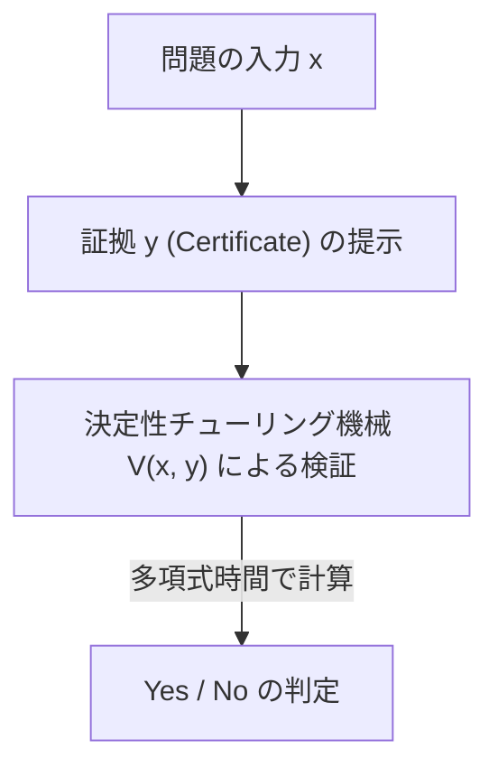
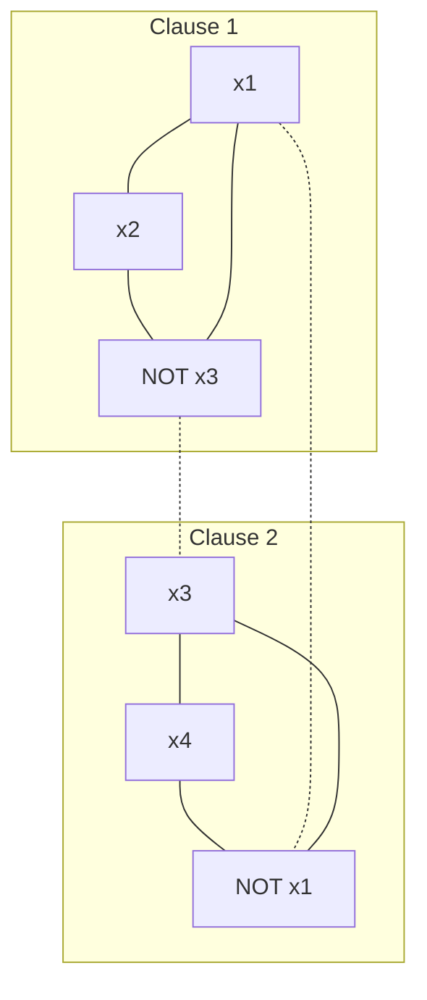

現代の数学、計算機科学において最も有名であり、最も重要とされる未解決問題が存在します。それが「P対NP問題（P vs NP Problem）」です。クレイ数学研究所が定めるミレニアム懸賞問題の一つとして100万ドルの懸賞金がかけられているこの問題は、単なる知的なパズルや数学者たちの暇つぶしではありません。

私たちの社会を支えるインターネットのセキュリティ、物流・ネットワークの最適化、創薬におけるタンパク質構造予測、AIの学習モデルの最適化、さらには「人間の創造性とは何か」「数学の定理の証明は自動化できるのか」という哲学的な問いにまで直結する、極めて根源的なテーマです。

この記事では、計算量理論（Computational Complexity Theory）の基礎から始まり、クック＝レビンの定理によるNP完全性の発見、計算量クラスの精緻な分類、証明を阻む3つの巨大な障壁（相対化、自然証明、代数化）、最新の幾何学的計算量理論（GCT）のアプローチ、量子計算量クラス（BQP）との関係、さらには実践的なSATソルバーのPython実装に至るまで、P対NP問題を完全に解剖します。数万文字に及ぶこの詳細な解説を通して、計算量理論の深淵に触れてみましょう。

## 第1章：計算量理論の誕生とチューリング機械の基礎

P対NP問題を正確に理解するためには、まず「計算」とは何か、「効率的な計算」とは何かを厳密に数学的に定義する必要があります。1930年代、ダフィット・ヒルベルトが提唱した「決定問題（Entscheidungsproblem）」に対する否定的な解答として、アラン・チューリングは「計算可能なもの」を数学的に定式化するため、抽象的な計算モデルである「チューリング機械（Turing Machine）」を考案しました。アロンゾ・チャーチのラムダ計算と並び、このチューリング機械の概念は「チャーチ＝チューリングのテーゼ」として現代計算機科学の礎となっています。

### 決定性チューリング機械 (DTM) とクラスP
決定性チューリング機械（Deterministic Turing Machine: DTM）は、無限の長さを持つ1次元のテープ、そのテープを読み書きするヘッド、そして有限個の状態を持つ制御部から構成されます。ある状態とテープ上の記号を読み取ったとき、次に機械が取るべき行動（書き込む記号、ヘッドの移動方向、次の状態）は常に一意に決定されます。

より厳密に言えば、DTMの遷移関数 $\delta$ は次のように定義されます：
$$ \delta: Q \times \Gamma \to Q \times \Gamma \times \{L, R\} $$
ここで、$Q$ は状態の有限集合、$\Gamma$ はテープ記号の有限集合（空白記号を含む）、$L, R$ はヘッドの移動方向（左、右）です。入力に対して、状態遷移が単一の軌跡（Deterministic Path）を描くため、「決定性」と呼ばれます。

**クラスP（Polynomial-time）**とは、このDTMを用いて、入力サイズ $n$ に対して多項式時間 $\mathcal{O}(n^k)$ （$k$ は定数）で解くことができる判定問題（Yes/No で答える問題）の集合です。実用上、Pに属する問題は「効率的に解ける問題」とみなされます（コブハムのテーゼ）。例えば、リストのソート、最短経路の探索（ダイクストラ法）、２つの数の最大公約数を求めるアルゴリズム（ユークリッドの互除法）、さらには素数判定（AKS素数判定法）などがこれに該当します。

### 非決定性チューリング機械 (NTM) とクラスNP
一方、非決定性チューリング機械（Nondeterministic Turing Machine: NTM）は、ある状態と入力に対して、次に取るべき行動の候補が複数存在し、そのすべてを「同時に並行して（または常に正解に至る分岐を神がかり的に選択して）」探索できる仮想の機械です。

NTMの遷移関数 $\delta$ の厳密な定式化は以下のようになります：
$$ \delta: Q \times \Gamma \to \mathcal{P}(Q \times \Gamma \times \{L, R\}) $$
ここで $\mathcal{P}(X)$ は集合 $X$ の冪集合（べきしゅうごう、すべての部分集合の集合）を表します。つまり、ある状態 $q \in Q$ とテープ記号 $a \in \Gamma$ に対し、次に取りうるアクションの集合が $\delta(q, a)$ として与えられ、機械はこれらの選択肢の中から任意のものを選ぶことができます。NTMの計算過程は単一のパスではなく、分岐する木構造（計算木、Computation Tree）を形成します。もし計算木のパスのうち、少なくとも1つが受理状態（Yes状態）に到達すれば、NTMはその入力を「受理した」とみなされます。

#### 決定性シミュレーションにおける指数的爆発の数学的メカニズム
NTMの動作をDTMでシミュレートしようとすると、計算時間はどうなるでしょうか。NTMの遷移関数の最大分岐数を $b$（例えば $b=2$）とし、入力サイズ $n$ に対して多項式時間 $p(n)$ で停止すると仮定します。計算木の深さは $p(n)$ となるため、木の最下層における葉（Leaf）の数は最大で $b^{p(n)}$ となります。
DTMがこの計算木をすべて探索する（例えば幅優先探索や深さ優先探索を用いる）場合、必要なステップ数は $\mathcal{O}(b^{p(n)})$ となり、入力サイズ $n$ に対して指数関数的（Exponentially）に爆発します。これが、直感的に P $\neq$ NP と信じられている数学的な根本理由です。決定性の逐次計算では、非決定性の持つ「並列分岐」の力に追いつくためには莫大な時間的・空間的コストを払わざるを得ないと考えられているのです。

**クラスNP（Nondeterministic Polynomial-time）**とは、NTMを用いて多項式時間で解ける判定問題の集合です。しかし、より直感的で実用的な定義として、「Yesという答えが与えられたとき、その証拠（Certificate または Witness）が正しいかどうかをDTMを用いて多項式時間で検証できる問題」の集合と言い換えることができます。


（※ ここでのパイプや特殊記号を避けた記述としています。）

例えば、巡回セールスマン問題の判定版（「距離 $K$ 以下で全ての都市をちょうど一度ずつ回る経路が存在するか？」）は、仮にそのような経路（証拠 $y$）が神様や魔法使いから与えられれば、その総距離を足し合わせて $K$ 以下であるかを確認するだけでよいため、多項式時間で容易に検証可能です。したがって、この問題はNPに属します。

## 第2章：クック＝レビンの定理とNP完全性の夜明け

P対NP問題（すなわち P = NP か？）とは、「答えの検証が容易な問題は、答えを見つけるのも容易であるか？」という極めて自然な問いです。直感的には、答えを見つける方がはるかに難しそうですが（P $\neq$ NP）、それを数学的に証明することは困難を極めます。

### 充足可能性問題（SAT）
この議論に革命をもたらしたのが、1971年のスティーブン・クック（Stephen Cook）と1973年のレオニード・レビン（Leonid Levin）による独立した研究です。彼らは、命題論理の論理式を真にする変数割り当てが存在するかを問う「充足可能性問題（SAT: Boolean Satisfiability Problem）」に着目しました。

### クック＝レビンの定理 (Cook-Levin Theorem)
「SATはNPに属する全ての問題の中で最も難しい問題の一つである」——これがクック＝レビンの定理の骨子です。彼らは、任意のNP問題が多項式時間内でSATに変換（還元）できることを証明しました。

**多項式時間還元（Polynomial-time Reduction, Karp Reduction）**とは、問題 $A$ の入力 $x$ を、問題 $B$ の入力 $y = f(x)$ に多項式時間で計算可能な関数 $f$ を用いて変換でき、$x \in A \iff f(x) \in B$ が成り立つことです（$A \le_p B$ と書きます）。

クックとレビンは、任意のNTMの多項式時間における計算の遷移（状態、テープの内容、ヘッドの位置）を巨大な論理式（ブール式）で精密に表現しました。具体的には、「時間 $t$ でテープの $i$ 番目のセルに記号 $a$ が存在する」「時間 $t$ で機械は状態 $q$ にある」「時間 $t$ でヘッドは位置 $i$ にある」といった命題変数（Boolean variables）を導入します。これらの変数が、チューリング機械の局所的な遷移規則 $\delta$ に正しく従うことを制約条件（AND/OR/NOTで構成される節）として記述します。
実行時間が $p(n)$ であるため、必要な変数の数は $\mathcal{O}(p(n)^2)$ 程度に収まり、全体として多項式サイズの論理式が生成されます。もし、ある入力に対してNTMが「受理（Yes）」状態に到達する遷移列（証拠）が存在するなら、それに対応する論理式が充足可能になります。この証明により、SATを解く多項式時間アルゴリズムが存在すれば、すべてのNP問題が多項式時間で解けること（P = NP）が示されたのです。

このような「NPに属し、かつ全てのNP問題から多項式時間で還元できる問題」を**NP完全（NP-complete）**と呼びます。SATは歴史上初めて発見されたNP完全問題でした。

### 3-SATから最大独立点集合（MIS）および頂点被覆（Vertex Cover）への還元：厳密な証明

1972年、リチャード・カープ（Richard Karp）は、SATのNP完全性を起点として、グラフ理論や組み合わせ最適化の著名な21の問題がすべてNP完全であることを証明しました。ここでは、計算量理論の講義で必ず扱われる「3-SATから最大独立点集合（Maximum Independent Set: MIS）問題」および「頂点被覆（Vertex Cover）問題」への多項式時間還元のステップ・バイ・ステップの厳密な数学的証明を展開します。

**問題の定義:**
- **3-SAT**: 各節（Clause）がちょうど3つのリテラル（変数またはその否定）の論理和（OR）で構成される連言標準形（CNF）の論理式 $\phi$ が与えられたとき、$\phi$ を真にする変数割り当てが存在するか？
  $\phi = (l_{11} \lor l_{12} \lor l_{13}) \land (l_{21} \lor l_{22} \lor l_{23}) \land \dots \land (l_{m1} \lor l_{m2} \lor l_{m3})$
- **最大独立点集合 (MIS)**: 無向グラフ $G=(V, E)$ と整数 $k$ が与えられたとき、互いに隣接しない（辺で結ばれていない）頂点の集合 $S \subseteq V$ で、サイズが $|S| \ge k$ となるものが存在するか？
- **頂点被覆 (Vertex Cover)**: 無向グラフ $G=(V, E)$ と整数 $k'$ が与えられたとき、すべての辺 $e \in E$ について、その少なくとも一方の端点が集合 $C \subseteq V$ に含まれるような、サイズ $|C| \le k'$ の集合 $C$ が存在するか？

**還元関数 $f$: 3-SAT $\to$ MIS の構成**
入力として3-SATの論理式 $\phi$（節の数 $m$）が与えられたとき、グラフ $G=(V, E)$ と目標サイズ $k$ を次のように構成します。

1. **頂点の構成 (V):**
   各節 $C_i = (l_{i1} \lor l_{i2} \lor l_{i3})$ の各リテラルに対応する頂点を独立して3つ作成します。したがって、頂点の総数は厳密に $|V| = 3m$ となります。
   $V = \{ v_{ij} : 1 \le i \le m, 1 \le j \le 3 \}$

2. **辺の構成 (E):**
   辺は以下の2つのルールに従って引かれます。
   - **内部の辺 (Triangle edges):** 同じ節に属する3つの頂点同士を互いに結びます。つまり、各節ごとに三角形（サイズ3のクリーク）を形成します。
     $E_{\text{inner}} = \{ (v_{i1}, v_{i2}), (v_{i2}, v_{i3}), (v_{i3}, v_{i1}) : 1 \le i \le m \}$
   - **矛盾の辺 (Conflict edges):** 互いに論理的に矛盾するリテラル（例: $x$ と $\lnot x$）に対応する頂点間に辺を引きます。
     $E_{\text{conflict}} = \{ (v_{ij}, v_{pq}) : l_{ij} = \lnot l_{pq} \}$
   全体の辺集合は $E = E_{\text{inner}} \cup E_{\text{conflict}}$ となります。

3. **目標サイズ $k$ の設定:**
   $k = m$（節の数）とします。このグラフ構築は明らかに多項式時間 $\mathcal{O}(m^2)$ で完了します。

**正当性の証明 ($x \in \text{3-SAT} \iff f(x) \in \text{MIS}$):**

**[ $\Rightarrow$ の証明 (充足可能ならばサイズ $m$ の独立点集合が存在)]**
$\phi$ が充足可能であると仮定します。すなわち、$\phi$ を真にする変数割り当てが存在します。この割り当ての下で、各節 $C_i$ は少なくとも1つの真(True)となるリテラルを持ちます。
各節から、真となるリテラルに対応する頂点を「ちょうど1つ」選び、その集合を $S$ とします。$S$ のサイズは明らかに $|S| = m = k$ です。
$S$ が独立点集合であることを背理法で示します。もし $S$ 内の2つの頂点に辺があると仮定します。
- 内部の辺の場合：同じ節から2つの頂点を選んだことになりますが、各節から1つしか選んでいないという構成手順に矛盾します。
- 矛盾の辺の場合：ある変数 $x$ に対して $x$ と $\lnot x$ の両方に対応する頂点を選んだことになります。しかし、これは $x$ と $\lnot x$ の両方が真であることを意味し、変数割り当てとしてあり得ないため矛盾します。
したがって、$S$ 内のどの2頂点間にも辺は存在せず、$S$ はサイズ $m$ の独立点集合です。

**[ $\Leftarrow$ の証明 (サイズ $m$ の独立点集合が存在すれば充足可能)]**
グラフ $G$ にサイズ $m$ の独立点集合 $S$ が存在すると仮定します。
グラフの構成上、同じ節に属する3つの頂点は三角形（クリーク）を成しているため、独立点集合 $S$ には同じ節から最大で1つの頂点しか含めることができません。
頂点の総数は $3m$、節の数は $m$、そして $|S|=m$ であるため、鳩の巣原理（Pigeonhole principle）により、$S$ は「各節からちょうど1つの頂点」を含んでいなければなりません。
$S$ に含まれる頂点に対応するリテラルをすべて真(True)とする変数割り当てを考えます。矛盾の辺が存在しない（$S$ は独立点集合である）ため、ある変数 $x$ と $\lnot x$ の両方が真に割り当てられることはありません。$S$ に含まれない変数には任意の値を割り当てます。
この割り当てにより、すべての節において選ばれたリテラルが真となるため、全体の論理式 $\phi$ は充足可能となります。

**グラフ図解のイメージ**
$\phi = (x_1 \lor x_2 \lor \lnot x_3) \land (\lnot x_1 \lor x_3 \lor x_4)$ の場合

(実線は内部の辺、点線は矛盾の辺を表します。各サブグラフから1つずつ、互いに辺で結ばれていない頂点を選べればMIS達成となります。)

**MISから頂点被覆 (Vertex Cover) への還元**
さらに、グラフ理論における美しい双対性により、MISから頂点被覆への還元は驚くほど簡単です。
定理：「グラフ $G=(V, E)$ において、部分集合 $S \subseteq V$ が独立点集合であることと、その補集合 $V \setminus S$ が頂点被覆であることは同値である。」
証明：$S$ が独立点集合であるとします。任意の辺 $e = (u, v) \in E$ について、$u$ と $v$ が両方とも $S$ に含まれることはありません（独立点集合の定義）。したがって、$u, v$ のうち少なくとも一方は $V \setminus S$ に含まれます。これは $V \setminus S$ がすべての辺を被覆していることを意味し、頂点被覆の定義を満たします。逆も全く同様に証明できます。
よって、目標サイズ $k$ のMISが存在するかという問題は、目標サイズ $k' = |V| - k$ の頂点被覆が存在するかという問題に多項式時間で還元されます。

これらの還元により、3-SATからMIS、そしてVertex CoverへとNP完全性が伝播していく数学的構造が明らかになりました。

## 第3章：NP中間問題と量子計算量クラス (BQP) の衝撃

もし P $\neq$ NP であるなら、PでもNP完全でもない「中間的」な難しさを持つ問題が存在するのでしょうか？

### ラドナーの定理 (Ladner's Theorem)
リチャード・ラドナーは1975年に、「もし P $\neq$ NP ならば、NPに属するがPにもNP完全にも属さない問題（NP中間問題, NP-intermediate problems）が必ず存在する」という**ラドナーの定理**を証明しました。
ラドナーの証明は対角線論法に基づく人工的な言語を構築するものでしたが、現実的に私たちが直面する問題の中にも、NP中間ではないかと強く疑われている問題がいくつか存在します。例えば、グラフ同型問題（Graph Isomorphism）などが挙げられます。

### 素因数分解とショアのアルゴリズム
もう一つの巨大なフロンティアが、暗号理論の根幹を成す「整数の素因数分解」です。素因数分解の判定問題版（「整数 $N$ は $k$ 以下の非自明な素因数を持つか？」）はNPに属しますが、NP完全ではないと信じられています（もしNP完全なら、多項式階層という計算量クラスの階層が崩壊するという強い理論的証拠があるためです）。

ここで計算量理論に革命をもたらしたのが量子コンピュータです。
1994年、ピーター・ショア（Peter Shor）は、量子コンピュータを用いれば素因数分解が多項式時間で解けること（**ショアのアルゴリズム**）を示しました。古典的なアルゴリズムでは最良でも準指数時間（例：一般数体篩法）かかる問題が、量子計算では $\mathcal{O}((\log N)^3)$ 程度の時間で解けてしまうのです。

### 量子計算量クラスBQPとP、NPとの包含関係
これを定式化するために、**BQP (Bounded-error Quantum Polynomial-time)** という計算量クラスが導入されました。BQPは、量子チューリング機械（または量子回路モデル）を用いて多項式時間で、誤り確率1/3以下で解ける判定問題のクラスです。

古典的な計算クラスとの関係は以下のようになっていると予想されています：
1. $P \subseteq BQP$ （古典コンピュータで効率的に解けるものは量子でも解ける）
2. $BQP \not\subseteq NP$ （BQPにはNPに属さない問題も含まれるかもしれない）
3. $NP \not\subseteq BQP$ （量子コンピュータを用いてもNP完全問題は効率的に解けない）

**ショアのアルゴリズムがP対NP問題そのものを解決しない理由**
一般のニュースなどでは「量子コンピュータが完成すれば、あらゆる計算問題（NP問題）が一瞬で解ける」と誤解されがちですが、計算量理論の観点からはこれは正しくありません。
ショアのアルゴリズムは整数の素因数分解（および離散対数問題）をBQPに分類しました。しかし、前述の通り素因数分解はNP完全問題ではありません。
もしショアのアルゴリズムが「SAT（NP完全問題）」を多項式時間で解くものであったなら、「量子コンピュータはNP問題をすべて効率的に解ける（$NP \subseteq BQP$）」ことになり、P対NPの枠組みを揺るがす大事件でした。
しかし、量子コンピュータの力（重ね合わせと量子干渉）を用いても、NP完全問題を解くための指数関数的な探索空間を多項式時間に圧縮することはできず、グローバーのアルゴリズム（Grover's Algorithm）を用いたとしても、せいぜい二次関数的な速度向上（探索空間 $N$ に対して $\mathcal{O}(N) \to \mathcal{O}(\sqrt{N})$、時間計算量では $\mathcal{O}(2^n) \to \mathcal{O}(2^{n/2})$）にとどまると証明されています（Bennett, Bernstein, Brassard, Vazirani, 1997）。
したがって、量子コンピュータが実用化されても、P対NP問題の本質的な困難さ（特にNP完全問題の効率的な解法）は解決されないというのが現在の理論計算機科学の強固なコンセンサスです。

## 第4章：なぜP対NP問題は解けないのか？3つの主要な障壁

半世紀以上にわたり、世界中の天才数学者たちがP対NP問題に挑み、そして敗れ去ってきました。単に人類の頭脳が足りないわけではありません。現在の数学的枠組み（証明手法）そのものに、この問題を解くための能力が欠けていることが「メタ証明」されているのです。これが計算量理論における3つの巨大な障壁です。

### 1. 相対化の障壁 (Relativization Barrier) と Baker-Gill-Solovay の定理
1975年、Theodore Baker, John Gill, Robert Solovay は「オラクル（神託）」と呼ばれる概念を用いました。オラクル $A$ は、一瞬で（1ステップで）ある問題 $A$ の答えを教えてくれる仮想のブラックボックスです。チューリング機械にこのオラクルへの問い合わせ機能を追加したものを、オラクルチューリング機械と呼びます。

彼らは、あるオラクルでは P=NP となり、別のオラクルでは P≠NP となることを証明し、計算量理論に衝撃を与えました。

**Baker-Gill-Solovayの定理の完全な証明スケッチ**

**定理：次の性質を満たすオラクル $A$ と $B$ が存在する。**
1. $P^A = NP^A$
2. $P^B \neq NP^B$

**[ $P^A = NP^A$ となるオラクル $A$ の構成 ]**
オラクル $A$ として、PSPACE完全問題である「TQBF（True Quantified Boolean Formula）」問題を選びます。
オラクル $A$ を持つ決定性多項式時間機械（$P^A$）は、PSPACE内のあらゆる問題を多項式時間で解けます。なぜなら、PSPACE内の任意の問題は多項式時間でTQBFに還元でき、オラクルに一回問い合わせるだけで答えを得られるからです。つまり $P^A = \text{PSPACE}$ です。
一方、オラクル $A$ を持つ非決定性多項式時間機械（$NP^A$）も、オラクルの力を駆使したとしても、多項式時間内では多項式サイズの領域しか探索できないため、$NP^A \subseteq \text{NPSPACE}$ となります。計算量理論の基本定理であるサヴィッチの定理（Savitch's Theorem）により $\text{NPSPACE} = \text{PSPACE}$ であるため、$NP^A \subseteq \text{PSPACE}$ です。
当然 $P^A \subseteq NP^A$ なので、これらを合わせると $P^A = NP^A = \text{PSPACE}$ が成立します。

**[ $P^B \neq NP^B$ となるオラクル $B$ の構成 ]**
$B$ をある言語（文字列の集合）とし、オラクル $B$ に対して次のような言語 $L_B$ を定義します。
$L_B = \{ 1^n : \text{長さ } n \text{ の何らかの文字列 } x \text{ が } B \text{ に存在する} \}$
明らかに $L_B \in NP^B$ です。なぜなら、NTMは入力 $1^n$ に対して、長さ $n$ の文字列 $x$ を非決定的に推測（生成）し、オラクル $B$ に $x \in B$ かどうかを1ステップで問い合わせて検証できるからです。
次に、$L_B \notin P^B$ となるように、オラクル $B$ の中身を対角線論法（Diagonalization）を用いて帰納的に構築します。
すべての決定性多項式時間オラクル機械を $M_1, M_2, \dots, M_i, \dots$ と列挙します。各 $M_i$ の実行時間は多項式 $p_i(n)$ で抑えられているとします。
段階 $i$ において、十分に長い文字列長 $n$ を選びます（$2^n > p_i(n)$ となるように急激に大きくします）。
$M_i$ に入力 $1^n$ を与えてシミュレートします。実行中、$M_i$ は高々 $p_i(n)$ 個の文字列についてオラクルに問い合わせを行います。
長さ $n$ の文字列の総数は $2^n$ 個あり、$2^n > p_i(n)$ であるため、$M_i$ が「一度もオラクルに問い合わせなかった」長さ $n$ の文字列 $y$ が必ず存在します。
- もし $M_i(1^n)$ が最終的に「受理（1）」を出力したなら、$B$ には長さ $n$ の文字列を一切含めない（空集合にする）ことに決定します。これにより $1^n \notin L_B$ となり、$M_i$ の出力は間違っていたことになります。
- もし $M_i(1^n)$ が最終的に「拒否（0）」を出力したなら、先ほどの未問い合わせの文字列 $y$ を $B$ に追加します。これにより $1^n \in L_B$ となり、やはり $M_i$ の出力は間違っていたことになります。
これをすべての機械に対して無限に繰り返すことで構成されたオラクル $B$ においては、いかなるDTMも言語 $L_B$ を正しく判定できず、$L_B \notin P^B$ となります。したがって $P^B \neq NP^B$ です。

**相対化の障壁の意味**
この定理の恐るべき帰結は、「対角線論法や状態のシミュレーションといった、オラクルの存在によって影響を受けない（相対化する, Relativizing）証明手法では、P対NP問題を永遠に解決できない」ということです。なぜなら、もしその手法で P=NP が証明できるなら、オラクル $B$ の世界でも P=NP が証明できてしまい矛盾するからです。

### 2. 自然証明の障壁 (Natural Proofs Barrier)
相対化の障壁を乗り越えるため、理論家たちはチューリング機械の動作ではなく、論理ゲート（AND, OR, NOT）を組み合わせた「ブール回路（Boolean Circuits）」のサイズの下界を示すアプローチ（クラス P/poly に対する下界証明）へとシフトしました。
しかし1994年、Alexander Razborov と Steven Rudich は「自然証明（Natural Proofs）」という概念を提唱しました。
彼らは、当時の回路下界証明の手法のほとんどが「有用性（Constructivity）」と「巨大性（Largeness）」という性質を満たす「自然な性質」を抽出することで成り立っていることを指摘しました。そして、もし一方向性関数が存在する（暗号が成立する）ならば、そのような「自然証明」によって強い計算量クラスに対する下界を証明することは不可能であると数学的に証明しました。
つまり、P $\neq$ NP を証明しようとする既存の組合せ論的手法が、皮肉にも P $\neq$ NP（の強い形である暗号の存在）を仮定すると機能しなくなるというパラドックスに陥ってしまったのです。

### 3. 代数化の障壁 (Algebrization Barrier)
相対化と自然証明の壁を避けるため、1990年代に発展したのが「対話型証明システム（Interactive Proofs）」と「算術化（Arithmetization）」です。これにより IP = PSPACE などの画期的な定理が証明されました。
しかし2008年、Scott Aaronson と Avi Wigderson は、これらの手法も結局は多項式を有限体上で拡張する「代数化（Algebrization）」という操作に依存していることを示しました。そして、代数化を用いる手法では P対NP問題（あるいは他の多くの計算量クラスの分離）を解決できないことを証明しました。

これら3つの障壁により、「P対NP問題を解くには、全く新しいパラダイムの数学が必要である」という認識が理論計算機科学の常識となりました。

## 第5章：実践・PythonによるSATソルバーの数理と実装

P=NPが未解決である一方で、現実世界の産業界では数百万変数を持つ巨大なSAT（NP完全問題）が日々高速に解かれています。これは、最悪計算時間が指数時間であっても、実用上の多くの問題（ハードウェア検証や依存関係解決など）が強い「構造」を持っているためです。ここでは、P対NP問題の理論の根幹であるSATソルバーの具体的なアルゴリズムとPython実装を見てみましょう。

### DPLLアルゴリズムとバックトラックの数理
DPLL (Davis-Putnam-Logemann-Loveland) アルゴリズムは、深さ優先探索（バックトラック）をベースに、論理式の特性を利用して探索空間を劇的に削減する手法です。

数理的なポイントは以下の2つです：
1. **単位伝播 (Unit Propagation / Boolean Constraint Propagation):** 節の中に未割り当てのリテラルが1つしか残っていない場合（Unit Clause）、その節を真にするためには、そのリテラルを真にするしか選択肢がありません。この強制的な割り当てが、連鎖的に他の節の単位伝播を引き起こし、探索木を大きく刈り込みます。
2. **純リテラル消去 (Pure Literal Elimination):** 論理式全体において、ある変数が常に肯定（または常に否定）の形でのみ出現する場合、そのリテラルを真とする割り当てを行っても他の節の充足可能性に悪影響を与えません。

以下は、DPLLアルゴリズムのシンプルで教育的なPythonによるコード例です。

```python
def dpll(clauses, assignment):
    # ベースケース1: すべての節が満たされ、リストが空になった場合 -> 充足可能 (SAT)
    if len(clauses) == 0:
        return True, assignment
    
    # ベースケース2: 矛盾（空の節）が存在する場合 -> 充足不能 (UNSAT)
    if any(len(c) == 0 for c in clauses):
        return False, {}
    
    # 単位伝播 (Unit Propagation) の適用
    unit_clauses = [c for c in clauses if len(c) == 1]
    if unit_clauses:
        unit = unit_clauses[0][0]
        new_clauses = []
        for c in clauses:
            if unit in c:
                continue # この節は真になったので削除
            if -unit in c:
                # 矛盾するリテラルを取り除く
                new_clause = [l for l in c if l != -unit]
                new_clauses.append(new_clause)
            else:
                new_clauses.append(c)
        assignment[abs(unit)] = (unit > 0)
        return dpll(new_clauses, assignment)
    
    # 分岐 (Branching): ヒューリスティックに変数を選択
    # ここでは単純に最初の節の最初のリテラルを選択
    literal = clauses[0][0]
    
    # 変数をTrueと仮定して探索
    res, final_assign = dpll(clauses + [[literal]], assignment.copy())
    if res:
        return True, final_assign
        
    # 上の分岐で失敗した場合、変数をFalseと仮定して探索 (バックトラック)
    return dpll(clauses + [[-literal]], assignment.copy())

# 実行例: (x1 OR NOT x2) AND (NOT x1 OR x2 OR x3) AND (NOT x3)
# 1: x1, 2: x2, 3: x3 (負の数はNOTを表す)
cnf_formula = [[1, -2], [-1, 2, 3], [-3]]
is_sat, solution = dpll(cnf_formula, {})

print(f"Satisfiable: {is_sat}")
print(f"Assignment: {solution}")
# 期待される出力:
# Satisfiable: True
# Assignment: {3: False, 1: False, 2: False} (あるいは他の充足解)
```

### CDCL (Conflict-Driven Clause Learning) アルゴリズムへの進化
現代の最先端SATソルバー（MiniSat, Glucoseなど）は、DPLLを飛躍的に拡張した **CDCL (Conflict-Driven Clause Learning)** アルゴリズムを採用しています。

CDCLの革新性は「失敗から学ぶ」ことにあります。探索中に矛盾（Conflict）が生じた際、単に1つ前のステップに戻る（Chronological backtracking）のではなく、含意グラフ（Implication Graph）を構築して矛盾の根本原因となった変数の組み合わせを解析します。グラフ上のUIP（Unique Implication Point）と呼ばれるカットを計算することで、矛盾の原因を論理式の形に変換し、新しい「学習節（Learned Clause）」として元の式に追加します。
これにより、「過去と同じ間違いを探索木の別の枝で二度と繰り返さない」非クロネッカー的なバックトラック（Non-chronological backtracking / Backjumping）を実現し、指数的な探索木を劇的に刈り込みます。さらにVSIDS（Variable State Independent Decaying Sum）のような動的な変数選択ヒューリスティクスや、定期的な再起動（Restarts）を組み合わせることで、CDCLはNP完全問題に対する人類のヒューリスティクスの最高峰として君臨しています。

## 第6章：現代アプローチと幾何学的計算量理論 (GCT)

障壁が立ち塞がる中、現在の理論家たちはどのようなアプローチでP対NP問題に挑んでいるのでしょうか。

### 幾何学的計算量理論 (Geometric Complexity Theory: GCT)
2001年、Ketan Mulmuley と Milind Sohoni は、代数幾何学と表現論を用いた壮大なプログラム「幾何学的計算量理論（GCT）」を提唱しました。
GCTの基本アイデアは、計算量クラスの分離を、ある多項式の空間（オービットの閉包）における幾何学的な包含関係の問題に帰着させることです。

具体的には、永式（Permanent、#P完全に属し計算が困難）と行列式（Determinant、多項式時間で計算可能）の対称性の違いに着目します。これらの多項式を一般線形群の作用の下で幾何学的な軌道（オービット）として捉え、表現論（シューア多項式や既約表現の重複度）を用いて、「Permanentの軌道閉包がDeterminantの軌道閉包に埋め込めない」ことを示そうとするものです。
GCTは、自然証明や代数化の障壁を回避できる特性を持っているとされ、数学の他分野（代数幾何、表現論、不変式論）の深い定理を動員できる点で期待を集めていますが、非常に高度で難解なため、未だ道半ばの状態が続いています。

### 回路下界とエクスパンダーグラフ
また、別の方向性として、計算のランダム性（BPP）を決定性アルゴリズム（P）で模倣する「脱乱択化（Derandomization）」の研究が進んでいます。エクスパンダーグラフや抽出器（Extractor）などの擬似乱数生成器の理論は、回路の下界証明と深く結びついており（Hardness vs. Randomness パラダイム）、「強い回路下界が証明できれば P = BPP が示せる」といった豊かな結果を生み出しています。これらの進展も、長期的にはP $\neq$ NP証明への足がかりになると考えられています。

## 第7章：P=NP（またはP≠NP）が世界に与える哲学的・技術的インパクト

もしP対NP問題が解決されたら、私たちの社会はどうなるのでしょうか。多くの専門家は P $\neq$ NP を信じていますが、仮に P = NP であると証明され、しかも実用的な多項式時間アルゴリズム（例えば $\mathcal{O}(n^2)$ や $\mathcal{O}(n^3)$）が発見された場合、世界は劇的に、そして恐ろしいほどに変わります。

### 公開鍵暗号の崩壊
現代のインターネットのセキュリティ基盤であるRSA暗号や楕円曲線暗号は、「素因数分解や離散対数問題が多項式時間で解けない」という前提（より厳密には、一方向性関数が存在するということ）の上に成り立っています。P = NP であれば、暗号文から平文を復元する「証拠」を多項式時間で見つけることができるため、暗号は無力化され、デジタル通信のプライバシーと安全な金融取引は一瞬にして崩壊します。

### 最適化と科学の終焉（そして究極の自動化）
しかし、良い面もあります。物流（巡回セールスマン問題）、タンパク質の折り畳み構造の予測、半導体の回路設計、AIの最適な重みの発見など、NP完全問題として定式化されるあらゆる最適化問題が瞬時に最適解を得られるようになります。これは、気候変動の解決から新薬の完全な自動設計まで、人類の技術的進化を数百年分スキップさせるインパクトを持ちます。

### ゲーデルの手紙と人間の創造性
1956年、クルト・ゲーデルはジョン・フォン・ノイマンに宛てた手紙の中で、本質的にP対NP問題を予見する内容を記していました。もし定理の証明（長さ $n$ の証明の発見）が多項式時間で可能なら、「数学者の仕事は機械によって完全に置き換えられる」とゲーデルは書きました。
「証明を検証すること（P）」と「証明を閃くこと（NP）」が等価であるならば、芸術的インスピレーションや数学的直感、天才のひらめきといった「人間の創造性」も、単なる多項式時間のアルゴリズムに過ぎないということになります。

## おわりに：深淵を見つめて

P対NP問題は、単にアルゴリズムの実行時間を問うものではありません。それは「答えを見つけることと、答えを理解することは本質的に違うのか？」という、知性に対する根本的な問いかけです。

現在もなお、世界中の数学者や計算機科学者がこの問題に挑み続けています。証明の完成には、オラクル、自然証明、代数化といった強固な障壁を打ち破る、私たちの想像を超える全く新しい数学的概念が必要になるでしょう。

ミレニアム懸賞問題の頂点に君臨するこの謎が解き明かされる日が来るのか、それともゲーデルの不完全性定理のように「証明不可能」であることが独立性として証明されるのか。人類の知の限界に挑む旅は、これからも続いていきます。
