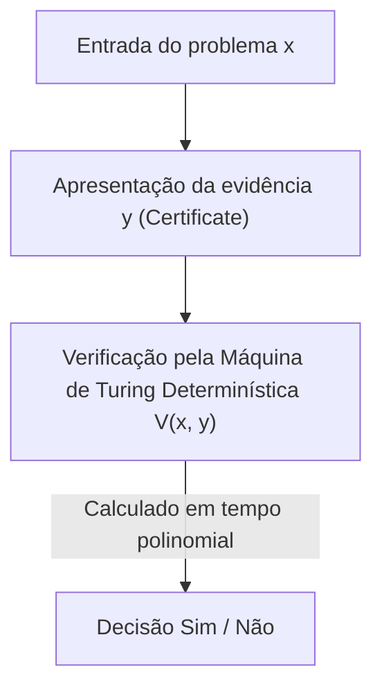
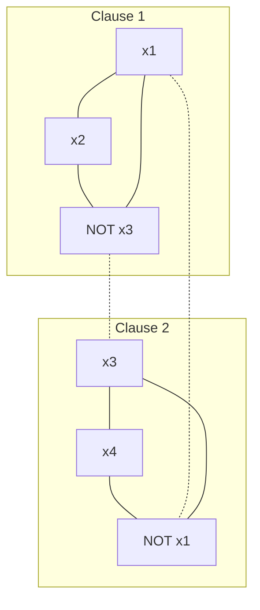

Existe um problema não resolvido que é considerado o mais famoso e importante na matemática e na ciência da computação modernas. Este é o "Problema P versus NP" (P vs NP Problem). Sendo um dos Problemas do Prêmio Millennium estabelecidos pelo Clay Mathematics Institute, com um prêmio de 1 milhão de dólares, este problema não é um mero quebra-cabeça intelectual ou um passatempo para matemáticos.

É um tema extremamente fundamental que está diretamente ligado à segurança da internet que sustenta nossa sociedade, otimização de logística e redes, previsão da estrutura de proteínas na descoberta de medicamentos, otimização de modelos de aprendizado de IA e até questões filosóficas como "o que é a criatividade humana?" e "as provas de teoremas matemáticos podem ser automatizadas?".

Neste artigo, dissecaremos completamente o problema P versus NP, começando pelos fundamentos da Teoria da Complexidade Computacional (Computational Complexity Theory), a descoberta da completude NP pelo teorema de Cook-Levin, a classificação precisa das classes de complexidade, as três barreiras gigantes que impedem a prova (relativização, provas naturais, algebrização), as abordagens mais recentes da Teoria da Complexidade Geométrica (GCT), a relação com a classe de complexidade quântica (BQP) e até uma implementação prática de um solver SAT em Python. Através desta explicação detalhada de dezenas de milhares de caracteres, vamos tocar no abismo da teoria da complexidade computacional.

## Capítulo 1: O Nascimento da Teoria da Complexidade Computacional e os Fundamentos da Máquina de Turing

Para entender com precisão o problema P vs NP, primeiro precisamos definir rigorosamente e matematicamente o que é "computação" e o que é "computação eficiente". Na década de 1930, como uma resposta negativa ao "Problema de Decisão" (Entscheidungsproblem) proposto por David Hilbert, Alan Turing inventou a "Máquina de Turing" (Turing Machine), um modelo computacional abstrato, para formular matematicamente o que é "computável". Juntamente com o cálculo lambda de Alonzo Church, esse conceito da máquina de Turing tornou-se a pedra angular da ciência da computação moderna como a "Tese de Church-Turing".

### Máquina de Turing Determinística (DTM) e a Classe P
Uma Máquina de Turing Determinística (Deterministic Turing Machine: DTM) consiste em uma fita unidimensional de comprimento infinito, um cabeçote que lê e escreve nessa fita, e uma unidade de controle com um número finito de estados. Quando lê um determinado estado e símbolo na fita, a próxima ação que a máquina deve tomar (símbolo a escrever, direção de movimento do cabeçote, próximo estado) é sempre determinada de forma única.

Mais rigorosamente, a função de transição $\delta$ de uma DTM é definida da seguinte forma:
$$ \delta: Q \times \Gamma \to Q \times \Gamma \times \{L, R\} $$
Aqui, $Q$ é o conjunto finito de estados, $\Gamma$ é o conjunto finito de símbolos da fita (incluindo o símbolo em branco), e $L, R$ são as direções de movimento do cabeçote (esquerda, direita). É chamada de "determinística" porque as transições de estado traçam uma trajetória única (Deterministic Path) para uma entrada.

**A Classe P (Polynomial-time)** é o conjunto de problemas de decisão (problemas respondidos com Sim/Não) que podem ser resolvidos em tempo polinomial $\mathcal{O}(n^k)$ ($k$ é uma constante) em relação ao tamanho da entrada $n$, usando esta DTM. Na prática, problemas pertencentes a P são considerados "problemas que podem ser resolvidos de forma eficiente" (Tese de Cobham). Exemplos incluem classificação de listas (sorting), busca de caminho mais curto (algoritmo de Dijkstra), algoritmo para encontrar o máximo divisor comum de dois números (algoritmo de Euclides) e teste de primalidade (algoritmo AKS).

### Máquina de Turing Não Determinística (NTM) e a Classe NP
Por outro lado, a Máquina de Turing Não Determinística (Nondeterministic Turing Machine: NTM) é uma máquina virtual que, para um determinado estado e entrada, tem múltiplas candidatas para a próxima ação a ser tomada e pode explorar todas elas "simultaneamente em paralelo (ou sempre escolher miraculosamente o ramo que leva à resposta correta)".

A formulação rigorosa da função de transição $\delta$ de uma NTM é a seguinte:
$$ \delta: Q \times \Gamma \to \mathcal{P}(Q \times \Gamma \times \{L, R\}) $$
Aqui, $\mathcal{P}(X)$ representa o conjunto das partes (powerset, o conjunto de todos os subconjuntos) do conjunto $X$. Ou seja, para um estado $q \in Q$ e um símbolo de fita $a \in \Gamma$, o conjunto de ações possíveis é dado como $\delta(q, a)$, e a máquina pode escolher qualquer uma dessas opções. O processo de computação de uma NTM não é um caminho único, mas forma uma estrutura em árvore ramificada (Árvore de Computação, Computation Tree). Se pelo menos um dos caminhos da árvore de computação atingir o estado de aceitação (estado Sim), considera-se que a NTM "aceitou" a entrada.

#### O Mecanismo Matemático da Explosão Exponencial na Simulação Determinística
O que acontece com o tempo de computação quando tentamos simular a operação de uma NTM com uma DTM? Suponha que o número máximo de ramificações da função de transição da NTM seja $b$ (por exemplo, $b=2$) e que ela pare em tempo polinomial $p(n)$ para o tamanho da entrada $n$. Como a profundidade da árvore de computação é $p(n)$, o número de folhas (Leaves) na camada inferior da árvore é no máximo $b^{p(n)}$.
Quando uma DTM explora toda essa árvore de computação (usando, por exemplo, busca em largura ou busca em profundidade), o número de etapas necessárias será $\mathcal{O}(b^{p(n)})$, o que explode exponencialmente (Exponentially) em relação ao tamanho da entrada $n$. Esta é a razão matemática fundamental pela qual se acredita intuitivamente que P $\neq$ NP. Na computação sequencial determinística, acredita-se que custos enormes de tempo e espaço devem ser pagos para alcançar o poder das "ramificações paralelas" do não-determinismo.

**A Classe NP (Nondeterministic Polynomial-time)** é o conjunto de problemas de decisão que podem ser resolvidos em tempo polinomial usando uma NTM. No entanto, uma definição mais intuitiva e prática seria "o conjunto de problemas em que, quando uma resposta 'Sim' é dada, a validade da evidência (Certificate ou Witness) pode ser verificada em tempo polinomial usando uma DTM".


(* Nota: Esta descrição evita barras verticais ou símbolos especiais.)

Por exemplo, a versão de decisão do problema do caixeiro viajante ("Existe uma rota que visita todas as cidades exatamente uma vez com uma distância total de $K$ ou menos?"), se tal rota (evidência $y$) for dada por um deus ou mágico, você só precisaria somar a distância total e verificar se é $K$ ou menos, o que pode ser facilmente verificado em tempo polinomial. Portanto, este problema pertence a NP.

## Capítulo 2: O Teorema de Cook-Levin e o Alvorecer da Completude NP

O problema P vs NP (ou seja, P = NP?) é uma questão extremamente natural: "Problemas cujas respostas são fáceis de verificar também são fáceis de encontrar a resposta?". Intuitivamente, parece muito mais difícil encontrar a resposta (P $\neq$ NP), mas provar isso matematicamente provou ser extremamente difícil.

### Problema de Satisfatibilidade Booleana (SAT)
Pesquisas independentes de Stephen Cook em 1971 e Leonid Levin em 1973 trouxeram uma revolução a este debate. Eles se concentraram no "Problema de Satisfatibilidade Booleana (SAT: Boolean Satisfiability Problem)", que pergunta se existe uma atribuição de variáveis que torna uma fórmula da lógica proposicional verdadeira.

### O Teorema de Cook-Levin (Cook-Levin Theorem)
"SAT é um dos problemas mais difíceis de todos os problemas pertencentes a NP" — esta é a essência do teorema de Cook-Levin. Eles provaram que qualquer problema NP pode ser convertido (reduzido) a SAT em tempo polinomial.

**Redução em Tempo Polinomial (Polynomial-time Reduction, Karp Reduction)** significa que uma entrada $x$ do problema $A$ pode ser convertida em uma entrada $y = f(x)$ do problema $B$ usando uma função $f$ computável em tempo polinomial, de modo que $x \in A \iff f(x) \in B$ seja verdadeiro (escrito como $A \le_p B$).

Cook e Levin expressaram com precisão a transição das computações (estado, conteúdo da fita, posição do cabeçote) de qualquer NTM em tempo polinomial como uma fórmula lógica gigante (fórmula booleana). Especificamente, variáveis proposicionais (Boolean variables) são introduzidas para representar proposições como "no tempo $t$, o símbolo $a$ existe na célula $i$ da fita", "no tempo $t$, a máquina está no estado $q$", "no tempo $t$, o cabeçote está na posição $i$". O fato de que essas variáveis seguem corretamente a regra de transição local $\delta$ da máquina de Turing é descrito como condições de restrição (cláusulas compostas de AND/OR/NOT).
Como o tempo de execução é $p(n)$, o número de variáveis necessárias fica em torno de $\mathcal{O}(p(n)^2)$ e, de maneira geral, uma fórmula lógica de tamanho polinomial é gerada. Se houver uma sequência de transições (evidência) na qual a NTM atinge um estado "aceito (Sim)" para uma determinada entrada, a fórmula lógica correspondente torna-se satisfatível. Por esta prova, foi demonstrado que se houver um algoritmo de tempo polinomial que resolva SAT, todos os problemas NP poderão ser resolvidos em tempo polinomial (P = NP).

Tais problemas que "pertencem a NP e podem ser reduzidos em tempo polinomial a partir de todos os problemas NP" são chamados de **NP-completos (NP-complete)**. SAT foi o primeiro problema NP-completo descoberto na história.

### Redução de 3-SAT para Conjunto Independente Máximo (MIS) e Cobertura de Vértices (Vertex Cover): Prova Rigorosa

Em 1972, Richard Karp partiu da completude NP de SAT e provou que 21 problemas famosos da teoria dos grafos e otimização combinatória são todos NP-completos. Aqui, desenvolveremos uma prova matemática rigorosa, passo a passo, da redução em tempo polinomial de "3-SAT para o problema do Conjunto Independente Máximo (Maximum Independent Set: MIS)" e o problema da "Cobertura de Vértices (Vertex Cover)", que são invariavelmente abordados em palestras sobre teoria da complexidade.

**Definição dos Problemas:**
- **3-SAT**: Dada uma fórmula lógica $\phi$ na Forma Normal Conjuntiva (CNF), onde cada cláusula (Clause) é composta de exatamente três literais (variáveis ou suas negações) conectados por OR (disjunção), existe uma atribuição de variáveis que torna $\phi$ verdadeira?
  $\phi = (l_{11} \lor l_{12} \lor l_{13}) \land (l_{21} \lor l_{22} \lor l_{23}) \land \dots \land (l_{m1} \lor l_{m2} \lor l_{m3})$
- **Conjunto Independente Máximo (MIS)**: Dado um grafo não direcionado $G=(V, E)$ e um inteiro $k$, existe um conjunto de vértices $S \subseteq V$ que não são adjacentes (não conectados por arestas) de modo que o tamanho $|S| \ge k$?
- **Cobertura de Vértices (Vertex Cover)**: Dado um grafo não direcionado $G=(V, E)$ e um inteiro $k'$, existe um conjunto $C \subseteq V$ de tamanho $|C| \le k'$ tal que, para toda aresta $e \in E$, pelo menos um de seus pontos extremos esteja contido em $C$?

**Construção da Função de Redução $f$: 3-SAT $\to$ MIS**
Dada uma fórmula 3-SAT $\phi$ (com $m$ cláusulas) como entrada, construímos um grafo $G=(V, E)$ e um tamanho alvo $k$ da seguinte forma.

1. **Construção dos Vértices (V):**
   Criamos 3 vértices independentes correspondentes a cada literal em cada cláusula $C_i = (l_{i1} \lor l_{i2} \lor l_{i3})$. Portanto, o número total de vértices é estritamente $|V| = 3m$.
   $V = \{ v_{ij} : 1 \le i \le m, 1 \le j \le 3 \}$

2. **Construção das Arestas (E):**
   As arestas são desenhadas de acordo com as seguintes duas regras.
   - **Arestas internas (Triangle edges):** Conectamos os três vértices que pertencem à mesma cláusula entre si. Ou seja, um triângulo (um clique de tamanho 3) é formado para cada cláusula.
     $E_{\text{inner}} = \{ (v_{i1}, v_{i2}), (v_{i2}, v_{i3}), (v_{i3}, v_{i1}) : 1 \le i \le m \}$
   - **Arestas de conflito (Conflict edges):** Desenhamos arestas entre vértices correspondentes a literais que são logicamente contraditórios (ex: $x$ e $\lnot x$).
     $E_{\text{conflict}} = \{ (v_{ij}, v_{pq}) : l_{ij} = \lnot l_{pq} \}$
   O conjunto total de arestas é $E = E_{\text{inner}} \cup E_{\text{conflict}}$.

3. **Definindo o tamanho alvo $k$:**
   Definimos $k = m$ (número de cláusulas). Esta construção de grafo é claramente completada em tempo polinomial $\mathcal{O}(m^2)$.

**Prova de Correção ($x \in \text{3-SAT} \iff f(x) \in \text{MIS}$):**

**[ Prova de $\Rightarrow$ (Se satisfatível, existe um conjunto independente de tamanho $m$) ]**
Assuma que $\phi$ é satisfatível. Ou seja, existe uma atribuição de variáveis que torna $\phi$ verdadeira. Sob esta atribuição, cada cláusula $C_i$ tem pelo menos um literal que se torna verdadeiro (True).
De cada cláusula, escolhemos "exatamente um" vértice correspondente a um literal verdadeiro e chamamos esse conjunto de $S$. O tamanho de $S$ é claramente $|S| = m = k$.
Mostraremos por contradição que $S$ é um conjunto independente. Suponha que haja uma aresta entre dois vértices em $S$.
- No caso de uma aresta interna: Significa que escolhemos dois vértices da mesma cláusula, o que contradiz o procedimento de construção em que apenas um de cada cláusula é escolhido.
- No caso de uma aresta de conflito: Significa que, para uma variável $x$, escolhemos vértices correspondentes tanto a $x$ quanto a $\lnot x$. No entanto, isso significa que tanto $x$ quanto $\lnot x$ são verdadeiros, o que é impossível como uma atribuição de variável, portanto, há uma contradição.
Portanto, não existem arestas entre quaisquer dois vértices em $S$, e $S$ é um conjunto independente de tamanho $m$.

**[ Prova de $\Leftarrow$ (Se existe um conjunto independente de tamanho $m$, é satisfatível) ]**
Assuma que o grafo $G$ possui um conjunto independente $S$ de tamanho $m$.
Devido à construção do grafo, como três vértices pertencentes à mesma cláusula formam um triângulo (clique), o conjunto independente $S$ pode conter no máximo um vértice da mesma cláusula.
Como o número total de vértices é $3m$, o número de cláusulas é $m$ e $|S|=m$, pelo Princípio da Casa dos Pombos (Pigeonhole principle), $S$ deve conter "exatamente um vértice de cada cláusula".
Considere uma atribuição de variáveis que torna verdadeiros (True) todos os literais correspondentes aos vértices incluídos em $S$. Como não há arestas de conflito (já que $S$ é um conjunto independente), não ocorrerá de uma variável $x$ e sua negação $\lnot x$ serem atribuídas a verdadeiro. Atribuímos valores arbitrários às variáveis que não estão em $S$.
Com essa atribuição, o literal escolhido torna-se verdadeiro em todas as cláusulas, de forma que toda a fórmula $\phi$ torna-se satisfatível.

**Imagem Esquemática do Grafo**
No caso de $\phi = (x_1 \lor x_2 \lor \lnot x_3) \land (\lnot x_1 \lor x_3 \lor x_4)$

(Arestas contínuas representam arestas internas, arestas pontilhadas representam arestas de conflito. Se for possível escolher um vértice de cada subgrafo de forma que não estejam conectados por arestas uns com os outros, obtém-se o MIS.)

**Redução de MIS para Cobertura de Vértices (Vertex Cover)**
Além disso, devido à bela dualidade na teoria dos grafos, a redução do MIS para Cobertura de Vértices é surpreendentemente fácil.
Teorema: "Em um grafo $G=(V, E)$, um subconjunto $S \subseteq V$ ser um conjunto independente é equivalente a seu complemento $V \setminus S$ ser uma cobertura de vértices."
Prova: Suponha que $S$ seja um conjunto independente. Para qualquer aresta $e = (u, v) \in E$, $u$ e $v$ não estão contidos em $S$ ao mesmo tempo (definição de conjunto independente). Portanto, pelo menos um entre $u, v$ está contido em $V \setminus S$. Isso significa que $V \setminus S$ cobre todas as arestas, satisfazendo a definição de cobertura de vértices. O inverso pode ser provado exatamente da mesma maneira.
Assim, o problema de saber se existe um MIS de tamanho alvo $k$ é reduzido em tempo polinomial ao problema de saber se existe uma cobertura de vértices de tamanho alvo $k' = |V| - k$.

Por meio dessas reduções, foi revelada a estrutura matemática de como a completude NP se propaga do 3-SAT ao MIS e à Cobertura de Vértices (Vertex Cover).

## Capítulo 3: Problemas NP-Intermediários e o Impacto da Classe de Complexidade Quântica (BQP)

Se P $\neq$ NP for verdadeiro, existem problemas de dificuldade "intermediária" que não são nem P nem NP-completos?

### Teorema de Ladner (Ladner's Theorem)
Richard Ladner provou o **Teorema de Ladner** em 1975, que diz: "Se P $\neq$ NP, então existem obrigatoriamente problemas que pertencem a NP, mas não pertencem a P nem são NP-completos (problemas NP-intermediários, NP-intermediate problems)".
A prova de Ladner construiu uma linguagem artificial baseada em diagonalização, mas mesmo entre os problemas que enfrentamos no mundo real, existem alguns que se suspeita fortemente serem NP-intermediários. Por exemplo, o Problema de Isomorfismo de Grafos (Graph Isomorphism).

### Fatoração em Números Primos e o Algoritmo de Shor
Outra grande fronteira é a "fatoração de números inteiros", que forma a base da teoria criptográfica. A versão de problema de decisão da fatoração ("O inteiro $N$ tem um fator primo não trivial menor ou igual a $k$?") pertence a NP, mas não se acredita ser NP-completo (pois, se fosse NP-completo, haveria fortes evidências teóricas de que a hierarquia polinomial entraria em colapso).

O que trouxe uma revolução à teoria da complexidade computacional foram os computadores quânticos.
Em 1994, Peter Shor demonstrou que a fatoração de números primos pode ser resolvida em tempo polinomial usando um computador quântico (**Algoritmo de Shor**). Um problema que, na melhor das hipóteses, leva tempo subexponencial com algoritmos clássicos (ex: Peneira do Corpo de Números Geral) pode ser resolvido em tempo $\mathcal{O}((\log N)^3)$ com computação quântica.

### A Classe de Complexidade Quântica BQP e suas Relações de Inclusão com P e NP
Para formalizar isso, foi introduzida a classe de complexidade **BQP (Bounded-error Quantum Polynomial-time)**. BQP é a classe de problemas de decisão solucionáveis por uma máquina de Turing quântica (ou modelo de circuito quântico) em tempo polinomial com uma probabilidade de erro menor ou igual a 1/3.

Acredita-se que sua relação com as classes de computação clássicas seja a seguinte:
1. $P \subseteq BQP$ (O que pode ser resolvido eficientemente em um computador clássico também pode no quântico)
2. $BQP \not\subseteq NP$ (O BQP também pode incluir problemas que não pertencem a NP)
3. $NP \not\subseteq BQP$ (Mesmo usando computadores quânticos, os problemas NP-completos não podem ser resolvidos eficientemente)

**A Razão Pela Qual o Algoritmo de Shor não Resolve o Próprio Problema P vs NP**
Em notícias em geral, há o equívoco de que "quando os computadores quânticos forem aperfeiçoados, todos os problemas computacionais (problemas NP) serão resolvidos num instante", mas do ponto de vista da teoria da complexidade, isso não é correto.
O algoritmo de Shor classificou a fatoração de inteiros (e o problema do logaritmo discreto) no BQP. No entanto, como mencionado acima, a fatoração não é um problema NP-completo.
Se o algoritmo de Shor fosse capaz de resolver o "SAT (problema NP-completo)" em tempo polinomial, isso significaria que "computadores quânticos podem resolver todos os problemas NP eficientemente ($NP \subseteq BQP$)", o que abalaria os fundamentos do problema P vs NP.
No entanto, mesmo usando o poder dos computadores quânticos (superposição e interferência quântica), o espaço de busca exponencial para resolver problemas NP-completos não pode ser comprimido para tempo polinomial, e mesmo usando o algoritmo de Grover (Grover's Algorithm), está provado que na melhor das hipóteses fornecerá apenas uma aceleração quadrática (para um espaço de busca $N$, de $\mathcal{O}(N) \to \mathcal{O}(\sqrt{N})$; na complexidade de tempo de $\mathcal{O}(2^n) \to \mathcal{O}(2^{n/2})$) (Bennett, Bernstein, Brassard, Vazirani, 1997).
Portanto, o forte consenso atual na ciência da computação teórica é que, mesmo que computadores quânticos sejam aplicados de forma prática, a dificuldade essencial do problema P vs NP (especialmente a resolução eficiente de problemas NP-completos) não será superada.

## Capítulo 4: Por que o Problema P vs NP não pode ser resolvido? As 3 Principais Barreiras

Por mais de meio século, matemáticos geniais ao redor do mundo desafiaram e foram derrotados pelo problema P vs NP. Não se trata simplesmente de falta de intelecto da humanidade. Há uma "meta-prova" de que o próprio arcabouço matemático atual (métodos de prova) carece da capacidade de resolver este problema. Estas são as três enormes barreiras na teoria da complexidade computacional.

### 1. Barreira da Relativização (Relativization Barrier) e o Teorema de Baker-Gill-Solovay
Em 1975, Theodore Baker, John Gill e Robert Solovay utilizaram o conceito de "oráculo" (Oracle). Um oráculo $A$ é uma caixa preta virtual que retorna instantaneamente (em 1 passo) a resposta para um determinado problema $A$. Uma máquina de Turing que incorpora esta função de consulta ao oráculo é chamada de máquina de Turing com oráculo.

Eles chocaram a teoria da complexidade ao provarem que em um certo oráculo P=NP é verdadeiro, e em outro oráculo P $\neq$ NP é verdadeiro.

**Esboço Completo da Prova do Teorema de Baker-Gill-Solovay**

**Teorema: Existem oráculos $A$ e $B$ que satisfazem as seguintes propriedades.**
1. $P^A = NP^A$
2. $P^B \neq NP^B$

**[ Construção do Oráculo $A$ onde $P^A = NP^A$ ]**
Escolhemos como oráculo $A$ o problema "TQBF (True Quantified Boolean Formula)", que é um problema PSPACE-completo.
Uma máquina determinística de tempo polinomial com o oráculo $A$ ($P^A$) pode resolver qualquer problema em PSPACE em tempo polinomial. Porque qualquer problema em PSPACE pode ser reduzido ao TQBF em tempo polinomial, e você só precisa consultar o oráculo uma vez para obter a resposta. Ou seja, $P^A = \text{PSPACE}$.
Por outro lado, uma máquina não-determinística de tempo polinomial com o oráculo $A$ ($NP^A$), mesmo fazendo uso completo do oráculo, só pode explorar uma área polinomial dentro do tempo polinomial, então $NP^A \subseteq \text{NPSPACE}$. Pelo teorema de Savitch (Savitch's Theorem), um teorema fundamental da complexidade, temos $\text{NPSPACE} = \text{PSPACE}$, portanto, $NP^A \subseteq \text{PSPACE}$.
Como obviamente $P^A \subseteq NP^A$, combinando-os, estabelecemos que $P^A = NP^A = \text{PSPACE}$.

**[ Construção do Oráculo $B$ onde $P^B \neq NP^B$ ]**
Seja $B$ uma linguagem (um conjunto de strings), e definimos uma linguagem $L_B$ em relação ao oráculo $B$ da seguinte forma:
$L_B = \{ 1^n : \text{alguma string } x \text{ de comprimento } n \text{ existe em } B \}$
Obviamente, $L_B \in NP^B$. Isso porque uma NTM, dada a entrada $1^n$, pode "adivinhar" (gerar) não-deterministicamente uma string $x$ de comprimento $n$ e consultar o oráculo $B$ em 1 passo para verificar se $x \in B$.
A seguir, construímos o conteúdo do oráculo $B$ por indução através da diagonalização (Diagonalization), de forma que $L_B \notin P^B$.
Enumeramos todas as máquinas determinísticas de tempo polinomial com oráculo como $M_1, M_2, \dots, M_i, \dots$. Suponha que o tempo de execução de cada $M_i$ seja limitado pelo polinômio $p_i(n)$.
Na etapa $i$, escolhemos um comprimento de string $n$ suficientemente grande (aumentando-o rapidamente de modo que $2^n > p_i(n)$).
Simulamos $M_i$ fornecendo-lhe a entrada $1^n$. Durante a execução, $M_i$ fará consultas ao oráculo para, no máximo, $p_i(n)$ strings.
O número total de strings de comprimento $n$ é $2^n$, e como $2^n > p_i(n)$, garantidamente existirá uma string $y$ de comprimento $n$ que $M_i$ "nunca consultou ao oráculo".
- Se $M_i(1^n)$ finalmente emitir "aceitar (1)", decidimos não incluir nenhuma string de comprimento $n$ em $B$ (tornando-o um conjunto vazio). Isso fará com que $1^n \notin L_B$, o que significa que a saída de $M_i$ estava errada.
- Se $M_i(1^n)$ finalmente emitir "rejeitar (0)", adicionamos a string não consultada $y$ ao conjunto $B$. Isso fará com que $1^n \in L_B$, e a saída de $M_i$ novamente estava errada.
No oráculo $B$ construído repetindo-se isso infinitamente para todas as máquinas, nenhuma DTM pode julgar a linguagem $L_B$ corretamente, portanto $L_B \notin P^B$. Assim, $P^B \neq NP^B$.

**O Significado da Barreira de Relativização**
A consequência aterrorizante deste teorema é que "métodos de prova que não são afetados pela presença de um oráculo (relativizantes, Relativizing), como a diagonalização e a simulação de estados, nunca poderão resolver o problema P vs NP". Porque, se P=NP pudesse ser provado por tal método, P=NP também seria provado no mundo do oráculo $B$, o que é uma contradição.

### 2. Barreira das Provas Naturais (Natural Proofs Barrier)
Para superar a barreira da relativização, os teóricos mudaram para uma abordagem que demonstra limites inferiores (lower bounds) no tamanho dos "Circuitos Booleanos (Boolean Circuits)" (provas de limite inferior para a classe P/poly), em vez da operação de máquinas de Turing.
No entanto, em 1994, Alexander Razborov e Steven Rudich introduziram o conceito de "Provas Naturais" (Natural Proofs).
Eles apontaram que a maioria dos métodos de provas de limite inferior de circuitos consistia em extrair "propriedades naturais" que satisfazem as características de "construtividade" (Constructivity) e "grandeza" (Largeness). Eles então provaram matematicamente que, se as funções de via única (one-way functions) existirem (ou seja, se a criptografia for válida), é impossível provar limites inferiores contra classes de complexidade fortes usando essas "provas naturais".
Ou seja, caíram no paradoxo de que os métodos combinatórios existentes para tentar provar P $\neq$ NP ironicamente param de funcionar quando você assume que P $\neq$ NP (sua forma forte sendo a existência de criptografia).

### 3. Barreira da Algebrização (Algebrization Barrier)
Para evitar as barreiras da relativização e das provas naturais, os "Sistemas de Prova Interativos" (Interactive Proofs) e a "Aritmetização" (Arithmetization) desenvolveram-se nos anos 90. Com isso, teoremas revolucionários como IP = PSPACE foram provados.
Porém, em 2008, Scott Aaronson e Avi Wigderson demonstraram que esses métodos dependiam, no final das contas, de uma operação chamada "Algebrização" (Algebrization), que estende polinômios em corpos finitos. Eles provaram que métodos baseados em algebrização não podem resolver o problema P vs NP (ou a separação de muitas outras classes de complexidade).

Devido a essas três barreiras, tornou-se o senso comum na ciência da computação teórica o entendimento de que "para resolver o problema P vs NP, uma matemática baseada em um paradigma completamente novo é necessária".

## Capítulo 5: Prática - Teoria e Implementação de um Solver SAT em Python

Enquanto P=NP permanece sem solução, na indústria do mundo real, gigantescos problemas SAT (problemas NP-completos) com milhões de variáveis estão sendo resolvidos em alta velocidade todos os dias. Isto ocorre porque, embora o tempo computacional de pior caso seja exponencial, muitos problemas práticos (como verificação de hardware e resolução de dependências) têm estruturas muito "fortes". Vejamos o algoritmo específico de um solver SAT e sua implementação em Python, que forma a base teórica do problema P vs NP.

### Algoritmo DPLL e a Matemática do Backtracking
O algoritmo DPLL (Davis-Putnam-Logemann-Loveland) é baseado em busca em profundidade (backtracking) e utiliza as características das fórmulas lógicas para reduzir drasticamente o espaço de busca.

Os dois pontos matemáticos são:
1. **Propagação Unitária (Unit Propagation / Boolean Constraint Propagation):** Quando apenas um literal não atribuído resta em uma cláusula (Unit Clause), a única escolha para tornar essa cláusula verdadeira é tornar esse literal verdadeiro. Esta atribuição forçada desencadeia em cadeia a propagação unitária para outras cláusulas, podando significativamente a árvore de busca.
2. **Eliminação de Literal Puro (Pure Literal Elimination):** Se uma variável sempre aparece apenas na sua forma positiva (ou sempre negativa) em toda a fórmula, atribuir esse literal como verdadeiro não afeta negativamente a satisfatibilidade de outras cláusulas.

Abaixo está um exemplo de código educativo e simples do algoritmo DPLL em Python.

```python
def dpll(clauses, assignment):
    # Caso base 1: Todas as cláusulas são satisfeitas e a lista está vazia -> Satisfatível (SAT)
    if len(clauses) == 0:
        return True, assignment
    
    # Caso base 2: Há uma contradição (cláusula vazia) -> Insatisfatível (UNSAT)
    if any(len(c) == 0 for c in clauses):
        return False, {}
    
    # Aplicação de Propagação Unitária (Unit Propagation)
    unit_clauses = [c for c in clauses if len(c) == 1]
    if unit_clauses:
        unit = unit_clauses[0][0]
        new_clauses = []
        for c in clauses:
            if unit in c:
                continue # Esta cláusula tornou-se verdadeira, então é removida
            if -unit in c:
                # Remove o literal contraditório
                new_clause = [l for l in c if l != -unit]
                new_clauses.append(new_clause)
            else:
                new_clauses.append(c)
        assignment[abs(unit)] = (unit > 0)
        return dpll(new_clauses, assignment)
    
    # Ramificação (Branching): Escolhe heuristicamente uma variável
    # Aqui, selecionamos simplesmente o primeiro literal da primeira cláusula
    literal = clauses[0][0]
    
    # Assume que a variável é True e continua a busca
    res, final_assign = dpll(clauses + [[literal]], assignment.copy())
    if res:
        return True, final_assign
        
    # Se a ramificação acima falhar, assume False e faz busca (backtrack)
    return dpll(clauses + [[-literal]], assignment.copy())

# Exemplo de execução: (x1 OR NOT x2) AND (NOT x1 OR x2 OR x3) AND (NOT x3)
# 1: x1, 2: x2, 3: x3 (números negativos representam NOT)
cnf_formula = [[1, -2], [-1, 2, 3], [-3]]
is_sat, solution = dpll(cnf_formula, {})

print(f"Satisfiable: {is_sat}")
print(f"Assignment: {solution}")
# Saída esperada:
# Satisfiable: True
# Assignment: {3: False, 1: False, 2: False} (ou outra solução satisfatível)
```

### Evolução para o Algoritmo CDCL (Conflict-Driven Clause Learning)
Solvers SAT modernos de ponta (MiniSat, Glucose, etc.) usam o algoritmo **CDCL (Conflict-Driven Clause Learning)**, que é uma extensão dramática do DPLL.

A inovação do CDCL está em "aprender com os erros". Quando ocorre um conflito (Conflict) durante a busca, em vez de simplesmente voltar um passo (Chronological backtracking), ele constrói um Grafo de Implicação (Implication Graph) e analisa a combinação de variáveis que foram a causa raiz do conflito. Calculando um corte chamado UIP (Unique Implication Point) no grafo, a causa do conflito é transformada em uma forma lógica e adicionada à fórmula original como uma nova "Cláusula Aprendida" (Learned Clause).
Isto implementa o retrocesso não-cronológico (Non-chronological backtracking / Backjumping), onde "os mesmos erros do passado nunca são repetidos em outro ramo da árvore de busca", e poda drasticamente a árvore de busca exponencial. Além disso, ao combinar heurísticas dinâmicas de seleção de variáveis como VSIDS (Variable State Independent Decaying Sum) e reinicializações periódicas (Restarts), o CDCL reina como o ápice da heurística da humanidade contra problemas NP-completos.

## Capítulo 6: Abordagens Modernas e a Teoria da Complexidade Geométrica (GCT)

Enquanto as barreiras se erguem, com que tipo de abordagens os teóricos atuais estão desafiando o problema P vs NP?

### Teoria da Complexidade Geométrica (Geometric Complexity Theory: GCT)
Em 2001, Ketan Mulmuley e Milind Sohoni propuseram um grande programa chamado "Teoria da Complexidade Geométrica (GCT)", usando geometria algébrica e teoria das representações.
A ideia básica da GCT é reduzir a separação de classes de complexidade a problemas geométricos de contenção no espaço de certos polinômios (fechamentos de órbitas).

Especificamente, ela se concentra na diferença de simetria entre o Permanente (Permanent, um polinômio pertencente a #P-completo que é muito difícil de computar) e o Determinante (Determinant, computável em tempo polinomial). Tratando esses polinômios como trajetórias geométricas (órbitas) sob a ação do grupo linear geral, ela tenta provar que "o fechamento da órbita do Permanente não pode ser inserido no fechamento da órbita do Determinante", usando teoria da representação (polinômios de Schur e a multiplicidade de representações irredutíveis).
Diz-se que a GCT possui características que podem contornar as barreiras das provas naturais e da algebrização, e reuniu muitas esperanças ao mobilizar teoremas profundos de outras áreas da matemática (geometria algébrica, teoria das representações e teoria dos invariantes). No entanto, por ser extremamente avançada e difícil, o caminho ainda está pela metade.

### Limites Inferiores de Circuito e Grafos Expansores
Como outra direção, avançam também pesquisas em "Desaleatorização" (Derandomization), que consiste em simular a aleatoriedade da computação (BPP) com algoritmos determinísticos (P). A teoria de geradores de números pseudo-aleatórios (como grafos expansores e extratores) está profundamente ligada às provas de limites inferiores para circuitos (paradigma Hardness vs. Randomness), produzindo resultados ricos como "Se um limite inferior forte de circuito puder ser provado, então P = BPP pode ser mostrado". Acredita-se também que, a longo prazo, esses avanços servirão de degrau para a prova de P $\neq$ NP.

## Capítulo 7: Os Impactos Filosóficos e Tecnológicos que P=NP (ou P≠NP) Causaria no Mundo

Se o problema P vs NP for resolvido, o que acontecerá com a nossa sociedade? A maioria dos especialistas acredita que P $\neq$ NP, mas se fosse provado que P = NP e, além disso, um algoritmo prático de tempo polinomial (por exemplo, $\mathcal{O}(n^2)$ ou $\mathcal{O}(n^3)$) fosse descoberto, o mundo mudaria drasticamente e assustadoramente.

### O Colapso da Criptografia de Chave Pública
A criptografia RSA e de Curvas Elípticas, que formam a base da segurança da internet moderna, são baseadas na premissa de que "a fatoração em números primos e o logaritmo discreto não podem ser resolvidos em tempo polinomial" (mais rigorosamente, de que as funções de via única existem). Se P = NP, as evidências ("certificates") para restaurar o texto simples a partir do texto cifrado podem ser encontradas em tempo polinomial, tornando a criptografia ineficaz. A privacidade da comunicação digital e transações financeiras seguras desmoronariam num instante.

### Otimização, o Fim da Ciência (e a Automação Suprema)
Mas também há o lado bom. Todos os problemas de otimização formulados como NP-completos, como a logística (problema do caixeiro viajante), a predição da estrutura do dobramento de proteínas, o projeto de circuitos semicondutores e a descoberta dos pesos ideais para a inteligência artificial, seriam resolvidos de forma instantânea. Da resolução das mudanças climáticas até o projeto totalmente automatizado de novos medicamentos, este impacto avançaria a evolução tecnológica da humanidade centenas de anos.

### A Carta de Gödel e a Criatividade Humana
Em 1956, em uma carta enviada a John von Neumann, Kurt Gödel escreveu um conteúdo que essencialmente previa o problema P vs NP. Gödel escreveu que se a prova de teoremas (a descoberta de uma prova de comprimento $n$) fosse possível em tempo polinomial, "o trabalho dos matemáticos poderia ser totalmente substituído por máquinas".
Se "verificar uma prova (P)" for equivalente a "vislumbrar uma prova (NP)", então "a criatividade humana" - as inspirações artísticas, a intuição matemática e os flashes da genialidade - seriam nada mais do que algoritmos de tempo polinomial.

## Conclusão: Olhando para o Abismo

O problema P vs NP não pergunta simplesmente sobre o tempo de execução dos algoritmos. Ele levanta a questão fundamental em relação ao intelecto: "Existe alguma diferença fundamental entre encontrar a resposta e compreendê-la?".

Mesmo hoje, matemáticos e cientistas da computação no mundo todo continuam a desafiar esse problema. A conclusão de sua prova certamente necessitará de conceitos matemáticos inteiramente novos que superem nossa imaginação e derrubem as rígidas barreiras como as dos oráculos, das provas naturais e da algebrização.

Chegará o dia em que esse mistério que reina supremo sobre os Problemas do Prêmio Millennium será resolvido, ou será ele comprovado de forma independente como "impossível de provar" como pelo teorema da incompletude de Gödel? A jornada para desafiar os limites do intelecto humano continuará.
