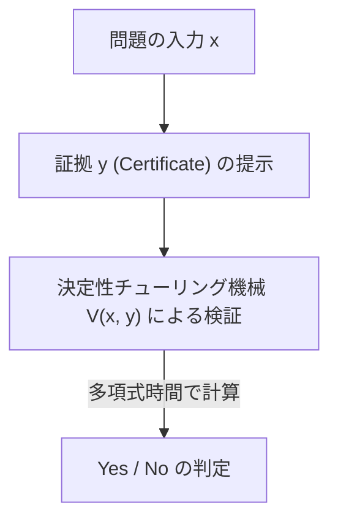
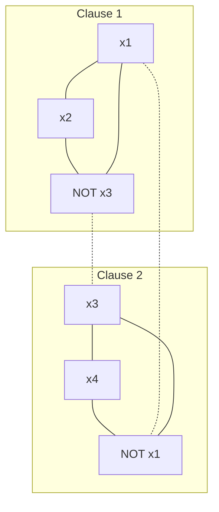

В современной математике и информатике существует самая известная и самая важная нерешенная проблема. Это «Проблема P против NP» (P vs NP Problem). Эта проблема, являющаяся одной из Задач тысячелетия Математического института Клэя, за решение которой назначена награда в 1 миллион долларов, — не просто интеллектуальная головоломка или способ убить время для математиков.

Это фундаментальная тема, напрямую связанная с безопасностью интернета, на который опирается наше общество, оптимизацией логистики и сетей, предсказанием структуры белков в фармакологии, оптимизацией обучающих моделей ИИ, а также с такими философскими вопросами, как «что такое человеческое творчество?» и «можно ли автоматизировать доказательство математических теорем?».

В этой статье мы полностью разберем проблему P против NP, начав с основ теории сложности вычислений (Computational Complexity Theory), открытия NP-полноты с помощью теоремы Кука-Левина, точной классификации классов сложности, трех огромных барьеров (релятивизация, естественные доказательства, алгебризация), препятствующих доказательству, новейших подходов геометрической теории сложности (GCT), связи с квантовым классом сложности (BQP) и вплоть до реализации практического SAT-решателя на Python. Через это подробное объяснение на десятки тысяч символов давайте прикоснемся к безднам теории сложности вычислений.

## Глава 1: Зарождение теории сложности вычислений и основы машины Тьюринга

Чтобы точно понять проблему P против NP, необходимо сначала строго математически определить, что такое «вычисление» и что такое «эффективное вычисление». В 1930-х годах, в качестве отрицательного ответа на «Проблему разрешения» (Entscheidungsproblem), выдвинутую Давидом Гильбертом, Алан Тьюринг изобрел абстрактную вычислительную модель — «Машину Тьюринга» (Turing Machine), чтобы математически сформулировать понятие «вычислимого». Наряду с лямбда-исчислением Алонзо Чёрча, эта концепция машины Тьюринга в виде «Тезиса Чёрча-Тьюринга» стала краеугольным камнем современной информатики.

### Детерминированная машина Тьюринга (DTM) и класс P
Детерминированная машина Тьюринга (Deterministic Turing Machine: DTM) состоит из одномерной ленты бесконечной длины, головки, читающей и записывающей на эту ленту, и управляющего устройства с конечным числом состояний. Когда считывается определенное состояние и символ на ленте, следующее действие машины (записываемый символ, направление движения головки, следующее состояние) всегда определяется однозначно.

Строго говоря, функция перехода $\delta$ для DTM определяется следующим образом:
$$ \delta: Q \times \Gamma \to Q \times \Gamma \times \{L, R\} $$
Здесь $Q$ — конечное множество состояний, $\Gamma$ — конечное множество символов ленты (включая пустой символ), а $L, R$ — направление движения головки (влево, вправо). Поскольку переход состояний для данного входа описывает единственную траекторию (Deterministic Path), она называется «детерминированной».

**Класс P (Polynomial-time)** — это множество задач разрешения (задач с ответом Да/Нет), которые могут быть решены с помощью этой DTM за полиномиальное время $\mathcal{O}(n^k)$ (где $k$ — константа) относительно размера входа $n$. На практике проблемы, принадлежащие P, считаются «эффективно решаемыми проблемами» (тезис Кобэма). К ним относятся, например, сортировка списков, поиск кратчайшего пути (алгоритм Дейкстры), алгоритм нахождения наибольшего общего делителя двух чисел (алгоритм Евклида) и даже проверка на простоту (алгоритм AKS).

### Недетерминированная машина Тьюринга (NTM) и класс NP
С другой стороны, недетерминированная машина Тьюринга (Nondeterministic Turing Machine: NTM) — это виртуальная машина, в которой для определенного состояния и входа существует несколько вариантов следующего действия, и она может исследовать их все «одновременно параллельно (или всегда божественным образом выбирая ветвь, ведущую к правильному ответу)».

Строгая формулировка функции перехода $\delta$ для NTM выглядит так:
$$ \delta: Q \times \Gamma \to \mathcal{P}(Q \times \Gamma \times \{L, R\}) $$
Здесь $\mathcal{P}(X)$ обозначает булеан (множество всех подмножеств) множества $X$. То есть для состояния $q \in Q$ и символа ленты $a \in \Gamma$, множество возможных следующих действий задается как $\delta(q, a)$, и машина может выбрать любое из этих действий. Процесс вычисления NTM представляет собой не единственный путь, а образует ветвящуюся древовидную структуру (дерево вычислений, Computation Tree). Если хотя бы один путь в дереве вычислений достигает допускающего состояния (состояния Да), считается, что NTM «допустила» (accepted) этот вход.

#### Математический механизм экспоненциального взрыва при детерминированном моделировании
Что произойдет с временем вычисления, если попытаться смоделировать работу NTM с помощью DTM? Пусть максимальное количество ветвлений функции перехода NTM равно $b$ (например, $b=2$), и предположим, что она останавливается за полиномиальное время $p(n)$ относительно размера входа $n$. Поскольку глубина дерева вычислений равна $p(n)$, количество листьев (Leaf) на самом нижнем уровне дерева составит максимум $b^{p(n)}$.
Если DTM исследует все это дерево вычислений (например, используя поиск в ширину или в глубину), требуемое количество шагов составит $\mathcal{O}(b^{p(n)})$, что растет экспоненциально (Exponentially) относительно размера входа $n$. Это и есть фундаментальная математическая причина, по которой интуитивно считается, что P $\neq$ NP. Считается, что при последовательных детерминированных вычислениях приходится платить колоссальные временные и пространственные затраты, чтобы угнаться за мощью «параллельного ветвления» недетерминированности.

**Класс NP (Nondeterministic Polynomial-time)** — это множество задач разрешения, решаемых NTM за полиномиальное время. Однако в качестве более интуитивного и практичного определения можно перефразировать это как множество задач, для которых «когда дан ответ 'Да', правильность его доказательства (Certificate или Witness) можно проверить с помощью DTM за полиномиальное время».


（※ ここでのパイプや特殊記号を避けた記述としています。）

Например, для версии задачи коммивояжера в виде задачи разрешения («Существует ли маршрут, проходящий через все города ровно один раз, с расстоянием не более $K$?») если такой маршрут (доказательство $y$) дарован нам богом или волшебником, достаточно просто просуммировать общее расстояние и проверить, что оно не превышает $K$, что легко проверяется за полиномиальное время. Следовательно, эта задача принадлежит классу NP.

## Глава 2: Теорема Кука-Левина и рассвет NP-полноты

Проблема P против NP (т.е. P = NP?) — это очень естественный вопрос: «Легко ли найти ответ, если его легко проверить?». Интуитивно кажется, что найти ответ гораздо сложнее (P $\neq$ NP), но математически доказать это чрезвычайно трудно.

### Задача выполнимости булевых формул (SAT)
Революцию в эту дискуссию принесли независимые исследования Стивена Кука (Stephen Cook) в 1971 году и Леонида Левина (Leonid Levin) в 1973 году. Они обратили внимание на «Задачу выполнимости булевых формул (SAT: Boolean Satisfiability Problem)», которая спрашивает, существует ли такое присваивание переменных, которое делает истинной логическую формулу пропозициональной логики.

### Теорема Кука-Левина (Cook-Levin Theorem)
«SAT — одна из самых сложных задач среди всех, принадлежащих классу NP» — это суть теоремы Кука-Левина. Они доказали, что любую NP-задачу можно преобразовать (свести) к SAT за полиномиальное время.

**Сведение за полиномиальное время (Polynomial-time Reduction, Karp Reduction)** означает, что вход $x$ задачи $A$ может быть преобразован во вход $y = f(x)$ задачи $B$ с помощью функции $f$, вычислимой за полиномиальное время, и выполняется $x \in A \iff f(x) \in B$ (записывается как $A \le_p B$).

Кук и Левин точно выразили вычисления (состояния, содержимое ленты, положение головки) любой NTM за полиномиальное время в виде огромной логической формулы (булевой формулы). В частности, они ввели пропозициональные переменные (Boolean variables) такие как «в момент времени $t$ в $i$-й ячейке ленты находится символ $a$», «в момент времени $t$ машина находится в состоянии $q$», «в момент времени $t$ головка находится в позиции $i$». То, что эти переменные правильно следуют локальным правилам перехода $\delta$ машины Тьюринга, описывается в виде ограничений (дизъюнктов, состоящих из AND/OR/NOT).
Поскольку время выполнения составляет $p(n)$, количество необходимых переменных ограничено примерно $\mathcal{O}(p(n)^2)$, и в целом генерируется логическая формула полиномиального размера. Если для некоторого входа существует последовательность переходов (доказательство), при которой NTM достигает «допускающего (Да)» состояния, соответствующая логическая формула становится выполнимой. Этим доказательством было показано, что если существует алгоритм, решающий SAT за полиномиальное время, то все NP-задачи могут быть решены за полиномиальное время (P = NP).

Такие задачи, которые «принадлежат NP и к которым можно за полиномиальное время свести все NP-задачи», называются **NP-полными (NP-complete)**. SAT стала первой обнаруженной в истории NP-полной задачей.

### Сведение от 3-SAT к задаче о максимальном независимом множестве (MIS) и вершинном покрытии (Vertex Cover): строгое доказательство

В 1972 году Ричард Карп (Richard Karp), взяв за отправную точку NP-полноту SAT, доказал, что 21 известная задача теории графов и комбинаторной оптимизации являются NP-полными. Здесь мы развернем пошаговое строгое математическое доказательство сведения за полиномиальное время от «3-SAT» к «задаче о максимальном независимом множестве (Maximum Independent Set: MIS)» и «задаче о вершинном покрытии (Vertex Cover)», которые обязательно рассматриваются в курсах по теории сложности вычислений.

**Определение проблем:**
- **3-SAT**: Если дана логическая формула $\phi$ в конъюнктивной нормальной форме (CNF), где каждый дизъюнкт (Clause) состоит ровно из дизъюнкции (OR) 3-х литералов (переменная или ее отрицание), существует ли присваивание переменных, делающее $\phi$ истинной?
  $\phi = (l_{11} \lor l_{12} \lor l_{13}) \land (l_{21} \lor l_{22} \lor l_{23}) \land \dots \land (l_{m1} \lor l_{m2} \lor l_{m3})$
- **Максимальное независимое множество (MIS)**: Если дан неориентированный граф $G=(V, E)$ и целое число $k$, существует ли множество не смежных (не соединенных ребрами) друг с другом вершин $S \subseteq V$, размер которого $|S| \ge k$?
- **Вершинное покрытие (Vertex Cover)**: Если дан неориентированный граф $G=(V, E)$ и целое число $k'$, существует ли множество $C \subseteq V$ размера $|C| \le k'$, такое что для всех ребер $e \in E$ по крайней мере один из их концов принадлежит $C$?

**Построение функции сведения $f$: 3-SAT $\to$ MIS**
Когда на вход подается формула $\phi$ для 3-SAT (количество дизъюнктов $m$), граф $G=(V, E)$ и целевой размер $k$ строятся следующим образом.

1. **Построение вершин (V):**
   Для каждого литерала в каждом дизъюнкте $C_i = (l_{i1} \lor l_{i2} \lor l_{i3})$ создаются 3 независимые вершины. Таким образом, общее количество вершин строго равно $|V| = 3m$.
   $V = \{ v_{ij} : 1 \le i \le m, 1 \le j \le 3 \}$

2. **Построение ребер (E):**
   Ребра проводятся по следующим двум правилам:
   - **Внутренние ребра (Triangle edges):** 3 вершины, принадлежащие одному и тому же дизъюнкту, соединяются друг с другом. То есть для каждого дизъюнкта формируется треугольник (клика размера 3).
     $E_{\text{inner}} = \{ (v_{i1}, v_{i2}), (v_{i2}, v_{i3}), (v_{i3}, v_{i1}) : 1 \le i \le m \}$
   - **Ребра противоречия (Conflict edges):** Проводятся ребра между вершинами, соответствующими логически противоречивым литералам (например, $x$ и $\lnot x$).
     $E_{\text{conflict}} = \{ (v_{ij}, v_{pq}) : l_{ij} = \lnot l_{pq} \}$
   Общее множество ребер составляет $E = E_{\text{inner}} \cup E_{\text{conflict}}$.

3. **Установка целевого размера $k$:**
   Полагаем $k = m$ (количество дизъюнктов). Это построение графа очевидно завершается за полиномиальное время $\mathcal{O}(m^2)$.

**Доказательство корректности ($x \in \text{3-SAT} \iff f(x) \in \text{MIS}$):**

**[Доказательство $\Rightarrow$ (Если выполнимо, существует независимое множество размера $m$)]**
Предположим, что $\phi$ выполнима. То есть существует присваивание переменных, делающее $\phi$ истинной. При таком присваивании каждый дизъюнкт $C_i$ имеет хотя бы один истинный (True) литерал.
Из каждого дизъюнкта выберем «ровно одну» вершину, соответствующую истинному литералу, и назовем это множество $S$. Размер $S$ очевидно равен $|S| = m = k$.
Докажем от противного, что $S$ является независимым множеством. Предположим, что между двумя вершинами в $S$ существует ребро.
- В случае внутреннего ребра: это означало бы, что мы выбрали 2 вершины из одного дизъюнкта, что противоречит процедуре построения, где мы выбирали только одну из каждого дизъюнкта.
- В случае ребра противоречия: это означало бы, что для некоторой переменной $x$ мы выбрали вершины, соответствующие и $x$, и $\lnot x$. Однако это означает, что и $x$, и $\lnot x$ являются истинными, что невозможно для присваивания переменных, и приводит к противоречию.
Следовательно, между любыми двумя вершинами в $S$ не существует ребра, и $S$ является независимым множеством размера $m$.

**[Доказательство $\Leftarrow$ (Если существует независимое множество размера $m$, то выполнимо)]**
Предположим, что в графе $G$ существует независимое множество $S$ размера $m$.
Из-за структуры графа 3 вершины, принадлежащие одному дизъюнкту, образуют треугольник (клику), поэтому независимое множество $S$ может включать не более одной вершины из одного дизъюнкта.
Поскольку общее количество вершин равно $3m$, количество дизъюнктов равно $m$, а $|S|=m$, по принципу Дирихле (Pigeonhole principle), $S$ должно содержать «ровно одну вершину из каждого дизъюнкта».
Рассмотрим присваивание переменных, которое делает истинными (True) все литералы, соответствующие вершинам, включенным в $S$. Поскольку ребер противоречия не существует ($S$ является независимым множеством), не может быть так, чтобы и некоторая переменная $x$, и $\lnot x$ были присвоены истине. Переменным, не включенным в $S$, присваиваются любые значения.
При таком присваивании выбранный литерал в каждом дизъюнкте становится истинным, поэтому вся логическая формула $\phi$ становится выполнимой.

**Графическая иллюстрация**
Для случая $\phi = (x_1 \lor x_2 \lor \lnot x_3) \land (\lnot x_1 \lor x_3 \lor x_4)$

(Сплошные линии представляют внутренние ребра, пунктирные — ребра противоречия. Если удастся выбрать по одной вершине из каждого подграфа так, чтобы они не были соединены ребрами друг с другом, MIS будет достигнуто.)

**Сведение от MIS к вершинному покрытию (Vertex Cover)**
Кроме того, благодаря прекрасной двойственности в теории графов, сведение от MIS к вершинному покрытию на удивление просто.
Теорема: «В графе $G=(V, E)$ подмножество $S \subseteq V$ является независимым множеством тогда и только тогда, когда его дополнение $V \setminus S$ является вершинным покрытием.»
Доказательство: Пусть $S$ — независимое множество. Для любого ребра $e = (u, v) \in E$, $u$ и $v$ не могут одновременно принадлежать $S$ (определение независимого множества). Следовательно, хотя бы один из концов $u, v$ принадлежит $V \setminus S$. Это означает, что $V \setminus S$ покрывает все ребра и удовлетворяет определению вершинного покрытия. Обратное доказывается совершенно аналогично.
Таким образом, проблема о том, существует ли MIS целевого размера $k$, сводится за полиномиальное время к проблеме о том, существует ли вершинное покрытие целевого размера $k' = |V| - k$.

С помощью этих сведений стала очевидной математическая структура, по которой NP-полнота передается от 3-SAT к MIS, а затем к Vertex Cover.

## Глава 3: NP-промежуточные проблемы и удар от квантового класса сложности (BQP)

Если P $\neq$ NP, существуют ли проблемы «промежуточной» сложности, которые принадлежат NP, но не являются ни P, ни NP-полными?

### Теорема Ладнера (Ladner's Theorem)
В 1975 году Ричард Ладнер доказал **теорему Ладнера**, которая гласит: «Если P $\neq$ NP, то обязательно существуют задачи, которые принадлежат NP, но не принадлежат ни P, ни NP-полным (NP-промежуточные задачи, NP-intermediate problems)».
Доказательство Ладнера основывалось на построении искусственного языка с использованием диагонального аргумента, но и среди проблем, с которыми мы сталкиваемся в реальности, есть несколько, которые сильно подозреваются в том, что они NP-промежуточные. Например, проблема изоморфизма графов (Graph Isomorphism).

### Факторизация целых чисел и алгоритм Шора
Еще один огромный фронтир — это «факторизация целых чисел», которая является основой теории криптографии. Проблема разрешения факторизации («Имеет ли целое число $N$ нетривиальный простой делитель $\le k$?») принадлежит NP, но считается, что она не является NP-полной (поскольку существуют сильные теоретические доказательства того, что если бы она была NP-полной, это привело бы к коллапсу иерархии классов сложности, известной как полиномиальная иерархия).

Здесь революцию в теорию сложности вычислений принесли квантовые компьютеры.
В 1994 году Питер Шор (Peter Shor) показал, что с помощью квантового компьютера факторизация целых чисел может быть решена за полиномиальное время (**алгоритм Шора**). Задача, на решение которой классическими алгоритмами в лучшем случае требуется субэкспоненциальное время (например, общий метод решета числового поля), при квантовых вычислениях решается за время около $\mathcal{O}((\log N)^3)$.

### Отношение включения между квантовым классом сложности BQP и P, NP
Для формализации этого был введен класс сложности **BQP (Bounded-error Quantum Polynomial-time)**. BQP — это класс задач разрешения, которые могут быть решены с помощью квантовой машины Тьюринга (или модели квантовых схем) за полиномиальное время с вероятностью ошибки 1/3 или меньше.

Ожидается, что отношения с классическими классами вычислений выглядят следующим образом:
1. $P \subseteq BQP$ (То, что эффективно решается на классических компьютерах, решается и на квантовых)
2. $BQP \not\subseteq NP$ (BQP может включать задачи, не принадлежащие NP)
3. $NP \not\subseteq BQP$ (Даже с помощью квантовых компьютеров NP-полные задачи нельзя решить эффективно)

**Почему алгоритм Шора не решает саму проблему P против NP**
В новостях для широкой публики часто возникает заблуждение, что «когда будет создан квантовый компьютер, все вычислительные задачи (NP-задачи) будут решаться мгновенно», но с точки зрения теории сложности вычислений это неверно.
Алгоритм Шора классифицировал факторизацию целых чисел (и проблему дискретного логарифмирования) как BQP. Однако, как упоминалось выше, факторизация не является NP-полной задачей.
Если бы алгоритм Шора решал «SAT (NP-полную задачу)» за полиномиальное время, это означало бы, что «квантовые компьютеры могут эффективно решать все NP-задачи ($NP \subseteq BQP$)», что стало бы грандиозным событием, поколебавшим бы основы системы P против NP.
Однако доказано, что даже с использованием возможностей квантовых компьютеров (суперпозиции и квантовой интерференции) экспоненциальное пространство поиска для решения NP-полных задач невозможно сжать до полиномиального времени. Даже использование алгоритма Гровера (Grover's Algorithm) обеспечивает в лучшем случае лишь квадратичное ускорение (для пространства поиска $N$: $\mathcal{O}(N) \to \mathcal{O}(\sqrt{N})$, во временной сложности: $\mathcal{O}(2^n) \to \mathcal{O}(2^{n/2})$) (Bennett, Bernstein, Brassard, Vazirani, 1997).
Следовательно, даже если квантовые компьютеры станут практически применимыми, фундаментальная сложность проблемы P против NP (особенно эффективные методы решения NP-полных задач) решена не будет — таков твердый консенсус современной теоретической информатики.

## Глава 4: Почему проблему P против NP невозможно решить? 3 главных барьера

На протяжении более полувека гениальные математики со всего мира пытались решить проблему P против NP и терпели неудачу. И дело не просто в нехватке человеческого ума. Было «мета-доказано», что самим нынешним математическим рамкам (методам доказательства) не хватает возможностей для решения этой проблемы. Это три огромных барьера в теории сложности вычислений.

### 1. Барьер релятивизации (Relativization Barrier) и теорема Бейкера-Гилла-Соловэя
В 1975 году Теодор Бейкер, Джон Гилл и Роберт Соловэй использовали концепцию «оракула». Оракул $A$ — это виртуальный черный ящик, который мгновенно (за 1 шаг) сообщает ответ на некоторую проблему $A$. Машина Тьюринга с добавленной функцией запроса к этому оракулу называется машиной Тьюринга с оракулом.

Они шокировали теорию сложности вычислений, доказав, что для одного оракула выполняется P=NP, а для другого — P≠NP.

**Полный эскиз доказательства теоремы Бейкера-Гилла-Соловэя**

**Теорема: Существуют оракулы $A$ и $B$, удовлетворяющие следующим свойствам.**
1. $P^A = NP^A$
2. $P^B \neq NP^B$

**[ Построение оракула $A$, для которого $P^A = NP^A$ ]**
В качестве оракула $A$ мы выбираем PSPACE-полную проблему, а именно «TQBF (True Quantified Boolean Formula)».
Детерминированная машина с полиномиальным временем работы, имеющая оракул $A$ ($P^A$), может решить любую задачу из PSPACE за полиномиальное время. Это связано с тем, что любая задача из PSPACE сводится к TQBF за полиномиальное время, и ответ можно получить за один запрос к оракулу. То есть $P^A = \text{PSPACE}$.
С другой стороны, недетерминированная машина с полиномиальным временем работы, имеющая оракул $A$ ($NP^A$), даже используя возможности оракула, за полиномиальное время может исследовать пространство только полиномиального размера, поэтому $NP^A \subseteq \text{NPSPACE}$. По фундаментальной теореме теории сложности вычислений, теореме Сэвича (Savitch's Theorem), поскольку $\text{NPSPACE} = \text{PSPACE}$, выполняется $NP^A \subseteq \text{PSPACE}$.
Естественно, $P^A \subseteq NP^A$, поэтому, объединяя это, мы получаем, что $P^A = NP^A = \text{PSPACE}$ истинно.

**[ Построение оракула $B$, для которого $P^B \neq NP^B$ ]**
Пусть $B$ — некоторый язык (множество строк), и определим следующий язык $L_B$ относительно оракула $B$:
$L_B = \{ 1^n : \text{в } B \text{ существует некая строка } x \text{ длины } n \}$
Очевидно, что $L_B \in NP^B$. Это связано с тем, что NTM для входа $1^n$ может недетерминированно угадать (сгенерировать) строку $x$ длины $n$ и за 1 шаг проверить ее, запросив у оракула $B$, является ли $x \in B$.
Далее мы рекурсивно построим содержимое оракула $B$ с помощью диагонализации (Diagonalization) таким образом, чтобы $L_B \notin P^B$.
Перечислим все детерминированные полиномиальные машины с оракулами как $M_1, M_2, \dots, M_i, \dots$. Предположим, что время выполнения каждой $M_i$ ограничено полиномом $p_i(n)$.
На шаге $i$ выбирается достаточно большая длина строки $n$ (резко увеличивается так, чтобы $2^n > p_i(n)$).
Моделируем выполнение $M_i$, подав ей на вход $1^n$. Во время выполнения $M_i$ делает максимум $p_i(n)$ запросов к оракулу относительно строк.
Поскольку общее количество строк длины $n$ равно $2^n$, а $2^n > p_i(n)$, обязательно существует строка $y$ длины $n$, о которой $M_i$ «ни разу не запросила» оракула.
- Если $M_i(1^n)$ в конечном итоге выводит «допустить (1)», мы решаем вообще не включать строки длины $n$ в $B$ (сделать его пустым множеством). В результате $1^n \notin L_B$, и вывод $M_i$ оказывается ошибочным.
- Если $M_i(1^n)$ в конечном итоге выводит «отклонить (0)», мы добавляем ранее не запрошенную строку $y$ в $B$. В результате $1^n \in L_B$, и снова вывод $M_i$ оказывается ошибочным.
В оракуле $B$, построенном бесконечным повторением этого процесса для всех машин, ни одна DTM не сможет правильно распознать язык $L_B$, следовательно $L_B \notin P^B$. Таким образом, $P^B \neq NP^B$.

**Смысл барьера релятивизации**
Ужасающий вывод этой теоремы заключается в том, что «методы доказательства, не зависящие от существования оракула (релятивизирующие, Relativizing), такие как диагонализация или симуляция состояний, никогда не смогут решить проблему P против NP». Причина в том, что если бы с помощью этого метода можно было доказать P=NP, то это доказательство работало бы и в мире оракула $B$, что привело бы к противоречию.

### 2. Барьер естественных доказательств (Natural Proofs Barrier)
Чтобы преодолеть барьер релятивизации, теоретики перешли от работы с машинами Тьюринга к подходам, доказывающим нижние оценки размера «булевых схем (Boolean Circuits)», состоящих из логических вентилей (AND, OR, NOT) (доказательства нижних оценок для класса P/poly).
Однако в 1994 году Александр Разборов и Стивен Рудич предложили концепцию «Естественных доказательств (Natural Proofs)».
Они указали на то, что большинство методов доказательства нижних оценок схем того времени основывались на выделении «естественных свойств», удовлетворяющих характеристикам «конструктивности (Constructivity)» и «масштабности (Largeness)». И они математически доказали, что если существуют односторонние функции (если возможна криптография), то доказать нижние оценки для сильных классов сложности с помощью таких «естественных доказательств» невозможно.
То есть, существующие комбинаторные методы, пытающиеся доказать P $\neq$ NP, по иронии судьбы оказались в парадоксальной ситуации: они перестают работать, если мы предполагаем P $\neq$ NP (в его сильной форме — существование криптографии).

### 3. Барьер алгебризации (Algebrization Barrier)
Чтобы избежать барьеров релятивизации и естественных доказательств, в 1990-х годах развивались методы «Интерактивных систем доказательств (Interactive Proofs)» и «Арифметизации (Arithmetization)». С их помощью были доказаны такие эпохальные теоремы, как IP = PSPACE.
Однако в 2008 году Скотт Ааронсон и Ави Вигдерсон показали, что эти методы в конечном итоге зависят от операции «алгебризации (Algebrization)», которая расширяет полиномы над конечными полями. И они доказали, что методы, использующие алгебризацию, не могут решить проблему P против NP (или разделить многие другие классы сложности).

Из-за этих трех барьеров в теоретической информатике стало общепринятым мнение: «Для решения проблемы P против NP требуется математика совершенно новой парадигмы».

## Глава 5: Практика. Математика и реализация SAT-решателя на Python

Пока вопрос P=NP остается нерешенным, в реальном индустриальном мире огромные SAT-задачи (NP-полные проблемы) с миллионами переменных быстро решаются каждый день. Это происходит потому, что, хотя в худшем случае время вычислений является экспоненциальным, многие практические проблемы (проверка оборудования, разрешение зависимостей и т.д.) имеют сильную «структуру». Здесь мы рассмотрим конкретные алгоритмы и реализацию на Python SAT-решателя, который является основой теории P против NP.

### Алгоритм DPLL и математика возврата (бэктрекинга)
Алгоритм DPLL (Davis-Putnam-Logemann-Loveland) основан на поиске в глубину (с возвратом) и использует характеристики логических формул для резкого сокращения пространства поиска.

Существует два ключевых математических момента:
1. **Распространение единицы (Unit Propagation / Boolean Constraint Propagation):** Когда в дизъюнкте остается только один неприсвоенный литерал (Unit Clause), чтобы сделать этот дизъюнкт истинным, единственным выбором является сделать этот литерал истинным. Это принудительное присваивание вызывает цепную реакцию единичных распространений в других дизъюнктах и значительно обрезает дерево поиска.
2. **Исключение чистых литералов (Pure Literal Elimination):** Когда некоторая переменная во всей логической формуле всегда появляется только в утвердительной (или только в отрицательной) форме, присвоение этому литералу значения "истина" не окажет негативного влияния на выполнимость других дизъюнктов.

Ниже приведен простой и образовательный пример кода алгоритма DPLL на Python.

```python
def dpll(clauses, assignment):
    # ベースケース1: すべての節が満たされ、リストが空になった場合 -> 充足可能 (SAT)
    if len(clauses) == 0:
        return True, assignment
    
    # ベースケース2: 矛盾（空の節）が存在する場合 -> 充足不能 (UNSAT)
    if any(len(c) == 0 for c in clauses):
        return False, {}
    
    # 単位伝播 (Unit Propagation) の適用
    unit_clauses = [c for c in clauses if len(c) == 1]
    if unit_clauses:
        unit = unit_clauses[0][0]
        new_clauses = []
        for c in clauses:
            if unit in c:
                continue # この節は真になったので削除
            if -unit in c:
                # 矛盾するリテラルを取り除く
                new_clause = [l for l in c if l != -unit]
                new_clauses.append(new_clause)
            else:
                new_clauses.append(c)
        assignment[abs(unit)] = (unit > 0)
        return dpll(new_clauses, assignment)
    
    # 分岐 (Branching): ヒューリスティックに変数を選択
    # ここでは単純に最初の節の最初のリテラルを選択
    literal = clauses[0][0]
    
    # 変数をTrueと仮定して探索
    res, final_assign = dpll(clauses + [[literal]], assignment.copy())
    if res:
        return True, final_assign
        
    # 上の分岐で失敗した場合、変数をFalseと仮定して探索 (バックトラック)
    return dpll(clauses + [[-literal]], assignment.copy())

# 実行例: (x1 OR NOT x2) AND (NOT x1 OR x2 OR x3) AND (NOT x3)
# 1: x1, 2: x2, 3: x3 (負の数はNOTを表す)
cnf_formula = [[1, -2], [-1, 2, 3], [-3]]
is_sat, solution = dpll(cnf_formula, {})

print(f"Satisfiable: {is_sat}")
print(f"Assignment: {solution}")
# 期待される出力:
# Satisfiable: True
# Assignment: {3: False, 1: False, 2: False} (あるいは他の充足解)
```

### Эволюция к алгоритму CDCL (Conflict-Driven Clause Learning)
Современные передовые SAT-решатели (MiniSat, Glucose и др.) используют алгоритм **CDCL (Conflict-Driven Clause Learning)**, который значительно расширяет DPLL.

Инновационность CDCL заключается в том, что он «учится на ошибках». При возникновении противоречия (Conflict) во время поиска вместо того, чтобы просто вернуться на 1 шаг назад (Chronological backtracking), он строит граф импликаций (Implication Graph) и анализирует комбинацию переменных, ставших первопричиной противоречия. Вычисляя разрез на графе, называемый UIP (Unique Implication Point), он преобразует причину противоречия в форму логической формулы и добавляет ее к исходной формуле в качестве нового «изученного дизъюнкта (Learned Clause)».
Благодаря этому реализуется возврат в нехронологическом порядке (Non-chronological backtracking / Backjumping), который «гарантирует, что та же ошибка из прошлого не повторится на другой ветви дерева поиска», тем самым резко обрезая экспоненциальное дерево поиска. Кроме того, в сочетании с динамическими эвристиками выбора переменных, такими как VSIDS (Variable State Independent Decaying Sum), и периодическими перезапусками (Restarts), CDCL царит как вершина человеческой эвристики для NP-полных проблем.

## Глава 6: Современные подходы и геометрическая теория сложности (GCT)

Сталкиваясь с барьерами, с помощью каких подходов современные теоретики пытаются решить проблему P против NP?

### Геометрическая теория сложности (Geometric Complexity Theory: GCT)
В 2001 году Кетан Мулмулей и Милинд Сохони предложили грандиозную программу «Геометрическая теория сложности (GCT)», использующую алгебраическую геометрию и теорию представлений.
Основная идея GCT заключается в сведении разделения классов сложности к проблеме геометрических отношений включения в некотором пространстве полиномов (замыкания орбит).

В частности, внимание уделяется различию в симметрии перманента (Permanent, принадлежит классу #P-полных и его вычисление сложно) и детерминанта (Determinant, вычислим за полиномиальное время). Эти многочлены рассматриваются как геометрические орбиты под действием общей линейной группы, и с помощью теории представлений (полиномы Шура и кратности неприводимых представлений) пытаются показать, что «замыкание орбиты перманента нельзя вложить в замыкание орбиты детерминанта».
Считается, что GCT обладает свойствами, позволяющими избежать барьеров естественных доказательств и алгебризации, и возлагаются большие надежды на возможность мобилизации глубоких теорем из других областей математики (алгебраическая геометрия, теория представлений, теория инвариантов). Однако это очень продвинутая и трудная для понимания теория, которая все еще находится на полпути.

### Нижние оценки схем и графы-экспандеры
В качестве другого направления продвигаются исследования в области «Дерандомизации (Derandomization)», моделирующие случайность вычислений (BPP) с помощью детерминированных алгоритмов (P). Теория генераторов псевдослучайных чисел, таких как графы-экспандеры и экстракторы (Extractor), глубоко связана с доказательством нижних оценок схем (парадигма Hardness vs. Randomness), и порождает богатые результаты, такие как «если доказать строгие нижние оценки схем, то можно показать P = BPP». Считается, что эти достижения в долгосрочной перспективе также послужат ступеньками к доказательству P $\neq$ NP.

## Глава 7: Философское и технологическое влияние решения P=NP (или P≠NP) на мир

Если проблема P против NP будет решена, что станет с нашим обществом? Многие эксперты верят в P $\neq$ NP, но если вдруг будет доказано, что P = NP, и более того, будет найден практический алгоритм полиномиального времени (например, $\mathcal{O}(n^2)$ или $\mathcal{O}(n^3)$), мир изменится радикально и пугающе.

### Крах криптографии с открытым ключом
Современная инфраструктура безопасности интернета, такая как криптография RSA и криптография на эллиптических кривых, основывается на предположении (точнее, на существовании односторонних функций), что «факторизация целых чисел и проблема дискретного логарифмирования не могут быть решены за полиномиальное время». Если P = NP, то «доказательство», восстанавливающее открытый текст из зашифрованного текста, можно будет найти за полиномиальное время, поэтому криптография будет нейтрализована, а конфиденциальность цифровых коммуникаций и безопасные финансовые транзакции рухнут в одно мгновение.

### Конец оптимизации и науки (и абсолютная автоматизация)
Но есть и положительная сторона. Любые задачи оптимизации, сформулированные как NP-полные проблемы — логистика (задача коммивояжера), предсказание структуры сворачивания белков, проектирование схем полупроводников, поиск оптимальных весов ИИ — смогут мгновенно получать оптимальные решения. Это будет иметь эффект пропуска сотен лет технологической эволюции человечества: от решения проблемы изменения климата до полностью автоматизированного проектирования новых лекарств.

### Письмо Гёделя и человеческое творчество
В 1956 году Курт Гёдель в письме, адресованном Джону фон Нейману, написал нечто, по существу предвидящее проблему P против NP. Гёдель писал, что если доказательство теоремы (поиск доказательства длины $n$) возможно за полиномиальное время, то «работа математика может быть полностью заменена машиной».
Если «проверка доказательства (P)» и «озарение доказательства (NP)» эквивалентны, то «человеческое творчество» — такое как художественное вдохновение, математическая интуиция и вспышки гениальности — является всего лишь алгоритмом полиномиального времени.

## Заключение: Вглядываясь в бездну

Проблема P против NP — это не просто вопрос о времени выполнения алгоритмов. Это фундаментальный вопрос к интеллекту: «Существует ли принципиальная разница между нахождением ответа и его пониманием?».

И сегодня математики и информатики со всего мира продолжают бросать вызов этой проблеме. Для завершения доказательства потребуются совершенно новые математические концепции, превосходящие наше воображение, чтобы разрушить такие прочные барьеры, как оракулы, естественные доказательства и алгебризация.

Наступит ли день, когда тайна, стоящая на вершине Задач тысячелетия, будет раскрыта, или, подобно теоремам Гёделя о неполноте, будет доказано, что она «недоказуема», как независимое утверждение? Путешествие, бросающее вызов пределам человеческих знаний, будет продолжаться.
