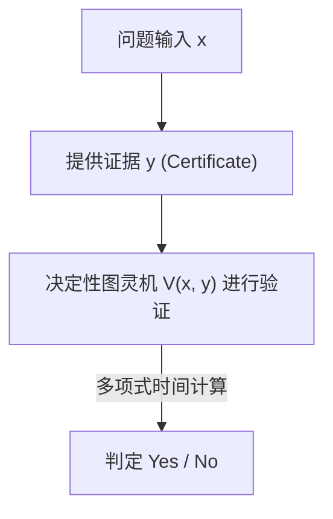
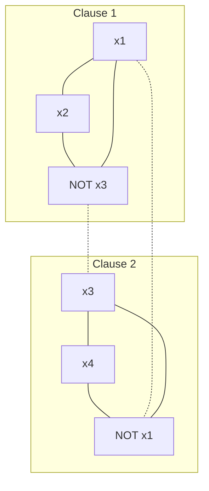

在现代数学和计算机科学中，存在着一个最著名且最重要的未解问题。那就是“P对NP问题（P vs NP Problem）”。作为克雷数学研究所设立的千禧年大奖难题之一，它悬赏了100万美元，但这个问题绝不仅仅是单纯的智力拼图或是数学家们用来打发时间的玩意儿。

它是极其根本的主题，直接关系到支撑我们社会的互联网安全、物流与网络的优化、新药研发中的蛋白质结构预测、AI学习模型的优化，甚至触及“人类的创造力究竟是什么”“数学定理的证明能否自动化”这样的哲学层面。

在本文中，我们将从计算复杂性理论（Computational Complexity Theory）的基础开始，涵盖通过库克-莱文定理发现NP完全性、计算复杂性类的精密分类、阻碍证明的3个巨大障碍（相对化、自然证明、代数化）、最新的几何计算复杂性理论（GCT）方法、与量子计算复杂性类（BQP）的关系，甚至深入到实用的SAT求解器的Python实现，全面解剖P对NP问题。通过这篇长达数万字的详细解说，让我们一起触摸计算复杂性理论的深渊吧。

## 第一章：计算复杂性理论的诞生与图灵机基础

为了准确理解P对NP问题，首先必须对“什么是计算”、“什么是高效的计算”进行严格的数学定义。20世纪30年代，作为对大卫·希尔伯特提出的“判定问题（Entscheidungsproblem）”的否定解答，阿兰·图灵为了将“可计算的事物”在数学上形式化，构想了一种抽象的计算模型——“图灵机（Turing Machine）”。与阿隆佐·邱奇的λ演算并列，这种图灵机的概念作为“邱奇-图灵论题”，成为了现代计算机科学的基石。

### 确定性图灵机 (DTM) 与P类
确定性图灵机（Deterministic Turing Machine: DTM）由一条具有无限长度的一维纸带、一个读写该纸带的读写头，以及一个拥有有限个状态的控制部组成。当读取到某个状态和纸带上的符号时，机器下一步应采取的动作（写入的符号、读写头的移动方向、下一个状态）总是唯一决定的。

更严格地说，DTM的转移函数 $\delta$ 定义如下：
$$ \delta: Q \times \Gamma \to Q \times \Gamma \times \{L, R\} $$
在这里，$Q$ 是状态的有限集合，$\Gamma$ 是纸带符号的有限集合（包含空白符号），$L, R$ 是读写头的移动方向（左、右）。对于给定的输入，由于状态转移描绘出一条单一的轨迹（Deterministic Path），因此被称为“确定性”。

**P类（Polynomial-time，多项式时间）**是指使用这种DTM，对于输入大小 $n$，可以在多项式时间 $\mathcal{O}(n^k)$（$k$ 为常数）内求解的判定问题（回答Yes/No的问题）的集合。在实际应用中，属于P类的问题被认为是“能够高效求解的问题”（考伯汉姆论题）。例如，列表的排序、最短路径的搜索（迪杰斯特拉算法）、求两个数的最大公约数的算法（欧几里得算法），甚至素性测试（AKS素数测试）等，都属于这一类。

### 非确定性图灵机 (NTM) 与NP类
另一方面，非确定性图灵机（Nondeterministic Turing Machine: NTM）是一种虚拟的机器，对于某个状态和输入，它存在多个下一步应采取动作的候选，并且能够“同时并行地（或者总是如神助般地选择能得出正确答案的分支）”探索所有选项。

NTM的转移函数 $\delta$ 的严格形式化如下：
$$ \delta: Q \times \Gamma \to \mathcal{P}(Q \times \Gamma \times \{L, R\}) $$
在这里，$\mathcal{P}(X)$ 表示集合 $X$ 的幂集（所有子集的集合）。也就是说，对于某个状态 $q \in Q$ 和纸带符号 $a \in \Gamma$，下一步可能采取的动作集合由 $\delta(q, a)$ 给出，机器可以从中任意选择。NTM的计算过程不是单一的路径，而是形成分叉的树状结构（计算树，Computation Tree）。如果在计算树的路径中，至少有一条到达了接受状态（Yes状态），那么NTM就被认为“接受”了该输入。

#### 确定性模拟中指数级爆炸的数学机制
如果尝试用DTM来模拟NTM的动作，计算时间会变成怎样呢？假设NTM转移函数的最大分支数为 $b$（例如 $b=2$），并且对于输入大小 $n$，它在多项式时间 $p(n)$ 内停止。因为计算树的深度为 $p(n)$，所以树的最底层叶子（Leaf）数量最大为 $b^{p(n)}$。
如果DTM要探索整棵计算树（例如使用广度优先搜索或深度优先搜索），所需的步数将变为 $\mathcal{O}(b^{p(n)})$，相对于输入大小 $n$ 呈指数级（Exponentially）爆炸。这就是直觉上人们相信 P $\neq$ NP 的数学根本原因。人们认为，在确定性的顺序计算中，为了追赶非确定性所具有的“并行分支”的力量，不得不付出巨大的时间与空间成本。

**NP类（Nondeterministic Polynomial-time，非确定性多项式时间）**是指使用NTM可以在多项式时间内求解的判定问题的集合。然而，作为更直观、更实用的定义，它可以改述为：“当给出一个Yes的答案时，其证据（Certificate 或 Witness）是否正确，可以使用DTM在多项式时间内进行验证的问题”的集合。


（※ 这里的记述避免了使用管道或特殊符号。）

例如，旅行商问题的判定版本（“是否存在距离在 $K$ 以下且恰好访问所有城市一次的路径？”），如果假设神明或魔法师给出了这样一条路径（证据 $y$），我们只需要将总距离相加并确认是否小于等于 $K$ 即可，这在多项式时间内很容易验证。因此，这个问题属于NP。

## 第二章：库克-莱文定理与NP完全性的黎明

P对NP问题（即 P = NP 吗？）是一个极其自然的问题：“验证答案很容易的问题，找到答案也同样容易吗？”直觉上，找到答案似乎要困难得多（P $\neq$ NP），但在数学上证明这一点却难如登天。

### 可满足性问题（SAT）
为这一讨论带来革命的，是1971年斯蒂芬·库克（Stephen Cook）和1973年列昂尼德·莱文（Leonid Levin）各自独立的研究。他们关注的是“可满足性问题（SAT: Boolean Satisfiability Problem）”，即询问是否存在使得命题逻辑公式为真的变量赋值。

### 库克-莱文定理 (Cook-Levin Theorem)
“SAT是属于NP的所有问题中最难的问题之一”——这就是库克-莱文定理的核心。他们证明了任何NP问题都可以在多项式时间内转换（归约）为SAT。

**多项式时间归约（Polynomial-time Reduction, Karp Reduction）**是指，问题 $A$ 的输入 $x$，可以使用在多项式时间内可计算的函数 $f$ 转换为问题 $B$ 的输入 $y = f(x)$，并且满足 $x \in A \iff f(x) \in B$（记作 $A \le_p B$）。

库克和莱文将任意NTM在多项式时间内的计算转移（状态、纸带内容、读写头位置）用巨大的逻辑公式（布尔表达式）进行了精密表达。具体来说，他们引入了“在时间 $t$ 纸带的第 $i$ 个单元格中存在符号 $a$”、“在时间 $t$ 机器处于状态 $q$”、“在时间 $t$ 读写头在位置 $i$”等命题变量（Boolean variables）。将这些变量正确遵循图灵机的局部转移规则 $\delta$ 的情况，作为约束条件（由AND/OR/NOT组成的子句）进行描述。
因为执行时间为 $p(n)$，所以所需变量的数量控制在 $\mathcal{O}(p(n)^2)$ 左右，整体上生成了一个多项式大小的逻辑公式。如果对于某个输入，存在使NTM到达“接受（Yes）”状态的转移序列（证据），那么与之对应的逻辑公式就是可满足的。通过这个证明，他们表明：如果存在求解SAT的多项式时间算法，那么所有的NP问题都能在多项式时间内求解（P = NP）。

这种“属于NP，并且可以从所有的NP问题在多项式时间内归约得到的问题”被称为**NP完全（NP-complete）**。SAT是历史上发现的第一个NP完全问题。

### 从3-SAT到最大独立集（MIS）及顶点覆盖（Vertex Cover）的归约：严格证明

1972年，理查德·卡普（Richard Karp）以SAT的NP完全性为起点，证明了图论和组合优化中著名的21个问题全都是NP完全问题。在这里，我们将展开计算复杂性理论课程中必然会提到的“从3-SAT到最大独立集（Maximum Independent Set: MIS）问题”以及“顶点覆盖（Vertex Cover）问题”的多项式时间归约的循序渐进的严格数学证明。

**问题的定义:**
- **3-SAT**: 给定一个合取范式（CNF）的逻辑公式 $\phi$，其中每个子句（Clause）恰好由3个文字（变量或其否定）的逻辑或（OR）组成，询问是否存在使 $\phi$ 为真的变量赋值？
  $\phi = (l_{11} \lor l_{12} \lor l_{13}) \land (l_{21} \lor l_{22} \lor l_{23}) \land \dots \land (l_{m1} \lor l_{m2} \lor l_{m3})$
- **最大独立集 (MIS)**: 给定无向图 $G=(V, E)$ 和整数 $k$，是否存在一个互不相邻（不被边连接）的顶点集合 $S \subseteq V$，其大小 $|S| \ge k$？
- **顶点覆盖 (Vertex Cover)**: 给定无向图 $G=(V, E)$ 和整数 $k'$，是否存在一个大小 $|C| \le k'$ 的集合 $C \subseteq V$，使得对于所有的边 $e \in E$，其至少有一个端点包含在集合 $C$ 中？

**归约函数 $f$: 3-SAT $\to$ MIS 的构造**
当给出3-SAT的逻辑公式 $\phi$（子句数量为 $m$）作为输入时，按如下方式构造图 $G=(V, E)$ 和目标大小 $k$。

1. **顶点的构造 (V):**
   对于每个子句 $C_i = (l_{i1} \lor l_{i2} \lor l_{i3})$ 中的每个文字，独立创建3个对应的顶点。因此，顶点的总数严格为 $|V| = 3m$。
   $V = \{ v_{ij} : 1 \le i \le m, 1 \le j \le 3 \}$

2. **边的构造 (E):**
   根据以下2条规则连边。
   - **内部边 (Triangle edges):** 将属于同一个子句的3个顶点互相连接。也就是说，为每个子句形成一个三角形（大小为3的团）。
     $E_{\text{inner}} = \{ (v_{i1}, v_{i2}), (v_{i2}, v_{i3}), (v_{i3}, v_{i1}) : 1 \le i \le m \}$
   - **矛盾边 (Conflict edges):** 在对应于逻辑上互斥文字（例: $x$ 和 $\lnot x$）的顶点之间连边。
     $E_{\text{conflict}} = \{ (v_{ij}, v_{pq}) : l_{ij} = \lnot l_{pq} \}$
   总体的边集合为 $E = E_{\text{inner}} \cup E_{\text{conflict}}$。

3. **目标大小 $k$ 的设置:**
   令 $k = m$（子句的数量）。这个图的构建显然能在多项式时间 $\mathcal{O}(m^2)$ 内完成。

**正确性的证明 ($x \in \text{3-SAT} \iff f(x) \in \text{MIS}$):**

**[ $\Rightarrow$ 的证明 (如果可满足则存在大小为 $m$ 的独立集)]**
假设 $\phi$ 是可满足的。也就是说，存在使 $\phi$ 为真的变量赋值。在这种赋值下，每个子句 $C_i$ 至少有一个为真(True)的文字。
从每个子句中，选择“恰好1个”对应于真文字的顶点，将其组成的集合记为 $S$。显然 $S$ 的大小为 $|S| = m = k$。
我们使用反证法证明 $S$ 是一个独立集。假设 $S$ 内的两个顶点之间存在边。
- 如果是内部边：这意味着从同一个子句中选择了两个顶点，但这与从每个子句中只选择1个的构造步骤相矛盾。
- 如果是矛盾边：这意味着对于某个变量 $x$，我们同时选择了对应于 $x$ 和 $\lnot x$ 的顶点。然而，这意味着 $x$ 和 $\lnot x$ 同时为真，这作为变量赋值是不可能的，因此矛盾。
因此，$S$ 内的任何两顶点之间都不存在边，$S$ 是一个大小为 $m$ 的独立集。

**[ $\Leftarrow$ 的证明 (如果存在大小为 $m$ 的独立集则可满足)]**
假设图 $G$ 中存在大小为 $m$ 的独立集 $S$。
根据图的构造，属于同一个子句的3个顶点构成了一个三角形（团），因此独立集 $S$ 中最多只能包含同一个子句中的1个顶点。
因为顶点总数是 $3m$，子句数量是 $m$，并且 $|S|=m$，根据鸽巢原理（Pigeonhole principle），$S$ 必须包含“来自每个子句恰好1个顶点”。
考虑一种变量赋值，将 $S$ 中包含的顶点对应的文字全部设为真(True)。由于不存在矛盾边（$S$ 是独立集），不会出现某个变量 $x$ 和 $\lnot x$ 都被赋值为真的情况。对于不包含在 $S$ 中的变量，赋予任意值。
通过这种赋值，所有子句中被选中的文字都为真，因此整体逻辑公式 $\phi$ 是可满足的。

**图解示意**
在 $\phi = (x_1 \lor x_2 \lor \lnot x_3) \land (\lnot x_1 \lor x_3 \lor x_4)$ 的情况下

(实线表示内部边，虚线表示矛盾边。如果能从每个子图中各选出一个互不相连的顶点，就达成了MIS。)

**从MIS到顶点覆盖 (Vertex Cover) 的归约**
此外，通过图论中美妙的对偶性，从MIS到顶点覆盖的归约惊人地简单。
定理：“在图 $G=(V, E)$ 中，子集 $S \subseteq V$ 是独立集，当且仅当其补集 $V \setminus S$ 是顶点覆盖。”
证明：假设 $S$ 是独立集。对于任意一条边 $e = (u, v) \in E$，$u$ 和 $v$ 不可能同时包含在 $S$ 中（独立集的定义）。因此，$u, v$ 中至少有一个包含在 $V \setminus S$ 中。这意味着 $V \setminus S$ 覆盖了所有的边，满足顶点覆盖的定义。反之亦可用完全相同的方法证明。
因此，是否存在目标大小为 $k$ 的MIS的问题，可以在多项式时间内归约为是否存在目标大小为 $k' = |V| - k$ 的顶点覆盖的问题。

通过这些归约，NP完全性从3-SAT传播到MIS，进而传播到Vertex Cover的数学结构就被揭示出来了。

## 第三章：NP中间问题与量子计算复杂性类 (BQP) 的冲击

如果 P $\neq$ NP，那么是否存在既不在P中、也不属于NP完全的“中等”难度的问题呢？

### 拉德纳定理 (Ladner's Theorem)
理查德·拉德纳在1975年证明了**拉德纳定理**：“如果 P $\neq$ NP，那么必然存在属于NP但既不属于P也不属于NP完全的问题（NP中间问题, NP-intermediate problems）”。
尽管拉德纳的证明是基于对角线论证构建的人造语言，但在现实中我们面临的问题里，也存在一些被强烈怀疑是NP中间问题的例子。例如，图同构问题（Graph Isomorphism）等。

### 质因数分解与秀尔算法
另一个巨大的前沿，是构成密码学理论基础的“整数质因数分解”。质因数分解的判定问题版本（“整数 $N$ 是否存在小于等于 $k$ 的非平凡质因数？”）属于NP，但人们相信它不是NP完全问题（因为如果它是NP完全的，那么存在强烈的理论证据表明称为多项式层级的计算复杂性类层级将会崩溃）。

在这里为计算复杂性理论带来革命的是量子计算机。
1994年，彼得·秀尔（Peter Shor）指出，如果使用量子计算机，质因数分解可以在多项式时间内求解（**秀尔算法**）。传统算法最好也需要次指数时间（例如：一般数域筛法）的问题，在量子计算中只需 $\mathcal{O}((\log N)^3)$ 左右的时间就能解决。

### 量子计算复杂性类BQP与P、NP的包含关系
为了对此进行形式化，引入了**BQP (Bounded-error Quantum Polynomial-time)** 这一计算复杂性类。BQP是指使用量子图灵机（或量子电路模型），在多项式时间内能够以不超过1/3的错误概率求解的判定问题类。

它与经典计算类的关系预计如下：
1. $P \subseteq BQP$ （经典计算机能高效求解的问题量子计算机也能求解）
2. $BQP \not\subseteq NP$ （BQP中可能包含不属于NP的问题）
3. $NP \not\subseteq BQP$ （即使使用量子计算机，也不能高效求解NP完全问题）

**为什么秀尔算法没有解决P对NP问题本身**
在一般的新闻中经常会有“只要量子计算机完成，所有计算问题（NP问题）就能一瞬间解决”这样的误解，但从计算复杂性理论的观点来看这是不正确的。
秀尔算法将整数质因数分解（以及离散对数问题）分类到了BQP中。但是，如前所述，质因数分解并非NP完全问题。
如果秀尔算法是在多项式时间内求解“SAT（NP完全问题）”的方法，那就会变成“量子计算机能高效求解所有NP问题（$NP \subseteq BQP$）”，这将是动摇P对NP框架的大事件。
然而，目前理论计算机科学界有强烈的共识认为，即使利用量子计算机的力量（叠加和量子干涉），也无法将求解NP完全问题所需的指数级搜索空间压缩到多项式时间内。即使使用格罗弗算法（Grover's Algorithm），最多也只能达到二次方的速度提升（对于搜索空间 $N$ 从 $\mathcal{O}(N) \to \mathcal{O}(\sqrt{N})$，在时间复杂度上为 $\mathcal{O}(2^n) \to \mathcal{O}(2^{n/2})$），这一点已被证明（Bennett, Bernstein, Brassard, Vazirani, 1997）。
因此，理论计算机科学当前的坚实共识是，即使量子计算机走向实用化，P对NP问题的本质困难（尤其是NP完全问题的高效解法）也无法得到解决。

## 第四章：为什么P对NP问题解不开？3个主要障碍

半个多世纪以来，全世界的天才数学家们向P对NP问题发起挑战，然后纷纷败下阵来。这并非单纯是因为人类的头脑不够用。而是目前的数学框架（证明方法）本身，已经被“元证明”缺乏解决这个问题的能力。这就是计算复杂性理论中的3个巨大障碍。

### 1. 相对化障碍 (Relativization Barrier) 与 Baker-Gill-Solovay 定理
1975年，Theodore Baker, John Gill, Robert Solovay 使用了一个被称为“预言机（Oracle）”的概念。预言机 $A$ 是一个虚拟的黑盒，能在一瞬间（1个步骤内）告诉你某个问题 $A$ 的答案。给图灵机添加向这个预言机查询的功能，就叫做预言机图灵机。

他们证明了，在某个预言机下 P=NP 成立，而在另一个预言机下 P≠NP 成立，这给计算复杂性理论带来了极大的冲击。

**Baker-Gill-Solovay定理的完整证明草图**

**定理：存在满足以下性质的预言机 $A$ 和 $B$。**
1. $P^A = NP^A$
2. $P^B \neq NP^B$

**[ 使得 $P^A = NP^A$ 成立的预言机 $A$ 的构造 ]**
作为预言机 $A$，我们选择PSPACE完全问题——“TQBF（True Quantified Boolean Formula，真量化布尔公式）”问题。
拥有预言机 $A$ 的确定性多项式时间机器（$P^A$），能够在多项式时间内解出PSPACE内的任何问题。因为PSPACE内的任意问题都能在多项式时间内归约为TQBF，只要向预言机查询一次就能得到答案。即 $P^A = \text{PSPACE}$。
另一方面，拥有预言机 $A$ 的非确定性多项式时间机器（$NP^A$），即使运用预言机的力量，在多项式时间内也只能探索多项式大小的空间，因此 $NP^A \subseteq \text{NPSPACE}$。根据计算复杂性理论的基本定理萨维奇定理（Savitch's Theorem），由于 $\text{NPSPACE} = \text{PSPACE}$，所以 $NP^A \subseteq \text{PSPACE}$。
显然 $P^A \subseteq NP^A$，将这些结合起来，就成立了 $P^A = NP^A = \text{PSPACE}$。

**[ 使得 $P^B \neq NP^B$ 成立的预言机 $B$ 的构造 ]**
设 $B$ 为某语言（字符串集合），对于预言机 $B$，定义如下的语言 $L_B$：
$L_B = \{ 1^n : \text{长度为 } n \text{ 的某种字符串 } x \text{ 存在于 } B \text{ 中} \}$
显然 $L_B \in NP^B$。因为NTM对于输入 $1^n$，可以非确定性地猜测（生成）长度为 $n$ 的字符串 $x$，并向预言机 $B$ 查询 $x \in B$ 是否成立，这一验证只需1步。
接下来，我们利用对角线论证（Diagonalization）归纳地构建预言机 $B$ 的内容，使得 $L_B \notin P^B$ 成立。
将所有的确定性多项式时间预言机列举为 $M_1, M_2, \dots, M_i, \dots$。假设每个 $M_i$ 的执行时间都被多项式 $p_i(n)$ 限制。
在第 $i$ 阶段，选择足够长的字符串长度 $n$（急剧增大使得 $2^n > p_i(n)$）。
给 $M_i$ 输入 $1^n$ 并进行模拟。在执行过程中，$M_i$ 最多只会对 $p_i(n)$ 个字符串向预言机进行查询。
长度为 $n$ 的字符串总共有 $2^n$ 个，因为 $2^n > p_i(n)$，所以必定存在 $M_i$ “一次也没有查询过”的长度为 $n$ 的字符串 $y$。
- 如果 $M_i(1^n)$ 最终输出“接受（1）”，那么决定在 $B$ 中完全不包含长度为 $n$ 的字符串（使其成为空集）。由此 $1^n \notin L_B$，这意味着 $M_i$ 的输出是错误的。
- 如果 $M_i(1^n)$ 最终输出“拒绝（0）”，那么将刚才未查询的字符串 $y$ 添加到 $B$ 中。由此 $1^n \in L_B$，这同样意味着 $M_i$ 的输出是错误的。
对所有的机器无限重复这个过程来构建预言机 $B$，在 $B$ 中任何DTM都无法正确判定语言 $L_B$，从而 $L_B \notin P^B$。因此 $P^B \neq NP^B$。

**相对化障碍的意义**
这个定理带来的可怕后果是：“像对角线论证或状态模拟这样不受预言机存在影响（相对化, Relativizing）的证明手法，永远无法解决P对NP问题。”因为如果用那种手法能证明 P=NP，那么在预言机 $B$ 的世界里也能证明 P=NP，从而产生矛盾。

### 2. 自然证明障碍 (Natural Proofs Barrier)
为了跨越相对化障碍，理论家们不再关注图灵机的动作，而是转向组合逻辑门（AND, OR, NOT）构成的“布尔电路（Boolean Circuits）”大小下界证明的方法（对P/poly类的下界证明）。
然而在1994年，Alexander Razborov 和 Steven Rudich 提出了“自然证明（Natural Proofs）”的概念。
他们指出，当时绝大多数电路下界证明方法都是建立在提取满足“有用性（Constructivity）”和“巨大性（Largeness）”这两个性质的“自然性质”之上的。并且，他们在数学上证明了，如果单向函数存在（即密码学成立），那么就不可能通过这种“自然证明”来证明针对强计算类的下界。
也就是说，试图证明 P $\neq$ NP 的现有组合数学方法，讽刺地陷入了如果假设 P $\neq$ NP（其强形式为密码学的存在）就会失效的悖论。

### 3. 代数化障碍 (Algebrization Barrier)
为了避开相对化和自然证明的壁垒，在20世纪90年代发展起来的是“交互式证明系统（Interactive Proofs）”和“算术化（Arithmetization）”。由此证明了诸如 IP = PSPACE 等划时代的定理。
但是在2008年，Scott Aaronson 和 Avi Wigderson 证明了，这些方法归根结底也依赖于将多项式在有限域上进行扩展的“代数化（Algebrization）”操作。并且，他们证明了使用代数化的方法无法解决 P对NP问题（以及许多其他计算复杂性类的分离）。

由于这3个障碍，理论计算机科学界的常识变成了：“要解决P对NP问题，需要全新范式的数学。”

## 第五章：实践·基于Python的SAT求解器的数理与实现

在P=NP仍未解决的同时，现实世界的工业界每天都在高速求解拥有数百万个变量的巨大SAT（NP完全问题）。这是因为，即使最坏情况的时间复杂度是指数级的，实际应用中的许多问题（如硬件验证、依赖关系解析等）都拥有很强的“结构”。在这里，我们来看看作为P对NP问题理论根基的SAT求解器的具体算法以及Python实现。

### DPLL算法与回溯的数理
DPLL (Davis-Putnam-Logemann-Loveland) 算法是以深度优先搜索（回溯）为基础，利用逻辑公式的特性大幅缩减搜索空间的方法。

数理上的要点有以下2个：
1. **单位传播 (Unit Propagation / Boolean Constraint Propagation):** 如果子句中只剩下一个未赋值的文字（Unit Clause），为了使该子句为真，除了将该文字设为真别无选择。这种强制性的赋值会连锁引发其他子句的单位传播，大幅度修剪搜索树。
2. **纯文字消除 (Pure Literal Elimination):** 在整个逻辑公式中，如果某个变量始终只以肯定（或始终以否定）的形式出现，那么即使将该文字设为真的赋值，也不会对其他子句的可满足性产生负面影响。

以下是DPLL算法的简单且具有教育意义的Python代码示例。

```python
def dpll(clauses, assignment):
    # 基础情况1: 所有子句都已满足，列表为空 -> 可满足 (SAT)
    if len(clauses) == 0:
        return True, assignment
    
    # 基础情况2: 存在矛盾（空子句） -> 不可满足 (UNSAT)
    if any(len(c) == 0 for c in clauses):
        return False, {}
    
    # 应用单位传播 (Unit Propagation)
    unit_clauses = [c for c in clauses if len(c) == 1]
    if unit_clauses:
        unit = unit_clauses[0][0]
        new_clauses = []
        for c in clauses:
            if unit in c:
                continue # 这个子句已经为真，所以删除
            if -unit in c:
                # 移除矛盾的文字
                new_clause = [l for l in c if l != -unit]
                new_clauses.append(new_clause)
            else:
                new_clauses.append(c)
        assignment[abs(unit)] = (unit > 0)
        return dpll(new_clauses, assignment)
    
    # 分支 (Branching): 启发式地选择变量
    # 这里简单地选择第一个子句的第一个文字
    literal = clauses[0][0]
    
    # 假设变量为True进行搜索
    res, final_assign = dpll(clauses + [[literal]], assignment.copy())
    if res:
        return True, final_assign
        
    # 如果上面的分支失败，假设变量为False进行搜索 (回溯)
    return dpll(clauses + [[-literal]], assignment.copy())

# 运行示例: (x1 OR NOT x2) AND (NOT x1 OR x2 OR x3) AND (NOT x3)
# 1: x1, 2: x2, 3: x3 (负数代表NOT)
cnf_formula = [[1, -2], [-1, 2, 3], [-3]]
is_sat, solution = dpll(cnf_formula, {})

print(f"Satisfiable: {is_sat}")
print(f"Assignment: {solution}")
# 期望输出:
# Satisfiable: True
# Assignment: {3: False, 1: False, 2: False} (或者其他满足解)
```

### 向CDCL (Conflict-Driven Clause Learning) 算法的进化
现代最前沿的SAT求解器（如MiniSat, Glucose等）采用了大幅扩展DPLL的 **CDCL (Conflict-Driven Clause Learning)** 算法。

CDCL的创新之处在于“从失败中学习”。在搜索过程中发生冲突（Conflict）时，它不仅仅是退回到上一步（Chronological backtracking），而是构建蕴含图（Implication Graph）来分析导致矛盾的变量组合的根本原因。通过计算图上被称为UIP（Unique Implication Point）的割，将矛盾的原因转换为逻辑公式的形式，作为新的“学习子句（Learned Clause）”添加到原始公式中。
这样，就实现了“过去犯过的错误在搜索树的其它分支上绝对不犯第二次”的非时间顺序回溯（Non-chronological backtracking / Backjumping），从而极大地修剪了指数级的搜索树。进一步结合VSIDS（Variable State Independent Decaying Sum）等动态变量选择启发式算法，以及定期重启（Restarts），使得CDCL成为了人类应对NP完全问题的最高启发式成就。

## 第六章：现代方法与几何计算复杂性理论 (GCT)

在面临重重障碍的当下，现今的理论家们正在以怎样的方法挑战P对NP问题呢。

### 几何计算复杂性理论 (Geometric Complexity Theory: GCT)
2001年，Ketan Mulmuley 和 Milind Sohoni 提出了使用代数几何和表示论的宏大计划“几何计算复杂性理论（GCT）”。
GCT的基本理念是，将计算复杂性类的分离，归结为某个多项式空间（轨道闭包）中的几何包含关系问题。

具体来说，它着眼于积和式（Permanent，属于#P完全且计算困难）和行列式（Determinant，可在多项式时间内计算）在对称性上的差异。在一般线性群的作用下，将这些多项式视为几何轨道（Orbit），并使用表示论（舒尔多项式和不可约表示的重数）来尝试证明“Permanent的轨道闭包无法嵌入Determinant的轨道闭包中”。
GCT被认为具有回避自然证明和代数化障碍的特性，而且因为能动用数学其他领域（代数几何、表示论、不变量理论）的深刻定理而备受期待，但由于其极其高深和晦涩，目前仍处于半途中的状态。

### 电路下界与扩展图
另外，作为另一个方向，用确定性算法（P）来模仿计算随机性（BPP）的“去随机化（Derandomization）”研究也在不断进展。诸如扩展图（Expander graphs）和提取器（Extractor）等伪随机数生成器的理论，与电路的下界证明紧密相连（Hardness vs. Randomness 范式），并产生了如“如果能证明很强的电路下界，就能证明 P = BPP”这样丰富的成果。这些进展也被认为长远来看会成为证明 P $\neq$ NP 的垫脚石。

## 第七章：P=NP（或P≠NP）给世界带来的哲学与技术影响

如果P对NP问题被解决，我们的社会会变成什么样呢。许多专家相信 P $\neq$ NP，但假设证明了 P = NP，而且还发现了实用的多项式时间算法（例如 $\mathcal{O}(n^2)$ 或 $\mathcal{O}(n^3)$），世界将发生剧烈乃至可怕的改变。

### 公钥密码的崩溃
作为现代互联网安全基石的RSA密码和椭圆曲线密码，是建立在“质因数分解和离散对数问题无法在多项式时间内求解”的假设（更严格地说是单向函数存在）之上的。如果 P = NP，就能在多项式时间内找到从密文还原明文的“证据”，密码将被完全破解，数字通信的隐私和安全的金融交易将会在一瞬间崩溃。

### 优化与科学的终结（以及极致的自动化）
然而，也有好的一面。物流（旅行商问题）、蛋白质折叠结构预测、半导体电路设计、发现AI最优权重等，所有形式化为NP完全问题的优化问题都能瞬间获得最优解。这具有让从解决气候变化到新药完全自动设计等人类技术进化跨越数百年的影响力。

### 哥德尔的信与人类的创造力
1956年，库尔特·哥德尔在写给约翰·冯·诺依曼的信中，记述了本质上预见了P对NP问题的内容。哥德尔写道，如果定理的证明（发现长度为 $n$ 的证明）能在多项式时间内完成，那么“数学家的工作将完全被机器取代”。
如果“验证证明（P）”和“闪现出证明（NP）”是等价的，那么艺术灵感、数学直觉、天才的灵光乍现等“人类的创造力”，也只不过是单纯的多项式时间算法而已。

## 结语：凝视深渊

P对NP问题，不仅仅是询问算法执行时间的问题。这是对“找到答案和理解答案，本质上是否不同？”这一关于智力的根本性拷问。

时至今日，全世界的数学家和计算机科学工作者仍在继续向这个问题发起挑战。为了完成证明，也许需要超越我们想象的全新数学概念，来打破预言机、自然证明、代数化这样坚固的障碍。

君临千禧年大奖难题顶点的这个谜团是否有被解开的一天，还是说它会像哥德尔不完备定理那样，作为“不可证明”而被独立证明出来呢。人类挑战知识极限的旅程，今后仍将继续。
