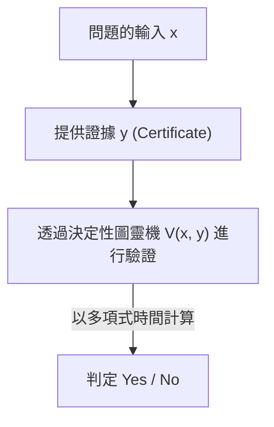
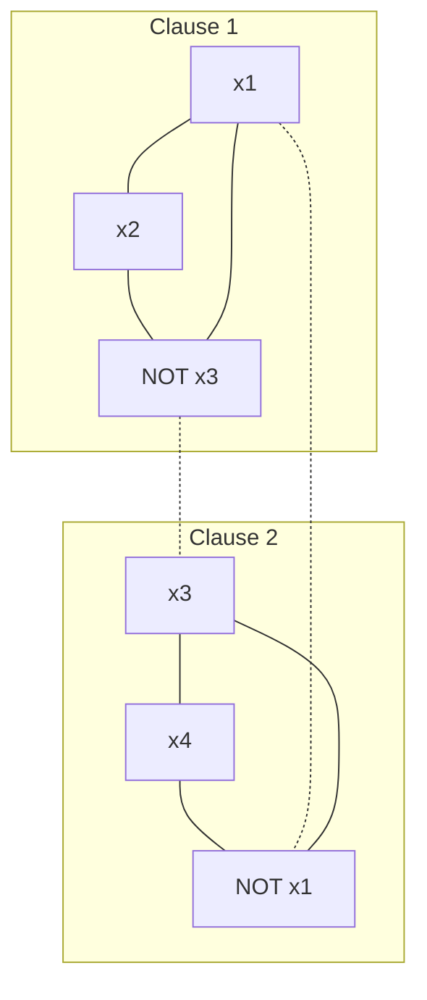

在現代數學與計算機科學中，存在著一個最著名且被認為最重要的未解決問題。那就是「P與NP問題（P vs NP Problem）」。作為克雷數學研究所設立的千禧年大獎難題之一，並懸賞100萬美元的這道難題，絕不僅僅是單純的智力謎題或數學家們打發時間的遊戲。

這是一個極度根源性的主題，直接關係到支撐我們社會的網際網路安全、物流與網路的最佳化、新藥研發中的蛋白質結構預測、AI學習模型的最佳化，甚至牽涉到「人類的創造力是什麼？」以及「數學定理的證明能否自動化？」等哲學性的提問。

在本文中，我們將從計算複雜度理論（Computational Complexity Theory）的基礎開始，探討庫克-李文定理對NP完全性的發現、計算複雜度類別的精細分類、阻礙證明的3個巨大障礙（相對化、自然證明、代數化）、最新的幾何計算複雜度理論（GCT）途徑、與量子計算複雜度類別（BQP）的關聯，甚至涵蓋實用的SAT求解器的Python實作，藉此完全解剖P與NP問題。透過這篇長達數萬字的詳細解說，讓我們一起觸摸計算複雜度理論的深淵吧。

## 第1章：計算複雜度理論的誕生與圖靈機基礎

為了正確理解P與NP問題，我們首先必須在數學上嚴格定義什麼是「計算」，以及什麼是「有效率的計算」。在1930年代，為了對大衛·希爾伯特所提出的「判定問題（Entscheidungsproblem）」給出否定的解答，艾倫·圖靈發明了一種抽象的計算模型——「圖靈機（Turing Machine）」，以便將「可計算的事物」在數學上公式化。與阿隆佐·邱奇的λ演算並列，這個圖靈機的概念作為「邱奇-圖靈論題」，已成為現代計算機科學的基石。

### 決定性圖靈機 (DTM) 與類別P
決定性圖靈機（Deterministic Turing Machine: DTM）由一條具有無限長度的一維紙帶、負責讀寫該紙帶的讀寫頭，以及具有有限個狀態的控制器所組成。當讀取到某個狀態與紙帶上的符號時，機器下一步應該採取的行動（寫入的符號、讀寫頭的移動方向、下一個狀態）總是唯一決定的。

更嚴格地說，DTM的轉移函數 $\delta$ 定義如下：
$$ \delta: Q \times \Gamma \to Q \times \Gamma \times \{L, R\} $$
這裡，$Q$ 是狀態的有限集合，$\Gamma$ 是紙帶符號的有限集合（包含空白符號），$L, R$ 是讀寫頭的移動方向（左、右）。因為對於輸入，狀態轉移會描繪出一條單一的軌跡（Deterministic Path），所以被稱為「決定性」。

**類別P（Polynomial-time）**是指使用這種DTM，對於輸入大小 $n$ ，能在多項式時間 $\mathcal{O}(n^k)$ （$k$ 為常數）內解決的判定問題（以Yes/No回答的問題）之集合。在實務上，屬於P的問題被視為「能有效率解決的問題」（科巴姆論題）。例如，串列的排序、最短路徑的搜尋（戴克斯特拉演算法）、求兩個數的最大公因數的演算法（輾轉相除法），甚至質數判定（AKS質數判定法）等都屬於此類。

### 非決定性圖靈機 (NTM) 與類別NP
另一方面，非決定性圖靈機（Nondeterministic Turing Machine: NTM）是一種虛擬的機器，對於某個狀態與輸入，下一步可採取的行動存在多個候補，並且能夠「同時平行地（或者總是如神助般選擇能引導至正確答案的分支）」探索這一切。

NTM的轉移函數 $\delta$ 的嚴格公式化如下：
$$ \delta: Q \times \Gamma \to \mathcal{P}(Q \times \Gamma \times \{L, R\}) $$
這裡 $\mathcal{P}(X)$ 代表集合 $X$ 的冪集（所有子集的集合）。也就是說，對於某個狀態 $q \in Q$ 與紙帶符號 $a \in \Gamma$，下一步可能採取的行動集合由 $\delta(q, a)$ 給出，機器可以從這些選項中任意選擇。NTM的計算過程不是單一的路徑，而是形成一個分岔的樹狀結構（計算樹，Computation Tree）。如果計算樹的路徑中，至少有一條到達了接受狀態（Yes狀態），NTM就被視為「接受了」該輸入。

#### 決定性模擬中指數型爆炸的數學機制
如果我們試圖用DTM來模擬NTM的運作，計算時間會變成怎樣呢？假設NTM的轉移函數的最大分岔數為 $b$（例如 $b=2$），並且對於輸入大小 $n$，在多項式時間 $p(n)$ 內停止。因為計算樹的深度為 $p(n)$，所以樹的最底層的葉子（Leaf）數量最大為 $b^{p(n)}$。
如果DTM要探索這整棵計算樹（例如使用廣度優先搜尋或深度優先搜尋），所需的步驟數將會是 $\mathcal{O}(b^{p(n)})$，這對於輸入大小 $n$ 呈現指數型（Exponentially）爆炸。這就是直覺上人們相信 P $\neq$ NP 的數學根本原因。在決定性的循序計算中，為了追上非決定性所擁有的「平行分岔」力量，我們不得不付出龐大的時間與空間成本。

**類別NP（Nondeterministic Polynomial-time）**是指使用NTM能在多項式時間內解決的判定問題之集合。然而，作為一種更直觀且實用的定義，可以換句話說為「當給予『Yes』這個答案時，能夠使用DTM在多項式時間內驗證該證據（Certificate 或 Witness）是否正確的問題」之集合。


（※ 此處的描述避開了管線符號或特殊符號。）

例如，旅行推銷員問題的判定版本（「是否存在總距離在 $K$ 以下且恰好拜訪所有城市一次的路徑？」），假設有神明或魔法師給予了這樣一條路徑（證據 $y$），我們只需要將總距離加起來確認是否在 $K$ 以下即可，因此可以在多項式時間內輕易驗證。因此，這個問題屬於NP。

## 第2章：庫克-李文定理與NP完全性的黎明

P與NP問題（即 P = NP 嗎？）是一個極為自然的問題：「驗證答案很容易的問題，尋找答案是否也同樣容易？」。直覺上，尋找答案似乎要困難得多（P $\neq$ NP），但要在數學上證明這一點卻極度困難。

### 滿足性問題（SAT）
為這場討論帶來革命的，是1971年史蒂芬·庫克（Stephen Cook）與1973年列昂尼德·李文（Leonid Levin）各自獨立的研究。他們將目光投向了「布林滿足性問題（SAT: Boolean Satisfiability Problem）」，該問題詢問是否存在某種變數賦值能使命題邏輯的邏輯式為真。

### 庫克-李文定理 (Cook-Levin Theorem)
「SAT是屬於NP的所有問題中最困難的問題之一」——這就是庫克-李文定理的核心。他們證明了任意的NP問題都可以在多項式時間內轉換（歸約）為SAT。

**多項式時間歸約（Polynomial-time Reduction, Karp Reduction）**是指問題 $A$ 的輸入 $x$，能夠使用可在多項式時間內計算的函數 $f$，轉換為問題 $B$ 的輸入 $y = f(x)$，並且滿足 $x \in A \iff f(x) \in B$（記作 $A \le_p B$）。

庫克與李文將任意NTM在多項式時間內的計算轉移（狀態、紙帶內容、讀寫頭位置）用一個巨大的邏輯式（布林式）精密地表達出來。具體來說，引入了「在時間 $t$ 時紙帶的第 $i$ 個格子存在符號 $a$」、「在時間 $t$ 時機器處於狀態 $q$」、「在時間 $t$ 時讀寫頭在位置 $i$」等命題變數（Boolean variables）。將這些變數正確遵循圖靈機的局部轉移規則 $\delta$ 的情況，寫成約束條件（由AND/OR/NOT構成的子句）。
由於執行時間為 $p(n)$，所以所需的變數數量大約控制在 $\mathcal{O}(p(n)^2)$ 左右，整體生成了多項式大小的邏輯式。如果對於某個輸入，存在使NTM到達「接受（Yes）」狀態的轉移序列（證據），那麼與之對應的邏輯式就會是可滿足的。透過這個證明，表示如果存在能在多項式時間內解決SAT的演算法，那麼所有的NP問題就都能在多項式時間內解決（P = NP）。

這種「屬於NP，且能從所有NP問題在多項式時間內歸約過來的問題」，我們稱之為**NP完全（NP-complete）**。SAT是歷史上第一個被發現的NP完全問題。

### 從3-SAT到最大獨立集（MIS）以及頂點覆蓋（Vertex Cover）的歸約：嚴格證明

1972年，理察·卡普（Richard Karp）以SAT的NP完全性為起點，證明了圖論與組合最佳化中著名的21個問題全都是NP完全問題。在這裡，我們將展開在計算複雜度理論課程中必然會提到的「從3-SAT到最大獨立集（Maximum Independent Set: MIS）問題」以及「頂點覆蓋（Vertex Cover）問題」之多項式時間歸約的逐步嚴格數學證明。

**問題的定義:**
- **3-SAT**: 給定一個合取正規形式（CNF）的邏輯式 $\phi$，其中每個子句（Clause）恰好由3個文字（變數或其否定）的邏輯或（OR）組成，詢問是否存在能使 $\phi$ 為真的變數賦值？
  $\phi = (l_{11} \lor l_{12} \lor l_{13}) \land (l_{21} \lor l_{22} \lor l_{23}) \land \dots \land (l_{m1} \lor l_{m2} \lor l_{m3})$
- **最大獨立集 (MIS)**: 給定無向圖 $G=(V, E)$ 與整數 $k$，詢問是否存在一個彼此不相鄰（無邊相連）的頂點集合 $S \subseteq V$，且其大小滿足 $|S| \ge k$？
- **頂點覆蓋 (Vertex Cover)**: 給定無向圖 $G=(V, E)$ 與整數 $k'$，詢問是否存在一個大小 $|C| \le k'$ 的集合 $C \subseteq V$，使得對於所有邊 $e \in E$，其至少有一個端點包含在 $C$ 中？

**歸約函數 $f$: 3-SAT $\to$ MIS 的構造**
給定3-SAT的邏輯式 $\phi$（子句數為 $m$）作為輸入時，我們如下構造圖 $G=(V, E)$ 與目標大小 $k$。

1. **頂點的構造 (V):**
   為每個子句 $C_i = (l_{i1} \lor l_{i2} \lor l_{i3})$ 中的每個文字，獨立創建3個對應的頂點。因此，頂點的總數嚴格為 $|V| = 3m$。
   $V = \{ v_{ij} : 1 \le i \le m, 1 \le j \le 3 \}$

2. **邊的構造 (E):**
   邊依照以下兩個規則來連接。
   - **內部邊 (Triangle edges):** 將屬於同一個子句的3個頂點互相連接。也就是說，為每個子句形成一個三角形（大小為3的團）。
     $E_{\text{inner}} = \{ (v_{i1}, v_{i2}), (v_{i2}, v_{i3}), (v_{i3}, v_{i1}) : 1 \le i \le m \}$
   - **矛盾邊 (Conflict edges):** 在邏輯上互相矛盾的文字（例: $x$ 與 $\lnot x$）所對應的頂點之間連接一條邊。
     $E_{\text{conflict}} = \{ (v_{ij}, v_{pq}) : l_{ij} = \lnot l_{pq} \}$
   整體的邊集合為 $E = E_{\text{inner}} \cup E_{\text{conflict}}$。

3. **目標大小 $k$ 的設定:**
   設 $k = m$（子句的數量）。這個圖的建構顯然可以在多項式時間 $\mathcal{O}(m^2)$ 內完成。

**正確性的證明 ($x \in \text{3-SAT} \iff f(x) \in \text{MIS}$):**

**[ $\Rightarrow$ 的證明 (若可滿足則存在大小為 $m$ 的獨立集)]**
假設 $\phi$ 是可滿足的。也就是說，存在使 $\phi$ 為真的變數賦值。在這種賦值下，每個子句 $C_i$ 至少擁有一個為真(True)的文字。
從每個子句中，「恰好選擇一個」對應於為真的文字的頂點，將該集合設為 $S$。$S$ 的大小顯然為 $|S| = m = k$。
我們用反證法證明 $S$ 是獨立集。假設 $S$ 內的兩個頂點之間有邊。
- 如果是內部邊：這意味著從同一個子句中選擇了2個頂點，這與我們從每個子句中只選擇一個的構造步驟矛盾。
- 如果是矛盾邊：這意味著對於某個變數 $x$，我們同時選擇了對應於 $x$ 和 $\lnot x$ 的頂點。然而，這意味著 $x$ 和 $\lnot x$ 兩者皆為真，這作為變數賦值是不可能的，因此產生矛盾。
因此，$S$ 內的任何兩頂點之間都不存在邊，$S$ 是一個大小為 $m$ 的獨立集。

**[ $\Leftarrow$ 的證明 (若存在大小為 $m$ 的獨立集則可滿足)]**
假設圖 $G$ 中存在大小為 $m$ 的獨立集 $S$。
由於圖的構造，屬於同一個子句的3個頂點形成了一個三角形（團），因此獨立集 $S$ 最多只能包含來自同一個子句的1個頂點。
頂點總數為 $3m$，子句數為 $m$，且 $|S|=m$，根據鴿巢原理（Pigeonhole principle），$S$ 必須包含「來自每個子句恰好一個頂點」。
我們考慮一種變數賦值，將 $S$ 中包含的頂點所對應的文字全部設為真(True)。因為不存在矛盾邊（$S$ 是獨立集），所以不會有某個變數 $x$ 和 $\lnot x$ 同時被賦值為真的情況。對於未包含在 $S$ 中的變數，我們賦予任意值。
透過這種賦值，因為每個子句中被選中的文字都為真，所以整體的邏輯式 $\phi$ 就是可滿足的。

**圖解示意圖**
對於 $\phi = (x_1 \lor x_2 \lor \lnot x_3) \land (\lnot x_1 \lor x_3 \lor x_4)$ 的情況

(實線代表內部邊，虛線代表矛盾邊。如果能從每個子圖中各選出一個彼此沒有邊相連的頂點，就能達成MIS。)

**從MIS到頂點覆蓋 (Vertex Cover) 的歸約**
此外，得益於圖論中優美的對偶性，從MIS到頂點覆蓋的歸約驚人地簡單。
定理：「在圖 $G=(V, E)$ 中，子集 $S \subseteq V$ 是獨立集，若且唯若其補集 $V \setminus S$ 是頂點覆蓋。」
證明：假設 $S$ 是獨立集。對於任意的邊 $e = (u, v) \in E$，$u$ 和 $v$ 不會同時包含在 $S$ 中（獨立集的定義）。因此，$u, v$ 中至少有一個包含在 $V \setminus S$ 中。這意味著 $V \setminus S$ 覆蓋了所有的邊，滿足頂點覆蓋的定義。反之亦可完全相同地證明。
因此，詢問是否存在目標大小為 $k$ 的MIS的問題，可以在多項式時間內歸約為詢問是否存在目標大小為 $k' = |V| - k$ 的頂點覆蓋的問題。

透過這些歸約，揭示了NP完全性從3-SAT傳遞到MIS，再到Vertex Cover的數學結構。

## 第3章：NP中間問題與量子計算複雜度類別 (BQP) 的衝擊

如果 P $\neq$ NP，那麼是否存在既不屬於P也不屬於NP完全的「中等」難度問題呢？

### 拉德納定理 (Ladner's Theorem)
理查·拉德納（Richard Ladner）在1975年證明了**拉德納定理**：「如果 P $\neq$ NP，那麼必然存在屬於NP但不屬於P也不屬於NP完全的問題（NP中間問題, NP-intermediate problems）」。
雖然拉德納的證明是基於對角線論證法建構的人工語言，但在我們現實面臨的問題中，也有一些被強烈懷疑是NP中間問題。例如，圖同構問題（Graph Isomorphism）等。

### 質因數分解與秀爾演算法
另一個巨大的前沿領域是構成密碼學基礎的「整數的質因數分解」。質因數分解的判定問題版本（「整數 $N$ 是否擁有小於等於 $k$ 的非平凡質因數？」）屬於NP，但被認為不是NP完全（因為如果它是NP完全，就有強烈的理論證據顯示稱為多項式階層的計算複雜度類別階層將會崩潰）。

在這裡，為計算複雜度理論帶來革命的是量子電腦。
1994年，彼得·秀爾（Peter Shor）證明了如果使用量子電腦，質因數分解可以在多項式時間內解決（**秀爾演算法**）。對於古典演算法最好也需要次指數時間（例如：普通數域篩法）的問題，在量子計算中大約只需 $\mathcal{O}((\log N)^3)$ 的時間就能解決。

### 量子計算複雜度類別BQP與P、NP的包含關係
為了將此公式化，引入了**BQP (Bounded-error Quantum Polynomial-time)** 這個計算複雜度類別。BQP是指使用量子圖靈機（或量子電路模型），在多項式時間內能以1/3以下的錯誤率解決的判定問題類別。

它與古典計算類別的關係預期如下：
1. $P \subseteq BQP$ （古典電腦能有效率解決的問題，量子電腦也能解決）
2. $BQP \not\subseteq NP$ （BQP中可能也包含不屬於NP的問題）
3. $NP \not\subseteq BQP$ （即使使用量子電腦，也無法有效率地解決NP完全問題）

**為何秀爾演算法無法直接解決P與NP問題**
在一般新聞中，常被誤解為「只要量子電腦完成，所有的計算問題（NP問題）都能在一瞬間解決」，但從計算複雜度理論的觀點來看，這是不正確的。
秀爾演算法將整數的質因數分解（以及離散對數問題）分類到了BQP。然而，如前所述，質因數分解並非NP完全問題。
如果秀爾演算法是能在多項式時間內解決「SAT（NP完全問題）」的演算法，那就意味著「量子電腦能有效率地解決所有的NP問題（$NP \subseteq BQP$）」，這將是動搖P與NP框架的大事件。
然而，即使運用量子電腦的力量（疊加與量子干涉），也無法將為了解決NP完全問題而存在的指數級探索空間壓縮到多項式時間內。即使使用格羅弗演算法（Grover's Algorithm），充其量也只能達到二次函數級的速度提升（對於探索空間 $N$，從 $\mathcal{O}(N) \to \mathcal{O}(\sqrt{N})$；在時間複雜度上則是 $\mathcal{O}(2^n) \to \mathcal{O}(2^{n/2})$），這一點已被證明（Bennett, Bernstein, Brassard, Vazirani, 1997）。
因此，理論計算機科學界目前的堅固共識是：即使量子電腦實用化，P與NP問題本質上的困難度（特別是NP完全問題的有效解法）依然無法被解決。

## 第4章：為什麼P與NP問題解不開？3個主要的障礙

半個多世紀以來，全世界的天才數學家們不斷挑戰P與NP問題，卻屢屢敗退。這並非單純是因為人類的智慧不足。而是因為目前的數學框架（證明手法）本身，已經被「後設證明（meta-proof）」缺乏解決這個問題的能力。這就是計算複雜度理論中的3個巨大障礙。

### 1. 相對化障礙 (Relativization Barrier) 與 Baker-Gill-Solovay 定理
1975年，Theodore Baker, John Gill, Robert Solovay 使用了稱為「神諭（Oracle）」的概念。神諭 $A$ 是一個虛擬的黑盒子，能在一瞬間（1個步驟內）給出某個問題 $A$ 的答案。在圖靈機中加入向這個神諭查詢的功能，就稱為神諭圖靈機。

他們證明了在某個神諭下 P=NP，而在另一個神諭下 P≠NP，這給計算複雜度理論帶來了震撼。

**Baker-Gill-Solovay定理的完整證明綱要**

**定理：存在滿足以下性質的神諭 $A$ 與 $B$。**
1. $P^A = NP^A$
2. $P^B \neq NP^B$

**[ 使 $P^A = NP^A$ 成立的神諭 $A$ 的構造 ]**
我們選擇PSPACE完全問題「TQBF（True Quantified Boolean Formula）」問題作為神諭 $A$。
擁有神諭 $A$ 的決定性多項式時間機器（$P^A$），可以在多項式時間內解決PSPACE中的任何問題。因為PSPACE中的任意問題都可以用多項式時間歸約為TQBF，只需向神諭查詢一次就能獲得答案。也就是說 $P^A = \text{PSPACE}$。
另一方面，擁有神諭 $A$ 的非決定性多項式時間機器（$NP^A$），即使驅使神諭的力量，在多項式時間內也只能探索多項式大小的空間，因此 $NP^A \subseteq \text{NPSPACE}$。根據計算複雜度理論的基本定理薩維奇定理（Savitch's Theorem），因為 $\text{NPSPACE} = \text{PSPACE}$，所以 $NP^A \subseteq \text{PSPACE}$。
理所當然地 $P^A \subseteq NP^A$，將這些結合起來，便成立了 $P^A = NP^A = \text{PSPACE}$。

**[ 使 $P^B \neq NP^B$ 成立的神諭 $B$ 的構造 ]**
讓 $B$ 為某個語言（字串的集合），對於神諭 $B$，定義如下的語言 $L_B$。
$L_B = \{ 1^n : \text{長度為 } n \text{ 的某個字串 } x \text{ 存在於 } B \text{ 中} \}$
顯然 $L_B \in NP^B$。因為NTM對於輸入 $1^n$，可以非決定性地猜測（生成）長度為 $n$ 的字串 $x$，並用1個步驟向神諭 $B$ 查詢 $x \in B$ 是否成立來進行驗證。
接下來，我們使用對角線論證法（Diagonalization）遞迴地建構神諭 $B$ 的內容，使得 $L_B \notin P^B$ 成立。
將所有的決定性多項式時間神諭機器列舉為 $M_1, M_2, \dots, M_i, \dots$。假設每個 $M_i$ 的執行時間都被多項式 $p_i(n)$ 所限制。
在第 $i$ 階段，選擇一個足夠長的字串長度 $n$（使其急遽增大，滿足 $2^n > p_i(n)$）。
給予 $M_i$ 輸入 $1^n$ 進行模擬。在執行過程中，$M_i$ 最多只會對 $p_i(n)$ 個字串向神諭進行查詢。
長度為 $n$ 的字串總數有 $2^n$ 個，因為 $2^n > p_i(n)$，所以必定存在一個 $M_i$ 「一次都沒有向神諭查詢過」的長度為 $n$ 的字串 $y$。
- 如果 $M_i(1^n)$ 最終輸出「接受（1）」，我們就決定讓 $B$ 完全不包含任何長度為 $n$ 的字串（設為空集合）。這會導致 $1^n \notin L_B$，這表示 $M_i$ 的輸出是錯誤的。
- 如果 $M_i(1^n)$ 最終輸出「拒絕（0）」，我們就將剛才未被查詢的字串 $y$ 加入 $B$ 中。這會導致 $1^n \in L_B$，這同樣表示 $M_i$ 的輸出是錯誤的。
對所有的機器無限次地重複這個過程所構造出來的神諭 $B$ 中，任何的DTM都無法正確判定語言 $L_B$，使得 $L_B \notin P^B$ 成立。因此 $P^B \neq NP^B$。

**相對化障礙的意義**
這個定理可怕的結論是：「對角線論證法或狀態的模擬這類不受神諭存在與否影響（可相對化, Relativizing）的證明手法，永遠無法解決P與NP問題」。因為，如果能用這種手法證明 P=NP，那麼在神諭 $B$ 的世界裡也應該能證明 P=NP，這就產生了矛盾。

### 2. 自然證明障礙 (Natural Proofs Barrier)
為了跨越相對化障礙，理論家們不再探討圖靈機的運作，而是轉向展現組合邏輯閘（AND, OR, NOT）的「布林電路（Boolean Circuits）」尺寸下界的方法（針對類別 P/poly 的下界證明）。
然而在1994年，Alexander Razborov 與 Steven Rudich 提出了「自然證明（Natural Proofs）」的概念。
他們指出，當時幾乎所有的電路下界證明手法，都是建立在提取出滿足「有用性（Constructivity）」與「巨大性（Largeness）」這兩種性質的「自然性質」上。接著，他們在數學上證明了，如果單向函數存在（即密碼學成立），那麼就不可能透過這種「自然證明」來證明強大計算複雜度類別的下界。
也就是說，試圖證明 P $\neq$ NP 的現有組合數學手法，諷刺地陷入了一個矛盾：只要假設 P $\neq$ NP（其更強的形式即密碼的存在），這些手法就會失效。

### 3. 代數化障礙 (Algebrization Barrier)
為了避開相對化與自然證明的障礙，在1990年代發展出了「互動式證明系統（Interactive Proofs）」與「算術化（Arithmetization）」。藉此證明了 IP = PSPACE 等劃時代的定理。
但是在2008年，Scott Aaronson 與 Avi Wigderson 證明了這些手法最終也依賴於在有限體上擴展多項式的「代數化（Algebrization）」操作。並且證明了使用代數化的手法無法解決P與NP問題（或許多其他計算複雜度類別的分離）。

由於這3個障礙，「為了解決P與NP問題，我們需要全新典範的數學」，這已成為理論計算機科學界的常識。

## 第5章：實踐・使用Python探討SAT求解器的數理與實作

雖然P=NP仍是未解之謎，但在現實世界的產業界中，擁有數百萬變數的巨大SAT（NP完全問題）每天都在被高速求解。這是因為，即使最壞情況的計算時間是指數時間，實務上的許多問題（如硬體驗證或相依性解析等）都具有極強的「結構」。在這裡，我們就來看看作為P與NP問題理論核心的SAT求解器之具體演算法與Python實作。

### DPLL演算法與回溯的數理
DPLL (Davis-Putnam-Logemann-Loveland) 演算法是以深度優先搜尋（回溯法）為基礎，並利用邏輯式的特性來急劇減少探索空間的手法。

數理上的重點有以下2個：
1. **單位傳播 (Unit Propagation / Boolean Constraint Propagation):** 當子句中只剩下一個未賦值的文字時（Unit Clause），為了讓該子句為真，除了將該文字設為真之外別無選擇。這種強制的賦值會連鎖性地引發其他子句的單位傳播，大幅修剪探索樹。
2. **純文字消除 (Pure Literal Elimination):** 在整個邏輯式中，如果某個變數總是只以肯定（或總是只以否定）的形式出現，那麼將該文字賦值為真，不會對其他子句的可滿足性產生不良影響。

以下是DPLL演算法簡潔且具教育意義的Python程式碼範例。

```python
def dpll(clauses, assignment):
    # 基礎情況1: 所有子句都被滿足，列表變為空 -> 可滿足 (SAT)
    if len(clauses) == 0:
        return True, assignment
    
    # 基礎情況2: 存在矛盾（空子句） -> 不可滿足 (UNSAT)
    if any(len(c) == 0 for c in clauses):
        return False, {}
    
    # 應用單位傳播 (Unit Propagation)
    unit_clauses = [c for c in clauses if len(c) == 1]
    if unit_clauses:
        unit = unit_clauses[0][0]
        new_clauses = []
        for c in clauses:
            if unit in c:
                continue # 這個子句已經為真，因此刪除
            if -unit in c:
                # 移除矛盾的文字
                new_clause = [l for l in c if l != -unit]
                new_clauses.append(new_clause)
            else:
                new_clauses.append(c)
        assignment[abs(unit)] = (unit > 0)
        return dpll(new_clauses, assignment)
    
    # 分支 (Branching): 啟發式地選擇變數
    # 這裡我們單純地選擇第一個子句的第一個文字
    literal = clauses[0][0]
    
    # 假設變數為True進行探索
    res, final_assign = dpll(clauses + [[literal]], assignment.copy())
    if res:
        return True, final_assign
        
    # 如果上面的分支失敗，則假設變數為False進行探索 (回溯)
    return dpll(clauses + [[-literal]], assignment.copy())

# 執行範例: (x1 OR NOT x2) AND (NOT x1 OR x2 OR x3) AND (NOT x3)
# 1: x1, 2: x2, 3: x3 (負數代表NOT)
cnf_formula = [[1, -2], [-1, 2, 3], [-3]]
is_sat, solution = dpll(cnf_formula, {})

print(f"Satisfiable: {is_sat}")
print(f"Assignment: {solution}")
# 預期的輸出:
# Satisfiable: True
# Assignment: {3: False, 1: False, 2: False} (或其他可滿足的解)
```

### 邁向CDCL (Conflict-Driven Clause Learning) 演算法的進化
現代最先進的SAT求解器（如MiniSat, Glucose等）採用了將DPLL飛躍性擴展的 **CDCL (Conflict-Driven Clause Learning)** 演算法。

CDCL的革命性在於「從失敗中學習」。在探索中產生矛盾（Conflict）時，它不再只是單純退回上一步（Chronological backtracking），而是建構蘊含圖（Implication Graph）來分析造成矛盾根本原因的變數組合。透過計算圖上被稱為UIP（Unique Implication Point）的切口，將矛盾的原因轉換成邏輯式的形式，並作為新的「學習子句（Learned Clause）」加入到原本的式子中。
藉由這樣，實現了「絕對不會在探索樹的其他分支上重蹈覆轍」的非時間順序回溯（Non-chronological backtracking / Backjumping），急劇地修剪了指數級的探索樹。此外，再結合VSIDS（Variable State Independent Decaying Sum）等動態的變數選擇啟發式方法，以及定期的重啟（Restarts），使得CDCL穩坐人類對抗NP完全問題啟發式演算法的最高峰。

## 第6章：現代途徑與幾何計算複雜度理論 (GCT)

在障礙重重的情況下，目前的理論家們正在以什麼樣的途徑挑戰P與NP問題呢？

### 幾何計算複雜度理論 (Geometric Complexity Theory: GCT)
2001年，Ketan Mulmuley 與 Milind Sohoni 提出了一項運用代數幾何學與表示論的宏大計畫——「幾何計算複雜度理論（GCT）」。
GCT的基本理念是，將計算複雜度類別的分離問題，轉化為在某個多項式空間（軌道閉包）中的幾何包含關係問題。

具體來說，它著眼於積和式（Permanent，屬於#P完全，計算困難）與行列式（Determinant，可在多項式時間內計算）在對稱性上的差異。將這些多項式視為一般線性群作用下的幾何軌道（Orbit），並利用表示論（舒爾多項式與不可約表示的重數），試圖證明「Permanent的軌道閉包無法嵌入到Determinant的軌道閉包中」。
據說GCT具有能夠避開自然證明與代數化障礙的特性，且因為能夠動員數學其他領域（代數幾何、表示論、不變式論）的深奧定理而備受期待；但由於其極度高深且難解，目前仍處於未完成的狀態。

### 電路下界與擴展圖
此外，作為另一個方向，將計算的隨機性（BPP）用決定性演算法（P）來模仿的「去隨機化（Derandomization）」研究也正在進展。擴展圖（Expander graph）與提取器（Extractor）等偽亂數生成器的理論，與電路下界的證明有著深刻的連結（Hardness vs. Randomness 典範），並孕育出了「只要能證明強大的電路下界，就能證明 P = BPP」等豐富的成果。這些進展在長遠來看，也被認為將成為證明 P $\neq$ NP 的踏腳石。

## 第7章：P=NP（或P≠NP）對世界造成的哲學性與技術性衝擊

如果P與NP問題被解決了，我們的社會會變得怎麼樣呢？許多專家相信 P $\neq$ NP，但假設 P = NP 被證明，而且還發現了實用的多項式時間演算法（例如 $\mathcal{O}(n^2)$ 或 $\mathcal{O}(n^3)$）的話，世界將會發生劇烈，甚至令人恐懼的改變。

### 公開金鑰密碼的崩潰
現代網際網路的安全基礎——RSA密碼或橢圓曲線密碼，都是建立在「質因數分解或離散對數問題無法在多項式時間內解決」的前提（更嚴格地說，是單向函數存在）之上。如果 P = NP，那麼就能在多項式時間內找到從密文還原明文的「證據」，密碼將變得毫無用處，數位通訊的隱私與安全的金融交易將在瞬間崩潰。

### 最佳化與科學的終結（以及終極的自動化）
然而，也有好的一面。物流（旅行推銷員問題）、蛋白質折疊結構的預測、半導體的電路設計、尋找AI的最佳權重等，所有被公式化為NP完全問題的最佳化問題，都將能瞬間獲得最佳解。這將具有讓人類的技術進化快轉幾百年的影響力，從解決氣候變遷到新藥的完全自動設計都有可能實現。

### 哥德爾的信與人類的創造力
1956年，庫爾特·哥德爾（Kurt Gödel）在寫給約翰·馮·紐曼（John von Neumann）的信中，寫下了本質上預見了P與NP問題的內容。哥德爾寫道，如果定理的證明（尋找長度為 $n$ 的證明）能在多項式時間內完成，那麼「數學家的工作將完全被機器取代」。
如果「驗證證明（P）」與「靈光閃現出證明（NP）」是等價的，那麼藝術的靈感、數學的直覺、天才的靈光乍現等所謂的「人類創造力」，也就只不過是多項式時間的演算法而已了。

## 結語：凝視深淵

P與NP問題並不僅僅是在詢問演算法的執行時間。它是對智力的一種根本性提問：「尋找答案與理解答案，在本質上是否有所不同？」。

時至今日，全世界的數學家與計算機科學家仍持續挑戰著這個問題。為了完成證明，我們將需要能夠打破神諭、自然證明、代數化等堅固障礙，超越我們想像的全新數學概念吧。

君臨千禧年大獎難題頂點的這個謎團，究竟會有被解開的一天，還是會像哥德爾的不完備定理一樣，被證明為「不可證明」而作為獨立性存在呢？挑戰人類智慧極限的旅程，今後也將繼續下去。
