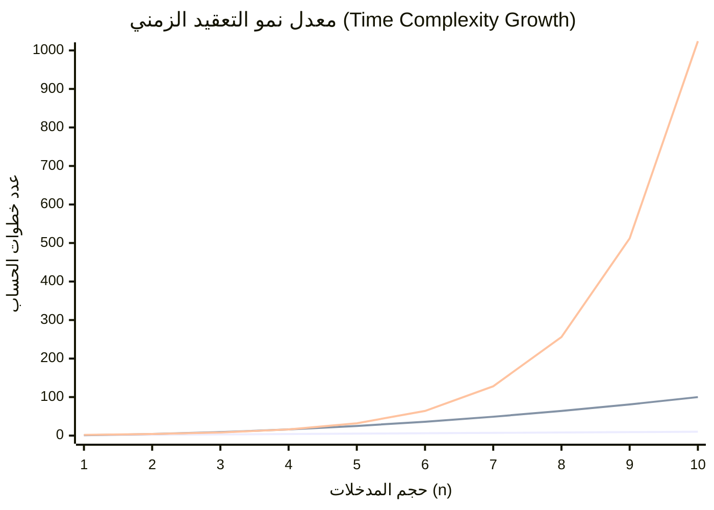
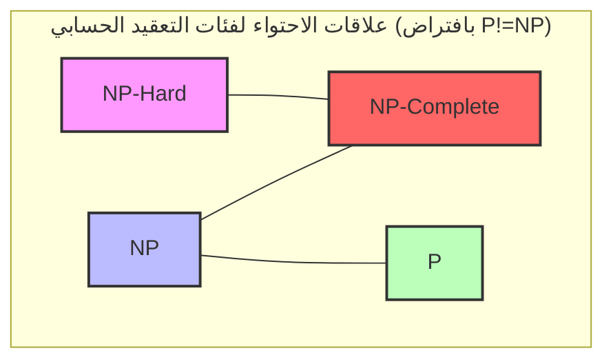
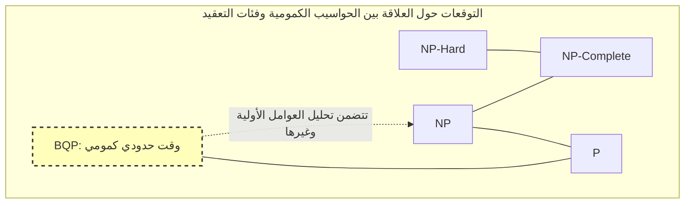

توجد مسألة غير محلولة تُعد الأشهر والأهم في علوم الحاسوب وفي الرياضيات الحديثة، ألا وهي **مشكلة P مقابل NP** (P vs NP problem).

في عام 2000، أعلن معهد كلاي للرياضيات عن جائزة قدرها مليون دولار أمريكي لكل مسألة من سبع مسائل رياضية غير محلولة. تُعرف هذه المسائل باسم **مسائل جوائز الألفية**. تم حل بعضها بالفعل، مثل حدسية بوانكاريه، لكن **مشكلة P مقابل NP** لم تظهر لها حتى الآن أي بوادر للحل الكامل.

في هذا المقال، سنستعرض التفاصيل الكاملة لهذه المسألة، بدءاً من أساسيات فئات التعقيد الحسابي (P و NP و NP-complete و NP-hard)، مروراً بأهميتها العملية في البرمجة، وصولاً إلى التأثير الهائل على العالم إذا تم حلها.

---

## 1. نظرية التعقيد وأساسيات الخوارزميات

لفهم **مشكلة P مقابل NP**، يجب أولاً فهم مفهوم "التعقيد الحسابي للخوارزمية". يقوم الحاسوب بإجراء حسابات خطوة بخطوة لحل مشكلة ما، لكن كيف يزداد الوقت (عدد الخطوات) أو الذاكرة (المساحة) المطلوبة مع زيادة حجم المدخلات $n$؟ هذا ما يوضحه **التعقيد الحسابي (Computational Complexity)**.

### رمز لانداو (Big-O Notation)

يُستخدم رمز $O$ بشكل شائع للتعبير عن التعقيد الحسابي. وهو يمثل الحد الأعلى للتعقيد الزمني في أسوأ الحالات بالنسبة لحجم المدخلات $n$.

- $O(1)$: وقت ثابت. لا يعتمد على حجم المدخلات.
- $O(\log n)$: وقت لوغاريتمي. مثل البحث الثنائي.
- $O(n)$: وقت خطي. مثل البحث البسيط.
- $O(n \log n)$: خوارزميات الفرز الفعالة (مثل الفرز السريع، والفرز بالدمج).
- $O(n^2), O(n^3)$: وقت كثير الحدود. حلقات متداخلة مزدوجة أو ثلاثية.
- $O(2^n)$: وقت أسي. مثل البحث الشامل.
- $O(n!)$: وقت عاملي. مثل القوة الغاشمة البسيطة لمشكلة البائع المتجول.

الرسم البياني التالي يوضح معدل زيادة عدد خطوات الحساب بالنسبة لحجم المدخلات.


*(الخط السفلي يمثل $O(n)$، والأوسط $O(n^2)$، والأعلى $O(2^n)$. يمكن ملاحظة الزيادة الانفجارية للوقت الأسي.)*

في نظرية التعقيد، الوقت الذي يُمثل بـ $O(n^k)$ (حيث $k$ ثابت) يُسمى **الوقت كثير الحدود (Polynomial Time)**، ويُعتبر معياراً للمشكلات التي يمكن حلها في وقت عملي. من ناحية أخرى، الأوقات الأسية مثل $O(2^n)$ تتطلب وقت حساب يتجاوز عمر الكون عندما يصل $n$ إلى بضع عشرات فقط، لذا تُعتبر عملياً "غير قابلة للحل".

---

## 2. ما هي الفئة P؟ (المشكلات التي يمكن "حلها" في وقت عملي)

تُعرّف **الفئة P (P: Polynomial time)** بأنها "مجموعة مشاكل القرار التي يمكن حلها بواسطة آلة تورنغ حتمية في وقت كثير الحدود".

ببساطة، هي **"المشكلات التي يمكن للحاسوب إيجاد حل لها بنفسه في وقت واقعي وعملي"**.

### أمثلة شهيرة لمشكلات الفئة P

- **مشكلة الفرز (Sorting)**: ترتيب مجموعة من الأرقام تصاعدياً (مثل $O(n \log n)$).
- **مشكلة المسار الأقصر**: إيجاد أقصر مسار بين نقطتين، مثل أنظمة الملاحة (باستخدام خوارزمية ديكسترا $O(E + V \log V)$).
- **اختبار الأولية**: تحديد ما إذا كان عدد ما أولياً أم لا (تم إثبات إمكانية حلها في وقت كثير الحدود باستخدام خوارزمية AKS).

فيما يلي تنفيذ بلغة بايثون لخوارزمية البحث الثنائي، وهي مثال كلاسيكي لمشكلة في الفئة P.

```python
def binary_search(arr, target):
    """
    خوارزمية للبحث الثنائي عن الهدف (target) في مصفوفة مفرزة (مثال على الفئة P)
    التعقيد الزمني: O(log n)
    """
    left, right = 0, len(arr) - 1
    
    while left <= right:
        mid = (left + right) // 2
        if arr[mid] == target:
            return mid
        elif arr[mid] < target:
            left = mid + 1
        else:
            right = mid - 1
            
    return -1

# اختبار
sorted_data = [1, 3, 5, 7, 9, 11, 13, 15]
print("Index:", binary_search(sorted_data, 7)) # Output: 3
```

هذه المشكلات يمكن حلها بشكل قابل للتوسع دون أن ينفجر التعقيد الحسابي مع زيادة حجم المدخلات.

---

## 3. ما هي الفئة NP؟ (المشكلات التي يمكن "التحقق منها" في وقت عملي)

تُعرّف **الفئة NP (NP: Nondeterministic Polynomial time)** بأنها "مجموعة مشاكل القرار التي يمكن حلها بواسطة آلة تورنغ غير حتمية في وقت كثير الحدود"، أو بعبارة أوضح **"مجموعة المشكلات التي، إذا أُعطيت دليلاً (حلاً مقترحاً)، يمكنك التحقق من صحته في وقت كثير الحدود"**.

يمكن إعادة صياغة ذلك بـ: **"المشكلة قد يكون من الصعب جداً إيجاد حل لها بنفسك، لكن إذا أُعطيت ما يبدو أنه الحل، يمكنك التحقق مما إذا كان صحيحاً أم لا بسرعة"**.

### أمثلة شهيرة لمشكلات الفئة NP

- **سودوكو (Sudoku)**: تعبئة اللوحة أمر صعب، لكن إذا أعطيت لوحة ممتلئة بالكامل، يمكنك التحقق من صحتها (عدم وجود تكرار في أي صف أو عمود أو مربع) في لحظة.
- **مشكلة مجموع المجموعات الفرعية (Subset Sum)**: هل يمكن اختيار بعض الأرقام من مجموعة معطاة ليكون مجموعها رقماً محدداً؟ يتطلب العثور على الحل بحثاً شاملاً، لكن إذا تم إعطاؤك دليلاً ("اختر هذا وهذا")، يمكنك التحقق منه بعملية جمع بسيطة.
- **مشكلة البائع المتجول (نسخة القرار)**: هل يوجد مسار يزور جميع المدن ويعود مسافته الإجمالية أقل من أو تساوي $K$؟

فيما يلي مثال بكود بايثون لـ "التحقق" من حل سودوكو. عملية التحقق نفسها تتم في وقت كثير الحدود $O(n^2)$.

```python
def verify_sudoku_solution(board):
    """
    التحقق مما إذا كانت لوحة سودوكو المكتملة (9x9) صحيحة (مثال على عملية التحقق في الفئة NP)
    التعقيد الزمني: O(n^2) - سريع جداً
    """
    def is_valid_group(group):
        return sorted(list(group)) == [1, 2, 3, 4, 5, 6, 7, 8, 9]

    # التحقق من الصفوف والأعمدة
    for i in range(9):
        if not is_valid_group(board[i]):
            return False
        if not is_valid_group([board[j][i] for j in range(9)]):
            return False

    # التحقق من مربعات 3x3
    for i in range(0, 9, 3):
        for j in range(0, 9, 3):
            block = [board[x][y] for x in range(i, i+3) for y in range(j, j+3)]
            if not is_valid_group(block):
                return False

    return True

# حل سودوكو صحيح
valid_board = [
    [5,3,4,6,7,8,9,1,2],
    [6,7,2,1,9,5,3,4,8],
    [1,9,8,3,4,2,5,6,7],
    [8,5,9,7,6,1,4,2,3],
    [4,2,6,8,5,3,7,9,1],
    [7,1,3,9,2,4,8,5,6],
    [9,6,1,5,3,7,2,8,4],
    [2,8,7,4,1,9,6,3,5],
    [3,4,5,2,8,6,1,7,9]
]
print("نتيجة التحقق:", verify_sudoku_solution(valid_board)) # Output: True
```

**كل مشكلة تنتمي إلى الفئة P تنتمي أيضاً إلى الفئة NP.** لأنه إذا كان بإمكانك "حلها في وقت عملي بنفسك"، فبالتأكيد يمكنك "التحقق من الحل عند تقديمه لك في وقت عملي". رياضياً يتم التعبير عن ذلك كالتالي:

$ P \subseteq NP $

---

## 4. جوهر مشكلة P مقابل NP: هل يمكن استبدال "الإلهام" بـ "الجهد"؟

نصل الآن إلى جوهر مسألة جائزة الألفية: **مشكلة P مقابل NP**.

السؤال بسيط للغاية:

> **هل الفئة P (المشكلات التي يمكن حلها في وقت عملي) والفئة NP (المشكلات التي يمكن التحقق منها في وقت عملي) هما في الواقع نفس المجموعة؟ بعبارة أخرى، هل $P = NP$؟ أم أن $P \neq NP$؟**

بديهياً، يبدو أن **"إيجاد الحل"** أصعب بكثير من **"التحقق من صحة الحل"**. إذا قارنت بين حل لغز سودوكو وبين التحقق من الإجابات، ستجد أن التحقق أسهل بكثير.

إذا كان **P = NP**، فهذا يعني أن "أي مشكلة يمكن التحقق من حلها بسهولة، يمكن أيضاً حلها بسهولة بمجرد معرفة الطريقة". وبما أن هذا يتعارض بشدة مع الحدس البشري، فإن الغالبية العظمى من علماء الرياضيات وعلماء الحاسوب اليوم (أكثر من 90٪ في الاستطلاعات) يتوقعون أن **$P \neq NP$**. ومع ذلك، لم يتمكن أحد حتى الآن من إثبات ذلك رياضياً.

---

## 5. NP-Complete و NP-Hard (أصعب المشكلات في الكون)

لفهم هذه المشكلة بشكل أعمق، لا غنى عن مفهومي **NP-Complete (كاملة الانتمائية لـ NP)** و **NP-Hard (صعبة الانتمائية لـ NP)**.

### الاختزال في وقت كثير الحدود (Polynomial-time Reduction)
لنفترض أن لديك برنامجاً يحل المشكلة $A$. إذا كنت تريد حل المشكلة $B$، واستطعت تحويل مدخلات المشكلة $B$ بسرعة (في وقت كثير الحدود) إلى مدخلات للمشكلة $A$، واستخدام البرنامج لحلها، ثم تحويل النتيجة بسرعة إلى حل للمشكلة $B$، فيمكن القول إن "المشكلة $B$ ليست أصعب من المشكلة $A$". يُعرف هذا بـ **الاختزال في وقت كثير الحدود**.

### NP-Hard
هي فئة من المشكلات التي يمكن لأي مشكلة في الفئة NP أن تُختزل إليها في وقت كثير الحدود. أي أنها "مشكلات على الأقل بنفس صعوبة أي مشكلة في NP أو أصعب". لا يُشترط أن تكون مشكلات NP-Hard مشكلات قرار أصلاً.

### NP-Complete
هي المشكلات التي تُعد NP-Hard وتنتمي أيضاً إلى الفئة NP نفسها. وهذا يعني أنها **"مجموعة من أصعب المشكلات داخل الفئة NP"**.



بشكل مذهل، في عام 1971 أثبت كل من ستيفن كوك وليونيد ليفين أن **مشكلة قابلية الإرضاء المنطقية (SAT)** هي مشكلة NP-Complete (مبرهنة كوك-ليفين).

بعد ذلك، أثبت ريتشارد كارب أن العديد من مشكلات التحسين في العالم الحقيقي، مثل مشكلة البائع المتجول، ومشكلة حقيبة الظهر، وتلوين المخططات، هي مشكلات **NP-Complete** (مشكلات كارب الـ 21 الـ NP-complete).

**الخاصية الأهم لمشكلات NP-Complete هي: "إذا وُجدت خوارزمية تحل أي مشكلة من مشكلات NP-Complete في وقت كثير الحدود، فإن جميع مشكلات NP يمكن حلها في وقت كثير الحدود (أي $P = NP$)".**
هذا يُعد بمثابة تأثير الدومينو المطلق في علوم الحاسوب.

---

## 6. المقارنة العملية والتنفيذ في البرمجة

هنا سنقارن بين "مشكلات متشابهة ولكن مستوى صعوبتها مختلف تماماً"، ونشرح العقبات التي يواجهها المبرمجون.

### مسار أويلر (الفئة P) مقابل مسار هاميلتون (NP-Complete)

- **مسار أويلر (Eulerian Circuit)**: البحث عن مسار يمر بجميع "الحواف" مرة واحدة بالضبط ويعود إلى نقطة البداية. يمكن حل ذلك بسهولة في وقت كثير الحدود $O(V+E)$ عن طريق التحقق من درجة كل رأس.
- **مسار هاميلتون (Hamiltonian Cycle)**: البحث عن مسار يمر بجميع "الرؤوس" مرة واحدة بالضبط ويعود إلى نقطة البداية (وهي أساس مشكلة البائع المتجول). مجرد تغيير بسيط في الشرط يجعل هذه المشكلة **NP-Complete**، ولا توجد خوارزمية فعالة معروفة لحلها.

### مثال تنفيذي لمشكلة البائع المتجول (TSP) وخوارزمية التقريب

إذا حاولت حل مشكلة البائع المتجول (وهي NP-Hard في نسختها كمسألة تحسين) بشكل دقيق، سينفجر التعقيد الحسابي. دعنا نقارن الحل الدقيق (القوة الغاشمة) بالحل التقريبي العملي (الخوارزمية الجشعة) باستخدام بايثون.

```python
import itertools
import math

def calculate_distance(city1, city2):
    return math.hypot(city1[0]-city2[0], city1[1]-city2[1])

# 1. الحل الدقيق (البحث الشامل / القوة الغاشمة) - التعقيد الزمني: O(N!)
def tsp_brute_force(cities):
    n = len(cities)
    best_dist = float('inf')
    best_path = None
    
    # تثبيت المدينة الأولى، وتجربة جميع التباديل للمدن المتبقية
    for perm in itertools.permutations(range(1, n)):
        path = (0,) + perm
        dist = 0
        for i in range(n):
            dist += calculate_distance(cities[path[i]], cities[path[(i+1)%n]])
        
        if dist < best_dist:
            best_dist = dist
            best_path = path
            
    return best_dist, best_path

# 2. الحل التقريبي (الخوارزمية الجشعة) - التعقيد الزمني: O(N^2)
def tsp_greedy(cities):
    n = len(cities)
    unvisited = set(range(1, n))
    current_city = 0
    path = [0]
    total_dist = 0
    
    while unvisited:
        # البحث عن أقرب مدينة غير مزورة
        next_city = min(unvisited, key=lambda city: calculate_distance(cities[current_city], cities[city]))
        total_dist += calculate_distance(cities[current_city], cities[next_city])
        current_city = next_city
        path.append(current_city)
        unvisited.remove(current_city)
        
    # العودة إلى المدينة الأولى
    total_dist += calculate_distance(cities[current_city], cities[0])
    return total_dist, path

# تنفيذ الاختبار
cities = [(0, 0), (1, 5), (5, 2), (6, 6), (8, 3), (2, 9), (9, 9)]

dist_exact, path_exact = tsp_brute_force(cities)
dist_greedy, path_greedy = tsp_greedy(cities)

print(f"الحل الدقيق: المسافة {dist_exact:.2f}, المسار {path_exact}")
print(f"الحل التقريبي: المسافة {dist_greedy:.2f}, المسار {path_greedy}")
```

عندما يتجاوز عدد المدن $N=20$، سيستغرق الحل الدقيق (القوة الغاشمة) وقتاً يقارب عمر الكون حتى على أحدث أجهزة الكمبيوتر العملاقة. ولكن باستخدام خوارزمية تقريبية مثل الخوارزمية الجشعة، يمكنك الحصول على **حل قد لا يكون الأمثل، ولكنه جيد بما يكفي** في لحظة. يُتوقع من المبرمجين، بمجرد إدراكهم أن المشكلة NP-Hard، أن يتخلوا عن البحث عن الحل الدقيق ويتجهوا نحو الاستدلال (Heuristics) وخوارزميات التقريب في قرارات التصميم الخاصة بهم.

---

## 7. ماذا لو كان P = NP؟ كيف سيبدو العالم؟

حالياً، تعتمد جميع أنظمة التشفير في العالم (مثل SSL/TLS المستخدم في التسوق عبر الإنترنت، والبلوكشين مثل بيتكوين) على عدم التماثل المتمثل في: **"حل المشكلة يستغرق وقتاً طويلاً جداً، لكن التحقق من الحل يتم في لحظة"**.

تحليل العوامل الأولية الذي يعتمد عليه تشفير [RSA](https://kenji.blog/ar/p/modern-cryptography-public-key-hash-signature/) هو أحد الأمثلة على ذلك.
إذا تمكن شخص ما من إثبات أن $P = NP$ وقام ببناء خوارزمية سحرية (إثبات بَنّاء) تحل مشكلات NP في وقت كثير الحدود، فسيؤدي ذلك إلى **تحول جذري في المجتمع البشري**:

1. **انهيار التشفير**: سيتم اختراق تشفير RSA وتشفير المنحنى الإهليلجي وغيرها من أنظمة التشفير بالمفتاح العام الحالية في لحظة، وسينهار الأمن الرقمي بالكامل.
2. **التطور المطلق للذكاء الاصطناعي والتعلم الآلي**: سيكون من الممكن حساب الأوزان المثلى للشبكات العصبية والاستراتيجيات المثلى للتعلم المعزز بشكل فوري.
3. **قفزة في اكتشاف الأدوية وعلوم الحياة**: يمكن حساب بنية طي البروتينات (والتي تُختزل أيضاً إلى مشكلة NP-Hard) في لحظة، وسيتم تطوير علاجات سحرية للأمراض المستعصية تباعاً بواسطة الذكاء الاصطناعي.
4. **التحسين الكامل للخدمات اللوجستية والإنتاج**: سيتم بناء سلاسل توريد مثالية خالية من أي هدر، مما يحل جزءاً كبيراً من مشاكل الطاقة.

كما قال عالم الرياضيات سكوت آرونسون: "إذا كان $P = NP$، فلن يكون هناك شيء اسمه قفزة إبداعية في العالم، وسيمكن استبدال كل الإلهام والحدس العبقري بحسابات آلية"، فهي مشكلة تحمل حتى أبعاداً فلسفية.

---

## 8. الحواسيب الكمومية ومشكلة P مقابل NP

في السنوات الأخيرة، مع ظهور الحواسيب الكمومية، انتشر فهم خاطئ بأن "الحاسوب الكمومي يمكنه حل مشكلات NP-Complete".

في نظرية التعقيد الحسابي، تُسمى فئة المشكلات التي يمكن للحاسوب الكمومي حلها في وقت كثير الحدود بـ **BQP (Bounded-error Quantum Polynomial time)**. وبفضل "خوارزمية شور" التي ابتكرها بيتر شور، تم إثبات أن تحليل العوامل الأولية ينتمي إلى الفئة BQP (يمكن حله بسرعة باستخدام حاسوب كمومي).

ومع ذلك، في الإجماع الحالي لعلوم الحاسوب، **لا يُعتقد أن $NP-Complete \subseteq BQP$**.
بعبارة أخرى، حتى باستخدام الحاسوب الكمومي، لا يُعتقد أنه يمكن حل مشكلات NP-Complete مثل مشكلة البائع المتجول أو مشكلة حقيبة الظهر في وقت كثير الحدود. الحاسوب الكمومي ليس عصا سحرية، بل هو آلة تظهر سرعة هائلة فقط لبعض المشكلات ذات البنية الرياضية المحددة (مثل اكتشاف الدوريات).


*(يُتوقع أن فئة BQP تتضمن P، ويمكنها حل بعض مشكلات NP (مثل تحليل العوامل الأولية)، ولكنها لا تتضمن جميع مشكلات NP-Complete.)*

---

## 9. الأهمية بالنسبة للمهندسين والمبرمجين وكيفية التعامل معها

إن المهام والتحديات اليومية التي نواجهها كمهندسي برمجيات (جدولة نوبات العمل، تحسين مسارات التوصيل، تخصيص موارد الحوسبة السحابية، مشكلات التعبئة والتغليف) هي في الغالب مشكلات **NP-Hard**.

عندما يطلب منك فريق الأعمال "بناء نظام يوفر الحل الأمثل لهذه المشكلة"، إذا لم تكن تمتلك معرفة بنظرية التعقيد الحسابي، فقد ينتهي بك الأمر بكتابة برنامج لا ينتهي أبداً ويؤدي إلى انهيار الخوادم.

الدروس الرئيسية التي تقدمها **مشكلة P مقابل NP** (ونظرية اكتمال NP) للمبرمجين هي كما يلي:

1. **إدراك صعوبة المشكلة**: إذا أمكن إثبات (أو تخمين) أن المشكلة التي تواجهها هي NP-Hard، أوقف محاولة البحث عن خوارزمية تجد الحل الأمثل المطلق.
2. **اللجوء إلى التخفيف والتقريب**:
    - **خوارزميات التقريب (Approximation Algorithms)**: إيجاد حل في وقت كثير الحدود مع ضمان بقاء نسبة الخطأ عن الحل الأمثل ضمن نطاق معين.
    - **الاستدلال (Heuristics)**: استخدام تقنيات مثل الخوارزميات الجينية أو التلدين المحاكى (Simulated Annealing)، والتي لا تملك ضمانات رياضية لكنها تعطي "حلاً جيداً بما يكفي" بسرعة في التجربة العملية.
    - **البرمجة الديناميكية ([Dynamic Programming](https://kenji.blog/ar/p/dynamic-programming-dp-introduction-knapsack-fibonacci/) - [DP](https://kenji.blog/ar/p/dynamic-programming-dp-introduction-knapsack-fibonacci/))**: استغلال قيود المدخلات إذا كان هناك حل يعتمد على حجم الأرقام المدخلة (وقت كثير الحدود الزائف) مثلما في مشكلة حقيبة الظهر.
    - **حلّالات SAT و MILP**: صياغة المشكلة وتمريرها إلى حلّالات التحسين الرياضي العامة التي تطورت بشكل كبير مؤخراً. هذه الحلّالات تقوم بعمليات تقليم (pruning) متقدمة داخلياً، وغالباً ما تتمكن من إيجاد حلول دقيقة للمشكلات ذات الحجم العملي.

```python
# حل مشكلة حقيبة الظهر 0-1 باستخدام البرمجة الديناميكية (مثال على وقت كثير الحدود الزائف)
def knapsack_dp(weights, values, capacity):
    """
    على الرغم من أنها مشكلة NP-Hard، إلا أنه باستخدام البرمجة الديناميكية يمكن حلها في وقت كثير الحدود الزائف O(N*W)
    """
    n = len(weights)
    # dp[i][w] : أقصى قيمة ممكنة باستخدام أول i عنصر مع وزن لا يتجاوز w
    dp = [[0] * (capacity + 1) for _ in range(n + 1)]
    
    for i in range(1, n + 1):
        for w in range(1, capacity + 1):
            if weights[i-1] <= w:
                # اختيار القيمة القصوى بين حالة أخذ العنصر أو عدم أخذه
                dp[i][w] = max(dp[i-1][w], dp[i-1][w-weights[i-1]] + values[i-1])
            else:
                dp[i][w] = dp[i-1][w]
                
    return dp[n][capacity]

weights = [2, 3, 4, 5]
values = [3, 4, 5, 6]
capacity = 5
print(f"أقصى قيمة للحقيبة: {knapsack_dp(weights, values, capacity)}")
```

---

## خاتمة: تحدي حدود الذكاء البشري

لا تُعتبر **مشكلة P مقابل NP** مجرد لغز رياضي. إنها سؤال فلسفي ملحمي يتحدى حدود الذكاء البشري: "ما هو الحساب الفعال؟" و "هل يمكن أتمتة الإثباتات الرياضية؟" و "هل يمكن تحويل الإلهام إلى خوارزميات؟"

قد تكون جائزة المليون دولار من معهد كلاي زهيدة مقارنة بالأهمية القصوى لهذه المسألة. فإذا تمكنت من بناء خوارزمية تثبت أن $P = NP$، فقبل أن تتسلم جائزتك، سيكون بإمكانك تحويل جميع العملات المشفرة في العالم إلى محفظتك الخاصة (رغم أن هذا، بالطبع، غير مقبول أخلاقياً بأي حال).

هل سنشهد حسم هذا اللغز في حياتنا عبر اختراقات بحثية جديدة؟ أم سيتم إثبات "استحالة الإثبات والنفي"، على غرار مبرهنة عدم الاكتمال لغودل؟ ستظل الأنظار متجهة دائماً نحو الجبهات الأمامية لنظرية التعقيد الحسابي.

> **المراجع / روابط ذات صلة**
> - مسائل جوائز الألفية بمعهد كلاي للرياضيات (Clay Mathematics Institute)
> - ستيفن كوك "The Complexity of Theorem-Proving Procedures" (1971)
> - ريتشارد كارب "Reducibility Among Combinatorial Problems" (1972)
> - مايكل سيبسر "مقدمة في نظرية الحوسبة" (Sipser, Introduction to the Theory of Computation)
