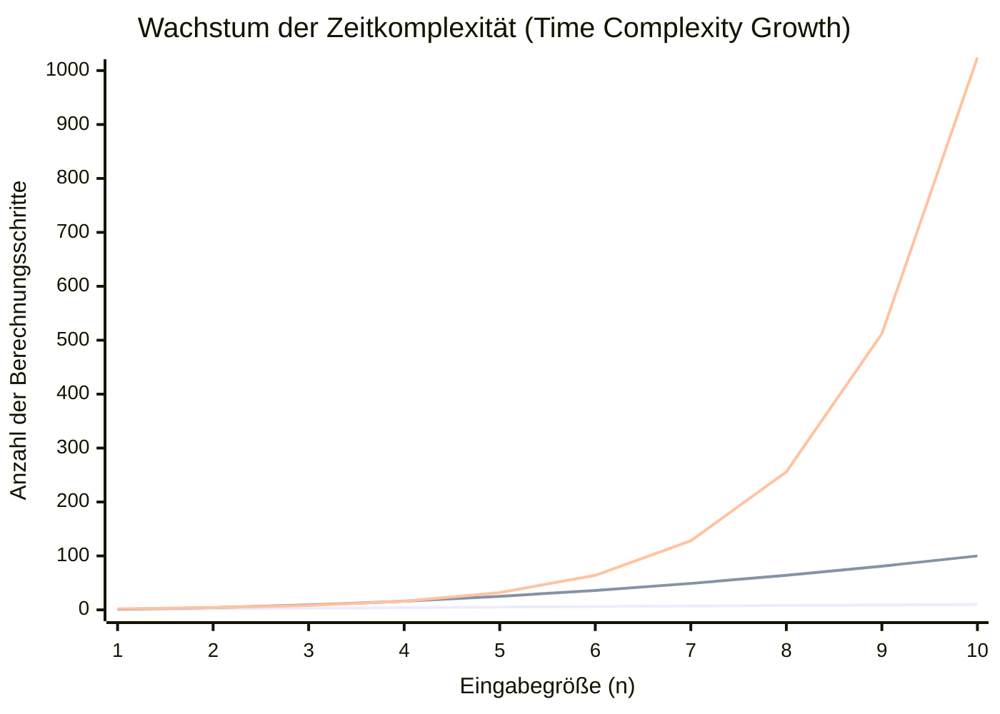
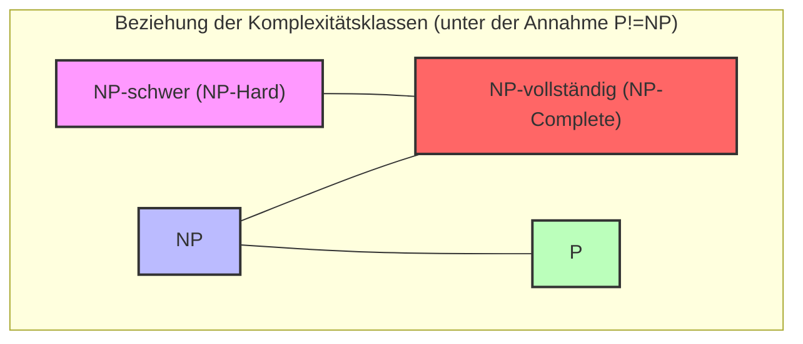
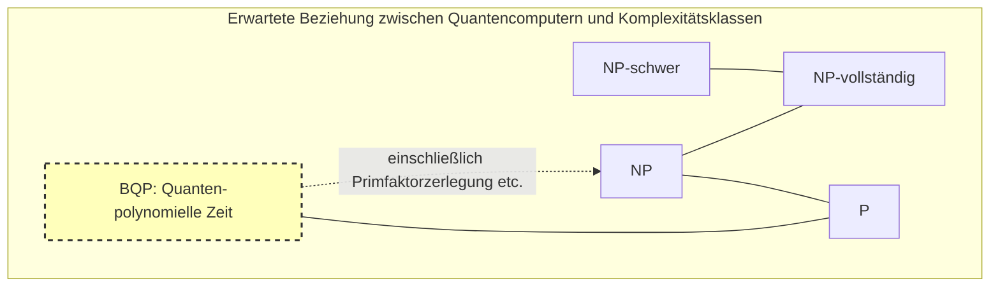

In der Informatik und in der modernen Mathematik gibt es ein ungelöstes Problem, das als das berühmteste und wichtigste gilt. Es ist das **P-vs-NP-Problem** .

Im Jahr 2000 lobte das Clay Mathematics Institute für jedes von sieben ungelösten mathematischen Problemen ein Preisgeld von 1 Million Dollar aus. Diese werden als **Millennium-Probleme** bezeichnet. Während einige, wie die Poincaré-Vermutung, bereits gelöst wurden, ist beim **P-vs-NP-Problem** noch nicht einmal ansatzweise ein Lösungsweg in Sicht.

In diesem Artikel werden wir das gesamte **P-vs-NP-Problem** detailliert und tiefgreifend erklären – von den Grundlagen der Komplexitätsklassen (P, NP, NP-vollständig, NP-schwer) über die praktische Bedeutung für die Programmierung bis hin zu den Auswirkungen auf die Welt, falls es gelöst werden sollte.

---

## 1. Grundlagen der Komplexitätstheorie und Algorithmen

Um das **P-vs-NP-Problem** zu verstehen, müssen wir zunächst das Konzept der „Zeitkomplexität von Algorithmen“ verstehen. Computer führen schrittweise Berechnungen durch, um ein Problem zu lösen. Die **Berechnungskomplexität (Computational Complexity)** zeigt, wie die benötigte Zeit (Anzahl der Schritte) oder der Speicherplatz (Raum) wächst, wenn die Eingabegröße $n$ zunimmt.

### Landau-Notation (Big-O Notation)

Die $O$-Notation wird häufig verwendet, um die Komplexität anzugeben. Sie stellt die Obergrenze der schlechtesten Laufzeit (Worst-Case) für eine Eingabegröße $n$ dar.

- $O(1)$: Konstante Zeit. Unabhängig von der Eingabegröße.
- $O(\log n)$: Logarithmische Zeit. Zum Beispiel binäre Suche.
- $O(n)$: Lineare Zeit. Zum Beispiel einfache Suche.
- $O(n \log n)$: Effiziente Sortieralgorithmen (Quicksort, Mergesort usw.).
- $O(n^2), O(n^3)$: Polynomielle Zeit. Doppelte oder dreifache Schleifen usw.
- $O(2^n)$: Exponentielle Zeit. Zum Beispiel Brute-Force-Suche.
- $O(n!)$: Fakultätszeit. Zum Beispiel einfache Brute-Force-Suche beim Problem des Handlungsreisenden.

Das folgende Diagramm veranschaulicht das Wachstum der Berechnungsschritte in Bezug auf die Eingabegröße.


*(Die unterste Linie zeigt $O(n)$, die mittlere $O(n^2)$ und die oberste $O(2^n)$. Das explosive Wachstum bei exponentieller Zeit ist deutlich erkennbar.)*

In der Komplexitätstheorie wird die durch $O(n^k)$ ($k$ ist eine Konstante) dargestellte Zeit als **polynomielle Zeit (Polynomial Time)** bezeichnet und gilt als Standard für das, was in praktikabler Zeit berechenbar ist. Andererseits gilt eine exponentielle Zeit wie $O(2^n)$ als praktisch „unlösbar“, da die Rechenzeit schon bei $n$ im zweistelligen Bereich die Lebensdauer des Universums überschreiten würde.

---

## 2. Was ist die Klasse P? (In realistischer Zeit „lösbare“ Probleme)

Die **Klasse P (P: Polynomial time)** ist definiert als „die Menge der Entscheidungsprobleme, die von einer deterministischen Turingmaschine in polynomieller Zeit gelöst werden können“.

Einfach gesagt handelt es sich um **„Probleme, bei denen der Computer in realistischer Zeit selbst eine Antwort finden kann“** .

### Typische Probleme der Klasse P

- **Sortierproblem**: Gegebene Zahlen in aufsteigender Reihenfolge sortieren (z. B. $O(n \log n)$).
- **Kürzeste-Wege-Problem**: Den kürzesten Weg zwischen zwei Punkten finden, wie bei einem Navigationssystem (mit dem Dijkstra-Algorithmus in $O(E + V \log V)$).
- **Primzahltest**: Überprüfen, ob eine bestimmte Zahl eine Primzahl ist (es wurde bewiesen, dass dies mit dem AKS-Primzahltest in polynomieller Zeit lösbar ist).

Im Folgenden sehen Sie eine Python-Implementierung des binären Suchalgorithmus, eines typischen Beispiels für die Klasse P.

```python
def binary_search(arr, target):
    """
    Algorithmus zur binären Suche nach einem Zielwert (target) in einem sortierten Array (Beispiel für Klasse P)
    Zeitkomplexität: O(log n)
    """
    left, right = 0, len(arr) - 1
    
    while left <= right:
        mid = (left + right) // 2
        if arr[mid] == target:
            return mid
        elif arr[mid] < target:
            left = mid + 1
        else:
            right = mid - 1
            
    return -1

# Test
sorted_data = [1, 3, 5, 7, 9, 11, 13, 15]
print("Index:", binary_search(sorted_data, 7)) # Output: 3
```

Diese Probleme können skalierbar gelöst werden, da die Rechenzeit nicht explodiert, auch wenn die Eingabegröße wächst.

---

## 3. Was ist die Klasse NP? (In realistischer Zeit „verifizierbare“ Probleme)

Die **Klasse NP (NP: Nondeterministic Polynomial time)** ist definiert als „die Menge der Entscheidungsprobleme, die von einer nichtdeterministischen Turingmaschine in polynomieller Zeit gelöst werden können“ oder, noch verständlicher, **„die Menge von Problemen, bei denen, wenn ein Beweis (eine mögliche Lösung) gegeben ist, in polynomieller Zeit verifiziert werden kann, ob dieser richtig ist“** .

Dies lässt sich auch so formulieren: **„Es mag extrem schwierig sein, die Antwort selbst zu finden, aber wenn einem eine vermeintliche Antwort gegeben wird, kann man sofort überprüfen, ob sie korrekt ist.“**

### Typische Probleme der Klasse NP

- **Sudoku**: Es ist schwierig, das Spielfeld auszufüllen, aber wenn man ein vollständig ausgefülltes Feld erhält, kann man sofort überprüfen, ob keine Regeln verletzt wurden (keine Duplikate in jeder Zeile, Spalte oder jedem Block).
- **Teilmengen-Summenproblem (Subset Sum)**: Kann man durch die Auswahl einiger Zahlen aus einer gegebenen Menge von ganzen Zahlen eine bestimmte Summe erreichen? Das Finden der Lösung erfordert Ausprobieren, aber wenn man den Beweis (die Lösung) „wähle diese und jene aus“ erhält, kann man es einfach durch Addition überprüfen.
- **Problem des Handlungsreisenden (Entscheidungsversion)**: Gibt es eine Route, bei der alle Städte besucht werden und die zurückgelegte Distanz kleiner oder gleich $K$ ist?

Hier ist ein Python-Codebeispiel, das eine Sudoku-Lösung „verifiziert“. Die Verifizierung selbst kann in einer polynomiellen Zeit von $O(n^2)$ durchgeführt werden.

```python
def verify_sudoku_solution(board):
    """
    Überprüft, ob ein ausgefülltes Sudoku-Feld (9x9) korrekt ist (Beispiel für einen Verifizierungsprozess der Klasse NP)
    Zeitkomplexität: O(n^2) - Sehr schnell
    """
    def is_valid_group(group):
        return sorted(list(group)) == [1, 2, 3, 4, 5, 6, 7, 8, 9]

    # Überprüfung von Zeilen und Spalten
    for i in range(9):
        if not is_valid_group(board[i]):
            return False
        if not is_valid_group([board[j][i] for j in range(9)]):
            return False

    # Überprüfung der 3x3-Blöcke
    for i in range(0, 9, 3):
        for j in range(0, 9, 3):
            block = [board[x][y] for x in range(i, i+3) for y in range(j, j+3)]
            if not is_valid_group(block):
                return False

    return True

# Eine gültige Sudoku-Lösung
valid_board = [
    [5,3,4,6,7,8,9,1,2],
    [6,7,2,1,9,5,3,4,8],
    [1,9,8,3,4,2,5,6,7],
    [8,5,9,7,6,1,4,2,3],
    [4,2,6,8,5,3,7,9,1],
    [7,1,3,9,2,4,8,5,6],
    [9,6,1,5,3,7,2,8,4],
    [2,8,7,4,1,9,6,3,5],
    [3,4,5,2,8,6,1,7,9]
]
print("Verifizierungsergebnis:", verify_sudoku_solution(valid_board)) # Output: True
```

**Alle Probleme in P gehören auch zu NP.** Denn wenn man es „selbst in realistischer Zeit lösen kann“, dann ist auch „die Überprüfung, wenn man die Lösung erhält, natürlich in realistischer Zeit möglich“. Mathematisch ausgedrückt sieht das so aus:

$ P \subseteq NP $

---

## 4. Der Kern des P-vs-NP-Problems: Kann „Inspiration“ durch „Anstrengung“ ersetzt werden?

Hier nähern wir uns dem Kern des **P-vs-NP-Problems** , einem der Millennium-Probleme.

Die Fragestellung ist sehr einfach.

> **Sind die Klasse P (in realistischer Zeit lösbare Probleme) und die Klasse NP (in realistischer Zeit verifizierbare Probleme) in Wirklichkeit genau dieselbe Menge? Das heißt, ist $P = NP$ oder $P \neq NP$?**

Intuitiv fühlt es sich so an, als ob **„das Finden der Lösung“** weitaus schwieriger ist als **„die Überprüfung, ob die Lösung richtig ist“** . Wenn man das Lösen eines Sudokus mit der Überprüfung der Antworten vergleicht, ist letzteres offensichtlich einfacher.

Wenn **P = NP** gelten würde, würde dies bedeuten: „Probleme, deren Antworten leicht überprüft werden können, sind eigentlich leicht zu lösen, sobald man weiß, wie.“ Da dies der menschlichen Intuition stark widerspricht, geht die überwiegende Mehrheit der heutigen Mathematiker und Informatiker (über 90 % in Umfragen) davon aus, dass **$P \neq NP$** ist. Allerdings hat dies noch niemand mathematisch beweisen können.

---

## 5. NP-vollständig und NP-schwer (Die schwierigsten Probleme des Universums)

Um dieses Problem zu verstehen, sind die Konzepte von **NP-vollständig (NP-Complete)** und **NP-schwer (NP-Hard)** unerlässlich.

### Polynomielle Reduktion (Polynomial-time Reduction)
Angenommen, es gibt ein Programm, das Problem $A$ löst. Wenn wir Problem $B$ lösen wollen und die Eingabe für Problem $B$ schnell (in polynomieller Zeit) in eine Eingabe für Problem $A$ umwandeln können, das Programm für Problem $A$ verwenden, um eine Lösung zu generieren, und dann das Ergebnis schnell wieder in eine Lösung für Problem $B$ umwandeln können, dann können wir sagen: „Problem $B$ ist nicht schwerer als Problem $A$“. Dies wird als **polynomielle Reduktion** bezeichnet.

### NP-schwer (NP-Hard)
Eine Klasse von Problemen, auf die jedes **jedes** Problem in der Klasse NP in polynomieller Zeit reduziert werden kann. Das heißt, es sind „Probleme, die mindestens genauso schwer oder schwerer sind als jedes Problem in NP“. NP-schwere Probleme müssen nicht einmal Entscheidungsprobleme sein.

### NP-vollständig (NP-Complete)
Eine Klasse von Problemen, die NP-schwer sind und gleichzeitig selbst zur Klasse NP gehören. Dies bedeutet **„die Sammlung der schwierigsten Probleme innerhalb der Klasse NP“** .



Erstaunlicherweise wurde 1971 von Stephen Cook und Leonid Levin bewiesen, dass das **Erfüllbarkeitsproblem der Aussagenlogik (SAT)** NP-vollständig ist (Satz von Cook und Levin).

Danach bewies Richard Karp nacheinander, dass viele Optimierungsprobleme aus der realen Welt, wie das Problem des Handlungsreisenden, das Rucksackproblem oder das Graphenfärbungsproblem, **NP-vollständig** sind (Karps 21 NP-vollständige Probleme).

**Die größte Eigenschaft von NP-vollständigen Problemen ist: „Wenn auch nur für ein einziges NP-vollständiges Problem ein Algorithmus gefunden wird, der es in polynomieller Zeit löst, können alle NP-Probleme in polynomieller Zeit gelöst werden (das heißt $P = NP$).“**
Dies kann als der ultimative Dominoeffekt in der Informatik betrachtet werden.

---

## 6. Konkreter Vergleich und Implementierung in der Programmierung

Hier vergleichen wir „Probleme, die sich ähneln, deren Schwierigkeitsgrad jedoch völlig unterschiedlich ist“ und erklären die Hürden, auf die Programmierer stoßen.

### Eulerkreis (Klasse P) vs. Hamiltonkreis (NP-vollständig)

- **Eulerkreis**: Die Suche nach einer Route, bei der jede „Kante“ genau einmal durchlaufen wird und man zum Ausgangsknoten zurückkehrt (Haus vom Nikolaus). Dies kann in polynomieller Zeit von $O(V+E)$ gelöst werden, indem man einfach den Grad jedes Knotens überprüft.
- **Hamiltonkreis**: Die Suche nach einer Route, bei der jeder „Knoten“ genau einmal besucht wird und man zum Ausgangsknoten zurückkehrt (die Grundlage des Problems des Handlungsreisenden). Mit nur einer leichten Änderung der Bedingungen wird dies **NP-vollständig**, und es wurde kein effizienter Algorithmus dafür gefunden.

### Beispiel für die Implementierung des Problems des Handlungsreisenden (TSP) und Näherungsalgorithmen

Wenn man versucht, das Problem des Handlungsreisenden (in seiner Optimierungsversion), das NP-schwer ist, exakt zu lösen, explodiert die Rechenzeit. Lassen Sie uns im folgenden Python-Code eine exakte Lösung (Brute-Force) und eine praktische Näherungslösung (Greedy-Algorithmus) vergleichen.

```python
import itertools
import math

def calculate_distance(city1, city2):
    return math.hypot(city1[0]-city2[0], city1[1]-city2[1])

# 1. Exakte Lösung (Brute-Force) - Zeitkomplexität: O(N!)
def tsp_brute_force(cities):
    n = len(cities)
    best_dist = float('inf')
    best_path = None
    
    # Die erste Stadt fixieren und alle Permutationen der restlichen Städte ausprobieren
    for perm in itertools.permutations(range(1, n)):
        path = (0,) + perm
        dist = 0
        for i in range(n):
            dist += calculate_distance(cities[path[i]], cities[path[(i+1)%n]])
        
        if dist < best_dist:
            best_dist = dist
            best_path = path
            
    return best_dist, best_path

# 2. Näherungslösung (Greedy-Algorithmus) - Zeitkomplexität: O(N^2)
def tsp_greedy(cities):
    n = len(cities)
    unvisited = set(range(1, n))
    current_city = 0
    path = [0]
    total_dist = 0
    
    while unvisited:
        # Die nächste unbesuchte Stadt suchen
        next_city = min(unvisited, key=lambda city: calculate_distance(cities[current_city], cities[city]))
        total_dist += calculate_distance(cities[current_city], cities[next_city])
        current_city = next_city
        path.append(current_city)
        unvisited.remove(current_city)
        
    # Zurück zur ersten Stadt
    total_dist += calculate_distance(cities[current_city], cities[0])
    return total_dist, path

# Testausführung
cities = [(0, 0), (1, 5), (5, 2), (6, 6), (8, 3), (2, 9), (9, 9)]

dist_exact, path_exact = tsp_brute_force(cities)
dist_greedy, path_greedy = tsp_greedy(cities)

print(f"Exakte Lösung: Distanz {dist_exact:.2f}, Route {path_exact}")
print(f"Näherungslösung: Distanz {dist_greedy:.2f}, Route {path_greedy}")
```

Wenn die Anzahl der Städte $N=20$ überschreitet, benötigt die exakte Lösung (Brute-Force) selbst auf modernen Supercomputern in etwa die Lebensdauer des Universums. Wenn man jedoch einen Näherungsalgorithmus wie den Greedy-Algorithmus verwendet, kann man **eine vielleicht nicht optimale, aber dennoch recht gute Lösung** in einem Bruchteil einer Sekunde erhalten. Sobald ein Programmierer erkennt, dass ein Problem NP-schwer ist, muss er die Entwurfsentscheidung treffen, die Suche nach einer exakten Lösung aufzugeben und sich Heuristiken oder Näherungsalgorithmen zuzuwenden.

---

## 7. Was wäre, wenn P = NP wäre?

Heutzutage nutzen kryptographische Systeme weltweit (wie SSL/TLS für Online-Shopping oder Blockchains wie Bitcoin) die Asymmetrie aus: **„Das Lösen dauert extrem lange, aber die Überprüfung erfolgt sofort“** .

Die Primfaktorzerlegung, die die Grundlage der RSA-Verschlüsselung bildet, ist ein solches Beispiel.
Nehmen wir an, jemand würde beweisen, dass $P = NP$, und einen magischen Algorithmus (konstruktiver Beweis) entwickeln, der NP-Probleme in polynomieller Zeit löst. Dies würde einen **Paradigmenwechsel für die menschliche Gesellschaft** auslösen:

1. **Zusammenbruch der Kryptographie**: Moderne Public-Key-Kryptosysteme wie RSA oder elliptische Kurven wären sofort gebrochen, und die digitale Sicherheit würde vollständig zusammenbrechen.
2. **Die ultimative Evolution von KI und maschinellem Lernen**: Die optimale Gewichtung neuronaler Netze oder die optimale Strategie für Reinforcement Learning könnten sofort berechnet werden.
3. **Ein Sprung in der Wirkstoffforschung und den Biowissenschaften**: Die Proteinfaltung (die sich ebenfalls auf ein NP-schweres Problem reduzieren lässt) könnte augenblicklich berechnet werden, und KI würde am laufenden Band Wundermittel gegen unheilbare Krankheiten entwickeln.
4. **Vollständige Optimierung von Logistik und Produktion**: Es entstünde die ultimative Lieferkette ohne jegliche Verschwendung, wodurch die meisten Energieprobleme gelöst würden.

Wie der Mathematiker Scott Aaronson sagte: „Wenn $P = NP$ wäre, gäbe es so etwas wie einen kreativen Sprung in der Welt nicht, und Inspiration und geniale Intuition könnten alle durch mechanische Berechnungen ersetzt werden.“ Es handelt sich also um ein Problem, das sogar philosophische Bedeutung hat.

---

## 8. Quantencomputer und das P-vs-NP-Problem

In den letzten Jahren hat das Aufkommen von Quantencomputern zu dem Missverständnis geführt: „Könnten Quantencomputer nicht NP-vollständige Probleme lösen?“

In der Komplexitätstheorie wird die Klasse der Probleme, die ein Quantencomputer in polynomieller Zeit lösen kann, als **BQP (Bounded-error Quantum Polynomial time)** bezeichnet. Durch den von Peter Shor entwickelten „[Shor-Algorithmus](https://kenji.blog/de/p/quantum-computing-shors-algorithm/)“ wurde bewiesen, dass die Primfaktorzerlegung zu BQP gehört (sie kann von einem Quantencomputer schnell gelöst werden).

Der aktuelle Konsens in der Informatikgemeinschaft ist jedoch, dass **$NP-vollständig \subseteq BQP$ nicht als wahrscheinlich gilt**.
Das bedeutet, dass man davon ausgeht, dass selbst Quantencomputer NP-vollständige Probleme wie das Problem des Handlungsreisenden oder das Rucksackproblem nicht in polynomieller Zeit lösen können. Ein Quantencomputer ist kein Zauberstab, sondern eine Maschine, die nur bei Problemen mit spezifischen mathematischen Strukturen (wie dem Finden von Periodizitäten) eine überwältigende Geschwindigkeit zeigt.


*(Es wird angenommen, dass die BQP-Klasse P enthält und einen Teil von NP (wie die Primfaktorzerlegung) lösen kann, jedoch nicht alle NP-vollständigen Probleme umfasst.)*

---

## 9. Bedeutung für Ingenieure und Programmierer und wie man damit umgeht

Die meisten geschäftlichen Probleme, mit denen wir Software-Ingenieure täglich konfrontiert sind (Schichtplanung, Optimierung von Lieferrouten, Zuweisung von Cloud-Ressourcen, Packprobleme), sind **NP-schwer**.

Wenn die Geschäftsseite von Ihnen verlangt: „Bauen Sie uns ein System, das die optimale Lösung für dieses Problem liefert“, und Sie keine Kenntnisse der Komplexitätstheorie haben, werden Sie ein Programm schreiben, das niemals endet, und damit den Server zum Absturz bringen.

Die größte Lektion, die das **P-vs-NP-Problem** (und die Theorie der NP-Vollständigkeit) einem Programmierer erteilt, ist Folgendes:

1. **Den Schwierigkeitsgrad des Problems erkennen**: Wenn bewiesen (oder vermutet) werden kann, dass das Problem, mit dem man konfrontiert ist, NP-schwer ist, sollte man aufhören, nach einem Algorithmus zu suchen, der die perfekte Optimallösung liefert.
2. **Auf Relaxationen und Annäherungen ausweichen**:
    - **Näherungsalgorithmen**: In polynomieller Zeit lösen und dabei garantieren, dass der Fehler im Vergleich zur Optimallösung innerhalb eines bestimmten Bereichs bleibt.
    - **Heuristiken**: Mathematisch nicht garantierte, aber erfahrungsgemäß schnelle Methoden einsetzen, die eine „recht gute Lösung“ liefern, wie z. B. genetische Algorithmen oder Simulated Annealing.
    - **Dynamische Programmierung (DP)**: Wenn es wie beim Rucksackproblem einen Lösungsansatz gibt, der von der Größe der Eingabewerte abhängt (pseudo-polynomielle Zeit), sollte man die Beschränkungen der Eingabe ausnutzen.
    - **SAT-Solver / MILP-Solver**: Das Problem formalisieren und an die sich rasant entwickelnden universellen mathematischen Optimierungssolver übergeben. Da diese Solver intern hochgradig optimiertes Pruning (Abschneiden von Ästen im Suchbaum) durchführen, können sie für praxisrelevante Größen oft exakte Lösungen liefern.

```python
# Lösung des 0-1-Rucksackproblems mit dynamischer Programmierung (Beispiel für pseudo-polynomielle Zeit)
def knapsack_dp(weights, values, capacity):
    """
    Ein Beispiel, das NP-schwer ist, aber mit DP in pseudo-polynomieller Zeit O(N*W) gelöst werden kann
    """
    n = len(weights)
    # dp[i][w] : Der maximale Wert, der mit den ersten i Elementen erreicht werden kann, wenn das Gewicht maximal w ist
    dp = [[0] * (capacity + 1) for _ in range(n + 1)]
    
    for i in range(1, n + 1):
        for w in range(1, capacity + 1):
            if weights[i-1] <= w:
                # Das Maximum zwischen dem Hinzufügen und dem Nicht-Hinzufügen des Elements wählen
                dp[i][w] = max(dp[i-1][w], dp[i-1][w-weights[i-1]] + values[i-1])
            else:
                dp[i][w] = dp[i-1][w]
                
    return dp[n][capacity]

weights = [2, 3, 4, 5]
values = [3, 4, 5, 6]
capacity = 5
print(f"Maximaler Wert des Rucksacks: {knapsack_dp(weights, values, capacity)}")
```

---

## Fazit: Die Herausforderung an die Grenzen des menschlichen Intellekts

Das **P-vs-NP-Problem** ist nicht nur ein einfaches mathematisches Rätsel. Es ist eine großartige philosophische Frage, die die Grenzen des menschlichen Intellekts auslotet: „Was ist effiziente Berechnung?“, „Können mathematische Beweise automatisiert werden?“ und „Kann Inspiration algorithmisiert werden?“.

Das Preisgeld von 1 Million Dollar des Clay Mathematics Institute mag angesichts der Bedeutung dieses Problems fast schon zu gering erscheinen. Wenn Sie den Beweisalgorithmus für $P = NP$ vollenden, könnten Sie schließlich alle Kryptowährungen auf Ihre eigene Wallet überweisen, noch bevor Sie das Preisgeld erhalten (obwohl dies ethisch natürlich absolut inakzeptabel ist).

Wird es durch zukünftige Forschungsdurchbrüche zu unseren Lebzeiten eine Entscheidung in dieser Frage geben? Oder wird, ähnlich wie bei Gödels Unvollständigkeitssatz, bewiesen werden, dass „weder ein Beweis noch eine Widerlegung möglich ist“? Die Frontlinien der Komplexitätstheorie werden auch in Zukunft faszinierend bleiben.

> **Referenzen / Weiterführende Links**
> - Millennium-Probleme des Clay Mathematics Institute (Clay Mathematics Institute)
> - Stephen Cook "The Complexity of Theorem-Proving Procedures" (1971)
> - Richard Karp "Reducibility Among Combinatorial Problems" (1972)
> - Michael Sipser "Introduction to the Theory of Computation"
