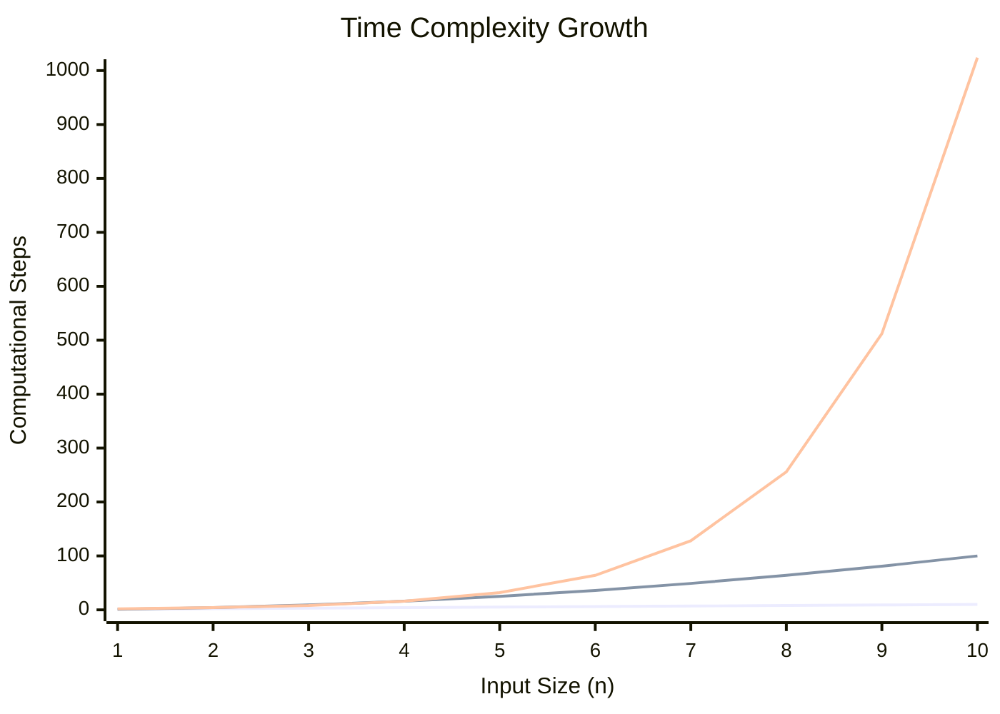
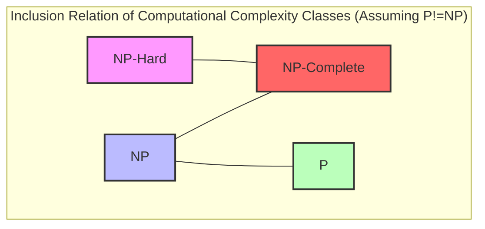
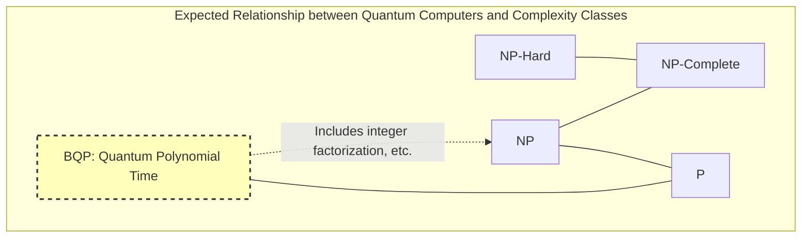

In computer science, and in modern mathematics, there is an unsolved problem that is considered the most famous and most important. That is the **P vs NP problem**.

In the year 2000, the Clay Mathematics Institute offered a $1 million prize for each of seven unsolved mathematical problems. These are called the **Millennium Prize Problems**. While some, like the Poincaré conjecture, have already been solved, the **P vs NP problem** has yet to see even a complete clue towards its resolution.

In this article, we will thoroughly explore the full picture of this **P vs NP problem**, from the basics of computational complexity classes (P, NP, NP-Complete, NP-Hard) to its practical significance in programming, and even the impact it would have on the world if it were to be solved.

---

## 1. Basics of Complexity Theory and Algorithms

To understand the **P vs NP problem**, we first need to understand the concept of "algorithmic complexity." A computer performs step-by-step calculations to solve a problem, and **Computational Complexity** indicates how the required time (number of steps) or memory (space) increases as the input size $n$ grows.

### Big-O Notation

The $O$ notation is often used to indicate complexity. This represents the upper bound of the worst-case complexity relative to the input size $n$.

- $O(1)$: Constant time. Independent of input size.
- $O(\log n)$: Logarithmic time. e.g., Binary search.
- $O(n)$: Linear time. e.g., Simple search.
- $O(n \log n)$: Efficient sorting algorithms (Quick sort, Merge sort, etc.).
- $O(n^2), O(n^3)$: Polynomial time. Double loops, triple loops, etc.
- $O(2^n)$: Exponential time. Brute-force search, etc.
- $O(n!)$: Factorial time. Simple brute-force for the Traveling Salesperson Problem, etc.

The following graph visualizes the growth rate of computational steps relative to the input size.


*(The bottom shows $O(n)$, the middle is $O(n^2)$, and the top is $O(2^n)$. You can see the explosive growth of exponential time.)*

In complexity theory, time expressed as $O(n^k)$ (where $k$ is a constant) is called **Polynomial Time**, and is considered a criterion for a problem being computable in a practical amount of time. On the other hand, exponential time like $O(2^n)$ is practically considered "unsolvable" because even if $n$ is just a few dozen, the computation time would exceed the lifespan of the universe.

---

## 2. What is Class P? (Problems that can be "solved" in realistic time)

**Class P (P: Polynomial time)** is defined as "the set of decision problems that can be solved by a deterministic Turing machine in polynomial time."

Put simply, they are **"problems where a computer can figure out the answer on its own in a realistic amount of time."**

### Representative Problems in Class P

- **Sorting Problem**: Rearranging given numbers in ascending order (e.g., $O(n \log n)$).
- **Shortest Path Problem**: Finding the shortest route between two points, like a car navigation system (solved in $O(E + V \log V)$ using [Dijkstra](https://kenji.blog/en/p/graph-theory-dijkstra-a-star/)'s algorithm).
- **Primality Testing Problem**: Determining whether a certain number is a prime number (proven to be solvable in polynomial time by the AKS primality test).

Below is a Python implementation of the binary search algorithm, a representative example of Class P.

```python
def binary_search(arr, target):
    """
    Algorithm to perform binary search for target in a sorted array (Example of Class P)
    Time Complexity: O(log n)
    """
    left, right = 0, len(arr) - 1
    
    while left <= right:
        mid = (left + right) // 2
        if arr[mid] == target:
            return mid
        elif arr[mid] < target:
            left = mid + 1
        else:
            right = mid - 1
            
    return -1

# Test
sorted_data = [1, 3, 5, 7, 9, 11, 13, 15]
print("Index:", binary_search(sorted_data, 7)) # Output: 3
```

For these problems, the computational complexity does not explode even if the input size increases, and they can be solved scalably.

---

## 3. What is Class NP? (Problems that can be "verified" in realistic time)

**Class NP (NP: Nondeterministic Polynomial time)** is defined as "the set of decision problems that can be solved by a nondeterministic Turing machine in polynomial time," or more comprehensibly, **"the set of problems where, given evidence (a supposed solution), its correctness can be verified in polynomial time."**

This can be rephrased as **"It might be extremely difficult to find the answer on your own, but if you are handed something that looks like the answer, you can instantly check whether it is correct or not."**

### Representative Problems in Class NP

- **Sudoku**: Filling the board is difficult, but if you are handed a fully filled board, you can instantly check if any rules are violated (no duplicates in each row, column, or block).
- **Subset Sum Problem**: Can you select a few numbers from a given set of integers to make the sum a specific number? Finding the solution requires a brute-force approach, but if you are handed the evidence ("choose this and this"), you can verify it simply by adding them up.
- **Traveling Salesperson Problem (Decision version)**: Is there a route that visits all cities and returns, with a total distance of $K$ or less?

Below is an example of Python code that "verifies" a Sudoku solution. The verification itself can be done in $O(n^2)$ polynomial time.

```python
def verify_sudoku_solution(board):
    """
    Verify whether a completed Sudoku board (9x9) is correct (Example of Class NP verification process)
    Time Complexity: O(n^2) - Very fast
    """
    def is_valid_group(group):
        return sorted(list(group)) == [1, 2, 3, 4, 5, 6, 7, 8, 9]

    # Verify rows and columns
    for i in range(9):
        if not is_valid_group(board[i]):
            return False
        if not is_valid_group([board[j][i] for j in range(9)]):
            return False

    # Verify 3x3 blocks
    for i in range(0, 9, 3):
        for j in range(0, 9, 3):
            block = [board[x][y] for x in range(i, i+3) for y in range(j, j+3)]
            if not is_valid_group(block):
                return False

    return True

# Valid Sudoku solution
valid_board = [
    [5,3,4,6,7,8,9,1,2],
    [6,7,2,1,9,5,3,4,8],
    [1,9,8,3,4,2,5,6,7],
    [8,5,9,7,6,1,4,2,3],
    [4,2,6,8,5,3,7,9,1],
    [7,1,3,9,2,4,8,5,6],
    [9,6,1,5,3,7,2,8,4],
    [2,8,7,4,1,9,6,3,5],
    [3,4,5,2,8,6,1,7,9]
]
print("Verification Result:", verify_sudoku_solution(valid_board)) # Output: True
```

**All problems belonging to P also belong to NP.** This is because if you can "solve it on your own in a realistic amount of time," it goes without saying that "checking the solution when handed one can also be done in a realistic amount of time." Expressed mathematically, it looks like this:

$ P \subseteq NP $

---

## 4. The Core of the P vs NP Problem: Can "Inspiration" be Replaced by "Effort"?

Here we finally approach the core of the **P vs NP problem**, the Millennium Prize Problem.

The problem is very simple.

> **Are Class P (problems that can be solved in a realistic time) and Class NP (problems that can be verified in a realistic time) actually not the exact same set? Namely, is $P = NP$ or $P \neq NP$?**

Intuitively, between **"finding the solution"** and **"checking if the solution is correct"**, the former feels overwhelmingly more difficult. Comparing solving a Sudoku puzzle to checking the answers, checking the answers is easier, right?

If **P = NP**, it would mean that "problems where the answers can be easily checked can actually be easily solved if you know how." Because this goes so strongly against human intuition, the vast majority of modern mathematicians and computer scientists (over 90% in surveys) expect that **$P \neq NP$**. However, no one has yet been able to mathematically prove this.

---

## 5. NP-Complete and NP-Hard (The Hardest Problems in the Universe)

Concepts essential to understanding this problem are **NP-Complete** and **NP-Hard**.

### Polynomial-time Reduction
Suppose we have a program that solves problem $A$. When we want to solve problem $B$, if we can quickly (in polynomial time) convert the input of problem $B$ into the input of problem $A$, use problem $A$'s program to output a solution, and quickly convert that result into the solution for problem $B$, we can say "problem $B$ is not harder than problem $A$." This is called **Polynomial-time Reduction**.

### NP-Hard
This is a class of problems to which **all** problems belonging to Class NP can be reduced in polynomial time. In other words, they are "problems that are at least as hard as, or harder than, any problem in NP." NP-Hard problems do not even have to be decision problems.

### NP-Complete
This is a class of problems that are NP-Hard and also themselves belong to Class NP. This means **"the collection of the hardest problems within Class NP."**



Amazingly, in 1971, Stephen Cook and Leonid Levin proved that the **Boolean Satisfiability Problem (SAT)** is NP-Complete (the Cook-Levin theorem).

Subsequently, Richard Karp proved one after another that many real-world optimization problems, such as the Traveling Salesperson Problem, Knapsack Problem, and [Graph](https://kenji.blog/en/p/tree-graph-data-structures-search-dfs-bfs-dijkstra/) Coloring Problem, are **NP-Complete** (Karp's 21 NP-complete problems).

**The greatest property of NP-Complete problems is that "if an algorithm is found that can solve even one NP-Complete problem in polynomial time, then all NP problems can be solved in polynomial time (i.e., $P = NP$)."** 
This can be described as the ultimate domino effect in computer science.

---

## 6. Specific Comparisons and Implementation in Programming

Here, we will compare "problems that look similar but have completely different difficulties" and explain the walls programmers face.

### Eulerian Circuit (Class P) vs Hamiltonian Circuit (NP-Complete)

- **Eulerian Circuit**: Finding a route that passes through every "edge" exactly once and returns to the starting vertex (unicursal drawing). This can be solved in $O(V+E)$ polynomial time simply by checking the degree of each vertex.
- **Hamiltonian Circuit**: Finding a route that passes through every "vertex" exactly once and returns to the starting vertex (the foundation of the Traveling Salesperson Problem). By slightly changing the conditions, this becomes **NP-Complete**, and no efficient algorithm has been found.

### Implementation Example of the Traveling Salesperson Problem (TSP) and Approximation Algorithms

If you try to strictly solve the Traveling Salesperson Problem, which is NP-Hard (in its optimization version), the computational complexity explodes. Let's compare an exact solution (brute-force) and a practical approximate solution (greedy algorithm) using the Python code below.

```python
import itertools
import math

def calculate_distance(city1, city2):
    return math.hypot(city1[0]-city2[0], city1[1]-city2[1])

# 1. Exact Solution (Brute-force) - Time Complexity: O(N!)
def tsp_brute_force(cities):
    n = len(cities)
    best_dist = float('inf')
    best_path = None
    
    # Fix the first city and try all permutations of the remaining cities
    for perm in itertools.permutations(range(1, n)):
        path = (0,) + perm
        dist = 0
        for i in range(n):
            dist += calculate_distance(cities[path[i]], cities[path[(i+1)%n]])
        
        if dist < best_dist:
            best_dist = dist
            best_path = path
            
    return best_dist, best_path

# 2. Approximate Solution (Greedy Algorithm) - Time Complexity: O(N^2)
def tsp_greedy(cities):
    n = len(cities)
    unvisited = set(range(1, n))
    current_city = 0
    path = [0]
    total_dist = 0
    
    while unvisited:
        # Find the nearest unvisited city
        next_city = min(unvisited, key=lambda city: calculate_distance(cities[current_city], cities[city]))
        total_dist += calculate_distance(cities[current_city], cities[next_city])
        current_city = next_city
        path.append(current_city)
        unvisited.remove(current_city)
        
    # Return to the first city
    total_dist += calculate_distance(cities[current_city], cities[0])
    return total_dist, path

# Test execution
cities = [(0, 0), (1, 5), (5, 2), (6, 6), (8, 3), (2, 9), (9, 9)]

dist_exact, path_exact = tsp_brute_force(cities)
dist_greedy, path_greedy = tsp_greedy(cities)

print(f"Exact Solution: Distance {dist_exact:.2f}, Route {path_exact}")
print(f"Approximate Solution: Distance {dist_greedy:.2f}, Route {path_greedy}")
```

When the number of cities $N$ exceeds 20, the exact solution (brute-force) takes a time comparable to the lifespan of the universe, even on modern supercomputers. However, by using an approximation algorithm like the greedy method, you can instantly output a **solution that may not be optimal, but is reasonably good**. Programmers are required to make the design judgment to abandon exact solutions and steer toward heuristics or approximation algorithms once they recognize a problem is NP-Hard.

---

## 7. What Would the World Be Like If P = NP?

Currently, cryptography systems around the world (like SSL/TLS used in online shopping, or blockchains like Bitcoin) utilize the asymmetry that **"solving it takes an immense amount of time, but verifying it can be done instantly."**

Integer factorization, the foundation of [RSA](https://kenji.blog/en/p/modern-cryptography-public-key-hash-signature/) encryption, is one of them.
Suppose someone proved $P = NP$ and constructed a magic algorithm (constructive proof) that solves NP problems in polynomial time. That would trigger a **paradigm shift in human society** such as the following:

1. **Collapse of [Cryptography](https://kenji.blog/en/p/modern-cryptography-public-key-hash-signature/)**: Modern public-key cryptography systems like RSA and elliptic-curve cryptography would all be instantly broken, and digital security would completely collapse.
2. **Ultimate Evolution of AI and Machine Learning**: Optimal weighting of neural networks and optimal strategies for reinforcement learning could be calculated instantly.
3. **Leaps in Drug Discovery and Life Sciences**: Protein folding structures (which also reduce to NP-Hard problems) could be calculated instantly, and silver bullets for incurable diseases would be developed one after another by AI.
4. **Perfect Optimization of Logistics and Production**: The ultimate supply chain with all waste eliminated would be constructed, resolving the majority of energy problems.

As mathematician Scott Aaronson said, "If $P = NP$, then the world would be a profoundly different place than we usually assume it to be. There would be no special value in 'creative leaps,' no fundamental gap between solving a problem and recognizing the solution once it's found," making it a problem that even carries philosophical meaning.

---

## 8. Quantum Computers and the P vs NP Problem

In recent years, with the emergence of quantum computers, a misconception has spread that "quantum computers can solve NP-Complete problems, right?"

In computational complexity theory, the class of problems that a quantum computer can solve in polynomial time is called **BQP (Bounded-error Quantum Polynomial time)**. Through "Shor's algorithm" devised by Peter Shor, it was proved that integer factorization belongs to BQP (can be solved quickly by a quantum computer).

However, in the current consensus of the computer science community, **it is not considered that $\text{NP-Complete} \subseteq BQP$**.
In other words, even quantum computers are thought to be unable to solve NP-Complete problems like the Traveling Salesperson Problem or the Knapsack Problem in polynomial time. A quantum computer is not a magic wand, but a machine that demonstrates overwhelming speed only for problems with specific mathematical structures (like period finding).


*(The BQP class contains P and can solve parts of NP (like integer factorization), but it is expected that it does not contain all NP-Complete problems.)*

---

## 9. Significance and Approach for Engineers and Programmers

The business challenges we software engineers face on a daily basis (shift scheduling, delivery route optimization, cloud resource allocation, packing problems) are mostly **NP-Hard** problems.

When requested by the business side to "build a system that produces the optimal solution for this problem," if you do not have knowledge of computational complexity theory, you will write a program that never ends and end up crashing the server.

The greatest lessons that the **P vs NP problem** (and the theory of NP-Completeness) teach programmers are as follows:

1. **Recognize the difficulty of the problem**: If you can prove (or infer) that the problem you are facing is NP-Hard, abandon the quest for an algorithm that seeks a perfect optimal solution.
2. **Escape to relaxation and approximation**:
    - **Approximation Algorithms**: Solve in polynomial time while guaranteeing the error from the optimal solution falls within a certain range.
    - **Heuristics**: Adopt methods like genetic algorithms or simulated annealing that have no mathematical guarantees but empirically produce "reasonably good solutions" quickly.
    - **[Dynamic Programming](https://kenji.blog/en/p/dynamic-programming-dp-introduction-knapsack-fibonacci/) ([DP](https://kenji.blog/en/p/dynamic-programming-dp-introduction-knapsack-fibonacci/))**: If a solution exists that depends on the magnitude of the input numbers (pseudo-polynomial time), such as in the Knapsack Problem, utilize the constraints of the input.
    - **SAT Solvers / MILP Solvers**: Formulate and throw it to general-purpose mathematical optimization solvers, which have been developing remarkably in recent years. Because solvers perform advanced pruning internally, they can often produce exact solutions if it is of a practical size.

```python
# Solving the 0-1 Knapsack Problem using Dynamic Programming (Example of pseudo-polynomial time)
def knapsack_dp(weights, values, capacity):
    """
    Example that is NP-Hard but can be solved in pseudo-polynomial time O(N*W) using DP
    """
    n = len(weights)
    # dp[i][w] : Maximum value when up to the i-th item is chosen with weight w or less
    dp = [[0] * (capacity + 1) for _ in range(n + 1)]
    
    for i in range(1, n + 1):
        for w in range(1, capacity + 1):
            if weights[i-1] <= w:
                # Take the maximum between including and not including the item
                dp[i][w] = max(dp[i-1][w], dp[i-1][w-weights[i-1]] + values[i-1])
            else:
                dp[i][w] = dp[i-1][w]
                
    return dp[n][capacity]

weights = [2, 3, 4, 5]
values = [3, 4, 5, 6]
capacity = 5
print(f"Maximum knapsack value: {knapsack_dp(weights, values, capacity)}")
```

---

## Conclusion: A Challenge to the Limits of Human Intellect

The **P vs NP problem** is not merely a math puzzle. It is a grand philosophical question asking the limits of human intellect, questioning "what is efficient computation?", "can mathematical proofs be automated?", and "can inspiration be algorithmized?"

Considering the importance of this problem, the $1 million prize from the Clay Mathematics Institute might be too cheap. If you complete the proof algorithm for $P = NP$, you could even transfer all cryptocurrencies to your wallet before claiming the prize money (though, ethically, you absolutely must not do that).

Will we see the resolution of this problem within our lifetime through future research breakthroughs? Or will it be proven that "it is impossible to prove or disprove," just like Gödel's incompleteness theorems? We must keep our eyes on the front lines of computational complexity theory.

> **References / Related Links**
> - Millennium Prize Problems (Clay Mathematics Institute)
> - Stephen Cook "The Complexity of Theorem-Proving Procedures" (1971)
> - Richard Karp "Reducibility Among Combinatorial Problems" (1972)
> - Michael Sipser "Introduction to the Theory of Computation"
