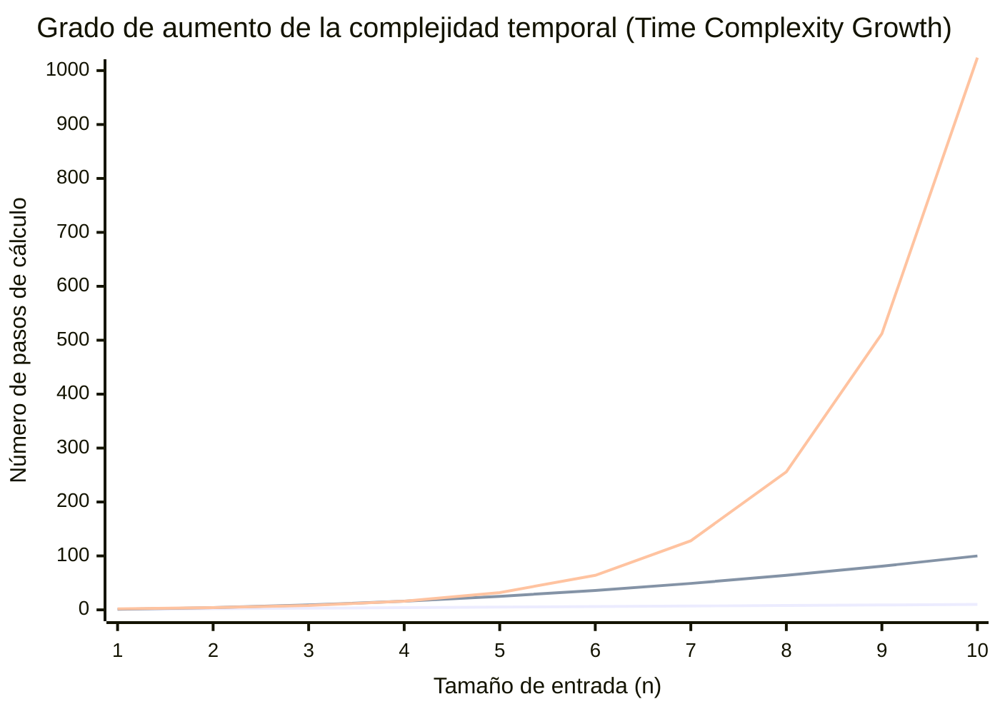
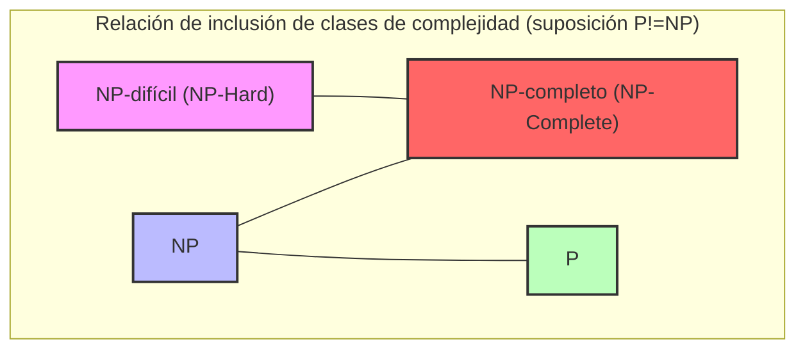
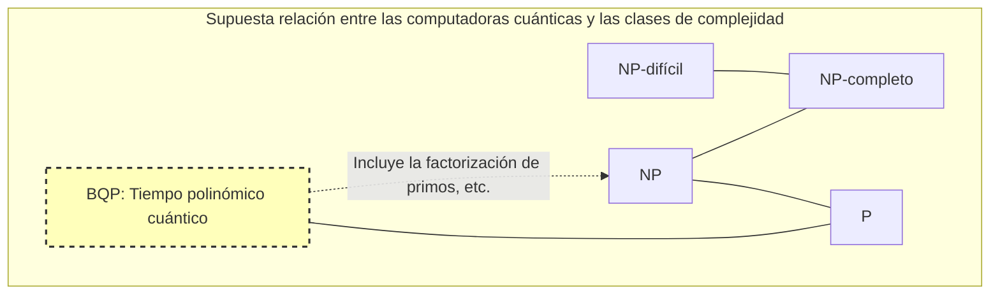

En ciencias de la computación, y en las matemáticas modernas, existe un problema no resuelto que es considerado el más famoso y, a la vez, el más importante. Se trata del **problema P vs NP**.

En el año 2000, el Instituto de Matemáticas Clay ofreció un premio de 1 millón de dólares por cada uno de los 7 problemas matemáticos no resueltos. A estos se les conoce como los **Problemas del Milenio**. Aunque algunos, como la conjetura de Poincaré, ya han sido resueltos, el **problema P vs NP** aún no tiene ni siquiera una pista clara para su solución completa.

En este artículo, profundizaremos en el panorama completo de este **problema P vs NP**, desde los fundamentos de las clases de complejidad computacional (P, NP, NP-completo, NP-difícil), pasando por su importancia práctica en la programación, hasta el impacto mundial que tendría en caso de ser resuelto.

---

## 1. Teoría de la complejidad y fundamentos de los algoritmos

Para entender el **problema P vs NP**, primero es necesario comprender el concepto de «complejidad de un algoritmo». Para que una computadora resuelva un problema, realiza cálculos paso a paso; la **complejidad computacional (Computational Complexity)** indica cómo aumentan el tiempo (número de pasos) y la memoria (espacio) requeridos para el cálculo a medida que el tamaño de entrada $n$ se hace más grande.

### Notación de Landau (Big-O Notation)

Al indicar la complejidad computacional, se suele utilizar la notación $O$. Esta representa el límite superior de la complejidad en el peor de los casos con respecto al tamaño de entrada $n$.

- $O(1)$: Tiempo constante. No depende del tamaño de entrada.
- $O(\log n)$: Tiempo logarítmico. Búsqueda binaria, etc.
- $O(n)$: Tiempo lineal. Búsqueda simple, etc.
- $O(n \log n)$: Algoritmos de ordenamiento eficientes (quicksort, mergesort, etc.).
- $O(n^2), O(n^3)$: Tiempo polinómico. Bucles dobles, bucles triples, etc.
- $O(2^n)$: Tiempo exponencial. Búsqueda por fuerza bruta, etc.
- $O(n!)$: Tiempo factorial. Fuerza bruta simple del problema del agente viajero, etc.

El siguiente gráfico visualiza el grado de aumento del número de pasos de cálculo en relación con el tamaño de entrada.


*(La línea inferior muestra $O(n)$, la del medio $O(n^2)$ y la superior $O(2^n)$. Se puede apreciar el aumento explosivo del tiempo exponencial.)*

En la teoría de la complejidad computacional, el tiempo representado por $O(n^k)$ (donde $k$ es una constante) se denomina **tiempo polinómico (Polynomial Time)**, y se considera un estándar de lo que es calculable en un tiempo práctico. Por otro lado, tiempos exponenciales como $O(2^n)$ se consideran prácticamente «irresolubles», ya que con que $n$ llegue a algunas decenas, se requeriría un tiempo de cálculo que superaría la vida del universo.

---

## 2. ¿Qué es la clase P? (Problemas que se «resuelven» en tiempo realista)

La **clase P (P: Polynomial time)** se define como «el conjunto de problemas de decisión que pueden ser resueltos por una máquina de Turing determinista en tiempo polinómico».

En términos sencillos, son **«los problemas que una computadora puede resolver por sí sola en un tiempo realista»**.

### Problemas representativos de la clase P

- **Problema de ordenamiento**: Ordenar ascendentemente los números dados (ej. $O(n \log n)$).
- **Problema del camino más corto**: Como en un sistema de navegación para automóviles, encontrar la ruta más corta entre 2 puntos (algoritmo de [Dijkstra](https://kenji.blog/es/p/graph-theory-dijkstra-a-star/) con $O(E + V \log V)$).
- **Problema de primalidad**: Determinar si un número determinado es primo (se demostró que se puede resolver en tiempo polinómico mediante el test de primalidad AKS).

A continuación, se muestra una implementación en Python del algoritmo de búsqueda binaria, un ejemplo clásico de la clase P.

```python
def binary_search(arr, target):
    """
    Algoritmo de búsqueda binaria de target en un arreglo ordenado (ejemplo de clase P)
    Complejidad temporal: O(log n)
    """
    left, right = 0, len(arr) - 1
    
    while left <= right:
        mid = (left + right) // 2
        if arr[mid] == target:
            return mid
        elif arr[mid] < target:
            left = mid + 1
        else:
            right = mid - 1
            
    return -1

# Prueba
sorted_data = [1, 3, 5, 7, 9, 11, 13, 15]
print("Index:", binary_search(sorted_data, 7)) # Output: 3
```

En estos problemas, aunque el tamaño de la entrada aumente, la cantidad de cálculos no explota y se pueden resolver de manera escalable.

---

## 3. ¿Qué es la clase NP? (Problemas que se «verifican» en tiempo realista)

La **clase NP (NP: Nondeterministic Polynomial time)** se define como «el conjunto de problemas de decisión que pueden ser resueltos por una máquina de Turing no determinista en tiempo polinómico», o dicho de manera más comprensible, **«el conjunto de problemas donde, al dárseles una evidencia (una solución que actúa como evidencia), se puede verificar si es correcta en tiempo polinómico»**.

Esto se puede parafrasear como: **«Puede que sea extremadamente difícil encontrar la respuesta por uno mismo, pero si te dan algo que parece ser la respuesta, puedes comprobar inmediatamente si es correcta»**.

### Problemas representativos de la clase NP

- **Sudoku (Sudoku)**: Rellenar el tablero es difícil, pero si te entregan un tablero completamente lleno, puedes comprobar en un instante si no infringe las reglas (si no hay duplicados en cada fila, columna y bloque).
- **Problema de la suma de subconjuntos (Subset Sum)**: ¿Es posible seleccionar algunos números de un conjunto dado de enteros para que su suma sea un número específico? Encontrar la solución requiere búsqueda por fuerza bruta, pero si te dan la evidencia (solución) diciendo «elige este y este», puedes confirmarlo con solo sumar.
- **Problema del agente viajero (versión de decisión)**: ¿Existe una ruta en la que se visiten todas las ciudades y se regrese con una distancia de $K$ o menos?

A continuación, se muestra un ejemplo de código en Python que «verifica» una solución de Sudoku. La verificación en sí se puede realizar en tiempo polinómico $O(n^2)$.

```python
def verify_sudoku_solution(board):
    """
    Verifica si un tablero completo de Sudoku (9x9) es correcto (ejemplo del proceso de verificación de clase NP)
    Complejidad temporal: O(n^2) - Muy rápido
    """
    def is_valid_group(group):
        return sorted(list(group)) == [1, 2, 3, 4, 5, 6, 7, 8, 9]

    # Verificación de filas y columnas
    for i in range(9):
        if not is_valid_group(board[i]):
            return False
        if not is_valid_group([board[j][i] for j in range(9)]):
            return False

    # Verificación de bloques de 3x3
    for i in range(0, 9, 3):
        for j in range(0, 9, 3):
            block = [board[x][y] for x in range(i, i+3) for y in range(j, j+3)]
            if not is_valid_group(block):
                return False

    return True

# Solución válida de Sudoku
valid_board = [
    [5,3,4,6,7,8,9,1,2],
    [6,7,2,1,9,5,3,4,8],
    [1,9,8,3,4,2,5,6,7],
    [8,5,9,7,6,1,4,2,3],
    [4,2,6,8,5,3,7,9,1],
    [7,1,3,9,2,4,8,5,6],
    [9,6,1,5,3,7,2,8,4],
    [2,8,7,4,1,9,6,3,5],
    [3,4,5,2,8,6,1,7,9]
]
print("Resultado de la verificación:", verify_sudoku_solution(valid_board)) # Output: True
```

**Todos los problemas que pertenecen a P también pertenecen a NP.** ¿Por qué? Porque si «se pueden resolver por sí solos en un tiempo realista», entonces obviamente «comprobar cuando se les da una solución también se puede hacer en un tiempo realista». Es decir, expresado con fórmulas matemáticas, queda así:

$ P \subseteq NP $

---

## 4. El núcleo del problema P vs NP: ¿Puede la «inspiración» ser sustituida por el «esfuerzo»?

Y aquí llegamos por fin al núcleo del **problema P vs NP**, que es un Problema del Milenio.

El problema es muy sencillo.

> **¿Acaso la clase P (problemas que se resuelven en un tiempo realista) y la clase NP (problemas que se verifican en un tiempo realista) son, en realidad, exactamente el mismo conjunto? Es decir, ¿es $P = NP$? ¿O $P \neq NP$?**

Intuitivamente, sentimos que es abrumadoramente más difícil **«encontrar la solución»** que **«comprobar si la solución es correcta»**. Si comparamos resolver un rompecabezas de Sudoku con comprobar la respuesta, comprobar la respuesta es mucho más fácil.

Si **P = NP**, entonces resultaría que «los problemas cuya respuesta se puede comprobar fácilmente, de hecho, se pueden resolver fácilmente siempre que se sepa cómo». Como esto contradice enormemente la intuición humana, la gran mayoría (más del 90 % en encuestas) de los matemáticos e informáticos actuales anticipan que **$P \neq NP$**. Sin embargo, todavía nadie ha sido capaz de demostrarlo matemáticamente.

---

## 5. NP-completo y NP-difícil (Los problemas más difíciles del universo)

Para comprender este problema, son indispensables los conceptos de **NP-completo (NP-Complete)** y **NP-difícil (NP-Hard)**.

### Reducción en tiempo polinómico (Polynomial-time Reduction)
Supongamos que tenemos un programa que resuelve un problema $A$. Si al querer resolver un problema $B$, podemos transformar la entrada del problema $B$ de manera rápida (en tiempo polinómico) en la entrada del problema $A$, obtener una solución utilizando el programa del problema $A$, y luego convertir el resultado de manera rápida en la solución del problema $B$, entonces podemos decir que «el problema $B$ no es más difícil que el problema $A$». A esto se le llama **reducción en tiempo polinómico**.

### NP-difícil (NP-Hard)
Es la clase de problemas a la que se puede reducir en tiempo polinómico **cualquier** problema que pertenezca a la clase NP. En otras palabras, es «un problema al menos tan difícil o más difícil que cualquier problema que pertenezca a NP». Los problemas NP-difíciles ni siquiera tienen que ser problemas de decisión.

### NP-completo (NP-Complete)
Es la clase de problemas que son NP-difíciles y que, además, pertenecen a la clase NP. Esto significa que es **«el conjunto de los problemas más difíciles dentro de la clase NP»**.



Sorprendentemente, en 1971, Stephen Cook y Leonid Levin demostraron que el **problema de satisfacibilidad booleana (SAT)** es NP-completo (Teorema de Cook-Levin).

Posteriormente, Richard Karp demostró sucesivamente que muchos de los problemas de optimización de la sociedad real, como el problema del agente viajero, el problema de la mochila y el problema de coloración de grafos, son **NP-completos** (Los 21 problemas NP-completos de Karp).

**La característica principal de los problemas NP-completos es que, si «se encuentra un algoritmo capaz de resolver al menos uno de los problemas NP-completos en tiempo polinómico, todos los problemas NP podrán resolverse en tiempo polinómico (es decir, $P = NP$)».** 
Podría decirse que este es el máximo efecto dominó en las ciencias de la computación.

---

## 6. Comparaciones concretas e implementación en la programación

Aquí explicaremos los obstáculos a los que se enfrentan los programadores comparando «problemas similares, pero que tienen un nivel de dificultad totalmente diferente».

### Ciclo euleriano (Clase P) vs Ciclo hamiltoniano (NP-completo)

- **Ciclo euleriano**: Encontrar una ruta que regrese al vértice de origen pasando exactamente una vez por todas las «aristas» (dibujo de un solo trazo). Esto se puede resolver en un tiempo polinómico de $O(V+E)$ simplemente examinando el grado de cada vértice.
- **Ciclo hamiltoniano**: Encontrar una ruta que regrese al vértice de origen pasando exactamente una vez por todos los «vértices» (la base del problema del agente viajero). Con tan solo cambiar ligeramente las condiciones, esto se convierte en **NP-completo**, y no se ha encontrado un algoritmo eficiente.

### Ejemplo de implementación y algoritmo de aproximación para el problema del agente viajero (TSP)

Si intentas resolver de manera estricta el problema del agente viajero, que es NP-difícil (versión del problema de optimización), la cantidad de cálculos explota. Comparemos con el siguiente código de Python una solución estricta (fuerza bruta) con una solución aproximada práctica (algoritmo voraz).

```python
import itertools
import math

def calculate_distance(city1, city2):
    return math.hypot(city1[0]-city2[0], city1[1]-city2[1])

# 1. Solución estricta (fuerza bruta) - Complejidad temporal: O(N!)
def tsp_brute_force(cities):
    n = len(cities)
    best_dist = float('inf')
    best_path = None
    
    # Fijar la primera ciudad y probar todas las permutaciones de las ciudades restantes
    for perm in itertools.permutations(range(1, n)):
        path = (0,) + perm
        dist = 0
        for i in range(n):
            dist += calculate_distance(cities[path[i]], cities[path[(i+1)%n]])
        
        if dist < best_dist:
            best_dist = dist
            best_path = path
            
    return best_dist, best_path

# 2. Solución aproximada (algoritmo voraz) - Complejidad temporal: O(N^2)
def tsp_greedy(cities):
    n = len(cities)
    unvisited = set(range(1, n))
    current_city = 0
    path = [0]
    total_dist = 0
    
    while unvisited:
        # Buscar la ciudad no visitada más cercana
        next_city = min(unvisited, key=lambda city: calculate_distance(cities[current_city], cities[city]))
        total_dist += calculate_distance(cities[current_city], cities[next_city])
        current_city = next_city
        path.append(current_city)
        unvisited.remove(current_city)
        
    # Volver a la primera ciudad
    total_dist += calculate_distance(cities[current_city], cities[0])
    return total_dist, path

# Ejecución de prueba
cities = [(0, 0), (1, 5), (5, 2), (6, 6), (8, 3), (2, 9), (9, 9)]

dist_exact, path_exact = tsp_brute_force(cities)
dist_greedy, path_greedy = tsp_greedy(cities)

print(f"Solución estricta: Distancia {dist_exact:.2f}, Ruta {path_exact}")
print(f"Solución aproximada: Distancia {dist_greedy:.2f}, Ruta {path_greedy}")
```

Cuando el número de ciudades supera $N=20$, la solución estricta (fuerza bruta) tomaría un tiempo equiparable a la vida del universo, incluso con los superordenadores modernos. Sin embargo, al utilizar algoritmos de aproximación como el algoritmo voraz, se puede obtener al instante **una solución que, aunque puede no ser óptima, es bastante buena**. Una vez que el programador discierne que un problema es NP-difícil, se le exige tomar la decisión de diseño de renunciar a una solución estricta y optar por heurísticas o algoritmos de aproximación.

---

## 7. ¿Qué pasaría con el mundo si P = NP?

En la actualidad, los sistemas criptográficos de todo el mundo (el SSL/TLS utilizado en las compras por Internet, las cadenas de bloques como Bitcoin, etc.) aprovechan la asimetría de que **«resolverlo requiere una cantidad inmensa de tiempo, pero verificarlo se puede hacer en un instante»**.

La factorización en números primos, fundamento del sistema criptográfico RSA, es uno de ellos.
Imaginemos que alguien demuestra $P = NP$ y construye un algoritmo mágico (demostración constructiva) para resolver los problemas NP en tiempo polinómico. Esto causaría los siguientes **cambios de paradigma en la sociedad humana**.

1. **Colapso de la criptografía**: Todos los sistemas modernos de criptografía de clave pública, como el sistema criptográfico RSA y la criptografía de curva elíptica, serían quebrantados instantáneamente y la seguridad digital colapsaría por completo.
2. **Evolución definitiva de la IA y el aprendizaje automático**: Se podrían calcular al instante la ponderación óptima de las redes neuronales y las estrategias óptimas de aprendizaje por refuerzo.
3. **Avances en el desarrollo de medicamentos y ciencias biológicas**: Se podría calcular en un instante la estructura de plegamiento de las proteínas (lo cual también se reduce a un problema NP-difícil), y la IA desarrollaría una tras otra «curas milagrosas» para enfermedades incurables.
4. **Optimización completa de la logística y la producción**: Se establecerían cadenas de suministro definitivas sin ningún tipo de despilfarro, y se solucionaría gran parte del problema energético.

Como afirmó el matemático Scott Aaronson: «Si $P = NP$, entonces no existiría en el mundo nada parecido al salto creativo, y toda inspiración o intuición genial podría ser sustituida por cálculos mecánicos». En efecto, es un problema que incluso tiene un sentido filosófico.

---

## 8. Las computadoras cuánticas y el problema P vs NP

En los últimos años, con la aparición de las computadoras cuánticas, se ha extendido el malentendido de que «¿no podrían las computadoras cuánticas resolver los problemas NP-completos?».

En la teoría de la complejidad computacional, la clase de problemas que pueden ser resueltos en tiempo polinómico por una computadora cuántica se denomina **BQP (Bounded-error Quantum Polynomial time)**. Con el «algoritmo de Shor» ideado por Peter Shor, se demostró que la factorización en números primos pertenece a BQP (se puede resolver rápidamente con una computadora cuántica).

Sin embargo, el consenso actual en el mundo de las ciencias de la computación **no considera que $NP-completo \subseteq BQP$**.
En otras palabras, se cree que, incluso con una computadora cuántica, no se pueden resolver problemas NP-completos en tiempo polinómico, como el problema del agente viajero o el problema de la mochila. Una computadora cuántica no es una varita mágica, sino una máquina que demuestra una velocidad arrolladora solo para problemas que tienen una estructura matemática específica (como el hallazgo de periodicidad).


*(Se espera que la clase BQP incluya P y pueda resolver parte de NP (como la factorización en números primos), pero no incluya todos los problemas NP-completos).*

---

## 9. Su significado para ingenieros y programadores, y cómo enfrentarlo

Las tareas cotidianas a las que nos enfrentamos los ingenieros de software (como la programación de turnos, la optimización de rutas de entrega, la asignación de recursos en la nube y los problemas de embalaje) son en su mayoría problemas **NP-difíciles**.

Cuando desde el lado del negocio te pidan: «Construye un sistema que produzca la solución óptima a este problema», si careces de conocimientos sobre la teoría de la complejidad computacional, terminarás escribiendo un programa que no acabará nunca y harás colapsar el servidor.

La lección más importante que el **problema P vs NP** (y la teoría de la completitud NP) enseña a los programadores es la siguiente:

1. **Reconocer la dificultad del problema**: Si se puede demostrar (o suponer) que el problema al que te enfrentas es NP-difícil, abandona la búsqueda de un algoritmo que exija una solución óptima perfecta.
2. **Refugiarse en la relajación y la aproximación**:
    - **Algoritmos de aproximación**: Resuelven en tiempo polinómico garantizando que el error de la solución óptima se mantenga dentro de un rango determinado.
    - **Heurísticas**: Emplean métodos, como algoritmos genéticos o de recocido simulado, que no tienen garantías matemáticas, pero que por experiencia proporcionan una «solución bastante buena» rápidamente.
    - **Programación Dinámica (DP)**: Si, como en el problema de la mochila, existe una solución que depende del tamaño de los números de entrada (tiempo pseudopolinómico), se aprovechan las restricciones de la entrada.
    - **Solvers SAT / Solvers MILP**: Se formula el problema y se confía a un solver de optimización matemática de propósito general, los cuales han tenido un notable desarrollo en los últimos años. Como los solvers realizan podas avanzadas internamente, a menudo pueden arrojar una solución estricta si el tamaño es práctico.

```python
# Solución del problema de la mochila 0-1 con programación dinámica (ejemplo de tiempo pseudopolinómico)
def knapsack_dp(weights, values, capacity):
    """
    Ejemplo de un problema NP-difícil que puede resolverse en un tiempo pseudopolinómico O(N*W) utilizando DP
    """
    n = len(weights)
    # dp[i][w] : El valor máximo cuando el peso de los i primeros artículos es w o inferior
    dp = [[0] * (capacity + 1) for _ in range(n + 1)]
    
    for i in range(1, n + 1):
        for w in range(1, capacity + 1):
            if weights[i-1] <= w:
                # Se toma el valor máximo de incluirlo o no incluirlo
                dp[i][w] = max(dp[i-1][w], dp[i-1][w-weights[i-1]] + values[i-1])
            else:
                dp[i][w] = dp[i-1][w]
                
    return dp[n][capacity]

weights = [2, 3, 4, 5]
values = [3, 4, 5, 6]
capacity = 5
print(f"Valor máximo de la mochila: {knapsack_dp(weights, values, capacity)}")
```

---

## Conclusión: El desafío a los límites del intelecto humano

El **problema P vs NP** no es un simple rompecabezas matemático. Es una cuestión filosófica épica que interroga los límites de la inteligencia humana, planteando preguntas como «¿qué es una computación eficiente?», «¿pueden automatizarse las demostraciones matemáticas?» y «¿puede convertirse la inspiración en un algoritmo?».

Teniendo en cuenta la importancia del problema, la recompensa de un millón de dólares del Instituto de Matemáticas Clay podría quedarse corta. Si lograras completar el algoritmo de demostración de $P = NP$, antes de recibir el premio podrías transferir todas las criptomonedas a tu propia billetera (por supuesto, es algo que éticamente está completamente prohibido hacer).

¿Seremos testigos de la resolución de este problema durante nuestra vida gracias a los avances futuros en la investigación? ¿O acaso se demostrará, como en el teorema de incompletitud de Gödel, que «es imposible tanto su demostración como su refutación»? No debemos quitar el ojo de la vanguardia de la teoría de la complejidad computacional.

> **Referencias / Enlaces relacionados**
> - Instituto de Matemáticas Clay: Problemas del Milenio (Clay Mathematics Institute)
> - Stephen Cook, "The Complexity of Theorem-Proving Procedures" (1971)
> - Richard Karp, "Reducibility Among Combinatorial Problems" (1972)
> - Michael Sipser, "Introducción a la teoría de la computación" (Sipser, Introduction to the Theory of Computation)
