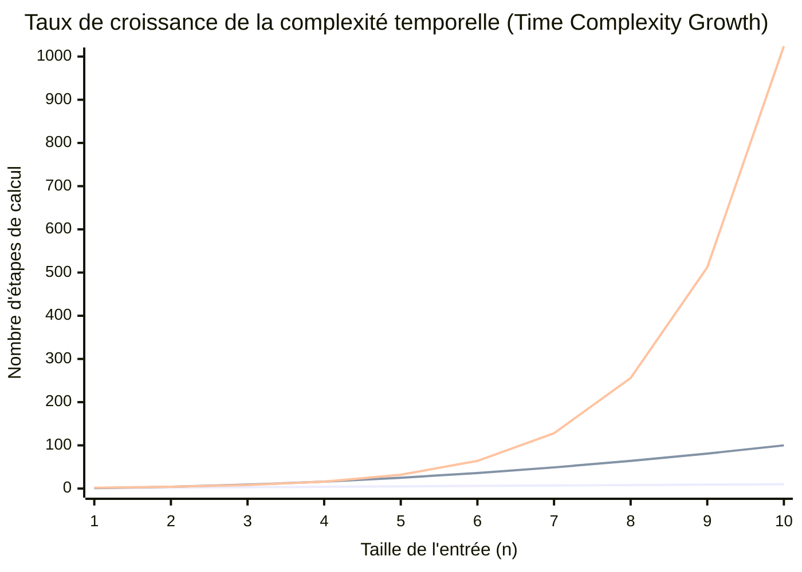
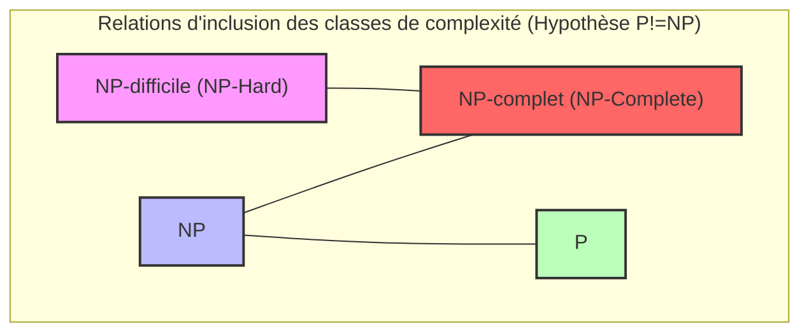
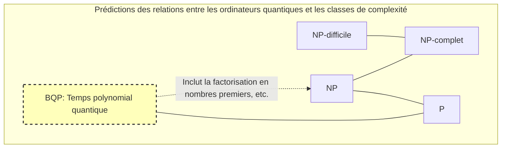

En informatique, et dans les mathématiques modernes, il existe un problème non résolu considéré comme le plus célèbre et le plus important. Il s'agit du **problème P vs NP**.

En 2000, l'Institut de mathématiques Clay a offert un prix d'un million de dollars pour chacun des sept problèmes mathématiques non résolus. Ceux-ci sont appelés les **Problèmes du Prix du millénaire**. Bien que certains, comme la conjecture de Poincaré, aient déjà été résolus, le **problème P vs NP** n'a toujours pas le moindre indice de résolution complète.

Dans cet article, nous allons explorer en profondeur ce **problème P vs NP**, depuis les bases des classes de complexité (P, NP, NP-complet, NP-difficile) jusqu'à son importance pratique en programmation, et même l'impact qu'il aurait sur le monde s'il était résolu.

---

## 1. Théorie de la complexité et bases des algorithmes

Pour comprendre le **problème P vs NP**, il faut d'abord comprendre le concept de "complexité algorithmique". Un ordinateur effectue des calculs étape par étape pour résoudre un problème, mais la manière dont le temps (nombre d'étapes) et la mémoire (espace) nécessaires augmentent lorsque la taille de l'entrée $n$ augmente est indiquée par la **complexité algorithmique (Computational Complexity)**.

### Notation de Landau (Big-O Notation)

La notation $O$ est souvent utilisée pour indiquer la complexité. Elle représente la limite supérieure de la complexité dans le pire des cas pour une taille d'entrée $n$.

- $O(1)$ : Temps constant. Ne dépend pas de la taille de l'entrée.
- $O(\log n)$ : Temps logarithmique. Recherche dichotomique, etc.
- $O(n)$ : Temps linéaire. Recherche simple, etc.
- $O(n \log n)$ : Algorithmes de tri efficaces (tri rapide, tri fusion, etc.).
- $O(n^2), O(n^3)$ : Temps polynomial. Doubles boucles, triples boucles, etc.
- $O(2^n)$ : Temps exponentiel. Recherche par force brute, etc.
- $O(n!)$ : Temps factoriel. Force brute simple du problème du voyageur de commerce, etc.

Le graphique ci-dessous visualise le taux d'augmentation du nombre d'étapes de calcul par rapport à la taille de l'entrée.


*(Celle tout en bas indique $O(n)$, celle du milieu $O(n^2)$ et celle tout en haut $O(2^n)$. On peut voir la croissance explosive du temps exponentiel.)*

Dans la théorie de la complexité, le temps exprimé par $O(n^k)$ (où $k$ est une constante) est appelé **temps polynomial (Polynomial Time)** et est considéré comme un critère de calculabilité en temps pratique. D'autre part, un temps exponentiel tel que $O(2^n)$ nécessite un temps de calcul qui dépasse la durée de vie de l'univers avec seulement un $n$ de quelques dizaines, et est donc considéré comme pratiquement "insoluble".

---

## 2. Qu'est-ce que la classe P ? (Problèmes "solubles" en un temps réaliste)

La **classe P (P : Polynomial time)** est définie comme "l'ensemble des problèmes de décision qui peuvent être résolus en temps polynomial sur une machine de Turing déterministe".

En clair, ce sont **"les problèmes pour lesquels un ordinateur peut trouver la réponse par lui-même dans un temps réaliste"**.

### Problèmes représentatifs de la classe P

- **Problème de tri** : Trier les nombres donnés par ordre croissant ($O(n \log n)$ etc.).
- **Problème du plus court chemin** : Trouver le chemin le plus court entre deux points, comme un système de navigation (algorithme de [Dijkstra](https://kenji.blog/fr/p/graph-theory-dijkstra-a-star/) en $O(E + V \log V)$).
- **Test de primalité** : Déterminer si un nombre donné est premier (il a été prouvé qu'il peut être résolu en temps polynomial grâce au test de primalité AKS).

Voici une implémentation en Python de l'algorithme de recherche dichotomique, un exemple classique de la classe P.

```python
def binary_search(arr, target):
    """
    Algorithme de recherche dichotomique de target dans un tableau trié (Exemple de classe P)
    Complexité temporelle : O(log n)
    """
    left, right = 0, len(arr) - 1
    
    while left <= right:
        mid = (left + right) // 2
        if arr[mid] == target:
            return mid
        elif arr[mid] < target:
            left = mid + 1
        else:
            right = mid - 1
            
    return -1

# Test
sorted_data = [1, 3, 5, 7, 9, 11, 13, 15]
print("Index:", binary_search(sorted_data, 7)) # Output: 3
```

Ces problèmes peuvent être résolus de manière évolutive sans explosion de la complexité même si la taille de l'entrée augmente.

---

## 3. Qu'est-ce que la classe NP ? (Problèmes "vérifiables" en un temps réaliste)

La **classe NP (NP : Nondeterministic Polynomial time)** est définie comme "l'ensemble des problèmes de décision résolubles en temps polynomial sur une machine de Turing non déterministe", ou plus simplement, **"l'ensemble des problèmes pour lesquels, si on vous donne une preuve (une solution potentielle), vous pouvez vérifier sa validité en temps polynomial"**.

On peut reformuler cela en disant : **"Trouver la réponse par soi-même peut être extrêmement difficile, mais si on vous donne quelque chose qui ressemble à la réponse, vous pouvez vérifier instantanément s'il s'agit de la bonne réponse."**

### Problèmes représentatifs de la classe NP

- **Sudoku** : Remplir la grille est difficile, mais si on vous donne une grille entièrement remplie, vous pouvez vérifier en un instant si elle enfreint les règles (s'il n'y a pas de doublons dans chaque ligne, colonne et bloc).
- **Problème de la somme de sous-ensembles (Subset Sum)** : Peut-on choisir certains entiers d'un ensemble donné pour obtenir une somme spécifique ? Trouver la solution nécessite une recherche par force brute, mais si on vous donne la preuve (la solution) "choisissez ceci et cela", vous pouvez la vérifier avec une simple addition.
- **Problème du voyageur de commerce (version de décision)** : Existe-t-il un itinéraire qui visite toutes les villes et revient avec une distance inférieure ou égale à $K$ ?

Voici un exemple de code Python qui "vérifie" la solution d'un Sudoku. La vérification elle-même peut être effectuée en un temps polynomial de $O(n^2)$.

```python
def verify_sudoku_solution(board):
    """
    Vérifie si une grille de Sudoku complétée (9x9) est correcte (Exemple du processus de vérification de la classe NP)
    Complexité temporelle : O(n^2) - Très rapide
    """
    def is_valid_group(group):
        return sorted(list(group)) == [1, 2, 3, 4, 5, 6, 7, 8, 9]

    # Vérification des lignes et des colonnes
    for i in range(9):
        if not is_valid_group(board[i]):
            return False
        if not is_valid_group([board[j][i] for j in range(9)]):
            return False

    # Vérification des blocs 3x3
    for i in range(0, 9, 3):
        for j in range(0, 9, 3):
            block = [board[x][y] for x in range(i, i+3) for y in range(j, j+3)]
            if not is_valid_group(block):
                return False

    return True

# Solution de Sudoku valide
valid_board = [
    [5,3,4,6,7,8,9,1,2],
    [6,7,2,1,9,5,3,4,8],
    [1,9,8,3,4,2,5,6,7],
    [8,5,9,7,6,1,4,2,3],
    [4,2,6,8,5,3,7,9,1],
    [7,1,3,9,2,4,8,5,6],
    [9,6,1,5,3,7,2,8,4],
    [2,8,7,4,1,9,6,3,5],
    [3,4,5,2,8,6,1,7,9]
]
print("Résultat de la vérification:", verify_sudoku_solution(valid_board)) # Output: True
```

**Tous les problèmes appartenant à P appartiennent également à NP.** En effet, si "vous pouvez le résoudre par vous-même dans un temps réaliste", il va sans dire que "vous pouvez également vérifier la solution dans un temps réaliste lorsqu'elle vous est donnée". Mathématiquement, cela s'exprime ainsi :

$ P \subseteq NP $

---

## 4. Le cœur du problème P vs NP : L'"inspiration" peut-elle être remplacée par l'"effort" ?

Nous arrivons ici au cœur du **problème P vs NP**, le Problème du Prix du millénaire.

Le problème est très simple.

> **La classe P (problèmes résolubles en un temps réaliste) et la classe NP (problèmes vérifiables en un temps réaliste) ne seraient-elles pas en fait le même ensemble ? C'est-à-dire, $P = NP$ ou $P \neq NP$ ?**

Intuitivement, il semble beaucoup plus difficile de **"trouver une solution"** que de **"vérifier si la solution est correcte"**. Si on compare la résolution d'un puzzle de Sudoku et la vérification des réponses, la vérification est plus facile, n'est-ce pas ?

Si **P = NP**, cela signifierait que "les problèmes dont la solution peut être facilement vérifiée peuvent en réalité être facilement résolus si l'on connaît la méthode". Comme cela va à l'encontre de l'intuition humaine, la majorité des mathématiciens et informaticiens modernes (plus de 90 % dans les sondages) s'attendent à ce que **$P \neq NP$**. Cependant, personne n'a encore réussi à le prouver mathématiquement.

---

## 5. NP-complet et NP-difficile (Les problèmes les plus difficiles de l'univers)

Les concepts de **NP-complet (NP-Complete)** et **NP-difficile (NP-Hard)** sont essentiels pour comprendre ce problème.

### Réduction en temps polynomial (Polynomial-time Reduction)
Supposons qu'il existe un programme qui résout un problème $A$. Lorsque vous voulez résoudre le problème $B$, si vous pouvez transformer rapidement (en temps polynomial) l'entrée du problème $B$ en l'entrée du problème $A$, obtenir la solution en utilisant le programme du problème $A$, et transformer rapidement ce résultat en la solution du problème $B$, alors on peut dire que "le problème $B$ n'est pas plus difficile que le problème $A$". C'est ce qu'on appelle la **réduction en temps polynomial**.

### NP-difficile (NP-Hard)
C'est la classe de problèmes auxquels **tous** les problèmes appartenant à la classe NP peuvent se réduire en un temps polynomial. En d'autres termes, c'est "un problème qui est au moins aussi difficile ou plus difficile que n'importe quel problème appartenant à NP". Un problème NP-difficile n'a même pas besoin d'être un problème de décision.

### NP-complet (NP-Complete)
C'est la classe de problèmes qui sont NP-difficiles et qui appartiennent également eux-mêmes à la classe NP. Cela signifie **"le groupe des problèmes les plus difficiles de la classe NP"**.



Étonnamment, en 1971, Stephen Cook et Leonid Levin ont prouvé que le **problème de satisfaisabilité booléenne (SAT)** est NP-complet (théorème de Cook-Levin).

Par la suite, Richard Karp a prouvé que la plupart des problèmes d'optimisation du monde réel, tels que le problème du voyageur de commerce, le problème du sac à dos et le problème de coloration de graphe, sont **NP-complets** (les 21 problèmes NP-complets de Karp).

**La caractéristique majeure des problèmes NP-complets est que "si un algorithme est trouvé pour résoudre un seul des problèmes NP-complets en temps polynomial, tous les problèmes NP peuvent être résolus en temps polynomial (c'est-à-dire $P = NP$)".**
C'est l'ultime effet domino en informatique.

---

## 6. Comparaison concrète et implémentation en programmation

Nous allons comparer ici des "problèmes qui se ressemblent mais dont la difficulté est totalement différente" pour expliquer les murs auxquels les programmeurs sont confrontés.

### Circuit eulérien (classe P) vs Cycle hamiltonien (NP-complet)

- **Circuit eulérien** : Recherche d'un itinéraire qui traverse toutes les "arêtes" exactement une fois et revient au sommet de départ (dessin d'un seul trait). Cela peut être résolu en temps polynomial de $O(V+E)$ en vérifiant simplement le degré de chaque sommet.
- **Cycle hamiltonien** : Recherche d'un itinéraire qui passe par tous les "sommets" exactement une fois et revient au sommet de départ (base du problème du voyageur de commerce). En modifiant légèrement les conditions, cela devient **NP-complet**, et aucun algorithme efficace n'a été trouvé.

### Exemple d'implémentation du problème du voyageur de commerce (TSP) et algorithme d'approximation

Si vous essayez de résoudre exactement le problème du voyageur de commerce, qui est NP-difficile (version du problème d'optimisation), la complexité explosera. Dans le code Python ci-dessous, comparons la solution exacte (force brute) avec une solution approximative pratique (algorithme glouton).

```python
import itertools
import math

def calculate_distance(city1, city2):
    return math.hypot(city1[0]-city2[0], city1[1]-city2[1])

# 1. Solution exacte (Force brute) - Complexité temporelle : O(N!)
def tsp_brute_force(cities):
    n = len(cities)
    best_dist = float('inf')
    best_path = None
    
    # Fixer la première ville et essayer toutes les permutations des autres villes
    for perm in itertools.permutations(range(1, n)):
        path = (0,) + perm
        dist = 0
        for i in range(n):
            dist += calculate_distance(cities[path[i]], cities[path[(i+1)%n]])
        
        if dist < best_dist:
            best_dist = dist
            best_path = path
            
    return best_dist, best_path

# 2. Solution approchée (Algorithme glouton) - Complexité temporelle : O(N^2)
def tsp_greedy(cities):
    n = len(cities)
    unvisited = set(range(1, n))
    current_city = 0
    path = [0]
    total_dist = 0
    
    while unvisited:
        # Trouver la ville non visitée la plus proche
        next_city = min(unvisited, key=lambda city: calculate_distance(cities[current_city], cities[city]))
        total_dist += calculate_distance(cities[current_city], cities[next_city])
        current_city = next_city
        path.append(current_city)
        unvisited.remove(current_city)
        
    # Retour à la première ville
    total_dist += calculate_distance(cities[current_city], cities[0])
    return total_dist, path

# Exécution du test
cities = [(0, 0), (1, 5), (5, 2), (6, 6), (8, 3), (2, 9), (9, 9)]

dist_exact, path_exact = tsp_brute_force(cities)
dist_greedy, path_greedy = tsp_greedy(cities)

print(f"Solution exacte : distance {dist_exact:.2f}, itinéraire {path_exact}")
print(f"Solution approchée : distance {dist_greedy:.2f}, itinéraire {path_greedy}")
```

Lorsque le nombre de villes dépasse $N=20$, la solution exacte (force brute) prendra environ la durée de vie de l'univers, même sur un supercalculateur moderne. Cependant, l'utilisation d'algorithmes d'approximation tels que l'algorithme glouton permet de produire **une solution raisonnablement bonne, même si elle n'est pas optimale**, en un instant. Un programmeur est censé faire des choix de conception pour abandonner la solution exacte et se tourner vers des heuristiques ou des algorithmes d'approximation dès qu'il se rend compte que le problème est NP-difficile.

---

## 7. Que se passerait-il si P = NP ?

Actuellement, les systèmes cryptographiques du monde entier (SSL/TLS utilisés dans les achats sur Internet, les blockchains comme le Bitcoin) utilisent l'asymétrie selon laquelle **"résoudre prend un temps énorme, mais vérifier peut se faire en un instant"**.

La décomposition en facteurs premiers, qui est à la base de la cryptographie [RSA](https://kenji.blog/fr/p/modern-cryptography-public-key-hash-signature/), en est un exemple.
Supposons que quelqu'un prouve que $P = NP$ et construise un algorithme magique (preuve constructive) qui résout des problèmes NP en temps polynomial. Cela déclencherait **un changement de paradigme dans la société humaine**, comme suit :

1. **L'effondrement de la cryptographie** : Les systèmes de cryptographie à clé publique modernes, tels que la cryptographie RSA et la cryptographie sur les courbes elliptiques, seraient tous craqués instantanément, et la sécurité numérique s'effondrerait complètement.
2. **L'évolution ultime de l'IA et du Machine Learning** : La pondération optimale des réseaux de neurones ou la stratégie optimale de l'apprentissage par renforcement pourraient être calculées instantanément.
3. **Le bond en avant de la découverte de médicaments et des sciences de la vie** : La structure de repliement des protéines (qui se réduit également à un problème NP-difficile) pourrait être calculée instantanément, et des remèdes miracles contre des maladies incurables seraient développés les uns après les autres par l'IA.
4. **L'optimisation parfaite de la logistique et de la production** : Une chaîne d'approvisionnement ultime éliminant tout gaspillage serait mise en place, résolvant la majeure partie du problème énergétique.

Comme l'a dit le mathématicien Scott Aaronson : "Si $P = NP$, alors il n'y a pas de saut créatif dans le monde, et toute inspiration ou intuition géniale peut être remplacée par un calcul mécanique", il s'agit d'un problème qui a même des implications philosophiques.

---

## 8. Les ordinateurs quantiques et le problème P vs NP

Ces dernières années, avec l'apparition des ordinateurs quantiques, il y a un malentendu répandu selon lequel "les ordinateurs quantiques pourraient résoudre les problèmes NP-complets, n'est-ce pas ?".

En théorie de la complexité algorithmique, la classe des problèmes pouvant être résolus en temps polynomial par un ordinateur quantique est appelée **BQP (Bounded-error Quantum Polynomial time)**. Avec "l'algorithme de Shor" conçu par Peter Shor, il a été prouvé que la factorisation en nombres premiers appartient à BQP (elle peut être résolue rapidement par un ordinateur quantique).

Cependant, dans le consensus actuel de la communauté de l'informatique, **on ne considère pas que $NP-complet \subseteq BQP$**.
En d'autres termes, on pense que même avec des ordinateurs quantiques, il est impossible de résoudre des problèmes NP-complets comme le problème du voyageur de commerce ou le problème du sac à dos en un temps polynomial. Les ordinateurs quantiques ne sont pas une baguette magique, mais des machines qui ne démontrent une vitesse écrasante que pour des problèmes ayant des structures mathématiques spécifiques (comme la découverte de périodicité).


*(On s'attend à ce que la classe BQP inclut P et puisse résoudre une partie de NP (comme la factorisation), mais n'inclut pas tous les problèmes NP-complets.)*

---

## 9. Signification et approche pour les ingénieurs et programmeurs

La plupart des défis professionnels auxquels nous, ingénieurs logiciels, sommes confrontés au quotidien (planification des horaires, optimisation des itinéraires de livraison, allocation des ressources cloud, problème d'emballage) sont des problèmes **NP-difficiles**.

Si la partie commerciale vous demande de "créer un système qui donne la solution optimale à ce problème", sans connaissance de la théorie de la complexité, vous écrirez un programme qui ne se terminera jamais et qui fera planter le serveur.

La plus grande leçon que le **problème P vs NP** (et la théorie de la NP-complétude) enseigne aux programmeurs est la suivante :

1. **Reconnaître la difficulté du problème** : Si vous pouvez prouver (ou supposer) que le problème auquel vous êtes confronté est NP-difficile, arrêtez de chercher un algorithme pour trouver la solution optimale parfaite.
2. **S'en remettre à la relaxation et à l'approximation** :
    - **Algorithmes d'approximation** : Résoudre en temps polynomial tout en garantissant que l'erreur par rapport à la solution optimale reste dans une certaine limite.
    - **Heuristiques** : Adopter des méthodes telles que les algorithmes génétiques ou le recuit simulé qui n'ont aucune garantie mathématique mais produisent rapidement des "solutions raisonnablement bonnes" de manière empirique.
    - **Programmation dynamique (DP)** : S'il existe une solution qui dépend de la taille de la valeur numérique de l'entrée (temps pseudo-polynomial), comme le problème du sac à dos, utilisez les contraintes de l'entrée.
    - **Solveurs SAT / Solveurs MILP** : Les formuler et les confier à des solveurs d'optimisation mathématique à usage général, dont le développement a été remarquable ces dernières années. Comme les solveurs effectuent un élagage avancé en interne, ils peuvent souvent trouver des solutions exactes pour des tailles pratiques.

```python
# Résolution du problème du sac à dos 0-1 par programmation dynamique (Exemple de temps pseudo-polynomial)
def knapsack_dp(weights, values, capacity):
    """
    Exemple de résolution en temps pseudo-polynomial O(N*W) à l'aide de la PD, bien que ce soit NP-difficile
    """
    n = len(weights)
    # dp[i][w] : valeur maximale pour un poids inférieur ou égal à w avec les i premiers objets
    dp = [[0] * (capacity + 1) for _ in range(n + 1)]
    
    for i in range(1, n + 1):
        for w in range(1, capacity + 1):
            if weights[i-1] <= w:
                # Prendre le maximum entre inclure ou non l'objet
                dp[i][w] = max(dp[i-1][w], dp[i-1][w-weights[i-1]] + values[i-1])
            else:
                dp[i][w] = dp[i-1][w]
                
    return dp[n][capacity]

weights = [2, 3, 4, 5]
values = [3, 4, 5, 6]
capacity = 5
print(f"Valeur maximale du sac à dos : {knapsack_dp(weights, values, capacity)}")
```

---

## Conclusion : Un défi aux limites de l'intelligence humaine

Le **problème P vs NP** n'est pas qu'un simple puzzle mathématique. C'est une question philosophique grandiose qui interroge les limites de l'intelligence humaine : "Qu'est-ce qu'un calcul efficace ?", "Les preuves mathématiques peuvent-elles être automatisées ?", "L'inspiration peut-elle être transformée en algorithme ?".

Le prix d'un million de dollars de l'Institut de mathématiques Clay pourrait être considéré comme trop bon marché compte tenu de l'importance de ce problème. Si vous parvenez à élaborer un algorithme de preuve de $P = NP$, vous pourriez tout à fait transférer toutes les cryptomonnaies vers votre propre portefeuille avant même de recevoir le prix (bien que, d'un point de vue éthique, vous ne devriez absolument pas le faire).

Verrons-nous ce problème résolu de notre vivant grâce à une avancée majeure dans la recherche future ? Ou sera-t-il prouvé qu'il est "impossible à prouver ou à réfuter", comme le théorème d'incomplétude de Gödel ? Il faut garder un œil sur les avancées de la théorie de la complexité.

> **Références / Liens connexes**
> - Problèmes du Prix du millénaire de l'Institut de mathématiques Clay (Clay Mathematics Institute)
> - Stephen Cook "The Complexity of Theorem-Proving Procedures" (1971)
> - Richard Karp "Reducibility Among Combinatorial Problems" (1972)
> - Michael Sipser "Introduction à la théorie du calcul" (Sipser, Introduction to the Theory of Computation)
