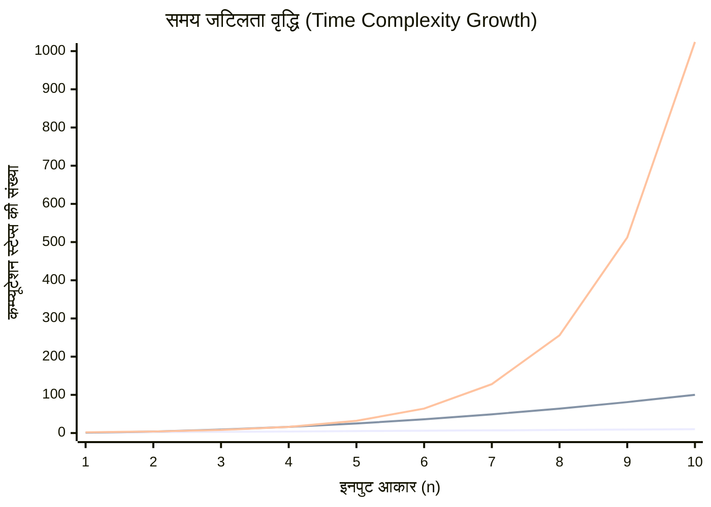
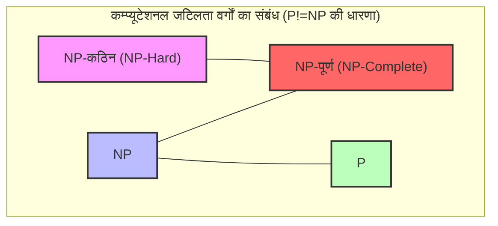
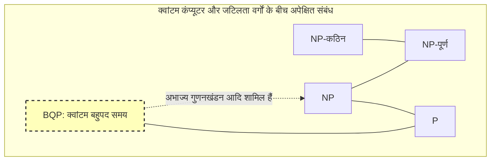

कंप्यूटर विज्ञान में, और आधुनिक गणित में, सबसे प्रसिद्ध और सबसे महत्वपूर्ण अनसुलझी समस्या है। वह है **P vs NP समस्या**।

वर्ष 2000 में, क्ले मैथमेटिक्स इंस्टीट्यूट (Clay Mathematics Institute) ने गणित की 7 अनसुलझी समस्याओं में से प्रत्येक के लिए 1 मिलियन डॉलर की इनामी राशि की घोषणा की थी। इन्हें **मिलेनियम प्राइज़ समस्याएं (Millennium Prize Problems)** कहा जाता है। यद्यपि पोंकारे अनुमान (Poincaré conjecture) जैसी कुछ समस्याओं को पहले ही सुलझा लिया गया है, लेकिन **P vs NP समस्या** के समाधान का अभी तक कोई सुराग नहीं मिला है।

इस लेख में, हम इस **P vs NP समस्या** के संपूर्ण परिदृश्य को कम्प्यूटेशनल जटिलता वर्गों (P, NP, NP-पूर्ण, NP-कठिन) के मूल सिद्धांतों से लेकर प्रोग्रामिंग में इसके व्यावहारिक महत्व और, यदि यह हल हो जाती है, तो दुनिया पर इसके संभावित प्रभावों तक विस्तार से समझाएंगे।

---

## 1. कम्प्यूटेशनल जटिलता सिद्धांत और एल्गोरिथम के मूल सिद्धांत

**P vs NP समस्या** को समझने के लिए, आपको सबसे पहले "एल्गोरिथम की कम्प्यूटेशनल जटिलता (Computational Complexity)" की अवधारणा को समझना होगा। एक कंप्यूटर किसी समस्या को हल करने के लिए चरण-दर-चरण गणना करता है, लेकिन जब इनपुट का आकार $n$ बढ़ जाता है, तो गणना के लिए आवश्यक समय (कदमों की संख्या) या मेमोरी (स्थान) कैसे बढ़ता है, यह **कम्प्यूटेशनल जटिलता (Computational Complexity)** द्वारा दर्शाया जाता है।

### बिग ओ नोटेशन (Big-O Notation)

जटिलता को दर्शाते समय $O$ नोटेशन का अक्सर उपयोग किया जाता है। यह इनपुट आकार $n$ के लिए सबसे खराब स्थिति की गणना समय (worst-case time complexity) की ऊपरी सीमा को दर्शाता है।

- $O(1)$: स्थिर समय। इनपुट आकार पर निर्भर नहीं करता।
- $O(\log n)$: लघुगणकीय समय। जैसे बाइनरी सर्च।
- $O(n)$: रैखिक समय। जैसे सरल खोज।
- $O(n \log n)$: कुशल सॉर्टिंग एल्गोरिदम (क्विकसॉर्ट, मर्जसॉर्ट आदि)।
- $O(n^2), O(n^3)$: बहुपद समय (Polynomial time)। डबल लूप, ट्रिपल लूप आदि।
- $O(2^n)$: घातांकीय समय (Exponential time)। ब्रूट-फोर्स सर्च आदि।
- $O(n!)$: क्रमगुणित समय (Factorial time)। ट्रैवलिंग सेल्समैन समस्या का ब्रूट-फोर्स आदि।

नीचे दिया गया ग्राफ इनपुट आकार के संबंध में कम्प्यूटेशन स्टेप्स की वृद्धि को दृश्य रूप में दिखाता है।


*(सबसे नीचे की लाइन $O(n)$ दिखाती है, बीच की लाइन $O(n^2)$ और सबसे ऊपर की लाइन $O(2^n)$ दिखाती है। घातांकीय समय की विस्फोटक वृद्धि स्पष्ट है।)*

कम्प्यूटेशनल जटिलता सिद्धांत में, $O(n^k)$ ($k$ एक स्थिरांक है) के रूप में व्यक्त किए गए समय को **बहुपद समय (Polynomial Time)** कहा जाता है, और इसे एक ऐसा मानदंड माना जाता है जिसे व्यावहारिक समय में गणना किया जा सकता है। दूसरी ओर, $O(2^n)$ जैसे घातांकीय समय को व्यावहारिक रूप से "अघुलनशील" माना जाता है, क्योंकि अगर $n$ सिर्फ कुछ दहाई में हो, तो इसे हल करने में ब्रह्मांड के जीवनकाल से भी अधिक समय लगेगा।

---

## 2. वर्ग P क्या है? (व्यावहारिक समय में "हल करने योग्य" समस्याएं)

**वर्ग P (P: Polynomial time)** को "उन निर्णय समस्याओं का सेट जिन्हें एक नियतात्मक ट्यूरिंग मशीन (Deterministic [Turing Machine](https://kenji.blog/hi/p/turing-machine-computability/)) में बहुपद समय में हल किया जा सकता है" के रूप में परिभाषित किया गया है।

सरल शब्दों में, **"वे समस्याएं जिनका उत्तर कंप्यूटर अपने दम पर व्यावहारिक समय में प्राप्त कर सकता है।"**

### वर्ग P की प्रमुख समस्याएं

- **सॉर्टिंग समस्या**: दी गई संख्याओं को आरोही क्रम में व्यवस्थित करना (जैसे $O(n \log n)$)।
- **सबसे छोटा रास्ता (Shortest path) समस्या**: कार नेविगेशन की तरह 2 बिंदुओं के बीच सबसे छोटा रास्ता खोजना ([Dijkstra](https://kenji.blog/hi/p/graph-theory-dijkstra-a-star/) के एल्गोरिदम के साथ $O(E + V \log V)$)।
- **अभाज्य संख्या परीक्षण (Primality testing)**: यह जांचना कि कोई संख्या अभाज्य है या नहीं (यह साबित हो चुका है कि AKS अभाज्य परीक्षण द्वारा इसे बहुपद समय में हल किया जा सकता है)।

नीचे बाइनरी सर्च एल्गोरिदम का एक पायथन कार्यान्वयन दिया गया है, जो वर्ग P का एक उत्कृष्ट उदाहरण है।

```python
def binary_search(arr, target):
    """
    सॉर्ट किए गए ऐरे में टारगेट को खोजने के लिए बाइनरी सर्च एल्गोरिदम (वर्ग P का उदाहरण)
    समय जटिलता: O(log n)
    """
    left, right = 0, len(arr) - 1
    
    while left <= right:
        mid = (left + right) // 2
        if arr[mid] == target:
            return mid
        elif arr[mid] < target:
            left = mid + 1
        else:
            right = mid - 1
            
    return -1

# टेस्ट
sorted_data = [1, 3, 5, 7, 9, 11, 13, 15]
print("Index:", binary_search(sorted_data, 7)) # Output: 3
```

इन समस्याओं को स्केलेबल रूप से हल किया जा सकता है, बिना जटिलता के विस्फोट के, भले ही इनपुट आकार बढ़ जाए।

---

## 3. वर्ग NP क्या है? (व्यावहारिक समय में "सत्यापन योग्य" समस्याएं)

**वर्ग NP (NP: Nondeterministic Polynomial time)** को "उन निर्णय समस्याओं का सेट जिन्हें एक गैर-नियतात्मक ट्यूरिंग मशीन (Nondeterministic [Turing Machine](https://kenji.blog/hi/p/turing-machine-computability/)) में बहुपद समय में हल किया जा सकता है" के रूप में परिभाषित किया गया है, या अधिक सरल रूप से, **"उन समस्याओं का सेट जिन्हें, यदि कोई प्रमाण (प्रमाणित समाधान) दिया जाता है, तो यह सत्यापित किया जा सकता है कि यह बहुपद समय में सही है या नहीं।"**

दूसरे शब्दों में, **"जवाब खुद खोजना बहुत मुश्किल हो सकता है, लेकिन अगर आपको एक संभावित जवाब दिया जाता है, तो आप तुरंत जांच सकते हैं कि यह सही है या नहीं।"**

### वर्ग NP की प्रमुख समस्याएं

- **सुडोकू (Sudoku)**: बोर्ड को भरना मुश्किल है, लेकिन अगर आपको एक पूरा भरा हुआ बोर्ड दिया जाता है, तो यह जांचना कि क्या कोई नियम तोड़ा गया है (प्रत्येक पंक्ति, कॉलम और ब्लॉक में कोई डुप्लिकेट नहीं है) तुरंत किया जा सकता है।
- **सबसेट सम (Subset Sum) समस्या**: क्या संख्याओं के दिए गए सेट में से कुछ को चुनना संभव है ताकि उनका योग एक विशिष्ट संख्या हो सके? समाधान खोजने के लिए ब्रूट-फोर्स की आवश्यकता होती है, लेकिन अगर आपको "ये और ये चुनें" प्रमाण (समाधान) दिया जाता है, तो आप बस जोड़कर इसे जांच सकते हैं।
- **ट्रैवलिंग सेल्समैन समस्या (निर्णय संस्करण)**: क्या कोई ऐसा रूट है जो सभी शहरों का दौरा करता है और लौटता है, जिसकी कुल दूरी $K$ से कम या उसके बराबर है?

नीचे एक पायथन कोड का उदाहरण दिया गया है जो सुडोकू समाधान को "सत्यापित (verify)" करता है। सत्यापन स्वयं $O(n^2)$ बहुपद समय में किया जा सकता है।

```python
def verify_sudoku_solution(board):
    """
    सत्यापित करें कि एक पूर्ण सुडोकू बोर्ड (9x9) सही है या नहीं (वर्ग NP सत्यापन प्रक्रिया का उदाहरण)
    समय जटिलता: O(n^2) - बहुत तेज
    """
    def is_valid_group(group):
        return sorted(list(group)) == [1, 2, 3, 4, 5, 6, 7, 8, 9]

    # पंक्तियों और स्तंभों का सत्यापन
    for i in range(9):
        if not is_valid_group(board[i]):
            return False
        if not is_valid_group([board[j][i] for j in range(9)]):
            return False

    # 3x3 ब्लॉकों का सत्यापन
    for i in range(0, 9, 3):
        for j in range(0, 9, 3):
            block = [board[x][y] for x in range(i, i+3) for y in range(j, j+3)]
            if not is_valid_group(block):
                return False

    return True

# एक वैध सुडोकू समाधान
valid_board = [
    [5,3,4,6,7,8,9,1,2],
    [6,7,2,1,9,5,3,4,8],
    [1,9,8,3,4,2,5,6,7],
    [8,5,9,7,6,1,4,2,3],
    [4,2,6,8,5,3,7,9,1],
    [7,1,3,9,2,4,8,5,6],
    [9,6,1,5,3,7,2,8,4],
    [2,8,7,4,1,9,6,3,5],
    [3,4,5,2,8,6,1,7,9]
]
print("सत्यापन परिणाम:", verify_sudoku_solution(valid_board)) # Output: True
```

**P से संबंधित सभी समस्याएं NP से संबंधित हैं।** ऐसा इसलिए है क्योंकि अगर आप इसे "अपने दम पर व्यावहारिक समय में हल" कर सकते हैं, तो निश्चित रूप से "जवाब दिए जाने पर आप इसे व्यावहारिक समय में जांच" भी सकते हैं। गणितीय रूप से, इसे इस प्रकार व्यक्त किया जा सकता है:

$ P \subseteq NP $

---

## 4. P vs NP समस्या का मूल: क्या "प्रेरणा (Inspiration)" को "प्रयास (Effort)" से बदला जा सकता है?

अब हम आखिरकार मिलेनियम प्राइज़ समस्या, **P vs NP समस्या** के मूल तक पहुंचते हैं।

समस्या बहुत सरल है।

> **क्या वर्ग P (वे समस्याएं जिन्हें व्यावहारिक समय में हल किया जा सकता है) और वर्ग NP (वे समस्याएं जिन्हें व्यावहारिक समय में सत्यापित किया जा सकता है) वास्तव में बिल्कुल एक ही सेट हैं? यानी, क्या $P = NP$ है? या $P \neq NP$ है?**

सहज रूप से, **"समाधान खोजना"** **"जांचना कि क्या समाधान सही है"** की तुलना में कहीं अधिक कठिन लगता है। अगर आप सुडोकू पहेली को हल करने की तुलना उसके उत्तर की जांच करने से करें, तो उत्तर की जांच करना कहीं अधिक आसान है।

यदि **P = NP** है, तो "ऐसी समस्याएं जिनके उत्तरों की आसानी से जांच की जा सकती है, उन्हें वास्तव में आसानी से हल किया जा सकता है यदि आपको पता हो कि उन्हें कैसे हल किया जाए।" चूंकि यह मानव अंतर्ज्ञान के काफी विपरीत है, अधिकांश आधुनिक गणितज्ञ और कंप्यूटर वैज्ञानिक (सर्वेक्षणों में 90% से अधिक) मानते हैं कि **$P \neq NP$**। हालाँकि, अभी तक कोई भी इसे गणितीय रूप से सिद्ध करने में सक्षम नहीं हुआ है।

---

## 5. NP-पूर्ण (NP-Complete) और NP-कठिन (NP-Hard) (ब्रह्मांड की सबसे कठिन समस्याएं)

इस समस्या को समझने के लिए, **NP-पूर्ण (NP-Complete)** और **NP-कठिन (NP-Hard)** की अवधारणाएँ आवश्यक हैं।

### बहुपद-समय न्यूनीकरण (Polynomial-time Reduction)
मान लीजिए कि समस्या $A$ को हल करने के लिए एक प्रोग्राम है। यदि आप समस्या $B$ को हल करना चाहते हैं, और आप समस्या $B$ के इनपुट को समस्या $A$ के इनपुट में जल्दी (बहुपद समय में) बदल सकते हैं, समस्या $A$ के प्रोग्राम का उपयोग करके इसे हल कर सकते हैं, और फिर परिणाम को जल्दी से समस्या $B$ के समाधान में बदल सकते हैं, तो हम कह सकते हैं कि "समस्या $B$ समस्या $A$ से अधिक कठिन नहीं है।" इसे **बहुपद-समय न्यूनीकरण (Polynomial-time Reduction)** कहा जाता है।

### NP-कठिन (NP-Hard)
यह उन समस्याओं का एक वर्ग है जिन्हें वर्ग NP में **सभी** समस्याओं से बहुपद समय में कम किया जा सकता है। दूसरे शब्दों में, यह "NP में किसी भी समस्या की तुलना में कम से कम उतनी ही कठिन या उससे अधिक कठिन समस्या है।" NP-कठिन समस्याओं का निर्णय समस्या (Decision problem) होना भी आवश्यक नहीं है।

### NP-पूर्ण (NP-Complete)
यह उन समस्याओं का वर्ग है जो NP-कठिन दोनों हैं और स्वयं वर्ग NP से संबंधित हैं। इसका मतलब है **"वर्ग NP में सबसे कठिन समस्याओं का संग्रह।"**



आश्चर्यजनक रूप से, 1971 में, स्टीफन कुक और लियोनिद लेविन ने साबित किया कि **बूलियन सैटिस्फिएबिलिटी समस्या (SAT)** NP-पूर्ण है (कुक-लेविन प्रमेय)।

बाद में, रिचर्ड कार्प ने साबित किया कि वास्तविक दुनिया की कई अनुकूलन (optimization) समस्याएं, जैसे ट्रैवलिंग सेल्समैन समस्या, नैपसैक समस्या (Knapsack problem) और ग्राफ कलरिंग समस्या, **NP-पूर्ण** हैं (कार्प की 21 NP-पूर्ण समस्याएं)।

**NP-पूर्ण समस्याओं की सबसे बड़ी विशेषता यह है कि "यदि किसी भी एक NP-पूर्ण समस्या के लिए बहुपद समय एल्गोरिदम मिल जाता है, तो सभी NP समस्याओं को बहुपद समय में हल किया जा सकेगा (यानी, $P = NP$ हो जाएगा)।"**
इसे कंप्यूटर विज्ञान में परम डोमिनोज़ प्रभाव (ultimate domino effect) कहा जा सकता है।

---

## 6. प्रोग्रामिंग में विशिष्ट तुलना और कार्यान्वयन

यहाँ, हम "ऐसी समस्याओं की तुलना करते हैं जो समान लगती हैं लेकिन पूरी तरह से अलग कठिनाई स्तर की हैं" और उन बाधाओं की व्याख्या करते हैं जिनका सामना प्रोग्रामर करते हैं।

### यूलर सर्किट (Eulerian Circuit) (वर्ग P) बनाम हैमिल्टनियन सर्किट (Hamiltonian Circuit) (NP-पूर्ण)

- **यूलर सर्किट**: एक ऐसा रास्ता खोजना जो हर "किनारे (Edge)" से ठीक एक बार होकर गुजरता हो और शुरुआती नोड पर वापस आता हो (एक स्ट्रोक ड्राइंग)। इसे प्रत्येक वर्टेक्स (Vertex) की डिग्री की जांच करके $O(V+E)$ बहुपद समय में हल किया जा सकता है।
- **हैमिल्टनियन सर्किट**: एक ऐसा रास्ता खोजना जो हर "वर्टेक्स (Vertex)" से ठीक एक बार होकर गुजरता हो और शुरुआती नोड पर वापस आता हो (ट्रैवलिंग सेल्समैन समस्या का आधार)। शर्तों में थोड़ा सा बदलाव करने पर, यह **NP-पूर्ण** बन जाता है, और इसके लिए कोई कुशल एल्गोरिदम नहीं पाया गया है।

### ट्रैवलिंग सेल्समैन समस्या (TSP) कार्यान्वयन उदाहरण और सन्निकटन एल्गोरिदम (Approximation Algorithm)

यदि आप NP-कठिन (ऑप्टिमाइज़ेशन समस्या संस्करण) ट्रैवलिंग सेल्समैन समस्या को सटीक रूप से हल करने का प्रयास करते हैं, तो गणना की जटिलता विस्फोट कर जाएगी। आइए निम्नलिखित पायथन कोड का उपयोग करके सटीक समाधान (ब्रूट-फोर्स) और एक व्यावहारिक सन्निकट समाधान (लालची एल्गोरिदम - Greedy algorithm) की तुलना करें।

```python
import itertools
import math

def calculate_distance(city1, city2):
    return math.hypot(city1[0]-city2[0], city1[1]-city2[1])

# 1. सटीक समाधान (ब्रूट-फोर्स) - समय जटिलता: O(N!)
def tsp_brute_force(cities):
    n = len(cities)
    best_dist = float('inf')
    best_path = None
    
    # पहले शहर को ठीक करें और बाकी शहरों के सभी क्रमपरिवर्तन (permutations) आज़माएं
    for perm in itertools.permutations(range(1, n)):
        path = (0,) + perm
        dist = 0
        for i in range(n):
            dist += calculate_distance(cities[path[i]], cities[path[(i+1)%n]])
        
        if dist < best_dist:
            best_dist = dist
            best_path = path
            
    return best_dist, best_path

# 2. सन्निकट समाधान (लालची एल्गोरिदम - Greedy algorithm) - समय जटिलता: O(N^2)
def tsp_greedy(cities):
    n = len(cities)
    unvisited = set(range(1, n))
    current_city = 0
    path = [0]
    total_dist = 0
    
    while unvisited:
        # निकटतम बिना देखे गए शहर को खोजें
        next_city = min(unvisited, key=lambda city: calculate_distance(cities[current_city], cities[city]))
        total_dist += calculate_distance(cities[current_city], cities[next_city])
        current_city = next_city
        path.append(current_city)
        unvisited.remove(current_city)
        
    # पहले शहर पर लौटें
    total_dist += calculate_distance(cities[current_city], cities[0])
    return total_dist, path

# टेस्ट निष्पादन
cities = [(0, 0), (1, 5), (5, 2), (6, 6), (8, 3), (2, 9), (9, 9)]

dist_exact, path_exact = tsp_brute_force(cities)
dist_greedy, path_greedy = tsp_greedy(cities)

print(f"सटीक समाधान: दूरी {dist_exact:.2f}, रूट {path_exact}")
print(f"सन्निकट समाधान: दूरी {dist_greedy:.2f}, रूट {path_greedy}")
```

जब शहरों की संख्या $N=20$ से अधिक हो जाती है, तो सटीक समाधान (ब्रूट फोर्स) आधुनिक सुपरकंप्यूटरों के लिए भी ब्रह्मांड के जीवनकाल जितना समय लेगा। हालाँकि, लालची एल्गोरिदम (Greedy algorithm) जैसे सन्निकटन एल्गोरिदम का उपयोग करके, आप पलक झपकते ही **एक समाधान प्राप्त कर सकते हैं जो इष्टतम नहीं हो सकता है, लेकिन काफी अच्छा है**। जब प्रोग्रामर को पता चलता है कि कोई समस्या NP-कठिन है, तो उन्हें सटीक समाधान छोड़ देना चाहिए और ह्युरिस्टिक्स (Heuristics) या सन्निकटन एल्गोरिदम (Approximation algorithms) का उपयोग करने का डिज़ाइन निर्णय लेना चाहिए।

---

## 7. यदि P = NP हो तो दुनिया का क्या होगा?

वर्तमान में, दुनिया भर में उपयोग की जाने वाली क्रिप्टोग्राफ़िक प्रणालियाँ (जैसे इंटरनेट शॉपिंग में उपयोग की जाने वाली SSL/TLS और बिटकॉइन जैसी ब्लॉकचेन) एक विषमता (asymmetry) पर निर्भर करती हैं: **"हल करने में अत्यधिक समय लगता है, लेकिन सत्यापन तुरंत किया जा सकता है।"**

[RSA](https://kenji.blog/hi/p/modern-cryptography-public-key-hash-signature/) क्रिप्टोग्राफी के मूल में मौजूद अभाज्य गुणनखंडन (Prime factorization) भी ऐसा ही है।
मान लीजिए कि कोई $P = NP$ को साबित करता है और NP समस्याओं को बहुपद समय (रचनात्मक प्रमाण - Constructive proof) में हल करने के लिए एक जादुई एल्गोरिदम बनाता है। यह मानव समाज में निम्नलिखित **पैराडाइम शिफ्ट (Paradigm shift)** का कारण बनेगा:

1. **क्रिप्टोग्राफी का पतन**: आधुनिक सार्वजनिक-कुंजी क्रिप्टोग्राफी (Public-key cryptography) जैसे RSA एन्क्रिप्शन और एलिप्टिक कर्व एन्क्रिप्शन तुरंत टूट जाएंगे, और डिजिटल सुरक्षा पूरी तरह से ध्वस्त हो जाएगी।
2. **AI और मशीन लर्निंग का अंतिम विकास**: न्यूरल नेटवर्क के लिए इष्टतम वेटिंग (optimal weighting) और रीइन्फोर्समेंट लर्निंग (Reinforcement learning) के लिए इष्टतम रणनीतियों की तुरंत गणना करना संभव होगा।
3. **दवा की खोज और जीवन विज्ञान में छलांग**: प्रोटीन फोल्डिंग संरचनाओं (जो NP-कठिन समस्याओं तक कम हो जाती हैं) की गणना तुरंत की जा सकती है, और AI द्वारा असाध्य रोगों के लिए चमत्कारिक दवाओं को एक के बाद एक विकसित किया जाएगा।
4. **लॉजिस्टिक्स और उत्पादन का पूर्ण अनुकूलन (Optimization)**: एक परम आपूर्ति श्रृंखला (Ultimate supply chain) जिसमें सभी अपशिष्ट समाप्त हो जाते हैं, का निर्माण किया जाएगा, जिससे अधिकांश ऊर्जा समस्याओं का समाधान होगा।

जैसा कि गणितज्ञ स्कॉट आरोनसन ने कहा, "यदि $P = NP$ है, तो दुनिया में रचनात्मक छलांग जैसी कोई चीज नहीं होगी; सभी अंतर्दृष्टि (inspiration) और प्रतिभाशाली अंतर्ज्ञान (genius intuition) को यांत्रिक गणना (mechanical computation) से बदला जा सकता है।" इस समस्या का एक दार्शनिक अर्थ भी है।

---

## 8. क्वांटम कंप्यूटर और P vs NP समस्या

हाल के वर्षों में, क्वांटम कंप्यूटरों के आगमन के साथ, एक गलतफहमी फैल गई है कि "क्वांटम कंप्यूटर NP-पूर्ण समस्याओं को हल कर सकते हैं।"

कम्प्यूटेशनल जटिलता सिद्धांत में, उन समस्याओं का वर्ग जिन्हें क्वांटम कंप्यूटर द्वारा बहुपद समय में हल किया जा सकता है, **BQP (Bounded-error Quantum Polynomial time)** कहलाता है। पीटर शोर द्वारा डिज़ाइन किए गए "शोर के एल्गोरिदम (Shor's algorithm)" से यह साबित हो गया है कि अभाज्य गुणनखंडन (Prime factorization) BQP से संबंधित है (इसे क्वांटम कंप्यूटर द्वारा जल्दी हल किया जा सकता है)।

हालाँकि, वर्तमान कंप्यूटर विज्ञान समुदाय की सहमति में, **यह नहीं माना जाता है कि $NP-पूर्ण \subseteq BQP$** है।
दूसरे शब्दों में, यह माना जाता है कि क्वांटम कंप्यूटर भी बहुपद समय में ट्रैवलिंग सेल्समैन समस्या या नैपसैक समस्या जैसी NP-पूर्ण समस्याओं को हल नहीं कर सकते हैं। क्वांटम कंप्यूटर कोई जादुई छड़ी नहीं हैं, बल्कि ऐसी मशीनें हैं जो केवल विशिष्ट गणितीय संरचनाओं (जैसे कि आवधिकता खोज - Periodicity finding) वाली समस्याओं के खिलाफ अत्यधिक गति दिखाती हैं।


*(ऐसा अनुमान है कि BQP वर्ग में P शामिल है और यह NP (अभाज्य गुणनखंडन आदि) के कुछ हिस्सों को हल कर सकता है, लेकिन इसमें सभी NP-पूर्ण समस्याएं शामिल नहीं हैं।)*

---

## 9. इंजीनियरों और प्रोग्रामरों के लिए महत्व और दृष्टिकोण

हम सॉफ्टवेयर इंजीनियरों को दैनिक आधार पर जिन व्यावसायिक चुनौतियों का सामना करना पड़ता है (शिफ्ट शेड्यूलिंग, डिलीवरी रूट ऑप्टिमाइज़ेशन, क्लाउड रिसोर्स एलोकेशन, पैकिंग समस्याएं) उनमें से अधिकांश **NP-कठिन** समस्याएं हैं।

यदि व्यवसाय पक्ष आपसे कहता है कि "कृपया एक सिस्टम बनाएं जो इस समस्या का इष्टतम समाधान निकाल सके," और आपको कम्प्यूटेशनल जटिलता सिद्धांत का ज्ञान नहीं है, तो आप एक ऐसा प्रोग्राम लिखेंगे जो कभी खत्म नहीं होगा और सर्वर को क्रैश कर देगा।

**P vs NP समस्या** (और NP-पूर्णता का सिद्धांत) जो सबसे बड़ा सबक प्रोग्रामरों को सिखाती है वह निम्नलिखित है:

1. **समस्या की कठिनाई को पहचानें**: यदि आप यह साबित कर सकते हैं (या अनुमान लगा सकते हैं) कि आप जिस समस्या का सामना कर रहे हैं वह NP-कठिन है, तो एक ऐसे एल्गोरिदम की खोज करना बंद कर दें जो एक सही इष्टतम समाधान खोजना चाहता है।
2. **छूट (Relaxation) और सन्निकटन (Approximation) का सहारा लें**:
    - **सन्निकटन एल्गोरिदम (Approximation algorithm)**: बहुपद समय में हल करें जबकि यह गारंटी दें कि इष्टतम समाधान से त्रुटि एक निश्चित सीमा के भीतर रहती है।
    - **ह्युरिस्टिक्स (Heuristics)**: आनुवंशिक एल्गोरिदम (Genetic algorithms) या सिम्युलेटेड एनीलिंग (Simulated annealing) जैसी विधियों को अपनाएं, जिनकी कोई गणितीय गारंटी नहीं है, लेकिन अनुभवजन्य रूप से "काफी अच्छे समाधान" उच्च गति से प्रदान करते हैं।
    - **डायनामिक प्रोग्रामिंग ([Dynamic Programming](https://kenji.blog/hi/p/dynamic-programming-dp-introduction-knapsack-fibonacci/) - [DP](https://kenji.blog/hi/p/dynamic-programming-dp-introduction-knapsack-fibonacci/))**: यदि इनपुट संख्याओं के आकार (छद्म-बहुपद समय - Pseudo-polynomial time) पर निर्भर कोई समाधान मौजूद है, जैसे नैपसैक समस्या में, तो इनपुट बाधाओं का उपयोग करें।
    - **SAT सॉल्वर / MILP सॉल्वर**: समस्या को फॉर्म्युलेट करें और इसे एक सामान्य-उद्देश्यीय गणितीय अनुकूलन (mathematical optimization) सॉल्वर को दें, जो हाल के वर्षों में काफी उन्नत हुए हैं। चूंकि सॉल्वर आंतरिक रूप से उन्नत प्रूनिंग (pruning) करते हैं, इसलिए अक्सर व्यावहारिक आकारों के लिए सटीक समाधान प्राप्त किए जा सकते हैं।

```python
# डायनामिक प्रोग्रामिंग का उपयोग करके 0-1 नैपसैक समस्या को हल करना (छद्म-बहुपद समय का उदाहरण)
def knapsack_dp(weights, values, capacity):
    """
    हालांकि यह NP-कठिन है, यह एक उदाहरण है जिसे DP का उपयोग करके छद्म-बहुपद समय O(N*W) में हल किया जा सकता है
    """
    n = len(weights)
    # dp[i][w] : अधिकतम मूल्य जब i-वें आइटम तक वजन w या उससे कम रखा जाता है
    dp = [[0] * (capacity + 1) for _ in range(n + 1)]
    
    for i in range(1, n + 1):
        for w in range(1, capacity + 1):
            if weights[i-1] <= w:
                # आइटम को शामिल करने या न करने का अधिकतम मूल्य लें
                dp[i][w] = max(dp[i-1][w], dp[i-1][w-weights[i-1]] + values[i-1])
            else:
                dp[i][w] = dp[i-1][w]
                
    return dp[n][capacity]

weights = [2, 3, 4, 5]
values = [3, 4, 5, 6]
capacity = 5
print(f"नैपसैक का अधिकतम मूल्य: {knapsack_dp(weights, values, capacity)}")
```

---

## निष्कर्ष: मानव बुद्धि की सीमाओं को चुनौती

**P vs NP समस्या** केवल एक गणितीय पहेली नहीं है। यह एक भव्य दार्शनिक प्रश्न है जो मानव बुद्धि की सीमाओं पर सवाल उठाता है: "कुशल गणना क्या है?", "क्या गणितीय प्रमाणों को स्वचालित किया जा सकता है?", और "क्या प्रेरणा (inspiration) को एल्गोरिदम में बदला जा सकता है?"

इस समस्या के महत्व को देखते हुए, क्ले मैथमेटिक्स इंस्टीट्यूट द्वारा दिया जाने वाला 1 मिलियन डॉलर का इनाम बहुत कम हो सकता है। यदि आप $P = NP$ प्रमाण एल्गोरिदम को पूरा कर लेते हैं, तो आप पुरस्कार राशि प्राप्त करने से पहले ही सभी क्रिप्टोकरेंसी को अपने वॉलेट में ट्रांसफर कर सकते हैं (निश्चित रूप से, नैतिक रूप से आपको ऐसा कभी नहीं करना चाहिए)।

क्या हम भविष्य के शोध में होने वाली सफलताओं (breakthroughs) के माध्यम से अपने जीवनकाल में इस समस्या का समाधान देख पाएंगे? या, क्या गोडेल के अपूर्णता प्रमेयों (Gödel's incompleteness theorems) की तरह, यह साबित हो जाएगा कि "प्रमाण और खंडन (proof and disproof) दोनों असंभव हैं"? हमें कम्प्यूटेशनल जटिलता सिद्धांत में सबसे आगे होने वाले विकासों पर नजर रखनी चाहिए।

> **संदर्भ / संबंधित लिंक**
> - क्ले मैथमेटिक्स इंस्टीट्यूट मिलेनियम प्राइज़ प्रॉब्लम्स (Clay Mathematics Institute)
> - स्टीफन कुक "The Complexity of Theorem-Proving Procedures" (1971)
> - रिचर्ड कार्प "Reducibility Among Combinatorial Problems" (1972)
> - माइकल सिप्सर "Introduction to the Theory of Computation" (Sipser, Introduction to the Theory of Computation)
