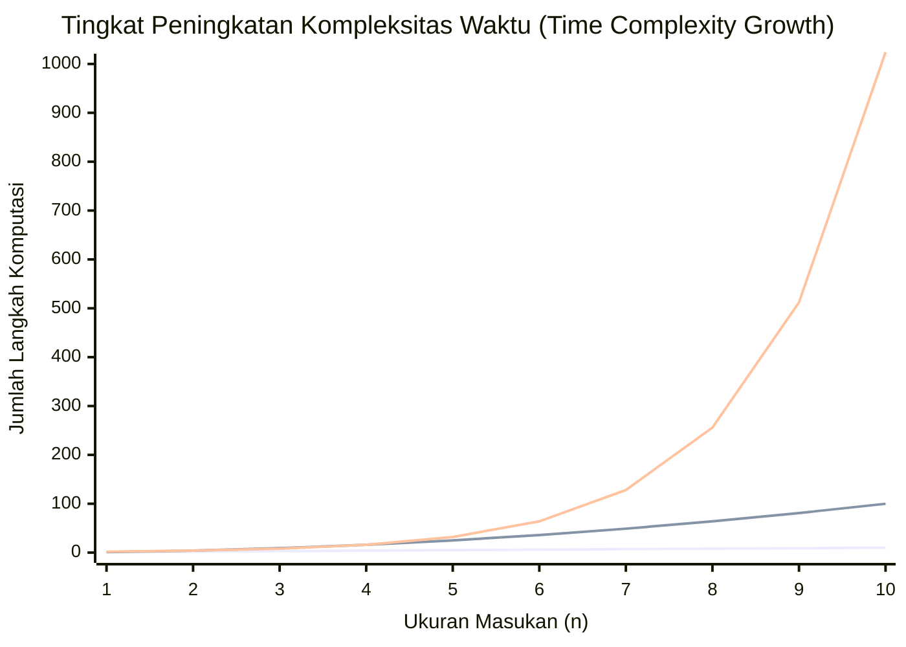
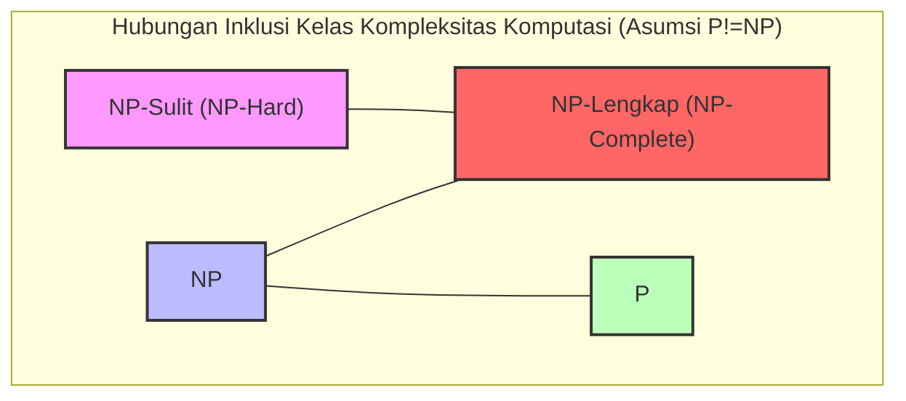
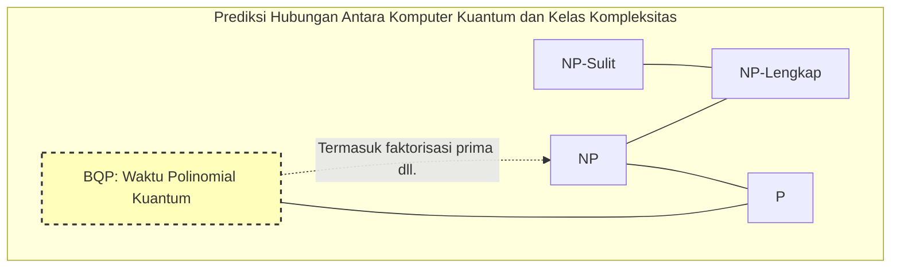

Dalam ilmu komputer, dan juga dalam matematika modern, terdapat masalah belum terpecahkan yang paling terkenal dan paling penting. Itu adalah **Masalah P vs NP** .

Pada tahun 2000, Clay Mathematics Institute menawarkan hadiah masing-masing 1 juta dolar untuk 7 masalah matematika yang belum terpecahkan. Ini disebut **Masalah Hadiah Milenium** . Ada yang sudah dipecahkan seperti Konjektur Poincaré, tetapi **Masalah P vs NP** masih belum menunjukkan sedikit pun petunjuk penyelesaian sepenuhnya.

Dalam artikel ini, kami akan menggali lebih dalam dan menjelaskan seluruh gambaran dari **Masalah P vs NP** ini, mulai dari dasar-dasar kelas kompleksitas komputasi (P, NP, NP-Lengkap, NP-Sulit), signifikansi praktis dalam pemrograman, hingga dampaknya pada dunia jika masalah ini terpecahkan.

---

## 1. Teori Kompleksitas dan Dasar-Dasar Algoritma

Untuk memahami **Masalah P vs NP** , pertama-tama kita perlu memahami konsep "kompleksitas algoritma". Komputer melakukan komputasi selangkah demi selangkah untuk menyelesaikan suatu masalah, tetapi bagaimana waktu (jumlah langkah) dan memori (ruang) yang diperlukan untuk komputasi meningkat ketika ukuran masukan $n$ bertambah ditunjukkan oleh **Kompleksitas Komputasi (Computational Complexity)** .

### Notasi Landau (Big-O Notation)

Saat menunjukkan kompleksitas, yang sering digunakan adalah notasi $O$. Ini mewakili batas atas dari kompleksitas waktu terburuk terhadap ukuran masukan $n$.

- $O(1)$: Waktu konstan. Tidak bergantung pada ukuran masukan.
- $O(\log n)$: Waktu logaritmik. Pencarian biner, dll.
- $O(n)$: Waktu linier. Pencarian sederhana, dll.
- $O(n \log n)$: Algoritma pengurutan yang efisien (quicksort, mergesort, dll.).
- $O(n^2), O(n^3)$: Waktu polinomial. Loop ganda, loop tiga kali, dll.
- $O(2^n)$: Waktu eksponensial. Pencarian brute-force, dll.
- $O(n!)$: Waktu faktorial. Pencarian brute-force sederhana pada masalah pedagang keliling, dll.

Grafik berikut ini memvisualisasikan tingkat peningkatan jumlah langkah komputasi terhadap ukuran masukan.


*(Yang paling bawah menunjukkan $O(n)$, tengah $O(n^2)$, dan yang paling atas $O(2^n)$. Kita dapat melihat peningkatan eksplosif dari waktu eksponensial.)*

Dalam teori kompleksitas, waktu yang direpresentasikan oleh $O(n^k)$ ($k$ adalah konstanta) disebut **Waktu Polinomial (Polynomial Time)** , dan dianggap sebagai salah satu standar bahwa komputasi mungkin dilakukan dalam waktu praktis. Di sisi lain, waktu eksponensial seperti $O(2^n)$ akan memakan waktu komputasi yang melebihi umur alam semesta meskipun $n$ hanya puluhan, sehingga secara praktis dianggap "tidak dapat dipecahkan".

---

## 2. Apa itu Kelas P? (Masalah yang "Dapat Dipecahkan" dalam Waktu Praktis)

**Kelas P (P: Polynomial time)** didefinisikan sebagai "kumpulan masalah keputusan yang dapat dipecahkan dalam waktu polinomial pada mesin Turing deterministik".

Secara sederhana, itu adalah **"masalah di mana komputer dapat menemukan jawabannya sendiri dalam waktu praktis"** .

### Masalah Representatif dari Kelas P

- **Masalah Pengurutan**: Mengurutkan nilai yang diberikan secara menaik (seperti $O(n \log n)$).
- **Masalah Rute Terpendek**: Seperti navigasi mobil, menemukan rute terpendek antara 2 titik (dengan algoritma [Dijkstra](https://kenji.blog/id/p/graph-theory-dijkstra-a-star/) $O(E + V \log V)$).
- **Masalah Pengujian Primalitas**: Menentukan apakah suatu bilangan adalah bilangan prima (telah dibuktikan bahwa ini dapat dipecahkan dalam waktu polinomial oleh algoritma AKS).

Berikut ini adalah implementasi Python dari algoritma pencarian biner, yang merupakan contoh representatif dari Kelas P.

```python
def binary_search(arr, target):
    """
    Algoritma untuk melakukan pencarian biner pada array yang telah diurutkan untuk menemukan target (Contoh Kelas P)
    Kompleksitas waktu: O(log n)
    """
    left, right = 0, len(arr) - 1
    
    while left <= right:
        mid = (left + right) // 2
        if arr[mid] == target:
            return mid
        elif arr[mid] < target:
            left = mid + 1
        else:
            right = mid - 1
            
    return -1

# Uji coba
sorted_data = [1, 3, 5, 7, 9, 11, 13, 15]
print("Index:", binary_search(sorted_data, 7)) # Output: 3
```

Masalah-masalah ini kompleksitasnya tidak meledak meskipun ukuran masukan menjadi lebih besar, dan dapat dipecahkan secara terukur (scalable).

---

## 3. Apa itu Kelas NP? (Masalah yang "Dapat Diverifikasi" dalam Waktu Praktis)

**Kelas NP (NP: Nondeterministic Polynomial time)** didefinisikan sebagai "kumpulan masalah keputusan yang dapat dipecahkan dalam waktu polinomial pada mesin Turing non-deterministik", atau lebih mudah dipahami sebagai **"kumpulan masalah yang, ketika diberikan bukti (solusi yang menjadi bukti), kebenarannya dapat diverifikasi dalam waktu polinomial"** .

Ini dapat diartikan kembali sebagai **"mungkin sangat sulit untuk menemukan jawabannya sendiri, tetapi jika diberikan sesuatu yang terlihat seperti jawaban, kita dapat dengan cepat memeriksa apakah itu benar atau tidak"** .

### Masalah Representatif dari Kelas NP

- **Sudoku**: Sangat sulit untuk mengisi papan, tetapi jika kita diberikan papan yang sudah terisi penuh, kita dapat memeriksanya secara instan apakah melanggar aturan (apakah ada duplikasi di setiap baris, kolom, blok).
- **Masalah Jumlah Subset (Subset Sum)**: Dapatkah kita memilih beberapa angka dari sekumpulan bilangan bulat yang diberikan agar totalnya mencapai angka tertentu? Menemukan solusi memerlukan pencarian brute-force, tetapi jika diberikan bukti (solusi) "pilih ini dan ini", kita dapat memastikannya hanya dengan menambahkan.
- **Masalah Pedagang Keliling (Versi Keputusan)**: Apakah ada rute dengan jarak $K$ atau kurang yang mengunjungi semua kota dan kembali?

Berikut adalah contoh kode Python yang "memverifikasi" solusi Sudoku. Verifikasi itu sendiri dapat dilakukan dalam waktu polinomial $O(n^2)$.

```python
def verify_sudoku_solution(board):
    """
    Memverifikasi apakah papan Sudoku yang sudah selesai (9x9) itu benar (Contoh proses verifikasi Kelas NP)
    Kompleksitas waktu: O(n^2) - Sangat cepat
    """
    def is_valid_group(group):
        return sorted(list(group)) == [1, 2, 3, 4, 5, 6, 7, 8, 9]

    # Verifikasi baris dan kolom
    for i in range(9):
        if not is_valid_group(board[i]):
            return False
        if not is_valid_group([board[j][i] for j in range(9)]):
            return False

    # Verifikasi blok 3x3
    for i in range(0, 9, 3):
        for j in range(0, 9, 3):
            block = [board[x][y] for x in range(i, i+3) for y in range(j, j+3)]
            if not is_valid_group(block):
                return False

    return True

# Solusi Sudoku yang normal
valid_board = [
    [5,3,4,6,7,8,9,1,2],
    [6,7,2,1,9,5,3,4,8],
    [1,9,8,3,4,2,5,6,7],
    [8,5,9,7,6,1,4,2,3],
    [4,2,6,8,5,3,7,9,1],
    [7,1,3,9,2,4,8,5,6],
    [9,6,1,5,3,7,2,8,4],
    [2,8,7,4,1,9,6,3,5],
    [3,4,5,2,8,6,1,7,9]
]
print("Hasil verifikasi:", verify_sudoku_solution(valid_board)) # Output: True
```

**Semua masalah yang termasuk dalam P juga termasuk dalam NP.** Alasannya adalah, jika "dapat diselesaikan sendiri dalam waktu praktis", maka pasti "dapat juga dikonfirmasi kebenarannya dalam waktu praktis ketika diberikan solusi". Singkatnya, jika diekspresikan dengan rumus matematika menjadi seperti berikut ini.

$ P \subseteq NP $

---

## 4. Inti dari Masalah P vs NP: Bisakah "Inspirasi" Diganti dengan "Usaha"?

Sekarang kita akhirnya mendekati inti dari **Masalah P vs NP** yang merupakan Masalah Hadiah Milenium.

Masalahnya sangat sederhana.

> **Apakah Kelas P (masalah yang dapat dipecahkan dalam waktu praktis) dan Kelas NP (masalah yang dapat diverifikasi dalam waktu praktis) sebenarnya merupakan kumpulan yang sama persis? Yaitu, apakah $P = NP$? Atau apakah $P \neq NP$?**

Secara intuitif, antara **"menemukan solusi"** dan **"memeriksa apakah solusi tersebut benar"** , yang pertama terasa jauh lebih sulit. Jika membandingkan memecahkan teka-teki Sudoku dengan memeriksa jawabannya, memeriksa jawabannya tentu lebih mudah.

Jika **P = NP** itu benar, maka itu berarti "masalah yang jawabannya dapat diperiksa dengan mudah sebenarnya juga dapat dipecahkan dengan mudah asalkan kita tahu cara menyelesaikannya". Karena ini sangat bertentangan dengan intuisi manusia, mayoritas ahli matematika dan ilmuwan komputer modern (lebih dari 90% dalam survei) memprediksi bahwa **$P \neq NP$** . Namun, belum ada seorang pun yang mampu membuktikannya secara matematis.

---

## 5. NP-Lengkap dan NP-Sulit (Masalah Tersulit di Alam Semesta)

Yang sangat diperlukan dalam memahami masalah ini adalah konsep **NP-Lengkap (NP-Complete)** dan **NP-Sulit (NP-Hard)** .

### Reduksi Waktu Polinomial (Polynomial-time Reduction)
Misalkan ada program yang menyelesaikan Masalah $A$. Saat ingin memecahkan Masalah $B$, jika kita dapat dengan cepat (dalam waktu polinomial) mengubah input Masalah $B$ menjadi input Masalah $A$, menemukan solusi menggunakan program Masalah $A$, dan kemudian dengan cepat mengubah hasilnya menjadi solusi untuk Masalah $B$, kita dapat mengatakan "Masalah $B$ tidak lebih sulit daripada Masalah $A$". Ini disebut **Reduksi Waktu Polinomial** .

### NP-Sulit (NP-Hard)
Ini adalah kelas masalah di mana **semua** masalah dalam kelas NP dapat direduksi dalam waktu polinomial ke masalah ini. Dengan kata lain, ini adalah "masalah yang setidaknya sama sulitnya atau lebih sulit daripada masalah apa pun di NP". Masalah NP-Sulit bahkan tidak perlu berupa masalah keputusan.

### NP-Lengkap (NP-Complete)
Ini adalah kelas masalah yang bersifat NP-Sulit dan juga termasuk dalam kelas NP. Ini berarti **"kumpulan masalah yang paling sulit dalam Kelas NP"** .



Secara mengejutkan, pada tahun 1971, Stephen Cook dan Leonid Levin membuktikan bahwa **Masalah Pemenuhan Boolean (SAT)** adalah NP-Lengkap (Teorema Cook-Levin).

Kemudian, Richard Karp secara berturut-turut membuktikan bahwa banyak masalah optimasi di dunia nyata seperti Masalah Pedagang Keliling, Masalah Ransel (Knapsack Problem), dan pewarnaan graf, adalah **NP-Lengkap** (21 Masalah NP-Lengkap Karp).

**Sifat terbesar dari masalah NP-Lengkap adalah: "Jika satu saja algoritma ditemukan yang dapat menyelesaikan salah satu masalah NP-Lengkap dalam waktu polinomial, maka semua masalah NP dapat diselesaikan dalam waktu polinomial (yaitu $P = NP$)."** 
Ini bisa disebut sebagai efek domino pamungkas dalam ilmu komputer.

---

## 6. Perbandingan dan Implementasi Spesifik dalam Pemrograman

Di sini, kita akan membandingkan "masalah yang terlihat mirip tetapi memiliki tingkat kesulitan yang sama sekali berbeda" dan menjelaskan kendala yang dihadapi oleh para programmer.

### Sirkuit Euler (Kelas P) vs Sirkuit Hamilton (NP-Lengkap)

- **Sirkuit Euler**: Menemukan rute yang melewati semua "sisi" tepat satu kali dan kembali ke titik asal (menggambar tanpa mengangkat pena). Ini dapat dipecahkan dalam waktu polinomial $O(V+E)$ hanya dengan memeriksa derajat setiap titik sudut.
- **Sirkuit Hamilton**: Menemukan rute yang melewati semua "titik sudut" tepat satu kali dan kembali ke titik asal (dasar dari Masalah Pedagang Keliling). Hanya dengan sedikit mengubah kondisinya, ini menjadi **NP-Lengkap** , dan algoritma efisien belum ditemukan.

### Contoh Implementasi Masalah Pedagang Keliling (TSP) dan Algoritma Aproksimasi

Jika kita mencoba menyelesaikan Masalah Pedagang Keliling yang merupakan NP-Sulit (versi masalah optimasi) secara presisi, kompleksitasnya akan meledak. Mari kita bandingkan solusi eksak (brute force) dan solusi aproksimasi yang praktis (metode greedy) dengan kode Python berikut.

```python
import itertools
import math

def calculate_distance(city1, city2):
    return math.hypot(city1[0]-city2[0], city1[1]-city2[1])

# 1. Solusi Eksak (Brute Force) - Kompleksitas Waktu: O(N!)
def tsp_brute_force(cities):
    n = len(cities)
    best_dist = float('inf')
    best_path = None
    
    # Tetapkan kota pertama dan coba semua permutasi untuk kota-kota yang tersisa
    for perm in itertools.permutations(range(1, n)):
        path = (0,) + perm
        dist = 0
        for i in range(n):
            dist += calculate_distance(cities[path[i]], cities[path[(i+1)%n]])
        
        if dist < best_dist:
            best_dist = dist
            best_path = path
            
    return best_dist, best_path

# 2. Solusi Aproksimasi (Metode Greedy) - Kompleksitas Waktu: O(N^2)
def tsp_greedy(cities):
    n = len(cities)
    unvisited = set(range(1, n))
    current_city = 0
    path = [0]
    total_dist = 0
    
    while unvisited:
        # Cari kota terdekat yang belum dikunjungi
        next_city = min(unvisited, key=lambda city: calculate_distance(cities[current_city], cities[city]))
        total_dist += calculate_distance(cities[current_city], cities[next_city])
        current_city = next_city
        path.append(current_city)
        unvisited.remove(current_city)
        
    # Kembali ke kota pertama
    total_dist += calculate_distance(cities[current_city], cities[0])
    return total_dist, path

# Eksekusi Uji Coba
cities = [(0, 0), (1, 5), (5, 2), (6, 6), (8, 3), (2, 9), (9, 9)]

dist_exact, path_exact = tsp_brute_force(cities)
dist_greedy, path_greedy = tsp_greedy(cities)

print(f"Solusi Eksak: Jarak {dist_exact:.2f}, Rute {path_exact}")
print(f"Solusi Aproksimasi: Jarak {dist_greedy:.2f}, Rute {path_greedy}")
```

Ketika jumlah kota melampaui $N=20$, solusi eksak (brute-force) akan memakan waktu seumur alam semesta bahkan dengan superkomputer modern. Namun, dengan menggunakan algoritma aproksimasi seperti metode greedy, kita bisa mendapatkan **solusi yang mungkin tidak optimal tetapi cukup baik** dalam sekejap. Programmer dituntut memiliki keahlian perancangan untuk menyerah pada solusi eksak begitu mereka menyadari masalahnya adalah NP-Sulit, dan beralih ke heuristik atau algoritma aproksimasi.

---

## 7. Bagaimana Jika P = NP?

Saat ini, sistem kriptografi di seluruh dunia (seperti SSL/TLS yang digunakan dalam belanja online, dan blockchain seperti Bitcoin) memanfaatkan asimetri **"butuh waktu yang sangat lama untuk dipecahkan, tetapi verifikasi dapat dilakukan dalam sekejap"** .

Faktorisasi prima yang menjadi inti dari kriptografi [RSA](https://kenji.blog/id/p/modern-cryptography-public-key-hash-signature/) adalah salah satunya.
Misalkan seseorang membuktikan bahwa $P = NP$ dan membangun algoritma ajaib (pembuktian konstruktif) yang memecahkan masalah NP dalam waktu polinomial. Hal itu akan memicu **pergeseran paradigma dalam peradaban manusia** sebagai berikut.

1. **Runtuhnya Kriptografi**: Kriptografi kunci publik modern seperti RSA dan kurva eliptik akan segera dapat ditembus, dan keamanan digital akan hancur lebur.
2. **Evolusi Pamungkas AI dan Pembelajaran Mesin**: Pembobotan optimal dari jaringan saraf dan strategi optimal dari pembelajaran penguatan akan dapat dihitung secara instan.
3. **Lompatan Besar dalam Penemuan Obat dan Ilmu Kehidupan**: Struktur pelipatan protein (yang juga direduksi menjadi masalah NP-Sulit) dapat dihitung dalam sekejap, dan obat spesifik untuk penyakit tak tersembuhkan akan terus-menerus dikembangkan oleh AI.
4. **Optimasi Sempurna dalam Logistik dan Produksi**: Rantai pasok pamungkas yang bebas dari pemborosan apa pun akan dibangun, dan sebagian besar masalah energi akan terselesaikan.

Seperti yang dikatakan matematikawan Scott Aaronson, "Jika $P = NP$, maka lompatan kreatif tidak ada di dunia, dan semua inspirasi atau intuisi jenius dapat digantikan oleh perhitungan mekanis", ini adalah masalah yang bahkan memiliki makna filosofis.

---

## 8. Komputer Kuantum dan Masalah P vs NP

Belakangan ini, dengan munculnya komputer kuantum, kesalahpahaman bahwa "komputer kuantum mungkin dapat memecahkan masalah NP-Lengkap" mulai menyebar luas.

Dalam teori kompleksitas komputasi, kelas masalah yang dapat diselesaikan oleh komputer kuantum dalam waktu polinomial disebut **BQP (Bounded-error Quantum Polynomial time)** . Melalui "Algoritma Shor" yang ditemukan oleh Peter Shor, dibuktikan bahwa faktorisasi prima termasuk dalam BQP (dapat diselesaikan dengan cepat oleh komputer kuantum).

Namun, konsensus dalam komunitas ilmu komputer saat ini adalah, **tidak dianggap bahwa $NP-Lengkap \subseteq BQP$** .
Dengan kata lain, diyakini bahwa bahkan komputer kuantum tidak dapat memecahkan masalah NP-Lengkap seperti Masalah Pedagang Keliling atau Masalah Ransel dalam waktu polinomial. Komputer kuantum bukanlah tongkat ajaib, melainkan sebuah mesin yang hanya memancarkan kecepatan luar biasa untuk masalah-masalah yang memiliki struktur matematika tertentu (seperti penemuan periodisitas).


*(Kelas BQP berisi P dan dapat memecahkan sebagian dari NP (seperti faktorisasi prima), namun diprediksi tidak mencakup seluruh masalah NP-Lengkap.)*

---

## 9. Signifikansi dan Cara Menghadapi bagi Insinyur dan Programmer

Sebagian besar tugas yang biasa dihadapi oleh kita sebagai insinyur perangkat lunak dalam bisnis sehari-hari (penjadwalan shift, optimasi rute pengiriman, alokasi sumber daya cloud, masalah pengepakan) adalah masalah **NP-Sulit** .

Ketika pihak bisnis meminta "buatkan sistem yang menghasilkan solusi optimal untuk masalah ini", tanpa pengetahuan tentang teori kompleksitas, Anda akan menulis program yang tak ada akhirnya dan membuat server down.

Pelajaran terbesar yang diajarkan oleh **Masalah P vs NP** (dan teori kelengkapan NP) kepada programmer adalah sebagai berikut.

1. **Kenali Tingkat Kesulitan Masalah**: Jika Anda bisa membuktikan (atau memperkirakan) bahwa masalah yang dihadapi adalah NP-Sulit, hentikan pencarian algoritma yang membutuhkan solusi optimal yang sempurna.
2. **Beralih ke Relaksasi dan Aproksimasi**:
    - **Algoritma Aproksimasi**: Memecahkan dalam waktu polinomial dengan menjamin margin kesalahan dari solusi optimal berada dalam kisaran tertentu.
    - **Heuristik**: Mengadopsi metode seperti algoritma genetik atau *simulated annealing*, yang secara matematis tidak bergaransi tetapi secara empiris dapat dengan cepat memberikan "solusi yang cukup baik".
    - **Pemrograman Dinamis ([DP](https://kenji.blog/id/p/dynamic-programming-dp-introduction-knapsack-fibonacci/))**: Jika ada solusi yang bergantung pada ukuran numerik input (waktu polinomial semu) seperti pada Masalah Ransel, gunakan batasan inputnya.
    - **SAT Solver / MILP Solver**: Formulasikan dan lemparkan ke solver optimasi matematis umum yang berkembang pesat belakangan ini. Karena solver melakukan pemangkasan tingkat lanjut secara internal, ia sering kali dapat menghasilkan solusi eksak jika ukurannya dalam batas praktis.

```python
# Solusi Masalah Ransel 0-1 Menggunakan Pemrograman Dinamis (Contoh Waktu Polinomial Semu)
def knapsack_dp(weights, values, capacity):
    """
    Contoh masalah yang NP-Sulit, tetapi dapat diselesaikan dalam waktu polinomial semu O(N*W) jika menggunakan DP
    """
    n = len(weights)
    # dp[i][w] : nilai maksimal saat beratnya w atau kurang menggunakan hingga barang ke-i
    dp = [[0] * (capacity + 1) for _ in range(n + 1)]
    
    for i in range(1, n + 1):
        for w in range(1, capacity + 1):
            if weights[i-1] <= w:
                # Mengambil nilai maksimal antara kasus dimasukkan dan tidak dimasukkan
                dp[i][w] = max(dp[i-1][w], dp[i-1][w-weights[i-1]] + values[i-1])
            else:
                dp[i][w] = dp[i-1][w]
                
    return dp[n][capacity]

weights = [2, 3, 4, 5]
values = [3, 4, 5, 6]
capacity = 5
print(f"Nilai maksimal ransel: {knapsack_dp(weights, values, capacity)}")
```

---

## Kesimpulan: Tantangan Terhadap Batas Kecerdasan Manusia

**Masalah P vs NP** bukan sekadar teka-teki matematika biasa. Itu adalah pertanyaan filosofis berskala besar yang menanyakan batas kecerdasan manusia: "Apa itu komputasi yang efisien?", "Bisakah pembuktian matematis diotomatisasi?", dan "Bisakah inspirasi dijadikan algoritma?".

Hadiah 1 juta dolar dari Clay Mathematics Institute mungkin terlalu murah mengingat seberapa pentingnya masalah ini. Jika Anda berhasil menyelesaikan algoritma pembuktian $P = NP$, Anda bahkan bisa mentransfer semua mata uang kripto ke dompet Anda sendiri sebelum menerima hadiahnya (tentu saja, secara etika Anda sama sekali tidak boleh melakukannya).

Akankah kita melihat akhir dari masalah ini di masa hidup kita melalui terobosan penelitian masa depan? Atau akankah dibuktikan bahwa itu "tidak mungkin dibuktikan atau disangkal" seperti Teorema Ketidaklengkapan Gödel? Kita harus terus memantau garis depan dari teori kompleksitas komputasi.

> **Referensi / Tautan Terkait**
> - Masalah Hadiah Milenium Clay Mathematics Institute (Clay Mathematics Institute)
> - Stephen Cook "The Complexity of Theorem-Proving Procedures" (1971)
> - Richard Karp "Reducibility Among Combinatorial Problems" (1972)
> - Michael Sipser "Introduction to the Theory of Computation" (Sipser, Introduction to the Theory of Computation)
