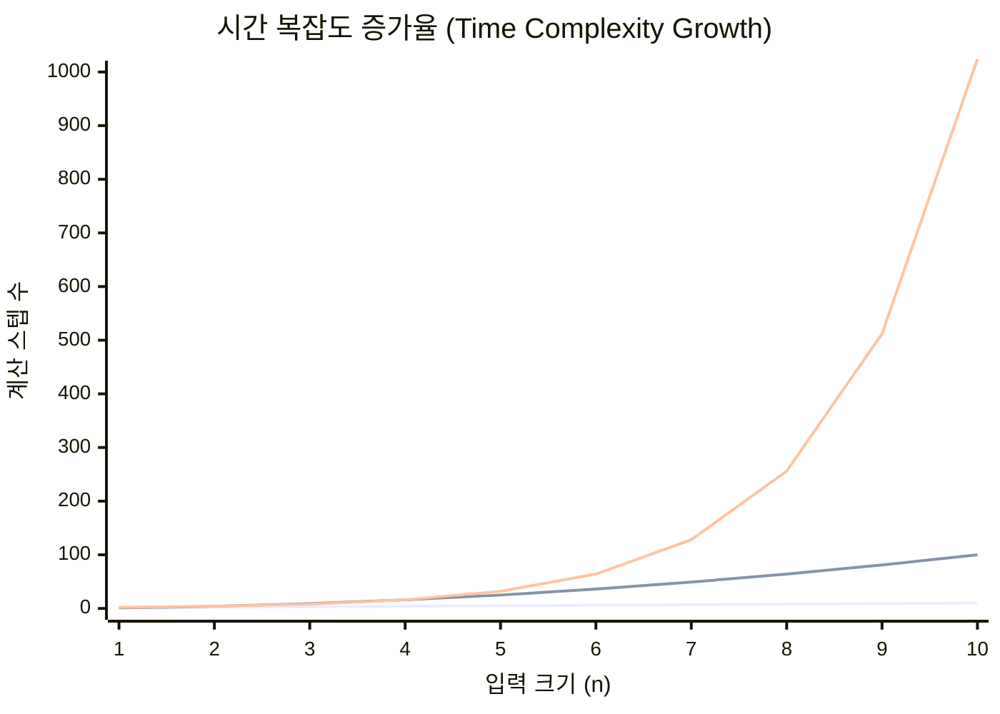
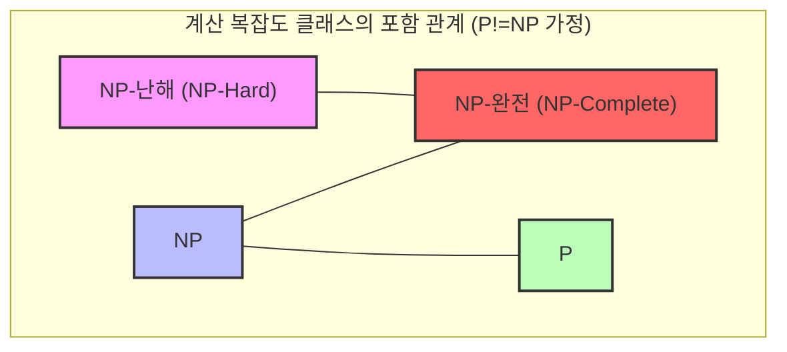
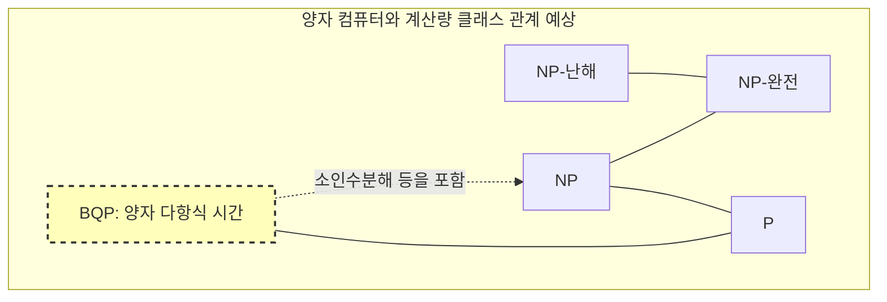

컴퓨터 과학에서, 그리고 현대 수학에서 가장 유명하고 가장 중요하게 여겨지는 미해결 문제가 있습니다. 그것이 바로 **P vs NP 문제** 입니다.

2000년 클레이 수학 연구소는 7개의 수학적 미해결 문제에 대해 각각 100만 달러의 현상금을 걸었습니다. 이들은 **밀레니엄 현상 문제** 라고 불립니다. 푸앵카레 추측처럼 이미 해결된 것도 있지만, **P vs NP 문제** 는 아직까지 해결의 실마리조차 완전히 보이지 않고 있습니다.

본 기사에서는 이 **P vs NP 문제** 의 전모를, 계산 복잡도 클래스(P, NP, NP-완전, NP-난해)의 기초부터 프로그래밍에서의 실천적인 의의, 나아가 만약 해명되었을 경우 세계에 미칠 영향까지 상세히 깊이 파헤쳐 해설합니다.

---

## 1. 계산 복잡도 이론과 알고리즘의 기초

**P vs NP 문제** 를 이해하기 위해서는 먼저 "알고리즘의 계산량"이라는 개념을 이해해야 합니다. 컴퓨터는 어떤 문제를 풀기 위해 단계별로 계산을 수행하지만, 입력 크기 $n$ 이 커졌을 때 계산에 필요한 시간(스텝 수)이나 메모리(공간)가 어떻게 증가하는지를 나타내는 것이 **계산 복잡도(Computational Complexity)** 입니다.

### 란다우 기호 (Big-O Notation)

계산량을 나타낼 때 자주 사용되는 것이 $O$ 표기법입니다. 이는 입력 크기 $n$ 에 대한 최악의 계산량 상한을 나타냅니다.

- $O(1)$: 상수 시간. 입력 크기에 의존하지 않음.
- $O(\log n)$: 로그 시간. 이진 탐색 등.
- $O(n)$: 선형 시간. 단순 탐색 등.
- $O(n \log n)$: 효율적인 정렬 알고리즘(퀵 정렬, 병합 정렬 등).
- $O(n^2), O(n^3)$: 다항식 시간. 이중 루프, 삼중 루프 등.
- $O(2^n)$: 지수 시간. 완전 탐색에 의한 검색 등.
- $O(n!)$: 팩토리얼 시간. 외판원 문제의 단순 완전 탐색 등.

아래 그래프는 입력 크기에 대한 계산 스텝 수의 증가 정도를 시각화한 것입니다.


*(가장 아래가 $O(n)$ , 중간이 $O(n^2)$ , 가장 위가 $O(2^n)$ 을 나타냅니다. 지수 시간의 폭발적인 증가를 알 수 있습니다.)*

계산 복잡도 이론에서 $O(n^k)$ ( $k$ 는 상수)로 표현되는 시간을 **다항식 시간(Polynomial Time)** 이라고 부르며, 실용적인 시간 안에 계산 가능하다는 하나의 기준으로 간주합니다. 반면, $O(2^n)$ 등의 지수 시간은 $n$ 이 수십만 되어도 우주의 수명을 초과하는 계산 시간이 필요하기 때문에 실질적으로 "풀 수 없다"고 간주됩니다.

---

## 2. 클래스 P란 무엇인가? (현실적인 시간 안에 "풀 수 있는" 문제)

**클래스 P (P: Polynomial time)** 란, "결정론적 튜링 기계에서 다항식 시간에 풀 수 있는 판정 문제의 집합"으로 정의됩니다.

쉽게 말해, **"컴퓨터가 현실적인 시간 안에 스스로 답을 이끌어낼 수 있는 문제"** 입니다.

### 클래스 P의 대표적인 문제

- **정렬 문제**: 주어진 숫자를 오름차순으로 정렬 ( $O(n \log n)$ 등).
- **최단 경로 문제**: 내비게이션처럼 두 지점 간의 최단 경로 찾기 (다익스트라 알고리즘으로 $O(E + V \log V)$ ).
- **소수 판별 문제**: 어떤 수가 소수인지 여부를 판별 (AKS 소수 판별법에 의해 다항식 시간에 풀 수 있음이 증명됨).

아래는 클래스 P의 대표적인 예인 이진 탐색 알고리즘의 Python 구현입니다.

```python
def binary_search(arr, target):
    """
    정렬된 배열에서 target을 이진 탐색하는 알고리즘 (클래스 P의 예)
    시간 복잡도: O(log n)
    """
    left, right = 0, len(arr) - 1
    
    while left <= right:
        mid = (left + right) // 2
        if arr[mid] == target:
            return mid
        elif arr[mid] < target:
            left = mid + 1
        else:
            right = mid - 1
            
    return -1

# 테스트
sorted_data = [1, 3, 5, 7, 9, 11, 13, 15]
print("Index:", binary_search(sorted_data, 7)) # Output: 3
```

이러한 문제들은 입력 크기가 커져도 계산량이 폭발하지 않고 확장 가능하게 풀 수 있습니다.

---

## 3. 클래스 NP란 무엇인가? (현실적인 시간 안에 "확인할 수 있는" 문제)

**클래스 NP (NP: Nondeterministic Polynomial time)** 란, "비결정론적 튜링 기계에서 다항식 시간에 풀 수 있는 판정 문제의 집합", 혹은 더 알기 쉽게 **"증거(증거가 되는 해답)가 주어졌을 때, 그것이 맞는지 여부를 다항식 시간에 검증할 수 있는 문제의 집합"** 으로 정의됩니다.

이것은 **"스스로 답을 찾는 것은 엄청나게 어려울지 모르지만, 답처럼 보이는 것을 받았을 때 그것이 정답인지는 바로 확인할 수 있는 문제"** 라고 바꿔 말할 수 있습니다.

### 클래스 NP의 대표적인 문제

- **스도쿠 (Sudoku)**: 빈칸을 채우는 것은 어렵지만, 모두 채워진 판을 받으면 규칙을 위반하지 않았는지(각 행·열·블록에 중복이 없는지)는 순식간에 확인할 수 있습니다.
- **부분합 문제 (Subset Sum)**: 주어진 정수 집합에서 몇 개를 선택하여 합계를 특정 숫자로 만들 수 있는가? 해답을 찾으려면 완전 탐색이 필요하지만, "이것과 이것을 선택한다"라는 증거(해답)를 받으면 덧셈만으로 확인할 수 있습니다.
- **외판원 문제 (판정 버전)**: 모든 도시를 방문하고 돌아오는 거리가 $K$ 이하인 루트가 존재하는가?

아래는 스도쿠의 해답을 "검증"하는 Python 코드 예시입니다. 검증 자체는 $O(n^2)$ 의 다항식 시간에 할 수 있습니다.

```python
def verify_sudoku_solution(board):
    """
    완성된 스도쿠 판(9x9)이 맞는지 검증 (클래스 NP의 검증 과정 예시)
    시간 복잡도: O(n^2) - 매우 빠름
    """
    def is_valid_group(group):
        return sorted(list(group)) == [1, 2, 3, 4, 5, 6, 7, 8, 9]

    # 행과 열 검증
    for i in range(9):
        if not is_valid_group(board[i]):
            return False
        if not is_valid_group([board[j][i] for j in range(9)]):
            return False

    # 3x3 블록 검증
    for i in range(0, 9, 3):
        for j in range(0, 9, 3):
            block = [board[x][y] for x in range(i, i+3) for y in range(j, j+3)]
            if not is_valid_group(block):
                return False

    return True

# 올바른 스도쿠 해답
valid_board = [
    [5,3,4,6,7,8,9,1,2],
    [6,7,2,1,9,5,3,4,8],
    [1,9,8,3,4,2,5,6,7],
    [8,5,9,7,6,1,4,2,3],
    [4,2,6,8,5,3,7,9,1],
    [7,1,3,9,2,4,8,5,6],
    [9,6,1,5,3,7,2,8,4],
    [2,8,7,4,1,9,6,3,5],
    [3,4,5,2,8,6,1,7,9]
]
print("검증 결과:", verify_sudoku_solution(valid_board)) # Output: True
```

**P에 속하는 문제는 모두 NP에 속합니다.** 왜냐하면 "스스로 현실적인 시간 안에 풀 수 있다"면 "해답을 받았을 때의 확인도 현실적인 시간에 할 수 있다"는 것이 당연하기 때문입니다. 즉 수식으로 나타내면 다음과 같습니다.

$ P \subseteq NP $

---

## 4. P vs NP 문제의 핵심: "영감"은 "노력"으로 대체할 수 있는가?

여기서 드디어 밀레니엄 현상 문제인 **P vs NP 문제** 의 핵심에 다가갑니다.

문제는 매우 단순합니다.

> **클래스 P (현실적인 시간 안에 풀 수 있는 문제)와 클래스 NP (현실적인 시간 안에 검증할 수 있는 문제)는 사실 완전히 동일한 집합이 아닐까? 즉, $P = NP$ 인가? 아니면 $P \neq NP$ 인가?**

직관적으로는 **"해답을 찾는 것"** 과 **"해답이 맞는지 확인하는 것"** 에서 전자가 압도적으로 어렵게 느껴집니다. 스도쿠 퍼즐을 푸는 것과 답을 맞추는 것을 비교하면, 답을 맞추는 것이 더 쉽지요.

만약 **P = NP** 라면, "답을 맞추는 것을 쉽게 할 수 있는 문제는 사실 푸는 방법만 안다면 쉽게 풀 수 있다"는 의미가 됩니다. 이는 인간의 직관에 크게 반하기 때문에 현대 수학자나 컴퓨터 과학자의 대다수(설문조사에서는 9할 이상)는 **$P \neq NP$** 라고 예상하고 있습니다. 그러나 그것을 수학적으로 증명해낸 사람은 아직 아무도 없습니다.

---

## 5. NP-완전과 NP-난해 (우주에서 가장 어려운 문제들)

이 문제를 이해하는 데 있어 빼놓을 수 없는 것이 **NP-완전 (NP-Complete)** 과 **NP-난해 (NP-Hard)** 라는 개념입니다.

### 다항식 시간 환원 (Polynomial-time Reduction)
어떤 문제 $A$ 를 푸는 프로그램이 있다고 가정합시다. 문제 $B$ 를 풀고 싶을 때, 문제 $B$ 의 입력을 빠르게(다항식 시간에) 문제 $A$ 의 입력으로 변환하고, 문제 $A$ 의 프로그램을 사용하여 해답을 낸 뒤, 그 결과를 빠르게 문제 $B$ 의 해답으로 변환할 수 있다면, "문제 $B$ 는 문제 $A$ 보다 어렵지 않다"고 말할 수 있습니다. 이를 **다항식 시간 환원** 이라고 부릅니다.

### NP-난해 (NP-Hard)
클래스 NP에 속하는 **모든** 문제로부터 다항식 시간에 환원할 수 있는 문제의 클래스입니다. 즉, "NP에 속하는 어떤 문제보다 최소한 같거나 그 이상으로 어려운 문제"입니다. NP-난해인 문제는 심지어 판정 문제일 필요조차 없습니다.

### NP-완전 (NP-Complete)
NP-난해이면서 자기 자신도 클래스 NP에 속하는 문제의 클래스입니다. 이는 **"클래스 NP 중에서 가장 어려운 문제들의 모임"** 을 의미합니다.



놀랍게도 1971년에 스티븐 쿡과 레오니드 레빈에 의해 **충족 가능성 문제 (SAT)** 가 NP-완전임이 증명되었습니다 (쿡-레빈 정리).

그 후 리처드 카프에 의해 외판원 문제, 배낭 문제, 그래프 채색 문제 등 실생활의 최적화 문제 대부분이 **NP-완전** 임이 잇달아 증명되었습니다 (카프의 21개 NP-완전 문제).

**NP-완전 문제의 가장 큰 특징은, "NP-완전 문제 중 단 하나라도 다항식 시간에 풀 수 있는 알고리즘이 발견되면, 모든 NP 문제가 다항식 시간에 풀린다 (즉 $P = NP$ 가 된다)"는 점입니다.**
이것은 컴퓨터 과학에 있어서 궁극의 도미노 현상이라고 할 수 있습니다.

---

## 6. 프로그래밍에서의 구체적인 비교와 구현

여기서는 "비슷하지만 난이도가 전혀 다른 문제"를 비교하고 프로그래머가 직면하는 벽을 해설합니다.

### 오일러 경로 (클래스 P) vs 해밀턴 경로 (NP-완전)

- **오일러 경로**: 모든 "간선"을 정확히 한 번씩 지나 원래 정점으로 돌아오는 루트 찾기 (한붓그리기). 이는 각 정점의 차수를 조사하는 것만으로 $O(V+E)$ 의 다항식 시간에 풀 수 있습니다.
- **해밀턴 경로**: 모든 "정점"을 정확히 한 번씩 지나 원래 정점으로 돌아오는 루트 찾기 (외판원 문제의 기초). 조건을 조금 바꾼 것만으로 이것은 **NP-완전** 이 되며, 효율적인 알고리즘은 발견되지 않았습니다.

### 외판원 문제 (TSP) 구현 예시와 근사 알고리즘

NP-난해(최적화 문제 버전)인 외판원 문제를 엄밀하게 풀려고 하면 계산량이 폭발합니다. 아래 Python 코드로 엄밀한 해답(완전 탐색)과 실용적인 근사 해답(탐욕 알고리즘)을 비교해 봅시다.

```python
import itertools
import math

def calculate_distance(city1, city2):
    return math.hypot(city1[0]-city2[0], city1[1]-city2[1])

# 1. 엄밀한 해답 (완전 탐색) - 시간 복잡도: O(N!)
def tsp_brute_force(cities):
    n = len(cities)
    best_dist = float('inf')
    best_path = None
    
    # 첫 번째 도시를 고정하고 나머지 도시의 순열을 모두 시도
    for perm in itertools.permutations(range(1, n)):
        path = (0,) + perm
        dist = 0
        for i in range(n):
            dist += calculate_distance(cities[path[i]], cities[path[(i+1)%n]])
        
        if dist < best_dist:
            best_dist = dist
            best_path = path
            
    return best_dist, best_path

# 2. 근사 해답 (탐욕 알고리즘) - 시간 복잡도: O(N^2)
def tsp_greedy(cities):
    n = len(cities)
    unvisited = set(range(1, n))
    current_city = 0
    path = [0]
    total_dist = 0
    
    while unvisited:
        # 가장 가까운 미방문 도시 찾기
        next_city = min(unvisited, key=lambda city: calculate_distance(cities[current_city], cities[city]))
        total_dist += calculate_distance(cities[current_city], cities[next_city])
        current_city = next_city
        path.append(current_city)
        unvisited.remove(current_city)
        
    # 첫 번째 도시로 돌아가기
    total_dist += calculate_distance(cities[current_city], cities[0])
    return total_dist, path

# 테스트 실행
cities = [(0, 0), (1, 5), (5, 2), (6, 6), (8, 3), (2, 9), (9, 9)]

dist_exact, path_exact = tsp_brute_force(cities)
dist_greedy, path_greedy = tsp_greedy(cities)

print(f"엄밀한 해답: 거리 {dist_exact:.2f}, 경로 {path_exact}")
print(f"근사 해답: 거리 {dist_greedy:.2f}, 경로 {path_greedy}")
```

도시의 수가 $N=20$ 을 넘으면 엄밀한 해답(완전 탐색)은 현대 슈퍼컴퓨터로도 우주의 수명만큼의 시간이 걸립니다. 그러나 탐욕 알고리즘 등의 근사 알고리즘을 사용하면, **최적은 아닐지 몰라도 꽤 괜찮은 해답** 을 순식간에 도출할 수 있습니다. 프로그래머는 문제가 NP-난해라는 것을 간파한 시점에서 엄밀한 해답을 포기하고 휴리스틱스나 근사 알고리즘으로 방향을 트는 설계적 판단이 요구됩니다.

---

## 7. 만약 P = NP라면 세상은 어떻게 될까?

현재 전 세계의 암호 시스템(인터넷 쇼핑에 사용되는 SSL/TLS나 비트코인 등의 블록체인)은 **"푸는 데는 엄청난 시간이 걸리지만, 검증은 순식간에 할 수 있다"** 는 비대칭성을 이용하고 있습니다.

[RSA](https://kenji.blog/ko/p/modern-cryptography-public-key-hash-signature/) 암호의 근간인 소인수분해도 그 중 하나입니다.
만약 누군가가 $P = NP$ 를 증명하고 NP 문제를 다항식 시간에 푸는 마법의 알고리즘(구성적 증명)을 구축했다고 합시다. 그것은 다음과 같은 **인류 사회의 패러다임 시프트** 를 일으킬 것입니다.

1. **암호의 붕괴**: RSA 암호나 타원곡선 암호 등 현대 공개키 암호 체계는 모두 순식간에 깨지고, 디지털 상의 보안은 완전히 붕괴합니다.
2. **AI와 기계 학습의 궁극적 진화**: 신경망의 최적 가중치나 강화 학습의 최적 전략을 즉시 계산할 수 있게 됩니다.
3. **신약 개발과 생명 과학의 도약**: 단백질 폴딩 구조(이것도 NP-난해 문제로 환원됨)를 순식간에 계산할 수 있어 불치병에 대한 특효약이 AI에 의해 차례로 개발될 것입니다.
4. **물류와 생산의 완전한 최적화**: 모든 낭비가 배제된 궁극의 공급망이 구축되어 에너지 문제의 대부분이 해결됩니다.

수학자 스콧 아론슨이 "만약 $P = NP$ 라면 세계에는 창조적 도약이라는 것은 존재하지 않으며, 영감이나 천재적 직관은 모두 기계적인 계산으로 대체할 수 있게 된다"고 말했듯이, 이것은 철학적인 의미조차 갖는 문제인 것입니다.

---

## 8. 양자 컴퓨터와 P vs NP 문제

최근 양자 컴퓨터의 등장으로 "양자 컴퓨터라면 NP-완전 문제를 풀 수 있지 않을까?"라는 오해가 퍼지고 있습니다.

계산 복잡도 이론에서는 양자 컴퓨터가 다항식 시간에 풀 수 있는 문제 클래스를 **BQP (Bounded-error Quantum Polynomial time)** 라고 부릅니다. 피터 쇼어가 고안한 "쇼어 알고리즘"에 의해 소인수분해는 BQP에 속한다는 것이 증명되었습니다 (양자 컴퓨터로 빠르게 풀 수 있음).

그러나 현재 컴퓨터 과학계의 합의로는 **$NP-완전 \subseteq BQP$ 라고는 생각하지 않습니다**.
즉 양자 컴퓨터라고 하더라도 외판원 문제나 배낭 문제와 같은 NP-완전 문제를 다항식 시간에 풀 수는 없다고 생각되고 있습니다. 양자 컴퓨터는 마법의 지팡이가 아니라, 특정 수학적 구조를 가진 문제(주기성 발견 등)에 대해서만 압도적인 속도를 발휘하는 기계인 것입니다.


*(BQP 클래스는 P를 포함하고 NP의 일부(소인수분해 등)를 풀 수 있지만, NP-완전 문제를 모두 포함하고 있지는 않을 것으로 예상됩니다.)*

---

## 9. 엔지니어·프로그래머에게 주는 의미와 대처법

우리 소프트웨어 엔지니어가 일상적으로 직면하는 업무 과제(교대 근무 스케줄링, 배송 경로 최적화, 클라우드 자원 할당, 패킹 문제)는 그 대부분이 **NP-난해** 한 문제입니다.

"이 문제의 최적 해답을 내는 시스템을 만들어 줘"라고 비즈니스 측에서 요구했을 때, 계산 복잡도 이론에 대한 지식이 없다면 당신은 영원히 끝나지 않는 프로그램을 작성하게 되어 서버를 다운시키고 말 것입니다.

**P vs NP 문제** (및 NP-완전성 이론)가 프로그래머에게 가르쳐 주는 가장 큰 교훈은 다음과 같습니다.

1. **문제의 난이도 인식하기**: 직면한 문제가 NP-난해라고 증명(혹은 추측)할 수 있었다면 완벽한 최적 해답을 구하는 알고리즘 탐구를 중단한다.
2. **완화와 근사로 우회하기**:
    - **근사 알고리즘**: 최적 해답과의 오차가 일정 범위 내에 들어감을 보장하면서 다항식 시간에 푼다.
    - **휴리스틱스**: 유전 알고리즘이나 담금질 기법 등, 수학적인 보장은 없지만 경험적으로 "꽤 괜찮은 해답"을 고속으로 내는 기법을 도입한다.
    - **동적 계획법 (DP)**: 배낭 문제처럼 입력 숫자의 크기에 의존하는(유사 다항식 시간) 해법이 존재할 경우 입력의 제약을 이용한다.
    - **SAT 솔버·MILP 솔버**: 최근 눈부시게 발전한 범용 수리 최적화 솔버에 수식화하여 넘긴다. 솔버는 내부에서 고도의 가지치기를 수행해 주기 때문에 실용적인 규모라면 엄밀한 해답이 도출되는 경우도 많다.

```python
# 동적 계획법에 의한 0-1 배낭 문제의 해법 (유사 다항식 시간 예시)
def knapsack_dp(weights, values, capacity):
    """
    NP-난해이지만, DP를 사용하면 유사 다항식 시간 O(N*W) 에 풀 수 있는 예시
    """
    n = len(weights)
    # dp[i][w] : i번째까지의 물건으로 무게 w 이하로 할 때의 가치 최댓값
    dp = [[0] * (capacity + 1) for _ in range(n + 1)]
    
    for i in range(1, n + 1):
        for w in range(1, capacity + 1):
            if weights[i-1] <= w:
                # 넣을 경우와 넣지 않을 경우의 최댓값 취하기
                dp[i][w] = max(dp[i-1][w], dp[i-1][w-weights[i-1]] + values[i-1])
            else:
                dp[i][w] = dp[i-1][w]
                
    return dp[n][capacity]

weights = [2, 3, 4, 5]
values = [3, 4, 5, 6]
capacity = 5
print(f"배낭의 최대 가치: {knapsack_dp(weights, values, capacity)}")
```

---

## 결론: 인류 지성의 한계에 대한 도전

**P vs NP 문제** 는 단순한 수학 퍼즐이 아닙니다. 그것은 "효율적인 계산이란 무엇인가", "수학적 증명은 자동화될 수 있는가", "영감은 알고리즘화할 수 있는가"라는 인류 지성의 한계를 묻는 장대한 철학적 질문입니다.

클레이 수학 연구소의 100만 달러라는 상금은 이 문제가 가지는 중요성을 생각하면 너무 적을지도 모릅니다. 만약 당신이 $P = NP$ 의 증명 알고리즘을 완성한다면, 상금을 받기도 전에 모든 암호 화폐를 자신의 지갑으로 송금하는 것도 가능할 테니까요 (물론 윤리적으로 절대 해서는 안 되겠지만요).

향후 연구의 돌파구를 통해 우리가 살아있는 동안 이 문제의 결말을 볼 수 있을 것인지. 아니면 괴델의 불완전성 정리처럼 "증명도 반증도 불가능하다"는 것이 증명될 것인지. 계산 복잡도 이론의 최전선에서 앞으로도 눈을 뗄 수 없습니다.

> **참고 문헌 / 관련 링크**
> - 클레이 수학 연구소 밀레니엄 현상 문제 (Clay Mathematics Institute)
> - 스티븐 쿡 "The Complexity of Theorem-Proving Procedures" (1971)
> - 리처드 카프 "Reducibility Among Combinatorial Problems" (1972)
> - 마이클 십서 "계산 이론의 기초" (Sipser, Introduction to the Theory of Computation)
