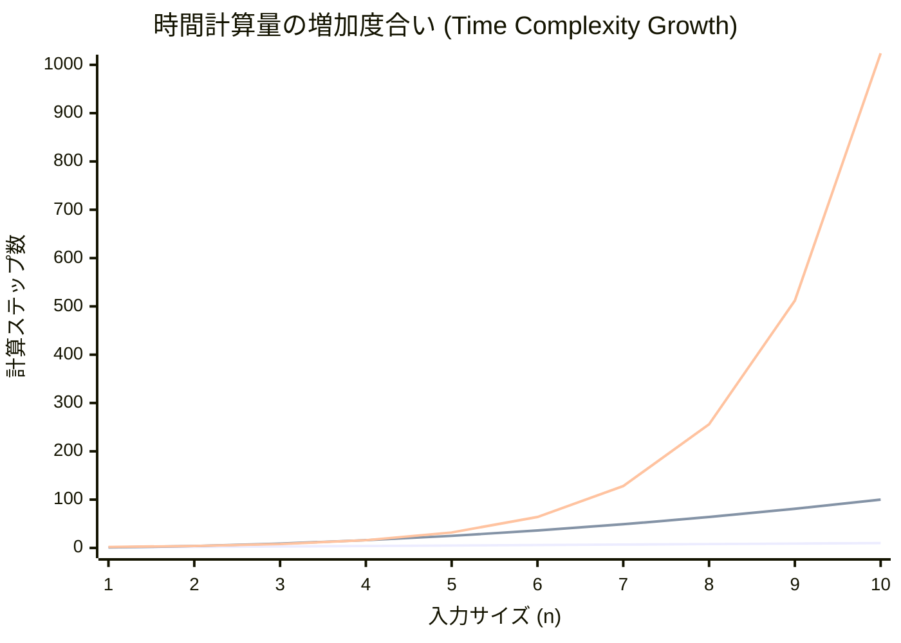
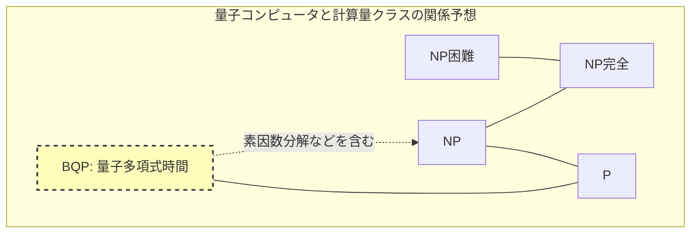

コンピュータサイエンスにおいて、そして現代数学において、最も有名で、かつ最も重要とされる未解決問題があります。それが **P vs NP問題** です。

2000年、クレイ数学研究所は7つの数学上の未解決問題に対してそれぞれ100万ドルの懸賞金をかけました。これらは **ミレニアム懸賞問題** と呼ばれます。ポアンカレ予想のように既に解決されたものもありますが、 **P vs NP問題** は未だに解決の糸口すら完全には見えていません。

本記事では、この **P vs NP問題** の全貌を、計算複雑性クラス（P、NP、NP完全、NP困難）の基礎から、プログラミングにおける実践的な意義、さらにはもし解明された場合の世界への影響まで、詳細に深掘りして解説します。

---

## 1. 計算量理論とアルゴリズムの基礎

**P vs NP問題** を理解するためには、まず「アルゴリズムの計算量」という概念を理解する必要があります。コンピュータはある問題を解くためにステップ・バイ・ステップの計算を行いますが、入力のサイズ $n$ が大きくなったときに、計算に必要な時間（ステップ数）やメモリ（空間）がどのように増加するかを示すのが **計算複雑性（Computational Complexity）** です。

### ランダウの記号（Big-O Notation）

計算量を示す際によく使われるのが $O$ 記法です。これは入力サイズ $n$ に対する最悪計算量の上限を表します。

- $O(1)$: 定数時間。入力サイズに依存しない。
- $O(\log n)$: 対数時間。二分探索など。
- $O(n)$: 線形時間。単純な探索など。
- $O(n \log n)$: 効率的なソートアルゴリズム（クイックソート、マージソートなど）。
- $O(n^2), O(n^3)$: 多項式時間。二重ループ、三重ループなど。
- $O(2^n)$: 指数時間。総当たりによる探索など。
- $O(n!)$: 階乗時間。巡回セールスマン問題の単純な総当たりなど。

以下のグラフは、入力サイズに対する計算ステップ数の増加度合いを視覚化したものです。


*(一番下が $O(n)$、真ん中が $O(n^2)$、一番上が $O(2^n)$ を示しています。指数時間の爆発的な増加がわかります。)*

計算量理論において、 $O(n^k)$ （ $k$ は定数）で表される時間を **多項式時間（Polynomial Time）** と呼び、実用的な時間で計算可能である一つの基準とみなします。一方で、 $O(2^n)$ などの指数時間は、 $n$ が数十になるだけで宇宙の寿命を超える計算時間を要するため、実質的に「解けない」とみなされます。

---

## 2. クラスPとは何か？（現実的な時間で「解ける」問題）

**クラスP（P: Polynomial time）** とは、「決定性[チューリングマシン](https://kenji.blog/p/turing-machine-computability/)において、多項式時間で解くことができる判定問題の集合」と定義されます。

平たく言えば、 **「コンピュータが現実的な時間で自力で答えを導き出せる問題」** です。

### クラスPの代表的な問題

- **ソート問題**: 与えられた数値を昇順に並べ替える（ $O(n \log n)$ など）。
- **最短経路問題**: カーナビのように、2点間の最短ルートを見つける（[ダイクストラ法](https://kenji.blog/p/graph-theory-dijkstra-a-star/)で $O(E + V \log V)$ ）。
- **素数判定問題**: ある数が素数かどうかを判定する（AKS素数判定法により多項式時間で解けることが証明されました）。

以下はクラスPの代表例である、二分探索アルゴリズムのPython実装です。

```python
def binary_search(arr, target):
    """
    ソート済みの配列からtargetを二分探索するアルゴリズム（クラスPの例）
    時間計算量: O(log n)
    """
    left, right = 0, len(arr) - 1
    
    while left <= right:
        mid = (left + right) // 2
        if arr[mid] == target:
            return mid
        elif arr[mid] < target:
            left = mid + 1
        else:
            right = mid - 1
            
    return -1

# テスト
sorted_data = [1, 3, 5, 7, 9, 11, 13, 15]
print("Index:", binary_search(sorted_data, 7)) # Output: 3
```

これらの問題は入力サイズが大きくなっても計算量が爆発せず、スケーラブルに解くことができます。

---

## 3. クラスNPとは何か？（現実的な時間で「確かめられる」問題）

**クラスNP（NP: Nondeterministic Polynomial time）** とは、「非決定性[チューリングマシン](https://kenji.blog/p/turing-machine-computability/)において、多項式時間で解ける判定問題の集合」、あるいはより分かりやすく **「証拠（証拠となる解）を与えられたとき、それが正しいかどうかを多項式時間で検証できる問題の集合」** と定義されます。

これは **「自力で答えを見つけるのはめちゃくちゃ難しいかもしれないが、答えらしきものを渡されたら、それが正解かどうかはすぐにチェックできる問題」** と言い換えることができます。

### クラスNPの代表的な問題

- **数独（Sudoku）**: 盤面を埋めるのは難しいですが、すべて埋まった盤面を渡されれば、ルールに違反していないか（各行・列・ブ[ロック](https://kenji.blog/p/rdbms-transaction-acid-isolation-level-lock/)に重複がないか）は一瞬でチェックできます。
- **部分和問題（Subset Sum）**: 与えられた整数の集合からいくつかを選んで、合計を特定の数にできるか？ 解を見つけるのは総当たりが必要ですが、「これとこれを選ぶ」という証拠（解）を渡されれば、足し算するだけで確認できます。
- **巡回セールスマン問題（判定版）**: 全ての都市を訪問して戻ってくる距離が $K$ 以下のルートは存在するか？

以下は、数独の解を「検証」するPythonコードの例です。検証自体は $O(n^2)$ の多項式時間で行えます。

```python
def verify_sudoku_solution(board):
    """
    数独の完成した盤面（9x9）が正しいかどうかを検証する（クラスNPの検証プロセスの例）
    時間計算量: O(n^2) - 非常に高速
    """
    def is_valid_group(group):
        return sorted(list(group)) == [1, 2, 3, 4, 5, 6, 7, 8, 9]

    # 行と列の検証
    for i in range(9):
        if not is_valid_group(board[i]):
            return False
        if not is_valid_group([board[j][i] for j in range(9)]):
            return False

    # 3x3ブロックの検証
    for i in range(0, 9, 3):
        for j in range(0, 9, 3):
            block = [board[x][y] for x in range(i, i+3) for y in range(j, j+3)]
            if not is_valid_group(block):
                return False

    return True

# 正常な数独の解
valid_board = [
    [5,3,4,6,7,8,9,1,2],
    [6,7,2,1,9,5,3,4,8],
    [1,9,8,3,4,2,5,6,7],
    [8,5,9,7,6,1,4,2,3],
    [4,2,6,8,5,3,7,9,1],
    [7,1,3,9,2,4,8,5,6],
    [9,6,1,5,3,7,2,8,4],
    [2,8,7,4,1,9,6,3,5],
    [3,4,5,2,8,6,1,7,9]
]
print("検証結果:", verify_sudoku_solution(valid_board)) # Output: True
```

**Pに属する問題はすべてNPに属します。** なぜなら、「自力で現実的な時間で解ける」ならば、「解を渡されたときの確認も現実的な時間でできる」に決まっているからです。つまり数式で表すと以下のようになります。

$$ P \subseteq NP $$

---

## 4. P vs NP問題の核心：「ひらめき」は「努力」で代替できるか？

ここでいよいよ、ミレニアム懸賞問題である **P vs NP問題** の核心に迫ります。

問題は非常にシンプルです。

> **クラスP（現実的な時間で解ける問題）と、クラスNP（現実的な時間で検証できる問題）は、実は全く同じ集合ではないのか？ すなわち、$P = NP$ か？ それとも $P \neq NP$ か？**

直感的には、 **「解を見つけること」** と **「解が正しいかチェックすること」** では、前者のほうが圧倒的に難しく感じます。数独のパズルを解くのと、答え合わせをするのを比べれば、答え合わせの方が簡単ですよね。

もし **P = NP** であるならば、「答え合わせが簡単にできる問題は、実は解き方さえわかれば簡単に解ける」ことになります。これは人間の直感に大きく反するため、現代の数学者やコンピュータ科学者の大多数（アンケートでは9割以上）は **$P \neq NP$** であると予想しています。しかし、それを数学的に証明できた人は未だに誰もいません。

---

## 5. NP完全とNP困難（宇宙で最も難しい問題たち）

この問題を理解する上で欠かせないのが、 **NP完全（NP-Complete）** と **NP困難（NP-Hard）** という概念です。

### 多項式時間帰着（Polynomial-time Reduction）
ある問題 $A$ を解くプログラムがあるとします。問題 $B$ を解きたいとき、問題 $B$ の入力を素早く（多項式時間で）問題 $A$ の入力に変換し、問題 $A$ のプログラムを使って解を出し、その結果を素早く問題 $B$ の解に変換できるなら、「問題 $B$ は問題 $A$ より難しくない」と言えます。これを **多項式時間帰着** と呼びます。

### NP困難（NP-Hard）
クラスNPに属する **すべての** 問題から、多項式時間で帰着できるような問題のクラスです。つまり、「NPに属するどんな問題よりも、少なくとも同じかそれ以上に難しい問題」です。NP困難な問題は、判定問題である必要すらありません。

### NP完全（NP-Complete）
NP困難であり、かつ自身もクラスNPに属する問題のクラスです。これは **「クラスNPの中で最も難しい問題たちの集まり」** を意味します。

```mermaid
graph TD
    subgraph 計算複雑性クラスの包含関係 (P!=NPの仮定)
        NPH[NP困難 (NP-Hard)]
        NPC[NP完全 (NP-Complete)]
        NP_Class[NP]
        P_Class[P]
        
        NPH --- NPC
        NP_Class --- NPC
        NP_Class --- P_Class
        
        style NPH fill:#f9f,stroke:#333,stroke-width:2px
        style NPC fill:#f66,stroke:#333,stroke-width:2px
        style NP_Class fill:#bbf,stroke:#333,stroke-width:2px
        style P_Class fill:#bfb,stroke:#333,stroke-width:2px
    end
```

驚くべきことに、1971年にスティーブン・クックとレオニード・レビンによって、 **充足可能性問題（SAT）** がNP完全であることが証明されました（クック・レビンの定理）。

その後、リチャード・カープによって、巡回セールスマン問題、ナップサック問題、グラフの彩色問題など、実社会の最適化問題の多くが **NP完全** であることが次々と証明されました（カープの21のNP完全問題）。

**NP完全問題の最大の性質は、「NP完全問題のうちどれか1つでも多項式時間で解けるアルゴリズムが見つかれば、すべてのNP問題が多項式時間で解ける（つまり $P = NP$ となる）」という点です。** 
これは計算機科学における究極のドミノ倒しと言えます。

---

## 6. プログラミングにおける具体的な比較と実装

ここでは、「似ているけれど難しさが全く違う問題」を比較し、プログラマが直面する壁を解説します。

### オイラー閉路（クラスP） vs ハミルトン閉路（NP完全）

- **オイラー閉路**: すべての「辺」をちょうど1回ずつ通って元の頂点に戻るルート探し（一筆書き）。これは各頂点の次数を調べるだけで $O(V+E)$ の多項式時間で解けます。
- **ハミルトン閉路**: すべての「頂点」をちょうど1回ずつ通って元の頂点に戻るルート探し（巡回セールスマン問題の基礎）。少し条件を変えただけで、これは **NP完全** となり、効率的なアルゴリズムは見つかっていません。

### 巡回セールスマン問題（TSP）の実装例と近似アルゴリズム

NP困難（最適化問題版）である巡回セールスマン問題を厳密に解こうとすると計算量が爆発します。以下のPythonコードで、厳密解（総当たり）と、実用的な近似解（貪欲法）を比較してみましょう。

```python
import itertools
import math

def calculate_distance(city1, city2):
    return math.hypot(city1[0]-city2[0], city1[1]-city2[1])

# 1. 厳密解（総当たり） - 時間計算量: O(N!)
def tsp_brute_force(cities):
    n = len(cities)
    best_dist = float('inf')
    best_path = None
    
    # 最初の都市を固定し、残りの都市の順列をすべて試す
    for perm in itertools.permutations(range(1, n)):
        path = (0,) + perm
        dist = 0
        for i in range(n):
            dist += calculate_distance(cities[path[i]], cities[path[(i+1)%n]])
        
        if dist < best_dist:
            best_dist = dist
            best_path = path
            
    return best_dist, best_path

# 2. 近似解（貪欲法） - 時間計算量: O(N^2)
def tsp_greedy(cities):
    n = len(cities)
    unvisited = set(range(1, n))
    current_city = 0
    path = [0]
    total_dist = 0
    
    while unvisited:
        # 最も近い未訪問の都市を探す
        next_city = min(unvisited, key=lambda city: calculate_distance(cities[current_city], cities[city]))
        total_dist += calculate_distance(cities[current_city], cities[next_city])
        current_city = next_city
        path.append(current_city)
        unvisited.remove(current_city)
        
    # 最初の都市に戻る
    total_dist += calculate_distance(cities[current_city], cities[0])
    return total_dist, path

# テスト実行
cities = [(0, 0), (1, 5), (5, 2), (6, 6), (8, 3), (2, 9), (9, 9)]

dist_exact, path_exact = tsp_brute_force(cities)
dist_greedy, path_greedy = tsp_greedy(cities)

print(f"厳密解: 距離 {dist_exact:.2f}, ルート {path_exact}")
print(f"近似解: 距離 {dist_greedy:.2f}, ルート {path_greedy}")
```

都市の数が $N=20$ を超えると、厳密解（総当たり）は現代のスーパーコンピュータでも宇宙の寿命ほどの時間がかかります。しかし、貪欲法などの近似アルゴリズムを使えば、 **最適ではないかもしれないが、そこそこ良い解** を一瞬で出すことができます。プログラマは、問題がNP困難であると見抜いた時点で、厳密解を諦め、ヒューリスティクスや近似アルゴリズムに舵を切るという設計判断が求められます。

---

## 7. もし P = NP だったら世界はどうなるか？

現在、世界中の暗号システム（インターネットショッピングで使われるSSL/TLSや、ビットコインなどの[ブロックチェーン](https://kenji.blog/p/blockchain-technology-smart-contract-distributed-ledger/)）は、 **「解くのはとてつもなく時間がかかるが、検証は一瞬でできる」** という非対称性を利用しています。

[RSA](https://kenji.blog/p/modern-cryptography-public-key-hash-signature/)暗号の根幹である素因数分解もその一つです。
もし誰かが $P = NP$ を証明し、NP問題を多項式時間で解く魔法のアルゴリズム（構成的証明）を構築したとしましょう。それは以下のような **人類社会のパラダイムシフト** を引き起こします。

1. **暗号の崩壊**: RSA暗号や楕円曲線暗号など、現代の[公開鍵](https://kenji.blog/p/modern-cryptography-public-key-hash-signature/)暗号系はすべて瞬時に破られ、デジタル上のセキュリティは完全に崩壊します。
2. **AIと機械学習の究極の進化**: ニューラルネットワークの最適な重み付けや、強化学習の最適戦略を瞬時に計算可能になります。
3. **創薬と生命科学の飛躍**: タンパク質のフォールディング構造（これもNP困難な問題に帰着します）が一瞬で計算でき、不治の病に対する特効薬がAIによって次々と開発されます。
4. **物流と生産の完全最適化**: あらゆる無駄が排除された究極のサプライチェーンが構築され、エネルギー問題の大部分が解決します。

数学者スコット・アーロンソンが「もし $P = NP$ ならば、世界には創造的飛躍というものは存在せず、ひらめきや天才的直感はすべて機械的な計算で代替可能になる」と語ったように、これは哲学的な意味すら持つ問題なのです。

---

## 8. [量子コンピュータ](https://kenji.blog/p/quantum-computing-shors-algorithm/)と P vs NP問題

近年、量子コンピュータの登場により、「量子コンピュータならNP完全問題を解けるのではないか？」という誤解が広まっています。

計算複雑性理論においては、量子コンピュータが多項式時間で解ける問題のクラスを **BQP (Bounded-error Quantum Polynomial time)** と呼びます。ピーター・ショアが考案した「[ショアのアルゴリズム](https://kenji.blog/p/quantum-computing-shors-algorithm/)」により、素因数分解はBQPに属することが証明されました（量子コンピュータで素早く解ける）。

しかし、現在の計算機科学界のコンセンサスでは、 **$NP完全 \subseteq BQP$ とは考えられていません**。
つまり、量子コンピュータであっても、巡回セールスマン問題やナップサック問題のようなNP完全問題を多項式時間で解くことはできないと考えられています。量子コンピュータは魔法の杖ではなく、特定の数学的構造を持つ問題（周期性発見など）に対してのみ圧倒的なスピードを発揮する機械なのです。


*(BQPクラスはPを含み、NPの一部（素因数分解など）を解くことができますが、NP完全問題をすべて含んではいないと予想されています。)*

---

## 9. エンジニア・プログラマにとっての意義と向き合い方

我々ソフトウェアエンジニアが日常的に直面する業務課題（シフトスケジューリング、配送ルート最適化、クラウドのリソース割り当て、パッキング問題）は、そのほとんどが **NP困難** な問題です。

「この問題の最適解を出すシステムを作ってくれ」とビジネスサイドから要求されたとき、計算量理論の知識がなければ、あなたは永遠に終わらないプログラムを書いてしまい、サーバーをダウンさせることになるでしょう。

**P vs NP問題** （およびNP完全性の理論）がプログラマに教えてくれる最大の教訓は以下の通りです。

1. **問題の難しさを認識する**: 直面した問題がNP困難だと証明（あるいは推測）できたなら、完璧な最適解を求めるアルゴリズムの探求は中止する。
2. **緩和と近似に逃げる**:
    - **近似アルゴリズム**: 最適解からの誤差が一定範囲内に収まることを保証しつつ、多項式時間で解く。
    - **ヒューリスティクス**: 遺伝的アルゴリズムや焼きなまし法など、数学的な保証はないが経験的に「そこそこ良い解」を高速に出す手法を採用する。
    - **動的計画法 (DP)**: ナップサック問題のように、入力の数値の大きさに依存する（擬似多項式時間）解法が存在する場合は、入力の制約を利用する。
    - **SATソルバー・MILPソルバー**: 近年発達が著しい汎用の数理最適化ソルバーに定式化して投げる。ソルバーは内部で高度な枝刈りを行ってくれるため、実用的なサイズなら厳密解が出せることも多い。

```python
# 動的計画法による0-1ナップサック問題の解法（擬似多項式時間の例）
def knapsack_dp(weights, values, capacity):
    """
    NP困難であるが、DPを用いれば擬似多項式時間 O(N*W) で解ける例
    """
    n = len(weights)
    # dp[i][w] : i番目までの品物で重さw以下にするときの価値の最大値
    dp = [[0] * (capacity + 1) for _ in range(n + 1)]
    
    for i in range(1, n + 1):
        for w in range(1, capacity + 1):
            if weights[i-1] <= w:
                # 入れる場合と入れない場合の最大値を取る
                dp[i][w] = max(dp[i-1][w], dp[i-1][w-weights[i-1]] + values[i-1])
            else:
                dp[i][w] = dp[i-1][w]
                
    return dp[n][capacity]

weights = [2, 3, 4, 5]
values = [3, 4, 5, 6]
capacity = 5
print(f"ナップサックの最大価値: {knapsack_dp(weights, values, capacity)}")
```

---

## 結論：人類の知性の限界への挑戦

**P vs NP問題** は、単なる数学のパズルではありません。それは「効率的な計算とは何か」「数学の証明は自動化できるのか」「ひらめきはアルゴリズム化できるのか」という、人類の知性の限界を問う壮大な哲学的な問いです。

クレイ数学研究所の100万ドルという懸賞金は、この問題が持つ重要性から考えれば安すぎるかもしれません。もしあなたが $P = NP$ の証明アルゴリズムを完成させたら、賞金を受け取る前に、すべての暗号通貨を自分のウォレットに送金することだってできてしまうのですから（もちろん、倫理的には絶対にしてはいけませんが）。

今後の研究のブレイクスルーにより、私たちが生きている間にこの問題の決着が見られるのか。それとも、ゲーデルの不完全性定理のように「証明も反証も不可能である」ことが証明されるのか。計算複雑性理論の最前線から、今後も目が離せません。

> **参考文献 / 関連リンク**
> - クレイ数学研究所 ミレニアム懸賞問題 (Clay Mathematics Institute)
> - スティーブン・クック "The Complexity of Theorem-Proving Procedures" (1971)
> - リチャード・カープ "Reducibility Among Combinatorial Problems" (1972)
> - マイケル・シプサ "計算理論の基礎" (Sipser, Introduction to the Theory of Computation)
