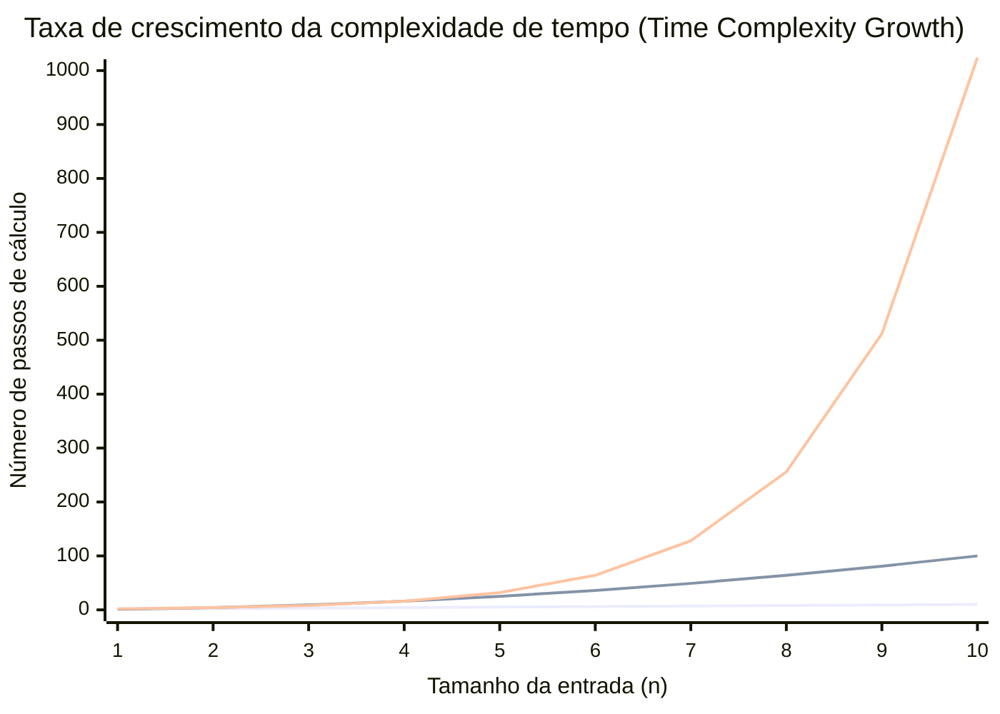
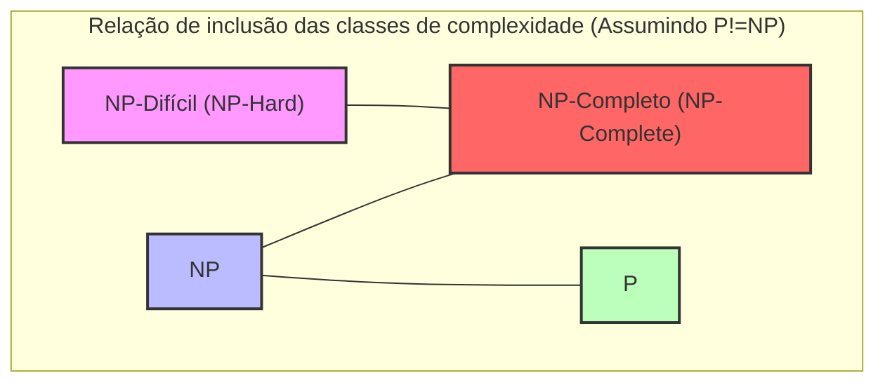
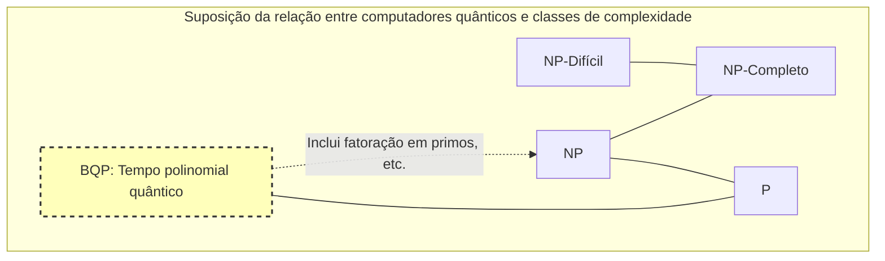

Na ciência da computação, e na matemática moderna, existe um problema não resolvido que é considerado o mais famoso e o mais importante de todos. É o **problema P vs NP**.

Em 2000, o Clay Mathematics Institute ofereceu um prêmio de 1 milhão de dólares para cada um de 7 problemas matemáticos não resolvidos. Eles são chamados de **Problemas do Prêmio Millennium**. Alguns, como [a Conjectura de Poincaré](/pt/p/poincare-conjecture/), já foram resolvidos, mas o **problema P vs NP** ainda não apresenta nem mesmo uma pista completa para a sua resolução.

Neste artigo, iremos explorar detalhadamente a visão geral do **problema P vs NP**, desde os fundamentos das classes de complexidade (P, NP, NP-completo e NP-difícil), passando pelo seu significado prático na programação, até ao impacto mundial caso este venha a ser resolvido.

---

## 1. Teoria da Complexidade e Fundamentos de Algoritmos

Para entender o **problema P vs NP**, é preciso primeiro entender o conceito de "complexidade algorítmica". Um computador executa cálculos passo a passo para resolver um problema, mas a **Complexidade Computacional (Computational Complexity)** mostra como o tempo (número de passos) ou a memória (espaço) necessários para o cálculo aumentam à medida que o tamanho da entrada $n$ aumenta.

### Notação Big-O (Notação de Landau)

A notação $O$ é frequentemente usada para indicar a complexidade computacional. Ela representa o limite superior da complexidade de tempo no pior caso para um tamanho de entrada $n$.

- $O(1)$: Tempo constante. Independente do tamanho da entrada.
- $O(\log n)$: Tempo logarítmico. Exemplo: pesquisa binária.
- $O(n)$: Tempo linear. Exemplo: pesquisa simples.
- $O(n \log n)$: Algoritmos de ordenação eficientes (Quick sort, Merge sort, etc.).
- $O(n^2), O(n^3)$: Tempo polinomial. Loop duplo, loop triplo, etc.
- $O(2^n)$: Tempo exponencial. Busca por força bruta (exaustiva).
- $O(n!)$: Tempo fatorial. Força bruta simples para o problema do caixeiro viajante, etc.

O gráfico abaixo visualiza a taxa de aumento do número de passos de cálculo em relação ao tamanho da entrada.


*(O de baixo mostra $O(n)$, o do meio $O(n^2)$, e o de cima $O(2^n)$. Pode-se notar o aumento explosivo do tempo exponencial.)*

Na teoria da complexidade, o tempo expresso como $O(n^k)$ ($k$ é uma constante) é chamado de **Tempo Polinomial (Polynomial Time)** e é considerado um critério para definir se o problema pode ser computado em um tempo prático. Por outro lado, o tempo exponencial, como $O(2^n)$, é considerado virtualmente "insolúvel", pois, mesmo que $n$ seja apenas algumas dezenas, o tempo de cálculo excederia a vida útil do universo.

---

## 2. O que é a Classe P? (Problemas "solucionáveis" em tempo realista)

A **Classe P (P: Polynomial time)** é definida como "o conjunto de problemas de decisão que podem ser resolvidos em tempo polinomial por uma máquina de Turing determinística".

Em termos simples, **"problemas para os quais um computador consegue descobrir a resposta de forma autônoma num período de tempo realista"**.

### Problemas representativos da Classe P

- **Problema de ordenação (Sorting)**: Ordenar números dados em ordem crescente (ex: $O(n \log n)$).
- **Problema do caminho mais curto (Shortest Path)**: Encontrar a rota mais curta entre 2 pontos, como num sistema de navegação GPS (pelo algoritmo de [Dijkstra](https://kenji.blog/pt/p/graph-theory-dijkstra-a-star/) em $O(E + V \log V)$).
- **Teste de primalidade (Primality testing)**: Determinar se um determinado número é primo (o teste de primalidade AKS provou que pode ser resolvido em tempo polinomial).

Abaixo está um exemplo de implementação em Python do algoritmo de pesquisa binária, que é um exemplo clássico da classe P.

```python
def binary_search(arr, target):
    """
    Algoritmo de pesquisa binária para encontrar o alvo (target) numa matriz ordenada (exemplo da classe P)
    Complexidade de tempo: O(log n)
    """
    left, right = 0, len(arr) - 1
    
    while left <= right:
        mid = (left + right) // 2
        if arr[mid] == target:
            return mid
        elif arr[mid] < target:
            left = mid + 1
        else:
            right = mid - 1
            
    return -1

# Teste
sorted_data = [1, 3, 5, 7, 9, 11, 13, 15]
print("Index:", binary_search(sorted_data, 7)) # Output: 3
```

A complexidade destes problemas não explode mesmo que o tamanho da entrada aumente, e eles podem ser resolvidos de forma escalável.

---

## 3. O que é a Classe NP? (Problemas "verificáveis" em tempo realista)

A **Classe NP (NP: Nondeterministic Polynomial time)** é definida como "o conjunto de problemas de decisão que podem ser resolvidos em tempo polinomial por uma máquina de Turing não determinística", ou, de forma mais compreensível, **"o conjunto de problemas para os quais, dada uma evidência (uma solução candidata), é possível verificar se essa evidência é correta em tempo polinomial"**.

Isto pode ser reformulado como: **"Pode ser extremamente difícil descobrir a resposta de forma autônoma, mas se for dada uma provável resposta, é possível verificar instantaneamente se ela está correta ou não"**.

### Problemas representativos da Classe NP

- **Sudoku**: Preencher o tabuleiro é difícil, mas, dado um tabuleiro completamente preenchido, é possível verificar num instante se não viola as regras (se não há repetições em cada linha, coluna e bloco).
- **Problema da soma de subconjuntos (Subset Sum)**: É possível escolher alguns números de um determinado conjunto de números inteiros de forma a que a sua soma resulte num valor específico? Encontrar a solução requer uma busca exaustiva, mas se lhe derem a evidência (a solução) "escolhendo este e aquele", pode-se confirmar a resposta apenas somando-os.
- **Problema do Caixeiro Viajante (versão de decisão)**: Existe uma rota em que se visite todas as cidades e se retorne ao ponto de partida com uma distância de $K$ ou menos?

Abaixo está um exemplo de código em Python para "verificar" a solução do Sudoku. A verificação em si pode ser feita num tempo polinomial de $O(n^2)$.

```python
def verify_sudoku_solution(board):
    """
    Verifica se um tabuleiro de Sudoku preenchido (9x9) está correto (exemplo do processo de verificação da Classe NP)
    Complexidade de tempo: O(n^2) - Extremamente rápido
    """
    def is_valid_group(group):
        return sorted(list(group)) == [1, 2, 3, 4, 5, 6, 7, 8, 9]

    # Verificação de linhas e colunas
    for i in range(9):
        if not is_valid_group(board[i]):
            return False
        if not is_valid_group([board[j][i] for j in range(9)]):
            return False

    # Verificação dos blocos 3x3
    for i in range(0, 9, 3):
        for j in range(0, 9, 3):
            block = [board[x][y] for x in range(i, i+3) for y in range(j, j+3)]
            if not is_valid_group(block):
                return False

    return True

# Solução de Sudoku válida
valid_board = [
    [5,3,4,6,7,8,9,1,2],
    [6,7,2,1,9,5,3,4,8],
    [1,9,8,3,4,2,5,6,7],
    [8,5,9,7,6,1,4,2,3],
    [4,2,6,8,5,3,7,9,1],
    [7,1,3,9,2,4,8,5,6],
    [9,6,1,5,3,7,2,8,4],
    [2,8,7,4,1,9,6,3,5],
    [3,4,5,2,8,6,1,7,9]
]
print("Resultado da verificação:", verify_sudoku_solution(valid_board)) # Output: True
```

**Todos os problemas que pertencem a P também pertencem a NP.** Isso acontece porque, "se se pode resolver por si próprio em tempo realista", então "verificar quando a solução é fornecida pode, naturalmente, ser feito num tempo realista". Em termos matemáticos, isso expressa-se da seguinte forma:

$ P \subseteq NP $

---

## 4. O cerne do problema P vs NP: O "insight" pode ser substituído por "esforço"?

Aqui nos aproximamos, finalmente, do cerne do **problema P vs NP**, que é um Problema do Prêmio Millennium.

O problema é muito simples:

> **Será que a Classe P (problemas resolvíveis em tempo realista) e a Classe NP (problemas verificáveis em tempo realista) são, na verdade, exatamente o mesmo conjunto? Ou seja, $P = NP$? Ou $P \neq NP$?**

Intuitivamente, há a sensação de que **"encontrar a solução"** é esmagadoramente mais difícil do que **"verificar se a solução está correta"**. Se compararmos a dificuldade de resolver um puzzle de Sudoku com a verificação da resposta final, a verificação das respostas é mais fácil.

Se **$P = NP$**, então "problemas em que a resposta pode ser facilmente verificada podem, de fato, ser facilmente resolvidos, caso se descubra o método". Uma vez que isto contraria fortemente a intuição humana, a vasta maioria dos matemáticos e cientistas da computação contemporâneos (mais de 90% em inquéritos) preveem que **$P \neq NP$**. No entanto, ainda ninguém conseguiu provar isto matematicamente.

---

## 5. NP-Completo e NP-Difícil (Os problemas mais difíceis do universo)

Para entender este problema, é essencial compreender os conceitos de **NP-Completo (NP-Complete)** e **NP-Difícil (NP-Hard)**.

### Redução em Tempo Polinomial (Polynomial-time Reduction)
Suponha que tem um programa para resolver o problema $A$. Quando quiser resolver o problema $B$, se puder converter rapidamente (em tempo polinomial) a entrada do problema $B$ numa entrada para o problema $A$, usar o programa do problema $A$ para obter uma solução e converter rapidamente esse resultado numa solução para o problema $B$, então pode-se dizer que "o problema $B$ não é mais difícil que o problema $A$". Isto é chamado de **Redução em tempo polinomial**.

### NP-Difícil (NP-Hard)
É uma classe de problemas para os quais **todos** os problemas pertencentes à classe NP podem ser reduzidos em tempo polinomial. Ou seja, é "um problema que é, no mínimo, tão difícil ou mais difícil do que qualquer problema pertencente a NP". Um problema NP-Difícil não precisa sequer ser um problema de decisão.

### NP-Completo (NP-Complete)
É a classe de problemas que são simultaneamente NP-Difíceis e pertencem eles próprios à classe NP. Isto significa **"o conjunto dos problemas mais difíceis dentro da classe NP"**.



Surpreendentemente, em 1971, Stephen Cook e Leonid Levin provaram que o **Problema de Satisfatibilidade Booleana (SAT)** é NP-Completo (Teorema de Cook-Levin).

Depois disso, Richard Karp demonstrou que muitos dos problemas de otimização do mundo real, como o problema do caixeiro viajante, o problema da mochila e o problema da coloração de grafos, são consecutivamente **NP-Completos** (Os 21 problemas NP-Completos de Karp).

**A maior característica dos problemas NP-Completos é que, "se um algoritmo for encontrado para resolver qualquer um dos problemas NP-Completos em tempo polinomial, então todos os problemas NP podem ser resolvidos em tempo polinomial (ou seja, resultando em $P = NP$)".** 
Pode-se dizer que este é o efeito dominó supremo da ciência da computação.

---

## 6. Comparação e Implementação Específicas na Programação

Aqui, comparamos "problemas que parecem semelhantes, mas cujas dificuldades são completamente diferentes", e explicamos a barreira que os programadores enfrentam.

### Ciclo Euleriano (Classe P) vs Ciclo Hamiltoniano (NP-Completo)

- **Ciclo Euleriano**: Encontrar uma rota que passe exatamente uma vez por todas as "arestas" e volte ao vértice original (desenhar sem levantar a caneta). Isto pode ser resolvido num tempo polinomial de $O(V+E)$ apenas ao verificar o grau de cada vértice.
- **Ciclo Hamiltoniano**: Encontrar uma rota que passe exatamente uma vez por todos os "vértices" e volte ao vértice original (a base do problema do caixeiro viajante). Com uma pequena alteração nas condições, isto torna-se **NP-Completo**, e nenhum algoritmo eficiente foi encontrado até ao momento.

### Exemplo de implementação e algoritmo de aproximação do Problema do Caixeiro Viajante (TSP)

Se tentarmos resolver de forma exata o Problema do Caixeiro Viajante, que é NP-difícil (na versão de otimização), a complexidade de cálculo vai explodir. Vamos comparar uma solução exata (força bruta) e uma solução aproximada prática (método guloso ou *greedy*) no código Python abaixo.

```python
import itertools
import math

def calculate_distance(city1, city2):
    return math.hypot(city1[0]-city2[0], city1[1]-city2[1])

# 1. Solução exata (força bruta) - Complexidade de tempo: O(N!)
def tsp_brute_force(cities):
    n = len(cities)
    best_dist = float('inf')
    best_path = None
    
    # Fixar a primeira cidade e testar todas as permutações das restantes cidades
    for perm in itertools.permutations(range(1, n)):
        path = (0,) + perm
        dist = 0
        for i in range(n):
            dist += calculate_distance(cities[path[i]], cities[path[(i+1)%n]])
        
        if dist < best_dist:
            best_dist = dist
            best_path = path
            
    return best_dist, best_path

# 2. Solução aproximada (Algoritmo guloso) - Complexidade de tempo: O(N^2)
def tsp_greedy(cities):
    n = len(cities)
    unvisited = set(range(1, n))
    current_city = 0
    path = [0]
    total_dist = 0
    
    while unvisited:
        # Encontrar a cidade não visitada mais próxima
        next_city = min(unvisited, key=lambda city: calculate_distance(cities[current_city], cities[city]))
        total_dist += calculate_distance(cities[current_city], cities[next_city])
        current_city = next_city
        path.append(current_city)
        unvisited.remove(current_city)
        
    # Voltar à primeira cidade
    total_dist += calculate_distance(cities[current_city], cities[0])
    return total_dist, path

# Executar teste
cities = [(0, 0), (1, 5), (5, 2), (6, 6), (8, 3), (2, 9), (9, 9)]

dist_exact, path_exact = tsp_brute_force(cities)
dist_greedy, path_greedy = tsp_greedy(cities)

print(f"Solução exata: Distância {dist_exact:.2f}, Rota {path_exact}")
print(f"Solução aproximada: Distância {dist_greedy:.2f}, Rota {path_greedy}")
```

Quando o número de cidades excede $N=20$, a solução exata (por força bruta) levará tanto tempo quanto o tempo de vida do universo, mesmo nos supercomputadores modernos. No entanto, o uso de um algoritmo de aproximação, como o método guloso, permite chegar a uma **solução que pode não ser ótima, mas que é suficientemente boa**, numa fração de segundo. É exigido que os programadores tomem decisões de design e mudem de rumo para as heurísticas ou algoritmos de aproximação e desistam da solução exata assim que reconhecerem que o problema é NP-difícil.

---

## 7. E se P = NP, o que aconteceria ao mundo?

Atualmente, todos os sistemas criptográficos no mundo (SSL/TLS usado em compras online ou [blockchain](/pt/p/blockchain-technology-smart-contract-distributed-ledger/), como Bitcoin) dependem da assimetria de que **"leva uma quantidade absurda de tempo para encontrar uma solução, mas a sua verificação é instantânea"**.

A fatoração em números primos, que está na base da criptografia [RSA](https://kenji.blog/pt/p/modern-cryptography-public-key-hash-signature/), é um destes exemplos.
Suponhamos que alguém prove $P = NP$ e construa um algoritmo mágico (prova construtiva) para resolver problemas NP num tempo polinomial. Isso provocaria a seguinte **mudança de paradigma na sociedade humana**.

1. **Colapso da criptografia**: Todos os modernos sistemas de criptografia de chave pública, tais como RSA e criptografia de curvas elípticas, seriam imediatamente destruídos e a segurança digital entraria num colapso total.
2. **A evolução final da IA e do machine learning**: Os pesos ótimos em redes neurais e as estratégias ótimas em aprendizagem por reforço passariam a poder ser calculados instantaneamente.
3. **Grandes saltos na descoberta de medicamentos e biociências**: O dobramento de proteínas (que também é um problema reduzido a NP-difícil) poderia ser calculado instantaneamente, e a IA desenvolveria continuamente soluções para doenças incuráveis.
4. **Otimização total da logística e da produção**: Construir-se-iam cadeias de abastecimento fundamentais em que todo e qualquer desperdício seria eliminado, resolvendo, assim, grande parte dos problemas energéticos.

Tal como afirmou o matemático Scott Aaronson, "se $P = NP$, então os saltos criativos não existem no mundo e toda e qualquer intuição genial e brilhantismo podem ser substituídos pela simples computação mecânica". Este é, por isso, um problema que também possui profundas implicações filosóficas.

---

## 8. Computadores Quânticos e o Problema P vs NP

Nos últimos anos, com o advento dos computadores quânticos, espalhou-se o mal-entendido de que "os computadores quânticos podem resolver problemas NP-completos".

Na teoria da complexidade computacional, a classe de problemas que um computador quântico pode resolver num tempo polinomial é chamada de **BQP (Bounded-error Quantum Polynomial time)**. Graças ao "algoritmo de Shor" concebido por Peter Shor, provou-se que a fatoração de primos pertence à classe BQP (pode ser resolvida rapidamente num computador quântico).

No entanto, o consenso atual da comunidade de cientistas de computadores é de que **não se considera que $ \text{NP-Completo} \subseteq BQP $**.
Ou seja, prevê-se que mesmo com computadores quânticos, não se possam resolver num tempo polinomial os problemas NP-completos, tais como o problema do caixeiro viajante ou o da mochila. Um computador quântico não é uma varinha mágica; trata-se de uma máquina que apresenta um desempenho incrivelmente veloz apenas para os problemas que tenham certas estruturas matemáticas específicas (como a procura da periodicidade, por exemplo).


*(Prevê-se que a classe BQP contenha P e possa resolver partes de NP (como a fatoração em primos), mas não engloba todos os problemas NP-completos.)*

---

## 9. O Significado e Abordagem para Engenheiros e Programadores

A maioria das tarefas de negócios que os engenheiros de software enfrentam diariamente (agendamento de turnos, otimização de rotas de entrega, alocação de recursos em nuvem, problemas de empacotamento) são problemas **NP-difíceis**.

Se a equipe de negócios pedir para "criar um sistema que dê a solução ideal para este problema", sem o conhecimento da teoria da complexidade computacional, você acabará escrevendo um programa interminável que levará o servidor a cair.

A maior lição que o **problema P vs NP** (e a teoria da integridade NP) ensina aos programadores é a seguinte:

1. **Reconheça a dificuldade do problema**: Se provar (ou suspeitar) que o problema enfrentado é NP-difícil, pare a busca pelo algoritmo de solução ótima perfeita.
2. **Recorra ao relaxamento e à aproximação**:
    - **Algoritmos de aproximação**: Resolve o problema em tempo polinomial garantindo que o erro em relação à solução ótima se encontre num determinado limite.
    - **Heurísticas**: Adota métodos onde não há garantias matemáticas, mas produz empiricamente e com alta velocidade "soluções razoavelmente boas", como algoritmos genéticos e *simulated annealing*.
    - **Programação Dinâmica ([DP](https://kenji.blog/pt/p/dynamic-programming-dp-introduction-knapsack-fibonacci/))**: No caso de haver uma solução baseada na magnitude das entradas numéricas (tempo pseudo-polinomial), como no problema da mochila, as restrições da entrada podem ser utilizadas.
    - **Solucionadores SAT/MILP**: O problema é formulado e passado a modernos e versáteis solucionadores de otimização matemática que têm evoluído notavelmente nos últimos anos. Muitas vezes os solucionadores podem produzir soluções perfeitas num tamanho realista devido à sofisticada eliminação interna (poda/branch-and-bound).

```python
# Solução para o problema da mochila 0-1 por Programação Dinâmica (exemplo de tempo pseudo-polinomial)
def knapsack_dp(weights, values, capacity):
    """
    Embora seja NP-difícil, é um exemplo que pode ser resolvido num tempo pseudo-polinomial O(N*W) através de DP
    """
    n = len(weights)
    # dp[i][w] : o valor máximo para os primeiros i itens quando o peso for w ou inferior
    dp = [[0] * (capacity + 1) for _ in range(n + 1)]
    
    for i in range(1, n + 1):
        for w in range(1, capacity + 1):
            if weights[i-1] <= w:
                # Obter o valor máximo entre a opção de adicionar o item ou não
                dp[i][w] = max(dp[i-1][w], dp[i-1][w-weights[i-1]] + values[i-1])
            else:
                dp[i][w] = dp[i-1][w]
                
    return dp[n][capacity]

weights = [2, 3, 4, 5]
values = [3, 4, 5, 6]
capacity = 5
print(f"Valor máximo da mochila: {knapsack_dp(weights, values, capacity)}")
```

---

## Conclusão: O desafio aos limites da inteligência humana

O **problema P vs NP** não é um mero quebra-cabeças matemático. É uma monumental questão filosófica acerca dos limites do intelecto humano que questiona: "O que é um cálculo eficiente?", "As provas matemáticas podem ser automatizadas?" e "Será que os grandes 'insights' podem ser algoritmizados?".

Os prémios de 1 milhão de dólares do Instituto Clay de Matemática podem ser pequenos, se tivermos em conta o verdadeiro impacto que a resposta a este problema pode originar. Afinal, se o algoritmo de prova $P = NP$ fosse concluído, as pessoas envolvidas seriam, logicamente, capazes de enviar toda a criptomoeda para as suas carteiras, sem qualquer restrição (ainda que isso seja uma quebra da ética imperdoável) em vez de apenas levantar os prémios monetários.

Graças aos próximos avanços substanciais de pesquisa, será possível que, durante a nossa vida, este problema venha a encontrar resolução? Ou irá suceder tal como com o teorema de incompletude de Gödel, segundo o qual "a prova ou a desaprovação são ambas impossíveis"? Estaremos com extrema expectativa aguardando pelos próximos resultados na vanguarda da teoria da complexidade computacional.

> **Referências / Links Relacionados**
> - Problemas do Prémio Millennium do Clay Mathematics Institute (Clay Mathematics Institute)
> - Stephen Cook "The Complexity of Theorem-Proving Procedures" (1971)
> - Richard Karp "Reducibility Among Combinatorial Problems" (1972)
> - Michael Sipser "Introduction to the Theory of Computation"
