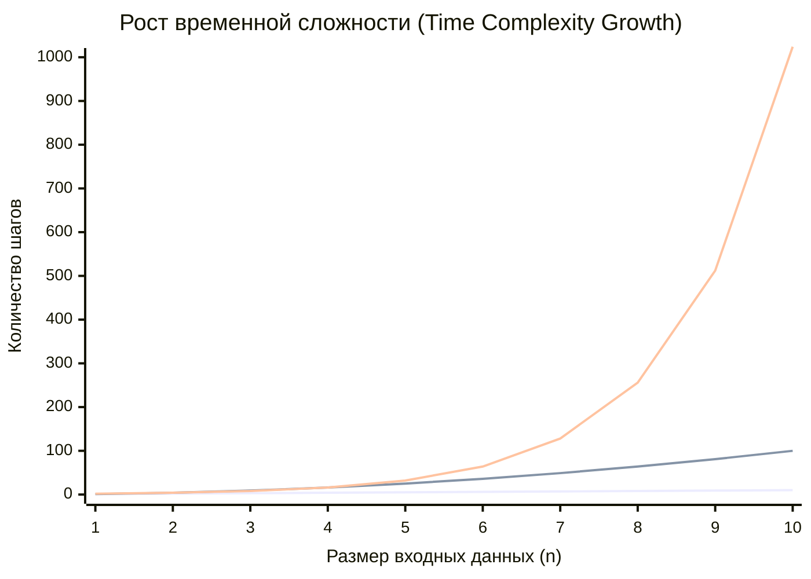
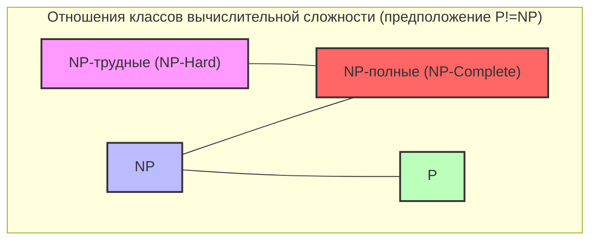
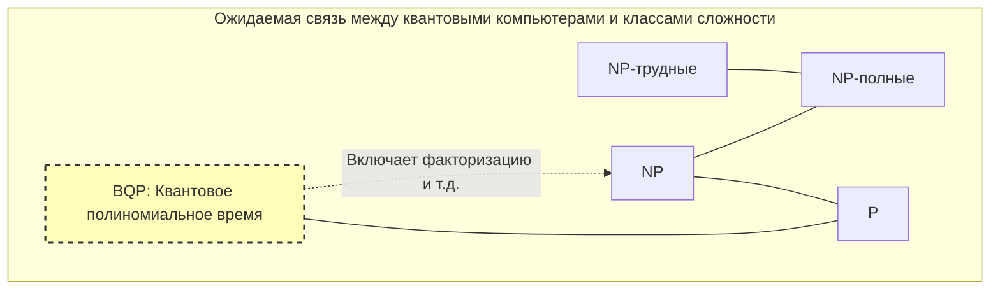

В информатике, да и в современной математике, существует нерешенная проблема, которая считается самой известной и самой важной. Это **проблема P против NP**.

В 2000 году Математический институт Клэя предложил призы по 1 миллиону долларов за каждую из семи нерешенных математических проблем. Они называются **задачами тысячелетия**. Хотя некоторые из них, например, гипотеза Пуанкаре, уже решены, к решению **проблемы P против NP** до сих пор нет даже полного ключа.

В этой статье мы подробно и глубоко рассмотрим всю суть **проблемы P против NP**: от основ классов вычислительной сложности (P, NP, NP-полные, NP-трудные) до ее практического значения в программировании, а также потенциального влияния на мир в случае ее решения.

---

## 1. Теория сложности вычислений и основы алгоритмов

Чтобы понять **проблему P против NP**, необходимо сначала понять концепцию «сложности алгоритма». Компьютер выполняет пошаговые вычисления для решения проблемы. То, как увеличивается необходимое для вычислений время (количество шагов) или память (пространство) при увеличении размера входных данных $n$, называется **вычислительной сложностью** (Computational Complexity).

### О-нотация (Big-O Notation)

Для обозначения сложности часто используется О-нотация ($O$). Она представляет собой верхнюю границу сложности наихудшего случая по отношению к размеру входных данных $n$.

- $O(1)$: Константное время. Не зависит от размера входных данных.
- $O(\log n)$: Логарифмическое время. Например, бинарный поиск.
- $O(n)$: Линейное время. Например, простой поиск.
- $O(n \log n)$: Эффективные алгоритмы сортировки (быстрая сортировка, сортировка слиянием и т.д.).
- $O(n^2), O(n^3)$: Полиномиальное время. Двойные, тройные циклы и т.д.
- $O(2^n)$: Экспоненциальное время. Поиск полным перебором и т.д.
- $O(n!)$: Факториальное время. Простой полный перебор в задаче коммивояжера и т.д.

Следующий график визуализирует степень увеличения количества шагов вычислений в зависимости от размера входных данных.


*(Самая нижняя линия показывает $O(n)$, средняя — $O(n^2)$, верхняя — $O(2^n)$. Виден взрывной рост экспоненциального времени.)*

В теории сложности время, выраженное как $O(n^k)$ (где $k$ — константа), называется **полиномиальным временем** (Polynomial Time) и считается одним из критериев того, что вычисления можно выполнить за практичное время. С другой стороны, экспоненциальное время, такое как $O(2^n)$, практически считается «нерешаемым», поскольку при увеличении $n$ всего до нескольких десятков, время вычислений превысит возраст Вселенной.

---

## 2. Что такое класс P? (Проблемы, которые можно «решить» за реалистичное время)

**Класс P** (P: Polynomial time) определяется как «множество проблем разрешения, которые могут быть решены детерминированной машиной Тьюринга за полиномиальное время».

Проще говоря, это **«проблемы, для которых компьютер может самостоятельно найти ответ за реалистичное время»**.

### Типичные проблемы класса P

- **Задача сортировки**: Упорядочить заданные числа по возрастанию (например, за $O(n \log n)$).
- **Задача о кратчайшем пути**: Найти кратчайший маршрут между двумя точками, как в навигаторе (алгоритм Дейкстры за $O(E + V \log V)$).
- **Проверка на простоту**: Определить, является ли число простым (доказано, что тест простоты AKS решает это за полиномиальное время).

Ниже приведена реализация алгоритма бинарного поиска на Python — типичного примера класса P.

```python
def binary_search(arr, target):
    """
    Алгоритм бинарного поиска target в отсортированном массиве (пример класса P)
    Временная сложность: O(log n)
    """
    left, right = 0, len(arr) - 1
    
    while left <= right:
        mid = (left + right) // 2
        if arr[mid] == target:
            return mid
        elif arr[mid] < target:
            left = mid + 1
        else:
            right = mid - 1
            
    return -1

# Тест
sorted_data = [1, 3, 5, 7, 9, 11, 13, 15]
print("Index:", binary_search(sorted_data, 7)) # Output: 3
```

Сложность этих проблем не возрастает взрывообразно при увеличении размера входных данных, и их можно решать масштабируемо.

---

## 3. Что такое класс NP? (Проблемы, которые можно «проверить» за реалистичное время)

**Класс NP** (NP: Nondeterministic Polynomial time) определяется как «множество проблем разрешения, которые могут быть решены недетерминированной машиной Тьюринга за полиномиальное время», или, более понятно, **«множество проблем, для которых правильность предложенного доказательства (решения) можно проверить за полиномиальное время»**.

Иными словами, это **«проблемы, где самостоятельный поиск ответа может быть чрезвычайно сложным, но если вам предоставят предполагаемый ответ, вы сможете быстро проверить, является ли он правильным»**.

### Типичные проблемы класса NP

- **Судоку (Sudoku)**: Заполнить поле сложно, но если вам дадут полностью заполненное поле, вы сможете мгновенно проверить, не нарушены ли правила (нет ли повторений в строках, столбцах и блоках).
- **Задача о сумме подмножеств (Subset Sum)**: Можно ли выбрать несколько чисел из заданного множества целых чисел так, чтобы их сумма равнялась определенному числу? Поиск решения требует полного перебора, но если вам дадут доказательство (решение) «выбрать это и это», вы можете подтвердить его просто сложив числа.
- **Задача коммивояжера (версия разрешения)**: Существует ли маршрут, который посещает все города и возвращается обратно, длина которого не превышает $K$?

Ниже приведен пример кода на Python для «проверки» решения Судоку. Сама проверка может быть выполнена за полиномиальное время $O(n^2)$.

```python
def verify_sudoku_solution(board):
    """
    Проверка правильности заполненного поля судоку (9x9) (пример процесса проверки в классе NP)
    Временная сложность: O(n^2) - очень быстро
    """
    def is_valid_group(group):
        return sorted(list(group)) == [1, 2, 3, 4, 5, 6, 7, 8, 9]

    # Проверка строк и столбцов
    for i in range(9):
        if not is_valid_group(board[i]):
            return False
        if not is_valid_group([board[j][i] for j in range(9)]):
            return False

    # Проверка блоков 3x3
    for i in range(0, 9, 3):
        for j in range(0, 9, 3):
            block = [board[x][y] for x in range(i, i+3) for y in range(j, j+3)]
            if not is_valid_group(block):
                return False

    return True

# Правильное решение судоку
valid_board = [
    [5,3,4,6,7,8,9,1,2],
    [6,7,2,1,9,5,3,4,8],
    [1,9,8,3,4,2,5,6,7],
    [8,5,9,7,6,1,4,2,3],
    [4,2,6,8,5,3,7,9,1],
    [7,1,3,9,2,4,8,5,6],
    [9,6,1,5,3,7,2,8,4],
    [2,8,7,4,1,9,6,3,5],
    [3,4,5,2,8,6,1,7,9]
]
print("Результат проверки:", verify_sudoku_solution(valid_board)) # Output: True
```

**Все проблемы, принадлежащие к P, также принадлежат к NP.** Это потому, что если вы «можете решить задачу самостоятельно за реалистичное время», то очевидно, что «вы можете проверить решение за реалистичное время, когда вам его предоставят». Математически это выражается так:

$ P \subseteq NP $

---

## 4. Суть проблемы P против NP: можно ли заменить «озарение» «усилиями»?

Здесь мы наконец подошли к сути **проблемы P против NP**, одной из задач тысячелетия.

Вопрос очень прост.

> **Являются ли класс P (проблемы, которые можно решить за реалистичное время) и класс NP (проблемы, которые можно проверить за реалистичное время) одним и тем же множеством? То есть, $P = NP$ или $P \neq NP$?**

Интуитивно кажется, что **«найти решение»** гораздо сложнее, чем **«проверить, правильно ли решение»**. Сравните решение головоломки Судоку с проверкой ответов: сверка ответов очевидно проще.

Если **P = NP**, это будет означать, что «проблемы, ответы на которые легко проверить, на самом деле можно легко решить, если знать как». Поскольку это сильно противоречит человеческой интуиции, подавляющее большинство современных математиков и специалистов в области компьютерных наук (более 90% по опросам) ожидают, что **$P \neq NP$**. Однако пока никому не удалось доказать это математически.

---

## 5. NP-полные и NP-трудные проблемы (самые сложные проблемы во Вселенной)

Для понимания этой проблемы необходимы концепции **NP-полноты (NP-Complete)** и **NP-трудности (NP-Hard)**.

### Полиномиальное сведение (Polynomial-time Reduction)
Предположим, у нас есть программа для решения проблемы $A$. Если мы хотим решить проблему $B$, и можем быстро (за полиномиальное время) преобразовать входные данные проблемы $B$ во входные данные для проблемы $A$, использовать программу для решения проблемы $A$, чтобы получить ответ, а затем быстро преобразовать этот ответ в решение для проблемы $B$, то мы можем сказать, что «проблема $B$ не сложнее проблемы $A$». Это называется **полиномиальным сведением**.

### NP-трудные (NP-Hard)
Класс проблем, к которым любая проблема из класса NP может быть сведена за полиномиальное время. То есть, это «проблемы, которые как минимум так же сложны или еще сложнее, чем любая проблема в NP». NP-трудные проблемы даже не обязаны быть проблемами разрешения.

### NP-полные (NP-Complete)
Класс проблем, которые одновременно являются NP-трудными и сами принадлежат к классу NP. Это означает **«набор самых сложных проблем в классе NP»**.



Удивительно, но в 1971 году Стивен Кук и Леонид Левин доказали, что **задача о выполнимости булевых формул (SAT)** является NP-полной (Теорема Кука-Левина).

Впоследствии Ричард Карп доказал, что многие реальные задачи оптимизации, такие как задача коммивояжера, задача о рюкзаке и задача раскраски графов, являются **NP-полными** (21 NP-полная задача Карпа).

**Главное свойство NP-полных проблем заключается в следующем: «если хотя бы для одной NP-полной проблемы будет найден алгоритм, решающий ее за полиномиальное время, то все NP-проблемы можно будет решить за полиномиальное время (т.е. $P = NP$)».**
Это можно назвать идеальным эффектом домино в информатике.

---

## 6. Конкретные сравнения и реализация в программировании

Здесь мы сравним «проблемы, которые кажутся похожими, но принципиально отличаются по сложности», и объясним барьеры, с которыми сталкиваются программисты.

### Эйлеров цикл (Класс P) против Гамильтонова цикла (NP-полный)

- **Эйлеров цикл**: Поиск маршрута, который проходит ровно один раз по каждому «ребру» и возвращается в исходную вершину (рисование не отрывая руки). Это решается за полиномиальное время $O(V+E)$ простым анализом степени каждой вершины.
- **Гамильтонов цикл**: Поиск маршрута, который проходит ровно один раз по каждой «вершине» и возвращается в исходную вершину (основа задачи коммивояжера). Лишь небольшое изменение условий делает эту задачу **NP-полной**, и эффективного алгоритма для ее решения не найдено.

### Пример реализации задачи коммивояжера (TSP) и приближенный алгоритм

При попытке точно решить задачу коммивояжера, которая является NP-трудной (в версии оптимизации), вычислительная сложность возрастает взрывообразно. Давайте сравним точное решение (полный перебор) и практичное приближенное решение (жадный алгоритм) с помощью следующего кода на Python.

```python
import itertools
import math

def calculate_distance(city1, city2):
    return math.hypot(city1[0]-city2[0], city1[1]-city2[1])

# 1. Точное решение (полный перебор) - Временная сложность: O(N!)
def tsp_brute_force(cities):
    n = len(cities)
    best_dist = float('inf')
    best_path = None
    
    # Фиксируем первый город и пробуем все перестановки остальных городов
    for perm in itertools.permutations(range(1, n)):
        path = (0,) + perm
        dist = 0
        for i in range(n):
            dist += calculate_distance(cities[path[i]], cities[path[(i+1)%n]])
        
        if dist < best_dist:
            best_dist = dist
            best_path = path
            
    return best_dist, best_path

# 2. Приближенное решение (жадный алгоритм) - Временная сложность: O(N^2)
def tsp_greedy(cities):
    n = len(cities)
    unvisited = set(range(1, n))
    current_city = 0
    path = [0]
    total_dist = 0
    
    while unvisited:
        # Поиск ближайшего непосещенного города
        next_city = min(unvisited, key=lambda city: calculate_distance(cities[current_city], cities[city]))
        total_dist += calculate_distance(cities[current_city], cities[next_city])
        current_city = next_city
        path.append(current_city)
        unvisited.remove(current_city)
        
    # Возвращение в первый город
    total_dist += calculate_distance(cities[current_city], cities[0])
    return total_dist, path

# Тестовый запуск
cities = [(0, 0), (1, 5), (5, 2), (6, 6), (8, 3), (2, 9), (9, 9)]

dist_exact, path_exact = tsp_brute_force(cities)
dist_greedy, path_greedy = tsp_greedy(cities)

print(f"Точное решение: дистанция {dist_exact:.2f}, маршрут {path_exact}")
print(f"Приближенное решение: дистанция {dist_greedy:.2f}, маршрут {path_greedy}")
```

Если количество городов $N$ превышает 20, поиск точного решения (полный перебор) даже на современных суперкомпьютерах займет время, сопоставимое с возрастом Вселенной. Однако, используя приближенные алгоритмы, такие как жадный алгоритм, мы можем мгновенно получить **возможно не оптимальное, но достаточно хорошее решение**. Программистам необходимо принимать архитектурное решение: как только проблема распознается как NP-трудная, следует отказаться от поиска точного решения и переключиться на эвристику или приближенные алгоритмы.

---

## 7. Что было бы с миром, если бы P = NP?

В настоящее время криптографические системы по всему миру (такие как SSL/TLS, используемые в интернет-покупках, и блокчейн, например, Bitcoin) используют асимметрию, при которой **«разгадывание занимает огромное количество времени, но проверка выполняется мгновенно»**.

Факторизация простых чисел, лежащая в основе алгоритма [RSA](https://kenji.blog/ru/p/modern-cryptography-public-key-hash-signature/), является одной из таких задач.
Представьте, что кто-то доказал, что $P = NP$, и создал магический алгоритм, решающий NP-проблемы за полиномиальное время (конструктивное доказательство). Это привело бы к следующему **сдвигу парадигмы в человеческом обществе**:

1. **Крах криптографии**: Все современные системы криптографии с открытым ключом, такие как RSA и криптография на эллиптических кривых, были бы мгновенно взломаны, что привело бы к полному коллапсу цифровой безопасности.
2. **Абсолютная эволюция ИИ и машинного обучения**: Оптимальные веса для нейронных сетей и оптимальные стратегии обучения с подкреплением могли бы быть рассчитаны мгновенно.
3. **Прорыв в разработке лекарств и биологии**: Структуры сворачивания белков (что также сводится к NP-трудной проблеме) могли бы вычисляться мгновенно, что позволило бы ИИ быстро разрабатывать лекарства от неизлечимых болезней.
4. **Полная оптимизация логистики и производства**: Была бы создана идеальная цепочка поставок, исключающая любые потери, что решило бы большую часть энергетических проблем.

Как сказал математик Скотт Ааронсон: «Если бы $P = NP$, то в мире не существовало бы творческого прорыва, и все озарения и гениальная интуиция могли бы быть заменены механическими вычислениями». Это проблема несет в себе даже философский смысл.

---

## 8. Квантовые компьютеры и проблема P против NP

В последние годы с появлением квантовых компьютеров распространилось заблуждение, что «квантовые компьютеры смогут решать NP-полные проблемы».

В теории сложности вычислений класс проблем, которые квантовый компьютер может решить за полиномиальное время, называется **BQP** (Bounded-error Quantum Polynomial time). Благодаря «алгоритму Шора», разработанному Питером Шором, было доказано, что факторизация (разложение на множители) принадлежит к BQP (квантовые компьютеры могут быстро ее решить).

Однако в современном консенсусе компьютерных наук **не считается, что $NP-полные \subseteq BQP$**.
То есть предполагается, что даже квантовый компьютер не сможет за полиномиальное время решать NP-полные проблемы, такие как задача коммивояжера или задача о рюкзаке. Квантовые компьютеры — это не волшебные палочки, а машины, которые демонстрируют ошеломляющую скорость только для задач с определенной математической структурой (таких как поиск периодичности).


*(Ожидается, что класс BQP включает в себя P и решает часть NP (например, факторизацию), но не содержит всех NP-полных проблем.)*

---

## 9. Значение и подход для инженеров и программистов

Большинство повседневных бизнес-задач (составление графиков смен, оптимизация маршрутов доставки, распределение облачных ресурсов, задачи упаковки), с которыми сталкиваемся мы, инженеры-программисты, являются **NP-трудными**.

Когда бизнес требует «создать систему, которая выдает оптимальное решение для этой проблемы», если у вас нет знаний в области теории сложности, вы можете написать программу, которая никогда не завершится, и обрушите сервер.

Главные уроки, которые **проблема P против NP** (и теория NP-полноты) преподает программистам:

1. **Признать сложность проблемы**: Если можно доказать (или предположить), что проблема с которой вы столкнулись NP-трудная, откажитесь от поиска алгоритма для идеального оптимального решения.
2. **Перейти к ослаблениям и аппроксимациям**:
    - **Приближенные алгоритмы**: Решают задачу за полиномиальное время, гарантируя, что ошибка от оптимального решения остается в определенном диапазоне.
    - **Эвристика**: Использование методов, таких как генетические алгоритмы или имитация отжига, которые не имеют математических гарантий, но на опыте быстро выдают «достаточно хорошее решение».
    - **Динамическое программирование (DP)**: Если существует решение, время которого зависит от размера входных чисел (псевдополиномиальное время), как в задаче о рюкзаке, используйте ограничения входных данных.
    - **SAT/MILP решатели**: Свести к математической формулировке и передать её современным решателям математической оптимизации, развитие которых стремительно идет вперед. Решатели используют продвинутое отсечение ветвей, поэтому для задач практического размера часто могут находить точные решения.

```python
# Решение задачи о рюкзаке 0-1 с помощью динамического программирования (пример псевдополиномиального времени)
def knapsack_dp(weights, values, capacity):
    """
    Пример того, как NP-трудная задача может быть решена за псевдополиномиальное время O(N*W) с помощью DP
    """
    n = len(weights)
    # dp[i][w] : Максимальная ценность при выборе из первых i предметов с общим весом не более w
    dp = [[0] * (capacity + 1) for _ in range(n + 1)]
    
    for i in range(1, n + 1):
        for w in range(1, capacity + 1):
            if weights[i-1] <= w:
                # Берем максимум между тем, чтобы взять предмет или не взять
                dp[i][w] = max(dp[i-1][w], dp[i-1][w-weights[i-1]] + values[i-1])
            else:
                dp[i][w] = dp[i-1][w]
                
    return dp[n][capacity]

weights = [2, 3, 4, 5]
values = [3, 4, 5, 6]
capacity = 5
print(f"Максимальная ценность рюкзака: {knapsack_dp(weights, values, capacity)}")
```

---

## Заключение: Вызов пределам человеческого интеллекта

**Проблема P против NP** — это не просто математическая головоломка. Это грандиозный философский вопрос, бросающий вызов пределам человеческого интеллекта: «Что такое эффективные вычисления?», «Можно ли автоматизировать математические доказательства?», «Можно ли алгоритмизировать озарение?».

Учитывая важность этой проблемы, вознаграждение в 1 миллион долларов от Института Клэя может показаться слишком маленьким. В конце концов, если бы вы создали алгоритм доказательства того, что $P = NP$, то до того, как получить призовые деньги, вы могли бы перевести на свой кошелек всю криптовалюту в мире (что, конечно же, категорически неприемлемо с этической точки зрения).

Сможем ли мы благодаря будущим прорывам в исследованиях увидеть решение этой проблемы при нашей жизни? Или же будет доказано, что «доказательство и опровержение невозможны», как в теоремах Геделя о неполноте? Мы и дальше будем пристально следить за передовым краем теории вычислительной сложности.

> **Литература / Полезные ссылки**
> - Задачи тысячелетия Математического института Клэя (Clay Mathematics Institute)
> - Стивен Кук "The Complexity of Theorem-Proving Procedures" (1971)
> - Ричард Карп "Reducibility Among Combinatorial Problems" (1972)
> - Майкл Сипсер "Введение в теорию вычислений" (Sipser, Introduction to the Theory of Computation)
