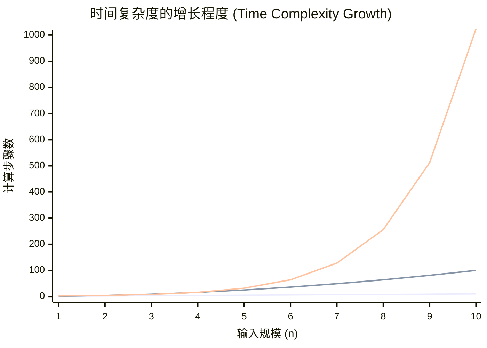
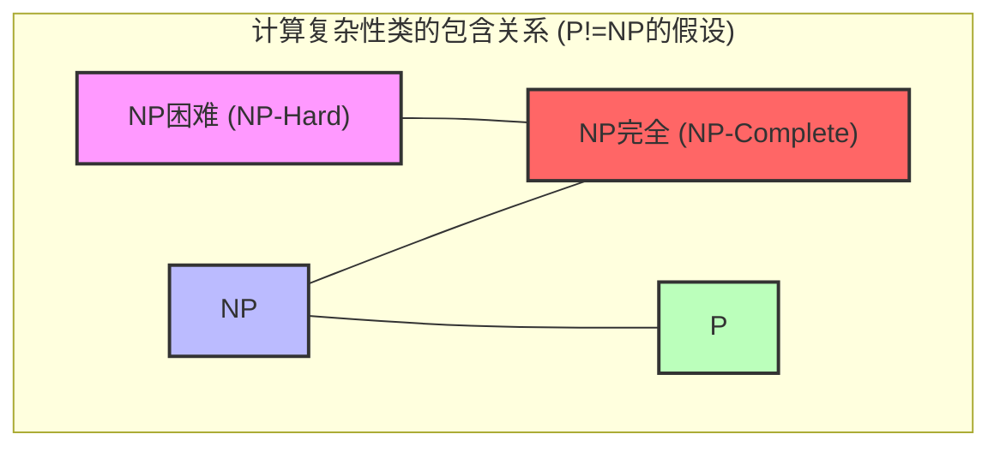
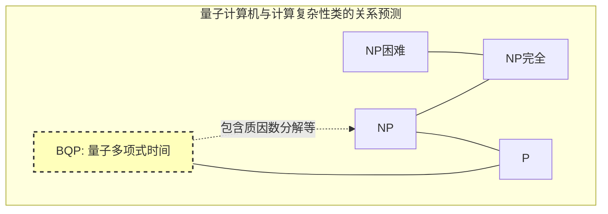

在计算机科学以及现代数学中，有一个最著名且最重要的未解决问题。那就是 **P vs NP问题** 。

2000年，克雷数学研究所为7个数学上的未解决问题分别悬赏了100万美元。这些被称为 **千禧年大奖难题** 。虽然像庞加莱猜想那样的问题已经被解决，但 **P vs NP问题** 至今甚至完全没有看到解决的线索。

本文将从计算复杂性类（P、NP、NP完全、NP困难）的基础开始，深入剖析这个 **P vs NP问题** 的全貌，探讨其在编程中的实践意义，甚至如果被破解后对世界产生的影响。

---

## 1. 计算复杂性理论与算法基础

为了理解 **P vs NP问题** ，首先必须理解“算法的时间复杂度”这一概念。计算机在为了解决某个问题而进行一步步的计算时，当输入规模 $n$ 增大，计算所需的时间（步骤数）或内存（空间）将如何增加，这被称为 **计算复杂性（Computational Complexity）** 。

### 朗道符号（Big-O Notation）

在表示时间复杂度时，常用的就是 $O$ 记号。这表示针对输入规模 $n$ 的最坏时间复杂度的上限。

- $O(1)$: 常数时间。与输入规模无关。
- $O(\log n)$: 对数时间。二分查找等。
- $O(n)$: 线性时间。简单的查找等。
- $O(n \log n)$: 高效的排序算法（快速排序、归并排序等）。
- $O(n^2), O(n^3)$: 多项式时间。双重循环、三重循环等。
- $O(2^n)$: 指数时间。穷举搜索等。
- $O(n!)$: 阶乘时间。旅行商问题的简单穷举等。

以下图表直观地展示了计算步骤数相对于输入规模的增长程度。


*(最下方表示 $O(n)$ ，中间表示 $O(n^2)$ ，最上方表示 $O(2^n)$ 。可以看出指数时间的爆炸性增长。)*

在计算复杂性理论中，用 $O(n^k)$ （ $k$ 为常数）表示的时间被称为 **多项式时间（Polynomial Time）** ，并被认为是能在实际可用的时间内计算出结果的一个标准。另一方面，像 $O(2^n)$ 这样的指数时间，只要 $n$ 达到几十，所需的计算时间就会超过宇宙的寿命，因此实质上被视为“无法求解”。

---

## 2. 什么是类P？（能在现实时间内“解决”的问题）

**类P（P: Polynomial time）** 被定义为“在确定型图灵机上，能够在多项式时间内解决的判定问题的集合”。

通俗地说，就是 **“计算机能够在现实时间内自行推导出答案的问题”** 。

### 类P的代表性问题

- **排序问题**: 将给定的数字按升序排列（例如 $O(n \log n)$ ）。
- **最短路径问题**: 像车载导航一样，寻找两点之间的最短路线（使用[Dijkstra](https://kenji.blog/zh-cn/p/graph-theory-dijkstra-a-star/)算法为 $O(E + V \log V)$ ）。
- **素数判定问题**: 判定某个数是否为素数（已经证明通过AKS素数测试可以在多项式时间内解决）。

以下是类P的一个代表性例子，二分查找算法的Python实现。

```python
def binary_search(arr, target):
    """
    在已排序的数组中对target进行二分查找的算法（类P的例子）
    时间复杂度: O(log n)
    """
    left, right = 0, len(arr) - 1
    
    while left <= right:
        mid = (left + right) // 2
        if arr[mid] == target:
            return mid
        elif arr[mid] < target:
            left = mid + 1
        else:
            right = mid - 1
            
    return -1

# 测试
sorted_data = [1, 3, 5, 7, 9, 11, 13, 15]
print("Index:", binary_search(sorted_data, 7)) # Output: 3
```

即使输入规模变大，这些问题的时间复杂度也不会爆炸，可以以可扩展的方式解决。

---

## 3. 什么是类NP？（能在现实时间内“验证”的问题）

**类NP（NP: Nondeterministic Polynomial time）** 被定义为“在非确定型图灵机上，能够在多项式时间内解决的判定问题的集合”，或者更通俗地定义为 **“当给出一个证据（作为证据的解）时，能够在多项式时间内验证其是否正确的问题的集合”** 。

这可以换一种说法： **“要靠自己找到答案可能极其困难，但如果给了你一个疑似答案的东西，你可以立刻检查它是否为正确答案的问题”** 。

### 类NP的代表性问题

- **数独（Sudoku）**: 填满盘面很困难，但如果交给你一个填满的盘面，一瞬间就可以检查出是否违反了规则（各行、列、区块是否有重复）。
- **子集和问题（Subset Sum）**: 能否从给定的整数集合中选出几个，使其总和达到特定的数字？ 找到解需要穷举，但如果交给你“选这个和这个”的证据（解），只需做加法就能确认。
- **旅行商问题（判定版）**: 是否存在一条访问所有城市并返回、距离小于等于 $K$ 的路线？

以下是“验证”数独解的Python代码示例。验证本身可以在 $O(n^2)$ 的多项式时间内完成。

```python
def verify_sudoku_solution(board):
    """
    验证完成的数独盘面（9x9）是否正确（类NP验证过程的例子）
    时间复杂度: O(n^2) - 非常快
    """
    def is_valid_group(group):
        return sorted(list(group)) == [1, 2, 3, 4, 5, 6, 7, 8, 9]

    # 行与列的验证
    for i in range(9):
        if not is_valid_group(board[i]):
            return False
        if not is_valid_group([board[j][i] for j in range(9)]):
            return False

    # 3x3区块的验证
    for i in range(0, 9, 3):
        for j in range(0, 9, 3):
            block = [board[x][y] for x in range(i, i+3) for y in range(j, j+3)]
            if not is_valid_group(block):
                return False

    return True

# 正常的数独解
valid_board = [
    [5,3,4,6,7,8,9,1,2],
    [6,7,2,1,9,5,3,4,8],
    [1,9,8,3,4,2,5,6,7],
    [8,5,9,7,6,1,4,2,3],
    [4,2,6,8,5,3,7,9,1],
    [7,1,3,9,2,4,8,5,6],
    [9,6,1,5,3,7,2,8,4],
    [2,8,7,4,1,9,6,3,5],
    [3,4,5,2,8,6,1,7,9]
]
print("验证结果:", verify_sudoku_solution(valid_board)) # Output: True
```

**属于P的问题全都属于NP。** 因为既然“自己能在现实时间内解决”，那么理所当然“给出解时的确认也能在现实时间内完成”。也就是说，用数学公式表示如下：

$ P \subseteq NP $

---

## 4. P vs NP问题的核心：“灵感”能否被“努力”替代？

在这里，我们终于要触及千禧年大奖难题，即 **P vs NP问题** 的核心了。

问题非常简单。

> **类P（能在现实时间内解决的问题）与类NP（能在现实时间内验证的问题），实际上难道不是完全相同的集合吗？也就是说，是 $P = NP$ ？还是 $P \neq NP$ ？**

直觉上， **“寻找解”** 和 **“检查解是否正确”** 相比，前者会让人感觉难度呈压倒性的大。如果对比解开数独谜题和对答案，显然对答案要简单得多。

如果 **P = NP** ，那就意味着“只要能轻松对答案的问题，实际上只要知道了方法就能轻松解决”。这极大违背了人类的直觉，因此大多数现代数学家和计算机科学家（问卷调查中超过9成）都猜测 **$P \neq NP$** 。然而，至今还没有任何人能从数学上证明这一点。

---

## 5. NP完全与NP困难（宇宙中最难的问题们）

在理解这个问题时不可或缺的概念，就是 **NP完全（NP-Complete）** 和 **NP困难（NP-Hard）** 。

### 多项式时间归约（Polynomial-time Reduction）
假设有一个解决问题 $A$ 的程序。当你想要解决问题 $B$ 时，如果能将问题 $B$ 的输入快速（在多项式时间内）转换为问题 $A$ 的输入，并使用解决问题 $A$ 的程序得出解，然后能将该结果快速转换为问题 $B$ 的解，那么就可以说“问题 $B$ 并不比问题 $A$ 更难”。这被称为 **多项式时间归约** 。

### NP困难（NP-Hard）
属于这样的一个问题类：从属于类NP的 **所有** 问题，都能在多项式时间内归约到该问题。也就是说，它是“比NP中的任何问题都至少一样难或者更难的问题”。NP困难的问题甚至不需要是判定问题。

### NP完全（NP-Complete）
既是NP困难，且自身也属于类NP的问题类。这意味着 **“类NP中最难的一群问题”** 。



令人惊讶的是，1971年斯蒂芬·库克和列昂尼德·列文证明了 **布尔可满足性问题（SAT）** 是NP完全的（库克-列文定理）。

之后，理查德·卡普陆续证明了旅行商问题、背包问题、图的着色问题等现实社会中的许多优化问题都是 **NP完全** 的（卡普的21个NP完全问题）。

**NP完全问题最大的性质在于，“只要在NP完全问题中发现哪怕1个能用多项式时间解决的算法，所有的NP问题就都能在多项式时间内解决（也就是 $P = NP$ ）”。** 
这可以说计算机科学中终极的多米诺骨牌效应。

---

## 6. 编程中的具体比较与实现

在这里，我们将比较“相似但难度完全不同的问题”，并解说程序员所面临的障碍。

### 欧拉回路（类P） vs 哈密顿回路（NP完全）

- **欧拉回路**: 刚好经过所有的“边”一次并回到起点的路线寻找（一笔画）。这只需要检查各个顶点的度数，能在 $O(V+E)$ 的多项式时间内解决。
- **哈密顿回路**: 刚好经过所有的“顶点”一次并回到起点的路线寻找（旅行商问题的基础）。稍微改变了条件，这就变成了 **NP完全** ，目前还没有找到高效的算法。

### 旅行商问题（TSP）的实现示例与近似算法

如果想要精确求解属于NP困难（优化问题版）的旅行商问题，计算量将会爆炸。让我们通过以下的Python代码，来比较精确解（穷举）与实用的近似解（贪心算法）。

```python
import itertools
import math

def calculate_distance(city1, city2):
    return math.hypot(city1[0]-city2[0], city1[1]-city2[1])

# 1. 精确解（穷举） - 时间复杂度: O(N!)
def tsp_brute_force(cities):
    n = len(cities)
    best_dist = float('inf')
    best_path = None
    
    # 固定第一个城市，尝试剩余城市的所有排列
    for perm in itertools.permutations(range(1, n)):
        path = (0,) + perm
        dist = 0
        for i in range(n):
            dist += calculate_distance(cities[path[i]], cities[path[(i+1)%n]])
        
        if dist < best_dist:
            best_dist = dist
            best_path = path
            
    return best_dist, best_path

# 2. 近似解（贪心算法） - 时间复杂度: O(N^2)
def tsp_greedy(cities):
    n = len(cities)
    unvisited = set(range(1, n))
    current_city = 0
    path = [0]
    total_dist = 0
    
    while unvisited:
        # 寻找最近的未访问城市
        next_city = min(unvisited, key=lambda city: calculate_distance(cities[current_city], cities[city]))
        total_dist += calculate_distance(cities[current_city], cities[next_city])
        current_city = next_city
        path.append(current_city)
        unvisited.remove(current_city)
        
    # 返回第一个城市
    total_dist += calculate_distance(cities[current_city], cities[0])
    return total_dist, path

# 测试执行
cities = [(0, 0), (1, 5), (5, 2), (6, 6), (8, 3), (2, 9), (9, 9)]

dist_exact, path_exact = tsp_brute_force(cities)
dist_greedy, path_greedy = tsp_greedy(cities)

print(f"精确解: 距离 {dist_exact:.2f}, 路线 {path_exact}")
print(f"近似解: 距离 {dist_greedy:.2f}, 路线 {path_greedy}")
```

当城市数量 $N=20$ 超过时，即使是现代超级计算机，计算精确解（穷举）也会花费与宇宙寿命相当的时间。然而，如果使用贪心算法等近似算法， **虽然可能不是最优的，但能在一瞬间得出相当好的解** 。程序员在看穿问题属于NP困难的瞬间，就需要做出放弃精确解、转向启发式算法或近似算法的设计判断。

---

## 7. 如果 P = NP 世界将会怎样？

如今，全世界的密码系统（互联网购物中使用的SSL/TLS，或比特币等区块链）都是利用了 **“求解需要花费惊人时间，但验证只需一瞬间”** 这种不对称性。

作为[RSA](https://kenji.blog/zh-cn/p/modern-cryptography-public-key-hash-signature/)密码基础的质因数分解也是其中之一。
假设有人证明了 $P = NP$ ，并构建出了能在多项式时间内解决NP问题的神奇算法（构造性证明）。那将引发如下的 **人类社会的范式转移** 。

1. **密码的崩溃**: RSA密码和椭圆曲线密码等现代公开密钥密码系统都将被瞬间破解，数字安全将彻底崩溃。
2. **AI与机器学习的终极进化**: 神经网络的最优权重或强化学习的最优策略将能够被瞬间计算出来。
3. **新药研发与生命科学的飞跃**: 蛋白质折叠结构（这也归约为NP困难问题）能被瞬间计算，针对不治之症的特效药将由AI接连不断地开发出来。
4. **物流与生产的完全优化**: 构建排除一切浪费的终极供应链，大部分能源问题将得到解决。

正如数学家斯科特·亚伦森所说：“如果 $P = NP$ ，那么世界上就不存在所谓的创造性飞跃，所有的灵感和天才直觉都能被机械的计算所替代”，这是一个甚至带有哲学意义的问题。

---

## 8. 量子计算机与 P vs NP问题

近年来，随着量子计算机的出现，产生了一种误解：“如果是量子计算机的话，是不是就能解决NP完全问题了？”。

在计算复杂性理论中，量子计算机能在多项式时间内解决的问题类被称为 **BQP (Bounded-error Quantum Polynomial time)** 。根据彼得·肖尔提出的“肖尔算法”，证明了质因数分解属于BQP（能用量子计算机快速求解）。

然而，目前计算机科学界的共识是， **并不认为 $NP完全 \subseteq BQP$** 。
也就是说，即使是量子计算机，也被认为无法在多项式时间内解决旅行商问题或背包问题等NP完全问题。量子计算机并非魔法棒，它仅仅是对拥有特定数学结构的问题（如发现周期性等）能发挥压倒性速度的机器而已。


*(预计BQP类包含了P，并能解决NP的一部分（质因数分解等），但并不包含所有的NP完全问题。)*

---

## 9. 对工程师・程序员的意义与应对方法

我们软件工程师在日常工作面临的业务课题（排班、配送路线优化、云资源分配、装箱问题），其中绝大多数都是 **NP困难** 的问题。

当业务方提出要求“请做一个能给出这个问题最优解的系统”时，如果你没有计算复杂性理论的知识，你就会写出永远运行不完的程序，最终导致服务器宕机。

**P vs NP问题** （以及NP完全性理论）能够教给程序员的最大教训如下：

1. **认识问题的难度**: 如果能证明（或者推测）面临的问题是NP困难的，就应该停止探索寻求完美最优解的算法。
2. **退而求其次选择松弛与近似**:
    - **近似算法**: 保证与最优解的误差在一定范围内，同时在多项式时间内求解。
    - **启发式算法**: 采用遗传算法或模拟退火法等，虽然没有数学上的保证，但经验上能高速得出“相当好的解”的方法。
    - **动态规划 ([DP](https://kenji.blog/zh-cn/p/dynamic-programming-dp-introduction-knapsack-fibonacci/))**: 像背包问题那样，如果存在依赖于输入数值大小的（伪多项式时间）解法，则利用输入的限制。
    - **SAT求解器・MILP求解器**: 形式化后交给近年来发展显著的通用数学优化求解器。由于求解器内部会进行高度的剪枝，如果是实用规模的话，往往也能得出精确解。

```python
# 使用动态规划求解0-1背包问题（伪多项式时间的例子）
def knapsack_dp(weights, values, capacity):
    """
    虽然是NP困难的，但如果使用DP就能以伪多项式时间 O(N*W) 求解的例子
    """
    n = len(weights)
    # dp[i][w] : 前i个物品在重量不超过w时的最大价值
    dp = [[0] * (capacity + 1) for _ in range(n + 1)]
    
    for i in range(1, n + 1):
        for w in range(1, capacity + 1):
            if weights[i-1] <= w:
                # 取放入和不放入两种情况的最大值
                dp[i][w] = max(dp[i-1][w], dp[i-1][w-weights[i-1]] + values[i-1])
            else:
                dp[i][w] = dp[i-1][w]
                
    return dp[n][capacity]

weights = [2, 3, 4, 5]
values = [3, 4, 5, 6]
capacity = 5
print(f"背包的最大价值: {knapsack_dp(weights, values, capacity)}")
```

---

## 结论：对人类智慧极限的挑战

**P vs NP问题** 绝不仅仅是数学上的谜题。这是一个追问“什么是高效的计算”、“数学证明能否自动化”、“灵感能否被算法化”等人类智慧极限的宏大哲学问题。

考虑到这个问题所具有的重要性，克雷数学研究所那100万美元的奖金或许实在是太便宜了。如果你完成了 $P = NP$ 的证明算法，在领取奖金之前，你甚至能将所有的加密货币转入自己的钱包（当然，从伦理上来说绝对不能这么做）。

随着未来研究的突破，我们能否在有生之年看到这个问题的了结？又或者是像哥德尔的不完备定理那样，被证明为“既不能证明也不能证伪”？计算复杂性理论的最前沿，今后依然不容移开视线。

> **参考文献 / 相关链接**
> - 克雷数学研究所 千禧年大奖难题 (Clay Mathematics Institute)
> - 斯蒂芬·库克 "The Complexity of Theorem-Proving Procedures" (1971)
> - 理查德·卡普 "Reducibility Among Combinatorial Problems" (1972)
> - 迈克尔·西普塞 "计算理论导引" (Sipser, Introduction to the Theory of Computation)
