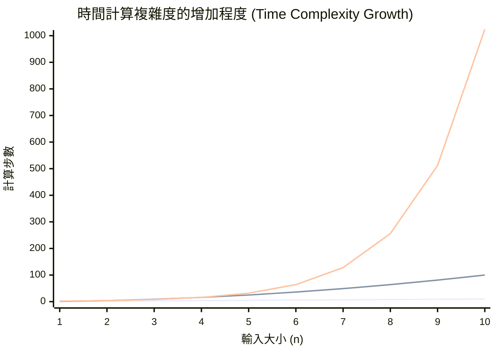
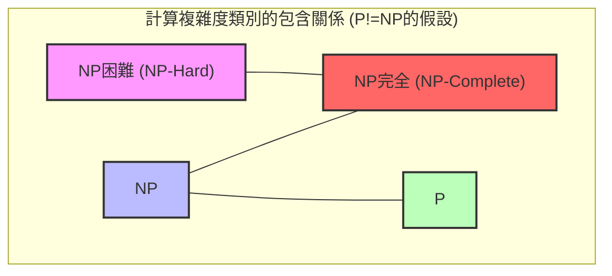
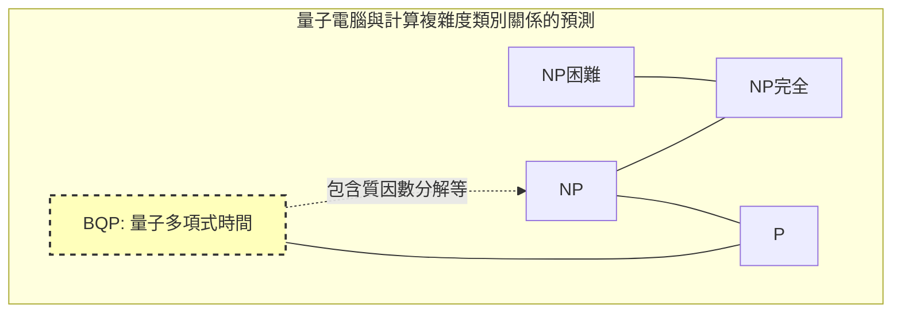

在電腦科學以及現代數學中，有一個最著名且最重要的未解決問題。那就是 **P vs NP問題** 。

2000年，克雷數學研究所針對7個數學上的未解決問題各懸賞了100萬美元。這些被稱為 **千禧年大獎難題** 。雖然像[龐加萊猜想](/zh-tw/p/poincare-conjecture/)等已經被解決，但 **P vs NP問題** 至今甚至連解決的線索都尚未完全浮現。

在本文中，我們將詳細深入探討這個 **P vs NP問題** 的全貌，從計算[複雜度](/zh-tw/p/time-space-complexity-big-o-notation-examples/)類別（P、NP、NP完全、NP困難）的基礎，到在程式設計中的實務意義，甚至是如果被解開的話對世界的影響。

---

## 1. 計算複雜度理論與演算法的基礎

為了解 **P vs NP問題** ，首先必須了解「演算法的計算[複雜度](/zh-tw/p/time-space-complexity-big-o-notation-examples/)」這個概念。電腦為了解決某個問題會進行一步步的計算，而當輸入的大小 $n$ 變大時，計算所需的時間（步數）和記憶體（空間）會如何增加，這就稱為 **計算[複雜度](/zh-tw/p/time-space-complexity-big-o-notation-examples/)（Computational Complexity）** 。

### 蘭道符號（Big-O Notation）

表示計算[複雜度](/zh-tw/p/time-space-complexity-big-o-notation-examples/)時常用的就是 $O$ 記號。這表示相對於輸入大小 $n$ 的最壞計算[複雜度](/zh-tw/p/time-space-complexity-big-o-notation-examples/)上限。

- $O(1)$: 常數時間。不依賴輸入大小。
- $O(\log n)$: 對數時間。如二元搜尋等。
- $O(n)$: 線性時間。如簡單搜尋等。
- $O(n \log n)$: 高效的排序演算法（快速排序、合併排序等）。
- $O(n^2), O(n^3)$: 多項式時間。如雙層迴圈、三層迴圈等。
- $O(2^n)$: 指數時間。如暴力搜尋等。
- $O(n!)$: 階乘時間。如旅行推銷員問題的簡單暴力搜尋等。

以下圖表視覺化了計算步數相對於輸入大小的增加程度。


*(最下方表示 $O(n)$ ，中間表示 $O(n^2)$ ，最上方表示 $O(2^n)$ 。可以看出指數時間爆發性的增加。)*

在計算[複雜度](/zh-tw/p/time-space-complexity-big-o-notation-examples/)理論中，以 $O(n^k)$ （ $k$ 為常數）表示的時間稱為 **多項式時間（Polynomial Time）** ，並被視為可在實用時間內計算的一個基準。另一方面，像 $O(2^n)$ 等指數時間，只要 $n$ 達到數十，就需要超過宇宙壽命的計算時間，因此實質上被視為「無法解開」。

---

## 2. P類別是什麼？（可以在現實時間內「解開」的問題）

**P類別（P: Polynomial time）** 被定義為「在確定性圖靈機中，可以在多項式時間內解開的判定問題的集合」。

簡單來說，就是 **「電腦能夠在現實時間內靠自己得出答案的問題」** 。

### P類別的代表性問題

- **排序問題**：將給定的數值按升序排列（如 $O(n \log n)$ ）。
- **最短路徑問題**：像汽車導航一樣，尋找兩點之間的最短路線（使用[Dijkstra](https://kenji.blog/zh-tw/p/graph-theory-dijkstra-a-star/)演算法為 $O(E + V \log V)$ ）。
- **質數判定問題**：判定某個數是否為質數（已證明可藉由AKS質數測試在多項式時間內解開）。

以下是P類別代表例，即二元[搜尋演算法](/zh-tw/p/search-algorithms-linear-binary-hash-table-principles/)的Python實作。

```python
def binary_search(arr, target):
    """
    從已排序的陣列中對target進行二元搜尋的演算法（P類別的例子）
    時間複雜度: O(log n)
    """
    left, right = 0, len(arr) - 1
    
    while left <= right:
        mid = (left + right) // 2
        if arr[mid] == target:
            return mid
        elif arr[mid] < target:
            left = mid + 1
        else:
            right = mid - 1
            
    return -1

# 測試
sorted_data = [1, 3, 5, 7, 9, 11, 13, 15]
print("Index:", binary_search(sorted_data, 7)) # Output: 3
```

這些問題即使輸入大小變大，計算[複雜度](/zh-tw/p/time-space-complexity-big-o-notation-examples/)也不會爆發，能夠以可擴展的方式解開。

---

## 3. NP類別是什麼？（可以在現實時間內「驗證」的問題）

**NP類別（NP: Nondeterministic Polynomial time）** 被定義為「在非確定性圖靈機中，可以在多項式時間內解開的判定問題的集合」，或者更易懂地說是 **「給定一個證據（作為證據的解）時，可以在多項式時間內驗證其是否正確的問題的集合」** 。

這可以換句話說為 **「靠自己找出答案可能非常困難，但如果被給予一個看似答案的東西，能夠立刻檢查它是否為正確答案的問題」** 。

### NP類別的代表性問題

- **數獨（Sudoku）**：填滿盤面很困難，但如果收到一個全填滿的盤面，檢查它是否違反規則（每行、每列、每個區塊是否有重複）則是一瞬間的事。
- **子集合加總問題（Subset Sum）**：從給定的整數集合中選出幾個，是否能使其總和等於特定數字？找出解需要暴力搜尋，但如果給定「選這個和這個」的證據（解），只需加起來就能確認。
- **旅行推銷員問題（判定版）**：是否存在造訪所有城市並返回、距離在 $K$ 以下的路線？

以下是「驗證」數獨解答的Python程式碼範例。驗證本身可以在 $O(n^2)$ 的多項式時間內完成。

```python
def verify_sudoku_solution(board):
    """
    驗證數獨完成的盤面（9x9）是否正確（NP類別驗證過程的例子）
    時間複雜度: O(n^2) - 非常快
    """
    def is_valid_group(group):
        return sorted(list(group)) == [1, 2, 3, 4, 5, 6, 7, 8, 9]

    # 行和列的驗證
    for i in range(9):
        if not is_valid_group(board[i]):
            return False
        if not is_valid_group([board[j][i] for j in range(9)]):
            return False

    # 3x3區塊的驗證
    for i in range(0, 9, 3):
        for j in range(0, 9, 3):
            block = [board[x][y] for x in range(i, i+3) for y in range(j, j+3)]
            if not is_valid_group(block):
                return False

    return True

# 正常的數獨解答
valid_board = [
    [5,3,4,6,7,8,9,1,2],
    [6,7,2,1,9,5,3,4,8],
    [1,9,8,3,4,2,5,6,7],
    [8,5,9,7,6,1,4,2,3],
    [4,2,6,8,5,3,7,9,1],
    [7,1,3,9,2,4,8,5,6],
    [9,6,1,5,3,7,2,8,4],
    [2,8,7,4,1,9,6,3,5],
    [3,4,5,2,8,6,1,7,9]
]
print("驗證結果:", verify_sudoku_solution(valid_board)) # Output: True
```

**屬於P的問題全部屬於NP。** 因為如果「能夠在現實時間內靠自己解開」，那麼「給定解的時候，其確認當然也能在現實時間內完成」。也就是說，用數學式表示如下。

$ P \subseteq NP $

---

## 4. P vs NP問題的核心：「靈感」能夠被「努力」取代嗎？

這裡我們終於要接觸到千禧年大獎難題—— **P vs NP問題** 的核心。

問題非常簡單。

> **P類別（能夠在現實時間內解開的問題）和NP類別（能夠在現實時間內驗證的問題），實際上會不會是完全相同的集合？也就是說，$P = NP$ 還是 $P \neq NP$？**

直覺上， **「找出解答」** 和 **「檢查解答是否正確」** 相比，前者讓人感覺壓倒性地困難。比較解開數獨謎題和對答案，對答案當然比較簡單對吧。

如果 **P = NP** ，那就意味著「答案很容易檢查的問題，實際上只要知道解法就能輕易解開」。這極大地違背了人類的直覺，因此現代多數的數學家和電腦科學家（問卷調查中超過9成）預測 **$P \neq NP$** 。然而，至今尚未有人能夠在數學上證明這一點。

---

## 5. NP完全與NP困難（宇宙中最難的問題們）

在理解這個問題時，不可或缺的是 **NP完全（NP-Complete）** 和 **NP困難（NP-Hard）** 這兩個概念。

### 多項式時間歸約（Polynomial-time Reduction）
假設有一個解決問題 $A$ 的程式。當我們想解問題 $B$ 時，如果能將問題 $B$ 的輸入快速（在多項式時間內）轉換為問題 $A$ 的輸入，並使用解決問題 $A$ 的程式得出解答，然後快速將結果轉換為問題 $B$ 的解答，那麼我們就能說「問題 $B$ 不比問題 $A$ 難」。這被稱為 **多項式時間歸約** 。

### NP困難（NP-Hard）
這是可以從屬於NP類別的 **所有** 問題，在多項式時間內歸約而成的問題類別。也就是說，它是「比任何屬於NP的問題，至少一樣難或甚至更難的問題」。NP困難的問題甚至不需要是判定問題。

### NP完全（NP-Complete）
既是NP困難，且本身也屬於NP類別的問題類別。這意味著 **「NP類別中最難的問題們的集合」** 。



令人驚訝的是，1971年史蒂芬·庫克與列昂尼德·列文證明了 **布林可滿足性問題（SAT）** 是NP完全的（庫克-列文定理）。

之後，理查德·卡普接連證明了旅行推銷員問題、背包問題、圖著色問題等實體社會的許多最佳化問題都是 **NP完全** （卡普的21個NP完全問題）。

**NP完全問題最大的特性是，「只要能在多項式時間內解開任何一個NP完全問題，所有的NP問題就都能在多項式時間內解開（也就是說 $P = NP$ ）」。** 
這可以說是電腦科學領域中終極的骨牌效應。

---

## 6. 程式設計中具體的比較與實作

在此，我們將比較「雖然相似但難度完全不同的問題」，並解說程式設計師面臨的障礙。

### 尤拉迴路（P類別） vs 漢米爾頓迴路（NP完全）

- **尤拉迴路**：尋找正好通過所有「邊」一次並回到原頂點的路線（一筆畫）。只需檢查各個頂點的度數，就能以 $O(V+E)$ 的多項式時間解開。
- **漢米爾頓迴路**：尋找正好通過所有「頂點」一次並回到原頂點的路線（旅行推銷員問題的基礎）。僅僅稍微改變了條件，這就變成了 **NP完全** ，至今沒有找到高效的演算法。

### 旅行推銷員問題（TSP）的實作範例與近似演算法

嘗試嚴格解開屬於NP困難（最佳化問題版）的旅行推銷員問題會導致計算[複雜度](/zh-tw/p/time-space-complexity-big-o-notation-examples/)爆發。讓我們用以下的Python程式碼，來比較嚴格解（暴力搜尋）與實用的近似解（貪婪法）。

```python
import itertools
import math

def calculate_distance(city1, city2):
    return math.hypot(city1[0]-city2[0], city1[1]-city2[1])

# 1. 嚴格解（暴力搜尋） - 時間複雜度: O(N!)
def tsp_brute_force(cities):
    n = len(cities)
    best_dist = float('inf')
    best_path = None
    
    # 固定第一個城市，並嘗試剩餘城市的所有排列
    for perm in itertools.permutations(range(1, n)):
        path = (0,) + perm
        dist = 0
        for i in range(n):
            dist += calculate_distance(cities[path[i]], cities[path[(i+1)%n]])
        
        if dist < best_dist:
            best_dist = dist
            best_path = path
            
    return best_dist, best_path

# 2. 近似解（貪婪法） - 時間複雜度: O(N^2)
def tsp_greedy(cities):
    n = len(cities)
    unvisited = set(range(1, n))
    current_city = 0
    path = [0]
    total_dist = 0
    
    while unvisited:
        # 尋找最近的未造訪城市
        next_city = min(unvisited, key=lambda city: calculate_distance(cities[current_city], cities[city]))
        total_dist += calculate_distance(cities[current_city], cities[next_city])
        current_city = next_city
        path.append(current_city)
        unvisited.remove(current_city)
        
    # 回到第一個城市
    total_dist += calculate_distance(cities[current_city], cities[0])
    return total_dist, path

# 測試執行
cities = [(0, 0), (1, 5), (5, 2), (6, 6), (8, 3), (2, 9), (9, 9)]

dist_exact, path_exact = tsp_brute_force(cities)
dist_greedy, path_greedy = tsp_greedy(cities)

print(f"嚴格解: 距離 {dist_exact:.2f}, 路線 {path_exact}")
print(f"近似解: 距離 {dist_greedy:.2f}, 路線 {path_greedy}")
```

當城市數量 $N=20$ 以上時，即使是現代超級電腦，要得出嚴格解（暴力搜尋）也需要約等同於宇宙壽命的時間。但是，如果使用貪婪法等近似演算法，就能在一瞬間得出 **也許不是最佳，但相當不錯的解** 。程式設計師在發現問題是NP困難的當下，就需要做出設計判斷，放棄嚴格解，轉而採用啟發式或近似演算法。

---

## 7. 如果 P = NP，世界會變成怎樣？

目前，世界上的密碼系統（如網購使用的SSL/TLS，或是比特幣等[區塊鏈](/zh-tw/p/blockchain-technology-smart-contract-distributed-ledger/)），都是利用了 **「解開需要極長的時間，但驗證只需一瞬間」** 的非對稱性。

[RSA](https://kenji.blog/zh-tw/p/modern-cryptography-public-key-hash-signature/)密碼核心的質因數分解也是其中之一。
如果有人證明了 $P = NP$ ，並建構了在多項式時間內解開NP問題的魔法演算法（建構性證明），那將會引發以下 **人類社會的典範轉移** ：

1. **密碼的崩潰**：RSA密碼和橢圓曲線密碼等現代公鑰密碼系統都將被瞬間破解，數位安全將徹底崩潰。
2. **AI與機器學習的終極進化**：類神經網路的最佳權重分配，或是強化學習的最佳策略都能夠瞬間計算出來。
3. **新藥研發與生命科學的飛躍**：蛋白質摺疊結構（這也能歸約為NP困難問題）能夠一瞬間計算完成，針對不治之症的特效藥將由AI接連開發出來。
4. **物流與生產的完全最佳化**：將建構出排除所有浪費的終極供應鏈，大部分的能源問題都將迎刃而解。

正如數學家史考特·阿倫森所說：「如果 $P = NP$ ，那麼世界上就不存在創造性的飛躍，所有的靈感和天才的直覺都能被機械式的計算所取代」，這是一個甚至帶有哲學意味的問題。

---

## 8. 量子電腦與 P vs NP問題

近年來，隨著量子電腦的出現，產生了「量子電腦是不是就能解開NP完全問題？」的誤解。

在計算[複雜度](/zh-tw/p/time-space-complexity-big-o-notation-examples/)理論中，量子電腦能在多項式時間內解開的問題類別被稱為 **BQP (Bounded-error Quantum Polynomial time)** 。藉由彼得·秀爾構思的「秀爾演算法」，證明了質因數分解屬於BQP（量子電腦能快速解開）。

然而，目前計算機科學界的共識是， **不認為 $NP完全 \subseteq BQP$** 。
也就是說，即使是量子電腦，也被認為無法在多項式時間內解開如旅行推銷員問題或背包問題等NP完全問題。量子電腦並非魔法棒，它只有對具有特定數學結構的問題（如尋找週期性等）才能發揮壓倒性速度的機器。


*(BQP類別包含P，並能解開NP的一部分（如質因數分解等），但預期並不包含所有的NP完全問題。)*

---

## 9. 對於工程師與程式設計師的意義及應對方式

我們軟體工程師在日常中面臨的業務課題（如排班表、配送路線最佳化、雲端資源分配、裝箱問題），其中絕大部分都是 **NP困難** 的問題。

當商業端要求「請做一個能給出這個問題最佳解的系統」時，如果沒有計算[複雜度](/zh-tw/p/time-space-complexity-big-o-notation-examples/)理論的知識，你將會寫出一個永遠跑不完的程式，並導致伺服器當機。

**P vs NP問題** （以及NP完全性理論）帶給程式設計師最大的教訓如下：

1. **認知問題的難度**：如果能證明（或推測）面臨的問題是NP困難的，就停止探索追求完美最佳解的演算法。
2. **轉向放寬條件與近似**：
    - **近似演算法**：確保與最佳解的誤差在一定範圍內，並在多項式時間內解開。
    - **啟發式演算法**：如基因演算法或模擬退火法等，雖然沒有數學上的保證，但經驗上能在高速下得出「相當不錯的解」的手法。
    - **動態規劃 ([DP](https://kenji.blog/zh-tw/p/dynamic-programming-dp-introduction-knapsack-fibonacci/))**：像背包問題一樣，如果存在依賴輸入數值大小的解法（偽多項式時間），就利用輸入的限制。
    - **SAT求解器・MILP求解器**：公式化後丟給近年來發展迅速的通用數學最佳化求解器。因為求解器內部會進行高度的剪枝，如果是實用大小的問題，往往也能得出嚴格解。

```python
# 使用動態規劃解開0-1背包問題（偽多項式時間的例子）
def knapsack_dp(weights, values, capacity):
    """
    雖然是NP困難，但若使用DP則能在偽多項式時間 O(N*W) 內解開的例子
    """
    n = len(weights)
    # dp[i][w] : 前i個物品且重量在w以下時的最大價值
    dp = [[0] * (capacity + 1) for _ in range(n + 1)]
    
    for i in range(1, n + 1):
        for w in range(1, capacity + 1):
            if weights[i-1] <= w:
                # 取得放入和不放入時的最大值
                dp[i][w] = max(dp[i-1][w], dp[i-1][w-weights[i-1]] + values[i-1])
            else:
                dp[i][w] = dp[i-1][w]
                
    return dp[n][capacity]

weights = [2, 3, 4, 5]
values = [3, 4, 5, 6]
capacity = 5
print(f"背包的最大價值: {knapsack_dp(weights, values, capacity)}")
```

---

## 結論：向人類智慧極限的挑戰

**P vs NP問題** 並不僅僅是個數學謎題。它是詢問「什麼是有效率的計算」「數學證明能夠自動化嗎」「靈感能夠演算法化嗎」等，挑戰人類智慧極限的宏大哲學問題。

克雷數學研究所那100萬美元的懸賞金，若考慮到這個問題的重要性，或許太便宜了。如果你完成了 $P = NP$ 的證明演算法，在領取獎金之前，你甚至能將所有的加密貨幣轉進自己的錢包（當然，在道德上絕對不能這麼做）。

未來的研究突破，是否能讓我們在有生之年看到這個問題的結果呢？還是會像哥德爾的不完備定理一樣，被證明為「既無法證明也無法反證」呢？計算[複雜度](/zh-tw/p/time-space-complexity-big-o-notation-examples/)理論的最前線，今後也將持續令人矚目。

> **參考文獻 / 相關連結**
> - 克雷數學研究所 千禧年大獎難題 (Clay Mathematics Institute)
> - 史蒂芬·庫克 "The Complexity of Theorem-Proving Procedures" (1971)
> - 理查德·卡普 "Reducibility Among Combinatorial Problems" (1972)
> - 麥可·西普塞 "計算理論導引" (Sipser, Introduction to the Theory of Computation)
