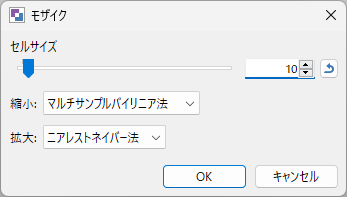

في هذه المقالة، سنشرح كيفية تطبيق الفسيفساء على جزء معين من الصورة باستخدام paint.net.

عند تحميل الصور على الإنترنت، قد ترغب في بعض الأحيان في إخفاء أجزاء معينة بوضع فسيفساء عليها، وباستخدام paint.net يمكنك تعديل الصور بسهولة وسرعة.

## الخطوات

#### 1. افتح الصورة التي تريد تعديلها في paint.net
#### 2. استخدم أداة التحديد لاختيار الجزء الذي تريد تغطيته بالفسيفساء (يمكن التحديد المتعدد)

#### 3. اختر من القائمة: تأثيرات (Effects) > تشويه (Distort) > فسيفساء (Pixelate)

- يمكنك ضبط حجم الخلية للتحكم في خشونة الفسيفساء. كلما زادت القيمة، زادت درجة الإخفاء.
- [تصغير] اختر Bilinear (صقل متعدد العينات)
- [تكبير] اختر Nearest Neighbor (أقرب جار)

انقر على OK لإغلاق النافذة.

#### 4. سيتم تطبيق الفسيفساء، قم بحفظ الصورة بعد ذلك.

هذا كل شيء.
