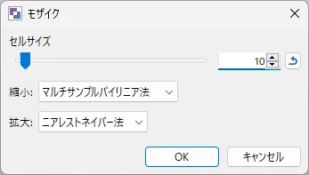
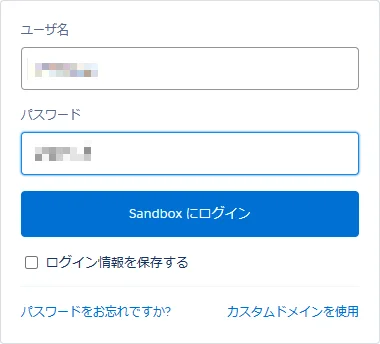

В этой статье мы расскажем, как применить мозаику к определенной части изображения в paint.net.

При загрузке изображений в интернет иногда возникает необходимость скрыть определенные участки с помощью мозаики. С помощью paint.net вы можете быстро и легко отредактировать изображение.

## Инструкция

#### 1. Откройте изображение, которое хотите отредактировать, в paint.net
#### 2. Используйте инструмент выделения, чтобы выбрать область для наложения мозаики (можно выбрать несколько областей)

#### 3. В меню выберите: Эффекты (Effects) > Искажение (Distort) > Мозаика (Pixelate)

- Размер ячейки определяет крупность мозаики. Чем больше значение, тем сильнее скрывается изображение.
- [Уменьшение] Выберите Билинейный (многовыборочный)
- [Увеличение] Выберите Ближайший сосед

Нажмите OK, чтобы закрыть диалоговое окно.

#### 4. После того как мозаика будет применена к изображению, сохраните его.

На этом всё.
