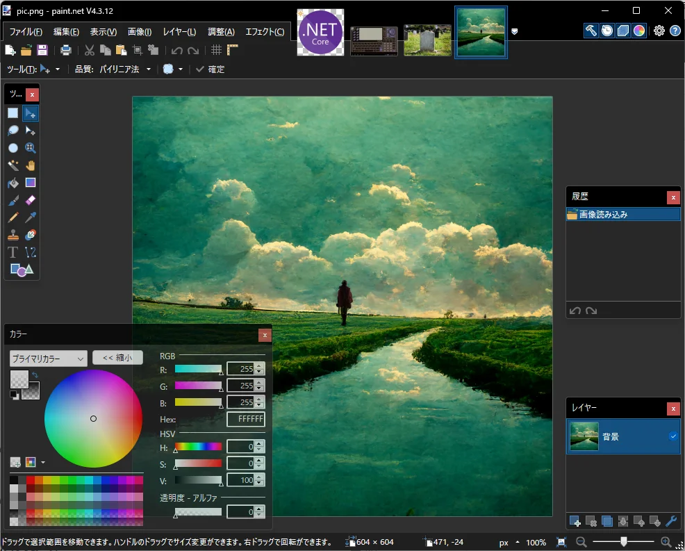
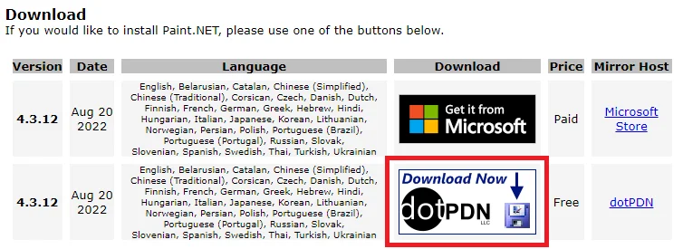

Apresentarei o software de edição de imagens paint.net, que costumo usar no meu trabalho de desenvolvimento.

# Pontos úteis que o Paint padrão do Windows não faz
- Pode lidar com transparência e opacidade
- Pode fazer seleção automática de formas de área complexas
- Pode lidar com camadas
- Pode ajustar correção de nível, brilho, contraste, etc.
- Pode aplicar vários efeitos (desfoque, distorção, ruído, etc.)

# Outras características
- Gratuito para usar
- Operação relativamente leve
- Intuitivo de usar e não tem muitas peculiaridades
- Japonês (suporte multilíngue)

É um software altamente funcional, mas fácil de usar. Eu mesmo ainda não domino todos os recursos.

# Instale aqui
[https://www.getpaint.net/download.html](https://www.getpaint.net/download.html)

Se você escolher a versão gratuita, clique na parte circulada em vermelho abaixo no link.

Parece que se você instalar pela Microsoft Store, será pago, mas em troca receberá atualizações automáticas.
Mesmo com a versão gratuita, você será notificado sobre as atualizações mais recentes, para que possa atualizar sem problemas.
