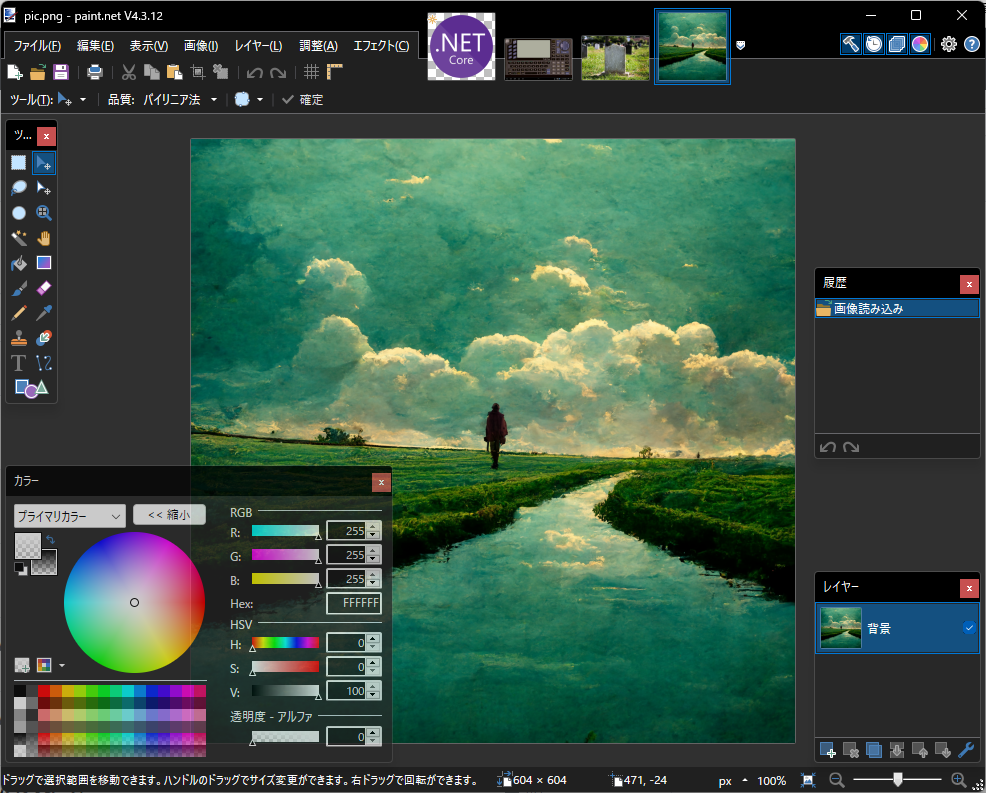
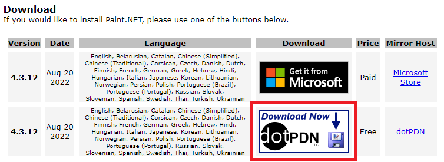

介绍一下我在开发工作中经常使用的图像编辑软件paint.net。

# Windows自带画图工具无法做到但非常实用的功能
- 能够处理透明和不透明度
- 可以进行复杂范围的自动选择
- 可以处理图层
- 可以调整色阶、亮度、对比度等
- 能够应用各种特效（模糊、扭曲、噪点等）

# 其他特点
- 免费使用
- 运行相对轻量
- 使用直观，没有太多奇怪的设定
- 支持日语（多语言支持）

虽然功能强大但非常容易使用的软件。我自己也还没有完全掌握所有的功能。

# 安装请点击这里
[https://www.getpaint.net/download.html](https://www.getpaint.net/download.html)

如果选择免费版，请点击链接中下方红框的部分。

如果通过Microsoft Store安装，虽然是收费的，但可以自动更新。
即使是免费版，也会通知最新的更新信息，所以更新也比较顺利。
