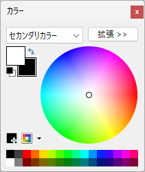
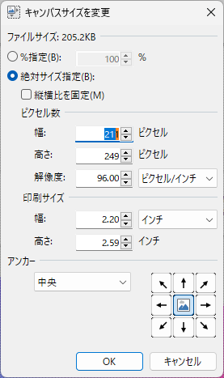

---

title: "Cómo añadir un borde a una imagen usando paint.net"
date: 2023-04-11T14:31:59+09:00
tags: ["paint.net", "borde", "imagen"]
draft: false
image: "img_3.png"
categories: ["IA y Tecnología"]
---

Te mostraré cómo añadir un borde a una imagen usando paint.net.

## Pasos

#### 1. Abre la imagen a la que quieres añadir un borde en paint.net.
#### 2. Configura el color secundario (este será el color del borde).

Si no se muestra la paleta de colores, presiona la tecla `F8` en tu teclado.

Si deseas configurarlo en negro, haz clic en .

#### 3. Selecciona el menú > Imagen > Cambiar tamaño del lienzo.

Aumenta el ancho y el alto en 2 píxeles cada uno. Si aumentas 2 píxeles, el borde será de 1 píxel.
Si quieres un borde de 5 píxeles, aumenta el ancho y el alto en 10 píxeles cada uno.

Selecciona "Medio" (Centro) como ancla y haz clic en OK.

#### 4. Se añadirá un borde a la imagen, luego guarda la imagen.

Eso es todo.
