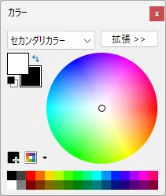
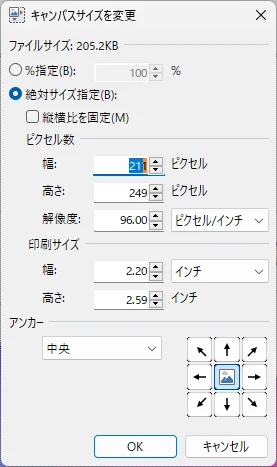

---

title: 'paint.net에서 이미지에 테두리를 추가하는 간단한 방법 및 절차'
slug: "paint.netを使って画像に枠線をつける方法"
date: 2023-04-11T14:31:59+09:00
tags: ["paint.net", "테두리", "이미지"]
draft: false
image: "img_3.webp"
categories: ["AI・테크놀로지"]
description: '이미지 편집 소프트웨어 paint.net을 사용하여 이미지에 테두리를 추가하는 방법을 설명합니다. 보조 색상을 통한 색상 지정 및 캔버스 크기 변경을 활용한 테두리 생성 절차를 초보자용으로 소개합니다. 블로그나 자료 작성 시 이미지를 장식하고 싶을 때 바로 활용할 수 있는 편리한 기술입니다.'
---

paint.net을 사용하여 이미지에 테두리를 넣는 방법을 소개합니다.

## 절차

#### 1. 테두리를 넣을 이미지를 paint.net으로 엽니다
#### 2. 보조 색상을 설정합니다 (이것이 테두리 색상이 됩니다)

색상 팔레트가 표시되지 않는 경우, 키보드의 `F8` 키를 누르세요.

검은색으로 설정하려면 을 클릭하세요.

#### 3. 메뉴＞이미지＞캔버스 크기 변경을 선택

너비와 높이를 각각 2픽셀씩 늘립니다. 2픽셀을 늘리면 테두리가 1픽셀이 됩니다.
테두리를 5픽셀로 설정하고 싶은 경우, 너비와 높이를 각각 10픽셀씩 늘립니다.

앵커는 '가운데'를 선택하고, OK를 클릭합니다.

#### 4. 이미지에 테두리가 추가되면, 이미지를 저장합니다.

이상.
