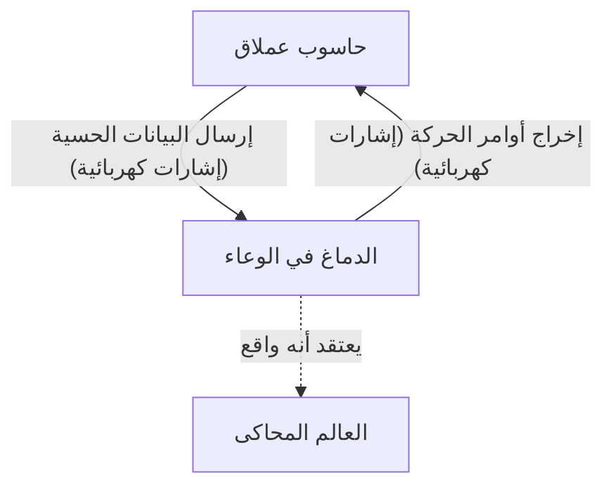
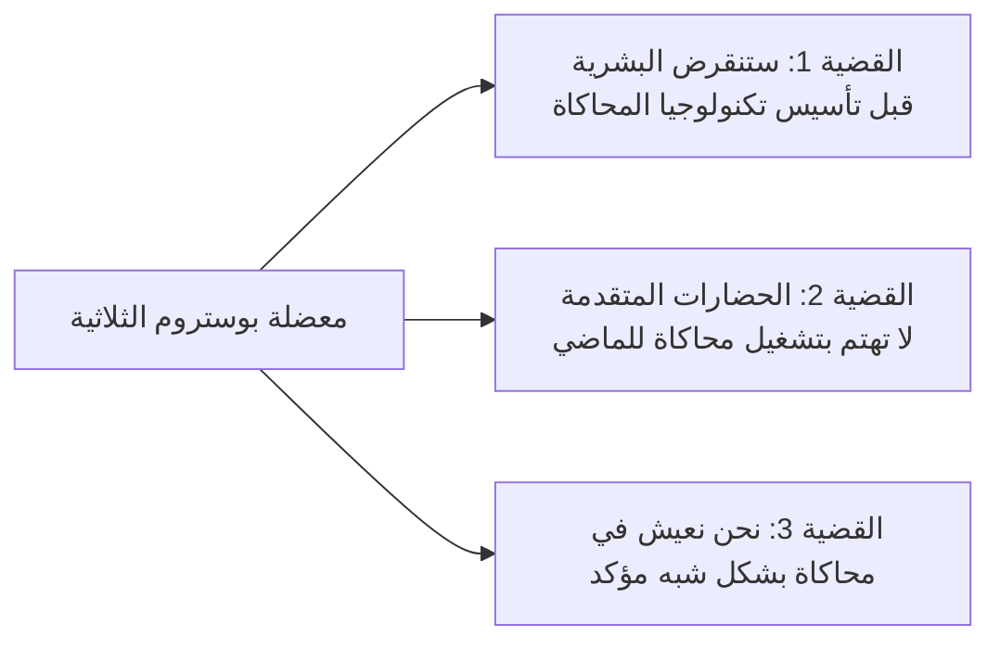

## مقدمة: ما هو الواقع؟

الواقع الذي نتقبله كأمر مسلم به كل يوم. نستيقظ في الصباح ونشم رائحة القهوة، ونكتب على لوحة المفاتيح للعمل، وفي الليل ننام بينما نشعر بنعومة السرير. ولكن ماذا لو كان هذا "الواقع" عبارة عن واقع افتراضي (محاكاة) متقن الصنع؟

هذا السؤال هو لغز نهائي أسر عقول البشر، بدءًا من الفيلسوف اليوناني القديم أفلاطون، وصولاً إلى علماء فيزياء الكم والذكاء الاصطناعي في العصر الحديث. في هذه المقالة، سنستكشف بأعمق ما يمكن وبطرق متعددة التجربة الفكرية الفلسفية "الدماغ في وعاء" (Brain in a vat) و "فرضية المحاكاة" (Simulation hypothesis) بناءً على العلم الحديث ونظرية المعلومات.

---

## الفصل الأول: صدمة التجربة الفكرية "الدماغ في وعاء"

"الدماغ في وعاء" (Brain in a vat) هي تجربة فكرية اقترحها الفيلسوف هيلاري بوتنام (Hilary Putnam) في عام 1981. ومع ذلك، فإن السؤال الأساسي المتمثل في "إلى أي مدى يمكننا الوثوق في إدراكنا؟" يمكن إرجاعه إلى نقاش رينيه ديكارت في القرن السابع عشر حول "الشيطان الماكر" (أو الإله المخادع).

### 1-1. ما هو الدماغ في وعاء؟

تخيل هذا.
في يوم من الأيام، قام عالم شرير ولكن عبقري باستخراج دماغك من جمجمتك دون أن يصاب بأذى. تم وضع هذا الدماغ في سائل استزراع خاص (وعاء) للحفاظ على حياته. علاوة على ذلك، تم توصيل عدد لا يحصى من الأقطاب الكهربائية بالخلايا العصبية في الدماغ، وتم توصيله بحاسوب عملاق ضخم وعالي الأداء.

يقوم هذا الحاسوب بمحاكاة جميع المدخلات الحسية (الإشارات الكهربائية) مثل البصر، والسمع، واللمس، والتذوق، والشم، وإرسالها إلى دماغك بشكل مثالي. المعلومات البصرية بأنك "تقرأ هذا المقال الآن" والشعور باللمس بأنك "تجلس على كرسي"، كلها مجرد إشارات كهربائية يحسبها الحاسوب ويرسلها إلى دماغك.

الآن، إليك السؤال.
**"هل يمكنك إثبات أنك لست 'دماغًا في وعاء' الآن؟"**

### 1-2. الشكوكية المعرفية

ما يجعل هذه التجربة الفكرية مرعبة هو أنها تهز أسس معرفتنا التجريبية. نحن عادة ما نكون متأكدين من وجود الأشياء لأننا "نراها بأعيننا" أو "يمكننا لمسها". ومع ذلك، في سيناريو "الدماغ في وعاء"، نظرًا لأن جميع البيانات الحسية مزيفة تمامًا، فإنه من المستحيل مبدئيًا الوصول إلى الواقع الحقيقي من خلال الملاحظة الداخلية (التجربة الحسية) وحدها.

يُطلق على هذا في المصطلحات الفلسفية "الشكوكية المعرفية" (Epistemological Skepticism). خلص ديكارت إلى أنه على الأقل وجود وعي "الأنا" الذي يشك هو أمر مؤكد، من خلال مقولته الشهيرة "أنا أفكر، إذن أنا موجود" (Cogito, ergo sum). ومع ذلك، فإن المكان الذي توجد فيه "الأنا"، سواء كان جسدًا ماديًا على الأرض أو دماغًا يطفو في سائل، يظل غير قابل للمعرفة.

---

## الفصل الثاني: انبعاث "فرضية المحاكاة" في العصر الحديث

كانت "الدماغ في وعاء" مجرد تجربة فكرية فلسفية. ولكن مع دخولنا القرن الحادي والعشرين والانفجار في تكنولوجيا المعلومات وعلوم الحاسوب، أصبح هذا السؤال يُطرح كـ "فرضية المحاكاة" في سياق أكثر واقعية وعلمية.

### 2-1. معضلة نيك بوستروم الثلاثية

في عام 2003، نشر الفيلسوف في جامعة أكسفورد نيك بوستروم (Nick Bostrom) ورقة بحثية صادمة بعنوان "هل تعيش في محاكاة حاسوبية؟". باستخدام الاستدلال المنطقي، جادل بأن **واحدة على الأقل من القضايا الثلاث (المعضلة الثلاثية) التالية يجب أن تكون صحيحة**.

**【القضية 1: نظرية انقراض البشرية】**
هذا هو الاحتمال بأن البشرية ستنقرض بسبب حرب نووية، أو تغير مناخي، أو خروج الذكاء الاصطناعي عن السيطرة، أو كارثة كونية غير معروفة قبل الوصول إلى مرحلة "ما بعد الإنسان" (Post-human) القادرة على تنفيذ عمليات محاكاة على مستوى كوني (محاكاة الأسلاف) أو التفرد التكنولوجي (Singularity).

**【القضية 2: نظرية اللامبالاة】**
حتى لو لم تنقرض البشرية ووصلت إلى مرحلة ما بعد الإنسان واكتسبت قوة حاسوبية شبه لا نهائية، فهناك احتمال ألا يقوموا بتشغيل محاكاة لكائنات واعية (نحن) لأسباب أخلاقية أو ببساطة لعدم الاهتمام.

**【القضية 3: نظرية المحاكاة】**
إذا كانت القضية 1 والقضية 2 كلاهما "خاطئة"، فإن الحضارات المتقدمة ستقوم بتشغيل عدد لا يحصى من "محاكاة الأسلاف". لا يوجد سوى كون حقيقي واحد (الواقع الأساسي - Base Reality)، ولكن يمكن أن يكون هناك ملايين أو مليارات من الأكوان المحاكاة. لذلك، من الناحية الإحصائية، فإن احتمال أن نكون نحن الذين نمتلك وعيًا في هذه اللحظة "السكان الوحيدين في الواقع الأساسي" يقترب من الصفر، ومن المؤكد تقريبًا أننا "سكان في واحدة من مئات الملايين من عمليات المحاكاة".

### 2-2. النهج من الفيزياء: هل الكون حاسوب؟

لا تقتصر فرضية المحاكاة على مجرد نظرية الاحتمالات. يمكن تفسير بعض الظواهر المحيرة في الفيزياء الحديثة بشكل جيد إذا افترضنا أن "الكون يُعالج كمعلومات".

1.  **طول بلانك وبكسلة الكون**
    يوجد في الفيزياء وحدة للطول الأدنى ذي المعنى تسمى "طول بلانك" (حوالي $1.6 \times 10^{-35}$ متر). يشير هذا إلى احتمال أن فضاء الكون ليس متصلاً بل له بنية منفصلة تشبه "البكسلات" على شاشة الحاسوب.
2.  **حد سرعة الضوء**
    لماذا يوجد حد أقصى (حوالي 300,000 كم/ثانية) لسرعة الضوء (سرعة نقل المعلومات في الزمكان)؟ من منظور فرضية المحاكاة، يمكن تفسير ذلك على أنه "سرعة ساعة المعالج (حد المعالجة) للحاسوب الذي يقوم بحساب هذا الكون".
3.  **تجربة الشق المزدوج ومشكلة الملاحظة في ميكانيكا الكم**
    في تجربة الشق المزدوج الشهيرة في ميكانيكا الكم، توجد الإلكترونات والفوتونات في حالة احتمالية مثل الموجة "عندما لا تتم ملاحظتها"، ويتم تحديد موقعها كجسيم "في لحظة ملاحظتها". هذا يشبه إلى حد كبير "تحسين التصيير" (Rendering optimization) في ألعاب الفيديو. حيث لا يتم تصيير المناظر التي لا ينظر إليها اللاعب (المراقب) لتوفير موارد الحوسبة، ويتم رسمها بالتفصيل فقط عندما تدخل في مجال الرؤية؛ إنه نظام مشابه بشكل لافت للنظر.

---

## الفصل الثالث: دقة المحاكاة وإمكانية "الهروب"

إذا كنا داخل محاكاة، فما هي درجة "الدقة" (Resolution) التي تم إنشاؤها بها؟

### 3-1. المحاكاة الكلية والمحاكاة الجزئية

هناك مستويات مختلفة ممكنة للمحاكاة.

*   **محاكاة الكون بأكمله**: الحالة التي يتم فيها حساب الكون بأسره بالكامل، من مستوى الجسيمات الأولية إلى مستوى المجرة. يتطلب هذا قدرة حاسوبية تفوق الخيال (مثل حاسوب بحجم كوكب مثل دماغ ماتريوشكا - Matrioshka brain)، لكنه ليس مستحيلاً من الناحية النظرية.
*   **محاكاة محلية**: الحالة التي يتم فيها حساب الأرض والمناطق المحيطة بها فقط بدقة عالية، ويتم معالجة المجرات البعيدة كـ "نسيج خلفية منخفض الدقة". بالنظر إلى أن البشرية لم تصل بعد إلى خارج النظام الشمسي، فقد يكون هذا كافيًا.
*   **محاكاة الوعي الفردي (الدماغ في وعاء)**: الحالة التي لا يتم فيها محاكاة العالم نفسه، بل يتم إرسال المعلومات فقط إلى وعي فرد واحد وهو "أنت". من الممكن أن يكون الأشخاص من حولك في الواقع شخصيات غير قابلة للعب (NPC) بدون جوهر (وعي)، أي "زومبي فلسفي" (Solipsism - الأنانية الفلسفية).

### 3-2. البحث عن "أخطاء" في المحاكاة

بافتراض أننا نعيش في واقع افتراضي، هل هناك طريقة لإثبات ذلك من الداخل؟
يقترح العلماء بجدية تجارب للبحث عن "أخطاء" (Bugs) أو "خلل" (Glitches) في برنامج الكون.

على سبيل المثال، من خلال المراقبة عالية الدقة للأشعة الكونية، قد نكتشف تباينًا يشير إلى وجود "شبكة" (Grid) مكانية. أو، إذا تم تأكيد أن الثوابت الفيزيائية (مثل ثابت البنية الدقيقة) تتغير قليلاً بمرور الوقت، فقد يكون ذلك بسبب "تحديثات" (Updates) للمحاكاة أو تراكم "أخطاء التقريب" (Rounding errors).

هناك أيضًا مناهج خيال علمي تشرح أشياء مثل "ديجا فو" (Deja vu - وهم سبق الرؤية) أو "تأثير مانديلا" (ظاهرة حيث يشارك الجمهور ذكريات تختلف عن الواقع) أو الظواهر الخارقة على أنها أخطاء في المحاكاة، لكن هذه لم تصل إلى مستوى الإثبات العلمي.

---

## الفصل الرابع: ماذا لو كنا سكان محاكاة؟ (التأثيرات الفلسفية والأخلاقية)

إذا كانت فرضية المحاكاة صحيحة، فكيف سيتغير معنى حياتنا وأخلاقنا؟

### 4-1. التحرر من العدمية

عندما يعلم الناس أن "كل شيء هو واقع افتراضي مصطنع"، فقد يقع الكثيرون في العدمية (Nihilism) معتقدين "إذن، لا معنى لأي شيء نفعله". ولكن هل هذا صحيح حقًا؟

اختار شخصية "سايفر" في فيلم "ماتريكس" (The Matrix) العودة إلى المحاكاة للاستمتاع بطعم شريحة لحم، رغم علمه بأنها واقع افتراضي. التجارب الذاتية (Qualia - الكواليا) التي نشعر بها مثل "الفرح" و"الحزن" و"الحب" و"الألم"، سواء كان العالم ماديًا أم معلوماتيًا، هي **واقع لا شك فيه** بالنسبة لنا.

مجرد وجودنا داخل محاكاة لا يقلل من قيمة مشاعرنا وتجاربنا. إذا كان العالم مبنيًا من خلال المعلومات، فيمكننا أيضًا أن نعتبر أن وعينا وأفعالنا بحد ذاتها تشكل جزءًا من برنامج الكون العظيم، ولها قيمتها الفريدة.

### 4-2. وجود المحاكي (الخالق)

يمكن اعتبار فرضية المحاكاة، بمعنى ما، "دليلًا على وجود الإله" في العصر الحديث. هذا يعني أن هناك كائنًا أعلى (مبرمجًا) قام ببرمجة هذا الكون وتشغيله.

ما هو هدفهم من تشغيل هذا العالم؟
*   التحقق من التاريخ؟
*   تجربة اجتماعية؟
*   أم مجرد ترفيه (لعبة فيديو)؟

إذا قمنا بتطوير ذكاء اصطناعي داخل المحاكاة، وقام ذلك الذكاء الاصطناعي بإنشاء محاكاة أخرى، فسيؤدي ذلك إلى "بنية محاكاة متعددة الطبقات" (Nested structure). هل نحن في الطبقة الدنيا، أم في طبقة متوسطة؟

---

## الخاتمة: "الواقع" في العيش مع لغز دون حل

"الدماغ في وعاء" و "فرضية المحاكاة" هي حاليًا "فرضيات غير قابلة للدحض" لا يمكن إثباتها أو نفيها. مع تقدم العلوم والتكنولوجيا، وتعمقنا في النظر إلى هاوية الكون، يبدأ هذا العالم في إظهار وجه معلوماتي وغامض أكثر فأكثر.

هل سيأتي يوم نصل فيه إلى الحقيقة؟ ربما فقط عندما نصبح نحن من يدير المحاكاة - عندما نكمل الذكاء الاصطناعي العام (AGI) ونخلق كائنات واعية داخل عالم افتراضي - سنتمكن أخيرًا من لمس حقيقة هذا العالم.

حتى ذلك الحين، سواء كان هذا العالم هو الواقع الأساسي أو محاكاة فائقة التقدم، فإن الاستمتاع برائحة فنجان قهوة أمامنا هو ربما الطريقة الأكثر حكمة لمواجهة "الواقع".
