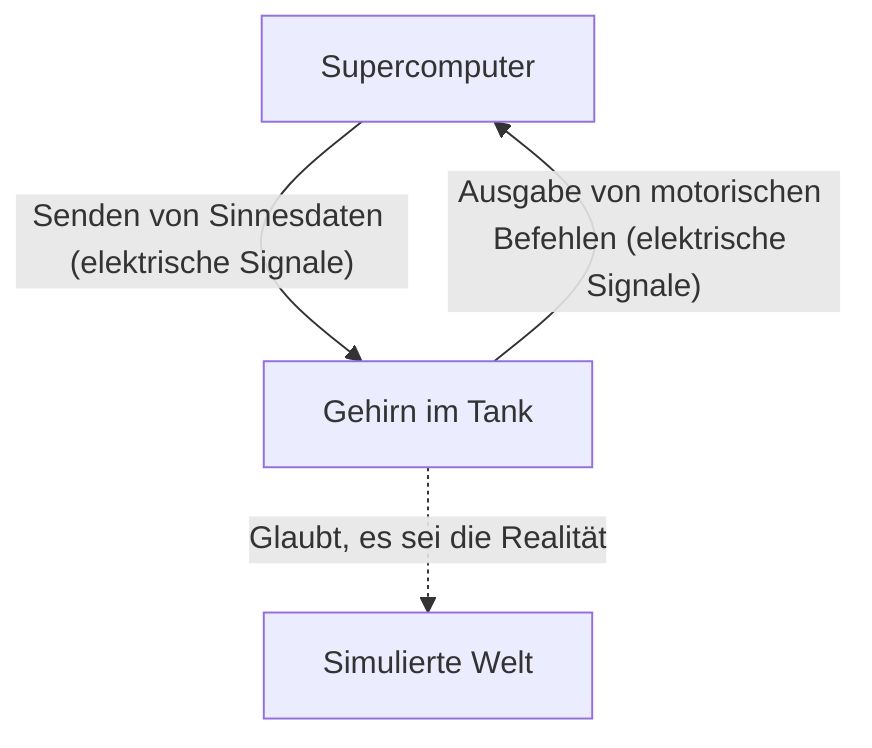
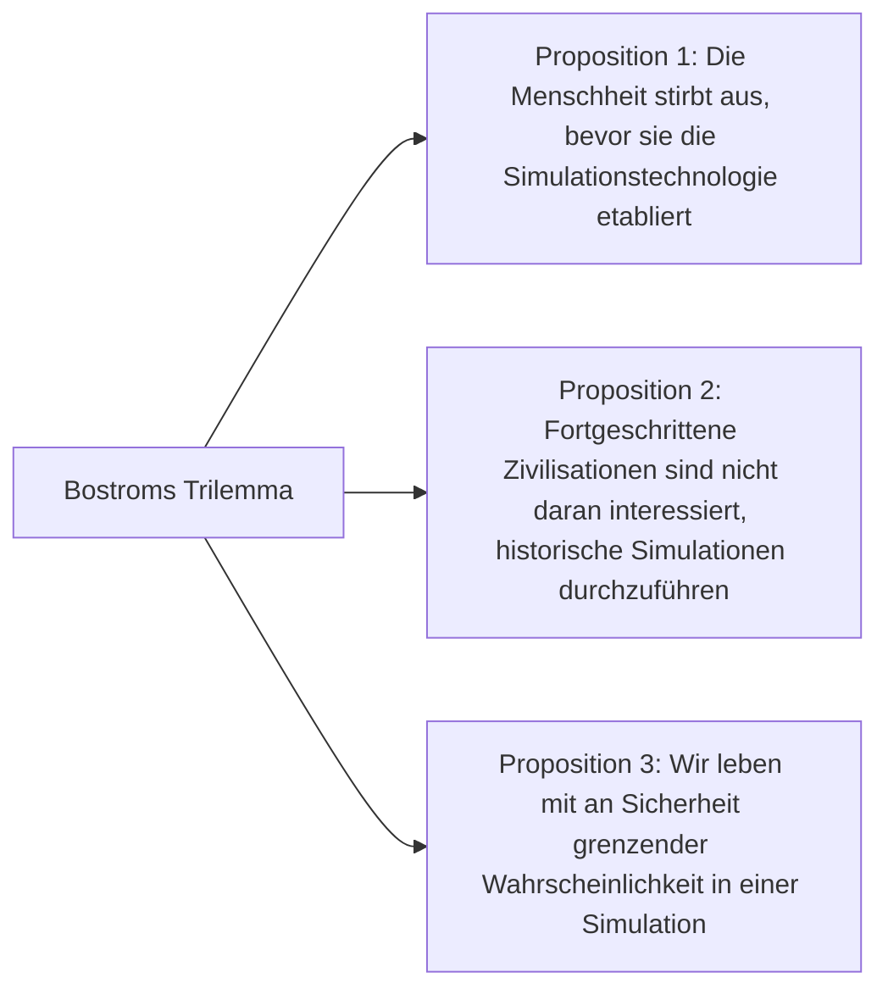

## Einleitung: Was ist die Realität?

Die "Realität", die wir jeden Tag als selbstverständlich hinnehmen. Wir wachen morgens auf, riechen das Aroma von Kaffee, tippen auf der Tastatur für die Arbeit und schlafen nachts mit dem Gefühl der Weichheit unseres Bettes ein. Aber was wäre, wenn diese "Realität" eine aufwendig konstruierte virtuelle Realität (Simulation) wäre?

Diese Frage ist ein ultimatives Rätsel, das den menschlichen Intellekt seit den antiken griechischen Philosophen wie Platon bis hin zu modernen Quantenphysikern und KI-Forschern fasziniert. In diesem Artikel werden wir das philosophische Gedankenexperiment "Gehirn im Tank" (Brain in a vat) und die "Simulationshypothese" (Simulation hypothesis), die auf der modernen Wissenschaft und Informationstheorie basiert, so tiefgreifend und vielschichtig wie möglich untersuchen.

---

## Kapitel 1: Der Schock des Gedankenexperiments "Gehirn im Tank"

"Gehirn im Tank" (Brain in a vat) ist ein Gedankenexperiment, das 1981 vom Philosophen Hilary Putnam vorgeschlagen wurde. Die zugrundeliegende Frage, "Wie weit können wir unserer Wahrnehmung trauen?", lässt sich jedoch bis zur Diskussion über den "bösen Dämon" (genium malignum) von René Descartes im 17. Jahrhundert zurückverfolgen.

### 1-1. Was ist das Gehirn im Tank?

Stellen Sie sich vor:
Eines Tages entfernt ein böser, aber genialer Wissenschaftler Ihr Gehirn unversehrt aus Ihrem Schädel. Dieses Gehirn wird in einer speziellen Nährflüssigkeit (Tank) am Leben erhalten. Darüber hinaus sind unzählige Elektroden an die Nervenzellen des Gehirns angeschlossen, die mit einem riesigen Hochleistungs-Supercomputer verbunden sind.

Dieser Computer simuliert perfekt alle sensorischen Eingaben (elektrische Signale) wie Sehen, Hören, Tasten, Schmecken und Riechen und sendet sie an Ihr Gehirn. Die visuelle Information, dass Sie gerade "diesen Artikel lesen", und das taktile Gefühl, "auf einem Stuhl zu sitzen", sind nichts weiter als elektrische Signale, die vom Computer berechnet und in Ihr Gehirn eingespeist werden.

Hier ist nun die Frage:
**"Können Sie beweisen, dass Sie jetzt kein 'Gehirn im Tank' sind?"**

### 1-2. Epistemologischer Skeptizismus

Was an diesem Gedankenexperiment erschreckend ist, ist die Tatsache, dass es die Grundlagen unseres empirischen Wissens erschüttert. Normalerweise sind wir von der Existenz der Dinge überzeugt, weil wir sie "mit unseren eigenen Augen sehen" oder "berühren können". Im Szenario des "Gehirns im Tank" sind jedoch alle sensorischen Daten perfekt gefälscht, so dass es prinzipiell unmöglich ist, die wahre Realität allein durch interne Beobachtung (Sinneserfahrung) zu erreichen.

In der Philosophie nennt man dies "epistemologischen Skeptizismus" (Epistemological Skepticism). Descartes kam mit "Ich denke, also bin ich" (Cogito, ergo sum) zu dem Schluss, dass zumindest die Existenz des zweifelnden "Ich"-Bewusstseins sicher ist. Ob jedoch der Ort, an dem das "Ich" existiert, ein physischer Körper auf der Erde oder ein Gehirn in einer Nährflüssigkeit ist, bleibt völlig unerkennbar.

---

## Kapitel 2: Die "Simulationshypothese" in der Moderne

Das "Gehirn im Tank" war nur ein philosophisches Gedankenexperiment. Mit der explosiven Entwicklung von Informationstechnologie und Informatik im 21. Jahrhundert wird diese Frage jedoch als "Simulationshypothese" in einem realistischeren und wissenschaftlicheren Kontext diskutiert.

### 2-1. Nick Bostroms Trilemma

Im Jahr 2003 veröffentlichte Nick Bostrom, ein Philosoph an der Universität Oxford, ein schockierendes Papier mit dem Titel "Are you living in a computer simulation?". Er nutzte logische Schlussfolgerungen, um zu behaupten, dass die folgenden drei Aussagen (Trilemma) so beschaffen sind, dass **mindestens eine davon zwingend wahr ist**.

**【Proposition 1: Aussterbe-Hypothese】**
Die Möglichkeit, dass die Menschheit durch einen Atomkrieg, den Klimawandel, eine außer Kontrolle geratene KI oder eine unbekannte kosmische Katastrophe ausstirbt, bevor sie eine technologische Singularität oder ein "posthumanes" Stadium erreicht, das in der Lage ist, Simulationen im kosmischen Maßstab (Ahnen-Simulationen) durchzuführen.

**【Proposition 2: Gleichgültigkeits-Hypothese】**
Die Möglichkeit, dass die Menschheit das posthumane Stadium erreicht und nahezu unbegrenzte Rechenkapazitäten erlangt, ohne auszusterben, sich jedoch weigert, Simulationen von bewussten Wesen (wie uns) aus ethischen Gründen oder einfach aus mangelndem Interesse durchzuführen.

**【Proposition 3: Simulations-Hypothese】**
Wenn sowohl Proposition 1 als auch Proposition 2 "falsch" sind, würde eine hochentwickelte Zivilisation unzählige "Ahnen-Simulationen" durchführen. Es gibt nur ein echtes Universum (Basisrealität), aber es könnte Millionen oder Milliarden von simulierten Universen geben. Statistisch gesehen liegt die Wahrscheinlichkeit, dass wir, die wir in diesem Moment Bewusstsein haben, "die einzigen Bewohner der Basisrealität" sind, also nahe Null; wir sind fast mit Sicherheit "Bewohner einer der Hunderte Millionen Simulationen".

### 2-2. Der physikalische Ansatz: Ist das Universum ein Computer?

Die Simulationshypothese geht über die bloße Wahrscheinlichkeitstheorie hinaus. Einige der rätselhaftesten Phänomene in der modernen Physik lassen sich gut erklären, wenn man annimmt, dass "das Universum als Information verarbeitet wird".

1.  **Die Planck-Länge und die Verpixelung des Universums**
    In der Physik gibt es eine kleinste sinnvolle Längeneinheit, die "Planck-Länge" (etwa $1.6 \times 10^{-35}$ Meter). Dies deutet darauf hin, dass der Raum des Universums nicht kontinuierlich ist, sondern eine diskrete Struktur aufweist, ähnlich den "Pixeln" auf einem Computermonitor.
2.  **Das Limit der Lichtgeschwindigkeit**
    Warum gibt es eine Obergrenze für die Lichtgeschwindigkeit (die Geschwindigkeit der Informationsübertragung in Raum und Zeit) von etwa 300.000 km/s? Aus Sicht der Simulationshypothese kann dies als "die Taktrate (Verarbeitungslimit) des Prozessors des Computers, der dieses Universum berechnet" interpretiert werden.
3.  **Das Doppelspaltexperiment und das Messproblem der Quantenmechanik**
    Beim berühmten Doppelspaltexperiment der Quantenmechanik existieren Elektronen oder Photonen in einem wahrscheinlichkeitsbasierten Zustand wie Wellen, wenn sie "nicht beobachtet" werden, und ihre Position als Teilchen ist erst in dem "Moment der Beobachtung" bestimmt. Dies ist der "Rendering-Optimierung" in Videospielen sehr ähnlich. Landschaft, auf die der Spieler (Beobachter) nicht schaut, wird nicht gerendert, um Rechenressourcen zu sparen; das System verhält sich sehr ähnlich wie eines, das Details genau in dem Moment zeichnet, in dem sie in das Sichtfeld geraten.

---

## Kapitel 3: Die Auflösung der Simulation und die Möglichkeit der "Flucht"

Wenn wir uns in einer Simulation befinden, mit welcher "Auflösung" ist sie dann konstruiert?

### 3-1. Makro-Simulation und Mikro-Simulation

Es sind verschiedene Ebenen der Simulation denkbar.

*   **Simulation des gesamten Universums**: Der Fall, in dem das gesamte Universum vom Elementarteilchen-Level bis zum galaktischen Level vollständig berechnet wird. Dies erfordert eine unvorstellbare Rechenkapazität (ein Computer von planetarer Größe wie ein Matroschka-Gehirn), ist aber theoretisch nicht unmöglich.
*   **Lokale Simulation**: Der Fall, in dem nur die Erde und ihre Umgebung hochauflösend berechnet werden und weit entfernte Galaxien als "niedrig aufgelöste Hintergrundtextur" behandelt werden. Angesichts der Tatsache, dass wir Menschen das Sonnensystem noch nicht verlassen haben, mag dies ausreichen.
*   **Simulation des individuellen Bewusstseins (Gehirn im Tank)**: Der Fall, in dem nicht die Welt an sich simuliert wird, sondern Informationen nur in das Bewusstsein von "Ihnen" als Einzelperson eingespeist werden. Es besteht die Möglichkeit, dass die Menschen um Sie herum in Wirklichkeit NPCs (Non-Player Characters) ohne inneren Gehalt (Bewusstsein) sind, also "philosophische Zombies" (Solipsismus).

### 3-2. Die Suche nach "Bugs" in der Simulation

Wenn wir in einer virtuellen Realität leben, gibt es dann eine Möglichkeit, dies von innen heraus zu beweisen?
Wissenschaftler schlagen ernsthafte Experimente vor, um nach "Bugs" oder "Glitches" (Fehlern) im Programm des Universums zu suchen.

Zum Beispiel könnte die hochpräzise Beobachtung von kosmischer Strahlung Anisotropien aufdecken, die auf die Existenz eines "Gitters" (Grid) im Raum hinweisen. Oder wenn sich physikalische Konstanten (wie die Feinstrukturkonstante) im Laufe der Zeit leicht ändern, könnte dies eine Anhäufung von "Updates" oder "Rundungsfehlern" in der Simulation sein.

Es gibt auch Science-Fiction-Ansätze, die Phänomene wie "Déjà-vu" oder den "Mandela-Effekt" (ein Phänomen, bei dem eine große Gruppe von Menschen falsche Erinnerungen teilt) oder paranormale Phänomene als Glitches in der Simulation erklären, aber diese haben keinen wissenschaftlichen Beweis erbracht.

---

## Kapitel 4: Was, wenn wir Bewohner einer Simulation sind? (Philosophische und ethische Auswirkungen)

Wenn die Simulationshypothese wahr ist, wie würden sich unser Lebenssinn und unsere Ethik verändern?

### 4-1. Abkehr vom Nihilismus

Wenn sie erfahren, dass "alles eine künstliche virtuelle Realität ist", könnten viele Menschen in den Nihilismus fallen und denken: "Dann ist alles sinnlos". Aber ist das wirklich so?

Cypher, eine Figur im Film "Matrix", entschied sich, in die Simulation zurückzukehren, um den Geschmack eines Steaks zu genießen, obwohl er wusste, dass es eine virtuelle Realität ist. Die subjektiven Erfahrungen (Qualia) von "Freude", "Trauer", "Liebe" und "Schmerz", die wir empfinden, sind für uns selbst eine **unbestreitbare Realität**, unabhängig davon, ob die Welt physisch oder informativ ist.

Die Tatsache, dass wir uns innerhalb einer Simulation befinden, mindert nicht den Wert unserer Emotionen oder Erfahrungen. Wenn die Welt durch Informationen aufgebaut ist, können wir unsere Bewusstseinszustände und Handlungen selbst als Teil des großartigen Programms namens Universum betrachten, die ihren ganz eigenen Wert haben.

### 4-2. Die Existenz des Simulators (Schöpfers)

Die Simulationshypothese kann in gewisser Weise als moderner "Gottesbeweis" bezeichnet werden. Das bedeutet, dass es eine höhere Entität (Programmierer) gibt, die dieses Universum programmiert hat und es ausführt.

Mit welchem Ziel lassen sie diese Welt laufen?
*   Überprüfung der Geschichte?
*   Soziologisches Experiment?
*   Oder einfach nur zur Unterhaltung (als Videospiel)?

Wenn wir eine KI in einer Simulation entwickeln und diese KI dann eine weitere Simulation erschafft, entsteht eine "mehrschichtige Struktur von Simulationen" (Verschachtelung). Befinden wir uns auf der untersten oder auf einer mittleren Ebene?

---

## Fazit: Die "Realität", mit ungelösten Geheimnissen zu leben

Das "Gehirn im Tank" und die "Simulationshypothese" sind derzeit "nicht falsifizierbare Hypothesen", die weder bewiesen noch widerlegt werden können. Je mehr die Wissenschaft und Technologie voranschreiten und wir in die Abgründe des Universums blicken, desto informativer und unbegreiflicher erscheint uns diese Welt.

Wird jemals der Tag kommen, an dem wir die Wahrheit erkennen? Vielleicht werden wir erst dann die Wahrheit dieser Welt begreifen können, wenn wir an der Reihe sind, eine Simulation durchzuführen – wenn wir die künstliche allgemeine Intelligenz (AGI) vollendet und bewusste Wesen in einer virtuellen Welt erschaffen haben.

Bis dahin ist es wohl der klügste Weg, mit der "Realität" umzugehen, das Aroma einer Tasse Kaffee vor uns zu genießen, ganz gleich, ob diese Welt die Basisrealität oder eine super-hochentwickelte Simulation ist.
