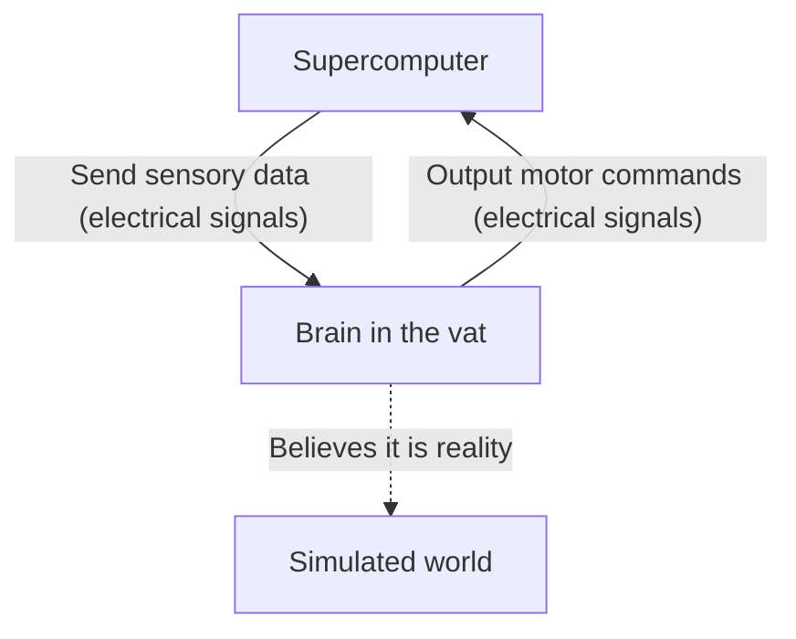
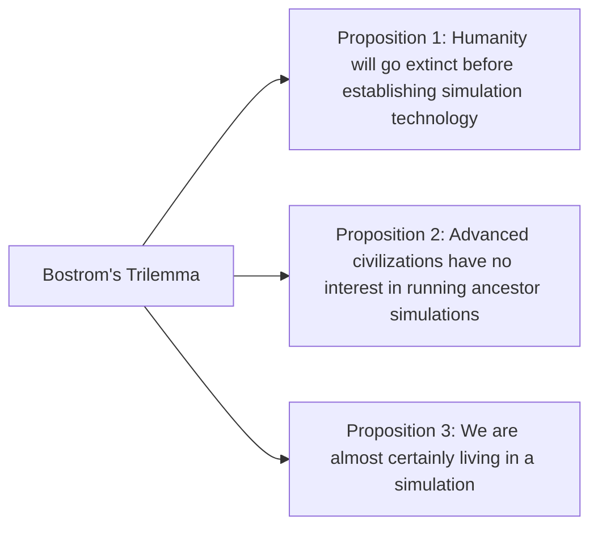

## Introduction: What is Reality?

The "reality" we take for granted every day. Waking up in the morning to the smell of coffee, typing on a keyboard for work, and falling asleep at night feeling the softness of a bed. But what if this "reality" was actually a meticulously crafted virtual reality (simulation)?

This question is an ultimate mystery that has fascinated human intellect, from the ancient Greek philosopher Plato to modern quantum physicists and AI researchers. In this article, we will explore the philosophical thought experiment of the "Brain in a Vat" and the "Simulation Hypothesis" based on modern science and information theory as deeply and multifacetedly as possible.

---

## Chapter 1: The Impact of the "Brain in a Vat" Thought Experiment

The "Brain in a Vat" is a thought experiment proposed by philosopher Hilary Putnam in 1981. However, the underlying question of "how far can we trust our perception?" can be traced back to the 17th-century debate of René Descartes' "evil demon (deceiving god)."

### 1-1. What is the Brain in a Vat?

Imagine this.
One day, an evil but genius scientist extracts your brain intact from your skull. The brain is placed in a special nutrient fluid (vat) and kept alive. Furthermore, countless electrodes are connected to the neurons of your brain, which in turn are hooked up to a massive, high-performance supercomputer.

This computer perfectly simulates and sends to your brain all sensory inputs (electrical signals) such as sight, hearing, touch, taste, and smell. The visual information of you "reading this article right now" and the tactile sensation of "sitting on a chair" are all just electrical signals calculated by the computer and fed into your brain.

Now, here is the question:
**"Can you prove right now that you are not a 'brain in a vat'?"**

### 1-2. Epistemological Skepticism

The terrifying aspect of this thought experiment is that it shakes the very foundation of our empirical knowledge. We usually are convinced of the existence of things because we "see them with our own eyes" or "can touch them." However, in the "Brain in a Vat" scenario, all sensory data is perfectly forged, meaning it is fundamentally impossible to access true reality solely through internal observation (sensory experience).

In philosophical terms, this is called "Epistemological Skepticism." Descartes concluded with "I think, therefore I am (Cogito, ergo sum)," stating that at the very least, the existence of the consciousness of the "I" who is doubting is certain. Yet, whether the place where "I" exist is a physical body on Earth or a brain floating in nutrient fluid remains unknowable.

---

## Chapter 2: The "Simulation Hypothesis" Resurrected in the Modern Era

The "Brain in a Vat" was strictly a philosophical thought experiment. However, entering the 21st century, with the explosive evolution of information technology and computer science, this question has come to be discussed in a more realistic and scientific context as the "Simulation Hypothesis."

### 2-1. Nick Bostrom's Trilemma

In 2003, Nick Bostrom, a philosopher at Oxford University, published a shocking paper titled, "Are You Living in a Computer Simulation?" Using logical reasoning, he argued that **at least one** of the following three propositions (a trilemma) must be true.

**[Proposition 1: Human Extinction]**
The possibility that before reaching a "post-human" stage capable of achieving the technological singularity or running universe-scale simulations (ancestor simulations), humanity will go extinct due to nuclear war, climate change, runaway AI, or an unknown cosmic disaster.

**[Proposition 2: Apathy]**
Even if humanity avoids extinction, reaches the post-human stage, and acquires near-infinite computational power, they might not run simulations of conscious beings (us) for ethical reasons or simply a lack of interest.

**[Proposition 3: Simulation]**
If both Proposition 1 and Proposition 2 are "false," an advanced civilization would run countless "ancestor simulations." While there is only one real universe (base reality), there could be millions or billions of simulated universes. Therefore, statistically speaking, the probability that we, who possess consciousness right now, are the "sole inhabitants of the base reality" is practically zero, meaning we are almost certainly "inhabitants of one of the hundreds of millions of simulations."

### 2-2. Approach from Physics: Is the Universe a Computer?

The simulation hypothesis goes beyond mere probability theory. Some baffling phenomena in modern physics can be neatly explained if we assume that "the universe is processed as information."

1.  **Planck Length and the Pixelation of the Universe**
    In physics, there is a unit of length called the "Planck length (about $1.6 \times 10^{-35}$ meters)," which is the smallest meaningful unit of length. This suggests that the space of the universe is not continuous but might have a discrete structure, much like the "pixels" on a computer display.
2.  **The Limit of the Speed of Light**
    Why is there an upper limit (about 300,000 km/s) to the speed of light (the speed of information transmission in spacetime)? From the perspective of the simulation hypothesis, this can be interpreted as "the clock speed (processing limit) of the computer's processor calculating this universe."
3.  **The Double-Slit Experiment and Quantum Mechanics' Measurement Problem**
    In the famous double-slit experiment of quantum mechanics, electrons or photons exist in a probabilistic state like waves when "not being observed," and their position is determined as particles the moment they are "observed." This is remarkably similar to "rendering optimization" in video games. A system where the scenery not seen by the player (observer) is not rendered to save computational resources, but is drawn in detail the moment it enters their field of vision.

---

## Chapter 3: Resolution of the Simulation and the Possibility of "Escape"

If we are indeed inside a simulation, at what level of "resolution" is it built?

### 3-1. Macro-simulation vs. Micro-simulation

Various levels of simulation are conceivable.

*   **Simulation of the Entire Universe**: A case where the entire universe is completely calculated from the subatomic particle level to the galactic level. This would require unimaginable computational power (a planetary-scale computer like a Matrioshka brain), but it is not theoretically impossible.
*   **Local Simulation**: A case where only the Earth and its surroundings are calculated at high resolution, while distant galaxies are processed as "low-resolution background textures." Considering that humanity has yet to reach outside the solar system, this might be sufficient.
*   **Simulation of Individual Consciousness (Brain in a Vat)**: A case where the world itself is not simulated, but information is solely fed into the consciousness of "you." It is possible that the people around you are actually NPCs (Non-Player Characters) with no inner substance (consciousness)—in other words, "philosophical zombies" (solipsism).

### 3-2. Looking for "Bugs" in the Simulation

If we assume we live in a virtual reality, is there a way to prove it from the inside?
Scientists are seriously proposing experiments to look for "bugs" or "glitches" in the universe's program.

For instance, by observing cosmic rays with high precision, an anisotropy indicating the presence of a spatial "grid" might be discovered. Alternatively, if physical constants (like the fine-structure constant) are confirmed to be changing slightly over time, it could be the accumulation of a simulation "update" or "rounding error."

There are also sci-fi approaches that explain "déjà vu," the "Mandela Effect" (a phenomenon where the masses share a memory different from reality), or paranormal phenomena as glitches in the simulation, but these have not led to scientific proof.

---

## Chapter 4: What if We Are Inhabitants of a Simulation? (Philosophical and Ethical Implications)

If the simulation hypothesis is true, how would the meaning of our lives and our ethical views change?

### 4-1. Breaking Away from Nihilism

Upon learning that "everything is a fabricated virtual reality," many might fall into nihilism, thinking, "then nothing I do matters." But is that really so?

The character Cypher in "The Matrix" chose to return to the simulation just to enjoy the taste of a steak, fully knowing it was a virtual reality. The subjective experiences (qualia) we feel—such as "joy," "sadness," "love," and "pain"—are, regardless of whether the world is physical or informational, an **indubitable reality** to ourselves.

Just because we are inside a simulation does not diminish the value of our emotions and experiences. If the world is constructed of information, we could consider that our very consciousness and actions are parts of the grand program called the universe, possessing their own unique value.

### 4-2. The Existence of a Simulator (Creator)

In a way, the simulation hypothesis could be seen as a modern "proof of the existence of God." It implies there is a higher being (programmer) who programmed and runs this universe.

For what purpose are they running this world?
*   To verify history?
*   A sociological experiment?
*   Or simply for entertainment (a video game)?

If we develop AI inside the simulation, and that AI goes on to create further simulations, a "nested structure of simulations" would emerge. Are we at the bottom layer, or somewhere in the middle?

---

## Conclusion: The "Reality" of Living with the Mystery

At present, the "Brain in a Vat" and the "Simulation Hypothesis" are "unfalsifiable hypotheses" that can neither be affirmed nor denied. As science and technology advance and we gaze deeper into the abyss of the universe, this world increasingly reveals an informational and enigmatic nature.

Will the day ever come when we reach the truth? Perhaps it is only when we become the ones running the simulation—when we perfect Artificial General Intelligence (AGI) and give rise to conscious beings in a virtual world—that we might finally touch the truth of this world.

Until then, whether this world is base reality or an ultra-advanced simulation, enjoying the smell of a cup of coffee right in front of us might be the wisest way to face "reality."
