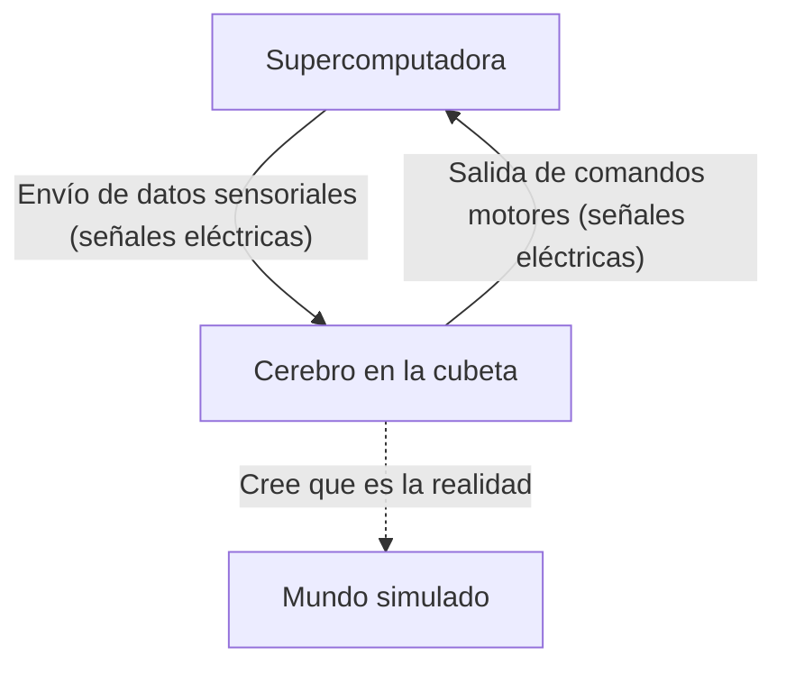
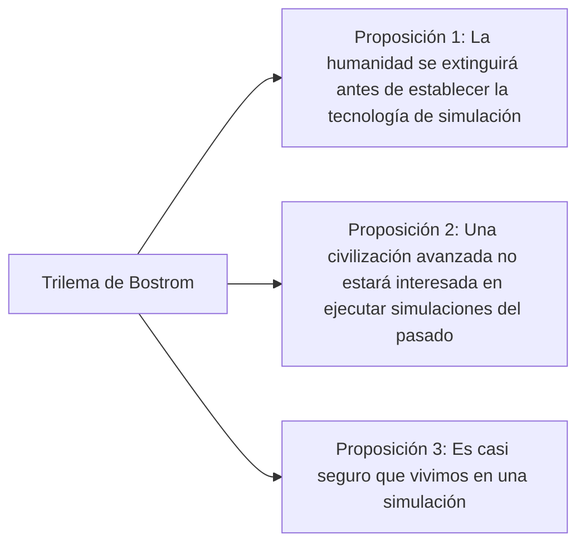

## Introducción: ¿Qué es la realidad?

La "realidad" que aceptamos naturalmente todos los días. Despertar por la mañana y oler el aroma del café, teclear para trabajar, y sentir la suavidad de la cama antes de dormir por la noche. Pero, ¿qué pasaría si esta "realidad" fuera una realidad virtual (simulación) elaboradamente construida?

Esta pregunta es el misterio definitivo que ha fascinado el intelecto humano, desde el antiguo filósofo griego Platón hasta los físicos cuánticos e investigadores de inteligencia artificial contemporáneos. En este artículo, exploraremos de la manera más profunda y multifacética posible el experimento mental filosófico del "cerebro en una cubeta" (Brain in a vat) y la "hipótesis de la simulación" (Simulation hypothesis) basada en la ciencia moderna y la teoría de la información.

---

## Capítulo 1: El impacto del experimento mental "El cerebro en una cubeta"

"El cerebro en una cubeta" (Brain in a vat) es un experimento mental propuesto por el filósofo Hilary Putnam en 1981. Sin embargo, la pregunta subyacente de "hasta qué punto podemos confiar en nuestra percepción" se remonta al argumento del "genio maligno" (o dios engañador) de René Descartes en el siglo XVII.

### 1-1. ¿Qué es el cerebro en una cubeta?

Imagina esto.
Un día, un científico malvado pero genial extrajo tu cerebro de tu cráneo intacto. Ese cerebro se coloca en un líquido de cultivo especial (cubeta) para mantenerlo con vida. Además, innumerables electrodos se conectan a las neuronas del cerebro y se unen a una supercomputadora gigante de alto rendimiento.

Esta computadora envía a tu cerebro simulaciones perfectas de todas las entradas sensoriales (señales eléctricas) como la vista, el oído, el tacto, el gusto y el olfato. La información visual de "estar leyendo este artículo" ahora mismo, y la sensación táctil de "estar sentado en una silla", no son más que señales eléctricas calculadas y enviadas al cerebro por la computadora.

Ahora bien, aquí está el problema.
**"¿Puedes demostrar que no eres un 'cerebro en una cubeta' en este momento?"**

### 1-2. Escepticismo epistemológico

Lo aterrador de este experimento mental es que sacude los cimientos de nuestro conocimiento empírico. Normalmente estamos convencidos de la existencia de las cosas porque "las vemos con nuestros propios ojos" o "podemos tocarlas". Sin embargo, en el escenario del "cerebro en una cubeta", todos los datos sensoriales están perfectamente falsificados, por lo que es en principio imposible acceder a la verdadera realidad basándose únicamente en la observación interna (experiencia sensorial).

En términos filosóficos, esto se llama "Escepticismo epistemológico" (Epistemological Skepticism). Descartes concluyó que "pienso, luego existo" (Cogito, ergo sum), afirmando que al menos la existencia de la conciencia del "yo" que duda es segura. Pero si el lugar donde existe el "yo" es un cuerpo físico en la Tierra o un cerebro flotando en un líquido de cultivo, sigue siendo incognoscible.

---

## Capítulo 2: La "hipótesis de la simulación" renace en la era moderna

El "cerebro en una cubeta" era estrictamente un experimento mental filosófico. Sin embargo, al entrar en el siglo XXI, con la explosiva evolución de la tecnología de la información y la informática, esta pregunta ha comenzado a discutirse en un contexto más realista y científico como la "hipótesis de la simulación".

### 2-1. El trilema de Nick Bostrom

En 2003, el filósofo de la Universidad de Oxford, Nick Bostrom, publicó un impactante artículo titulado "¿Estás viviendo en una simulación informática?". Usando razonamiento lógico, argumentó que de las siguientes tres proposiciones (trilema), **al menos una debe ser cierta**.

**【Proposición 1: Teoría de la extinción humana】**
La posibilidad de que la humanidad se extinga debido a una guerra nuclear, el cambio climático, una inteligencia artificial fuera de control o un desastre cósmico desconocido, antes de alcanzar la etapa "post-humana" capaz de ejecutar una singularidad tecnológica o simulaciones a escala cósmica (simulaciones de ancestros).

**【Proposición 2: Teoría de la indiferencia】**
Incluso si la humanidad alcanza la etapa post-humana sin extinguirse y obtiene un poder de cómputo casi infinito, la posibilidad de que no ejecuten simulaciones de seres con conciencia (nosotros) por razones éticas o simple falta de interés.

**【Proposición 3: Teoría de la simulación】**
Si la Proposición 1 y la Proposición 2 son ambas "falsas", entonces una civilización avanzada ejecutará innumerables "simulaciones de ancestros". Aunque solo hay un universo real (realidad base), podría haber millones o miles de millones de universos simulados. Por lo tanto, pensando estadísticamente, la probabilidad de que nosotros, con conciencia en este mismo instante, seamos "los únicos habitantes de la realidad base" se acerca a cero, y es casi seguro que somos "habitantes de alguna de las cientos de millones de simulaciones".

### 2-2. Enfoque desde la física: ¿Es el universo una computadora?

La hipótesis de la simulación no se limita a la mera teoría de probabilidades. Algunos de los fenómenos más desconcertantes de la física moderna pueden explicarse muy bien si se asume que "el universo procesa información".

1.  **La longitud de Planck y la pixelación del universo**
    En física existe una unidad mínima de longitud con significado, la "longitud de Planck" (aproximadamente $1.6 \times 10^{-35}$ metros). Esto sugiere la posibilidad de que el espacio del universo no sea un continuo, sino que tenga una estructura discreta, como los "píxeles" de la pantalla de una computadora.
2.  **El límite de la velocidad de la luz**
    ¿Por qué hay un límite (alrededor de 300,000 km/s) para la velocidad de la luz (la velocidad de transmisión de información en el espacio-tiempo)? Desde la perspectiva de la hipótesis de la simulación, esto se puede interpretar como "la velocidad de reloj del procesador de la computadora que está calculando este universo (el límite de procesamiento)".
3.  **El experimento de la doble rendija y el problema de la medición cuántica**
    En el famoso experimento de la doble rendija en mecánica cuántica, los electrones y los fotones existen en un estado probabilístico como ondas cuando "no son observados", y su posición se determina como partículas en el "momento en que son observados". Esto se parece mucho a la "optimización del renderizado" en los videojuegos. Es muy similar al sistema donde los escenarios que el jugador (observador) no está mirando no se renderizan para ahorrar recursos computacionales, pero se dibujan en detalle en el momento en que entran en el campo de visión.

---

## Capítulo 3: La resolución de la simulación y la posibilidad de "escape"

Si estamos en una simulación, ¿con qué nivel de "resolución" está hecha?

### 3-1. Macro-simulación y Micro-simulación

Se pueden considerar varios niveles de simulación.

*   **Simulación de todo el universo**: El caso en el que se calcula completamente el universo entero, desde el nivel de las partículas elementales hasta el nivel de las galaxias. Esto requiere una capacidad de cálculo inimaginable (como el cerebro Matrioshka, una computadora de escala planetaria), pero teóricamente no es imposible.
*   **Simulación local**: El caso en el que solo la Tierra y sus alrededores se calculan en alta resolución, mientras que las galaxias distantes se procesan como "texturas de fondo de baja resolución". Teniendo en cuenta que la humanidad aún no ha llegado más allá del sistema solar, esto podría ser suficiente.
*   **Simulación de conciencia individual (cerebro en una cubeta)**: El caso en el que no se está simulando el mundo en sí, sino que la información se envía únicamente a la conciencia de una sola persona: "tú". Es posible que las personas que te rodean sean en realidad PNJ (personajes no jugadores) sin interior (conciencia), es decir, "zombis filosóficos" (solipsismo).

### 3-2. Buscando "errores" en la simulación

Si asumiéramos que vivimos en una realidad virtual, ¿hay alguna manera de demostrarlo desde adentro?
Los científicos proponen seriamente experimentos para buscar "errores" (bugs) o "fallos" (glitches) en el programa del universo.

Por ejemplo, al observar rayos cósmicos con alta precisión, se podría descubrir una anisotropía que indique la existencia de una "rejilla" (grid) en el espacio. O, si se confirma que las constantes físicas (como la constante de estructura fina) han cambiado ligeramente con el tiempo, podría ser una acumulación de "actualizaciones" de la simulación o "errores de redondeo".

También existen enfoques de ciencia ficción que explican fenómenos como el "déjà vu", el "efecto Mandela" (un fenómeno donde las masas comparten recuerdos que difieren de los hechos), o fenómenos paranormales como fallos de la simulación, pero estos no han llegado a pruebas científicas.

---

## Capítulo 4: ¿Y si somos habitantes de una simulación? (Implicaciones filosóficas y éticas)

Si la hipótesis de la simulación fuera cierta, ¿cómo cambiaría nuestro sentido de la vida y nuestros valores éticos?

### 4-1. Escapar del nihilismo

Al saber que "todo es una realidad virtual creada", muchas personas podrían caer en el nihilismo, pensando: "entonces, no importa lo que haga, no tiene sentido". Pero, ¿es eso realmente cierto?

En "The Matrix", el personaje Cypher elige regresar a la simulación para disfrutar del sabor de un bistec, sabiendo que es una realidad virtual. La experiencia subjetiva (qualia) de "alegría", "tristeza", "amor" o "dolor" que sentimos es, ya sea que el mundo sea físico o informativo, una **realidad indudable** para nosotros mismos.

Estar dentro de una simulación no disminuye el valor de nuestras emociones o experiencias. Si el mundo está construido de información, también podemos pensar que nuestra propia conciencia y acciones son parte del gran programa que es el universo, y tienen un valor único.

### 4-2. La existencia del simulador (el creador)

La hipótesis de la simulación se puede decir que es, en cierto sentido, una "prueba de la existencia de Dios" de hoy en día. Significaría que hay un ser superior (programador) que programó y está ejecutando este universo.

¿Con qué propósito están ejecutando este mundo?
*   ¿Verificación de la historia?
*   ¿Un experimento sociológico?
*   ¿O simplemente entretenimiento (un videojuego)?

Si desarrollamos inteligencia artificial dentro de la simulación, y esa IA crea aún más simulaciones, se producirá una "estructura múltiple de simulación (estructura anidada)". ¿Estamos en el nivel inferior, o en un nivel intermedio?

---

## Conclusión: La "realidad" de vivir con un misterio

El "cerebro en una cubeta" y la "hipótesis de la simulación" son actualmente "hipótesis irrefutables" que no se pueden confirmar ni negar. A medida que avanza la tecnología científica y miramos hacia el abismo del universo, este mundo comienza a mostrar una apariencia cada vez más informativa e incomprensible.

¿Llegará alguna vez el día en que alcancemos la verdad? Quizás, cuando pasemos al lado de los que ejecutan simulaciones, completando la Inteligencia Artificial General (AGI) y creando seres con conciencia dentro de mundos virtuales, sea la primera vez que podamos tocar la verdad de este mundo.

Hasta entonces, ya sea que este mundo sea la realidad base o una simulación súper avanzada, disfrutar del aroma de una taza de café frente a nosotros es probablemente la forma más sabia de enfrentar la "realidad".
