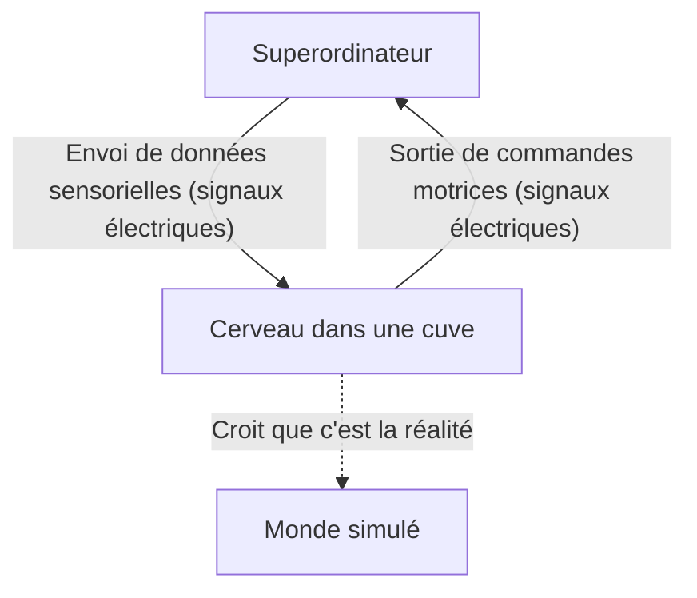
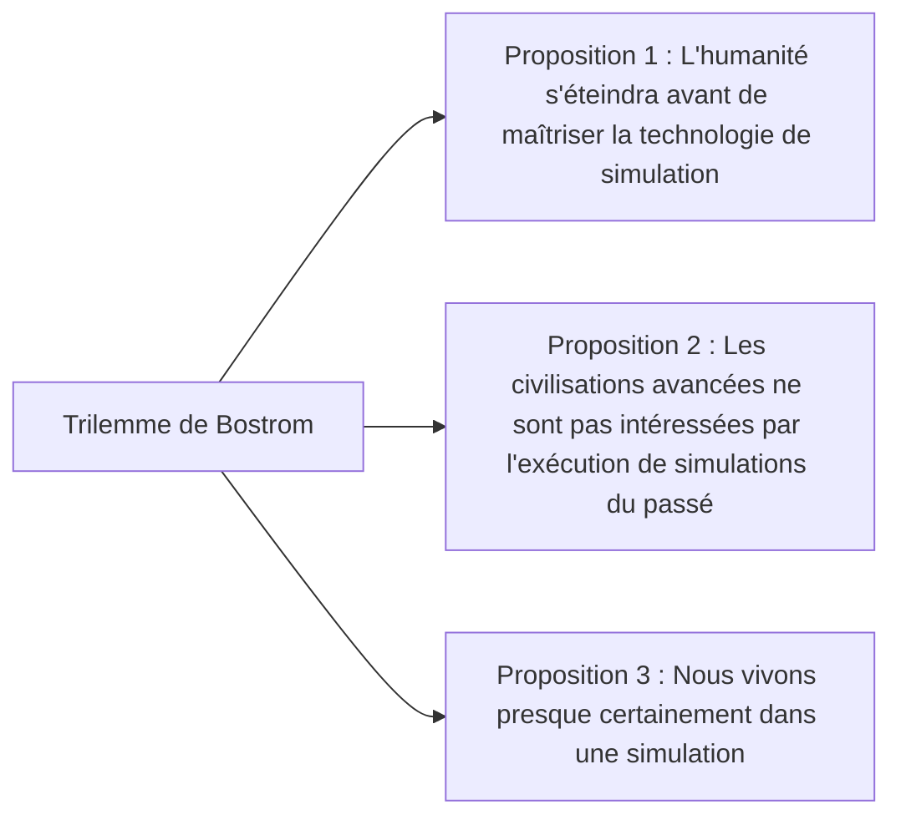

## Introduction : Qu'est-ce que la réalité ?

La « réalité » que nous acceptons comme une évidence tous les jours. Se réveiller le matin et sentir l'odeur du café, taper sur le clavier pour travailler, et s'endormir la nuit en sentant la douceur du lit. Mais que se passerait-il si cette « réalité » était une réalité virtuelle (simulation) élaborée avec soin ?

Cette question est le mystère ultime qui n'a cessé de fasciner l'intelligence humaine, de l'ancien philosophe grec Platon aux physiciens quantiques et chercheurs en IA modernes. Dans cet article, nous examinerons aussi profondément et sous autant d'angles que possible l'expérience de pensée philosophique du « cerveau dans une cuve » (Brain in a vat) et l'« hypothèse de la simulation » basée sur la science moderne et la théorie de l'information.

---

## Chapitre 1 : L'impact de l'expérience de pensée du « cerveau dans une cuve »

Le « cerveau dans une cuve » (Brain in a vat) est une expérience de pensée proposée par le philosophe Hilary Putnam en 1981. Cependant, la question sous-jacente de « jusqu'à quel point pouvons-nous faire confiance à notre perception ? » remonte à l'argument du « malin génie » (Dieu trompeur) de René Descartes au 17e siècle.

### 1-1. Qu'est-ce que le cerveau dans une cuve ?

Imaginez un peu.
Un jour, un scientifique maléfique mais génial extrait votre cerveau de votre crâne sans l'endommager. Ce cerveau est placé dans un liquide de culture spécial (une cuve) et maintenu en vie. De plus, d'innombrables électrodes sont connectées aux neurones de votre cerveau et reliées à un superordinateur géant et ultra-performant.

Cet ordinateur simule et transmet parfaitement à votre cerveau toutes les entrées sensorielles (signaux électriques) telles que la vue, l'ouïe, le toucher, le goût et l'odorat. L'information visuelle selon laquelle vous êtes en train de « lire cet article » ou la sensation tactile d'« être assis sur une chaise » ne sont que des signaux électriques calculés et envoyés à votre cerveau par l'ordinateur.

Maintenant, voici la question :
**« Pouvez-vous prouver en ce moment même que vous n'êtes pas un "cerveau dans une cuve" ? »**

### 1-2. Scepticisme épistémologique

Ce qui est terrifiant dans cette expérience de pensée, c'est qu'elle ébranle les fondements de nos connaissances empiriques. Habituellement, nous sommes convaincus de l'existence des choses parce que nous « les voyons de nos propres yeux » ou parce que nous « pouvons les toucher ». Cependant, dans le scénario du « cerveau dans une cuve », toutes les données sensorielles étant parfaitement falsifiées, il est en principe impossible d'accéder à la véritable réalité par la seule observation interne (expérience sensorielle).

C'est ce qu'on appelle en termes philosophiques le « scepticisme épistémologique » (Epistemological Skepticism). Descartes a conclu avec son « Je pense, donc je suis » (Cogito, ergo sum) qu'au moins l'existence de la conscience du « je » qui doute est certaine. Cependant, l'endroit où ce « je » existe, que ce soit un corps physique sur Terre ou un cerveau flottant dans un bouillon de culture, reste inconnaissable.

---

## Chapitre 2 : L'« hypothèse de la simulation » ravivée à l'époque moderne

Le « cerveau dans une cuve » n'était qu'une expérience de pensée philosophique. Cependant, avec l'entrée dans le 21e siècle et l'évolution explosive des technologies de l'information et de l'informatique, cette question est désormais abordée sous l'angle de l'« hypothèse de la simulation » dans un contexte plus réaliste et scientifique.

### 2-1. Le trilemme de Nick Bostrom

En 2003, le philosophe de l'université d'Oxford Nick Bostrom a publié un article percutant intitulé « Vivez-vous dans une simulation informatique ? ». En utilisant un raisonnement logique, il a affirmé qu'**au moins l'une des trois propositions suivantes (trilemme) doit être vraie**.

**[Proposition 1 : L'extinction de l'humanité]**
Il s'agit de la possibilité que l'humanité s'éteigne à cause d'une guerre nucléaire, du changement climatique, d'une IA hors de contrôle ou d'une catastrophe cosmique inconnue avant d'atteindre la singularité technologique ou le stade « post-humain » capable d'exécuter des simulations à l'échelle de l'univers (simulations d'ancêtres).

**[Proposition 2 : L'indifférence]**
Il s'agit de la possibilité que, même si l'humanité ne s'éteint pas et atteint le stade post-humain en acquérant une puissance de calcul quasi infinie, elle n'exécutera pas de simulations d'êtres conscients (comme nous) pour des raisons éthiques ou simplement par manque d'intérêt.

**[Proposition 3 : L'hypothèse de la simulation]**
Si les propositions 1 et 2 sont toutes deux « fausses », alors une civilisation avancée exécutera d'innombrables « simulations d'ancêtres ». Il n'y a qu'un seul univers réel (réalité de base), mais il pourrait y avoir des millions, voire des milliards d'univers simulés. Par conséquent, d'un point de vue statistique, la probabilité que nous, qui avons une conscience en ce moment même, soyons les « seuls habitants de la réalité de base » est proche de zéro, et nous sommes presque certainement les « habitants de l'une des centaines de millions de simulations ».

### 2-2. Approche de la physique : L'univers est-il un ordinateur ?

L'hypothèse de la simulation ne se limite pas à une simple théorie des probabilités. Certains phénomènes inexplicables de la physique moderne peuvent être bien expliqués si l'on suppose que « l'univers est traité comme de l'information ».

1.  **La longueur de Planck et la pixellisation de l'univers**
    En physique, il existe une unité de longueur minimale significative appelée « longueur de Planck » (environ $1.6 \times 10^{-35}$ mètres). Cela suggère que l'espace de l'univers n'est pas continu, mais a une structure discrète, à l'image des « pixels » d'un écran d'ordinateur.
2.  **La limite de la vitesse de la lumière**
    Pourquoi y a-t-il une limite supérieure à la vitesse de la lumière (la vitesse de transmission de l'information dans l'espace-temps) (environ 300 000 km/s) ? Du point de vue de l'hypothèse de la simulation, cela peut être interprété comme « la vitesse d'horloge du processeur (limite de traitement) de l'ordinateur qui calcule cet univers ».
3.  **L'expérience des fentes de Young et le problème de la mesure en mécanique quantique**
    Dans la célèbre expérience des fentes de Young en mécanique quantique, les électrons et les photons existent dans un état probabiliste semblable à une onde « lorsqu'ils ne sont pas observés », et leur position en tant que particule est fixée « au moment où ils sont observés ». Cela ressemble beaucoup à l'« optimisation du rendu » dans les jeux vidéo. Le paysage que le joueur (l'observateur) ne regarde pas n'est pas rendu pour économiser les ressources de calcul, ce qui est très similaire à un système où le paysage est dessiné en détail au moment où il entre dans le champ de vision.

---

## Chapitre 3 : La résolution de la simulation et la possibilité d'y « échapper »

Si nous étions dans une simulation, avec quel niveau de « résolution » serait-elle créée ?

### 3-1. Macro-simulation et micro-simulation

Différents niveaux de simulation peuvent être envisagés.

*   **Simulation de l'univers entier** : Le cas où l'univers entier est entièrement calculé, du niveau des particules élémentaires au niveau galactique. Cela nécessiterait une puissance de calcul inimaginable (comme un ordinateur à l'échelle planétaire de type cerveau matriochka), mais ce n'est pas théoriquement impossible.
*   **Simulation locale** : Le cas où seuls la Terre et ses environs sont calculés en haute résolution, et où les galaxies lointaines sont traitées comme des « textures d'arrière-plan en basse résolution ». Étant donné que l'humanité n'a pas encore atteint l'extérieur de notre système solaire, cela pourrait être suffisant.
*   **Simulation de la conscience individuelle (cerveau dans une cuve)** : Le cas où ce n'est pas le monde lui-même qui est simulé, mais où l'information est envoyée uniquement à votre conscience, à « vous ». Les personnes autour de vous pourraient en réalité être des PNJ (personnages non-joueurs) sans contenu (conscience), c'est-à-dire des « zombies philosophiques » (solipsisme).

### 3-2. À la recherche de « bugs » dans la simulation

En supposant que nous vivions dans une réalité virtuelle, y a-t-il un moyen de le prouver de l'intérieur ?
Les scientifiques proposent sérieusement des expériences pour rechercher des « bugs » ou des « glitches » (dysfonctionnements) dans le programme de l'univers.

Par exemple, en observant les rayons cosmiques avec une grande précision, il pourrait être possible de découvrir une anisotropie indiquant l'existence d'une « grille » de l'espace. Ou, s'il est confirmé que les constantes physiques (comme la constante de structure fine) changent légèrement au fil du temps, cela pourrait être le résultat d'une « mise à jour » de la simulation ou de l'accumulation d'« erreurs d'arrondi ».

Il existe également des approches de science-fiction qui expliquent le « déjà-vu », l'« effet Mandela » (le phénomène où les masses partagent des souvenirs différents des faits), ou encore les phénomènes paranormaux comme des glitches de la simulation, mais ceux-ci n'ont pas été scientifiquement prouvés.

---

## Chapitre 4 : Et si nous étions les habitants d'une simulation ? (Implications philosophiques et éthiques)

Si l'hypothèse de la simulation était vraie, comment le sens de notre vie et notre éthique changeraient-ils ?

### 4-1. S'échapper du nihilisme

En apprenant que « tout est une réalité virtuelle créée », beaucoup de gens pourraient tomber dans le nihilisme, pensant que « alors, quoi que je fasse, cela n'a aucun sens ». Mais est-ce vraiment le cas ?

Le personnage Cypher dans *Matrix*, tout en sachant qu'il s'agissait d'une réalité virtuelle, a choisi de retourner dans la simulation pour savourer le goût d'un steak. Nos expériences subjectives (qualia) telles que la « joie », la « tristesse », l'« amour » ou la « douleur » que nous ressentons, que le monde soit de nature physique ou informationnelle, sont une **réalité indéniable** pour nous-mêmes.

Le fait d'être à l'intérieur d'une simulation ne diminue en rien la valeur de nos émotions et de nos expériences. Si le monde est construit par l'information, on peut aussi considérer que notre conscience et nos actions elles-mêmes font partie d'un grand programme cosmique et possèdent une valeur unique.

### 4-2. L'existence du simulateur (Créateur)

L'hypothèse de la simulation peut être considérée, dans un sens, comme une « preuve de l'existence de Dieu » moderne. Cela signifie qu'il y a une entité supérieure (un programmeur) qui programme et exécute cet univers.

Dans quel but font-ils tourner ce monde ?
*   Vérification de l'histoire ?
*   Expérience sociologique ?
*   Ou simplement pour le divertissement (jeu vidéo) ?

Si nous développons une IA dans notre simulation, et que cette IA crée ensuite sa propre simulation, cela générerait une « structure multiple (structure imbriquée) de simulations ». Sommes-nous au niveau le plus bas, ou dans une couche intermédiaire ?

---

## Conclusion : La « réalité » de vivre avec le mystère

Le « cerveau dans une cuve » et l'« hypothèse de la simulation » sont actuellement des « hypothèses irréfutables » qui ne peuvent être ni confirmées ni infirmées. À mesure que la science et la technologie progressent et que nous scrutons les abysses de l'univers, ce monde commence à révéler un aspect de plus en plus informationnel et mystérieux.

Viendra-t-il un jour où nous atteindrons la vérité ? Peut-être que ce n'est que lorsque nous passerons du côté de ceux qui exécutent des simulations — lorsque nous aurons achevé l'Intelligence Artificielle Générale (IAG) et créé des êtres conscients dans des mondes virtuels — que nous pourrons enfin toucher à la vérité de ce monde.

D'ici là, que ce monde soit la réalité de base ou une simulation ultra-avancée, vivre en savourant l'arôme de la tasse de café qui se trouve devant soi n'est-il pas la façon la plus sage d'affronter la « réalité » ?
