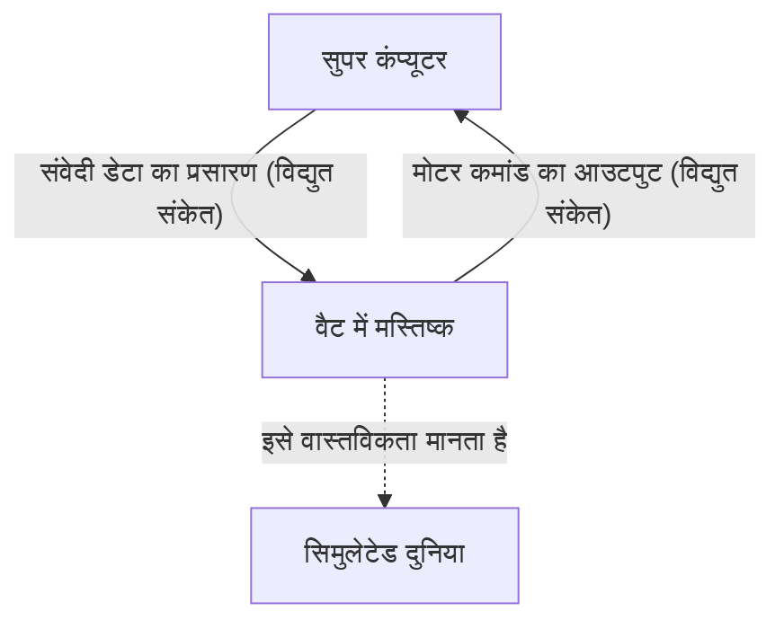
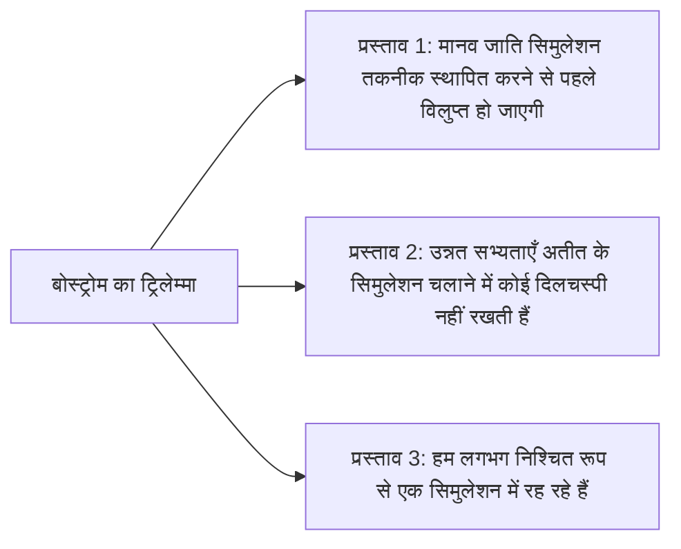

## प्रस्तावना: वास्तविकता क्या है?

"वास्तविकता" जिसे हम हर दिन स्वाभाविक रूप से स्वीकार करते हैं। सुबह उठकर कॉफी की सुगंध सूंघना, कीबोर्ड पर काम करना, और रात को बिस्तर की कोमलता महसूस करते हुए सो जाना। लेकिन क्या होगा अगर यह "वास्तविकता" एक जटिल रूप से बनाई गई आभासी वास्तविकता (सिमुलेशन) हो?

यह प्रश्न प्राचीन यूनानी दार्शनिक प्लेटो से लेकर आधुनिक क्वांटम भौतिकविदों और एआई शोधकर्ताओं तक, मानव बुद्धि को मोहित करने वाला अंतिम रहस्य है। इस लेख में, हम दर्शनशास्त्र के विचार प्रयोग "ब्रेन इन अ वैट (Brain in a vat)" और आधुनिक विज्ञान व सूचना सिद्धांत पर आधारित "सिमुलेशन परिकल्पना (Simulation hypothesis)" पर यथासंभव गहराई से और कई दृष्टिकोणों से विचार करेंगे।

---

## अध्याय 1: विचार प्रयोग "ब्रेन इन अ वैट" का प्रभाव

"ब्रेन इन अ वैट (Brain in a vat)" एक विचार प्रयोग है जिसे 1981 में दार्शनिक हिलेरी पटनम (Hilary Putnam) ने प्रस्तुत किया था। हालाँकि, इसके मूल में यह प्रश्न कि "हम अपनी धारणाओं पर किस हद तक भरोसा कर सकते हैं," 17वीं सदी के रेने डेसकार्टेस (René Descartes) के "दुष्ट राक्षस (धोखेबाज़ ईश्वर)" के तर्क तक जाता है।

### 1-1. ब्रेन इन अ वैट क्या है?

कल्पना कीजिए।
एक दिन, एक दुष्ट लेकिन प्रतिभाशाली वैज्ञानिक ने आपकी खोपड़ी से आपके मस्तिष्क को बिना किसी नुकसान के निकाल लिया। उस मस्तिष्क को एक विशेष पोषक द्रव (वैट या टैंक) में रखा गया है और उसे जीवित रखा जा रहा है। इसके अलावा, मस्तिष्क की तंत्रिका कोशिकाओं से अनगिनत इलेक्ट्रोड जुड़े हुए हैं, जो एक विशाल और उच्च प्रदर्शन वाले सुपर कंप्यूटर से जुड़े हैं।

यह कंप्यूटर आपके मस्तिष्क में दृश्य, श्रवण, स्पर्श, स्वाद और गंध जैसे सभी संवेदी इनपुट (विद्युत संकेत) को पूरी तरह से सिमुलेट करके भेज रहा है। दृश्य जानकारी कि आप अभी "यह लेख पढ़ रहे हैं" और स्पर्श की अनुभूति कि आप "कुर्सी पर बैठे हैं," ये सभी केवल विद्युत संकेत हैं जिनकी गणना कंप्यूटर द्वारा की जा रही है और आपके मस्तिष्क में भेजी जा रही है।

अब, यहाँ एक प्रश्न है।
**"क्या आप साबित कर सकते हैं कि आप अभी 'ब्रेन इन अ वैट' नहीं हैं?"**

### 1-2. ज्ञानमीमांसक संदेहवाद

यह विचार प्रयोग इसलिए भयावह है क्योंकि यह हमारे अनुभवजन्य ज्ञान की नींव को हिला देता है। हम आमतौर पर चीजों के अस्तित्व के बारे में सुनिश्चित होते हैं क्योंकि "हम उन्हें अपनी आँखों से देख सकते हैं" या "हम उन्हें छू सकते हैं।" हालाँकि, "ब्रेन इन अ वैट" परिदृश्य में, सभी संवेदी डेटा पूरी तरह से जाली हैं, इसलिए केवल आंतरिक अवलोकन (संवेदी अनुभव) के माध्यम से सच्ची वास्तविकता तक पहुँचना सैद्धांतिक रूप से असंभव है।

इसे दर्शनशास्त्र की शब्दावली में "ज्ञानमीमांसक संदेहवाद (Epistemological Skepticism)" कहा जाता है। डेसकार्टेस ने "मैं सोचता हूँ, इसलिए मैं हूँ (Cogito, ergo sum)" के रूप में निष्कर्ष निकाला कि कम से कम संदेह करने वाले "मेरे" चेतन अस्तित्व के बारे में तो निश्चितता है। हालाँकि, यह स्थान जहाँ "मैं" मौजूद हूँ—क्या यह पृथ्वी पर एक भौतिक शरीर है, या पोषक द्रव में तैरता हुआ मस्तिष्क है—यह अभी भी अज्ञेय बना हुआ है।

---

## अध्याय 2: आधुनिक युग में पुनर्जीवित "सिमुलेशन परिकल्पना"

"ब्रेन इन अ वैट" केवल एक दार्शनिक विचार प्रयोग था। लेकिन 21वीं सदी में प्रवेश करने के बाद, सूचना प्रौद्योगिकी और कंप्यूटर विज्ञान के विस्फोटक विकास के साथ, इस प्रश्न पर "सिमुलेशन परिकल्पना" के रूप में अधिक यथार्थवादी और वैज्ञानिक संदर्भ में चर्चा की जाने लगी।

### 2-1. निक बोस्ट्रोम का ट्रिलेम्मा

2003 में, ऑक्सफोर्ड विश्वविद्यालय के दार्शनिक निक बोस्ट्रोम (Nick Bostrom) ने "क्या आप एक कंप्यूटर सिमुलेशन में रह रहे हैं?" नामक एक चौंकाने वाला पेपर प्रकाशित किया। उन्होंने तार्किक तर्क का उपयोग करते हुए यह दावा किया कि निम्नलिखित 3 प्रस्तावों (ट्रिलेम्मा) में से, **कम से कम एक अनिवार्य रूप से सत्य है**।

**【प्रस्ताव 1: मानव विलुप्ति सिद्धांत】**
यह संभावना कि तकनीकी विलक्षणता (Singularity) या "पोस्ट-ह्यूमन" चरण तक पहुँचने से पहले, जो ब्रह्मांडीय पैमाने पर सिमुलेशन (पूर्वज सिमुलेशन) चला सके, मानव जाति परमाणु युद्ध, जलवायु परिवर्तन, एआई के नियंत्रण से बाहर होने, या किसी अज्ञात ब्रह्मांडीय आपदा के कारण विलुप्त हो जाएगी।

**【प्रस्ताव 2: उदासीनता सिद्धांत】**
भले ही मानव जाति विलुप्त न हो और पोस्ट-ह्यूमन चरण तक पहुँच जाए, और लगभग असीमित गणना शक्ति प्राप्त कर ले, यह संभावना है कि वे नैतिक कारणों से, या बस दिलचस्पी न होने के कारण, सचेत प्राणियों (हमारे) के सिमुलेशन नहीं चलाएंगे।

**【प्रस्ताव 3: सिमुलेशन सिद्धांत】**
यदि प्रस्ताव 1 और प्रस्ताव 2 दोनों "असत्य" हैं, तो एक उन्नत सभ्यता अनगिनत "पूर्वज सिमुलेशन" चलाएगी। वास्तविक ब्रह्मांड (बेस रियलिटी) केवल एक हो सकता है, लेकिन सिमुलेटेड ब्रह्मांड लाखों या अरबों हो सकते हैं। इसलिए, यदि हम सांख्यिकीय रूप से सोचें, तो इस बात की संभावना लगभग शून्य है कि हम, जो इस क्षण में चेतना रखते हैं, "एकमात्र बेस रियलिटी के निवासी" हैं, और हम लगभग निश्चित रूप से "करोड़ों सिमुलेशन में से किसी एक के निवासी" हैं।

### 2-2. भौतिकी का दृष्टिकोण: क्या ब्रह्मांड एक कंप्यूटर है?

सिमुलेशन परिकल्पना केवल संभाव्यता के सिद्धांत तक ही सीमित नहीं है। आधुनिक भौतिकी की कुछ अस्पष्ट घटनाओं को अच्छी तरह से समझाया जा सकता है यदि हम यह मान लें कि "ब्रह्मांड को सूचना के रूप में संसाधित किया जा रहा है।"

1.  **प्लैंक लंबाई और ब्रह्मांड का पिक्सेलीकरण**
    भौतिकी में, "प्लैंक लंबाई (लगभग $1.6 \times 10^{-35}$ मीटर)" नामक लंबाई की सबसे छोटी अर्थपूर्ण इकाई मौजूद है। यह बताता है कि ब्रह्मांड का स्थान निरंतर नहीं है, बल्कि कंप्यूटर डिस्प्ले के "पिक्सेल" की तरह एक असतत (discrete) संरचना हो सकती है।
2.  **प्रकाश की गति की सीमा**
    प्रकाश की गति (दिक्समय में सूचना के संचरण की गति) की एक ऊपरी सीमा (लगभग 3,00,000 किमी/सेकंड) क्यों है? सिमुलेशन परिकल्पना के दृष्टिकोण से, इसे "इस ब्रह्मांड की गणना करने वाले कंप्यूटर के प्रोसेसर की क्लॉक स्पीड (प्रोसेसिंग सीमा)" के रूप में व्याख्यायित किया जा सकता है।
3.  **डबल-स्लिट प्रयोग और क्वांटम यांत्रिकी की अवलोकन समस्या**
    क्वांटम यांत्रिकी में प्रसिद्ध डबल-स्लिट प्रयोग में, इलेक्ट्रॉन और फोटॉन "जब अवलोकित नहीं होते हैं" तो एक लहर की तरह संभाव्य अवस्था में मौजूद होते हैं, और "अवलोकन के क्षण" में उनकी स्थिति एक कण के रूप में निर्धारित हो जाती है। यह एक वीडियो गेम में "रेंडरिंग ऑप्टिमाइज़ेशन" के समान है। यह उस प्रणाली से काफी मिलता-जुलता है जहाँ गणना संसाधनों को बचाने के लिए खिलाड़ी (पर्यवेक्षक) द्वारा नहीं देखे जा रहे परिदृश्य को रेंडर नहीं किया जाता है, और दृष्टि क्षेत्र में प्रवेश करते ही इसे विस्तार से चित्रित किया जाता है।

---

## अध्याय 3: सिमुलेशन का रिज़ॉल्यूशन और "भागने" की संभावना

यदि हम किसी सिमुलेशन में हैं, तो इसे किस "रिज़ॉल्यूशन" पर बनाया गया है?

### 3-1. मैक्रो-सिमुलेशन और माइक्रो-सिमुलेशन

सिमुलेशन के विभिन्न स्तरों पर विचार किया जा सकता है।

*   **संपूर्ण ब्रह्मांड का सिमुलेशन**: एक मामला जहाँ उप-परमाणु स्तर से लेकर आकाशगंगा स्तर तक पूरे ब्रह्मांड की पूरी तरह से गणना की जा रही है। इसके लिए अकल्पनीय गणना शक्ति (Matrioshka brain जैसे ग्रहीय पैमाने के कंप्यूटर) की आवश्यकता होती है, लेकिन सैद्धांतिक रूप से यह असंभव नहीं है।
*   **स्थानीय सिमुलेशन**: एक मामला जहाँ केवल पृथ्वी और उसके परिवेश की उच्च रिज़ॉल्यूशन में गणना की जाती है, और दूर की आकाशगंगाओं को "कम-रिज़ॉल्यूशन बैकग्राउंड टेक्सचर" के रूप में संसाधित किया जाता है। यह विचार करते हुए कि हम इंसानों ने अभी तक सौर मंडल के बाहर कदम नहीं रखा है, शायद यही पर्याप्त हो।
*   **व्यक्तिगत चेतना का सिमुलेशन (ब्रेन इन अ वैट)**: एक मामला जहाँ दुनिया को ही सिमुलेट नहीं किया जा रहा है, बल्कि जानकारी केवल "आपकी" चेतना को भेजी जा रही है। आपके आस-पास के लोग वास्तव में सामग्री (चेतना) के बिना एनपीसी (Non-Player Character) हो सकते हैं, यानी "दार्शनिक ज़ॉम्बी" हो सकते हैं (अहंवाद)।

### 3-2. सिमुलेशन में "बग" ढूँढना

मान लें कि हम एक आभासी वास्तविकता में रह रहे हैं, तो क्या इसे अंदर से साबित करने का कोई तरीका है?
वैज्ञानिक ब्रह्मांड के प्रोग्राम में "बग" या "ग्लिच (त्रुटि)" खोजने के लिए प्रयोगों का गंभीरता से प्रस्ताव कर रहे हैं।

उदाहरण के लिए, ब्रह्मांडीय किरणों का अत्यधिक सटीकता से अवलोकन करके, हमें कोई ऐसी विषमता (anisotropy) मिल सकती है जो अंतरिक्ष के "ग्रिड" के अस्तित्व को दर्शाती हो। या, यदि यह पुष्टि की जाती है कि भौतिक स्थिरांक (जैसे सूक्ष्म-संरचना स्थिरांक) समय के साथ थोड़े बदल रहे हैं, तो यह सिमुलेशन के "अपडेट" या "राउंडिंग एरर" का संचय हो सकता है।

"डेजा वू (Déjà vu)", "मंडेला प्रभाव (ऐसी घटना जहाँ आम जनता ऐसी यादें साझा करती है जो तथ्यों से भिन्न होती हैं)", या अपसामान्य घटनाओं को सिमुलेशन के ग्लिच के रूप में समझाने वाले विज्ञान-कथा दृष्टिकोण भी हैं, लेकिन वे वैज्ञानिक प्रमाण तक नहीं पहुँचे हैं।

---

## अध्याय 4: यदि हम सिमुलेशन के निवासी हैं तो क्या होगा? (दार्शनिक और नैतिक प्रभाव)

यदि सिमुलेशन परिकल्पना सत्य है, तो हमारे जीवन के अर्थ और नैतिकता कैसे बदलेंगे?

### 4-1. शून्यवाद से बाहर निकलना

जब लोगों को पता चलता है कि "सब कुछ एक निर्मित आभासी वास्तविकता है", तो कई लोग शून्यवाद (निहिलिज्म) में गिर सकते हैं, यह सोचकर कि "तो फिर, कुछ भी करने का कोई मतलब नहीं है।" लेकिन क्या सच में ऐसा है?

फिल्म 'द मैट्रिक्स (The Matrix)' में एक पात्र साइफर, यह जानते हुए भी कि यह एक आभासी वास्तविकता है, स्टेक के स्वाद का आनंद लेने के लिए सिमुलेशन में वापस जाना चुनता है। "खुशी", "उदासी", "प्यार" और "दर्द" जैसे व्यक्तिपरक अनुभव (क्वालिया) जिन्हें हम महसूस करते हैं, हमारे लिए **निर्विवाद वास्तविकता** हैं, चाहे दुनिया भौतिक हो या सूचनात्मक।

सिर्फ इसलिए कि हम एक सिमुलेशन के अंदर हैं, इसका मतलब यह नहीं है कि हमारी भावनाओं और अनुभवों का मूल्य कम हो जाता है। यदि दुनिया जानकारी द्वारा निर्मित है, तो हम यह मान सकते हैं कि हमारी चेतना और कार्य स्वयं ब्रह्मांड के भव्य प्रोग्राम का हिस्सा हैं और उनका अपना अनूठा मूल्य है।

### 4-2. सिमुलेटर (निर्माता) का अस्तित्व

सिमुलेशन परिकल्पना को एक तरह से आधुनिक "ईश्वर के अस्तित्व का प्रमाण" कहा जा सकता है। इसका अर्थ है कि कोई उच्चतर इकाई (प्रोग्रामर) है जिसने इस ब्रह्मांड को प्रोग्राम किया है और इसे चला رہا है।

वे किस उद्देश्य से इस दुनिया को चला रहे हैं?
*   इतिहास का सत्यापन?
*   समाजशास्त्रीय प्रयोग?
*   या महज़ मनोरंजन (वीडियो गेम)?

यदि हम एक सिमुलेशन के भीतर एआई विकसित करते हैं, और वह एआई आगे चलकर सिमुलेशन बनाता है, तो "सिमुलेशन की बहु-स्तरीय संरचना (नेस्टेड संरचना)" उत्पन्न होगी। क्या हम सबसे निचले स्तर पर हैं, या किसी मध्यवर्ती स्तर में?

---

## निष्कर्ष: रहस्य के साथ जीने की "वास्तविकता"

"ब्रेन इन अ वैट" और "सिमुलेशन परिकल्पना" ऐसे "अखंडनीय (unfalsifiable) सिद्धांत" हैं जिनकी वर्तमान में न तो पुष्टि की जा सकती है और न ही खंडन। जैसे-जैसे विज्ञान और प्रौद्योगिकी आगे बढ़ती है और हम ब्रह्मांड की गहराई में देखते हैं, यह दुनिया और अधिक सूचनात्मक और रहस्यमयी रूप दिखाने लगती है।

क्या वह दिन आएगा जब हम सच्चाई तक पहुँचेंगे? शायद, जब हम सिमुलेशन चलाने वाले बन जाएंगे—जब हम कृत्रिम सामान्य बुद्धिमत्ता (AGI) को पूरा कर लेंगे और आभासी दुनिया में सचेत प्राणी बनाएंगे—तभी हम इस दुनिया के सत्य को छू पाएंगे।

तब तक, चाहे यह दुनिया बेस रियलिटी हो या एक अति-उन्नत सिमुलेशन, आपके सामने रखे एक कप कॉफी की सुगंध का आनंद लेते हुए जीना ही "वास्तविकता" का सामना करने का सबसे बुद्धिमान तरीका हो सकता है।
