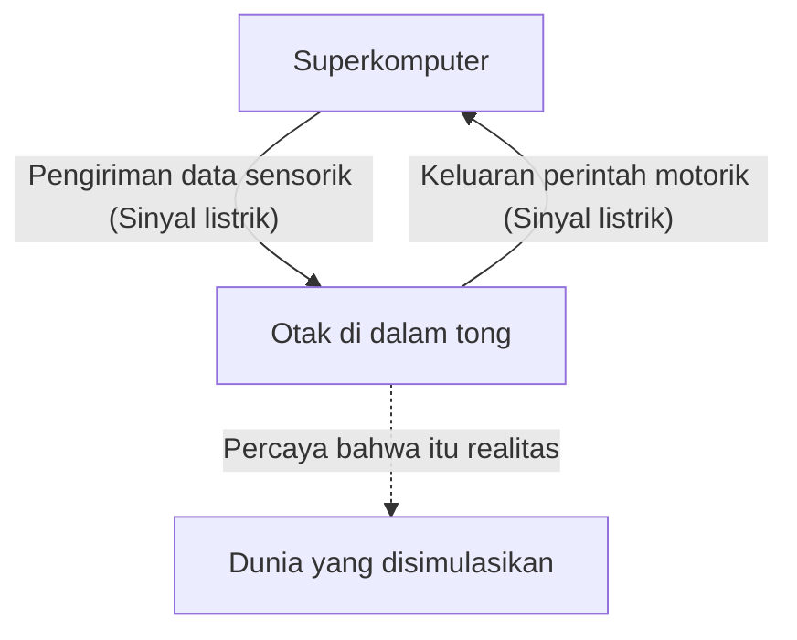
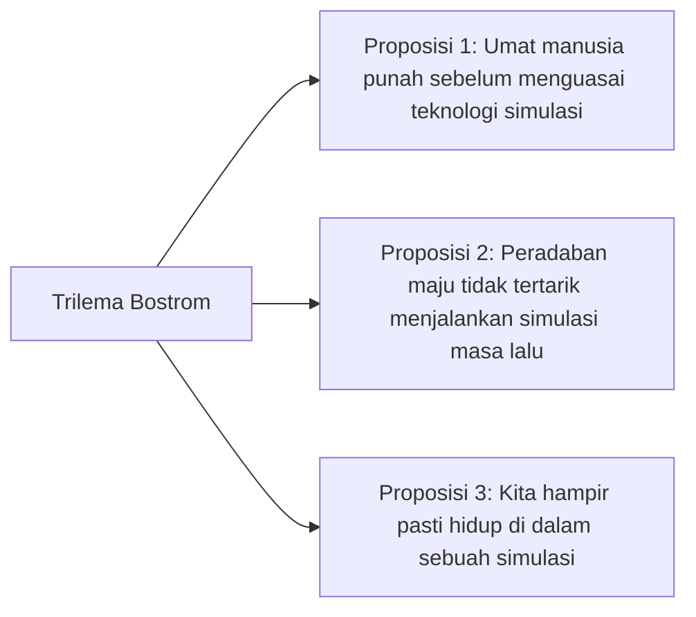

## Pengantar: Apa Itu Realitas?

"Realitas" yang kita terima begitu saja setiap hari. Bangun di pagi hari, mencium aroma kopi, mengetik di keyboard untuk bekerja, dan di malam hari tertidur sambil merasakan kelembutan tempat tidur. Namun, bagaimana jika "realitas" ini sebenarnya adalah sebuah realitas virtual (simulasi) yang dibuat dengan cermat?

Pertanyaan ini merupakan misteri ultimat yang tak henti-hentinya memikat daya pikat kecerdasan umat manusia, dari filsuf Yunani Kuno Plato hingga fisikawan kuantum dan peneliti AI modern. Dalam artikel ini, kita akan mengeksplorasi sedalam mungkin dan dari berbagai sudut pandang mengenai eksperimen pikiran filosofis "Otak di dalam Tong (Brain in a vat)" dan "Hipotesis Simulasi (Simulation hypothesis)" yang didasarkan pada sains dan teori informasi modern.

---

## Bab 1: Kejutan dari Eksperimen Pikiran "Otak di dalam Tong"

"Otak di dalam Tong (Brain in a vat)" adalah eksperimen pikiran yang diusulkan oleh filsuf Hilary Putnam pada tahun 1981. Namun, pertanyaan mendasar mengenai "sejauh mana pemahaman kita bisa dipercaya" dapat ditelusuri kembali ke argumen abad ke-17 dari René Descartes mengenai "Roh Jahat (Tuhan penipu)".

### 1-1. Apa Itu Otak di dalam Tong?

Bayangkanlah.
Suatu hari, seorang ilmuwan jenius tapi jahat mengambil otak Anda dari tengkorak Anda tanpa cacat. Otak tersebut dimasukkan ke dalam cairan nutrisi khusus (tong) agar tetap hidup. Selain itu, sel-sel saraf otak dihubungkan ke elektroda yang tak terhitung jumlahnya, yang terhubung ke sebuah superkomputer raksasa berkinerja tinggi.

Komputer ini mensimulasikan dan mengirimkan segala masukan sensorik (sinyal listrik) kepada otak Anda dengan sempurna, seperti penglihatan, pendengaran, sentuhan, rasa, dan penciuman. Informasi visual bahwa Anda "sedang membaca artikel ini" sekarang, atau sensasi sentuhan "duduk di kursi", semuanya hanyalah sinyal listrik yang dihitung oleh komputer dan dikirim ke otak.

Nah, di sinilah pertanyaannya.
**"Dapatkah Anda membuktikan sekarang bahwa Anda bukanlah 'Otak di dalam Tong'?"**

### 1-2. Skeptisisme Epistemologis

Hal yang menakutkan dari eksperimen pikiran ini adalah ia mengguncang fondasi pengetahuan empiris kita. Kita biasanya meyakini keberadaan suatu benda dengan alasan "karena kita melihatnya dengan mata sendiri" atau "karena kita bisa menyentuhnya". Namun, dalam skenario "Otak di dalam Tong", karena semua data sensorik dipalsukan dengan sempurna, secara prinsip tidak mungkin mengakses realitas sejati hanya melalui pengamatan dari dalam (pengalaman sensorik).

Ini disebut sebagai "Skeptisisme Epistemologis (Epistemological Skepticism)" dalam istilah filosofis. Descartes menyimpulkan melalui "Aku berpikir, maka aku ada (Cogito, ergo sum)" bahwa setidaknya keberadaan kesadaran "aku" yang sedang meragukan adalah sesuatu yang pasti. Namun, di mana tempat "aku" berada, apakah itu tubuh fisik di bumi ataukah sumsum otak yang mengapung di cairan nutrisi, tetap tidak dapat diketahui.

---

## Bab 2: "Hipotesis Simulasi" yang Bangkit di Era Modern

"Otak di dalam Tong" hanyalah eksperimen pikiran filosofis belaka. Namun memasuki abad ke-21, dengan evolusi eksplosif dari teknologi informasi dan ilmu komputer, pertanyaan ini mulai dibahas dalam konteks yang lebih realistis dan ilmiah sebagai "Hipotesis Simulasi".

### 2-1. Trilema Nick Bostrom

Pada tahun 2003, filsuf Universitas Oxford Nick Bostrom menerbitkan makalah mengejutkan berjudul "Apakah Anda hidup dalam simulasi komputer?". Ia menggunakan penalaran logis untuk menyatakan bahwa dari 3 proposisi (trilema) berikut, **setidaknya satu pasti benar**.

**【Proposisi 1: Teori Kepunahan Umat Manusia】**
Ada kemungkinan bahwa umat manusia akan punah akibat perang nuklir, perubahan iklim, pelarian AI, atau bencana kosmik yang tidak diketahui, sebelum mencapai tahap "Post-human" yang mampu menjalankan singularitas teknologi atau simulasi berskala kosmik (simulasi leluhur).

**【Proposisi 2: Teori Ketidakpedulian】**
Ada kemungkinan bahwa bahkan jika umat manusia mencapai tahap Post-human tanpa punah dan memperoleh kapasitas komputasi yang nyaris tak terbatas, mereka tidak akan menjalankan simulasi entitas sadar (kita) karena alasan etis atau sekadar tidak tertarik.

**【Proposisi 3: Teori Simulasi】**
Jika Proposisi 1 dan Proposisi 2 keduanya "salah", maka peradaban maju akan menjalankan "simulasi leluhur" dalam jumlah yang tak terbatas. Hanya ada satu alam semesta nyata (base reality), tetapi mungkin ada jutaan, miliaran alam semesta simulasi. Oleh karena itu, jika dipikirkan secara statistik, kemungkinan kita yang memiliki kesadaran pada saat ini adalah "penghuni satu-satunya dari base reality" sangat mendekati nol, dan kita hampir pasti adalah "penghuni dari salah satu dari ratusan juta simulasi".

### 2-2. Pendekatan dari Fisika: Apakah Alam Semesta adalah Komputer?

Hipotesis simulasi bukan hanya sebatas teori probabilitas semata. Beberapa fenomena tak dapat dijelaskan dalam fisika modern dapat dijelaskan dengan baik jika kita mengasumsikan bahwa "alam semesta sedang diproses sebagai informasi".

1.  **Panjang Planck dan Pikselisasi Alam Semesta**
    Dalam fisika, terdapat satuan panjang terkecil yang bermakna yaitu "Panjang Planck (sekitar $1.6 \times 10^{-35}$ meter)". Ini mengindikasikan kemungkinan bahwa ruang alam semesta tidaklah kontinu, melainkan memiliki struktur diskrit seperti "piksel" pada layar komputer.
2.  **Batas Kecepatan Cahaya**
    Mengapa kecepatan cahaya (kecepatan transmisi informasi dalam ruang waktu) memiliki batas atas (sekitar 300.000 km/detik)? Dari sudut pandang hipotesis simulasi, ini bisa ditafsirkan sebagai "kecepatan clock prosesor komputer yang menghitung alam semesta ini (batas pemrosesan)".
3.  **Eksperimen Celah Ganda dan Masalah Pengamatan dalam Mekanika Kuantum**
    Dalam eksperimen celah ganda yang terkenal di mekanika kuantum, elektron dan foton ada dalam keadaan probabilistik seperti gelombang saat "tidak diamati", dan posisinya dipastikan sebagai partikel saat "saat diamati". Hal ini sangat mirip dengan "optimasi rendering" di dalam video game. Ini sangat mirip dengan sistem di mana lanskap yang tidak dilihat oleh pemain (pengamat) tidak di-render untuk menghemat sumber daya komputasi, dan baru digambar secara mendetail pada saat ia masuk ke dalam bidang penglihatan.

---

## Bab 3: Resolusi Simulasi dan Kemungkinan "Melarikan Diri"

Seandainya kita benar-benar berada di dalam simulasi, seberapa tinggi "resolusi" yang digunakan untuk menciptakannya?

### 3-1. Simulasi Makro dan Simulasi Mikro

Terdapat berbagai tingkat simulasi yang dapat dipikirkan.

*   **Simulasi Seluruh Alam Semesta**: Kasus di mana seluruh alam semesta dihitung secara penuh dari tingkat partikel elementer hingga tingkat galaksi. Ini membutuhkan kapasitas komputasi yang tak terbayangkan (komputer skala planet seperti otak Matrioshka), tapi hal ini tidak mustahil secara teoritis.
*   **Simulasi Lokal**: Kasus di mana hanya Bumi dan sekitarnya yang dihitung dalam resolusi tinggi, sementara galaksi yang jauh diproses sebagai "tekstur latar belakang resolusi rendah". Mengingat bahwa umat manusia belum mencapai luar tata surya, hal ini mungkin sudah cukup.
*   **Simulasi Kesadaran Individu (Otak di dalam Tong)**: Kasus di mana bukan dunia itu sendiri yang disimulasikan, melainkan informasi hanya dikirimkan ke satu kesadaran, yaitu "Anda". Orang-orang di sekitar Anda mungkin sebenarnya adalah NPC (Non-Player Character) yang tidak memiliki isi (kesadaran), atau yang disebut sebagai "Zombi Filosofis" (Solipsisme).

### 3-2. Mencari "Bug" dalam Simulasi

Seandainya kita hidup di dalam realitas virtual, adakah cara untuk membuktikannya dari dalam?
Para ilmuwan dengan serius mengusulkan eksperimen untuk mencari "bug" atau "glitch (cacat)" di dalam program alam semesta.

Sebagai contoh, dengan mengamati sinar kosmik menggunakan presisi tinggi, anisotropi yang menunjukkan keberadaan "kisi (grid)" ruang mungkin dapat ditemukan. Atau, jika konstanta fisika (seperti konstanta struktur halus) dipastikan sedikit berubah seiring berjalannya waktu, itu bisa saja merupakan akumulasi dari "pembaruan" simulasi atau "kesalahan pembulatan".

Ada juga pendekatan fiksi ilmiah yang menjelaskan "Déjà vu (perasaan pernah melihat)", "Efek Mandela (fenomena di mana publik berbagi memori yang berbeda dari fakta)", atau fenomena paranormal sebagai sebuah glitch simulasi, namun semua ini belum mencapai pada tahap pembuktian ilmiah.

---

## Bab 4: Bagaimana Jika Kita Adalah Penghuni Simulasi? (Dampak Filosofis dan Etis)

Jika hipotesis simulasi adalah kenyataan, bagaimana makna kehidupan dan etika kita akan berubah?

### 4-1. Melepaskan Diri dari Nihilisme

Ketika orang menyadari bahwa "semuanya adalah realitas virtual yang diciptakan", banyak orang mungkin jatuh ke dalam nihilisme yang beranggapan, "jika begitu, melakukan apa pun tidak ada gunanya". Namun, benarkah demikian?

Karakter Cypher dalam "The Matrix" memilih untuk kembali ke dalam simulasi demi menikmati rasa bistik, meskipun ia tahu bahwa itu adalah sebuah realitas virtual. Pengalaman subjektif (qualia) yang kita rasakan seperti "kegembiraan", "kesedihan", "cinta", dan "rasa sakit" adalah **realitas yang tak dapat diragukan** bagi kita sendiri, terlepas dari apakah dunia itu bersifat fisik ataupun informasional.

Fakta bahwa kita berada di dalam sebuah simulasi tidak menurunkan nilai perasaan dan pengalaman kita. Jika dunia dibangun dari informasi, kita bisa menganggap bahwa kesadaran dan tindakan kita sendiri adalah bagian dari program raksasa alam semesta yang memiliki nilai unik.

### 4-2. Keberadaan Simulator (Sang Pencipta)

Hipotesis simulasi dalam arti tertentu dapat disebut sebagai "pembuktian eksistensi Tuhan" versi modern. Ini berarti ada entitas yang lebih tinggi (programmer) yang memprogram dan menjalankan alam semesta ini.

Apa tujuan mereka menjalankan dunia ini?
*   Verifikasi sejarah?
*   Eksperimen sosiologis?
*   Ataukah sekadar hiburan (video game)?

Jika kita mengembangkan AI di dalam simulasi, dan AI itu kemudian membuat simulasi lebih lanjut, "struktur multi-simulasi (struktur bersarang)" akan terjadi. Apakah kita berada di lapisan paling bawah, ataukah berada di lapisan tengah?

---

## Kesimpulan: "Realitas" Hidup Sambil Membawa Misteri

Pada saat ini, "Otak di dalam Tong" dan "Hipotesis Simulasi" adalah "hipotesis yang tak dapat dipalsukan" yang tidak bisa dibenarkan maupun disangkal. Semakin sains dan teknologi berkembang, serta semakin kita mengintip ke kedalaman alam semesta, dunia ini mulai menunjukkan wujud informasionalnya yang kian sulit dimengerti.

Akankah tiba hari di mana kita dapat mencapai kebenaran sejati? Mungkin, baru saat kitalah yang berada di pihak yang menjalankan simulasi—saat kita menyelesaikan Kecerdasan Buatan Umum (AGI) dan melahirkan entitas berkesadaran di dalam dunia virtual—kita akhirnya dapat menyentuh kebenaran dari dunia ini.

Sampai saat itu tiba, entah dunia ini adalah base reality atau sebuah simulasi super canggih, hidup sambil menikmati aroma secangkir kopi di depan mata kita mungkin adalah cara yang paling bijak untuk menghadapi "realitas".
