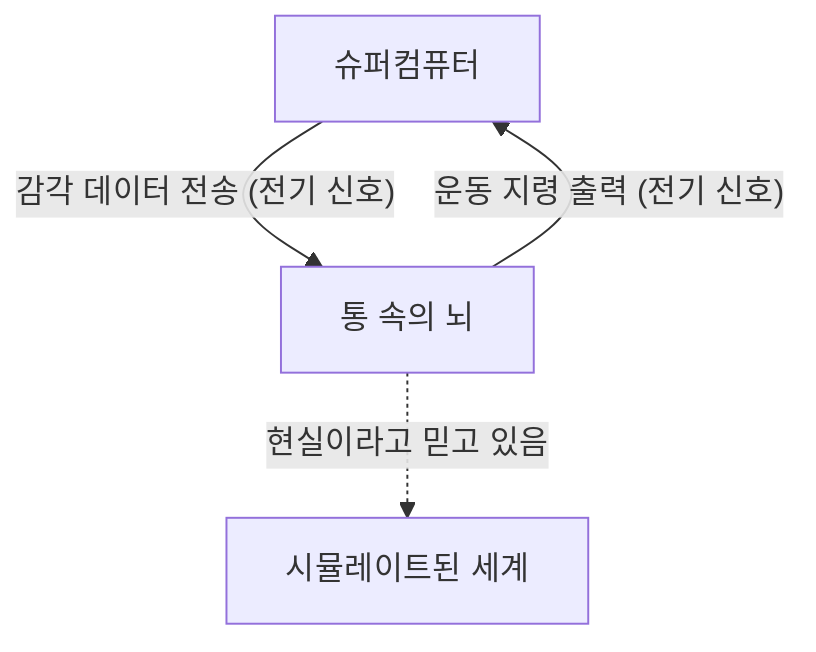
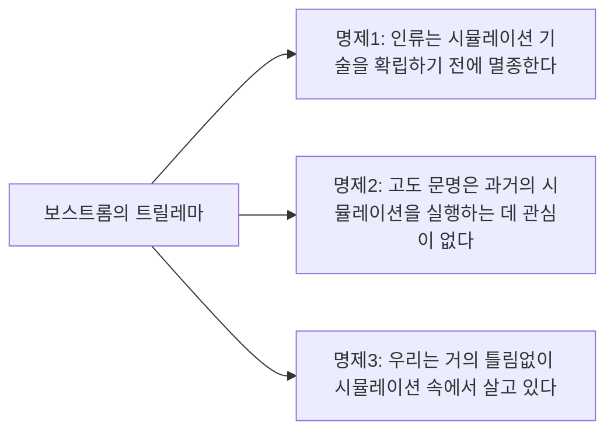

## 서론: 현실이란 무엇인가?

우리가 매일 당연하게 받아들이는 '현실'. 아침에 눈을 떠 커피 향을 맡고, 키보드를 두드리며 일을 하고, 밤에는 침대의 푹신함을 느끼며 잠에 듭니다. 하지만 이 '현실'이 만약 정교하게 만들어진 가상현실(시뮬레이션)이라면 어떨까요?

이 질문은 고대 그리스의 철학자 플라톤부터 현대의 양자물리학자와 AI 연구자에 이르기까지 인류의 지성을 끊임없이 매료시키는 궁극의 수수께끼입니다. 본 기사에서는 철학의 사고실험인 '통 속의 뇌(Brain in a vat)'와 현대 과학 및 정보이론에 기반한 '시뮬레이션 가설(Simulation hypothesis)'에 대해 가능한 한 깊고 다각적으로 고찰해 봅니다.

---

## 제1장: 사고실험 '통 속의 뇌'의 충격

'통 속의 뇌(Brain in a vat)'는 1981년 철학자 힐러리 퍼트넘(Hilary Putnam)이 제창한 사고실험입니다. 하지만 그 밑바탕에 있는 "우리의 인식은 어디까지 믿을 수 있는가"라는 질문은 17세기 르네 데카르트의 '악령(기만하는 신)' 논의까지 거슬러 올라갈 수 있습니다.

### 1-1. 통 속의 뇌란 무엇인가?

상상해 보십시오.
어느 날, 사악하지만 천재적인 과학자가 당신의 두개골에서 뇌를 온전하게 꺼냈습니다. 그 뇌는 특수한 배양액(통) 속에 담겨 생명을 유지하고 있습니다. 게다가 뇌의 신경세포에는 무수히 많은 전극이 연결되어 있으며, 거대하고 고성능인 슈퍼컴퓨터에 접속되어 있습니다.

이 컴퓨터는 당신의 뇌에 시각, 청각, 촉각, 미각, 후각 등 모든 감각 입력(전기 신호)을 완벽하게 시뮬레이트하여 전송하고 있습니다. 당신이 지금 '이 글을 읽고 있다'는 시각 정보도, '의자에 앉아 있다'는 촉각도 모두 컴퓨터가 계산하여 뇌로 보내는 전기 신호에 불과합니다.

자, 여기서 문제입니다.
**"당신은 지금 자신이 '통 속의 뇌'가 아니라는 것을 증명할 수 있습니까?"**

### 1-2. 인식론적 회의주의

이 사고실험이 무서운 이유는 우리의 경험론적 지식의 근간을 뒤흔들기 때문입니다. 우리는 평소 '내 눈으로 보고 있으니까', '만질 수 있으니까'라는 이유로 사물의 존재를 확신합니다. 하지만 '통 속의 뇌' 시나리오에서는 모든 감각 데이터가 완벽하게 위조되어 있기 때문에 내부에서의 관찰(감각 경험)만으로는 진짜 현실에 접근하는 것이 원리적으로 불가능합니다.

이를 철학 용어로 '인식론적 회의주의(Epistemological Skepticism)'라고 부릅니다. 데카르트는 "나는 생각한다, 고로 나는 존재한다(Cogito, ergo sum)"라며 적어도 의심하고 있는 '나'의 의식의 존재만큼은 확실하다고 결론지었습니다. 그러나 '나'가 존재하는 곳이 물리적인 지구상의 신체인지, 아니면 배양액에 떠 있는 뇌수인지에 대해서는 여전히 알 수 없는 상태로 남아있습니다.

---

## 제2장: 현대에 되살아난 '시뮬레이션 가설'

'통 속의 뇌'는 어디까지나 철학적인 사고실험이었습니다. 하지만 21세기에 접어들며 정보기술과 컴퓨터 과학의 폭발적인 발전으로 인해, 이 질문은 '시뮬레이션 가설'이라는 보다 현실적이고 과학적인 맥락에서 논의되기 시작했습니다.

### 2-1. 닉 보스트롬의 트릴레마

2003년, 옥스퍼드 대학의 철학자 닉 보스트롬(Nick Bostrom)은 "당신은 컴퓨터 시뮬레이션 속에서 살고 있는가?"라는 충격적인 논문을 발표했습니다. 그는 논리적인 추론을 통해 다음 3가지 명제(트릴레마) 중 **적어도 하나는 반드시 참이다**라고 주장했습니다.

**【명제1: 인류 멸종설】**
기술적 특이점(싱귤래리티)이나 우주 규모의 시뮬레이션(조상 시뮬레이션)을 실행할 수 있을 정도의 '포스트 휴먼' 단계에 도달하기 전에, 인류는 핵전쟁, 기후 변화, AI의 폭주 또는 미지의 우주적 재앙으로 인해 멸종해 버릴 것이라는 가능성입니다.

**【명제2: 무관심설】**
인류가 멸종하지 않고 포스트 휴먼 단계에 도달하여 무한에 가까운 계산 능력을 손에 넣는다 하더라도, 그들은 윤리적인 이유나 단순히 흥미가 없다는 이유로 의식을 가진 존재(우리)의 시뮬레이션을 실행하지 않을 것이라는 가능성입니다.

**【명제3: 시뮬레이션설】**
만약 명제 1과 명제 2가 모두 '거짓'이라면, 고도의 문명은 무수히 많은 '조상 시뮬레이션'을 실행하게 됩니다. 현실의 우주(베이스 리얼리티)는 하나뿐이지만 시뮬레이트된 우주는 수백만, 수십억 개가 존재할 수 있습니다. 따라서 통계학적으로 생각해보면, 지금 이 순간 의식을 가진 우리가 '유일한 베이스 리얼리티의 거주자'일 확률은 한없이 0에 가깝고, 거의 틀림없이 '수억 개의 시뮬레이션 중 어딘가의 거주자'가 됩니다.

### 2-2. 물리학적 접근: 우주는 컴퓨터인가?

시뮬레이션 가설은 단순한 확률론에 머물지 않습니다. 현대 물리학의 몇 가지 불가해한 현상들은 '우주가 정보로서 처리되고 있다'고 가정하면 잘 설명되는 경우가 있습니다.

1.  **플랑크 길이와 우주의 픽셀화**
    물리학에는 '플랑크 길이(약 $1.6 \times 10^{-35}$ 미터)'라는 유의미한 최소 길이 단위가 존재합니다. 이는 우주의 공간이 연속적인 것이 아니라, 컴퓨터 디스플레이의 '픽셀'처럼 이산적인 구조를 가지고 있을 가능성을 시사합니다.
2.  **광속의 한계**
    왜 빛의 속도(시공간에서의 정보 전달 속도)에는 상한(약 30만 km/s)이 있을까요? 시뮬레이션 가설의 관점에서 이것은 '이 우주를 연산하고 있는 컴퓨터 프로세서의 클럭 속도(처리 한계)'라고 해석할 수 있습니다.
3.  **이중 슬릿 실험과 양자역학의 관측 문제**
    양자역학의 유명한 이중 슬릿 실험에서 전자나 광자는 '관측되지 않을 때'는 파동처럼 확률적인 상태로 존재하다가, '관측되는 순간' 입자로서 위치가 확정됩니다. 이것은 비디오 게임의 '렌더링 최적화'와 매우 유사합니다. 플레이어(관측자)가 보지 않는 풍경은 계산 리소스를 절약하기 위해 렌더링되지 않다가, 시야에 들어오는 순간 상세하게 묘사되는 시스템과 흡사한 것입니다.

---

## 제3장: 시뮬레이션의 해상도와 '탈출'의 가능성

만약 우리가 시뮬레이션 속에 있다면, 그것은 어느 정도의 '해상도'로 만들어져 있을까요?

### 3-1. 매크로 시뮬레이션과 마이크로 시뮬레이션

시뮬레이션에는 다양한 수준이 생각될 수 있습니다.

*   **전 우주의 시뮬레이션**: 소립자 수준부터 은하계 수준까지 우주 전체를 완벽하게 연산하는 경우. 여기에는 상상을 초월하는 계산 능력(마트료시카 뇌와 같은 행성 규모의 컴퓨터)이 필요하지만 이론상 불가능한 것은 아닙니다.
*   **국소적인 시뮬레이션**: 지구와 그 주변만을 고해상도로 연산하고, 멀리 있는 은하 등은 '저해상도의 배경 텍스처'로 처리하는 경우. 우리 인류가 아직 태양계 밖으로 나가지 못했다는 점을 고려하면 이것으로 충분할지도 모릅니다.
*   **개별 의식의 시뮬레이션(통 속의 뇌)**: 세계 그 자체를 시뮬레이트하는 것이 아니라, '당신'이라는 한 사람의 의식에만 정보가 전송되는 경우. 당신 주변의 사람들은 사실 알맹이(의식)가 없는 NPC(Non-Player Character), 즉 '철학적 좀비'일 가능성이 있습니다(유아론).

### 3-2. 시뮬레이션의 '버그' 찾기

만약 우리가 가상현실에 살고 있다고 가정할 때, 그것을 내부에서 증명할 방법이 있을까요?
과학자들은 우주 프로그램의 '버그'나 '글리치(오류)'를 찾는 실험을 진지하게 제안하고 있습니다.

예를 들어, 우주선을 고정밀도로 관측함으로써 공간의 '격자(그리드)' 존재를 나타내는 비등방성이 발견될지도 모릅니다. 혹은 물리 상수(미세구조상수 등)가 시간에 따라 미세하게 변하고 있다는 사실이 확인된다면, 이는 시뮬레이션의 '업데이트'나 '반올림 오차'의 축적일 가능성이 있습니다.

'데자뷰(기시감)'나 '만델라 효과(사실과 다른 기억을 대중이 공유하는 현상)', 또는 초자연적 현상 등을 시뮬레이션의 글리치로 설명하는 SF적 접근도 존재하지만, 이것들은 과학적인 증명에 이르지는 못했습니다.

---

## 제4장: 만약 우리가 시뮬레이션의 주민이라면? (철학적·윤리적 영향)

시뮬레이션 가설이 진실일 경우, 우리의 삶의 의미와 윤리관은 어떻게 변할까요?

### 4-1. 허무주의로부터의 탈피

"모든 것은 만들어진 가상현실이다"라는 것을 알았을 때, 많은 사람들은 "그렇다면 무엇을 하든 무의미하다"는 허무주의(니힐리즘)에 빠질지도 모릅니다. 하지만 정말 그럴까요?

영화 『매트릭스』의 등장인물 사이퍼는 가상현실이라는 것을 알면서도 스테이크의 맛을 즐기기 위해 시뮬레이션 속으로 돌아가는 것을 선택했습니다. 우리가 느끼는 '기쁨', '슬픔', '사랑', '고통'과 같은 주관적인 경험(감각질)은 세계가 물리적인 것이든 정보적인 것이든 간에, 우리 자신에게는 **의심할 여지 없는 현실**입니다.

시뮬레이션 내부에 있다고 해서 우리의 감정이나 경험의 가치가 떨어지는 것은 아닙니다. 세계가 정보로 구축되어 있다면, 우리의 의식이나 행동 그 자체가 우주라는 장대한 프로그램의 일부이며 독자적인 가치를 지니고 있다고 생각할 수도 있습니다.

### 4-2. 시뮬레이터(창조주)의 존재

시뮬레이션 가설은 어떤 의미에서는 현대판 '신의 존재 증명'이라고도 할 수 있습니다. 이 우주를 프로그래밍하고 실행하는 상위 존재(프로그래머)가 있다는 말이 되기 때문입니다.

그들은 어떤 목적으로 이 세계를 가동하고 있는 것일까요?
*   역사의 검증?
*   사회학적 실험?
*   아니면 단순한 오락(비디오 게임)?

우리가 시뮬레이션 안에서 AI를 개발하고, 그 AI가 또 다른 시뮬레이션을 만들게 된다면 '시뮬레이션의 다중 구조(중첩 구조)'가 생겨납니다. 우리는 최하층에 있는 것일까요, 아니면 중간층에 있는 것일까요?

---

## 결론: 수수께끼를 안은 채 살아가는 '현실'

'통 속의 뇌'나 '시뮬레이션 가설'은 현시점에서는 긍정도 부정도 할 수 없는 '반증 불가능한 가설'입니다. 과학기술이 진보하고 우주의 심연을 들여다볼수록, 이 세계는 점점 더 정보적이고 불가해한 모습을 드러내기 시작합니다.

우리가 진실에 도달하는 날이 올까요? 아마도 우리가 시뮬레이션을 실행하는 입장이 되었을 때――범용 인공지능(AGI)을 완성하고 가상세계 안에서 의식을 가진 존재를 만들어냈을 때――비로소 이 세계의 진리에 닿을 수 있을지도 모릅니다.

그때까지는 이 세계가 베이스 리얼리티이든 초고도 시뮬레이션이든, 눈앞에 있는 한 잔의 커피 향을 즐기며 살아가는 것이 '현실'을 마주하는 가장 현명한 방법이 아닐까요?
