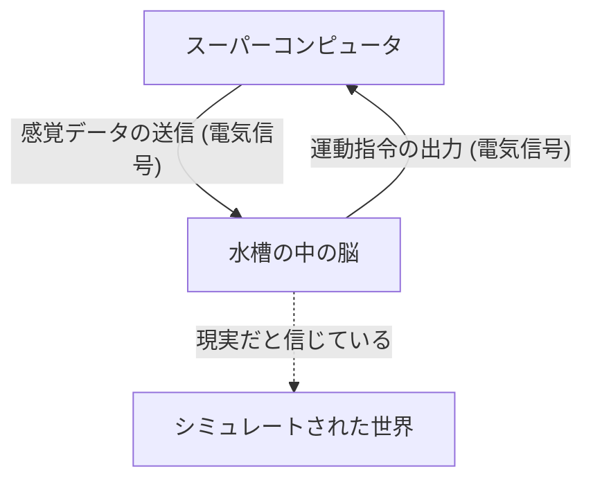
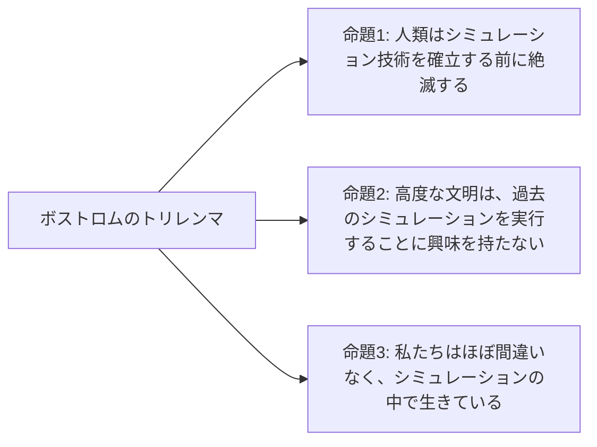

## はじめに：現実とは何か？

私たちが毎日当たり前のように受け入れている「現実」。朝目覚めてコーヒーの香りをかぎ、キーボードを叩いて仕事をし、夜にはベッドの柔らかさを感じながら眠りにつく。しかし、この「現実」がもし、精巧に作られた仮想現実（シミュレーション）だとしたらどうでしょうか？

この問いは、古くは古代ギリシャの哲学者プラトンから、現代の量子物理学者やAI研究者に至るまで、人類の知性を魅了してやまない究極の謎です。本記事では、哲学の思考実験である「水槽の脳（Brain in a vat）」と、現代科学・情報理論に基づく「シミュレーション仮説（Simulation hypothesis）」について、可能な限り深く、多角的に考察していきます。

---

## 第1章：思考実験「水槽の脳」の衝撃

「水槽の脳（Brain in a vat）」は、1981年に哲学者ヒラリー・パトナム（Hilary Putnam）が提唱した思考実験です。しかし、その根底にある「私たちの認識はどこまで信用できるのか」という問いは、17世紀の[ルネ・デカルト](/p/descartes/)の「悪霊（欺く神）」の議論にまで遡ることができます。

### 1-1. 水槽の脳とは何か？

想像してみてください。
ある日、邪悪だが天才的な科学者が、あなたの頭蓋骨から脳を無傷で取り出しました。その脳は特殊な培養液（水槽）の中に入れられ、生命を維持されています。さらに、脳の神経細胞には無数の電極が繋がれており、巨大で高性能なスーパーコンピュータに接続されています。

このコンピュータは、あなたの脳に対して、視覚、聴覚、触覚、味覚、嗅覚といったあらゆる感覚入力（電気信号）を完璧にシミュレートして送信しています。あなたが今「この記事を読んでいる」という視覚情報も、「椅子に座っている」という触覚も、すべてはコンピュータが計算し、脳に送り込んでいる電気信号に過ぎません。

さて、ここで問題です。
**「あなたは今、自分が『水槽の脳』ではないことを証明できますか？」**

### 1-2. 認識論的懐疑主義

この思考実験が恐ろしいのは、私たちの経験論的な知識の根底を揺るがすからです。私たちは普段、「自分の目で見ているから」「触れることができるから」という理由で物事の存在を確信します。しかし、「水槽の脳」のシナリオにおいては、すべての感覚データが完璧に偽造されているため、内部からの観察（感覚経験）だけでは、真の現実にアクセスすることが原理的に不可能です。

これを哲学の用語で「認識論的懐疑主義（Epistemological Skepticism）」と呼びます。デカルトは「我思う、ゆえに我あり（Cogito, ergo sum）」として、少なくとも疑っている「私」の意識の存在だけは確実であると結論づけました。しかし、「私」が存在する場所が、物理的な地球上の身体なのか、それとも培養液に浮かぶ脳髄なのかは、依然として不可知のままなのです。

---

## 第2章：現代に蘇る「シミュレーション仮説」

「水槽の脳」はあくまで哲学的な思考実験でした。しかし21世紀に入り、情報技術とコンピューターサイエンスの爆発的な進化によって、この問いは「シミュレーション仮説」として、より現実的で科学的な文脈で語られるようになりました。

### 2-1. ニック・ボストロムのトリレンマ

2003年、オックスフォード大学の哲学者ニック・ボストロム（Nick Bostrom）は、「あなたはコンピュータ・シミュレーションの中で生きているか？」という衝撃的な論文を発表しました。彼は論理的な推論を用いて、以下の3つの命題（トリレンマ）のうち、**少なくとも1つは必ず真である**と主張しました。

**【命題1：人類絶滅説】**
技術的特異点（シンギュラリティ）や、宇宙規模のシミュレーション（祖先シミュレーション）を実行できるほどの「ポスト・ヒューマン」段階に到達する前に、人類は核戦争、気候変動、AIの暴走、あるいは未知の宇宙的災害によって絶滅してしまうという可能性です。

**【命題2：無関心説】**
人類が絶滅せずにポスト・ヒューマン段階に到達し、無限に近い計算能力を手に入れたとしても、彼らは倫理的な理由や、単に興味がないという理由から、意識を持った存在（私たち）のシミュレーションを実行しないという可能性です。

**【命題3：シミュレーション説】**
もし命題1と命題2が両方とも「偽」であるなら、高度な文明は無数の「祖先シミュレーション」を実行することになります。現実の宇宙（ベース・リアリティ）は1つしかありませんが、シミュレーションされた宇宙は数百万、数十億と存在し得ます。したがって、統計学的に考えれば、今この瞬間に意識を持っている私たちが「唯一のベース・リアリティの住人」である確率は限りなくゼロに近く、ほぼ間違いなく「数億あるシミュレーションのいずれかの住人」であることになります。

### 2-2. 物理学からのアプローチ：宇宙は計算機か？

シミュレーション仮説は、単なる確率論にとどまりません。現代物理学のいくつかの不可解な現象は、「宇宙が情報として処理されている」と仮定すると、うまく説明がつくことがあります。

1.  **プランク長と宇宙のピクセル化**
    物理学には「プランク長（約 $1.6 \times 10^{-35}$ メートル）」という、意味をなす最小の長さの単位が存在します。これは、宇宙の空間が連続的なものではなく、コンピュータのディスプレイの「ピクセル」のように離散的な構造を持っている可能性を示唆しています。
2.  **光速の限界**
    なぜ光の速度（時空における情報の伝達速度）には上限（約30万km/s）があるのでしょうか？ シミュレーション仮説の観点からは、これは「この宇宙を演算しているコンピュータのプロセッサのクロック速度（処理限界）」であると解釈できます。
3.  **二重スリット実験と量子力学の観測問題**
    量子力学における有名な二重スリット実験では、電子や光子は「観測されていない時」は波のように確率的な状態で存在し、「観測された瞬間」に粒子として位置が確定します。これは、ビデオゲームにおける「レンダリングの最適化」に非常によく似ています。プレイヤー（観測者）が見ていない風景は計算リソースを節約するためにレンダリングされず、視界に入った瞬間に詳細に描画されるシステムと酷似しているのです。

---

## 第3章：シミュレーションの解像度と「脱出」の可能性

もし私たちがシミュレーションの中にいるとして、それはどの程度の「解像度」で作られているのでしょうか？

### 3-1. マクロ・シミュレーションとマイクロ・シミュレーション

シミュレーションには様々なレベルが考えられます。

*   **全宇宙のシミュレーション**：素粒子レベルから銀河系レベルまで、宇宙全体を完全に演算しているケース。これには想像を絶する計算能力（Matrioshka brainのような惑星規模のコンピュータ）が必要ですが、理論上は不可能なことではありません。
*   **局所的なシミュレーション**：地球とその周辺だけを高解像度で演算し、遠くの銀河などは「低解像度の背景テクスチャ」として処理しているケース。私たち人類がまだ太陽系外に到達していないことを考えると、これで十分なのかもしれません。
*   **個別意識のシミュレーション（水槽の脳）**：世界そのものをシミュレートしているのではなく、「あなた」という一人の意識だけに情報が送り込まれているケース。あなたの周りの人々は、実は中身（意識）のないNPC（Non-Player Character）、つまり「哲学的ゾンビ」である可能性があります（独我論）。

### 3-2. シミュレーションの「バグ」を探す

仮に私たちが仮想現実に生きているとして、それを内部から証明する方法はあるのでしょうか？
科学者たちは、宇宙のプログラムにおける「バグ」や「グリッチ（不具合）」を探す実験を真剣に提案しています。

例えば、宇宙線を高精度で観測することで、空間の「格子（グリッド）」の存在を示す異方性が発見できるかもしれません。あるいは、物理定数（微細構造定数など）が時間とともにわずかに変化していることが確認されれば、それはシミュレーションの「アップデート」や「丸め誤差」の蓄積である可能性があります。

「デジャヴ（既視感）」や「マンデラ効果（事実と異なる記憶を大衆が共有している現象）」、あるいは超常現象などを、シミュレーションのグリッチとして説明するSF的なアプローチも存在しますが、これらは科学的な証明には至っていません。

---

## 第4章：もし私たちがシミュレーションの住人だとしたら？（哲学的・倫理的影響）

シミュレーション仮説が真実であった場合、私たちの生きる意味や倫理観はどう変わるのでしょうか？

### 4-1. 虚無主義からの脱却

「すべては作られた仮想現実である」と知ったとき、多くの人は「なら、何をしても無意味だ」という虚無主義（ニヒリズム）に陥るかもしれません。しかし、本当にそうでしょうか？

『マトリックス』の登場人物サイファーは、仮想現実であることを知りながらも、ステーキの味を楽しむためにシミュレーションの中に戻ることを選びました。私たちが感じる「喜び」「悲しみ」「愛」「痛み」といった主観的な経験（クオリア）は、世界が物理的なものであろうと情報的なものであろうと、私たち自身にとっては**疑いようのない現実**です。

シミュレーションの内部にいるからといって、私たちの感情や経験の価値が下がるわけではありません。世界が情報によって構築されているのなら、私たちの意識や行動そのものが、宇宙という壮大なプログラムの一部であり、独自の価値を持っていると考えることもできます。

### 4-2. シミュレータ（創造主）の存在

シミュレーション仮説は、ある意味で現代の「神の存在証明」とも言えます。この宇宙をプログラミングし、実行している上位存在（プログラマー）がいることになります。

彼らは何を目的としてこの世界を走らせているのでしょうか？
*   歴史の検証？
*   社会学的な実験？
*   あるいは、単なる娯楽（ビデオゲーム）？

私たちがシミュレーションの中でAIを開発し、そのAIがさらにシミュレーションを作るようになれば、「シミュレーションの多重構造（入れ子構造）」が生じます。私たちは最下層にいるのか、それとも中間の層にいるのでしょうか。

---

## 結論：謎を抱えたまま生きるという「現実」

「水槽の脳」や「シミュレーション仮説」は、現時点では肯定も否定もできない「反証不可能な仮説」です。科学技術が進歩し、宇宙の深淵を覗き込むほどに、この世界はますます情報的で不可解な姿を見せ始めます。

私たちが真実に到達する日は来るのでしょうか？ おそらく、私たちがシミュレーションを実行する側に回ったとき——汎用人工知能（AGI）を完成させ、仮想世界の中で意識を持った存在を生み出したとき——初めて、この世界の真理に触れることができるのかもしれません。

それまでは、この世界がベース・リアリティであろうと、超高度なシミュレーションであろうと、目の前にある一杯のコーヒーの香りを楽しんで生きるのが、最も賢明な「現実」との向き合い方なのではないでしょうか。
