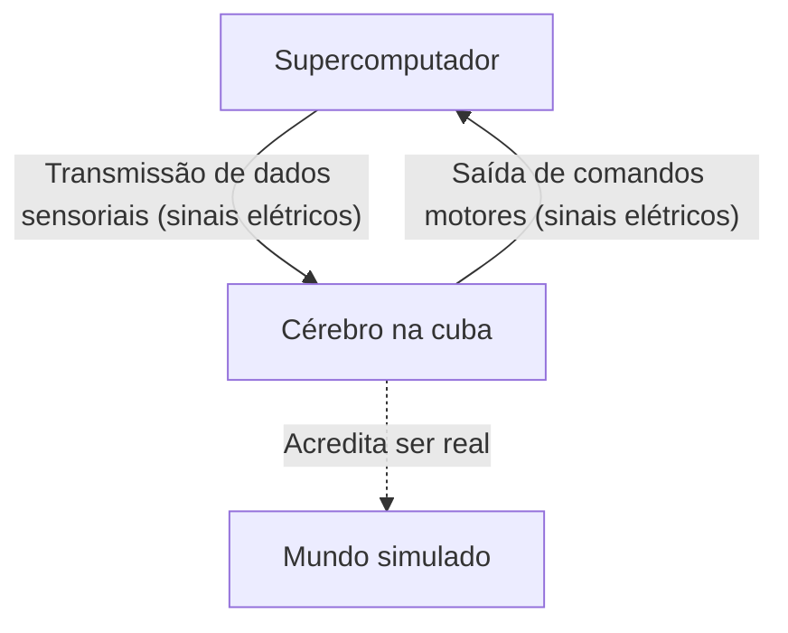
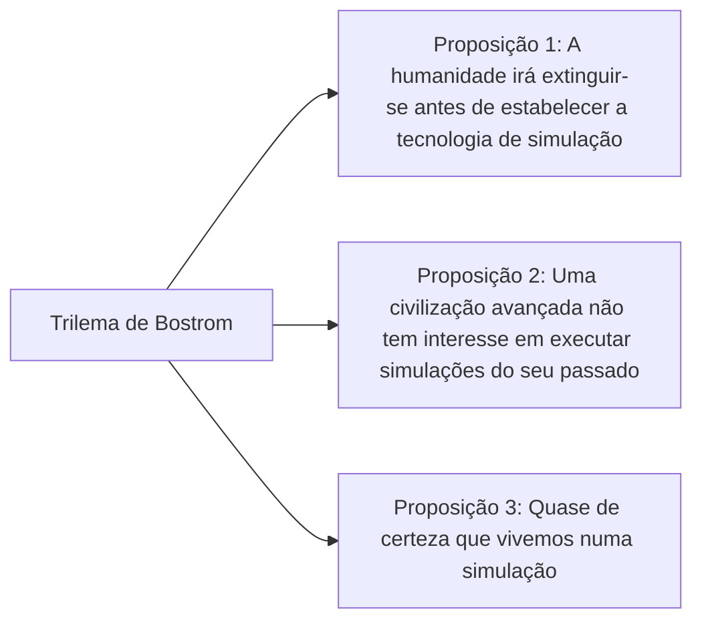

## Introdução: O Que é a Realidade?

A "realidade" que aceitamos naturalmente todos os dias. Acordar de manhã e cheirar o café, trabalhar ao teclado e adormecer à noite sentindo a suavidade da cama. Mas e se esta "realidade" for uma realidade virtual primorosamente elaborada (uma simulação)?

Esta questão é o mistério derradeiro que tem fascinado o intelecto humano, desde o antigo filósofo grego Platão até aos físicos quânticos e investigadores de IA da atualidade. Neste artigo, vamos explorar a experiência de pensamento filosófico do "Cérebro numa cuba" (Brain in a vat) e a "Hipótese da Simulação" baseada na ciência moderna e na teoria da informação, tão profunda e multifacetadamente quanto possível.

---

## Capítulo 1: O Impacto da Experiência de Pensamento do "Cérebro numa Cuba"

O "Cérebro numa cuba" (Brain in a vat) é uma experiência de pensamento proposta pelo filósofo Hilary Putnam em 1981. No entanto, a questão fundamental de "até que ponto podemos confiar na nossa perceção" remonta ao argumento do "Gênio Maligno" de René Descartes no século XVII.

### 1-1. O que é o Cérebro numa Cuba?

Imagine o seguinte.
Um dia, um cientista maléfico mas genial removeu intacto o seu cérebro do crânio. O cérebro foi colocado num fluido nutritivo especial (uma cuba) que o mantém vivo. Além disso, inúmeros elétrodos foram ligados aos neurónios do cérebro, conectando-o a um supercomputador gigante e de alto desempenho.

Este computador está a simular e transmitir perfeitamente todos os estímulos sensoriais (sinais elétricos) para o seu cérebro, como a visão, a audição, o tato, o paladar e o olfato. A informação visual de que está a "ler este artigo" agora mesmo, e a sensação tátil de "estar sentado numa cadeira", são tudo sinais elétricos calculados pelo computador e enviados para o cérebro.

Agora, eis a questão.
**"Consegue provar agora mesmo que não é um 'cérebro numa cuba'?"**

### 1-2. Ceticismo Epistemológico

O aspeto aterrador desta experiência de pensamento é que abala os próprios alicerces do nosso conhecimento empírico. Normalmente, temos a certeza da existência das coisas porque "vemo-las com os nossos próprios olhos" ou "podemos tocá-las". No entanto, no cenário do "cérebro numa cuba", como todos os dados sensoriais são falsificados na perfeição, é teoricamente impossível aceder à verdadeira realidade apenas através da observação interna (experiência sensorial).

Isto é chamado em filosofia de "Ceticismo Epistemológico". Descartes concluiu: "Penso, logo existo" (Cogito, ergo sum), indicando que, pelo menos, a existência da consciência do "eu" que duvida é certa. Contudo, o local onde o "eu" existe - se é num corpo físico na Terra, ou se é apenas uma massa cerebral a flutuar num fluido nutritivo - permanece incognoscível.

---

## Capítulo 2: O Renascimento Moderno da "Hipótese da Simulação"

O "cérebro numa cuba" era apenas uma experiência de pensamento filosófico. No entanto, entrando no século XXI, com a evolução explosiva da tecnologia da informação e da ciência da computação, esta questão passou a ser discutida num contexto mais realista e científico como a "Hipótese da Simulação".

### 2-1. O Trilema de Nick Bostrom

Em 2003, o filósofo da Universidade de Oxford Nick Bostrom publicou um artigo chocante intitulado: "Vivemos numa simulação de computador?". Utilizando o raciocínio lógico, ele argumentou que **pelo menos uma** das três seguintes proposições (um trilema) deve ser verdadeira.

**[Proposição 1: A Teoria da Extinção Humana]**
A possibilidade de que a humanidade seja extinta por uma guerra nuclear, alterações climáticas, IA fora de controlo, ou um desastre cósmico desconhecido antes de atingir uma fase "pós-humana", capaz de criar uma singularidade tecnológica ou executar uma simulação à escala universal (uma simulação de ancestrais).

**[Proposição 2: A Teoria da Indiferença]**
Mesmo que a humanidade não se extinga e chegue à fase pós-humana, obtendo um poder computacional quase infinito, eles optariam por não realizar simulações de seres conscientes (nós) por razões éticas ou simplesmente por falta de interesse.

**[Proposição 3: A Teoria da Simulação]**
Se as proposições 1 e 2 forem ambas "falsas", uma civilização avançada executará inúmeras "simulações de ancestrais". Embora só exista um universo real (a realidade base), poderão existir milhões ou milhares de milhões de universos simulados. Estatisticamente falando, a probabilidade de que nós, possuindo consciência neste exato momento, sejamos "habitantes da única realidade base" é quase zero, sendo quase certo que somos "habitantes de uma das centenas de milhões de simulações".

### 2-2. Abordagem da Física: Será o Universo um Computador?

A hipótese da simulação vai além de uma mera teoria de probabilidade. Vários fenómenos inexplicáveis da física moderna podem ser bem explicados se assumirmos que "o universo está a ser processado como informação".

1.  **O Comprimento de Planck e a Pixelização do Universo**
    A física reconhece o "Comprimento de Planck (aproximadamente $1.6 \times 10^{-35}$ metros)", que é a unidade de comprimento mais pequena que faz sentido. Isto sugere que o espaço no universo não é contínuo, mas possui uma estrutura discreta, muito semelhante aos "píxeis" de um ecrã de computador.
2.  **O Limite da Velocidade da Luz**
    Porque é que existe um limite máximo para a velocidade da luz (a velocidade de transmissão de informação no espaço-tempo) de cerca de 300.000 km/s? Do ponto de vista da hipótese da simulação, isto pode ser interpretado como "a velocidade de relógio do processador (limite de processamento) do computador que está a calcular este universo".
3.  **A Experiência da Dupla Fenda e o Problema da Observação na Mecânica Quântica**
    Na famosa experiência da dupla fenda na mecânica quântica, os eletrões e fotões existem num estado de probabilidade, como uma onda, "quando não são observados", e fixam-se como partículas "no momento em que são observados". Isto é muito parecido com a "otimização da renderização" nos videojogos. É um sistema extremamente semelhante àquele onde as paisagens que o jogador (observador) não está a olhar não são renderizadas para poupar recursos computacionais, e são desenhadas ao pormenor apenas no momento em que entram no campo de visão.

---

## Capítulo 3: A Resolução da Simulação e a Possibilidade de "Fuga"

Se estamos numa simulação, com que nível de "resolução" foi criada?

### 3-1. Macro-simulação vs Micro-simulação

Vários níveis de simulação são concebíveis.

*   **A Simulação de Todo o Universo**: Onde o universo inteiro é completamente calculado, desde as partículas elementares até ao nível galáctico. Isto requereria um poder computacional inimaginável (um computador à escala planetária, como o "Cérebro de Matrioshka"), mas não é teoricamente impossível.
*   **Uma Simulação Local**: Apenas a Terra e as suas redondezas são calculadas em alta resolução, com as galáxias mais distantes a serem tratadas como "texturas de fundo de baixa resolução". Tendo em conta que a humanidade ainda não viajou além do sistema solar, isto pode muito bem ser suficiente.
*   **Uma Simulação da Consciência Individual (Cérebro numa Cuba)**: Em vez de simular o mundo em si, os dados são enviados apenas para a consciência de um único indivíduo: "você". As pessoas à sua volta podem ser NPCs (Non-Player Characters) sem interioridade (consciência), ou seja, podem ser "zombies filosóficos" (Solipsismo).

### 3-2. À Procura de "Bugs" na Simulação

A assumir que vivemos numa realidade virtual, haverá alguma forma de o provar a partir de dentro?
Os cientistas propuseram seriamente experiências para procurar "bugs" ou "falhas (glitches)" na programação do universo.

Por exemplo, observando raios cósmicos com alta precisão, poderíamos descobrir anisotropia indicativa da existência de uma "grelha" espacial. Da mesma forma, se constantes físicas (como a constante de estrutura fina) forem provadas estarem a mudar ligeiramente ao longo do tempo, isto poderia dever-se à acumulação de "atualizações" ou "erros de arredondamento" na simulação.

Existem também abordagens baseadas na ficção científica que explicam o "Déjà vu", o "Efeito Mandela" (onde as massas partilham memórias que são factualmente incorretas), ou fenómenos paranormais como falhas na simulação, mas estas carecem de provas científicas.

---

## Capítulo 4: E se Formos Habitantes de uma Simulação? (Implicações Filosóficas e Éticas)

Se a hipótese da simulação for verdadeira, de que forma isso alterará o sentido das nossas vidas e as nossas visões éticas?

### 4-1. Fuga do Niilismo

Muitas pessoas podem cair no niilismo ao perceber que "tudo é uma realidade virtual fabricada", pensando que "então nada do que eu faço importa". No entanto, será isso verdade?

Em "O Matrix", a personagem Cypher escolheu regressar à simulação para apreciar o sabor do bife, apesar de saber que era uma realidade virtual. As experiências subjetivas (qualia) que sentimos, tais como "alegria", "tristeza", "amor" e "dor", são uma **realidade inegável** para nós, independentemente do mundo ser físico ou de natureza informacional.

O facto de estarmos numa simulação não diminui o valor das nossas emoções e experiências. Se o mundo é construído por informação, podemos acreditar que a nossa consciência e as nossas ações são partes do grande programa do universo, possuindo o seu próprio valor inerente.

### 4-2. A Existência de um Simulador (Criador)

De certa forma, a hipótese da simulação pode ser vista como uma "prova da existência de Deus" na modernidade. Existiria um ser superior (programador) que programou e executa este universo.

Com que propósito gerem eles este mundo?
*   A verificação da história?
*   Uma experiência sociológica?
*   Ou mero entretenimento (um videojogo)?

Se criarmos uma IA dentro da nossa simulação, e essa IA vier a criar as suas próprias simulações, surge uma "estrutura aninhada (múltipla) de simulações". Estaremos na camada inferior ou numa camada intermédia?

---

## Conclusão: A "Realidade" de Viver com um Mistério

De momento, o "Cérebro numa Cuba" e a "Hipótese da Simulação" são "hipóteses irrefutáveis" - nem podem ser provadas nem refutadas. À medida que a ciência e a tecnologia avançam, e olhamos mais profundamente para o abismo do universo, este mundo começa a parecer cada vez mais informacional e inescrutável.

Chegará o dia em que alcançaremos a verdade? Talvez só possamos tocar a verdade deste mundo quando nos tornarmos nós próprios os operadores de uma simulação - quando aperfeiçoarmos a Inteligência Artificial Geral (AGI) e criarmos seres conscientes dentro de um mundo virtual.

Até lá, quer este mundo seja uma realidade base ou uma simulação hiper-avançada, aproveitar o aroma de uma chávena de café à nossa frente é provavelmente a forma mais sensata de encarar a nossa "realidade".
