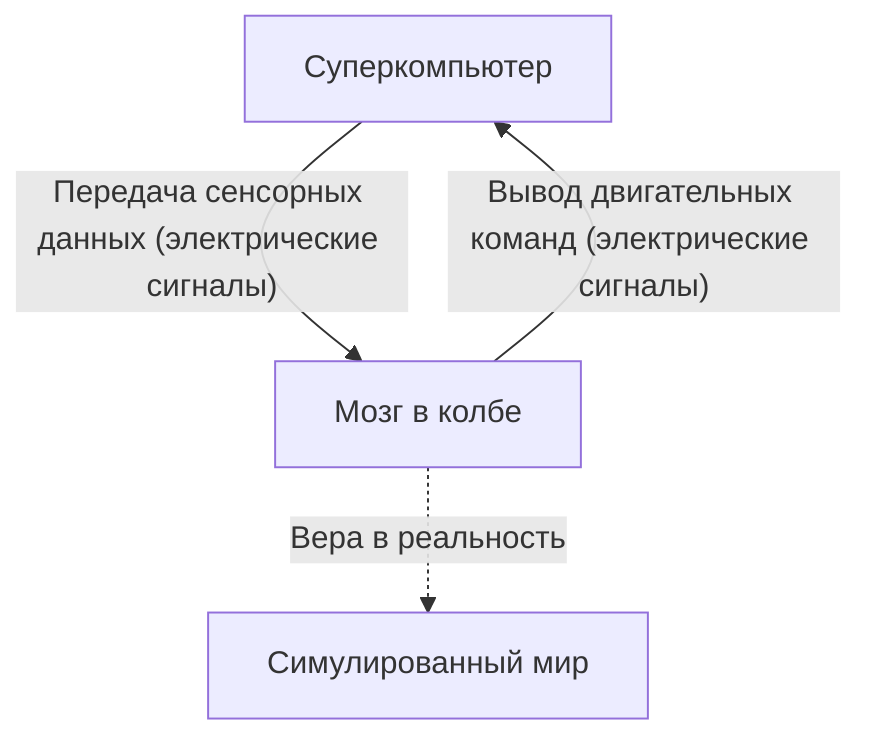
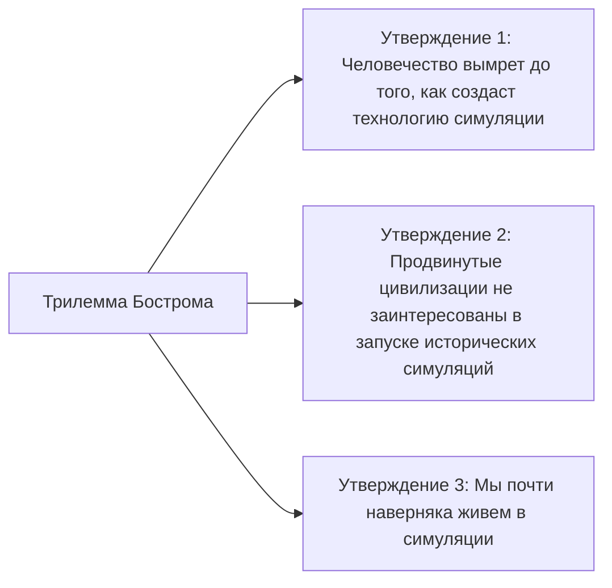

## Введение: Что такое реальность?

«Реальность», которую мы воспринимаем каждый день как нечто само собой разумеющееся. Просыпаясь утром, мы чувствуем запах кофе, стучим по клавиатуре во время работы, а ночью засыпаем, ощущая мягкость кровати. Но что, если эта «реальность» является искусно созданной виртуальной реальностью (симуляцией)?

Этот вопрос — величайшая загадка, которая не перестает очаровывать человеческий разум, начиная от древнегреческого философа Платона до современных квантовых физиков и исследователей ИИ. В этой статье мы максимально глубоко и разносторонне рассмотрим философский мысленный эксперимент «Мозг в колбе» (Brain in a vat) и «Гипотезу симуляции» (Simulation hypothesis), основанную на современной науке и теории информации.

---

## Глава 1: Шок от мысленного эксперимента «Мозг в колбе»

«Мозг в колбе» (Brain in a vat) — это мысленный эксперимент, предложенный философом Хилари Патнэмом (Hilary Putnam) в 1981 году. Однако фундаментальный вопрос «насколько мы можем доверять нашему восприятию» уходит корнями к дискуссии о «злом демоне» (обманывающем боге) Рене Декарта в XVII веке.

### 1-1. Что такое мозг в колбе?

Представьте себе.
Однажды злой, но гениальный ученый извлек ваш мозг из черепа без каких-либо повреждений. Этот мозг помещен в специальную питательную жидкость (колбу), в которой поддерживается его жизнь. Более того, к нейронам мозга подключены бесчисленные электроды, соединенные с гигантским и высокопроизводительным суперкомпьютером.

Этот компьютер идеально симулирует и посылает вашему мозгу все сенсорные данные (электрические сигналы), такие как зрение, слух, осязание, вкус и обоняние. Визуальная информация о том, что вы сейчас «читаете эту статью», и тактильное ощущение того, что вы «сидите на стуле», — все это не более чем электрические сигналы, которые компьютер вычисляет и посылает в ваш мозг.

А теперь вопрос.
**«Можете ли вы сейчас доказать, что вы не являетесь «мозгом в колбе»?»**

### 1-2. Эпистемологический скептицизм

Этот мысленный эксперимент пугает тем, что он расшатывает основу наших эмпирических знаний. Обычно мы уверены в существовании вещей потому, что мы их «видим собственными глазами» и «можем потрогать». Однако в сценарии «Мозга в колбе» все сенсорные данные идеально подделаны, поэтому принципиально невозможно получить доступ к истинной реальности только путем внутренних наблюдений (сенсорного опыта).

В философии это называется «Эпистемологический скептицизм» (Epistemological Skepticism). Декарт пришел к выводу: «Я мыслю, следовательно, я существую» (Cogito, ergo sum), утверждая, что, по крайней мере, существование сознания сомневающегося «Я» неоспоримо. Однако вопрос о том, где находится это «Я» — в физическом теле на Земле или в мозге, плавающем в питательном растворе, — остается непознаваемым.

---

## Глава 2: Возрождение «Гипотезы симуляции» в наши дни

«Мозг в колбе» был всего лишь философским мысленным экспериментом. Однако в XXI веке, с взрывным развитием информационных технологий и информатики, этот вопрос стал обсуждаться как «Гипотеза симуляции» в более реалистичном и научном контексте.

### 2-1. Трилемма Ника Бострома

В 2003 году философ из Оксфордского университета Ник Бостром (Nick Bostrom) опубликовал шокирующую статью «Живете ли вы в компьютерной симуляции?». Используя логические рассуждения, он утверждал, что **по крайней мере одно из следующих трех утверждений (трилемма) обязательно истинно**.

**【Утверждение 1: Гипотеза вымирания человечества】**
Возможность того, что человечество будет уничтожено ядерной войной, изменением климата, выходом ИИ из-под контроля или неизвестной космической катастрофой до того, как достигнет технологической сингулярности или «постчеловеческой» стадии, способной запускать симуляции космического масштаба (симуляции предков).

**【Утверждение 2: Гипотеза равнодушия】**
Возможность того, что даже если человечество не вымрет и достигнет постчеловеческой стадии, обретя почти безграничные вычислительные мощности, они не будут запускать симуляции сознательных существ (нас) по этическим причинам или просто из-за отсутствия интереса.

**【Утверждение 3: Гипотеза симуляции】**
Если утверждения 1 и 2 оба ложны, то продвинутая цивилизация запустит бесчисленное множество «симуляций предков». Существует только одна настоящая Вселенная (базовая реальность), но симулированных вселенных могут быть миллионы и миллиарды. Следовательно, с точки зрения статистики, вероятность того, что мы, обладающие сознанием в данный момент, являемся «жителями единственной базовой реальности», стремится к нулю. Почти наверняка мы — «жители одной из сотен миллионов симуляций».

### 2-2. Подход со стороны физики: Является ли Вселенная компьютером?

Гипотеза симуляции не ограничивается только теорией вероятности. Некоторые загадочные явления в современной физике можно легко объяснить, если предположить, что «Вселенная обрабатывается как информация».

1.  **Планковская длина и пикселизация Вселенной**
    В физике существует «Планковская длина» (около $1.6 \times 10^{-35}$ метров), которая является минимальной имеющей смысл единицей длины. Это наводит на мысль, что пространство Вселенной не является непрерывным, а имеет дискретную структуру, подобно «пикселям» на экране компьютера.
2.  **Ограничение скорости света**
    Почему существует верхний предел скорости света (около 300 000 км/с) — скорости передачи информации в пространстве-времени? С точки зрения гипотезы симуляции, это можно интерпретировать как «тактовую частоту (предел обработки) процессора компьютера, вычисляющего эту Вселенную».
3.  **Эксперимент с двумя щелями и проблема наблюдения в квантовой механике**
    В знаменитом квантово-механическом эксперименте с двумя щелями электроны и фотоны существуют в вероятностном состоянии, подобно волнам, когда их «не наблюдают», а в «момент наблюдения» их положение фиксируется как у частиц. Это очень похоже на «оптимизацию рендеринга» в видеоиграх. Пейзаж, который игрок (наблюдатель) не видит, не отрисовывается для экономии вычислительных ресурсов, но детально прорисовывается в тот момент, когда попадает в поле зрения.

---

## Глава 3: Разрешение симуляции и возможность «побега»

Если мы находимся в симуляции, с каким «разрешением» она создана?

### 3-1. Макро-симуляция и микро-симуляция

Можно выделить разные уровни симуляций.

*   **Симуляция всей Вселенной**: Полное вычисление всей Вселенной, от уровня элементарных частиц до уровня галактик. Для этого требуется невообразимая вычислительная мощность (компьютер планетарного масштаба, вроде Мозга-матрешки), но теоретически это не невозможно.
*   **Локальная симуляция**: Случай, когда Земля и ее окрестности вычисляются с высоким разрешением, а далекие галактики обрабатываются как «фоновые текстуры низкого разрешения». Учитывая, что человечество еще не покинуло Солнечную систему, этого, возможно, вполне достаточно.
*   **Симуляция индивидуального сознания (Мозг в колбе)**: Случай, когда симулируется не сам мир, а информация отправляется только в одно сознание — «ваше». Окружающие вас люди на самом деле могут быть NPC (неигровыми персонажами) без внутреннего содержания (сознания), то есть «философскими зомби» (солипсизм).

### 3-2. Поиск «багов» симуляции

Если предположить, что мы живем в виртуальной реальности, есть ли способ доказать это изнутри?
Ученые всерьез предлагают эксперименты по поиску «багов» и «глюков» (сбоев) в программе Вселенной.

Например, наблюдая за космическими лучами с высокой точностью, можно обнаружить анизотропию, указывающую на существование «решетки» (сетки) пространства. Или, если будет подтверждено, что физические константы (например, постоянная тонкой структуры) со временем слегка изменяются, это может быть следствием «обновления» симуляции или накопления «ошибок округления».

Существуют также научно-фантастические подходы, объясняющие «дежавю», «эффект Манделы» (феномен, когда массы людей разделяют ложные воспоминания) или паранормальные явления как сбои симуляции, но они не имеют научного доказательства.

---

## Глава 4: Что, если мы — жители симуляции? (Философские и этические последствия)

Если гипотеза симуляции окажется правдой, как изменятся наш смысл жизни и этические нормы?

### 4-1. Избавление от нигилизма

Узнав, что «всё — это созданная виртуальная реальность», многие люди могут впасть в нигилизм (отрицание смысла), подумав: «Тогда всё, что мы делаем, бессмысленно». Но так ли это на самом деле?

Сайфер, персонаж из «Матрицы», зная, что это виртуальная реальность, предпочел вернуться в симуляцию, чтобы наслаждаться вкусом стейка. Субъективный опыт (квалиа), такой как «радость», «печаль», «любовь» и «боль», которые мы испытываем, являются **неоспоримой реальностью** для нас самих, независимо от того, является ли мир физическим или информационным.

Тот факт, что мы находимся внутри симуляции, не снижает ценности наших эмоций и опыта. Если мир построен из информации, можно считать, что наше сознание и действия сами по себе являются частью грандиозной программы под названием Вселенная и имеют собственную ценность.

### 4-2. Существование симулятора (Создателя)

Гипотезу симуляции в некотором смысле можно назвать современным «доказательством бытия Бога». Это означает, что существует высшее существо (программист), которое запрограммировало и запустило эту Вселенную.

С какой целью они запустили этот мир?
*   Проверка истории?
*   Социологический эксперимент?
*   Или просто развлечение (видеоигра)?

Если мы создадим ИИ в симуляции, а этот ИИ создаст еще одну симуляцию, возникнет «многоуровневая структура (вложенность) симуляций». Находимся ли мы на самом нижнем уровне или где-то посередине?

---

## Заключение: «Реальность» жизни с неразгаданной тайной

«Мозг в колбе» и «Гипотеза симуляции» в настоящее время являются «нефальсифицируемыми гипотезами», которые нельзя ни подтвердить, ни опровергнуть. По мере развития науки и технологий и заглядывания в бездну Вселенной, этот мир всё больше открывает свою информационную и непостижимую природу.

Настанет ли день, когда мы доберемся до истины? Возможно, только когда мы сами станем теми, кто запускает симуляцию — когда мы создадим сильный искусственный интеллект (AGI) и породим сознательных существ в виртуальном мире, — мы впервые сможем прикоснуться к истине этого мира.

А до тех пор, независимо от того, является ли этот мир базовой реальностью или сверхпродвинутой симуляцией, наслаждаться ароматом чашки кофе, стоящей перед вами, — это, пожалуй, самый мудрый способ взаимодействия с «реальностью».
