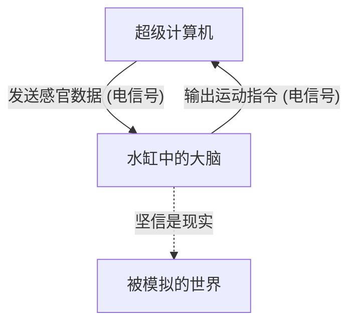
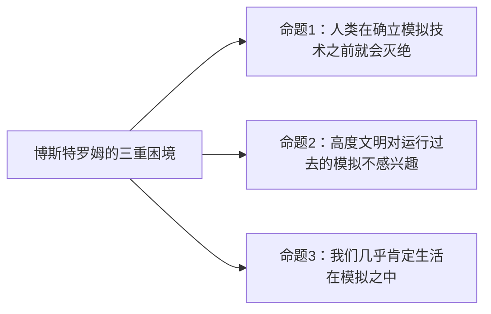

## 引言：现实是什么？

我们每天理所当然地接受的“现实”。早上醒来闻到咖啡的香味，敲击键盘工作，晚上感受着床的柔软入睡。然而，如果这个“现实”是一个精心制作的虚拟现实（模拟），那会怎样呢？

这个问题，从古希腊哲学家柏拉图，到现代量子物理学家和AI研究人员，一直是一个令无数人类智慧着迷的终极谜题。在本文中，我们将从哲学思想实验“缸中之脑（Brain in a vat）”以及基于现代科学和信息论的“模拟假说（Simulation hypothesis）”出发，尽可能深入、多角度地进行考察。

---

## 第1章：思想实验“缸中之脑”的冲击

“缸中之脑（Brain in a vat）”是哲学家希拉里·普特南（Hilary Putnam）在1981年提出的思想实验。然而，其根本问题“我们的认知能在多大程度上被信任”，可以追溯到17世纪勒内·笛卡尔的“恶魔（欺骗之神）”的讨论。

### 1-1. 缸中之脑是什么？

请想象一下。
某天，一位邪恶但天才的科学家将你的大脑完好无损地从你的头骨中取出。这个大脑被放在一个特殊的培养液（水缸）中维持生命。此外，大脑的神经细胞上连接着无数的电极，并与一台巨大且高性能的超级计算机相连。

这台计算机正在向你的大脑完美地模拟并发送包括视觉、听觉、触觉、味觉、嗅觉等所有的感官输入（电信号）。你现在“正在读这篇文章”的视觉信息，以及“坐在椅子上”的触觉，全部都只是计算机计算出并发送到大脑中的电信号而已。

那么，问题来了。
**“你现在能证明自己不是‘缸中之脑’吗？”**

### 1-2. 认识论怀疑主义

这个思想实验之所以可怕，是因为它动摇了我们经验论知识的根基。我们平时因为“亲眼所见”、“能够触摸”，而确信事物的存在。然而，在“缸中之脑”的场景中，因为所有的感官数据都被完美地伪造了，所以仅凭内部的观察（感官经验），在原理上是不可能接触到真正现实的。

这在哲学上被称为“认识论怀疑主义（Epistemological Skepticism）”。笛卡尔提出“我思故我在（Cogito, ergo sum）”，结论是至少正在怀疑的“我”的意识的存在是确定的。但是，“我”所存在的地方，究竟是物理地球上的肉体，还是漂浮在培养液中的大脑，依然是不可知的。

---

## 第2章：在现代复苏的“模拟假说”

“缸中之脑”终究只是一个哲学的思想实验。但进入21世纪，随着信息技术和计算机科学的爆炸性进化，这个问题作为“模拟假说”，开始在更现实、更科学的语境中被讨论。

### 2-1. 尼克·博斯特罗姆的三重困境

2003年，牛津大学哲学家尼克·博斯特罗姆（Nick Bostrom）发表了一篇题为《你生活在计算机模拟中吗？》的震撼性论文。他运用逻辑推论主张，在以下三个命题（三重困境）中，**至少有一个必定为真**。

**【命题1：人类灭绝说】**
在达到能够运行技术奇点（Singularity）或宇宙规模模拟（祖先模拟）的“后人类（Post-human）”阶段之前，人类就已经因为核战争、气候变化、AI失控或未知的宇宙灾难而灭绝的可能性。

**【命题2：不关心说】**
即使人类没有灭绝并达到了后人类阶段，获得了近乎无限的计算能力，他们也可能出于伦理原因，或者单纯因为不感兴趣，而选择不去运行有意识存在（我们）的模拟。

**【命题3：模拟说】**
如果命题1和命题2均为“假”，那么高度文明将会运行无数的“祖先模拟”。虽然现实的宇宙（基础现实）只有一个，但被模拟的宇宙可能存在数百万、数十亿个。因此，从统计学角度来想，在这一瞬间拥有意识的我们，是“唯一基础现实居民”的概率无限接近于零，而几乎可以肯定我们是“数亿个模拟中某一个的居民”。

### 2-2. 来自物理学的方法：宇宙是一台计算机吗？

模拟假说不仅仅停留在概率论上。现代物理学中的一些不可思议的现象，如果假设“宇宙作为信息被处理”，就能得到很好的解释。

1.  **普朗克长度与宇宙的像素化**
    物理学中存在一个有意义的最小长度单位——“普朗克长度（约 $1.6 \times 10^{-35}$ 米）”。这暗示着宇宙的空间可能不是连续的，而是像计算机显示器的“像素”一样具有离散的结构。
2.  **光速的极限**
    为什么光速（时空中信息传递的速度）会有一个上限（约30万公里/秒）？从模拟假说的角度来看，这可以解释为“正在演算这个宇宙的计算机处理器的时钟速度（处理极限）”。
3.  **双缝干涉实验与量子力学的观测问题**
    在量子力学著名的双缝干涉实验中，电子和光子在“未被观测时”以类似波的概率状态存在，而在“被观测的瞬间”位置便作为粒子确定下来。这与电子游戏中的“渲染优化”非常相似。为了节省计算资源，玩家（观测者）没看到的风景不被渲染，而一旦进入视野就立刻详细描绘的系统，与之如出一辙。

---

## 第3章：模拟的分辨率与“逃脱”的可能性

如果我们生活在模拟中，那么它是以何种程度的“分辨率”制作的呢？

### 3-1. 宏观模拟与微观模拟

模拟可以考虑有各种不同的层级。

*   **全宇宙的模拟**：从基本粒子级别到银河系级别，对整个宇宙进行完全演算的情况。这需要无法想象的计算能力（如俄罗斯套娃脑 Matrioshka brain 这种行星规模的计算机），但在理论上并非不可能。
*   **局部模拟**：只对地球及其周边进行高分辨率演算，而将遥远的星系等作为“低分辨率的背景贴图”处理的情况。考虑到我们人类还未能离开太阳系，这也许就足够了。
*   **个体意识的模拟（缸中之脑）**：不是在模拟世界本身，而是只有信息被发送到“你”这一个人的意识中的情况。你周围的人实际上可能是没有内在（意识）的NPC（非玩家角色），也就是“哲学僵尸”（唯我论）。

### 3-2. 寻找模拟的“Bug”

假设我们生活在虚拟现实中，有方法能从内部证明这一点吗？
科学家们正在认真地提议进行寻找宇宙程序中“Bug”或“故障（Glitch）”的实验。

例如，通过高精度地观测宇宙射线，也许能够发现表明空间存在“网格（Grid）”的各向异性。又或者，如果确认了物理常数（如精细结构常数等）随时间发生了微小的变化，那有可能是模拟的“更新”或“舍入误差”的积累。

虽然也存在像科幻作品那样的尝试，将“既视感（Deja vu）”、“曼德拉效应（大众共享与事实不符的记忆的现象）”或者超自然现象解释为模拟的故障，但这些还没有达到科学证明的程度。

---

## 第4章：如果我们是模拟的居民会怎样？（哲学与伦理的影响）

如果模拟假说是真实的，我们生存的意义和伦理观会发生怎样的改变呢？

### 4-1. 摆脱虚无主义

当得知“一切都是被创造的虚拟现实”时，许多人可能会陷入“那么，做什么都是没有意义的”的虚无主义（Nihilism）。但真的是这样吗？

《黑客帝国》中的角色塞弗，即使知道那是虚拟现实，也为了享受牛排的美味而选择回到模拟之中。我们所感受到的“喜悦”、“悲伤”、“爱”、“痛苦”等主观经验（感质，Qualia），无论世界是物理的还是信息的，对我们自身而言都是**不容置疑的现实**。

不能因为身处模拟内部，我们情感和经验的价值就会下降。如果世界是由信息构建的，我们也可以认为，我们的意识和行动本身就是宇宙这个宏大程序的一部分，并且拥有着独一无二的价值。

### 4-2. 模拟者（造物主）的存在

在某种意义上，模拟假说也可以被称为现代的“神之存在证明”。这意味着有一个正在编程并运行这个宇宙的上位存在（程序员）。

他们究竟是为了什么目的而运行这个世界的呢？
*   验证历史？
*   社会学实验？
*   或者，仅仅是娱乐（电子游戏）？

如果我们在模拟中开发了AI，而这个AI又进一步创造了模拟，就会产生“模拟的多重结构（嵌套结构）”。我们到底是在最底层，还是在中间层呢？

---

## 结论：抱着谜团生存的“现实”

“缸中之脑”和“模拟假说”，在现阶段是既无法肯定也无法否定的“不可证伪的假说”。科学技术越进步，对宇宙深渊窥探得越深，这个世界就越是开始展现出其信息化的、不可思议的姿态。

我们触及真相的那一天会到来吗？也许，只有当我们转为执行模拟的一方——完成通用人工智能（AGI），并在虚拟世界中创造出拥有意识的存在时——才能首次触及这个世界的真理。

在此之前，无论这个世界是基础现实，还是超高维度的模拟，享受眼前一杯咖啡的香气并好好生活，也许才是面对“现实”最明智的方式。
