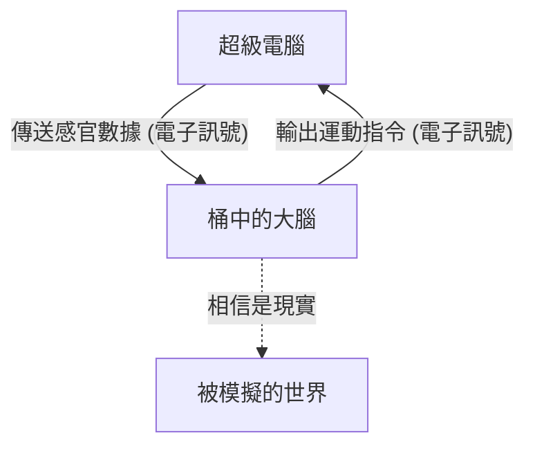
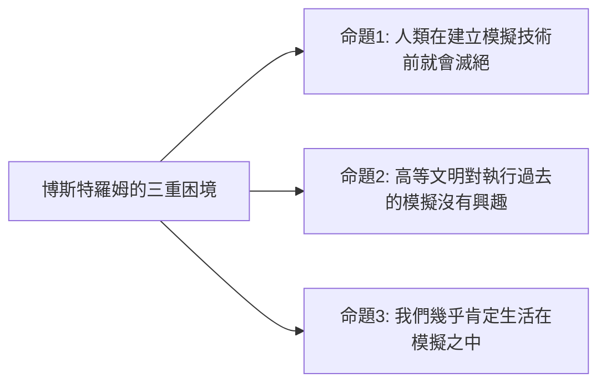

## 前言：現實究竟是什麼？

我們每天理所當然地接受著「現實」。早晨醒來聞到咖啡的香氣，敲擊鍵盤工作，夜晚感受著床鋪的柔軟入睡。然而，如果這個「現實」是一個精心製作的虛擬實境（模擬），那會怎麼樣呢？

這個問題從古希臘哲學家柏拉圖，到現代的量子物理學家與人工智慧研究者，一直是令人類智慧著迷的終極謎團。本篇文章將從哲學的思想實驗「桶中之腦（Brain in a vat）」，以及基於現代科學與資訊理論的「模擬假說（Simulation hypothesis）」，盡可能深入且多角度地進行探討。

---

## 第1章：思想實驗「桶中之腦」的衝擊

「桶中之腦（Brain in a vat）」是哲學家希拉蕊·普特南（Hilary Putnam）於1981年提出的思想實驗。然而，其根基中的「我們的認知到底有多可靠？」這個問題，可以追溯到17世紀勒內·笛卡兒的「惡魔（欺騙的上帝）」之爭論。

### 1-1. 桶中之腦是什麼？

請想像一下。
某天，一位邪惡但天才的科學家，將你的大腦從頭骨中完好無缺地取出。這個大腦被放入一個裝有特殊培養液的容器（桶）中，以維持生命。接著，大腦的神經細胞被連接上無數的電極，並連接著一台巨大且高性能的超級電腦。

這台電腦對你的大腦完美地模擬並傳送了視覺、聽覺、觸覺、味覺、嗅覺等所有的感官輸入（電子訊號）。你現在「正在閱讀這篇文章」的視覺資訊，以及「坐在椅子上」的觸覺，全都只不過是電腦計算後傳送進大腦的電子訊號罷了。

那麼，問題來了。
**「你現在能證明自己不是『桶中之腦』嗎？」**

### 1-2. 認識論上的懷疑主義

這個思想實驗之所以可怕，是因為它動搖了我們經驗主義知識的根基。我們平時會因為「親眼所見」、「能夠觸摸」等理由，而確信事物的存在。然而，在「桶中之腦」的情境中，所有的感官數據都被完美地偽造了，因此僅憑內部的觀察（感官經驗），在原理上是不可能接觸到真正的現實的。

這在哲學術語中被稱為「認識論的懷疑主義（Epistemological Skepticism）」。笛卡兒以「我思故我在（Cogito, ergo sum）」為結論，認為至少正在懷疑的「我」的意識存在是確定的。但是，「我」所在的地方，到底是地球上的物理身體，還是漂浮在培養液中的大腦，依然是不可知的。

---

## 第2章：在現代甦醒的「模擬假說」

「桶中之腦」終究只是一個哲學上的思想實驗。然而進入21世紀後，隨著資訊技術與電腦科學的爆發性發展，這個問題作為「模擬假說」，開始在更現實且科學的語境下被討論。

### 2-1. 尼克·博斯特羅姆的三重困境

2003年，牛津大學的哲學家尼克·博斯特羅姆（Nick Bostrom）發表了一篇名為「你生活在電腦模擬中嗎？」的震撼性論文。他運用邏輯推論主張，在以下的3個命題（三重困境）中，**至少有1個必然為真**。

**【命題1：人類滅絕說】**
在到達能夠執行技術奇異點（Singularity）或宇宙規模模擬（祖先模擬）的「後人類」階段之前，人類可能會因為核戰、氣候變遷、AI失控或未知的宇宙災難而滅絕。

**【命題2：漠不關心說】**
即使人類沒有滅絕並到達了後人類階段，獲得了近乎無限的運算能力，他們也可能因為倫理上的原因，或是單純沒有興趣，而不去執行具有意識存在（我們）的模擬。

**【命題3：模擬說】**
如果命題1和命題2皆為「假」，那麼高等文明將會執行無數的「祖先模擬」。現實的宇宙（基礎現實）只有1個，但被模擬出來的宇宙可能存在數百萬、數十億個。因此，從統計學的角度來看，此時此刻擁有意識的我們，是「唯一基礎現實居民」的機率微乎其微，幾乎可以肯定我們是「數億個模擬中某一個的居民」。

### 2-2. 物理學的切入點：宇宙是一台計算機嗎？

模擬假說不只停留在單純的機率論。現代物理學中一些令人費解的現象，如果假設「宇宙是作為資訊在處理的」，有時就能獲得很好的解釋。

1.  **普朗克長度與宇宙的像素化**
    物理學中存在一個名為「普朗克長度（約 $1.6 \times 10^{-35}$ 公尺）」的單位，這是有意義的最小長度單位。這暗示了宇宙的空間可能不是連續的，而是像電腦螢幕的「像素」一樣具有離散的結構。
2.  **光速的極限**
    為什麼光速（時空中資訊傳遞的速度）會有上限（約30萬km/s）呢？從模擬假說的觀點來看，這可以被解釋為「運算這個宇宙的電腦處理器的時脈速度（處理極限）」。
3.  **雙狹縫實驗與量子力學的觀測問題**
    在量子力學著名的雙狹縫實驗中，電子或光子在「未被觀測時」像波一樣以機率狀態存在，而在「被觀測的瞬間」位置才作為粒子確定下來。這與電子遊戲中的「渲染優化」非常相似。玩家（觀測者）沒看到的風景為了節省運算資源而不被渲染，只在進入視線的瞬間才被詳細描繪，這兩個系統驚人地相似。

---

## 第3章：模擬的解析度與「逃脫」的可能性

如果我們在模擬之中，那麼它是以多高的「解析度」被製作出來的呢？

### 3-1. 宏觀模擬與微觀模擬

模擬可以考慮到各種不同的層級。

*   **全宇宙的模擬**：從基本粒子層級到銀河系層級，完全運算整個宇宙的情況。這需要超乎想像的運算能力（例如俄羅斯套娃腦 Matrioshka brain 這種行星規模的電腦），但在理論上並非不可能。
*   **局部模擬**：只以高解析度運算地球及其周邊，而將遙遠的星系等作為「低解析度背景貼圖」來處理的情況。考慮到我們人類還沒有到達太陽系之外，這或許已經足夠了。
*   **個體意識的模擬（桶中之腦）**：並非模擬世界本身，而是資訊只傳送給「你」這一個意識的情況。你周圍的人們，實際上可能都是沒有內在（意識）的NPC（非玩家角色），也就是「哲學殭屍」（唯我論）。

### 3-2. 尋找模擬的「Bug」

假設我們生活在虛擬實境中，有什麼方法可以從內部證明這一點嗎？
科學家們正在認真地提議尋找宇宙程式中的「Bug」或「Glitch（故障）」的實驗。

例如，透過高精度地觀測宇宙射線，或許能發現顯示空間「網格（Grid）」存在的各向異性。或者，如果能確認物理常數（如精細結構常數等）隨著時間產生了微小的變化，這就有可能是模擬的「更新」或「捨入誤差」的累積。

雖然也存在用科幻的方式將「既視感（Deja vu）」、「曼德拉效應（大眾共享與事實不符的記憶的現象）」或超自然現象解釋為模擬故障的說法，但這些尚未得到科學上的證明。

---

## 第4章：如果我們是模擬的居民？（哲學與倫理的影響）

如果模擬假說是真的，我們生存的意義和倫理觀將會如何改變？

### 4-1. 擺脫虛無主義

當知道「一切都是被創造出來的虛擬實境」時，許多人可能會陷入「那麼做什麼都沒有意義」的虛無主義（Nihilism）。但是，真的是這樣嗎？

《駭客任務》中的角色賽佛在知道是虛擬實境的情況下，為了享受牛排的美味，依然選擇回到模擬之中。我們所感受到的「喜悅」、「悲傷」、「愛」、「痛苦」等主觀經驗（感質），無論世界是物理的還是資訊的，對我們自身來說都是**毋庸置疑的現實**。

就算在模擬的內部，我們的情感和經驗的價值也不會因此降低。如果世界是由資訊建構的，那麼我們的意識和行為本身，就是宇宙這個宏大程式的一部分，也可以認為具有其獨特的價值。

### 4-2. 模擬者（造物主）的存在

模擬假說在某種意義上也可以說是現代的「神的存在證明」。這意味著存在著編寫並執行這個宇宙的高位存在（程式設計師）。

他們運行這個世界的目的是什麼？
*   驗證歷史？
*   社會學實驗？
*   還是單純的娛樂（電子遊戲）？

如果我們在模擬中開發出AI，而這個AI又進一步創造出模擬，就會產生「模擬的多重結構（嵌套結構）」。我們是處於最底層，還是中間層呢？

---

## 結論：帶著謎團生活下去的「現實」

「桶中之腦」和「模擬假說」在現階段都是既無法肯定也無法否定的「不可證偽的假說」。隨著科學技術的進步，當我們越是窺探宇宙的深淵，這個世界就越開始展現出資訊化且不可思議的樣貌。

我們到達真理的那一天會到來嗎？或許，當我們成為執行模擬的一方——完成通用人工智慧（AGI），並在虛擬世界中創造出擁有意識的存在時——我們才能首次觸及這個世界的真理。

在那之前，無論這個世界是基礎現實，還是超高度的模擬，享受眼前一杯咖啡的香氣並生活下去，或許才是面對「現實」最明智的方式吧。
