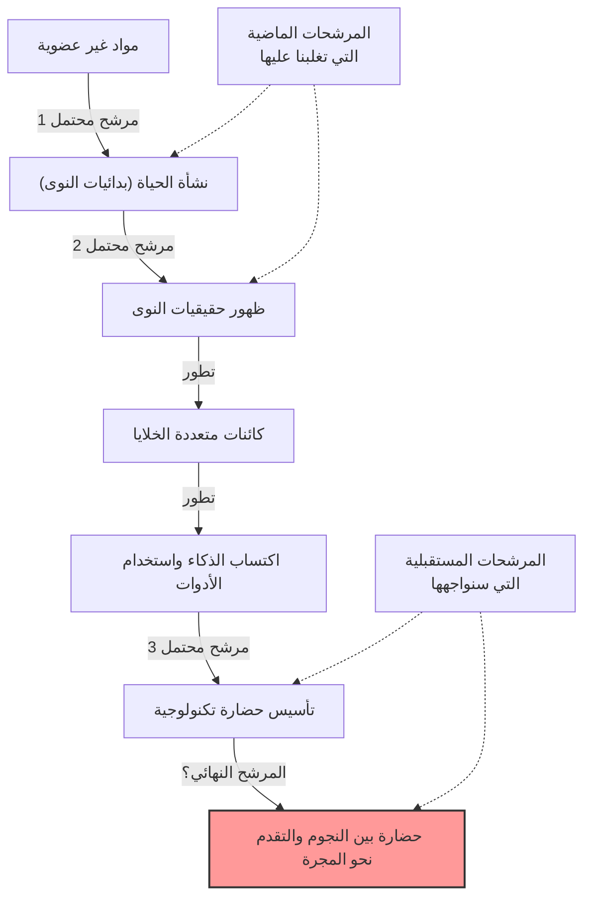
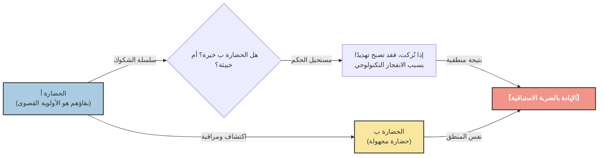

# مقدمة: "أين الجميع؟"

صيف عام 1950، في كافتيريا مختبر لوس ألاموس الوطني، كان الحائز على جائزة نوبل في الفيزياء إنريكو فيرمي يتناول الغداء مع زملائه الفيزيائيين (إدوارد تيلر، هربرت يورك، وإميل كونوبينسكي). كان موضوع حديثهم يدور حول تقارير مشاهدة الأجسام الطائرة المجهولة (UFO) التي كانت تتصدر وسائل الإعلام في ذلك الوقت، وإمكانية وجود مركبات فضائية أسرع من الضوء.

انتقل الحديث إلى موضوع آخر، وبعد فترة، سأل فيرمي فجأة وبدون مقدمات:

**"أين الجميع؟ (Where is everybody?)"**

أدرك زملاؤه على الفور أنه كان يتحدث عن الفضائيين. كان عقل فيرمي معروفًا بقدرته الهائلة على الحساب. خلال وقت الغداء القصير، كان قد قدر بشكل تقريبي عمر الكون، وعدد النجوم في مجرة درب التبانة، واحتمالية نشأة الحياة، والوقت الذي تستغرقه حضارة ما لتطوير تكنولوجيا السفر بين النجوم.

كان الاستنتاج الذي أظهرته حساباته واضحًا: **"كان ينبغي للحضارات خارج كوكب الأرض أن تزور الأرض منذ زمن طويل"**. ولكن في الواقع، لا يوجد أي دليل واضح على ذلك. هذا التناقض بين "الاحتمالية الحسابية العالية" و"الافتقار إلى الأدلة الواقعية" هو بالضبط ما سيُعرف لاحقًا باسم **"مفارقة فيرمي"**، وهو أحد أكبر الألغاز في علم الفلك وعلم الأحياء الفلكي الحديث.

في هذا المقال، سنتعمق في تفاصيل مفارقة فيرمي، بدءًا من خلفيتها وحتى الإجابات (الفرضيات) المختلفة التي يقدمها العلم الحديث. دعونا ننطلق في رحلة فكرية لفهم حجم الكون وإعادة النظر في مكانة البشرية.

---

# الفصل الأول: مقياس الكون ومعادلة دريك

يكمن في صميم مفارقة فيرمي حقيقة أن "الكون شاسع للغاية وقديم جدًا". أولاً، دعونا نحاول فهم حجم الكون الذي نعيش فيه بالأرقام.

## الأعداد والزمن الهائلان

يُقدر أن هناك حوالي 2 تريليون مجرة في الكون الذي يمكننا رصده. وتحتوي كل مجرة في المتوسط على ما بين 100 مليار إلى 400 مليار نجم. وهذا يعني أن الكون بأكمله يحتوي على حوالي $10^{24}$ نجم، وهو عدد يفوق بكثير جميع حبات الرمل الموجودة على كوكب الأرض مجتمعة.

في السنوات الأخيرة، أظهرت الملاحظات التي قامت بها تلسكوبات مثل تلسكوب كيبلر الفضائي أن العديد من هذه النجوم تمتلك كواكب، وأن نسبة كبيرة منها عبارة عن كواكب صخرية تشبه الأرض تقع في "المنطقة الصالحة للسكن" (المنطقة التي يمكن أن يوجد فيها الماء السائل). وبتقدير متحفظ، يوجد في مجرتنا درب التبانة وحدها من مليارات إلى عشرات المليارات من الكواكب المرشحة لتكون "أرضًا ثانية".

علاوة على ذلك، دعونا نفكر في مقياس الزمن. يبلغ عمر الكون حوالي 13.8 مليار سنة، وعمر الأرض حوالي 4.6 مليار سنة. لم يمر سوى بضعة آلاف من السنين منذ أن أسست البشرية حضارتها، وما يزيد قليلاً عن 100 عام منذ أن بدأنا في استخدام الموجات الراديوية للاتصالات. ماذا لو نشأت الحياة وبنت حضارة على كوكب ولد قبل الأرض بمليار سنة؟ المليار سنة هو وقت هائل يكفي لتكرار تاريخ التطور البشري آلاف المرات. لا بد أن تقنيتهم قد وصلت إلى مستوى يفوق خيالنا (على سبيل المثال، بناء غلاف دايسون أو استعمار المجرة بأكملها).

## معادلة دريك

عند مناقشة احتمالية وجود حياة ذكية خارج كوكب الأرض، فإن "معادلة دريك" تظهر دائمًا. ابتكر عالم الفلك فرانك دريك هذه المعادلة في عام 1961 لتقدير عدد الحضارات خارج كوكب الأرض ($N$) الموجودة في مجرتنا والتي يمكن للبشرية التواصل معها.

يتم التعبير عن المعادلة بضرب العناصر التالية:

$$ N = R_* \times f_p \times n_e \times f_l \times f_i \times f_c \times L $$

*   $R_*$ : معدل ولادة النجوم في المجرة
*   $f_p$ : نسبة تلك النجوم التي تمتلك أنظمة كوكبية
*   $n_e$ : عدد الكواكب في ذلك النظام الكوكبي التي تتمتع ببيئة صالحة لدعم الحياة
*   $f_l$ : نسبة الكواكب التي تنشأ عليها الحياة بالفعل
*   $f_i$ : نسبة الحياة التي تتطور إلى حياة ذكية
*   $f_c$ : نسبة الحياة الذكية التي تمتلك تكنولوجيا للاتصال بين النجوم
*   $L$ : المدة الزمنية التي تستمر فيها مثل هذه الحضارة التكنولوجية

الميزة الكبرى لهذه المعادلة ليست في "إعطاء إجابة"، بل في "توضيح العناصر التي ينبغي مناقشتها". بالنسبة للجانب الأيسر من المعادلة ($R_*$, $f_p$, $n_e$)، أصبح من الممكن استنتاج قيم دقيقة للغاية بفضل التقدم في علم الفلك. ومع ذلك، لا يزال الجانب الأيمن ($f_l$, $f_i$, $f_c$, $L$) في مجال التكهنات.

جادل علماء الفلك المتفائلون (مثل كارل ساغان) بوجود ملايين الحضارات في المجرة. من ناحية أخرى، من وجهة نظر متشائمة، يمكن أن تكون النتيجة $N=1$ (أي البشرية فقط). ولكن إذا كان $N$ كبيرًا جدًا، فإننا نعود إلى سؤال فيرمي مرة أخرى: "أين الجميع؟"

---

# الفصل الثاني: العديد من الفرضيات لتفسير الصمت

يمكن تصنيف الإجابات على مفارقة فيرمي على نطاق واسع إلى ثلاث فئات.

1.  **هم غير موجودين في المقام الأول** (الحياة خارج الأرض، أو الحياة الذكية نادرة للغاية)
2.  **هم موجودون، لكننا لم نستطع استشعارهم** (اختلاف طرق الاتصال، حاجز المسافة، الصمت المتعمد، إلخ)
3.  **لقد جاءوا بالفعل إلى الأرض، لكننا لا ندرك ذلك** (أو يتم التستر على ذلك)

دعونا نتعمق في الفرضيات النموذجية لكل فئة.

## الفئة 1: هم غير موجودين في المقام الأول

### فرضية الأرض النادرة (Rare Earth Hypothesis)

تجادل هذه الفرضية بأن أشكال الحياة البسيطة مثل الميكروبات قد تكون شائعة في الكون، ولكن تطور حياة ذكية معقدة مثل البشر يتطلب تضافر ظروف فلكية وجيولوجية نادرة للغاية.

*   **وجود المشتري:** إن وجود كوكب غازي عملاق مثل المشتري في الموقع المناسب يعمل كدرع للكويكبات والمذنبات التي تسقط على الأرض، ويمنع الاصطدامات الكارثية التي قد تقضي على الحياة.
*   **وجود قمر عملاق:** إن وجود قمر كبير بشكل غير متناسب مقارنة بالأرض يحافظ على استقرار ميل محور دوران الأرض (حوالي 23.4 درجة)، ويحافظ على تغير مناخي معتدل وفصول أربعة.
*   **تكتونية الصفائح والمغناطيسية الأرضية:** حركة الصفائح النشطة تعزز دورة الكربون وتحافظ على تأثير الاحتباس الحراري بشكل مناسب. بالإضافة إلى ذلك، يحمي المجال المغناطيسي القوي الغلاف الجوي والحياة من الرياح الشمسية والأشعة الكونية.
*   **خصائص النجم:** نجوم النسق الأساسي من النوع G مثل شمسنا لها عمر طويل بشكل مناسب (حوالي 10 مليار سنة) وانبعاث طاقة مستقر. النجوم القزمة الحمراء (النجوم من النوع M)، وهي الأكثر وفرة في الكون، لها نشاط توهج مفرط وكواكبها قد تكون مقفلة مديا (توجه دائمًا نفس الوجه للنجم)، مما قد يجعلها بيئة قاسية لتطور الحياة.

الفكرة هي أن احتمالية توافر جميع هذه "الظروف المعجزة" منخفضة من الناحية الفلكية، ولذلك فإن البشرية وحيدة.

### نظرية المرشح العظيم (The Great Filter)

تعتبر نظرية "المرشح العظيم"، التي اقترحها روبن هانسون في عام 1996، واحدة من أكثر الإجابات رعباً وإقناعاً لمفارقة فيرمي.

تعتمد الفكرة على وجود "جدار (مرشح) عظيم" يصعب للغاية التغلب عليه في العملية من نشأة الحياة إلى التطور لتصبح حضارة بين النجوم.

النقطة المهمة هي: **"هل هذا المرشح في ماضينا، أم في مستقبلنا؟"**

*   **المرشح كان في الماضي (نحن الناجون المحظوظون):**
    ربما كان أصل الحياة (التولد التلقائي) بحد ذاته حدثًا معجزة. أو ربما كانت عملية التطور من بدائيات النوى البسيطة إلى حقيقيات النوى ذات الهياكل المعقدة مثل الميتوكوندريا حدثًا نادرًا في تاريخ الكون (استغرقت هذه الخطوة حوالي 2 مليار سنة على الأرض). إذا كان الأمر كذلك، فإن البشرية هي واحدة من أكثر الأنواع تقدماً في الكون.
*   **المرشح في المستقبل (نحن نتجه نحو الهلاك):**
    هذه نظرة قاتمة للغاية. الفرضية هي أنه حتى لو كان ظهور الحياة وتأسيس حضارة ذكية أمرًا شائعًا نسبيًا، فإن الحضارة ستدمر نفسها حتماً قبل الوصول إلى "حضارة بين النجوم" التي تليها. حرب نووية، ذكاء اصطناعي خارج عن السيطرة، تغير المناخ، أو تهديد مادي غير معروف لم ندركه بعد، ربما مقدر للحضارة أن تدمر نفسها عندما تصل إلى مستوى معين.

يجادل بعض العلماء بأنه إذا تم العثور على حفريات لكائنات وحيدة الخلية على كوكب المريخ مثلاً، فهذا يعني أن "نشأة الحياة ليست هي المرشح"، مما يزيد من احتمالية أن يكون المرشح ينتظرنا في "مستقبلنا"، وسيكون هذا أسوأ خبر بالنسبة للبشرية.

---

## الفئة 2: هم موجودون، لكننا لم نستطع استشعارهم

هذه مجموعة من الفرضيات التي تفيد بوجود العديد من الحضارات، ولكن لأسباب مختلفة لم نتمكن من العثور عليها، أو أنهم يتجنبون الاتصال بنا عمدًا.

### كون واسع جداً ووقت قصير جداً

الفضاء الكوني أوسع بكثير من حدسنا. النجم المجاور لنا، بروكسيما سنتوري، يستغرق الوصول إليه حوالي 4.2 سنة حتى بسرعة الضوء. بسرعة المسابير الأرضية الحالية (مثل فوياجر)، هي مسافة تستغرق عشرات الآلاف من السنين.

كما يوجد حاجز "الزمن". لقد مر حوالي 100 عام منذ أن بدأت البشرية في استخدام الاتصالات الراديوية. بمعنى آخر، وصلت موجات الراديو من الأرض فقط إلى دائرة نصف قطرها 100 سنة ضوئية. بما أن قطر مجرة درب التبانة يبلغ حوالي 100,000 سنة ضوئية، فإن المنطقة التي أعلنا فيها عن وجودنا ليست سوى نقطة صغيرة جدًا في المجرة بأكملها.
إذا افترضنا أن عمر الحضارة يمتد لعدة آلاف أو عشرات الآلاف من السنين، فربما يكون احتمال تزامن وجود حضارتين "في نفس الوقت" خلال تاريخ الكون البالغ 13.8 مليار سنة، وقدرتهما على التقاط إشارات بعضهما البعض، احتمالاً ضئيلاً للغاية.

### عدم تطابق تكنولوجي

في بحثنا عن ذكاء خارج كوكب الأرض (SETI)، نستخدم موجات الراديو في المقام الأول للبحث عن الفضائيين. لكن هذا لمجرد أننا اكتشفنا موجات الراديو مؤخرًا.

بالنسبة لحضارة متقدمة للغاية، قد يُنظر إلى الاتصال باستخدام موجات الراديو على أنه بدائي وغير فعال، مثل "إشارات الدخان" أو "الهاتف الخيطي". ربما يستخدمون قنوات اتصال مبنية على قوانين فيزيائية غير معروفة لا يمكننا حتى اكتشافها حتى الآن، مثل اتصالات النيوترينو، موجات الجاذبية، أو الاتصالات الأسرع من الضوء باستخدام التشابك الكمي (على الرغم من نفيها فيزيائيًا، كافتراض). بينما نبحث نحن يائسين عن إشارات الدخان في الظلام، فإنهم في حالة أشبه بالاتصال عبر الألياف الضوئية.

### فرضية حديقة الحيوان (Zoo Hypothesis)

هذه الفرضية، التي اقترحها جون بول في عام 1973، تقترح أن "الحضارات الفضائية المتقدمة تدرك وجود الأرض، لكنها تتجنب التدخل عمدًا لمراقبة تطور البشرية بشكل طبيعي".

الفكرة هي أنه يتم التعامل مع الأرض كنوع من "حديقة حيوان معزولة" أو "محمية"، تمامًا كما نراقب نحن الحيوانات البرية في محمية طبيعية. إنه نفس مفهوم "التوجيه الأساسي" (Prime Directive: يجب عدم التدخل في الحضارات الأقل تطورًا) الذي يظهر في ستار تريك. ربما سيتصلون بنا فقط عندما تصل البشرية إلى النضج الأخلاقي والتكنولوجي الكافي (على سبيل المثال، تأسيس حكومة عالمية دون تدمير أنفسنا، أو تطوير تكنولوجيا السفر بين النجوم).

### فرضية الغابة المظلمة (Dark Forest Theory)

هذه هي الفرضية الأكثر رعباً وقسوة، والتي اشتهرت بفضل سلسلة روايات الخيال العلمي "مشكلة الأجسام الثلاثة" للكاتب الصيني ليو تسي شين، التي حققت مبيعات عالمية. تُشبّه هذه الفرضية الكون بـ "غابة مظلمة حيث يختبئ جميع الصيادين وهم يحبسون أنفاسهم".

كنوع من البديهيات الاجتماعية في الكون، تفترض هذه النظرية ما يلي:
1.  بالنسبة لجميع الحضارات، البقاء هو الأولوية القصوى.
2.  الكمية الإجمالية للمادة في الكون ثابتة، وتسعى الحضارات باستمرار للتوسع والتطور.

يضاف إلى ذلك مفهوم "سلسلة الشكوك" حيث تجعل المسافات الشاسعة بين النجوم من المستحيل فهم نوايا بعضنا البعض بشكل صحيح، ومفهوم "الانفجار التكنولوجي" حيث تقفز التكنولوجيا بشكل مفاجئ.

لنفترض أن حضارة ما (أ) اكتشفت حضارة أخرى (ب). بالنسبة للحضارة أ، لا توجد طريقة لمعرفة ما إذا كانت الحضارة ب ودية أم معادية. حتى لو كان المستوى التكنولوجي للحضارة ب منخفضًا الآن، لا يُعرف متى ستشهد "انفجارًا تكنولوجيًا" يتفوق على الحضارة أ ويصبح تهديدًا لها.
لذلك، فإن الخيار الأكثر عقلانية وأمانًا لضمان بقائها هو **"بمجرد اكتشاف حضارة أخرى، تدميرها على الفور قبل أن يلاحظها الطرف الآخر"**.

وفقًا لهذه النظرية، فإن سبب صمت الكون واضح. فإما أن أي حضارة غبية تبث موجات راديو بإهمال وتعلن عن موقعها (مثل الأرض) سيتم محوها بسرعة، أو أن جميع الحضارات الحكيمة تختبئ في الظلام وتحبس أنفاسها.

### فرضية المحاكاة

هذه الفرضية تشير إلى أن الكون الذي نعيش فيه هو مجرد محاكاة حاسوبية أنشأها كائن أعلى (حضارة متقدمة جداً أو ذكاء اصطناعي). يناقش فلاسفة مثل نيك بوستروم من جامعة أكسفورد هذا الأمر بجدية.

إذا كنا سكان محاكاة، فلن نلتقي بفضائيين إلا إذا قام المبرمج ببرمجة "فضائيين آخرين" داخل هذه المحاكاة. إذا كان هذا العالم عبارة عن صندوق رمل مصمم فقط للبشرية، فإن صمت الكون هو النتيجة الطبيعية.

---

# الفصل الثالث: الآفاق المستقبلية وتحديات البشرية

لا يزال العلماء في جميع أنحاء العالم يتحدون مفارقة فيرمي بأساليب مختلفة.

## البحث عن التوقيعات التكنولوجية

كان برنامج SETI التقليدي يبحث عن إشارات اتصال متعمدة (موجات الراديو)، ولكن في السنوات الأخيرة كان هناك نشاط متزايد للبحث عن "التوقيعات التكنولوجية (technosignatures)" (آثار التكنولوجيا).
على سبيل المثال، إذا كان هناك "غلاف دايسون" تبنيه حضارة متقدمة لتسخير كل طاقة نجمها، فمن المفترض أن يتم رصد إشعاع الأشعة تحت الحمراء غير العادي من هذا النجم. تمتلك أحدث أدوات المراقبة مثل تلسكوب جيمس ويب الفضائي (JWST) القدرة على تحليل مكونات الغلاف الجوي للكواكب الخارجية البعيدة والبحث عن الغازات الصناعية (مثل غاز الفريون) أو آثار الضوء الاصطناعي التي لا يمكن أن تحدث بشكل طبيعي.

نحن لا ننتظر "أن يتحدثوا إلينا"، بل نحاول بنشاط إيجاد "دليل على أنهم يعيشون هناك".

## ما تطرحه المفارقة علينا

مفارقة فيرمي ليست مجرد تجربة فكرية من الخيال العلمي. إنها تساؤل قوي حول بقاء البشرية ومستقبلها.

إذا كان "المرشح العظيم" يكمن في المستقبل، فنحن نواجه حاليًا مخاطر وجودية (Existential Risk) خلقناها بأنفسنا، مثل تغير المناخ، وتهديد الأسلحة النووية، والتحكم في الذكاء الاصطناعي. إذا لم نتمكن من التغلب على هذه المخاطر، فإن البشرية ستكون مجرد واحدة من عدد لا يحصى من "الحضارات الفاشلة" التي اختفت في صمت الكون.

على العكس من ذلك، إذا كانت فرضية الأرض النادرة صحيحة، وأن البشرية هي الذكاء الوحيد الذي ولد بأعجوبة في هذا الكون الشاسع، فإن علينا مسؤولية لا تُحصى. بصفتنا كائنات تجلب الوعي الذاتي للكون، قد يكون لدينا مهمة الحفاظ على شعلة الوعي حية، ونشرها في المستقبل، وإلى النجوم يومًا ما.

إن الجملة العابرة لإنريكو فيرمي، "أين الجميع؟"، لا تزال تتألق حتى بعد مرور أكثر من 70 عامًا كواحدة من أهم الأسئلة في تاريخ البشرية، مما يجعلنا نفكر بعمق في من نحن وإلى أين يجب أن نتجه.

هل صمت الكون تحذير لنا، أم هو حدود شاسعة تنتظرنا لاتخاذ خطوتنا الأولى؟ الإجابة على ذلك تعتمد على اختيارات البشرية في المستقبل.
