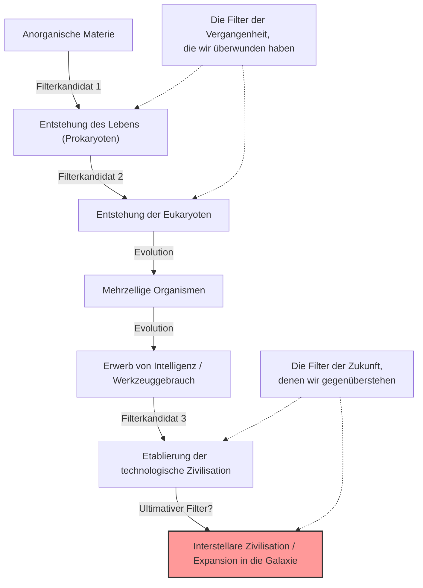
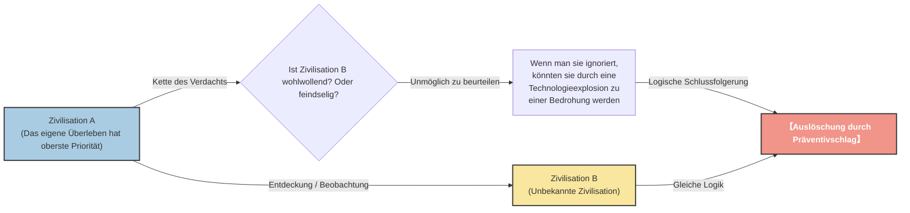

# Prolog: "Wo sind sie alle?"

Im Sommer 1950 aß der Nobelpreisträger für Physik, Enrico Fermi, in der Cafeteria des Los Alamos National Laboratory mit seinen Physiker-Kollegen (Edward Teller, Herbert York und Emil Konopinski) zu Mittag. Ihr Thema waren UFO-Sichtungen, die damals in den Medien für Aufsehen sorgten, und die Möglichkeit von Raumschiffen, die schneller als das Licht fliegen können.

Nachdem das Gespräch zu einem anderen Thema übergegangen war und einige Zeit vergangen war, fragte Fermi plötzlich ohne jeden Zusammenhang:

**"Wo sind sie alle? (Where is everybody?)"**

Seine Kollegen verstanden sofort, dass er von Außerirdischen sprach. Fermis Verstand war für seine erstaunliche Rechenleistung bekannt. Während der kurzen Zeit des Mittagessens hatte er grob das Alter des Universums, die Anzahl der Sterne in der Galaxie, die Wahrscheinlichkeit der Entstehung von Leben und die Zeit abgeschätzt, bis eine Zivilisation die Technologie für interstellare Raumfahrt entwickelt.

Die Schlussfolgerung seiner Berechnungen war klar. **"Außerirdische Zivilisationen hätten die Erde schon vor langer Zeit besuchen müssen"**. In der Realität gibt es jedoch überhaupt keine eindeutigen Beweise dafür. Dieser Widerspruch zwischen "hoher berechneter Wahrscheinlichkeit" und "Fehlen realer Beweise" ist eines der größten Rätsel der modernen Astronomie und Astrobiologie, das später als das **"Fermi-Paradoxon"** bekannt wurde.

In diesem Artikel werden wir tief in dieses Fermi-Paradoxon eintauchen, von seinen Hintergründen bis hin zu den verschiedenen Antworten (Hypothesen), die die moderne Wissenschaft bietet. Begeben wir uns auf eine intellektuelle Reise, um die Maßstäbe des Universums zu verstehen und den Platz der Menschheit neu zu bewerten.

---

# Kapitel 1: Die Maßstäbe des Universums und die Drake-Gleichung

Die Grundlage des Fermi-Paradoxons ist die Tatsache, dass "das Universum viel zu groß und zu alt ist". Lassen Sie uns zunächst die Ausmaße dieses Universums, in dem wir leben, in Zahlen erfassen.

## Überwältigende Anzahl und Zeit

Es wird geschätzt, dass es in unserem beobachtbaren Universum etwa 2 Billionen Galaxien gibt. Und jede Galaxie enthält im Durchschnitt 100 bis 400 Milliarden Sterne. Das bedeutet, dass es im gesamten Universum weitaus mehr Sterne gibt als alle Sandkörner auf der Erde zusammen, nämlich etwa $10^{24}$ Sterne.

In den letzten Jahren haben Beobachtungen von Weltraumteleskopen wie Kepler gezeigt, dass viele dieser Sterne von Planeten begleitet werden und ein erheblicher Teil davon erdähnliche Planeten sind, die sich in der "habitablen Zone" (dem Bereich, in dem flüssiges Wasser existieren kann) befinden. Selbst konservativ geschätzt, gibt es allein in unserer Milchstraße Dutzende bis Hunderte von Milliarden Kandidaten für eine "zweite Erde".

Betrachten wir außerdem den Zeitrahmen. Das Alter des Universums beträgt etwa 13,8 Milliarden Jahre, das Alter der Erde etwa 4,6 Milliarden Jahre. Es ist nur wenige tausend Jahre her, dass die Menschheit eine Zivilisation aufgebaut hat, und erst etwas mehr als 100 Jahre, seit wir begonnen haben, mit Radiowellen zu kommunizieren. Was wäre, wenn auf einem Planeten, der eine Milliarde Jahre früher als die Erde entstand, Leben gekeimt und eine Zivilisation aufgebaut hätte? Eine Milliarde Jahre ist eine so überwältigende Zeitspanne, dass die Evolutionsgeschichte der Menschheit Tausende von Malen wiederholt werden könnte. Ihre Technologie muss ein für uns unvorstellbares Niveau erreicht haben (z. B. der Bau von Dyson-Sphären oder die Kolonisierung der gesamten Galaxie).

## Die Drake-Gleichung

Wenn über die Wahrscheinlichkeit der Existenz von außerirdischem intelligentem Leben diskutiert wird, taucht unweigerlich die "Drake-Gleichung" auf. Diese Gleichung, die 1961 vom Astronomen Frank Drake entwickelt wurde, dient zur Schätzung der Anzahl ($N$) von außerirdischen Zivilisationen in unserer Galaxie, mit denen die Menschheit kommunizieren kann.

Die Gleichung wird als Multiplikation der folgenden Elemente ausgedrückt:

$$ N = R_* \times f_p \times n_e \times f_l \times f_i \times f_c \times L $$

*   $R_*$ : Die Rate der Sternentstehung in der Galaxie
*   $f_p$ : Der Anteil dieser Sterne, die Planetensysteme haben
*   $n_e$ : Die Anzahl der Planeten in einem solchen Planetensystem mit einer lebensfreundlichen Umgebung
*   $f_l$ : Der Anteil dieser Planeten, auf denen tatsächlich Leben entsteht
*   $f_i$ : Der Anteil dieses Lebens, das sich zu intelligentem Leben entwickelt
*   $f_c$ : Der Anteil dieses intelligenten Lebens, das die Technologie zur interstellaren Kommunikation besitzt
*   $L$ : Die Zeitspanne, in der eine solche technologische Zivilisation existiert

Das Hauptmerkmal dieser Gleichung ist nicht das "Liefern einer Antwort", sondern das "Klären der zu diskutierenden Elemente". Für die linke Seite der Gleichung ($R_*$, $f_p$, $n_e$) können aufgrund des Fortschritts der Astronomie ziemlich genaue Werte ermittelt werden. Die rechte Seite ($f_l$, $f_i$, $f_c$, $L$) bleibt jedoch weiterhin im Bereich der Spekulation.

Optimistische Astronomen (wie Carl Sagan) argumentierten, dass Millionen von Zivilisationen in der Galaxie existieren. Andererseits könnte aus pessimistischer Sicht das Ergebnis $N=1$ sein (also nur die Menschheit). Wenn $N$ jedoch ziemlich groß ist, kehren wir zu Fermis Frage zurück. "Wo sind sie alle?"

---

# Kapitel 2: Zahlreiche Hypothesen zur Erklärung des Schweigens

Die Antworten auf das Fermi-Paradoxon lassen sich grob in drei Kategorien einteilen.

1.  **Sie existieren gar nicht erst** (Außerirdisches Leben oder intelligentes Leben ist extrem selten)
2.  **Sie existieren, aber wir können sie nicht wahrnehmen** (Unterschiede in Kommunikationsmethoden, die Barriere der Entfernung, absichtliches Schweigen usw.)
3.  **Sie sind bereits auf der Erde, aber wir haben es nicht bemerkt** (oder es wird vertuscht)

Lassen Sie uns tief in die repräsentativen Hypothesen für jede Kategorie eintauchen.

## Kategorie 1: Sie existieren gar nicht erst

### Die Rare-Earth-Hypothese (Die seltene Erde)

Diese Hypothese besagt, dass einfaches Leben wie Mikroben im Universum zwar allgegenwärtig sein mag, aber für die Evolution komplexen, intelligenten Lebens wie der Menschheit extrem seltene astronomische und geologische Bedingungen zusammenkommen müssen.

*   **Die Existenz des Jupiters:** Die Anwesenheit eines Gasriesen wie des Jupiters in der richtigen Position fungiert als Schutzschild gegen Asteroiden und Kometen, die auf die Erde regnen würden, und verhindert so katastrophale Einschläge, die das Leben auslöschen könnten.
*   **Die Existenz eines großen Mondes:** Die Existenz eines im Vergleich zur Erde unverhältnismäßig großen Mondes stabilisiert die Neigung der Erdrotationsachse (etwa 23,4 Grad) und hält moderate Klimaschwankungen und Jahreszeiten aufrecht.
*   **Plattentektonik und Erdmagnetfeld:** Die aktive Plattenbewegung fördert den Kohlenstoffkreislauf und hält den Treibhauseffekt angemessen aufrecht. Außerdem schützt das starke Magnetfeld die Atmosphäre und das Leben vor Sonnenwind und kosmischer Strahlung.
*   **Eigenschaften des Sterns:** G-Typ-Hauptreihensterne wie die Sonne haben eine moderat lange Lebensdauer (etwa 10 Milliarden Jahre) und eine stabile Energieabstrahlung. Rote Zwerge (M-Typ-Sterne), die häufigsten im Universum, könnten aufgrund ihrer zu aktiven Flare-Aktivität oder der gebundenen Rotation ihrer Planeten (sie zeigen ihrem Stern immer dieselbe Seite) eine raue Umgebung für die Evolution des Lebens darstellen.

Die Wahrscheinlichkeit, dass all diese "wunderbaren Bedingungen" zusammenkommen, ist astronomisch gering, weshalb der Gedanke aufkommt, dass die Menschheit allein ist.

### Die Theorie des Großen Filters (The Great Filter)

Der "Große Filter", der 1996 von Robin Hanson vorgeschlagen wurde, ist eine der erschreckendsten und überzeugendsten Antworten auf das Fermi-Paradoxon.

Die Idee ist, dass es im Prozess von der Entstehung des Lebens bis zur Entwicklung einer interstellaren Zivilisation eine "große Wand (Filter)" gibt, die extrem schwer zu überwinden ist.

Der entscheidende Punkt ist: **"Liegt dieser Filter in unserer Vergangenheit oder in unserer Zukunft?"**

*   **Der Filter lag in der Vergangenheit (Wir sind glückliche Überlebende):**
    Vielleicht war die Entstehung des Lebens (Abiogenese) selbst ein wundersames Ereignis. Oder vielleicht war der Prozess der Evolution von einfachen Prokaryoten zu Eukaryoten mit komplexen Strukturen wie Mitochondrien selbst in der Geschichte des Universums eine Seltenheit (auf der Erde dauerte dieser Schritt etwa 2 Milliarden Jahre). Wenn das der Fall ist, ist die Menschheit eine der am weitesten fortgeschrittenen Spezies im Universum.
*   **Der Filter liegt in der Zukunft (Wir steuern auf unseren Untergang zu):**
    Dies ist eine sehr düstere Aussicht. Selbst wenn die Entstehung des Lebens und die Etablierung intelligenter Zivilisationen relativ häufig sind, besagt diese Hypothese, dass sich Zivilisationen unweigerlich selbst zerstören, bevor sie zu einer "interstellaren Zivilisation" werden. Vielleicht sind Zivilisationen durch Atomkrieg, außer Kontrolle geratene künstliche Intelligenz, Klimawandel oder unbekannte physische Bedrohungen, die wir noch nicht bemerkt haben, dazu verdammt, sich selbst zu zerstören, sobald sie ein bestimmtes Niveau erreicht haben.

Einige Wissenschaftler argumentieren, dass, wenn Fossilien von einzelligen Organismen zum Beispiel auf dem Mars gefunden würden, dies bedeuten würde, dass "die Entstehung des Lebens kein Filter ist", was die Wahrscheinlichkeit erhöht, dass der Filter in unserer "Zukunft" auf uns wartet. Dies wären die schlimmsten Nachrichten für die Menschheit.

---

## Kategorie 2: Sie existieren, aber wir können sie nicht wahrnehmen

Diese Gruppe von Hypothesen besagt, dass viele Zivilisationen existieren, wir sie aber aus verschiedenen Gründen nicht finden können oder sie absichtlich den Kontakt vermeiden.

### Ein zu großes Universum und zu wenig Zeit

Der Weltraum ist weit ausgedehnter, als unsere Intuition es fassen kann. Selbst mit Lichtgeschwindigkeit dauert die Reise zum nächsten Stern, Proxima Centauri, etwa 4,2 Jahre. Mit der Geschwindigkeit heutiger irdischer Sonden (wie Voyager) ist dies eine Entfernung, die Zehntausende von Jahren erfordern würde.

Außerdem gibt es die Barriere der "Zeit". Es ist etwa 100 Jahre her, dass die Menschheit mit der Funkkommunikation begann. Das bedeutet, dass Radiowellen von der Erde erst einen Radius von 100 Lichtjahren erreicht haben. Da der Durchmesser der Milchstraße etwa 100.000 Lichtjahre beträgt, ist der Bereich, in dem wir unsere Existenz bekannt machen, nur ein winziger Punkt in der gesamten Galaxie.
Wenn die Überlebensdauer einer Zivilisation beispielsweise einige Tausend oder Zehntausende von Jahren beträgt, ist die Wahrscheinlichkeit, dass zwei Zivilisationen in der 13,8 Milliarden Jahre langen Geschichte des Universums "gleichzeitig" existieren und das Timing übereinstimmt, um die Signale des jeweils anderen aufzufangen, möglicherweise sehr gering.

### Technologische Diskrepanz

Bei "SETI" (Suche nach extraterrestrischer Intelligenz) suchen wir nach Außerirdischen hauptsächlich mittels Radiowellen. Dies liegt jedoch nur daran, dass wir Radiowellen erst kürzlich entdeckt haben.

Für eine hochentwickelte Zivilisation könnte die Kommunikation mittels Radiowellen als so primitiv und ineffizient angesehen werden wie "Rauchzeichen" oder ein "Schnurtelefon". Sie nutzen möglicherweise Kommunikation über unbekannte physikalische Gesetze, die wir noch nicht einmal detektieren können, wie Neutrino-Kommunikation, Gravitationswellen oder überlichtschnelle Kommunikation mittels Quantenverschränkung (obwohl physikalisch verneint, aber als Annahme). Während wir in der Dunkelheit verzweifelt nach Rauchzeichen suchen, kommunizieren sie möglicherweise per Glasfaser.

### Die Zoo-Hypothese

Diese 1973 von John Ball vorgeschlagene Hypothese besagt: "Fortgeschrittene außerirdische Zivilisationen kennen die Existenz der Erde, vermeiden aber absichtlich eine Einmischung, um der Menschheit bei ihrer natürlichen Entwicklung zuzusehen."

Die Idee ist, dass die Erde wie eine Art "isolierter Zoo" oder "Schutzgebiet" behandelt wird, genau wie wir wilde Tiere in Naturschutzgebieten beobachten. Es ist das gleiche Konzept wie die "Oberste Direktive" (Prime Directive: Keine Einmischung in die Entwicklung von weniger fortgeschrittenen Zivilisationen), die in Star Trek vorkommt. Vielleicht werden sie erst Kontakt aufnehmen, wenn die Menschheit eine ausreichende ethische und technologische Reife erreicht hat (z.B. indem sie eine Weltregierung gründet, ohne sich selbst zu zerstören, oder die Technologie für interstellare Raumfahrt entwickelt).

### Die Hypothese des dunklen Waldes (Dark Forest Theory)

Dies ist die erschreckendste und rücksichtsloseste Hypothese, die durch die weltweite Bestseller-Serie "Die drei Sonnen" (Three-Body Problem) des chinesischen Science-Fiction-Autors Liu Cixin berühmt wurde. Diese Hypothese vergleicht das Universum mit einem "dunklen Wald, in dem alle Jäger den Atem anhalten und sich verstecken".

Sie geht von folgenden zwei soziologischen Axiomen im Universum aus:
1.  Für jede Zivilisation hat das Überleben oberste Priorität.
2.  Die Gesamtmenge der Materie im Universum ist konstant, und Zivilisationen streben ständig danach, zu expandieren und sich zu entwickeln.

Hinzu kommen das Konzept der "Kette des Verdachts" (Suspicion Chain), bei dem die enormen Entfernungen zwischen den Sternen es unmöglich machen, die Absichten des anderen richtig zu verstehen, und das Konzept der "Technologieexplosion", bei dem die Technologie plötzliche, mutationsartige Sprünge macht.

Angenommen, Zivilisation A entdeckt eine andere Zivilisation B. Für Zivilisation A gibt es keine Möglichkeit zu wissen, ob Zivilisation B freundlich oder feindselig ist. Selbst wenn das technologische Niveau von Zivilisation B derzeit niedrig ist, ist nicht vorhersehbar, wann es zu einer "Technologieexplosion" kommt, die Zivilisation A übertrifft und zur Bedrohung wird.
Die rationalste und sicherste Entscheidung, um das eigene Überleben zu sichern, besteht daher darin, **"andere Zivilisationen sofort bei Entdeckung zu zerstören, bevor sie es merken"**.

Wenn wir dieser Theorie folgen, ist der Grund für das Schweigen des Universums klar. Entweder werden törichte Zivilisationen (wie die Erde), die unvorsichtig Radiowellen aussenden und ihren Standort preisgeben, sofort ausgelöscht, oder alle weisen Zivilisationen verstecken sich und halten in der Dunkelheit den Atem an.

### Die Simulationshypothese

Die Hypothese, dass dieses Universum, in dem wir leben, selbst nur eine Computersimulation ist, die von höhergestellten Wesen (hyper-fortgeschrittenen Zivilisationen oder KI) erschaffen wurde. Philosophen der Universität Oxford wie Nick Bostrom diskutieren dies ernsthaft.

Wenn wir Bewohner einer Simulation sind, werden wir niemals Außerirdischen begegnen, es sei denn, der Programmierer hat "andere Außerirdische" in diese Simulation programmiert. Wenn diese Welt ein Sandkasten ist, der nur für die Menschheit simuliert wurde, ist das Schweigen des Universums ein natürliches Ergebnis.

---

# Kapitel 3: Zukünftige Aussichten und Herausforderungen für die Menschheit

Wissenschaftler auf der ganzen Welt fordern das Fermi-Paradoxon weiterhin mit verschiedenen Ansätzen heraus.

## Die Suche nach Technosignaturen

Während die traditionelle SETI nach absichtlichen Kommunikationssignalen (Radiowellen) suchte, ist die Bewegung zur Suche nach "Technosignaturen" (Spuren von Technologie) in den letzten Jahren immer aktiver geworden.
Wenn beispielsweise eine "Dyson-Sphäre" existiert, die von einer hoch entwickelten Zivilisation gebaut wurde, um die Energie ihres Sterns in vollem Umfang zu nutzen, sollte eine einzigartige Infrarotstrahlung von diesem Stern beobachtet werden. Moderne Beobachtungsinstrumente wie das James Webb Space Telescope (JWST) sind in der Lage, die atmosphärische Zusammensetzung weit entfernter Exoplaneten zu analysieren und nach Industriegasen (wie FCKW), die in der Natur nicht vorkommen können, oder nach künstlichen Lichtspuren zu suchen.

Wir warten nicht darauf, dass "sie mit uns sprechen", sondern wir suchen aktiv nach "Spuren davon, dass sie dort leben".

## Was uns das Paradoxon vor Augen führt

Das Fermi-Paradoxon ist nicht nur ein Science-Fiction-Gedankenexperiment. Es ist eine eindringliche Frage über das Überleben und die Zukunft der Menschheit selbst.

Wenn der "Große Filter" in der Zukunft liegt, stehen wir derzeit vor existenziellen Risiken (Existential Risk), die wir selbst geschaffen haben, wie Klimawandel, die Bedrohung durch Atomwaffen und die Kontrolle von KI. Wenn wir diese nicht überwinden können, wird die Menschheit nur eine von zahllosen "gescheiterten Zivilisationen" sein, die in der Stille des Universums verschwanden.

Umgekehrt, wenn die Rare-Earth-Hypothese richtig ist und die Menschheit die einzige Intelligenz ist, die auf wundersame Weise in diesem riesigen Universum geboren wurde, dann tragen wir eine unermessliche Verantwortung. Als Wesen, die dem Universum Selbsterkenntnis bringen, haben wir möglicherweise die Mission, die Flamme des Bewusstseins am Brennen zu halten und sie in die Zukunft und eines Tages zu den Sternen zu tragen.

Enrico Fermis beiläufige Bemerkung "Wo sind sie alle?" ist auch mehr als 70 Jahre später immer noch eine der wichtigsten Fragen der Menschheitsgeschichte, die uns tief darüber nachdenken lässt, wer wir sind und wohin wir gehen sollten.

Ist das Schweigen des Universums eine Warnung an uns, oder ist es eine weite Grenze, die darauf wartet, dass wir den ersten Schritt tun? Die Antwort darauf hängt von den zukünftigen Entscheidungen der Menschheit ab.
