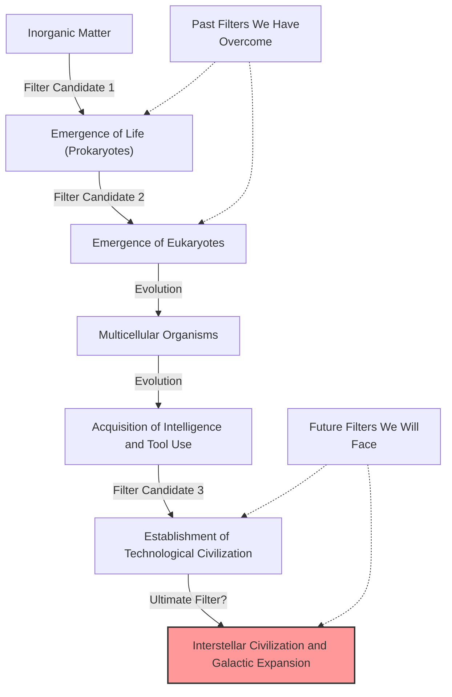
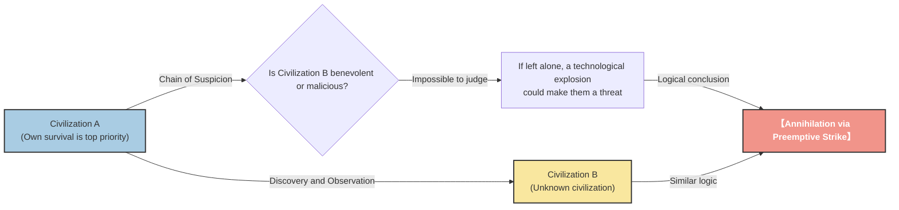

# Introduction: "Where is everybody?"

In the summer of 1950, in the cafeteria of the Los Alamos National Laboratory, Nobel Prize-winning physicist Enrico Fermi was having lunch with his fellow physicists (Edward Teller, Herbert York, and Emil Konopinski). Their conversation revolved around UFO sightings, which were making headlines in the media at the time, and the possibility of faster-than-light spaceships.

After the conversation shifted to another topic and some time had passed, Fermi suddenly and out of context asked:

**"Where is everybody?"**

His colleagues immediately understood that he was talking about extraterrestrials. Fermi's mind was known for its astonishing calculating ability. During the short time of lunch, he had roughly estimated the age of the universe, the number of stars in the Milky Way, the probability of life emerging, and the time it would take for a civilization to develop interstellar travel technology.

The conclusion shown by his calculations was clear: **"Extraterrestrial civilizations should have visited Earth a long time ago."** However, in reality, there is absolutely no clear evidence of this. This contradiction between the "high calculated probability" and the "lack of actual evidence" is exactly what would later become known as the **"Fermi Paradox,"** one of the greatest mysteries in modern astronomy and astrobiology.

In this article, we will thoroughly dive deep into the Fermi Paradox, from its background to the various answers (hypotheses) proposed by modern science. Let's embark on an intellectual journey to understand the scale of the universe and re-examine humanity's position in it.

---

# Chapter 1: The Scale of the Universe and the Drake Equation

At the root of the Fermi Paradox is the fact that "the universe is far too vast and too old." First, let's grasp the scale of the universe we live in using numbers.

## Overwhelming Numbers and Time

It is estimated that there are about 2 trillion galaxies in our observable universe. And each galaxy contains, on average, 100 billion to 400 billion stars. In other words, there are about $10^{24}$ stars in the entire universe, a number far greater than all the grains of sand on Earth combined.

In recent years, observations by the Kepler Space Telescope and others have revealed that many of these stars are accompanied by planets, and a significant percentage of them are Earth-like planets located in the "habitable zone" (a region where liquid water can exist). Even conservative estimates suggest there are billions to tens of billions of "second Earth" candidates in our Milky Way galaxy alone.

Furthermore, let's consider the scale of time. The age of the universe is about 13.8 billion years, and the age of the Earth is about 4.6 billion years. It has been only a few thousand years since humanity built a civilization, and barely over 100 years since we started using radio waves for communication. What if life sprouted and built a civilization on a planet that was born 1 billion years earlier than Earth? A billion years is an overwhelming amount of time, enough to repeat the history of human evolution thousands of times. Their technology must have reached a level beyond our imagination (for example, constructing Dyson spheres or colonizing the entire galaxy).

## The Drake Equation

When discussing the probability of the existence of extraterrestrial intelligent life, the "Drake Equation" always appears. Devised by astronomer Frank Drake in 1961, this equation is intended to estimate the number of extraterrestrial civilizations ($N$) in our galaxy that we could communicate with.

The equation is expressed as the product of the following elements:

$$ N = R_* \times f_p \times n_e \times f_l \times f_i \times f_c \times L $$

*   $R_*$ : The rate of star formation in our galaxy
*   $f_p$ : The fraction of those stars that have planetary systems
*   $n_e$ : The number of planets, per solar system, with an environment suitable for life
*   $f_l$ : The fraction of suitable planets on which life actually appears
*   $f_i$ : The fraction of life-bearing planets on which intelligent life emerges
*   $f_c$ : The fraction of civilizations that develop a technology that releases detectable signs of their existence into space
*   $L$ : The length of time such civilizations release detectable signals into space

The greatest feature of this equation lies not in "providing an answer," but in "clarifying the elements to be discussed." Regarding the left side of the equation ($R_*$, $f_p$, $n_e$), advances in astronomy have allowed us to produce fairly accurate values. However, the right side ($f_l$, $f_i$, $f_c$, $L$) still remains in the realm of speculation.

Optimistic astronomers (like Carl Sagan) argued that there are millions of civilizations in the galaxy. On the other hand, taking a pessimistic view, the result could be $N=1$ (meaning only humanity). However, if $N$ is quite large, we are forced to return to Fermi's question: "Where is everybody?"

---

# Chapter 2: Numerous Hypotheses Explaining the Silence

The answers to the Fermi Paradox can be broadly classified into three categories:

1.  **They don't exist in the first place** (Extraterrestrial life, or intelligent life, is extremely rare).
2.  **They exist, but we cannot perceive them** (Differences in communication methods, the barrier of distance, intentional silence, etc.).
3.  **They have already come to Earth, but we haven't noticed** (Or it is being covered up).

Let's dig deeper into representative hypotheses for each category.

## Category 1: They don't exist in the first place

### Rare Earth Hypothesis

This hypothesis argues that while simple life like microbes might be common in the universe, the evolution of complex intelligent life like humanity requires a combination of extremely rare astronomical and geological conditions.

*   **The existence of Jupiter:** Having a gas giant like Jupiter in the right position acts as a shield against asteroids and comets raining down on Earth, preventing massive impacts that could cause mass extinctions.
*   **The existence of a large Moon:** The presence of a disproportionately large moon compared to Earth stabilizes the tilt of the Earth's axis of rotation (about 23.4 degrees), maintaining moderate climate changes and seasons.
*   **Plate Tectonics and Geomagnetism:** Active plate movements promote the carbon cycle and properly maintain the greenhouse effect. In addition, a strong magnetic field protects the atmosphere and life from solar winds and cosmic rays.
*   **The nature of the star:** G-type main-sequence stars like the Sun have a moderately long lifespan (about 10 billion years) and stable energy radiation. The most common stars in the universe, red dwarfs (M-type stars), may have an environment that is too harsh for the evolution of life due to overly active flare activity and planets being tidally locked (always showing the same face to the star).

The idea is that the probability of all these "miraculous conditions" aligning is astronomically low, and therefore humanity is alone.

### The Great Filter Theory

Proposed by Robin Hanson in 1996, "The Great Filter" is one of the most terrifying yet persuasive answers to the Fermi Paradox.

It is the idea that in the process from the emergence of life to the development of an interstellar civilization, there exists a "great wall (filter)" that is extremely difficult to overcome.

The important point is: **"Is this filter in our past, or is it in our future?"**

*   **The filter is in the past (We are the lucky survivors):**
    The very emergence of life (abiogenesis) might have been a miraculous event. Alternatively, the evolutionary process from simple prokaryotes to eukaryotes with complex structures like mitochondria might have been a rare occurrence even in the history of the universe (it took about 2 billion years for this step on Earth). If so, humanity is one of the most advanced species in the universe.
*   **The filter is in the future (We are heading towards ruin):**
    This is a very bleak outlook. It is the hypothesis that even if the emergence of life and the establishment of intelligent civilizations are relatively common, civilizations are inevitably doomed to self-destruct before reaching the next stage of an "interstellar civilization." Nuclear war, runaway artificial intelligence, climate change, or unknown physical threats we haven't realized yet might mean that civilizations are destined to destroy themselves once they reach a certain level.

Some scientists argue that if fossils of single-celled organisms were found on places like Mars, it would mean that "the emergence of life is not a filter," greatly increasing the likelihood that the filter awaits us in our "future," making it the worst possible news for humanity.

---

## Category 2: They exist, but we cannot perceive them

A group of hypotheses suggesting that many civilizations exist, but for various reasons we haven't been able to find them, or they are intentionally avoiding contact.

### A Universe Too Vast and Time Too Short

Space is vastly larger than our intuition can grasp. Even traveling at the speed of light, it takes about 4.2 years to reach the nearest star, Proxima Centauri. At the speed of current Earth probes (like Voyager), it is a distance that would take tens of thousands of years.

There is also the barrier of "time." It has been about 100 years since humanity began radio communication. This means Earth's radio waves have only reached a radius of 100 light-years. Since the diameter of the Milky Way galaxy is about 100,000 light-years, the area where we are announcing our presence is merely a tiny speck in the entire galaxy.
Assuming the lifespan of a civilization is perhaps a few thousand or tens of thousands of years, the probability of two civilizations existing "simultaneously" during the 13.8 billion-year history of the universe and their timing aligning to catch each other's signals might be extremely low.

### Technological Mismatch

In "SETI" (Search for Extraterrestrial Intelligence), we are mainly looking for aliens using radio waves. However, this might just be because we only recently discovered radio waves.

For highly advanced civilizations, communication using radio waves might be considered as primitive and inefficient as "smoke signals" or a "tin can telephone." They might be communicating using unknown physical laws that we cannot yet even detect, such as neutrino communication, gravitational waves, or faster-than-light communication using quantum entanglement (hypothetically, though denied by physics). While we are desperately looking for smoke signals in the dark, they are in a state akin to communicating via fiber optics.

### Zoo Hypothesis

Proposed by John Ball in 1973, this hypothesis suggests that "advanced extraterrestrial civilizations are aware of Earth's existence but are intentionally avoiding interference to watch humanity evolve naturally."

It is the idea that Earth is treated as a kind of "isolated zoo" or "nature reserve," much like how we observe wild animals in a nature reserve. It is the same concept as the "Prime Directive" in Star Trek (non-interference with less advanced civilizations). Perhaps they will only make contact when humanity reaches a sufficient level of ethical and technological maturity (for example, establishing a world government without destroying ourselves, or developing interstellar travel technology).

### Dark Forest Theory

This is the most terrifying and ruthless hypothesis, made famous by Chinese sci-fi author Liu Cixin's global bestselling series "The Three-Body Problem." This hypothesis compares the universe to a "dark forest where every hunter is holding their breath and hiding."

It assumes the following two sociological axioms in the universe:
1.  Survival is the primary need of civilization.
2.  Civilization continuously grows and expands, but the total matter in the universe remains constant.

Furthermore, it introduces the concepts of the "chain of suspicion," where the tremendous distances between stars make it impossible to correctly understand each other's intentions, and the "technological explosion," where technology leaps forward via sudden mutations.

Suppose a Civilization A discovers another Civilization B. For Civilization A, there is no way to know whether Civilization B is friendly or hostile. Even if Civilization B's technology level is low now, there's no telling when they might trigger a "technological explosion," surpass Civilization A, and become a threat.
Therefore, the most rational and safe choice to ensure one's own survival is **"upon discovering another civilization, immediately destroy them before they realize it."**

According to this theory, the reason the universe is silent is clear. Any foolish civilization (like Earth) that carelessly emits radio waves and reveals its location is quickly wiped out, or all wise civilizations are holding their breath and hiding in the dark.

### Simulation Hypothesis

This is the hypothesis that the universe we live in is nothing more than a computer simulation created by a higher entity (a super-advanced civilization or AI). It is being seriously debated by philosophers like Nick Bostrom of Oxford University.

If we are inhabitants of a simulation, we will never meet aliens unless the programmer has programmed "other aliens" into this simulation. If this world is a sandbox simulated solely for humanity, the silence of the universe is a natural consequence.

---

# Chapter 3: Future Prospects and Challenges for Humanity

Scientists around the world are still tackling the Fermi Paradox through various approaches today.

## Search for Technosignatures

Traditional SETI looked for intentional communication signals (radio waves), but in recent years, the movement to search for "technosignatures" (traces of technology) has become active.
For example, if a "Dyson sphere," constructed by an advanced civilization to utilize the entire energy of a star, exists, peculiar infrared radiation should be observed from that star. The latest observation instruments like the James Webb Space Telescope (JWST) have the capability to analyze the atmospheric composition of distant exoplanets and search for industrial gases (like CFCs) that could not occur naturally, or artificial light signatures.

Instead of waiting for "them to speak to us," we are actively trying to find "traces that they are living there."

## What the Paradox Confronts Us With

The Fermi Paradox is not merely a sci-fi thought experiment. It is a powerful questioning of the survival and future of humanity itself.

If the "Great Filter" lies in the future, we are currently facing existential risks of our own making, such as climate change, the threat of nuclear weapons, and the control of AI. If we cannot overcome these, humanity will also have simply been one of the countless "failed civilizations" that vanished into the silence of the universe.

Conversely, if the Rare Earth Hypothesis is correct and humanity is the only intelligence miraculously born in this vast universe, we hold an immeasurable responsibility. As the entities that bring self-awareness to the universe, we may have a mission to keep the flame of consciousness alive, spreading it into the future, and someday to the stars.

Enrico Fermi's casual remark, "Where is everybody?", continues to shine as one of the most important questions in human history, making us think deeply about who we are and where we should be heading, even more than 70 years later.

Is the silence of the universe a warning to us, or is it a vast frontier waiting for us to take our first steps? Only the choices humanity makes from now on can provide the answer.
