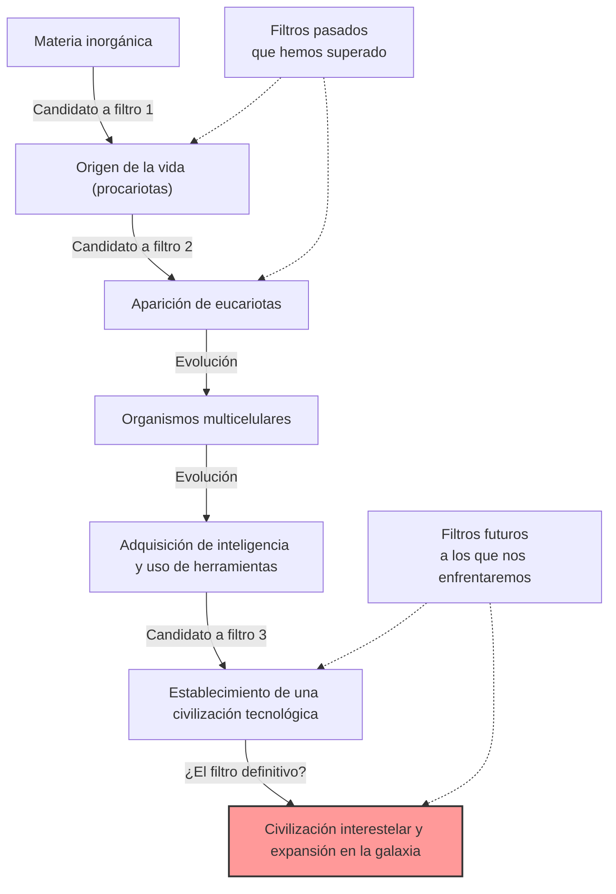
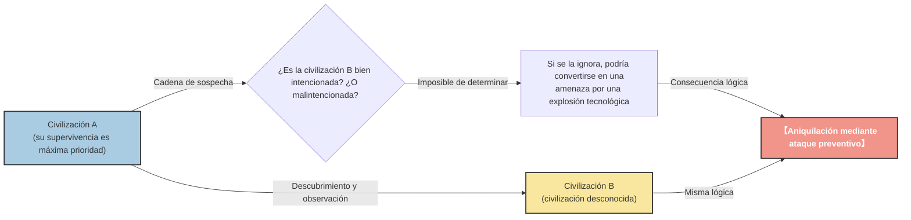

# Capítulo Introductorio: "¿Dónde está todo el mundo?"

En el verano de 1950, en la cafetería del Laboratorio Nacional de Los Álamos, el premio Nobel de física Enrico Fermi almorzaba con sus colegas físicos (Edward Teller, Herbert York y Emil Konopinski). Su tema de conversación era sobre los avistamientos de ovnis, que llenaban los medios en ese momento, y la posibilidad de naves espaciales más rápidas que la luz.

Después de que la conversación pasara a otro tema y transcurriera un tiempo, Fermi preguntó de repente y sin contexto:

**"¿Dónde está todo el mundo? (Where is everybody?)"**

Sus colegas entendieron de inmediato que estaba hablando de extraterrestres. El cerebro de Fermi era conocido por su asombrosa capacidad de cálculo. Durante el breve tiempo del almuerzo, había estimado la edad del universo, el número de estrellas en la galaxia, la probabilidad de que surgiera vida y el tiempo que le tomaría a una civilización desarrollar la tecnología de navegación interestelar.

La conclusión que mostraron sus cálculos fue clara: **"Las civilizaciones extraterrestres deberían haber visitado la Tierra hace mucho tiempo"**. Sin embargo, en realidad no hay ninguna evidencia clara de ello. Esta contradicción entre "una alta probabilidad calculada" y "la falta de evidencia en la realidad" es precisamente uno de los mayores misterios de la astronomía y la astrobiología modernas, que más tarde se conocería como la **"Paradoja de Fermi"**.

En este artículo, profundizaremos exhaustivamente en esta paradoja de Fermi, desde sus antecedentes hasta las diversas respuestas (hipótesis) presentadas por la ciencia moderna. Emprendamos un viaje intelectual para comprender la escala del universo y reexaminar la posición de la humanidad.

---

# Capítulo 1: La escala del universo y la Ecuación de Drake

En el núcleo de la paradoja de Fermi se encuentra el hecho de que "el universo es demasiado vasto y demasiado antiguo". Primero, intentemos captar la escala de este universo en el que vivimos con números.

## Números y tiempo abrumadores

Se estima que existen unos 2 billones de galaxias en nuestro universo observable. Y cada galaxia contiene, en promedio, entre 100 mil millones y 400 mil millones de estrellas. En otras palabras, en todo el universo hay aproximadamente $10^{24}$ estrellas, una cantidad mucho mayor que todos los granos de arena de la Tierra juntos.

En los últimos años, gracias a las observaciones de telescopios espaciales como el Kepler, hemos descubierto que muchas de estas estrellas están acompañadas de planetas, y que una proporción significativa de ellos son planetas terrestres situados en la "zona habitable" (la región donde puede existir agua líquida). Incluso con estimaciones conservadoras, solo en nuestra galaxia, la Vía Láctea, existen entre miles de millones y decenas de miles de millones de candidatos a una "segunda Tierra".

Consideremos además la escala de tiempo. La edad del universo es de unos 13.800 millones de años y la de la Tierra de unos 4.600 millones de años. Han pasado solo unos miles de años desde que la humanidad construyó su civilización, y poco más de 100 años desde que comenzamos a comunicarnos mediante ondas de radio. ¿Qué pasaría si la vida hubiera surgido y construido una civilización en un planeta nacido mil millones de años antes que la Tierra? Mil millones de años es un tiempo abrumador con el que la historia evolutiva de la humanidad podría repetirse miles de veces. Su tecnología debería haber alcanzado un nivel más allá de nuestra imaginación (por ejemplo, la construcción de esferas de Dyson o la colonización de toda la galaxia).

## La Ecuación de Drake

Al discutir la probabilidad de la existencia de vida extraterrestre inteligente, siempre aparece la "Ecuación de Drake". Ideada en 1961 por el astrónomo Frank Drake, esta ecuación sirve para estimar el número de civilizaciones extraterrestres ($N$) que existen en nuestra galaxia y con las que la humanidad podría comunicarse.

La ecuación se expresa como el producto de los siguientes factores:

$$ N = R_* \times f_p \times n_e \times f_l \times f_i \times f_c \times L $$

*   $R_*$ : La tasa de formación de estrellas en la galaxia
*   $f_p$ : La fracción de esas estrellas que tienen sistemas planetarios
*   $n_e$ : El número de planetas en esos sistemas planetarios con un entorno adecuado para la vida
*   $f_l$ : La fracción de esos planetas en los que realmente surge la vida
*   $f_i$ : La fracción de esa vida que evoluciona hacia vida inteligente
*   $f_c$ : La fracción de esa vida inteligente que desarrolla tecnología para la comunicación interestelar
*   $L$ : El tiempo que perdura tal civilización tecnológica

La mayor característica de esta ecuación no es "dar una respuesta", sino "haber aclarado los factores que deben discutirse". Para el lado izquierdo de la ecuación ($R_*$, $f_p$, $n_e$), los avances en astronomía nos han permitido obtener valores bastante precisos. Sin embargo, el lado derecho ($f_l$, $f_i$, $f_c$, $L$) sigue estando en el ámbito de las conjeturas.

Astrónomos optimistas (como Carl Sagan) argumentaron que podrían existir millones de civilizaciones en nuestra galaxia. Por otro lado, desde una perspectiva pesimista, el resultado podría ser $N=1$ (es decir, solo la humanidad). Pero si $N$ fuera bastante grande, volveríamos de nuevo a la pregunta de Fermi: "¿Dónde está todo el mundo?"

---

# Capítulo 2: Numerosas hipótesis que explican el silencio

Las respuestas a la paradoja de Fermi se pueden clasificar a grandes rasgos en tres categorías.

1.  **En primer lugar, no existen** (la vida extraterrestre, o vida inteligente, es extremadamente rara)
2.  **Existen, pero no podemos detectarlos** (diferencias en los métodos de comunicación, la barrera de la distancia, silencio intencional, etc.)
3.  **Ya han venido a la Tierra, pero no nos hemos dado cuenta** (o se ha encubierto)

Profundicemos en algunas de las hipótesis representativas de cada categoría.

## Categoría 1: En primer lugar, no existen

### La hipótesis de la Tierra Rara (Rare Earth)

Esta hipótesis sostiene que, si bien la vida simple como los microorganismos podría ser común en el universo, para que evolucione vida inteligente compleja como la humanidad, es necesario que coincidan condiciones astronómicas y geológicas extremadamente raras.

*   **La presencia de Júpiter:** Que un planeta gaseoso gigante como Júpiter se encuentre en la posición adecuada sirve como un escudo contra asteroides y cometas que se precipitan hacia la Tierra, evitando colisiones masivas que extinguirían la vida.
*   **La existencia de una luna gigante:** La presencia de una luna desproporcionadamente grande en comparación con la Tierra estabiliza la inclinación del eje de rotación de la Tierra (unos 23,4 grados), manteniendo cambios climáticos moderados y las cuatro estaciones.
*   **Tectónica de placas y campo magnético terrestre:** El activo movimiento de las placas tectónicas promueve el ciclo del carbono y mantiene adecuadamente el efecto invernadero. Además, un fuerte campo magnético protege la atmósfera y la vida de los vientos solares y los rayos cósmicos.
*   **Características de la estrella:** Las estrellas de la secuencia principal tipo G, como el Sol, tienen una vida útil moderadamente larga (unos 10 mil millones de años) y una radiación de energía estable. Las enanas rojas (estrellas tipo M), las más comunes en el universo, pueden tener una actividad de erupciones demasiado violenta o sus planetas pueden sufrir acoplamiento de marea (mostrando siempre la misma cara a la estrella), lo que podría ser un entorno hostil para la evolución de la vida.

La idea es que la probabilidad de que se reúnan todas estas "condiciones milagrosas" es astronómicamente baja, y por lo tanto, la humanidad está sola.

### Teoría del Gran Filtro (The Great Filter)

Propuesta por Robin Hanson en 1996, el "Gran Filtro" es una de las respuestas más aterradoras y a la vez convincentes a la paradoja de Fermi.

Es la idea de que existe una "gran barrera (filtro)" extremadamente difícil de superar en el proceso desde el surgimiento de la vida hasta el desarrollo de una civilización interestelar.

Lo importante es: **"¿Está este filtro en nuestro pasado, o está en nuestro futuro?"**

*   **El filtro estaba en el pasado (somos supervivientes afortunados):**
    El origen de la vida (abiogénesis) en sí mismo podría haber sido un evento milagroso. O quizás el proceso evolutivo de simples procariotas a eucariotas con estructuras complejas como las mitocondrias fue un evento raro en la historia del universo (en la Tierra este paso tomó alrededor de 2 mil millones de años). De ser así, la humanidad sería una de las especies más avanzadas del universo.
*   **El filtro está en el futuro (estamos condenados a la destrucción):**
    Esta es una perspectiva muy sombría. Incluso si el origen de la vida y el establecimiento de una civilización inteligente fueran relativamente comunes, la hipótesis sostiene que antes de alcanzar la siguiente etapa de "civilización interestelar", una civilización inevitablemente se autodestruye. Ya sea por una guerra nuclear, inteligencia artificial fuera de control, cambio climático o una amenaza física desconocida de la que aún no somos conscientes, una civilización podría estar destinada a destruirse a sí misma una vez que alcance cierto nivel.

Algunos científicos argumentan que si encontráramos fósiles de organismos unicelulares en Marte, significaría que "el origen de la vida no es el filtro", aumentando enormemente las posibilidades de que el filtro nos espere en nuestro "futuro", lo que sería la peor noticia posible para la humanidad.

---

## Categoría 2: Existen, pero no los hemos detectado

Este es un grupo de hipótesis en las que existen muchas civilizaciones, pero por diversas razones no hemos podido encontrarlas, o bien ellas están evitando el contacto intencionalmente.

### Un universo demasiado vasto y un tiempo demasiado corto

El espacio exterior es inmensamente más vasto de lo que nuestra intuición puede comprender. Incluso a la velocidad de la luz, tardaríamos unos 4,2 años en llegar a Proxima Centauri, la estrella vecina. A la velocidad de nuestras sondas espaciales actuales (como la Voyager), es una distancia que tomaría decenas de miles de años.

También existe la barrera del "tiempo". Ha pasado apenas un siglo desde que la humanidad comenzó a utilizar las comunicaciones por radio. Es decir, las ondas de radio de la Tierra solo han alcanzado un radio de 100 años luz. Dado que el diámetro de la Vía Láctea es de unos 100.000 años luz, la zona en la que estamos anunciando nuestra presencia no es más que un pequeño punto en toda la galaxia.
Si suponemos que la vida útil de una civilización es de unos pocos miles o decenas de miles de años, la probabilidad de que dos civilizaciones existan "simultáneamente" en los 13.800 millones de años de historia del universo, y que sus ventanas temporales se alineen para poder captar las señales de la otra, podría ser muy baja.

### Desajuste tecnológico

En "SETI (Búsqueda de Inteligencia Extraterrestre)", buscamos alienígenas principalmente utilizando ondas de radio. Sin embargo, esto es simplemente porque nosotros mismos descubrimos las ondas de radio recientemente.

Para una civilización altamente avanzada, la comunicación a través de ondas de radio podría considerarse primitiva e ineficiente, como "señales de humo" o "teléfonos de vaso e hilo". Es posible que utilicen comunicación de neutrinos, ondas gravitacionales, o comunicación superlumínica aprovechando el entrelazamiento cuántico (aunque está descartado físicamente, como hipótesis), o incluso leyes de la física desconocidas que aún no podemos detectar. Mientras buscamos desesperadamente señales de humo en la oscuridad, ellos podrían estar comunicándose con algo similar a la fibra óptica.

### Hipótesis del Zoológico (Zoo Hypothesis)

Esta hipótesis, propuesta por John Ball en 1973, sugiere que "las civilizaciones extraterrestres avanzadas conocen la existencia de la Tierra, pero evitan intencionalmente interferir para permitir que la humanidad evolucione naturalmente".

Es la idea de que la Tierra es tratada como una especie de "zoológico aislado" o "reserva", al igual que nosotros observaríamos a los animales salvajes en una reserva natural. Es el mismo concepto que la "Primera Directiva" (Prime Directive: no interferir en el desarrollo de civilizaciones menos avanzadas) que aparece en Star Trek. Podrían contactarnos solo cuando la humanidad alcance un nivel suficiente de madurez ética y tecnológica (por ejemplo, establecer un gobierno mundial sin autodestruirnos, desarrollar tecnología de navegación interestelar, etc.).

### Hipótesis del Bosque Oscuro (Dark Forest Theory)

Esta es la hipótesis más aterradora y despiadada, famosa por la exitosa serie de ciencia ficción de fama mundial "El problema de los tres cuerpos" del escritor chino Liu Cixin. Esta hipótesis compara el universo con un "bosque oscuro donde cada cazador se esconde conteniendo la respiración".

Como axiomas sociológicos en el universo, se presuponen los siguientes dos puntos:
1.  Para toda civilización, la supervivencia es la máxima prioridad.
2.  La cantidad total de materia en el universo es constante, y las civilizaciones buscan expandirse y desarrollarse constantemente.

A esto se le suma el concepto de la "cadena de sospecha" (donde las enormes distancias interestelares imposibilitan la comprensión correcta de las intenciones mutuas) y la "explosión tecnológica" (donde la tecnología da saltos exponenciales repentinos).

Supongamos que una civilización A descubre otra civilización B. Para la civilización A, no hay manera de saber si la civilización B es amistosa u hostil. Incluso si el nivel tecnológico de la civilización B es bajo ahora, no se sabe cuándo podría experimentar una "explosión tecnológica" que supere a la civilización A y se convierta en una amenaza.
Por lo tanto, la elección más racional y segura para garantizar su propia supervivencia es **"destruir cualquier otra civilización tan pronto como sea descubierta y antes de que se dé cuenta"**.

Siguiendo esta teoría, la razón por la que el universo está en silencio es clara: cualquier civilización insensata que emita ondas de radio imprudentemente y anuncie su posición (como la Tierra) será borrada inmediatamente, o bien, todas las civilizaciones sabias se esconden en la oscuridad conteniendo la respiración.

### Hipótesis de la Simulación

Esta es la hipótesis de que el universo mismo en el que vivimos no es más que una simulación por ordenador creada por una entidad superior (una civilización súper avanzada o IA). Filósofos de la Universidad de Oxford, como Nick Bostrom, lo debaten seriamente.

Si somos habitantes de una simulación, no encontraremos alienígenas a menos que el programador haya programado a "otros extraterrestres" en esta simulación. Si este mundo es un entorno cerrado simulado solo para la humanidad, entonces el silencio cósmico es un resultado natural.

---

# Capítulo 3: Perspectivas de futuro y desafíos de la humanidad

Científicos de todo el mundo siguen abordando la paradoja de Fermi desde diversos enfoques.

## La búsqueda de tecnomarcadores

El SETI tradicional buscaba señales de comunicación intencionales (ondas de radio), pero en los últimos años ha habido un movimiento activo hacia la búsqueda de "tecnomarcadores" (huellas tecnológicas).
Por ejemplo, si existiera una "Esfera de Dyson" construida por una civilización avanzada para aprovechar toda la energía de una estrella, se observaría una emisión infrarroja peculiar desde esa estrella. Instrumentos de observación modernos como el Telescopio Espacial James Webb (JWST) tienen la capacidad de analizar la composición atmosférica de exoplanetas lejanos y buscar gases industriales (como clorofluorocarbonos) que no podrían generarse naturalmente, así como huellas de luz artificial.

No estamos esperando que "ellos nos hablen", sino que estamos tratando de encontrar activamente "huellas de que viven allí".

## Lo que nos plantea la paradoja

La paradoja de Fermi no es un mero experimento mental de ciencia ficción. Es una profunda pregunta sobre la supervivencia y el futuro de la humanidad misma.

Si el "Gran Filtro" se encuentra en el futuro, entonces actualmente nos enfrentamos a riesgos existenciales (Existential Risk) que hemos creado nosotros mismos, como el cambio climático, la amenaza de las armas nucleares y el control de la IA. Si no podemos superarlos, la humanidad también habría sido simplemente otra de las incontables "civilizaciones fallidas" que desaparecieron en el silencio cósmico.

Por el contrario, si la hipótesis de la Tierra Rara es correcta y la humanidad es la única inteligencia milagrosamente nacida en este vasto universo, entonces tenemos una responsabilidad inmensa. Como seres que aportan autoconciencia al universo, quizás tengamos la misión de no dejar que se apague la luz de la consciencia y llevarla hacia el futuro, y algún día, hacia las estrellas.

Esa simple y casual pregunta de Enrico Fermi, "¿Dónde está todo el mundo?", sigue brillando más de 70 años después como una de las preguntas más importantes de la historia de la humanidad, haciéndonos reflexionar profundamente sobre quiénes somos y hacia dónde deberíamos dirigirnos.

¿El silencio cósmico es una advertencia para nosotros, o es una vasta frontera que nos espera para dar nuestro primer paso? La respuesta depende de las decisiones futuras de la humanidad.
