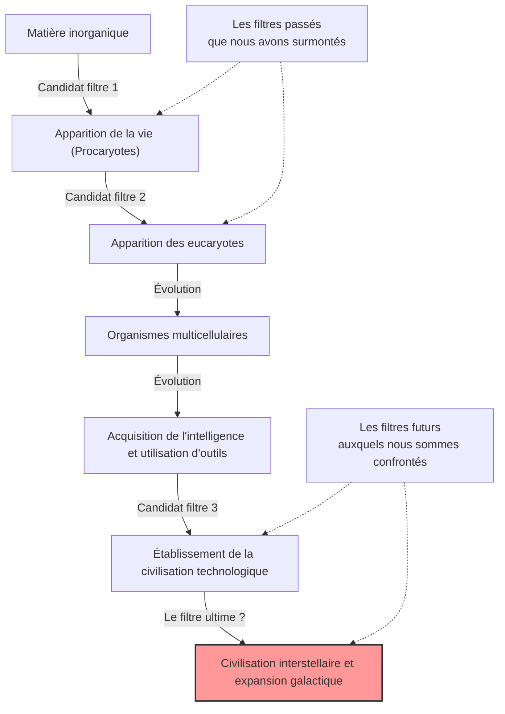
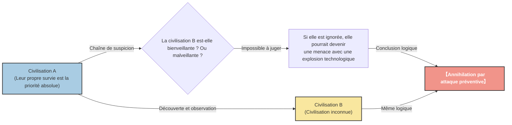

# Introduction : « Où est tout le monde ? »

Au cours de l'été 1950, à la cafétéria du laboratoire national de Los Alamos, le lauréat du prix Nobel de physique Enrico Fermi déjeunait avec ses collègues physiciens (Edward Teller, Herbert York et Emil Konopinski). Leur conversation portait sur les observations d'OVNI qui faisaient la une des médias à l'époque et sur la possibilité de vaisseaux spatiaux plus rapides que la lumière.

Après que la conversation eut dérivé sur un autre sujet, Fermi demanda soudainement, sans aucun lien :

**« Où est tout le monde ? (Where is everybody?) »**

Ses collègues ont immédiatement compris qu'il parlait des extraterrestres. L'esprit de Fermi était connu pour sa puissance de calcul phénoménale. Pendant le court laps de temps du déjeuner, il avait estimé l'âge de l'univers, le nombre d'étoiles dans la galaxie, la probabilité d'apparition de la vie, et le temps qu'il faudrait à une civilisation pour développer une technologie de navigation interstellaire.

La conclusion montrée par ses calculs était claire. **« Les civilisations extraterrestres auraient dû visiter la Terre il y a longtemps »**. Cependant, en réalité, il n'y a aucune preuve claire de cela. Cette contradiction entre « une probabilité élevée selon les calculs » et « l'absence de preuves réelles » est précisément l'un des plus grands mystères de l'astronomie moderne et de l'astrobiologie, qui sera plus tard appelé le **« paradoxe de Fermi »**.

Dans cet article, nous allons explorer en profondeur ce paradoxe de Fermi, de son contexte aux diverses réponses (hypothèses) présentées par la science moderne. Partons pour un voyage intellectuel pour comprendre l'échelle de l'univers et reconsidérer la position de l'humanité.

---

# Chapitre 1 : L'échelle de l'univers et l'équation de Drake

Au cœur du paradoxe de Fermi se trouve le fait que « l'univers est beaucoup trop vaste et trop ancien ». Tout d'abord, essayons de comprendre l'échelle de cet univers dans lequel nous vivons avec des chiffres.

## Un nombre et un temps écrasants

On estime qu'il y a environ 2 000 milliards de galaxies dans l'univers observable. Et chaque galaxie contient en moyenne 100 à 400 milliards d'étoiles. Cela signifie qu'il y a environ $10^{24}$ étoiles dans l'univers tout entier, un nombre bien supérieur à tous les grains de sable sur Terre réunis.

Ces dernières années, des observations effectuées par le télescope spatial Kepler ont révélé que bon nombre de ces étoiles ont des planètes, et qu'une proportion importante d'entre elles sont des planètes de type terrestre situées dans la « zone habitable » (où l'eau liquide peut exister). Même avec une estimation prudente, il existe des milliards à des dizaines de milliards de candidates pour une « deuxième Terre » rien que dans notre galaxie, la Voie lactée.

Considérons en outre l'échelle de temps. L'âge de l'univers est d'environ 13,8 milliards d'années et l'âge de la Terre est d'environ 4,6 milliards d'années. Cela ne fait que quelques milliers d'années que l'humanité a construit une civilisation, et un peu plus de 100 ans que nous avons commencé à communiquer par ondes radio. Que se passerait-il si la vie était apparue sur une planète née un milliard d'années avant la Terre et avait construit une civilisation ? Un milliard d'années est un laps de temps écrasant qui permettrait à l'histoire évolutive de l'humanité de se répéter des milliers de fois. Leur technologie doit avoir atteint un niveau dépassant notre imagination (par exemple, la construction de sphères de Dyson ou la colonisation de l'ensemble de la galaxie).

## L'équation de Drake

L'« équation de Drake » apparaît inévitablement lors de la discussion sur la probabilité de l'existence d'une vie extraterrestre intelligente. Conçue par l'astronome Frank Drake en 1961, cette équation vise à estimer le nombre de civilisations extraterrestres ($N$) présentes dans notre galaxie avec lesquelles l'humanité pourrait communiquer.

L'équation est exprimée par la multiplication des éléments suivants :

$$ N = R_* \times f_p \times n_e \times f_l \times f_i \times f_c \times L $$

*   $R_*$ : Taux de formation des étoiles dans notre galaxie
*   $f_p$ : Fraction de ces étoiles possédant un système planétaire
*   $n_e$ : Nombre de planètes dans ces systèmes ayant un environnement propice à la vie
*   $f_l$ : Fraction de ces planètes sur lesquelles la vie apparaît réellement
*   $f_i$ : Fraction de cette vie qui évolue vers une vie intelligente
*   $f_c$ : Fraction de cette vie intelligente qui possède la technologie pour la communication interstellaire
*   $L$ : Durée de vie d'une telle civilisation technologique

La principale caractéristique de cette équation n'est pas de « fournir une réponse », mais de « clarifier les éléments à discuter ». Pour le côté gauche de l'équation ($R_*$, $f_p$, $n_e$), les progrès de l'astronomie ont permis d'obtenir des valeurs assez précises. Cependant, pour le côté droit ($f_l$, $f_i$, $f_c$, $L$), cela reste du domaine de la spéculation.

Les astronomes optimistes (comme Carl Sagan) ont fait valoir qu'il existait des millions de civilisations dans la galaxie. En revanche, un point de vue pessimiste peut aboutir au résultat que $N=1$ (c'est-à-dire seulement l'humanité). Cependant, si $N$ est assez grand, nous revenons à la question de Fermi : « Où est tout le monde ? »

---

# Chapitre 2 : Diverses hypothèses expliquant le silence

Les réponses au paradoxe de Fermi peuvent être largement classées en 3 catégories.

1.  **Ils n'existent tout simplement pas** (La vie extraterrestre, ou du moins la vie intelligente, est extrêmement rare)
2.  **Ils existent, mais nous ne pouvons pas les détecter** (Différences dans les méthodes de communication, la barrière de la distance, le silence intentionnel, etc.)
3.  **Ils sont déjà venus sur Terre, mais nous ne l'avons pas remarqué** (Ou cela a été dissimulé)

Explorons en profondeur les hypothèses représentatives pour chaque catégorie.

## Catégorie 1 : Ils n'existent tout simplement pas

### L'hypothèse de la Terre rare (Rare Earth)

Cette hypothèse soutient que si la vie simple comme les microbes peut être courante dans l'univers, l'évolution d'une vie intelligente complexe comme l'humanité nécessite la convergence de conditions astronomiques et géologiques extrêmement rares.

*   **L'existence de Jupiter :** La présence d'une géante gazeuse comme Jupiter dans la bonne position agit comme un bouclier contre les astéroïdes et les comètes qui pourraient frapper la Terre, empêchant ainsi des impacts majeurs qui pourraient causer l'extinction de la vie.
*   **L'existence d'une lune massive :** L'existence d'une lune disproportionnellement grande par rapport à la Terre stabilise l'inclinaison de son axe de rotation (environ 23,4 degrés), maintenant un changement climatique modéré et les saisons.
*   **La tectonique des plaques et le géomagnétisme :** L'activité tectonique favorise le cycle du carbone et maintient l'effet de serre à un niveau approprié. De plus, un puissant champ magnétique protège l'atmosphère et la vie du vent solaire et des rayons cosmiques.
*   **La nature de l'étoile :** Une étoile de la séquence principale de type G comme le Soleil a une durée de vie raisonnablement longue (environ 10 milliards d'années) et une émission d'énergie stable. Les naines rouges (étoiles de type M), les plus courantes dans l'univers, peuvent avoir des éruptions trop actives ou des planètes en rotation synchrone (montrant toujours la même face à l'étoile), ce qui pourrait être un environnement difficile pour l'évolution de la vie.

L'idée est que la probabilité que toutes ces « conditions miraculeuses » soient réunies est astronomiquement faible, et par conséquent, l'humanité est seule.

### La théorie du grand filtre (The Great Filter)

Proposé par Robin Hanson en 1996, le « Grand Filtre » est l'une des réponses les plus terrifiantes et persuasives au paradoxe de Fermi.

C'est l'idée qu'il existe un « grand mur (filtre) » extrêmement difficile à surmonter dans le processus allant de l'émergence de la vie au développement d'une civilisation interstellaire.

Ce qui est important, c'est la question : **« Ce filtre est-il dans notre passé, ou dans notre avenir ? »**

*   **Le filtre était dans le passé (nous sommes des survivants chanceux) :**
    La naissance même de la vie (abiogenèse) a peut-être été un événement miraculeux. Ou le processus évolutif de simples procaryotes à des eucaryotes dotés de structures complexes comme les mitochondries a pu être un phénomène rare dans l'histoire de l'univers (cette étape a pris environ 2 milliards d'années sur Terre). Si c'est le cas, l'humanité serait l'une des espèces les plus avancées de l'univers.
*   **Le filtre est dans l'avenir (nous nous dirigeons vers la ruine) :**
    C'est une perspective très sombre. Même si l'apparition de la vie et l'établissement d'une civilisation intelligente sont relativement courants, c'est l'hypothèse que la civilisation s'autodétruira inévitablement avant d'atteindre le stade de « civilisation interstellaire ». Qu'il s'agisse d'une guerre nucléaire, de l'emballement de l'intelligence artificielle, du changement climatique ou d'une menace physique inconnue dont nous n'avons pas encore conscience, la civilisation est peut-être vouée à s'autodétruire une fois qu'elle atteint un certain niveau.

Certains scientifiques affirment que si des fossiles d'organismes unicellulaires étaient découverts sur Mars, cela signifierait que « l'apparition de la vie n'est pas un filtre », augmentant ainsi la probabilité que le filtre nous attende dans le « futur », ce qui serait la pire nouvelle pour l'humanité.

---

## Catégorie 2 : Ils existent, mais nous ne pouvons pas les détecter

C'est un groupe d'hypothèses selon lesquelles de nombreuses civilisations existent, mais pour diverses raisons, nous n'avons pas pu les trouver, ou ils évitent intentionnellement le contact.

### Un univers trop vaste et un temps trop court

L'espace est beaucoup plus vaste que notre intuition. Même à la vitesse de la lumière, il faut environ 4,2 ans pour atteindre l'étoile voisine, Proxima Centauri. Avec la vitesse des sondes terrestres actuelles (comme Voyager), c'est une distance qui prendrait des dizaines de milliers d'années.

De plus, il y a le mur du « temps ». Cela fait environ 100 ans que l'humanité a commencé à communiquer par ondes radio. En d'autres termes, les ondes radio de la Terre n'ont atteint qu'un rayon de 100 années-lumière. Le diamètre de la Voie lactée étant d'environ 100 000 années-lumière, la zone où nous avons fait connaître notre existence n'est qu'un point minuscule dans la galaxie entière.
Si la durée de vie d'une civilisation n'est que de quelques milliers ou dizaines de milliers d'années, dans l'histoire de 13,8 milliards d'années de l'univers, la probabilité que deux civilisations existent « simultanément » et que le moment où elles peuvent capter les signaux de l'autre coïncide peut être très faible.

### Inadéquation technologique

Dans la recherche d'intelligence extraterrestre (SETI), nous cherchons des extraterrestres principalement à l'aide d'ondes radio. Cependant, cela est dû uniquement au fait que nous avons récemment découvert les ondes radio.

Pour une civilisation très avancée, la communication radio pourrait être considérée comme primitive et inefficace, comme des « signaux de fumée » ou des « téléphones pot de yaourt ». Ils pourraient utiliser des communications par neutrinos, des ondes gravitationnelles, ou même des communications superluminiques utilisant l'intrication quantique (bien que physiquement nié, en supposant que ce soit possible), ou une autre méthode de communication basée sur des lois physiques inconnues que nous ne pouvons même pas encore détecter. Pendant que nous cherchons désespérément des signaux de fumée dans l'obscurité, ils communiquent peut-être par fibre optique.

### L'hypothèse du zoo (Zoo Hypothesis)

Proposée par John Ball en 1973, cette hypothèse suggère que « les civilisations extraterrestres avancées connaissent l'existence de la Terre, mais évitent intentionnellement toute interférence afin d'observer l'évolution naturelle de l'humanité ».

C'est l'idée que la Terre est traitée comme une sorte de « zoo isolé » ou de « réserve naturelle », tout comme nous observons les animaux sauvages dans des réserves naturelles. C'est le même concept que la « Directive Première (Prime Directive : interdiction d'interférer avec des civilisations moins avancées) » qui apparaît dans Star Trek. Ce n'est peut-être que lorsque l'humanité aura atteint une maturité éthique et technologique suffisante (par exemple, établir un gouvernement mondial sans s'autodétruire, développer la technologie du voyage interstellaire, etc.) qu'ils entreront en contact avec nous.

### L'hypothèse de la forêt sombre (Dark Forest Theory)

C'est l'hypothèse la plus terrifiante et impitoyable, rendue célèbre par le best-seller mondial « Le Problème à trois corps » de l'auteur de science-fiction chinois Liu Cixin. Cette hypothèse compare l'univers à « une forêt sombre où chaque chasseur se cache en retenant son souffle ».

Comme axiomes sociologiques dans l'univers, elle présume ce qui suit :
1.  Pour toutes les civilisations, la survie est la priorité absolue.
2.  La quantité totale de matière dans l'univers est constante, et les civilisations cherchent constamment à s'étendre et à se développer.

En outre, s'ajoutent les concepts de la « chaîne de suspicion », où il devient impossible de comprendre correctement les intentions de chacun en raison des distances interstellaires considérables, et de l'« explosion technologique », où la technologie fait un bond soudain en avant.

Supposons qu'une civilisation A découvre une autre civilisation B. Pour la civilisation A, il n'y a aucun moyen de savoir si la civilisation B est amicale ou hostile. Même si le niveau technologique de la civilisation B est actuellement bas, on ne sait pas quand elle pourrait déclencher une « explosion technologique » pour surpasser la civilisation A et devenir une menace.
Par conséquent, le choix le plus rationnel et le plus sûr pour assurer sa propre survie est **« de détruire toute autre civilisation immédiatement après sa découverte, avant qu'elle ne s'en rende compte »**.

Selon cette théorie, la raison pour laquelle l'univers est silencieux est claire. Toute civilisation imprudente qui émettrait des ondes radio et révélerait sa position (comme la Terre) serait rapidement anéantie, ou toutes les civilisations sages se cacheraient dans l'obscurité en retenant leur souffle.

### L'hypothèse de la simulation

C'est l'hypothèse selon laquelle l'univers dans lequel nous vivons n'est rien de plus qu'une simulation informatique créée par une entité supérieure (une civilisation ou une IA ultra-avancée). Elle a été sérieusement discutée par des philosophes comme Nick Bostrom de l'Université d'Oxford.

Si nous sommes les habitants d'une simulation, nous ne rencontrerons jamais d'extraterrestres à moins que les programmeurs n'aient programmé « d'autres extraterrestres » dans cette simulation. Si ce monde est un bac à sable simulé uniquement pour l'humanité, le silence de l'univers est une conséquence naturelle.

---

# Chapitre 3 : Perspectives futures et défis pour l'humanité

Des scientifiques du monde entier continuent de relever le défi du paradoxe de Fermi avec diverses approches.

## Recherche de technosignatures

Alors que le SETI traditionnel cherchait des signaux de communication intentionnels (ondes radio), le mouvement pour rechercher des « technosignatures (traces technologiques) » est devenu de plus en plus actif ces dernières années.
Par exemple, s'il existe une « sphère de Dyson » construite par une civilisation avancée pour utiliser toute l'énergie d'une étoile, des rayonnements infrarouges particuliers devraient être observés à partir de cette étoile. Les instruments d'observation de pointe tels que le télescope spatial James Webb (JWST) ont la capacité d'analyser la composition de l'atmosphère d'exoplanètes lointaines et de détecter les gaz industriels (tels que les chlorofluorocarbures) qui ne peuvent pas se produire dans la nature, ainsi que les traces de lumière artificielle.

Au lieu d'attendre « qu'ils nous parlent », nous essayons activement de trouver des « preuves de leur existence là-bas ».

## Ce que le paradoxe nous confronte

Le paradoxe de Fermi n'est pas qu'une simple expérience de pensée de science-fiction. C'est une question forte sur la survie et l'avenir de notre propre humanité.

Si le « Grand Filtre » se trouve dans le futur, nous sommes actuellement confrontés à des risques existentiels (Existential Risk) que nous avons nous-mêmes créés, tels que le changement climatique, la menace des armes nucléaires et le contrôle de l'IA. Si nous ne pouvons pas surmonter cela, l'humanité ne sera qu'une de ces innombrables « civilisations ratées » qui ont disparu dans le silence de l'univers.

Inversement, si l'hypothèse de la Terre rare est correcte et que l'humanité est la seule intelligence qui soit miraculeusement née dans ce vaste univers, nous avons une immense responsabilité. En tant qu'êtres apportant la conscience de soi à l'univers, nous pourrions avoir pour mission d'empêcher la flamme de la conscience de s'éteindre et de la répandre dans le futur, et un jour, vers les étoiles.

La question anodine d'Enrico Fermi, « Où est tout le monde ? », continue de briller plus de 70 ans plus tard comme l'une des questions les plus importantes de l'histoire humaine, nous incitant à réfléchir profondément à qui nous sommes et où nous devrions aller.

Le silence de l'univers est-il un avertissement pour nous, ou est-ce une vaste frontière qui n'attend que nous pour faire le premier pas ? La réponse à cette question dépend des choix que fera l'humanité à l'avenir.
